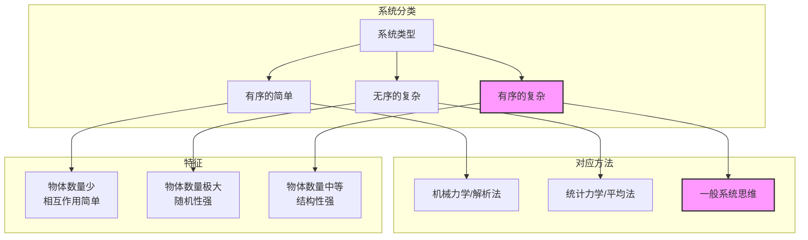
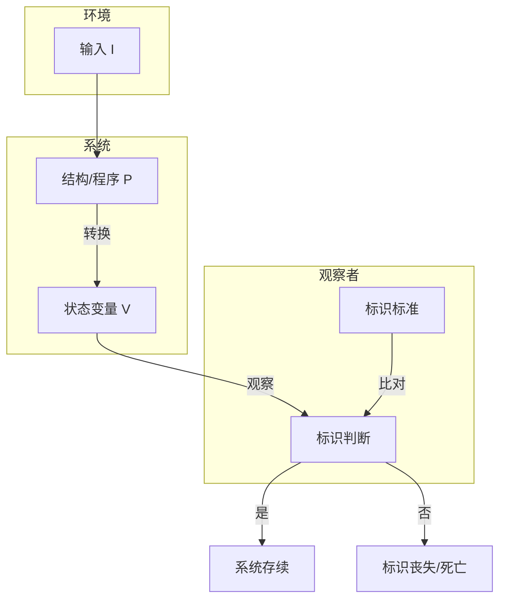

# 《系统化思维导论》章节总结

## 书籍信息
- **书名**：系统化思维导论 (An Introduction to General Systems Thinking)
- **作者**：[美] 杰拉尔德·温伯格 (Gerald M. Weinberg)
- **译者**：王海鹏
- **PDF 状态**：完整，包含封面、目录、正文、附录、参考文献
- **OCR 状态**：良好，文本可完整提取

## 目录说明
- 目录识别情况：完整识别，包含第1章至第7章及附录
- 章节对应依据：严格按原书目录顺序
- OCR 修复说明：无重大错漏

## 全书核心主题

本书旨在传授一种应对复杂系统（尤其是“中数系统”）的思维方法。作者认为，传统科学在处理“有序的简单”（机械力学）和“无序的复杂”（统计力学）时取得了巨大成功，但面对“有序的复杂”系统时则力不从心。一般系统思维正是为了填补这一空白，它通过整合不同学科的洞见，帮助读者掌握观察、分解和描述系统行为的一般法则。核心信念是：世界存在“二阶序”（规律的规律），通过归纳不同领域的规律，可以发现适用于一切系统的一般原理。全书强调观察者与被观察系统不可分割，任何观点都是互补的，而思维的核心任务是在有限的计算能力下，通过选择恰当的视角来简化对世界的理解。

---

## 第1章：问题

### 核心论点

**问题**：传统科学（如牛顿力学）为何在处理某些复杂系统（如生物、社会系统）时显得无力？**作者观点**：世界由大量“中数系统”构成，这些系统既复杂到无法精确计算，又有序到无法使用统计平均。机械论和统计力学的方法分别适用于“有序的简单”和“无序的复杂”，但对于介于两者之间的广阔领域（即中数系统）是无效的，这导致了许多社会和环境问题。

### 关键概念

- **中数定律**：对于中数系统，可以预计它与任何理论都或多或少地存在很大的波动、不规则性或偏差。这实际上是将墨菲定律（“凡是可能发生的，都会发生”）系统化。
- **计算的平方律**：随着系统中元素数量（n）的增加，所需计算的复杂程度至少按 n² 增长。这是限制我们处理复杂系统能力的根本物理约束。
- **大数定律**（N的平方根定律）：观测样本的数量越多，观测值越接近于预测的平均值；相对误差的数量级为 1/√n。这解释了为什么统计力学对大量粒子有效，但对少数粒子无效。
- **有序的简单 vs 无序的复杂 vs 有序的复杂**：分别对应机械力学、统计力学和一般系统论的研究领域。

### 逻辑推演

作者开篇指出人类正面临由自身成功带来的复杂性危机（如生态破坏）。他回顾牛顿力学的成功，指出其关键在于大量简化假设（如忽略小物体、只考虑两两作用、利用主导天体进行分解）。然而，这种“分解”策略的成功取决于系统的特殊性质。通过“计算的平方律”和“大数定律”，作者论证了经典方法对中数系统（如细胞、组织、人群）的失效。最后，他提出“中数定律”，强调这正是我们时代诸多问题的根源，并呼吁一种超越分析与平均的综合思维。

### 流程图

#### 系统类型与方法的对应关系



### 经典金句

> “带来麻烦的不是未知的东西，而是我们以为知道，实际却并非如此的东西。” ——威尔·罗杰斯 (p.1)

> “对于中数系统，我们可以预计它与任何理论都或多或少地存在很大的波动、不规则性或偏差。” (p.15)

---

## 第2章：方法

### 核心论点

**问题**：面对中数系统，我们应采用何种方法进行研究？**作者观点**：一般系统方法既不是僵化的机械还原论，也不是神秘的活力论。它是一种基于信念（相信存在“二阶序”）的归纳方法，通过在不同学科间进行类比和跳跃，寻找关于“规律”的一般规律。其本质不在于证明，而在于刺激思维，通过“愉快的特例”来提炼有用的“定律”。

### 关键概念

- **活力论 vs 简化论**：活力论将所有未知归结为“生命原动力”，简化论则试图将所有现象归结为物理化学原语。两者都是极端，系统思想家应取其中道，利用类比但不陷入模糊。
- **一般系统信念的主旨**：相信“经验世界的秩序本身也有秩序”（二阶序）。这种信念驱动通才在不同学科间进行归纳跳跃。
- **香蕉原理**：启发式思维方法不会告诉你何时停下来。这是对科学简化中潜在风险的警告。
- **定律保护定律**：如果事实和定律冲突，拒绝接受事实或改变定义，但绝不抛弃定律。这描述了科学如何在反例面前通过调整条件或定义来维护核心定律。
- **愉快的特例定律**：任何一般定律必须至少适用于两种具体情况，以防止过度一般化。

### 逻辑推演

作者首先批判了有机论类比（过于模糊）和简化论（过于自信），提出一般系统方法作为一种实用主义的第三条道路。为了理解不同学科的思维共性，作者借用人类学中的“思维类型系统”概念，区分了“狐狸”（通才）和“刺猬”（专才）。通才通过对“二阶序”的信念，在黑暗中跳跃，虽然可能犯错，但能快速把握整体。作者随后阐述了本书对“定律”的独特使用方式——它们不是绝对真理，而是易于记忆的格言（常以悖论形式出现），旨在启发而非束缚思维。最后，区分了系统思维的三种活动：促进思维、研究具体系统、创造新定律。

### 经典金句

> “枯燥乏味的理论与错误的理论差别非常大。” ——汉斯·塞里 (p.29)

> “如果你从来没说错，相当于什么也没说。” ——不爽的奇葩定律 (p.34)

> “整体大于部分之和。” ——组合定律 (p.35)

---

## 第3章：系统与幻相

### 核心论点

**问题**：什么是系统？系统是客观存在的实体，还是观察者的主观构建？**作者观点**：一个系统就是对世界的一种看法。任何关于系统的定义（如“物体的集合”）都依赖于观察者选择的视角和分类方式。观察者与被观察系统不可分离，“约束”是两者间的一种关系。绝对思维（认为存在独立于观察者的真理）会导致幻相。

### 关键概念

- **系统作为观点**：系统不是“在那里”的物体，而是观察者为了理解世界而采取的一种视角。诗人赫里克眼中的“边幅不修”和工程师眼中的“红灯/绿灯”都是有效的系统。
- **笛卡儿积（乘积空间）**：用于表示一个观察者所有可能观察结果的组合。它代表了观察者“视野范围”的理论上限。
- **无关法则**：定律不依赖于选择的特定符号。即，我们如何命名事物不应影响结论，但“差异法则”指出，事实往往相反——符号选择深刻影响思维。
- **观察者优于关系**：如果观察者B的观察结果可以完全预测观察者A的观察结果，则称B优于A。这引出了“超级观察者”的概念。
- **组合爆炸**：笛卡儿积的增长速度极快（指数级），这构成了我们认知能力的根本限制。

### 逻辑推演

本章以经典心理学图示（少女/老妇）开篇，论证“观点”的力量。作者指出，科学的基础——“外部世界独立于感知主体而存在的信念”——本身是一种启发式工具，而非绝对真理（香蕉原理）。通过棒球裁判的故事（“在我做出裁判之前，它们什么也不是”），作者将系统定义为观察者对集合元素的选择。接着引入集合论和笛卡儿积作为形式化工具，说明观察者的能力体现在其区分状态的范围和粒度上。最后通过“无关法则”和“优于关系”的比较，引出“超级观察者”的概念及其面临的组合爆炸困境，暗示了完全客观视角的不可行性。

### 流程图

#### 观察者优于关系

```mermaid
graph LR
    subgraph 观察者B（更精细）
        B1[中北美走鹃]
        B2[黄嘴鹃]
        B3[猎鹰]
    end

    subgraph 观察者A（更粗略）
        A1[杜鹃]
        A2[鹰]
    end

    B1 -- 映射 --> A1
    B2 -- 映射 --> A1
    B3 -- 映射 --> A2

    style B1 fill:#lightblue
    style B2 fill:#lightblue
    style B3 fill:#lightblue
    style A1 fill:#lightgreen
    style A2 fill:#lightgreen
```

### 经典金句

> “系统完全是人造的。……如果我们在系统中包含某个关系或者忽略它，我们可能做得对或不对。但是这种包含并不创造真理，忽略也不是谬误。” (p.51)

> “例外会证明规律” —— 格言的原始含义是“例外让规律接受测试” (p.46)

---

## 第4章：观察的解释

### 核心论点

**问题**：我们如何解释观察到的现象？如何区分“真实”规律和观察者引入的偏差？**作者观点**：观察结果取决于观察者的分辨能力（眼力）和记忆/推理能力（脑力）之间的平衡（眼-脑定律）。由于能力和资源的限制，我们必须将状态“揉团”才能学习（揉团定律），而不同的揉团方式会导致互补的、不可归约的观点（广义互补性原理）。

### 关键概念

- **状态**：一种在重现时可以被识别的情形。状态的定义本身就包含了观察者的“揉团”行为。
- **眼-脑定律**：在一定程度上，脑力（记忆、推理）可以弥补观察的不足，反之亦然。
- **广义热力学定律**：在没有特殊限制的情况下，出现概率大的状态比出现概率小的状态更容易被观察到。这既可能因为物理原因（第一定律），也可能因为精神原因（观察者的预期和分类习惯）。
- **揉团定律**：如果我们想学点什么，一定不能想着什么都学。我们必须将不同的微观状态合并为有意义的宏观状态。
- **广义互补性原理**：任何两种观点都是互补的。源于观察者无法同时获得全部信息，且观察行为本身会影响系统。

### 逻辑推演

作者通过“黑箱”思想实验，让读者扮演“超级观察者”观察一个带有灯和哨子的音乐盒。起初，系统看似状态确定（循环），但一旦观察者与之互动（踢它），行为模式改变。当引入其他观察能力有限的观察者（分不清音调、忽略灯光）时，同一个系统表现出不同的行为（确定的 vs. 随机的）。这引出了“眼-脑定律”：观察的不足可以用记忆来补偿。作者随后提出“揉团定律”，强调学习即是有选择地忽略差异。最后，通过收费站测速的类比（位置和速度无法同时精确测量），引出“广义互补性原理”，指出在社会科学和生物学中，由于观察者无法避免与被观察系统交互，互补观点是常态。

### 流程图

#### 黑箱状态观察模型

```mermaid
graph TD
    subgraph 真实世界
        Box[黑箱<br>实际状态空间]
    end

    subgraph 观察者A（超级）
        A_State[区分24种状态]
        A_Det[观察到确定循环]
    end

    subgraph 观察者B（物理学家）
        B_State[只区分6种音调]
        B_Rand[观察到随机行为]
        B_Mem[需要记忆历史状态]
    end

    Box --> A_State
    Box --> B_State

    A_State --> A_Det
    B_State -- 眼-脑定律 --> B_Mem
    B_Mem --> B_Det[通过记忆变得确定]

    style Box fill:#ddd,stroke:#333
    style A_State fill:#lightblue
    style B_State fill:#lightcoral
```

### 经典金句

> “如果我们想学点什么，一定不能想着什么都学。” ——揉团定律 (p.92)

> “任何两种观点都是互补的。” ——一般互补定律 (p.106)

---

## 第5章：观察结果的分解

### 核心论点

**问题**：如何将一个复杂系统分解成更易理解的部分？分解的方式是任意的吗？**作者观点**：分解依赖于观察者选择的“性质”或“属性”，而这些选择往往受到习惯和经验的影响（差异法则：“定律不应该依赖于特定的符号表示，但事实往往相反”）。真正的系统往往连接紧密（强连接定律），无法被完美地分解成独立的、可隔离的部分。

### 关键概念

- **差异法则**：尽管理论上定律不应依赖于符号，但实际上，我们选择什么作为系统的“部分”或“性质”会深刻影响我们的理解和分析结果。
- **不变法则**：要理解变化，只有通过观察什么保持不变。要理解恒久，只有通过观察什么发生了转换。性质和转换是成对定义的。
- **强连接定律**：平均来说，系统连接的紧密程度在平均水平之上。系统元素之间的联系比松散组织要紧密，使得“一次改变一个因素”的策略常常失效。
- **反射性、对称性、传递性**：数学上定义“分割”的三个条件。科学中的很多分类（如颜色、物种、朋友）由于感知的JND（最小可觉差）或关系的本质，往往不满足传递性，导致分类模糊。

### 逻辑推演

本章以“鸡蛋胖胖”音乐盒的故事开篇。观察者因醉酒（记忆受限）被迫将系统分解为“灯光子系统”和“声音子系统”。但发明者引入了“亮格度”和“米穆斯”这两种观察者“看不见”的新性质，使得144个看似不可分解的音乐盒变成了两个独立循环的简单系统。这揭示了“差异法则”：我们选择的分解方式（即观察世界的隐喻）决定了我们能否发现规律。作者进而讨论“事物与边界”的隐喻，指出物理边界（如皮肤）并不等同于系统边界（如人体周围的空气）。最后，通过数学上的等价关系（反射、对称、传递）指出，现实世界中的分类（如物种、颜色）往往因“最小可觉差”而不满足传递性，导致分割的模糊性。这引出了“强连接定律”：值得研究的系统，其内部连接往往比我们想象的更紧密。

### 经典金句

> “在系统中，其他事物很少保持不变。” ——强连接定律的另一形式 (p.142)

> “要理解变化，只有通过观察什么保持不变。要理解恒久，只有通过观察什么发生了转换。” ——不变法则 (p.135)

---

## 第6章：行为的描述

### 核心论点

**问题**：如何描述和预测系统的行为？**作者观点**：描述行为有两种互补的方法：“黑盒”法（仅观察输入输出）和“白盒”法（构建仿真模型）。状态空间和时序图是强大的可视化工具，但它们都是更高维现实的投影，必然丢失信息（图像法则）。系统的行为取决于其初始状态、输入序列以及观察者定义状态的方式。我们永远无法确定观察到的约束是来自系统内部还是环境（不确定性法则）。

### 关键概念

- **白盒仿真**：通过构建一个能产生相同行为的模型（如计算机程序）来理解系统。成功不在于复制，而在于用更少的部件生成复杂行为。
- **状态空间**：一个n维空间，其中每个点代表系统的一个可能状态。行为线在此空间中移动。
- **图像法则**：在谈到降维（如从三维投影到二维）时，务必加上“的图像”几个字，以提醒自己信息已丢失。
- **不确定性法则**：我们无法确定观察到的约束应该归因于系统还是归因于环境（或观察者自身）。这是系统思维中的核心认识论难题。
- **同终系统**：无论初始状态如何，最终都会达到相同状态的系统。

### 逻辑推演

作者首先介绍“白盒”仿真（如OCCULT俱乐部模型），强调模型应比原系统更简单才有解释力。接着引入“状态空间”概念，通过二维生态图谱和尼克立方体说明投影必然导致信息丢失和可能的误解（图像法则）。时序图作为另一种工具，能同时展示多个变量随时间的变化，但时间尺度的选择会完全改变对“快慢”的判断。最后，通过OCCULT俱乐部的仿真实验，作者展示了系统行为如何受初始状态和输入序列影响，并通过“不确定性法则”指出：观察者永远无法区分一个“随机”系统和由未知输入驱动的开放系统。计算机硬件故障与软件Bug的经典故事生动说明了这一点。

### 流程图

#### 白盒仿真流程（OCCULT俱乐部）

```mermaid
graph TD
    Start[初始会员等级数组 d[1..n]] --> GetPair[获取输入对 (i, j)]
    GetPair --> Multiply[t = d[i] * d[j]]
    Multiply --> Update[d[j] = t 的最后一位]
    Update --> Display[显示状态]
    Display -->|循环| GetPair

    subgraph 环境
        Input[输入序列 (i, j) 对]
    end

    Input --> GetPair

    style Start fill:#lightgreen
    style Input fill:#lightblue
```

### 经典金句

> “如果行为线自交叉，则要么：（1）系统不是由状态确定的；要么：（2）你看到的是一个投影，一个不完整的视图。” ——历时法则 (p.165)

> “我们无法确定观察到的约束应该归因于系统还是归因于环境。” ——不确定性法则 (p.188)

---

## 第7章：一些系统问题

### 核心论点

**问题**：系统为何能保持稳定？为何会变化？我们如何识别一个系统？**作者观点**：系统的稳定性、存续性和标识都是观察者与系统相互作用的结果，而非系统的内在属性。“稳定”意味着在观察者定义的边界内变化；“存续”取决于系统能否在环境中维持其“标识”；而“标识”本身是观察者为简化认知而采用的、相对持久的属性集合。系统通过“调节”（行为变化）和“适应”（结构变化）来维持标识，二者的区分是相对的（旧车定律）。

### 关键概念

- **系统三元论**：三个核心问题——(1)为什么我会看到我所看到的一切？(2)为什么事物会保持不变？(3)为什么事物会发生变化？
- **稳定性**：系统在环境扰动的预期范围内，其关键变量保持在可接受界限内的能力。稳定≠不动。
- **标识**：系统存在的同义词。是指观察者用以识别系统是否“还是那个系统”的一组属性或行为模式。
- **调节与适应**：调节是系统在固定结构下维持标识的行为变化；适应是系统改变自身结构（程序）以维持标识的变化。二者的界限由观察者定义。
- **旧车定律**：(1)调节作用发挥得很好的系统不需适应性变化；(2)系统可以通过适应性变化来简化它的调节工作。解释了为何压力是变化的催化剂。

### 逻辑推演

本章作为全书总结，回到“存在、行为、进化”的三元框架。首先讨论“稳定性”，指出稳定不是绝对属性，而是关于系统、环境和观察者定义的“可接受界限”三者间的关系。接着讨论“存续性”和“标识”，通过OCCULT系统展示，达到“全1”状态在理论上必然，但时间尺度远超宇宙年龄，因此在实际观察中从未发生。这揭示了标识与时间尺度的关系。通过“冠蓝鸦被染红”的比喻，说明标识取决于观察者选择的“不变性”标准。作者区分“调节”和“适应”，指出其界限是模糊的（如同舞者与舞蹈）。最后以“旧车定律”总结：压力（调节成本上升）是适应性变化的驱动力，这一原理适用于生物学、精神病学乃至观察者自身世界观的改变。

### 流程图

#### 系统的存续与标识



### 经典金句

> “唯有变化，才是永恒。” ——赫拉克利特 (p.200)

> “为什么我会看到我所看到的一切？为什么事物会保持不变？为什么事物会发生变化？” ——系统三元论 (p.201)

> “结构上的微小变化通常会导致行为上的微小变化。” ——效果定律 (p.220)