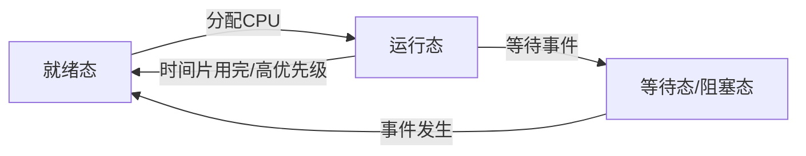
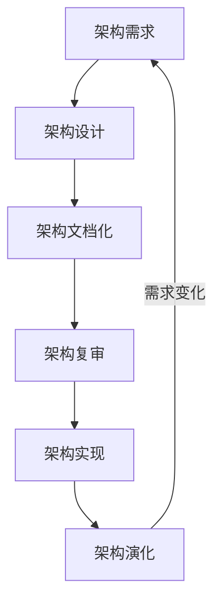

# 《系统架构设计师32小时通关（51cto）》章节总结

## 书籍信息
- **书名**：系统架构设计师考试内部资料（32小时通关版）
- **主编**：薛大龙、邹月平
- **副主编**：严洪翔、孙烈阳
- **PDF 状态**：文本可识别，结构清晰，包含大量练习题与解析。
- **OCR 状态**：良好，少量公式和图表需人工逻辑重建。

## 目录说明
本书以“小时”为单元，共分为26个主要学习模块（部分章节合并或跳过），覆盖系统架构设计师考试大纲的核心知识点。内容从基础概念到高级架构设计，再到项目管理与法律法规。

## 全书核心主题
本书旨在帮助考生通过全国计算机技术与软件专业技术资格（水平）考试中的“系统架构设计师”高级资格考试。全书围绕系统架构设计的核心能力展开，包括：
1. **基础理论**：操作系统、数据库、网络、多媒体及性能工程。
2. **架构设计**：软件架构风格、基于架构的开发方法（ABSD）、特定领域软件架构（DSSA）、架构评估（SAAM/ATAM）。
3. **建模与设计**：UML建模、设计模式、面向构件设计、面向服务架构（SOA）。
4. **新兴技术与集成**：XML技术、企业集成架构、面向方面编程（AOP）、嵌入式系统。
5. **管理与安全**：信息系统规划、项目管理、信息安全、知识产权。
6. **实战技巧**：通过大量真题解析，强化对考点的理解和应用。

---

## 第1小时：系统架构设计师概述

### 核心论点
本章主要解决“什么是系统架构设计师”以及“其职责与素质要求”的问题。作者认为系统架构设计师是技术与管理的复合型人才，负责非功能性需求的确认、核心构架搭建及技术细节澄清。

### 关键概念/事件
- **现代信息系统架构三要素**：构件、模式、规划。
- **系统架构设计师定义**：负责理解和管理非功能性需求（可维护性、性能等），给出开发规范，搭建核心构架的高级技术人员。
- **角色区别**:
    - vs 产品经理：编剧 vs 导演。产品经理关注商业与业务，架构师关注技术实现。
    - vs 项目经理：架构师推动技术发展，项目经理管理资源与进度。
    - vs 系统分析师：分析师关注业务建模与需求，架构师关注技术框架与实现保障。

### 逻辑推演/叙事脉络
首先定义现代信息系统架构的概念及层次（概念层与物理层）。接着明确系统架构设计师的职业定位，强调其兼具技术与管理素质。最后对比其与产品经理、项目经理、系统分析师的区别，厘清职责边界，指出架构师是信息系统开发和演进的全方位技术与管理人才。

### 经典金句/数据
> “系统架构设计师主要着眼于系统的‘技术实现’，同时还要考虑系统的‘组织协调’。”

---

## 第2小时：计算机与网络基础知识

### 核心论点
本章解决系统架构师所需掌握的底层计算机科学知识问题。作者强调架构师需“上知天文，下知地理”，重点涵盖操作系统进程管理、数据库事务与规范化、网络协议及安全。

### 关键概念/事件
- **操作系统进程状态**：三态模型（运行、就绪、等待）与五态模型（增加静止就绪、静止阻塞）。
- **PV操作与信号量**：解决并发中的互斥与同步问题。互斥信号量初值为1，同步信号量初值通常为0。
- **数据库范式**：1NF（原子性）、2NF（消除部分依赖）、3NF（消除传递依赖）、BCNF。
- **事务ACID特性**：原子性、一致性、隔离性、持久性。
- **OSI七层模型**：物理层至应用层的功能划分。
- **网络存储技术**：DAS、NAS、SAN。

### 逻辑推演/叙事脉络
从操作系统入手，讲解进程管理与死锁处理（银行家算法）。转入数据库系统，阐述三级模式结构、E-R模型、规范化理论及事务控制。随后介绍计算机网络基础，包括OSI模型、TCP/IP协议栈、网络分类及安全要素。最后简述多媒体压缩标准（JPEG/MPEG）及系统性能评估（阿姆达尔定律）。

### 流程图/图表重建

**进程三态模型转换**



**生产者-消费者信号量机制**

```mermaid
graph TD
    P_Producer[生产者] -->|P(empty)| Buffer[缓冲区]
    Buffer -->|V(full)| C_Consumer[消费者]
    C_Consumer -->|P(full)| Buffer
    Buffer -->|V(empty)| P_Producer
    subgraph 互斥保护
    Mutex[Mutex信号量]
    end
```

### 经典金句/数据
> “死锁的4个必要条件：互斥条件、请求保持条件、不可剥夺条件、环路条件。打破任何一个即可避免死锁。”

---

## 第3小时：信息系统基础知识

### 核心论点
本章解决信息化背景下的信息系统规划与应用模式问题。作者指出信息化分为五个层次，企业信息化需遵循效益、一把手等原则，并介绍了ERP、CRM、SCM等典型应用。

### 关键概念/事件
- **信息化体系六要素**：信息资源（核心）、信息技术应用（龙头）、信息网络（基础）、信息技术和产业、信息化人才（关键）、政策法规和标准规范（保障）。
- **信息系统生命周期**：立项、开发、运维、消亡。
- **开发方法**：结构化方法、原型化方法、面向对象方法、面向服务方法。
- **规划方法**：关键成功因素法（CSF）、战略目标集转化法（SST）、企业系统规划法（BSP）。
- **电子商务模式**：B2B, B2C, C2C。

### 逻辑推演/叙事脉络
首先概述信息化的定义、层次及国家发展战略。接着介绍信息系统工程的总体规划方法（CSF, SST, BSP）。最后详细列举信息化的典型应用，包括电子政务（G2G/G2B等）、电子商务及其支撑体系，以及企业内部的ERP、CRM、SCM和门户系统。

### 经典金句/数据
> “企业竞争中的‘大’吃‘小’，正在转向为‘快’吃‘慢’。”

---

## 第4小时：系统开发基础知识

### 核心论点
本章解决软件开发过程中的方法论、需求管理及设计基础问题。作者强调敏捷方法的适应性，以及需求变更控制的严格程序。

### 关键概念/事件
- **软件开发模型**：瀑布模型（严格顺序）、原型模型（可视化需求）、螺旋模型（风险分析）、敏捷方法（适应性、以人为本）。
- **RUP核心**：用例驱动、以体系结构为中心、迭代与增量。“4+1”视图模型。
- **需求管理**：建立基线、变更控制（CCB决策）、需求跟踪链。
- **设计方法**：结构化（DFD）、面向对象（类图、状态图）。
- **软件重用**：横向重用（跨领域）、纵向重用（同领域）。
- **逆向工程**：从代码恢复设计，分为实现级、结构级、功能级、领域级。

### 逻辑推演/叙事脉络
介绍各种软件开发模型及其适用场景，重点对比传统方法与敏捷方法。深入讲解需求管理的原则与变更流程。简述结构化与面向对象的设计方法差异。最后探讨软件重用策略及逆向工程在维护中的作用。

### 经典金句/数据
> “敏捷方法是‘适应性’而非‘预设性’的……敏捷方法是以人为本，而不是以过程为本。”

---

## 第5小时：软件架构设计

### 核心论点
本章解决软件架构的核心概念、设计风格及评估方法问题。作者认为架构设计是降低成本、改进质量的关键，并详细介绍了经典架构风格及评估技术。

### 关键概念/事件
- **软件架构定义**：构件、连接件、约束。
- **ABSD方法**：基于架构的软件开发，包括需求、设计、文档化、复审、实现、演化六个子过程。
- **经典架构风格**：
    - 管道-过滤器：数据流处理。
    - 分层系统：相邻层交互。
    - C2风格：构件通过连接件通信，无直接连接。
    - 事件驱动、仓库风格。
- **DSSA**：特定领域软件架构，活动包括领域分析、设计、实现。
- **架构评估**：
    - SAAM：侧重可修改性。
    - ATAM：侧重多质量属性权衡（性能、可用性、安全性、可修改性）。
    - 关键概念：敏感点、权衡点、风险承担者、场景。

### 逻辑推演/叙事脉络
首先定义软件架构及其重要性。介绍基于架构的开发方法（ABSD）的流程。详细列举并对比多种软件架构风格（管道过滤器、分层、C2等）。接着介绍特定领域软件架构（DSSA）的建立过程。最后重点讲解系统架构评估方法，对比SAAM与ATAM的特点及应用场景。

### 流程图/图表重建

**ABSD开发过程**



### 经典金句/数据
> “一个体系结构定义一个词汇表和一组约束。词汇表包含构件和连接件。”

---

## 第6小时：UML建模与架构文档化

### 核心论点
本章解决如何使用UML进行系统建模及架构文档化的问题。作者强调UML是沟通桥梁，重点讲解各类图的用途及“4+1”视图模型。

### 关键概念/事件
- **UML图分类**：
    - 静态图：类图、对象图、包图。
    - 行为图：用例图、序列图、协作图、状态图、活动图。
    - 实现图：构件图、部署图。
- **用例关系**：包含（include）、扩展（extend）、泛化（generalize）。
- **类关系**：关联、聚集、组合、泛化、依赖。
- **“4+1”视图**：
    - 逻辑视图：功能需求，类图。
    - 进程视图：并发与同步，性能。
    - 开发视图：静态组织结构，模块。
    - 物理视图：软硬件映射，部署。
    - 场景视图：用例，串联其他视图。
- **面向对象设计类**：实体类、边界类、控制类。

### 逻辑推演/叙事脉络
介绍UML的基础概念及各类图的定义。详细解析用例图中的关系类型。讲解类图及其关系。重点阐述“4+1”视图模型在架构文档化中的应用，说明每个视图关注的侧重点。最后结合面向对象设计，说明边界类、控制类、实体类的作用。

### 经典金句/数据
> “逻辑视图支持功能性需求……进程视图捕捉设计的并发和同步特征……物理视图描述软件到硬件的映射。”

---

## 第7小时：设计模式

### 核心论点
本章解决如何通过设计模式提高代码复用性、可理解性及可靠性的问题。作者将23种设计模式分为创建型、结构型、行为型三类，并详解其应用场景。

### 关键概念/事件
- **六大原则**：单一职责、里氏替换、依赖倒置、接口隔离、迪米特、开闭原则。
- **创建型模式**：单例、工厂方法、抽象工厂、建造者、原型。
- **结构型模式**：适配器、桥接、组合、装饰、外观、享元、代理。
- **行为型模式**：观察者、策略、模板方法、命令、责任链、状态、中介者、访问者等。

### 逻辑推演/叙事脉络
首先介绍设计模式的六大基本原则。随后按类别逐一介绍典型模式：
1. **创建型**：关注对象实例化，如单例模式保证唯一实例。
2. **结构型**：关注类/对象组合，如适配器解决接口不兼容，桥接分离抽象与实现。
3. **行为型**：关注对象间职责分配，如策略模式封装算法，观察者模式解耦发布订阅。
通过具体案例（如滚动条装饰、广告发布桥接）说明模式选择依据。

### 经典金句/数据
> “依赖倒置原则是指抽象不应该依赖于细节，细节应当依赖于抽象。换言之，要针对接口编程，而不是针对实现编程。”

---

## 第8小时：XML技术

### 核心论点
本章解决XML及其相关技术在数据交换与表现层设计中的应用问题。作者指出XML作为标记语言，在界面配置和数据传输中具有灵活性和标准化优势。

### 关键概念/事件
- **XML基础**：可扩展标记语言，自描述，平台无关。
- **DTD vs Schema**：DTD语法简单但功能有限；Schema基于XML，支持命名空间，类型丰富。
- **XSL/XPath**：XSL用于样式转换，XPath用于节点定位。
- **XML在GUI中的应用**：
    - 界面配置：静态定义。
    - 界面动态生成：运行时解析XML生成界面。
    - 界面定制：用户修改XML属性保存偏好。
    - 设计模式体现：策略模式（不同解析器解析同一XML）。

### 逻辑推演/叙事脉络
介绍XML的定义、特点及命名空间。对比DTD与Schema的优劣。简述XSL、XPath、XLink等相关规范。重点通过商业银行个人银行系统案例，分析如何利用XML实现表现层的灵活配置、动态生成和定制，并指出其背后隐含的策略模式思想。

### 经典金句/数据
> “从设计模式的角度来说，整个XML表现层解析的机制是一种策略模式。”

---

## 第9小时：面向构件的软件设计

### 核心论点
本章解决软件复用中构件技术的概念、标准及组装问题。作者认为构件是实现软件生产线和工厂技术的基础，重点在于解决组装失配问题。

### 关键概念/事件
- **构件定义**：符合接口标准、可独立部署、可替换的软件单元。
- **获取方法**：现有构件修改、遗留工程提取、购买COTS、新开发。
- **开发策略**：分区、抽象、分割。
- **主流标准**：CORBA、COM/DCOM、EJB。
- **组装失配**：
    - 构件失配：基础设施、控制模型、数据模型冲突。
    - 连接子失配：交互协议、数据格式冲突。
- **GENESYS规范接口**：链接接口（LIF）、局部接口、技术相关接口（TDI）、技术无关接口（TII）。

### 逻辑推演/叙事脉络
定义构件及其特性。介绍构件的获取途径与开发策略。列举主流构件标准（CORBA, COM, EJB）。重点讨论构件组装中的失配问题及其分类。最后通过嵌入式BSP驱动案例，详细说明符合GENESYS规范的构件四类接口的具体功能设计。

### 经典金句/数据
> “构件是可以实现特定的功能，符合一套接口标准并实现一组接口，在系统中实际存在的可更换部分。”

---

## 第10小时：构件平台与典型架构

### 核心论点
本章解决不同厂商构件平台（OMG, Sun, Microsoft）的技术特点与对比问题。作者通过对比CORBA、Java EE、.NET，帮助架构师选择合适的技术底座。

### 关键概念/事件
- **OMG/CORBA**：跨语言、跨平台，核心是ORB，IDL定义接口。
- **Sun/Java**：JavaBean（客户端）、EJB（服务端容器管理）、Servlet/JSP（Web）。
- **Microsoft**：COM（二进制接口标准）、DCOM（分布式）、.NET（CLR通用语言运行时）。
- **对比**：COM不支持实现继承，支持包含与聚集；CORBA支持多语言互操作。

### 逻辑推演/叙事脉络
分别介绍OMG的CORBA体系（IDL, ORB, 服务）、Sun的Java构件体系（Bean, EJB, Servlet）以及Microsoft的COM/.NET体系。对比各平台在对象重用、接口继承、分布式通信等方面的异同。最后通过练习题强化对各平台核心组件（如Applet, EJB, COM接口）的理解。

### 经典金句/数据
> “COM不支持任何形式的实现继承……一旦公布，COM接口和其他的规范不允许以任何形式改变。”

---

## 第11小时：信息安全技术

### 核心论点
本章解决信息系统中的加密、认证、协议及安全管理问题。作者强调对称与非对称加密的结合使用，以及多层次的安全防护体系。

### 关键概念/事件
- **加密算法**：
    - 对称：DES, IDEA（速度快，密钥管理难）。
    - 非对称：RSA（速度慢，用于密钥交换/签名）。
- **安全协议**：
    - IPSec：网络层，AH/ESP。
    - SSL：传输层与应用层之间，Web安全。
    - PGP：邮件安全，混合加密。
    - Kerberos：票据认证，防重放（时间戳）。
- **数字信封**：对称加密数据，非对称加密密钥。
- **数据库加密**：透明加密（管理简单）vs API加密（灵活但复杂）。

### 逻辑推演/叙事脉络
介绍对称与非对称加密原理及典型算法。详解IPSec、SSL、PGP等安全协议的工作层次与机制。通过高校财务系统案例，对比物理隔离方案与虚拟化方案的优劣。通过局域网安全平台案例，分析公钥认证的优势、数字信封的加密流程（流加密原因）及数据库透明加密的选择依据。

### 经典金句/数据
> “PGP应用程序优点：速度快、效率高、可移植性好。……用IDEA算法对明文加密，接着用接收者的RSA公钥对这个IDEA密钥进行加密。”

---

## 第12小时：系统安全架构设计

### 核心论点
本章解决如何从整体架构层面设计信息系统安全的问题。作者提出基于风险策略，从应用、存储、主机、网络、物理五个层次构建安全体系。

### 关键概念/事件
- **安全五要素**：机密性、完整性、可用性、可控性、不可抵赖性。
- **OSI安全服务**：鉴别、访问控制、数据机密性、数据完整性、抗抵赖性。
- **数据库安全**：
    - 完整性设计：列级、元组级、关系级约束。
    - 评估标准：TCSEC（橘皮书）。
- **RADIUS架构**：AAA（认证、授权、审计），三层架构（协议、业务、数据）。

### 逻辑推演/叙事脉络
概述信息安全特征与威胁。介绍ISO/OSI安全体系架构的五类服务。重点讲解数据库系统的安全设计，包括完整性约束原则与设计阶段。简述RADIUS软件的三层架构设计及其负载均衡策略。最后通过论文题指引，要求结合项目论述五大安全服务的实现手段。

### 经典金句/数据
> “数据库的完整性是指数据库中数据的正确性和相容性……能够防止合法用户使用数据库时向数据库中添加不合语义的数据。”

---

## 第13小时：系统的可靠性分析

### 核心论点
本章解决软件可靠性的定义、建模、评价及设计管理问题。作者指出可靠性是规定条件下规定时间内不失效的概率，并介绍容错设计技术。

### 关键概念/事件
- **可靠性定义**：概率函数，依赖输入和使用。
- **可靠性指标**：可靠度、平均失效时间（MTTF）、故障强度。
- **可靠性设计技术**：
    - 容错：恢复块、N版本程序设计、冗余设计。
    - 检错：检测对象、延时、实现方式、处理方式。
- **软件测试 vs 调试**：测试找错，调试定位修正。
- **确认测试**：Alpha（内部）、Beta（用户）、验收测试。

### 逻辑推演/叙事脉络
定义软件可靠性及其定量描述。介绍影响可靠性的因素及建模方法（种子法、失效率类等）。讲解可靠性评价模型的选择与数据收集。重点阐述可靠性设计技术（容错、检错、降低复杂度）及管理阶段。最后区分测试与调试的目的及过程差异。

### 经典金句/数据
> “在规定的条件下，在规定的时间内，软件不引起系统失效的概率。”

---

## 第14小时：基于ODP的架构师实践

### 核心论点
本章解决开放分布式处理（ODP）参考模型在架构开发中的应用问题。作者介绍ODP的五个视点及架构师在各阶段的任务。

### 关键概念/事件
- **ODP五个视点**：企业视图、信息视图、计算视图、工程视图、技术视图。
- **架构师任务**：
    - 构想阶段：统一认识，确定需求顺序。
    - 需求分析：考察功能、性能、约束等。
    - 系统转换与维护：新旧系统替换，移植计划。
- **逆向工程抽象层次**：实现级（语法树）、结构级（依赖关系）、功能级、领域级。

### 逻辑推演/叙事脉络
介绍ODP参考模型的五个视点及其对应内容。阐述架构师在系统构想、需求分析、架构设计、系统转换与维护各阶段的具体工作与价值。通过逆向工程抽象层次的例题，巩固对代码恢复设计的理解。

### 经典金句/数据
> “构想阶段，架构师及早介入的好处：有利架构师对系统的认识更全面、准确；有利统一开发人员的思想和看法。”

---

## 第15小时：架构师的管理实践

### 核心论点
本章解决软件架构中的组织管理障碍问题，引入VRAPS原则。作者认为管理原则与技术同等重要，强调构想、节奏、预见、协作、简化。

### 关键概念/事件
- **VRAPS原则**：
    - Vision（构想）：确立方向。
    - Rhythm（节奏）：可预测的活动序列（速度、质量、内容）。
    - Anticipation（预见）：预测、验证、调整。
    - Partnership（协作）：受益人合作。
    - Simplification（简化）：最小化复杂性。
- **RUP 4+1视图**：逻辑、实现、进程、部署、用例。

### 逻辑推演/叙事脉络
介绍VRAPS五大组织管理原则及其相互作用。详细解释每个原则的定义及付诸实践的准则、模式与反模式。结合RUP的4+1视图，说明如何通过多视角获得利益相关者的一致性。

### 经典金句/数据
> “节奏是一个架构团体的内部及架构团体与供应者、客户等之间重复出现的、可以事先预测的一系列活动。”

---

## 第16小时：层次式架构设计

### 核心论点
本章解决典型分层架构（表现层、中间层、持久层）的设计问题。作者重点讲解MVC模式、ORM技术及异构数据库访问的工厂模式应用。

### 关键概念/事件
- **表现层**：MVC模式（Model, View, Controller），基于XML的界面管理。
- **持久层数据访问模式**：
    - 在线访问。
    - DAO（数据访问对象）。
    - DTO（数据传输对象）。
    - 离线数据模式。
    - ORM（对象关系映射，如Hibernate）。
- **ORM优缺点**：降低代码量，屏蔽SQL差异；复杂查询难，性能略低。
- **工厂模式**：解决异构数据库访问，抽象工厂创建一系列相关对象。

### 逻辑推演/叙事脉络
介绍软件体系结构定义。详解表现层MVC设计模式及XML动态生成思想。重点对比在线访问与ORM方式的优劣，解释为何在缺乏DB经验且应用简单时选择ORM。通过电商网站改造案例，说明增加数据访问层的原因及利用抽象工厂模式实现异构数据库切换的方案。

### 经典金句/数据
> “ORM方式优点：降低学习和开发成本；减少程序代码量；降低由于SQL代码质量差带来的影响。”

---

## 第17小时：企业集成架构设计

### 核心论点
本章解决企业信息集成平台（EIP）的概念、功能及关键技术问题。作者指出集成经历了从数据到过程再到服务的演进。

### 关键概念/事件
- **EIP基本功能**：通信服务、信息集成、应用集成、二次开发、运行管理。
- **集成模式**：
    - 数据集成：联邦、复制、接口。
    - 应用集成：适配器、信使、面板、代理。
    - 面向过程集成 vs 面向服务集成（SOA）。
- **关键技术**：EDI, XML, STEP, CORBA, J2EE, Web Service。

### 逻辑推演/叙事脉络
定义企业集成平台及其基本功能。分析集成技术的发展趋势（2层到N层，过程到服务）。详细介绍数据集成、应用集成的多种模式。列举常用的数据交换格式及分布式应用集成基础框架（CORBA, COM+, J2EE, Web Service）。最后通过练习题区分企业内部集成的不同层次（技术、数据、应用、过程）。

### 经典金句/数据
> “面向服务的集成，主要是为支持大范围内的公共业务过程集成而提出的一种动态集成方式。”

---

## 第18小时：面向方面的编程

### 核心论点
本章解决横切关注点（如日志、事务）的代码分散问题，引入AOP技术。作者对比AspectJ与Spring AOP的特点。

### 关键概念/事件
- **AOP核心概念**：Joint point（连接点）、Point cut（切入点）、Advice（通知）、Aspect（方面）。
- **AOP步骤**：分解关注点、单独编码、联结器重组。
- **实现技术**：
    - AspectJ：语言扩展，编译期织入，应用广泛。
    - Spring AOP：运行时代理，依赖小，一站式解决方案。

### 逻辑推演/叙事脉络
介绍AOP的概念及其对OOP的补充作用，解释核心术语。简述AOP的程序设计步骤。对比当前主流的AOP实现技术，指出AspectJ在应用广度上的优势及Spring AOP在框架依赖性上的优势。

### 经典金句/数据
> “AOP引入‘横切’的技术，解开封装。”

---

## 第19小时：嵌入式系统设计

### 核心论点
本章解决嵌入式系统的基本概念、组成及开发设计问题。作者强调嵌入式系统的专用性、实时性及资源受限特点。

### 关键概念/事件
- **嵌入式系统三要素**：嵌入性、专用性、计算机系统。
- **组成**：硬件平台、支撑硬件、操作系统、应用软件。
- **RTOS评价指标**：中断响应时间、任务切换时间、信号量混洗时间（任务执行时间不是实时性指标）。
- **硬件抽象层（HAL）**：隐藏硬件多样性，并行开发。
- **看门狗**：定时器超时复位，防止程序跑飞。
- **调试接口**：JTAG。

### 逻辑推演/叙事脉络
定义嵌入式系统及其特点。介绍系统基本结构及嵌入式操作系统分类。简述嵌入式数据库及网络类型。重点讲解开发模型（瀑布、螺旋等）及开发环境。通过练习题强化对HAL、RTOS实时性指标、看门狗机制及JTAG调试接口的理解。

### 经典金句/数据
> “硬件抽象层是位于操作系统内核与硬件电路之间的接口层，其目的在于将硬件抽象化。”

---

## 第20小时：面向服务的架构

### 核心论点
本章解决SOA的核心概念、协议栈及实施原则问题。作者指出SOA通过松散耦合的服务实现系统集成。

### 关键概念/事件
- **SOA协议栈**：
    - SOAP：消息传输规范（封装、编码、RPC、绑定），基于HTTP/XML。
    - WSDL：服务描述语言。
    - UDDI：服务注册与发现。
    - BPEL：业务流程执行语言，编排服务。
- **REST**：基于HTTP动词（GET/POST等）的资源操作，无状态，轻量级。
- **设计原则**：明确接口、自包含、粗粒度、松耦合、互操作性。

### 逻辑推演/叙事脉络
介绍SOA的特性及基本Web服务协议（SOAP, WSDL, UDDI）。详解SOAP的组成部分及BPEL在服务编排中的作用。对比SOAP与REST，指出REST的简单性与无状态特征。最后通过练习题巩固对各协议功能的记忆。

### 经典金句/数据
> “REST是一种只使用HTTP和XML进行基于Web通信的技术……所有的操作都是无状态的。”

---

## 第21小时：案例研究

### 核心论点
本章通过具体案例（FEAF, Web服务）展示架构分析方法。作者强调价值驱动及联邦企业架构框架的应用。

### 关键概念/事件
- **价值驱动因素**：价值期望、反作用力、变革催化剂。
- **FEAF**：联邦企业体系结构框架，分为业务、数据、应用程序、技术四部分。
- **Web服务适配器**：消息分发与确认。
- **UML需求分析步骤**：用例图表示需求，包图/类图表示总体架构。

### 逻辑推演/叙事脉络
介绍价值模型核心特征。简述使用RUP和UML开发联邦企业体系框架（FEAF）的方法。分析Web服务基础实现框架中适配器的作用及WSDL的细节。最后总结基于UML的需求分析与架构表示方法。

### 经典金句/数据
> “联邦企业体系结构框架（FEAF）把企业体系结构分为4部分：业务、数据、应用程序、技术。”

---

## 第22小时：信息系统项目管理

### 核心论点
本章解决项目管理的基础知识、生命周期模型及组织结构影响问题。作者对比瀑布、螺旋、敏捷等模型，并介绍PMBOK过程组。

### 关键概念/事件
- **项目特点**：临时性、独特性、渐进明细。
- **生命周期模型**：
    - 瀑布：需求明确，阶段严格。
    - 螺旋：风险分析，迭代。
    - V模型：开发与测试对应。
    - 敏捷：迭代增量，适应变化。
- **组织结构**：职能型、矩阵型（弱/平衡/强）、项目型。
- **PMBOK过程组**：启动、计划、执行、监控、收尾。
- **PRINCE2**：基于流程的结构化方法，七大原则。

### 逻辑推演/叙事脉络
定义项目及项目管理。介绍项目管理知识体系（PMBOK, IPMA, PRINCE2）。分析不同组织结构对项目的影响。详解信息系统项目生命周期及典型模型（瀑布、螺旋、迭代、V模型、原型、敏捷）。最后梳理单个项目的五大管理过程组及其对应的十大知识领域。

### 经典金句/数据
> “螺旋模型强调了风险分析，特别适用于庞大而复杂的、高风险的系统。”

---

## 第23小时：信息技术服务知识

### 核心论点
本章解决IT服务、运维、运营及治理的概念区分问题。作者强调ITSM以客户为中心，IT治理对齐战略目标。

### 关键概念/事件
- **IT服务特性**：无形性、不可分离性、异质性、易消失性。
- **运维 vs 运营**：运维是技术支持（GB/T 28827.1四要素：人员、资源、技术、过程）；运营是经营管理过程。
- **IT治理**：利益最大化制度安排，目标与战略一致。
- **ITSM**：二次转换（梳理、打包），以客户为中心。
- **质量管理**：PDCA循环，七种旧工具（排列图、因果图等），七种新工具。
- **信息安全等级保护**：五级划分（自主、审计、标记、结构化、验证）。

### 逻辑推演/叙事脉络
区分产品、服务与IT服务。辨析运维、运营与经营的内涵。介绍IT治理的目标与内容。详解IT服务管理（ITSM）的核心思想与基本原理。介绍质量管理理论（戴明环、六西格玛）及工具。最后简述信息安全管理体系及等级保护制度。

### 经典金句/数据
> “ITSM的核心思想是，IT组织不管是组织内部的还是外部的，都是IT服务提供者，其主要工作就是提供低成本、高质量的IT服务。”

---

## 第24小时：管理科学基础知识

### 核心论点
本章解决运筹学在架构师考试中的应用问题，包括最小生成树、最大流量、决策论及线性规划。

### 关键概念/事件
- **最小生成树**：Prim算法、Kruskal算法。
- **最大流量**：增广路径法，各路径最小值之和。
- **决策论**：
    - 乐观准则（大中取大）。
    - 悲观准则（小中取大）。
    - 后悔值准则（最小最大后悔值）。
- **线性规划**：列方程求最优解。
- **动态规划**：背包问题，单位利润优先。

### 逻辑推演/叙事脉络
通过具体例题讲解最小生成树的求解过程。演示最大流量网络的计算方法。介绍三种决策准则及其计算步骤。通过线性规划和动态规划（背包问题）例题，展示资源分配的最优化求解思路。

### 经典金句/数据
> “后悔值准则：在每一方案中选取最大的后悔值，再在各方案的最大后悔值中选取最小值作为决策依据。”

---

## 第25小时：知识产权与标准规范

### 核心论点
本章解决软件著作权、专利权、商标权的归属及保护期问题，以及软件工程国家标准。

### 关键概念/事件
- **著作权**：
    - 职务作品：一般归作者，单位优先使用；特殊职务作品（利用物质技术条件/合同约定）归单位，作者有署名权。
    - 委托作品：合同约定，无约定归受托人。
    - 保护期：作者终生+50年；署名权、修改权、保护作品完整权不受限制。
- **专利权**：发明20年，实用新型/外观设计10年。先申请原则。
- **商标权**：注册有效期10年，续展。
- **标准**：GB（国标）、SJ（电子行业）、DB（地方）、Q（企业）。

### 逻辑推演/叙事脉络
介绍知识产权的范围与特性。详解著作权法中关于职务作品、委托作品的权属规定及保护期。简述专利法与商标法的关键点（申请原则、有效期）。列举软件工程相关国家标准（术语、生存周期过程、质量模型）。通过案例题强化对权属判定的理解。

### 经典金句/数据
> “如无相反证明，在软件上署名的自然人、法人或者其他组织为开发者。”

---

## 第26小时：专业英语

### 核心论点
本章解决架构师考试中常见的专业英语词汇与概念理解问题。

### 关键概念/事件
- **Architectural Style**：Component, Connector, Constraints.
- **Nonfunctional Requirements**：Operational, Performance, Security, Cultural/Political.
- **Application Architecture**：Logical DFD, ERD, Physical DFD.
- **Software Architecture Reconstruction**：Information extraction, View fusion, Visualization.

### 逻辑推演/叙事脉络
选取架构风格、非功能需求、应用架构、软件架构重用等主题的英文段落进行解析。翻译并解释关键术语，如Module structures, Component-and-connector structures, Allocation structures等。通过填空题形式训练对上下文语境中专业词汇的把握。

### 经典金句/数据
> “System architecture is concerned with a total system, including hardware, software, and humans.”

---

## 模拟试题解析摘要

*注：书中包含两套完整的模拟试题（上午选择+下午案例/论文），以下提炼核心考点。*

### 上午题高频考点
1.  **操作系统**：PV操作信号量取值、索引节点计算（直接/一级/二级间接索引范围）、双缓冲时间计算。
2.  **数据库**：自然连接投影运算、候选关键字推导、事务转储（动态全局）、DiffServ模型（DS码点）、IPv6链路本地地址（MAC前缀）。
3.  **网络**：管理距离、基准测试、Web服务器性能指标（吞吐量、并发数、延迟，不含丢包率）。
4.  **架构与设计**：管道过滤器（编译器）、黑板风格（语音识别）、解释器/规则系统（自定义流程）、C2风格（顶部底部连接规则）。
5.  **安全**：三重DES密钥长度（112位）、被动攻击（流量分析）、软件著作权保护对象（不含处理过程）。
6.  **数学建模**：动态规划投资分配、数学模型评价（无反馈机制）。

### 下午案例题核心思路
1.  **质量属性识别**：
    - 可用性：故障恢复时间、重启时间。
    - 性能：响应时间、吞吐量。
    - 安全性：加密、认证、审计。
    - 可修改性：模块化、接口适配。
    - 易用性：界面风格、自定义。
2.  **架构风格对比**：
    - 管道过滤器 vs 数据仓储：交互方式（顺序vs星型）、数据结构（数据流vs文件/模型）、控制结构（数据流驱动vs业务驱动）。
    - 解释器/隐式调用：用于动态脚本、事件驱动（断点命中）。
3.  **UML建模**：
    - 参与者：人、时间、外部系统。
    - 用例关系：包含（必须执行）、扩展（条件执行）。
    - 类关系：聚合（弱拥有）、组合（强拥有）、关联。
4.  **嵌入式实时系统**：
    - 实时性分类：强/弱硬实时、时间触发/事件触发。
    - 错误链：Error（人为）-> Defect（代码中）-> Fault（运行时状态）-> Failure（外部行为）。
5.  **J2EE/SSH架构**：
    - MVC映射：Struts（Controller/View辅助）、Spring（Business/Integration）、Hibernate（Model/Persistence）。
    - 组件：Applet, Servlet, EJB (Session/Entity).
6.  **Scrum敏捷**：
    - 流程：Product Backlog -> Sprint计划 -> Daily Standup -> Review/Retrospective -> Increment.
    - 工件：Burn-down chart.

### 下午论文题写作框架
1.  **论软件系统架构评估**：
    - 背景：项目简介。
    - 质量属性：性能、可用性、安全性、可修改性定义。
    - 方法：SAAM（可修改性）或ATAM（权衡分析），步骤与效果。
2.  **论软件设计模式及其应用**：
    - 背景：项目简介。
    - 分类：创建型、结构型、行为型。
    - 应用：选取1-2种模式（如单例、策略、观察者），描述问题、解决方案、效果。
3.  **论数据访问层设计技术**：
    - 背景：项目简介。
    - 技术：DAO, ORM (Hibernate/iBATIS), DTO。
    - 应用：选型理由、实施过程、调优（缓存、批量抓取）。
4.  **论微服务架构及其应用**：
    - 背景：项目简介。
    - 特点：独立部署、轻量通信、去中心化、容错。
    - 应用：服务拆分、API网关、问题解决（分布式事务、监控）。