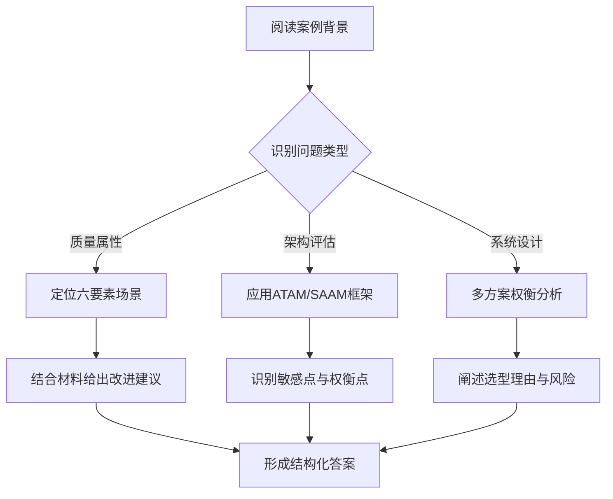
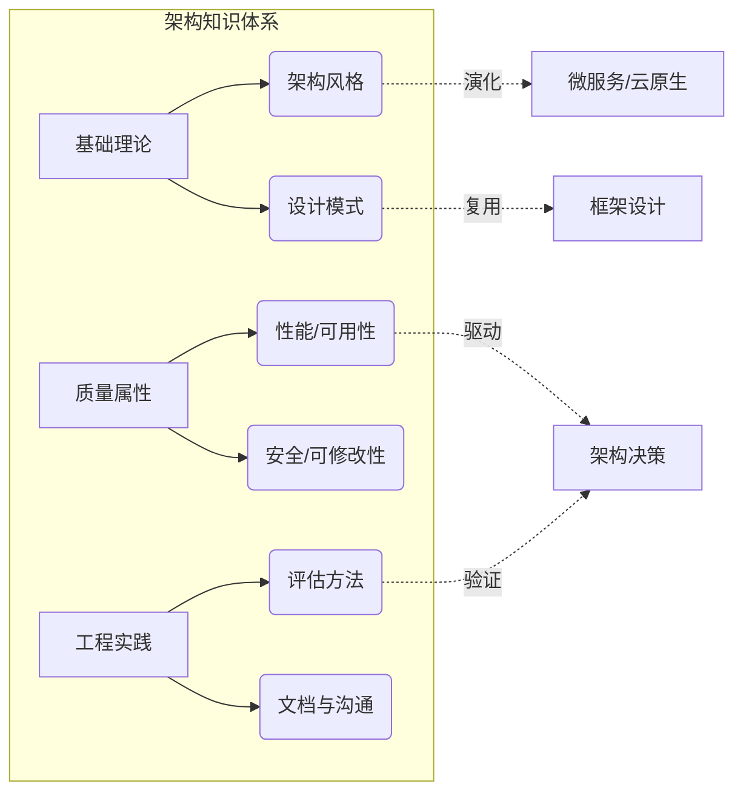

# 《系统架构设计师历年真题解析》章节总结

## 书籍信息
- **书名**：系统架构设计师历年真题专题解析（2015年/2017年合集）
- **作者**：未明确标注（通常为软考培训教研组或讲师编写）
- **PDF/PPTX 状态**：PPTX 演示文稿格式，非传统书籍排版
- **OCR/识别状态**：内容完整，但结构为“真题+解析”模式，无传统书籍目录

## 目录说明
- **目录识别情况**：上传文件为4份独立的PPTX课件，分别对应2017年真题解析（一）、（二）、（三）及2015年真题解析。
- **章节对应依据**：由于原文件并非连续书籍，本总结按“年份-试卷部分”作为逻辑章节进行结构化重组。
- **特殊说明**：内容为试题与答案解析，无前言、后记等书籍组件。核心知识点分散在各题解析中，以下总结将按试卷模块提炼核心架构知识体系。

## 全书核心主题
本资料集是针对中国计算机技术与软件专业技术资格（水平）考试“系统架构设计师”科目的实战解析汇编。内容覆盖2015年与2017年两套完整真题，核心聚焦于软件工程方法论、系统架构风格、需求工程、数据库设计、系统可靠性分析及论文写作策略。资料不仅提供标准答案，更侧重于解题思路的推导与架构设计原则的工程化应用，旨在帮助考生理解从理论到实践的映射关系，掌握架构评估、质量属性分析及特定场景下的技术选型能力。

---

## 第1章：2017年11月系统架构设计师真题解析（一）

### 1. 核心论点
本章主要解决系统架构设计中基础理论与综合知识点的辨析问题。
核心观点认为：架构师必须具备扎实的软件工程基础，能够准确区分不同架构风格的适用场景，并深刻理解质量属性（如性能、可用性、安全性）对架构决策的决定性影响。

### 2. 关键概念 / 事件
-   **架构风格**：重点考察了管道-过滤器、事件驱动、分层架构及微内核架构的区别与应用边界。
-   **质量属性场景**：强调通过“刺激源、刺激、环境、制品、响应、响应度量”六要素来精确描述质量属性。
-   **UML建模**：涉及用例图、类图、序列图在需求分析与详细设计阶段的规范化表达。
-   **Web架构技术**：包括负载均衡策略、缓存机制（Redis/Memcached）及RESTful API设计原则。

### 3. 逻辑推演 / 叙事脉络
本章解析遵循“题干关键词提取 → 选项排除法 → 原理验证”的逻辑链条。对于架构风格类题目，先分析系统交互特征（如数据流变换还是事件触发），再匹配风格定义；对于质量属性题目，通过还原用户操作场景来判断属于性能、安全还是可修改性范畴。解析过程强调从抽象定义到具体工程特征的映射，而非死记硬背。

### 4. 经典金句 / 数据
> “架构风格定义了系统的组织方式、构件间的交互协议以及数据流动的模式，选择错误的风格会导致后续重构成本呈指数级增长。”

> “质量属性不是孤立存在的，提高安全性往往会牺牲性能，架构设计的本质是在相互冲突的质量属性之间寻找平衡点。”

---

## 第2章：2017年11月系统架构设计师真题解析（二）

### 1. 核心论点
本章聚焦于案例分析题的解题方法论与深层架构设计问题。
作者认为：案例分析考察的是架构师在复杂约束条件下进行权衡分析的能力，答题必须遵循“问题识别 → 理论支撑 → 结合场景 → 给出方案”的结构化思维路径。

### 2. 关键概念 / 事件
-   **架构评估方法**：ATAM（架构权衡分析法）与SAAM（软件架构分析方法）的核心步骤与敏感点/权衡点识别。
-   **数据库设计**：反规范化技术、分库分表策略及NoSQL与RDBMS的混合使用场景。
-   **系统集成**：ESB（企业服务总线）与SOA治理在企业级集成中的角色。
-   **可靠性模型**：串联、并联及混联系统的可靠性计算公式与冗余设计策略。

### 3. 逻辑推演 / 叙事脉络
案例解析采用“逆向工程”思维：先从问题出发定位考点（如“该系统为何响应慢”指向性能瓶颈分析），再回溯材料中的架构描述寻找证据。在解答设计类问题时，强调多方案对比，要求明确列出各方案的优缺点及适用前提，体现架构师的决策透明度。计算题则注重公式推导过程的完整性，避免直接给出结果。

### 4. 经典金句 / 数据
> “在ATAM评估中，敏感点是影响某个特定质量属性的架构决策，而权衡点是影响多个质量属性的架构决策，后者往往是架构风险的高发区。”

> “没有绝对最好的架构，只有最适合当前业务约束和技术背景的架构。”

### 5. 方法流程图

---

## 第3章：2017年11月系统架构设计师真题解析（三）

### 1. 核心论点
本章专门针对论文写作进行方法论指导与范文剖析。
核心观点指出：架构师论文不是技术散文，而是“项目实践+理论应用+个人反思”三位一体的专业报告，必须体现真实项目背景与架构决策的深度思考。

### 2. 关键概念 / 事件
-   **论文结构范式**：摘要（300-400字）+ 正文（2000-2500字）的标准结构与时间分配策略。
-   **子题目响应**：强调必须逐条回应论文子题目，避免偏题或遗漏要点。
-   **理论与实践融合**：拒绝纯理论堆砌或纯流水账，要求每个理论点都有对应的项目实践佐证。
-   **反思与展望**：项目不足之处与改进措施是体现架构师成长性的关键得分点。

### 3. 逻辑推演 / 叙事脉络
论文解析采用“评分标准倒推”逻辑：先拆解阅卷人关注的采分点（如项目真实性、理论准确性、结构完整性），再对照范文分析其如何满足这些标准。强调论文准备阶段需建立“项目素材库”，将实际项目按架构风格、质量属性、新技术应用等维度进行标签化整理，以便考场快速调用。同时指出常见失分陷阱，如项目规模过小、理论过时、缺乏个人贡献等。

### 4. 经典金句 / 数据
> “优秀的架构师论文应当让阅卷人在3分钟内清晰看到：你做了什么项目、用了什么架构理论、解决了什么问题、取得了什么效果、还有哪些不足。”

> “论文中的‘我’必须是架构决策的主导者，而非旁观者或执行者。”

---

## 第4章：2015年11月系统架构设计师真题解析

### 1. 核心论点
本章通过2015年真题回顾早期架构设计考点的演变与延续性。
作者认为：尽管技术栈不断更新，但架构设计的核心原则（高内聚低耦合、关注点分离、抽象与封装）具有跨时代的稳定性，历年真题的价值在于训练这种不变的底层思维。

### 2. 关键概念 / 事件
-   **传统架构模式**：MVC、MVP、MVVM的演进关系及在移动端/Web端的差异化应用。
-   **中间件技术**：CORBA、COM/DCOM、J2EE等历史技术的定位及其向现代微服务架构的过渡逻辑。
-   **信息安全架构**：PKI体系、数字签名、加密算法（对称/非对称）在系统安全设计中的组合应用。
-   **知识产权与标准化**：软件著作权归属、开源协议合规性等法律与标准知识。

### 3. 逻辑推演 / 叙事脉络
本章解析注重“历史语境还原”：在讲解2015年考题时，不仅给出当时正确答案，还补充说明该知识点在当前技术生态中的位置（如CORBA已淘汰但其接口抽象思想仍存）。对于持续高频考点（如设计模式、UML），则横向对比多年出题角度变化，揭示命题趋势从“记忆型”向“应用型”的转变。解析过程强调知识体系的连贯性，帮助考生建立纵向技术演进观。

### 4. 经典金句 / 数据
> “技术会过时，但架构思维不会。理解2015年的考题不是为了记住旧答案，而是为了看清哪些原则穿越了技术周期依然有效。”

> “安全架构设计必须遵循‘纵深防御’原则，单一安全措施永远不足以应对复杂威胁。”

### 5. 图表结构提炼

