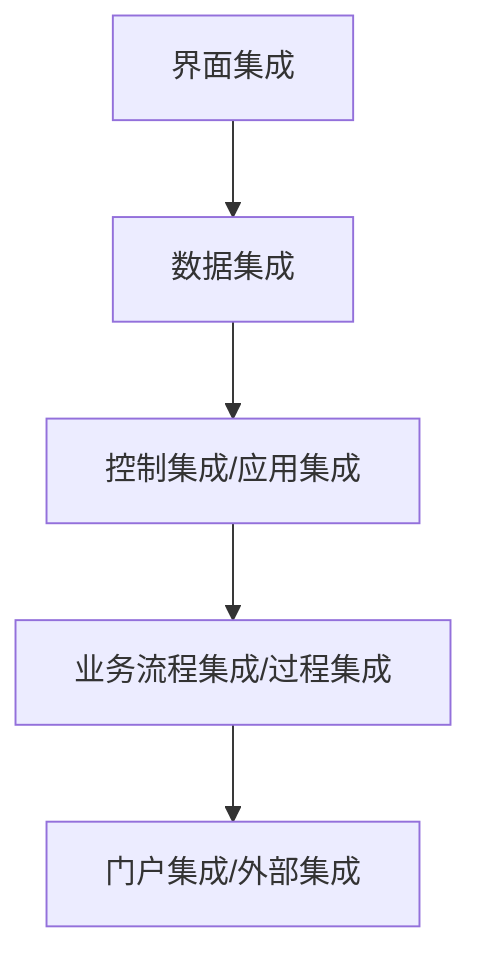
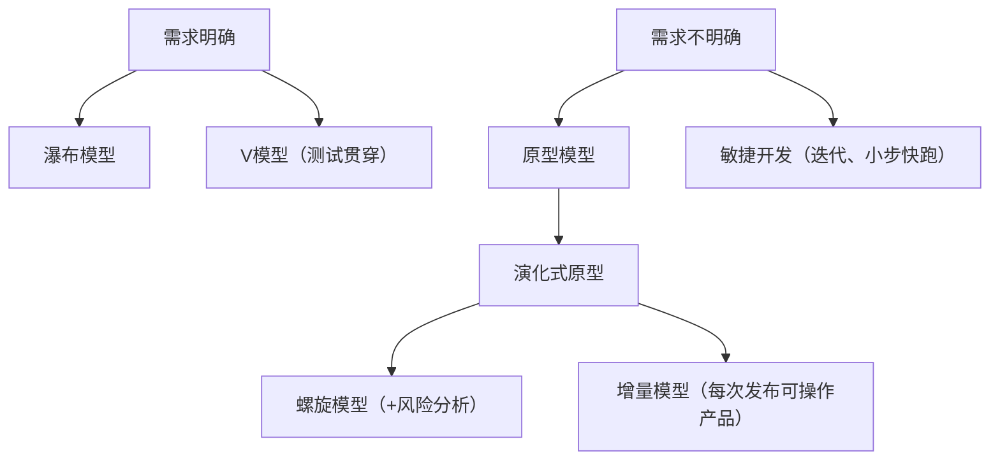
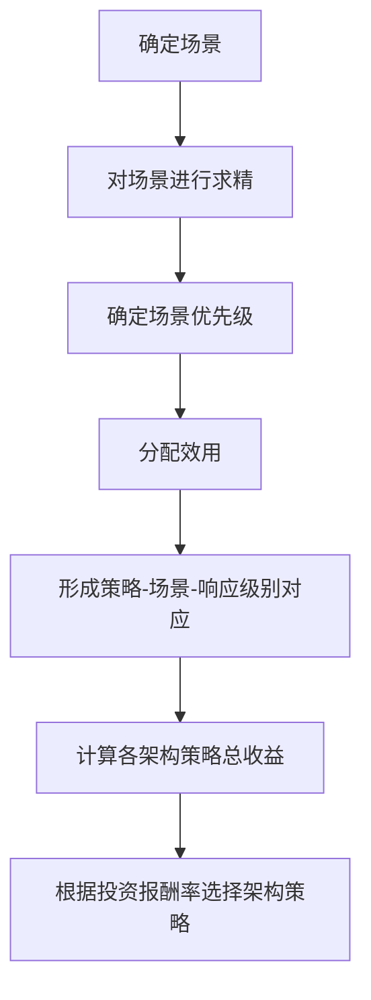
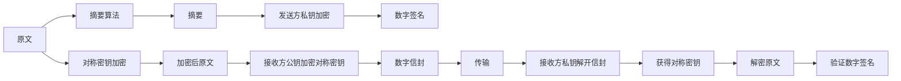
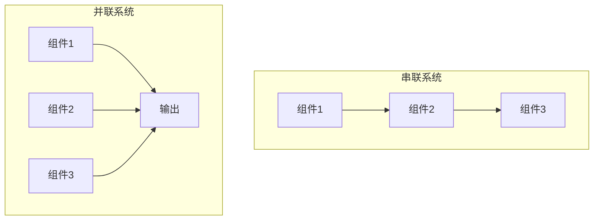
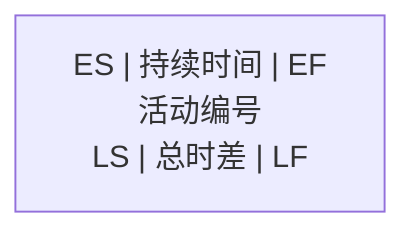
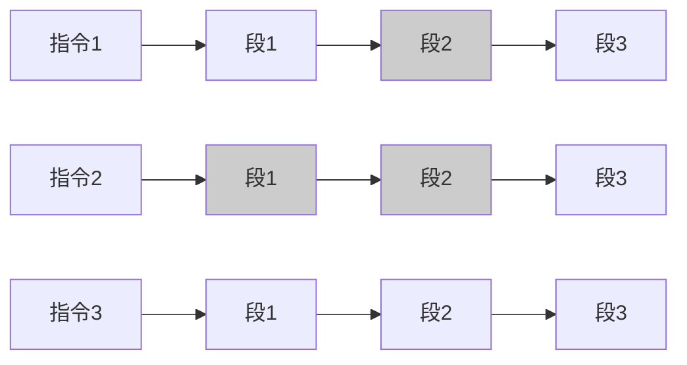
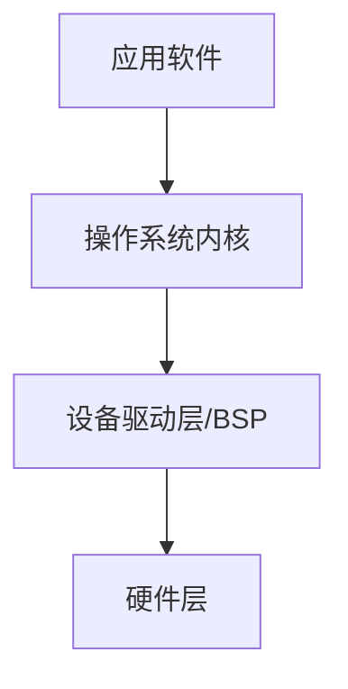
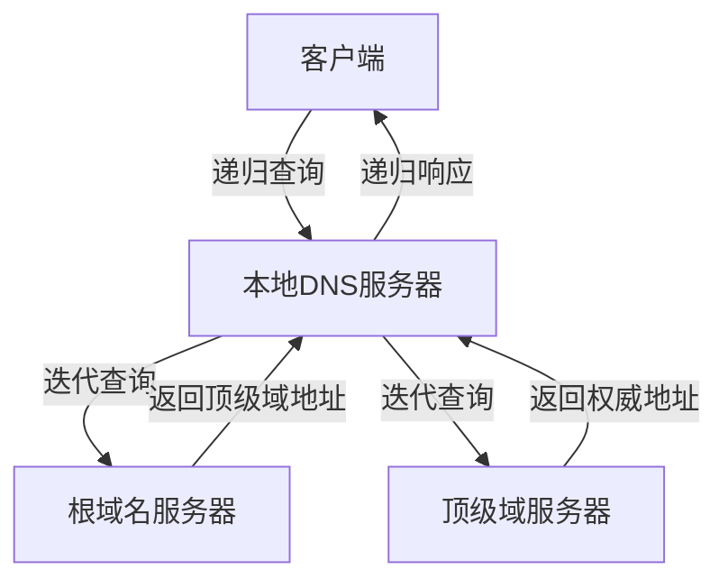

# 《系统架构设计师备考资料综合整理》

## 书籍信息
- **书名**：《系统架构设计师考试大纲》 + 《系统架构设计师知识集锦》（希赛2023版）+ 《系统架构学习计划》 + 《架构师新版教材解读公开课》
- **作者**：全国计算机技术与软件专业技术资格（水平）考试官方（大纲）；希赛网（知识集锦、学习计划、公开课）
- **PDF 状态**：多个 PDF 文件合并整理，内容来自扫描/OCR，部分图像描述已移除，仅保留文字。
- **OCR 状态**：整体识别质量较好，个别页面图像标记（`image[[x,y,w,h]]`）已忽略，部分表格、流程图已依据文字描述重建为 Mermaid。

## 目录说明
- **第一部分**：系统架构设计师考试大纲（官方）
  - 一、考试说明
  - 二、考试范围（科目1、2、3）
- **第二部分**：系统架构设计师知识集锦（希赛，共14章）
  - 第一章 企业信息化战略与实施
  - 第二章 软件工程
  - 第三章 软件架构设计
  - 第四章 信息安全分析与设计
  - 第五章 系统可靠性分析与设计
  - 第六章 项目管理
  - 第七章 计算机组成与体系结构
  - 第八章 嵌入式系统
  - 第九章 操作系统
  - 第十章 数据库系统
  - 第十一章 计算机网络
  - 第十二章 数学与经济管理
  - 第十三章 系统配置与性能评价
  - 第十四章 知识产权与标准化
- **第三部分**：系统架构学习计划（希赛2023下半年）
- **第四部分**：架构师新版教材解读公开课（希赛王勇）

## 全书核心主题
> 本套资料围绕“系统架构设计师”这一高级技术资格认证考试，系统梳理了考试大纲要求、各知识领域的考点精讲、案例分析及论文写作要点。核心目标是帮助考生掌握计算机软硬件基础、信息系统开发、软件架构设计、质量属性评估、安全可靠性设计等关键知识，并熟悉云原生、微服务、大数据、物联网等现代架构技术。资料同时提供了备考学习计划、教材改版对比及应试策略，是架构师认证考试的重要辅导材料。

---

# 第一部分：系统架构设计师考试大纲（官方）

## 一、考试说明

### 1. 考试目标
根据系统需求规格说明书，结合应用领域及技术发展，设计正确合理的软件架构，确保系统具有良好的特性；能够描述、分析、设计与评估系统架构；编写设计文档；与系统分析师、项目管理师协作；具备高级工程师的实际操作能力和业务水平。

### 2. 考试要求
(1) 掌握计算机硬软件与网络的基础知识  
(2) 熟悉信息系统开发过程  
(3) 理解信息系统开发标准、常用信息技术标准  
(4) 熟悉主流的中间件和应用服务器平台  
(5) 掌握软件系统建模、系统架构设计基本技术  
(6) 熟练掌握信息安全技术、安全策略、安全管理知识  
(7) 了解信息化、信息技术有关法律、法规的基础知识  
(8) 了解用户的行业特点，并根据行业特点架构合适的系统设计  
(9) 掌握应用数学基础知识  
(10) 熟练阅读和正确理解相关领域的英文文献

### 3. 考试科目设置
- **科目1**：系统架构设计综合知识（150分钟，选择题）
- **科目2**：系统架构设计案例分析（90分钟，问答题）
- **科目3**：系统架构设计论文（120分钟，论文题）

## 二、考试范围

### 考试科目1：系统架构设计综合知识
1. 计算机系统基本知识  
2. 信息系统基础知识  
3. 信息安全技术基础知识  
4. 软件工程基础知识  
5. 数据库设计基础知识  
6. 系统架构设计基础知识  
7. 系统质量属性与架构评估  
8. 软件可靠性技术  
9. 软件架构的演化和维护  
10. 未来信息综合技术（CPS、AI、机器人、边缘计算、数字孪生、云计算与大数据）  
11. 标准化与知识产权  
12. 应用数学  
13. 专业英语

### 考试科目2：系统架构设计案例分析
1. 系统计划  
2. 信息系统架构的设计理论与实践  
3. 层次式架构的设计理论与实践  
4. 云原生架构设计理论与实践  
5. 面向服务的架构设计理论与实践  
6. 嵌入式系统的架构设计理论与实践  
7. 通信系统架构的设计理论与实践  
8. 安全架构的设计理论与实践  
9. 大数据架构设计理论与实践

### 考试科目3：系统架构设计论文
1. 系统建模  
2. 软件架构设计  
3. 基于架构的软件开发方法  
4. 系统设计  
5. 系统的可靠性分析与设计  
6. 系统的安全性和保密性设计

---

# 第二部分：系统架构设计师知识集锦（希赛2023）

## 第一章 企业信息化战略与实施

### 1. 核心论点
本章主要解决“企业信息化过程中有哪些核心系统、如何管理业务流程以及如何进行企业应用集成”的问题。作者认为：企业信息化战略需围绕ERP、CRM、SCM、PDM、BI等系统展开，通过BPR、BPM优化流程，并利用企业应用集成（EAI）打通信息孤岛。

### 2. 关键概念
- **ERP（企业资源计划）**：集成物流、资金流、信息流，涵盖生产控制、物流管理、财务管理三大模块。
- **CRM（客户关系管理）**：以客户为核心，通过客户服务、市场营销、共享资料库和分析能力提升客户价值。
- **SCM（供应链管理）**：整合制造商、供应商、分销商、零售商，优化信息流（需求/供应）、资金流和物流。
- **BI（商业智能）**：技术栈包括数据仓库、数据挖掘、OLAP。数据仓库面向主题、集成、非易失、时变；数据湖存储原始数据，支持事务与分析。
- **BPR（业务流程重组）**：根本性再思考和彻底性再设计，追求成本、质量、服务和速度的显著成就。
- **BPM（业务流程管理）**：规范化构造端到端卓越流程，PDCA闭环管理，不要求所有流程再造。

### 3. 逻辑推演
作者从企业信息化演进逻辑出发：早期单点应用 → ERP集成三大流 → CRM/SCM向客户与供应链延伸 → PDM管理产品全生命周期 → BI利用数据支持决策。业务流程分析采用价值链、CRM、SCM、ERP等方法，流程优化从BPR（激进重构）到BPM（持续规范优化）。最后引入企业应用集成（EAI），按集成点分为界面集成、数据集成、控制集成、业务流程集成，按技术分为面向信息、面向过程、面向服务。

### 4. 流程图（企业集成层次）


### 5. 经典金句/数据
> “ERP是将企业所有资源（物流、资金链、信息流）进行集成整合，全面一体化管理的管理信息系统。”（p.1）
> “BPM与BPR管理思想最根本的不同就在于流程管理并不要求对所有的流程进行再造。”（p.4）
> 数据仓库 vs 数据湖：数据仓库“存储之前定义模式”，数据湖“存储之后定义模式”。（p.3）

---

## 第二章 软件工程

### 1. 核心论点
本章围绕“如何规范、高效地开发与维护软件系统”展开。作者强调：软件开发方法（结构化、原型、面向对象、面向服务）、开发模型（瀑布、螺旋、敏捷等）、需求工程、系统设计、软件测试、系统转换与维护共同构成软件工程完整体系。

### 2. 关键概念
- **开发模型**：瀑布（需求明确）、原型（需求不明确）、螺旋（风险分析）、增量（多次发布）、V模型（测试贯穿）、喷泉（面向对象迭代）、RAD（快速开发）、统一过程UP（用例驱动、架构中心、迭代增量）、敏捷（XP、水晶、SCRUM等）。
- **需求工程**：业务需求、用户需求、系统需求（功能/非功能/设计约束）。QFD分常规需求、期望需求、兴奋需求。
- **逆向工程**：从源代码抽象更高层次表示，包括实现级、结构级、功能级、领域级。再工程=逆向+新需求+正向。
- **面向对象设计**：类（实体/控制/边界）、UML图（4+1视图）、设计原则（单一职责、开闭、李氏替换、依赖倒置、接口隔离、组合重用、迪米特）。
- **设计模式**：创建型（工厂、单例等）、结构型（适配器、代理等）、行为型（观察者、策略等）。
- **软件测试**：单元测试、集成测试（自顶向下/自底向上）、确认测试、系统测试、验收测试、回归测试、α/β测试。
- **系统转换**：直接转换（高风险）、并行转换（最常用）、分段转换（分期分批）。遗留系统演化策略：淘汰、继承、改造、集成。

### 3. 逻辑推演
作者先区分开发方法，再按生命周期顺序介绍模型，接着深入需求获取、分析（结构化DFD/STD，面向对象UML）。然后进入系统设计（概要+详细），强调高内聚低耦合及面向对象设计原则与模式。测试部分从单元到系统，最后介绍系统转换和维护（正确性、适应性、完善性、预防性）。

### 4. 流程图（软件开发模型对比）


### 5. 经典金句/数据
> “逆向工程是设计的恢复过程。”（p.11）
> “自顶向下测试时，调用模块已经写完，不需要写驱动模块，但是需要用桩模块。”（p.24）
> “设计模式有一定难度。对于设计模式要求掌握：三种类型的定位、分类、各模式应用场景及特点。”（p.24）

---

## 第三章 软件架构设计

### 1. 核心论点
本章是考试核心，解决“如何设计和评估软件架构”的问题。作者认为：架构风格（数据流、调用/返回、独立构件、虚拟机、仓库）是复用基础；架构评估重点关注质量属性（性能、可靠性、可用性、安全性、可修改性等），并使用SAAM、ATAM等场景化方法。

### 2. 关键概念
- **架构风格**：
  - 数据流：批处理、管道-过滤器（如编译器）
  - 调用/返回：主程序/子程序、面向对象、层次结构（每层为上层服务）
  - 独立构件：进程通信、事件驱动（隐式调用）
  - 虚拟机：解释器、规则系统（专家系统）
  - 仓库：数据库系统、黑板系统（如语音识别）、超文本系统
- **典型架构应用**：层次架构（MVC、MVP）、SOA（服务注册表、Web Service）、微服务（独立进程、轻量通信）。
- **DSSA（特定领域软件架构）**：垂直域（行业共性）和水平域（多行业通用），涉及领域专家、分析员、设计员、实现员。
- **ABSD（基于架构的软件开发）**：架构驱动，递归迭代，文档化与复审。
- **架构评估**：质量属性（性能、可靠性、可用性、安全性、可修改性等）；敏感点、权衡点、风险点、非风险点、场景。
- **评估方法**：SAAM（可修改性）、ATAM（性能、可用性、安全性、可修改性）。
- **产品线**：核心资源、产品集合、以架构为中心。
- **WEB设计**：负载均衡（轮转、加权、最小连接等）、Session共享、CDN、缓存（Redis vs Memcache）、REST原则。

### 3. 逻辑推演
作者首先定义架构概念，然后详细分类架构风格，每类给出子风格、优缺点和实例。接着介绍典型架构（层次、SOA、微服务），比较SOA与微服务。之后引入DSSA和ABSD开发过程。重点落在架构评估：质量属性定义、场景描述、评估方法步骤。最后补充产品线、WEB设计等技术。

### 4. 流程图（架构评估过程 - ATAM）


### 5. 经典金句/数据
> “架构设计的一个核心问题是能否达到架构级的软件复用。”（p.26）
> “微服务：能拆分的就拆分；SOA：能放一起的都放一起。”（p.34）
> “可靠性要求比可用性更高。可靠则必可用，而可用不一定可靠。”（p.37）
> “缓存雪崩：大部分缓存失效 → 数据库崩溃。”（p.46）

---

## 第四章 信息安全分析与设计

### 1. 核心论点
本章围绕“如何保护信息系统的机密性、完整性、可用性”。作者指出：对称加密（高效密钥分发难）与非对称加密（慢但强度高）结合使用；数字签名实现防篡改和不可抵赖；网络安全协议（SSL/TLS、HTTPS、IPSEC）和等级保护是实践基础。

### 2. 关键概念
- **对称加密**：DES、3DES、IDEA、AES；同一密钥。
- **非对称加密**：RSA、ECC；公钥加密私钥解密。
- **信息摘要**：MD5、SHA；单向不可逆。
- **数字签名**：发送方私钥加密摘要，接收方公钥验证。
- **数字信封**：对称密钥加密原文，接收方公钥加密对称密钥。
- **PGP**：混合算法（IDEA、RSA、MD5、ZIP），支持X.509证书。
- **网络攻击**：被动（窃听、业务流分析），主动（假冒、重放、拒绝服务）。
- **安全保护等级**：用户自主保护级、系统审计保护级、安全标记保护级、结构化保护级、访问验证保护级。
- **安全防范体系**：物理、操作系统、网络、应用、管理五个层次。

### 3. 逻辑推演
作者从密码学基础（对称、非对称、摘要）出发，引出数字签名和数字信封的实际应用，再结合PGP实例。然后转向网络安全协议（SSL/TLS、HTTPS、IPSEC）和常见攻击手段（DOS、重放、业务流分析）。最后给出安全保护等级分类和五层防范体系。

### 4. 流程图（数字签名与数字信封结合）


### 5. 经典金句/数据
> “消息摘要的作用是防篡改，对摘要加密（数字签名）是为了标识发送者身份。”（p.55）
> “提高安全性的手段包括：身份认证、限制访问、检测攻击、维护完整性等。”（p.55）

---

## 第五章 系统可靠性分析与设计

### 1. 核心论点
本章解释“如何量化和提高系统的可靠性”。作者认为：可靠性指标（MTTF、MTTR、MTBF）和串联/并联模型是基础，冗余设计（N版本程序设计、恢复块、双机容错、集群）是主要手段。

### 2. 关键概念
- **可靠性指标**：MTTF（平均无故障时间）=1/λ，MTTR（平均修复时间）=1/μ，MTBF=MTTR+MTTF，可用性=MTTF/(MTTR+MTTF)。
- **串联系统**：总可靠度 = R1×R2×…×Rn。
- **并联系统**：总可靠度 = 1-(1-R1)×(1-R2)×…×(1-Rn)。
- **N版本程序设计**：多个独立实现的版本，表决输出。
- **恢复块方法**：主块+后备块，验证测试程序检测，后向恢复。
- **双机容错**：热备、互备、双工。
- **集群**：可伸缩、高可用、可管理、高性价比、高透明。

### 3. 逻辑推演
作者首先区分可靠性与可用性，给出定量公式。然后分别计算串联和并联系统的可靠度。之后介绍提高可靠性的设计技术：N版本（多版本独立，表决）、恢复块（主/备，后向恢复）、防卫式程序设计（错误检测/恢复）、双机容错、集群（负载均衡）。最后比较集群与高性能主机。

### 4. 流程图（串联与并联系统可靠度计算）


### 5. 经典金句/数据
> “提高可靠性最主要的技术是检错技术、容错设计和降低复杂度设计。”（p.59）
> “负载均衡在某些角度来看算是提高可靠性的策略，比如使用多个服务器组件取代单一组件，通过冗余提高可靠性。”（p.59）

---

## 第六章 项目管理

### 1. 核心论点
本章关注“信息系统项目的范围、时间与成本管理”。作者强调：范围管理确定边界；时间管理使用关键路径法（PERT）、Gantt图进行进度控制；盈亏平衡分析用于立项决策。

### 2. 关键概念
- **盈亏平衡**：销售额 = 固定成本 + 可变成本 + 税费。
- **范围管理**：定义项目应做与不应做的工作，防止范围蔓延。
- **时间管理**：历时估算（专家判断、三点估算法、功能点等），关键路径法，总时差/自由时差。
- **Gantt图**：直观显示任务起止时间，但无法表达复杂依赖。
- **PERT图**：网络图，展示任务依赖关系及关键路径。

### 3. 逻辑推演
作者先给出立项阶段的盈亏平衡公式，然后重点放在范围管理的输入输出。时间管理部分详细解释PERT网络图中ES、EF、LS、LF、总时差、自由时差的计算，并对比Gantt图与PERT图的优缺点。

### 4. 流程图（PERT单代号网络图节点标识）


### 5. 经典金句/数据
> “甘特图直观、简单、容易制作，但不能系统地表达各项工作之间的复杂关系。”（p.63）
> “PERT图主要描述不同任务之间的依赖关系；Gantt图主要描述不同任务之间的重叠关系。”（p.63）

---

## 第七章 计算机组成与体系结构

### 1. 核心论点
本章解决“计算机硬件系统的基本构成及性能优化”问题。作者指出：Flynn分类法区分SISD/SIMD/MISD/MIMD；存储系统利用局部性原理形成缓存-主存-辅存层次；流水线技术提高指令并行度。

### 2. 关键概念
- **CPU组成**：运算器（ALU、AC、DR、PSW）、控制器（PC、IR、ID、时序部件）。
- **Flynn分类**：单指令流单数据流（SISD）、单指令流多数据流（SIMD）、多指令流单数据流（MISD，不实际）、多指令流多数据流（MIMD）。
- **CISC vs RISC**：CISC指令多、变长、微程序；RISC指令少、定长、单周期、Load/Store体系。
- **存储系统**：寄存器→Cache→内存→外存。局部性原理（时间/空间）。
- **Cache**：直接、全相联、组相联映射；写直达/写回。
- **磁盘**：存取时间=寻道时间+等待时间；移臂调度（FCFS、SSTF、SCAN、CSCAN）。
- **流水线**：理论公式 (t1+...+tk)+(n-1)*Δt，吞吐率 TP = n / 流水线执行时间。
- **校验码**：奇偶校验、CRC、海明码。

### 3. 逻辑推演
作者从CPU内部结构入手，再分类计算机体系结构（Flynn，CISC/RISC）。存储部分详细讲解分层体系、Cache映射与替换算法、磁盘参数与调度。最后介绍流水线性能计算和常用校验码。

### 4. 流程图（流水线执行时间计算 - 理论公式）


### 5. 经典金句/数据
> “高速缓存是由硬件自动完成的，所以对程序员来说是透明的。”（p.69）
> “流水线执行时间计算以理论公式为准，如果在考试中理论公式找不到答案再带入实践公式。”（p.69）

---

## 第八章 嵌入式系统

### 1. 核心论点
本章解决“嵌入式系统的软硬件架构特点及设计方法”。作者认为：嵌入式微处理器（MCU、EMPU、DSP、SoC）采用冯·诺依曼或哈佛结构；嵌入式实时操作系统（RTOS）强调中断响应时间、任务切换延迟，调度算法包括优先级抢占和EDF。

### 2. 关键概念
- **嵌入式微处理器分类**：MCU（单片机）、EMPU（单板机）、DSP（信号处理）、SoC（片上系统）。
- **体系结构**：冯·诺依曼（指令数据混合总线）、哈佛（独立总线，并行吞吐）。
- **总线**：数据总线、地址总线、控制总线；并行/串行。
- **BSP（板级支持包）**：介于硬件与操作系统驱动之间，屏蔽硬件差异。
- **嵌入式操作系统**：硬实时/软实时/非实时；单体结构（Linux）、微内核结构（VxWorks）。
- **RTOS调度**：优先级抢占、最早截止期优先（EDF）。

### 3. 逻辑推演
作者先按处理器类型和体系结构分类，然后介绍总线基本概念。接着阐述嵌入式软件体系结构（从硬件到应用层，BSP是关键）。最后对比单体内核与微内核，并给出RTOS实时性评价指标与调度算法。

### 4. 流程图（嵌入式系统软件体系结构）


### 5. 经典金句/数据
> “微内核：内核精练，便于剪裁和移植，系统服务运行在用户空间，可靠性高，但效率较低。”（p.74）

---

## 第九章 操作系统

### 1. 核心论点
本章解决“操作系统如何管理进程、内存及资源分配”的问题。作者强调：进程三态/五态模型、PV操作实现同步互斥、死锁预防与银行家算法、页式/段式存储及页面置换算法。

### 2. 关键概念
- **进程状态**：运行、就绪、阻塞（三态）；加上挂起（五态）。
- **PV操作**：P申请资源（信号量减1，若<0则阻塞），V释放资源（信号量加1，唤醒等待进程）。用于互斥与同步。
- **死锁**：四个必要条件（互斥、保持等待、不剥夺、循环等待）。银行家算法避免死锁。
- **存储管理**：页式（逻辑地址→物理地址，页表）、段式（段号+段内地址）、段页式。快表（Cache）加速地址转换。
- **页面置换**：OPT、FIFO、LRU。

### 3. 逻辑推演
作者从进程状态图开始，引入PV操作解决并发问题，通过前趋图与信号量结合。死锁部分说明银行家算法。存储管理部分比较页式、段式、段页式的优缺点，并给出页面置换算法。

### 4. 流程图（PV操作实现互斥）
```mermaid
graph TD
    A[进程P1] --> B[P(S)]
    B --> C[访问临界资源]
    C --> D[V(S)]
    E[进程P2] --> F[P(S)]
    F --> G[访问临界资源]
    G --> H[V(S)]
```

### 5. 经典金句/数据
> “PV操作中，信号量一般可以表示资源的数量。当信号量小于0，表示等待资源的进程数量。”（p.79）
> “互斥模型中PV操作一般位于同一个进程中；同步模型中P和V操作一般位于不同进程中。”（p.79）

---

## 第十章 数据库系统

### 1. 核心论点
本章解决“数据库设计、规范化理论及并发控制”问题。作者指出：三级模式两级映像保证逻辑与物理独立性；规范化从1NF到BCNF消除冗余；事务ACID特性与封锁协议保证并发正确性。

### 2. 关键概念
- **三级模式**：外模式（视图）、模式（表）、内模式（物理文件）。
- **ER图转关系模式**：1:1合并至任意一端，1:n合并至n端，m:n独立成表。
- **关系代数**：并、交、差、笛卡尔积、投影、选择、自然连接。
- **规范化**：1NF（属性原子）、2NF（消除部分依赖）、3NF（消除传递依赖）、BCNF（每个决定因素都包含候选键）。
- **候选键求取**：入度为0的属性集开始扩展，遍历全图。
- **反规范化**：增加冗余列、派生列、分割表（水平/垂直）以提高查询性能。
- **事务ACID**：原子性、一致性、隔离性、持久性。
- **封锁协议**：一级（防止丢失修改）、二级（防止读脏）、三级（防止不可重复读）。
- **备份**：冷备份/热备份，完全/差量/增量。

### 3. 逻辑推演
作者从数据库体系结构展开，然后详述ER图设计过程及转换规则。关系代数部分给出运算示例。规范化理论从函数依赖出发，通过范式递进消除异常，并给出无损分解判断。反规范化作为性能补偿。并发控制部分讲解封锁技术和三级协议。

### 4. 流程图（范式递进关系）


### 5. 经典金句/数据
> “规范化程度一般达到3NF即可，并不是越高越好。反规范化是为了提高性能而回退。”（p.87）
> “候选关键字是可以唯一标示元组且无冗余的属性集合。”（p.87）

---

## 第十一章 计算机网络

### 1. 核心论点
本章解决“网络协议体系、IP地址分配及IPv6过渡”问题。作者要求掌握TCP/UDP区别、DNS/DHCP工作原理、IPv6地址分类及过渡技术（双栈、隧道、NAT-PT）。

### 2. 关键概念
- **TCP**：面向连接、可靠、流量控制、三次握手。
- **UDP**：无连接、不可靠、高效，用于DNS、DHCP、SNMP等。
- **DHCP**：动态分配IP，租约8天，过半续租，87.5%联系其他服务器。
- **DNS**：递归查询（服务器必须返回最终地址）与迭代查询（返回下一级地址）。
- **IPv6**：128位，简化报头，内置安全，地址类型：单播、组播、任播。
- **过渡技术**：双协议栈、隧道（6to4、ISATAP）、NAT-PT。
- **综合布线**：工作区、水平、管理、垂直干线、设备间、建筑群六个子系统。

### 3. 逻辑推演
作者列出常见协议及端口，重点对比TCP与UDP。然后分别讲解DHCP的租约过程和DNS的查询方式（递归/迭代）。IPv6部分介绍地址长度、分类及过渡方案。最后简要介绍综合布线系统组成。

### 4. 流程图（DNS递归与迭代查询）


### 5. 经典金句/数据
> “TCP采用可变大小的滑动窗口协议进行流量控制；UDP无流量控制，有助于提高传输速率。”（p.90）
> “IPv6规定每个网卡最少有3个IPv6地址：链路本地地址、全球单播地址和回送地址。”（p.92）

---

## 第十二章 数学与经济管理

### 1. 核心论点
本章强调“数学建模与运筹方法在系统架构中的应用”。作者认为：图论（最小生成树、最大流量）、线性规划、动态规划、决策树等是解决资源优化和决策问题的常用工具，上午选择题中占2分左右。

### 2. 关键概念
- **图论**：最小生成树、最短路径、网络最大流量。
- **运筹方法**：线性规划（目标函数、约束条件）、动态规划（状态转移）。
- **决策**：不确定型决策、决策树。
- **数学建模**：模型准备→假设→建立→求解→分析→检验→应用。方法：直接分析、类比、数据分析、构想。

### 3. 逻辑推演
作者简单列举常考题型（图论、运筹、预测、决策），未展开细节。数学建模部分给出标准七步流程。

### 4. 流程图（数学建模过程）


### 5. 经典金句/数据
> “数学建模是一种数学的思考方法，通过抽象和简化建立能近似刻画并解决实际问题的模型。”（p.94）
> “上午的选择题中出现2分左右的数学与经济管理相关考查试题，下午题不会考查。”（p.95）

---

## 第十三章 系统配置与性能评价

### 1. 核心论点
本章介绍“如何评价计算机系统性能”。作者列举了时钟频率法、指令执行速度（MIPS）、等效指令速度法（Gibson mix）、数据处理速率法（PDR）、综合理论性能法（CTP）以及公认较好的基准程序法。

### 2. 关键概念
- **MIPS**：每秒百万条指令。
- **基准程序法**：真实程序→核心程序→小型基准程序→合成基准程序，是目前较好方法。

### 3. 逻辑推演
作者按历史发展顺序介绍性能评价方法，最终肯定基准程序法的优越性。

### 4. 经典金句/数据
> “基准程序法是目前一致承认的测试系统性能的较好方法。”（p.96）

---

## 第十四章 知识产权与标准化

### 1. 核心论点
本章解决“软件著作权、专利权、商标权保护及侵权判断”问题。作者强调：著作权自作品完成即开始保护（无需申请）；职务作品的归属取决于是否利用单位资源；专利/商标采用申请在先原则。

### 2. 关键概念
- **保护对象**：著作权法（文学、绘画、软件）、专利法（发明、实用新型、外观设计）、商标法、反不正当竞争法（商业秘密）。
- **保护期限**：公民作品署名权无限，发表权死后50年；单位作品首次发表后50年；发明专利20年；注册商标10年。
- **职务作品/软件/专利**：利用单位物质技术条件创作，或属于本职工作中的开发目标，单位享有著作权/专利权；否则作者拥有，单位优先使用。
- **侵权判断**：未经许可发表、剽窃、歪曲篡改、未付报酬等属于侵权；个人学习、适当引用、免费表演等不侵权。

### 3. 逻辑推演
作者分类列出知识产权法律法规的保护对象、保护期限、归属判定规则，最后给出常见侵权与合理引用的区分表。

### 4. 经典金句/数据
> “中国公民、法人或者其他组织的作品，不论是否发表，都享有著作权。”（p.100）
> “开发软件所用的思想、处理过程、操作方法或者数学概念不受保护。”（p.100）

---

# 第三部分：系统架构学习计划（希赛2023下半年）

## 核心内容
> 该学习计划按四个阶段设计：导学（第1天）→ 系统学习+习题练习（第1-19周，分章节学习软件工程、架构设计、计算机基础、数据库、安全、案例、论文等）→ 复习冲刺（第20-22周）→ 参加考试（11月4日）。建议每天1-2小时，总学习时间不少于100小时。包含视频课程、章节练习、真题模拟、论文写作练习。

### 经典金句
> “万丈高楼平地起，您一步一个脚印，夯实基础，理解并掌握系统架构设计师考试的重要内容。”（p.4）
> “案例中新知识一定有，不要恐慌，冷静对待。”（p.5）

---

# 第四部分：架构师新版教材解读公开课（王勇）

## 核心内容
> - **改版性质**：2009年开考以来第一次改版，实质是重写，内容更偏实践。
> - **变化总概**：删一半，增一半，改一半。老版21章572页，新版20章712页。整体删除10章（如UML建模、设计模式、XML、构件平台、ODP实践、企业集成、AOP等），整体新增6章（未来信息综合技术、信息系统架构设计、云原生架构、通信系统架构、大数据架构、论文写作要点）。
> - **考纲变化**：新增“了解系统工程及应用”、“掌握系统架构开发/验证/评估过程”、“熟悉安全架构、脆弱性”等。
> - **教材无但考纲有**：标准化与知识产权、应用数学（概率、图论、运筹等）；教材无但考试常考：数据湖、数字化、Redis。
> - **考试反馈**：2022年架构考试通过率较高，论文评分比预期宽松。

### 经典金句
> “新版教材中有的内容不一定考，没有的不一定不考。有很多知识，老教材没有，但希赛架构讲义已涵盖。”（p.3）
> “与其说是改版，不如说是重写。”（p.3）

---

> 说明：以上内容基于多份PDF文件的OCR文本提取与结构化整理。部分图像、表格已转为Mermaid流程图或文字描述。由于原始材料存在重复、扫描偏移等情况，少量内容（如某些例题、重复章节）已按逻辑合并或省略，但核心考点与结构均已保留。本总结仅用于学习参考，不可用于商业传播。