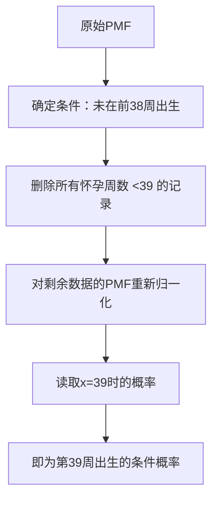
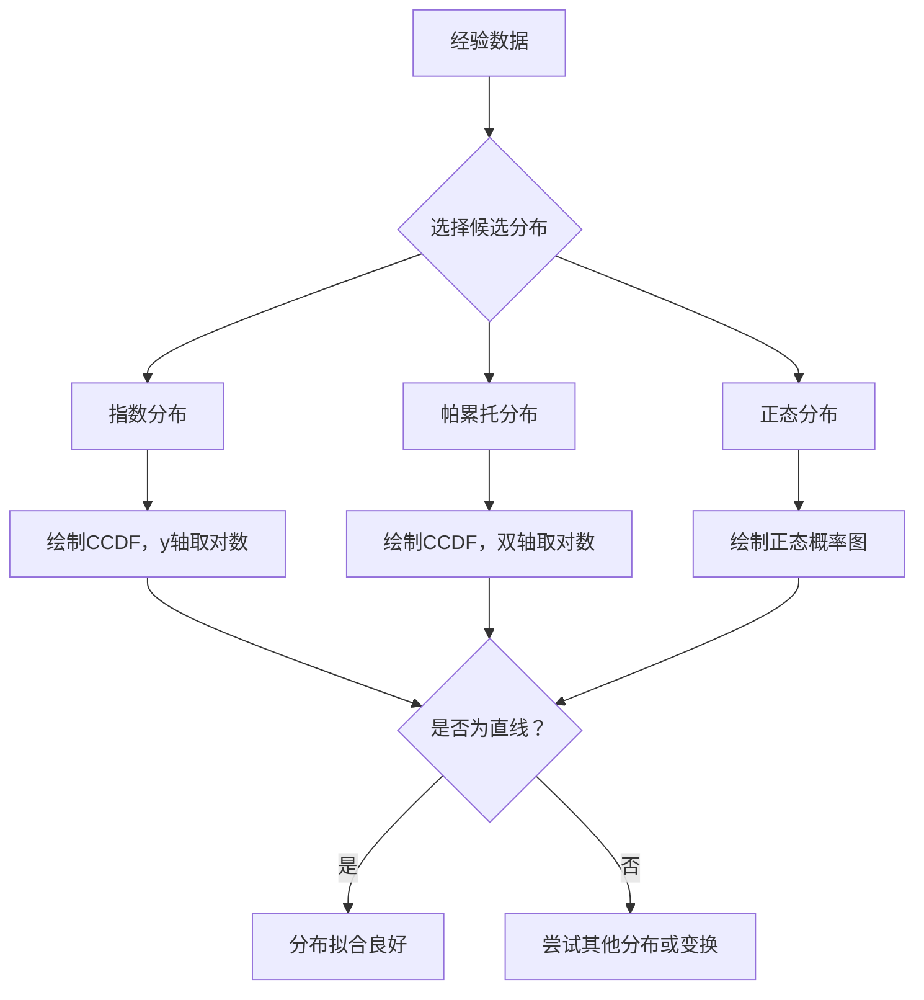
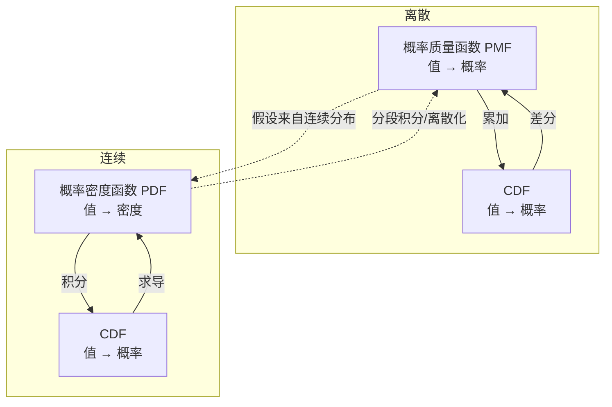
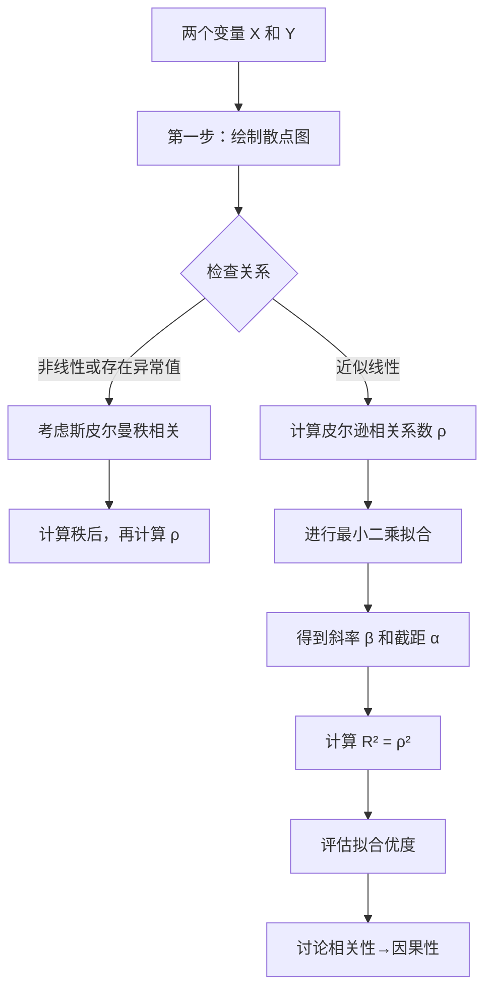

# 《统计思维：程序员数学之概率统计》章节总结

## 书籍信息
- **书名**：统计思维：程序员数学之概率统计 (Think Stats)
- **作者**：[美] Allen B. Downey 著；张建锋，陈钢 译
- **PDF 状态**：完整，包含前言、正文1-9章、索引、封面等。
- **OCR 状态**：可识别，文本清晰，图表完整。

## 目录说明
- **目录识别情况**：完整识别原书目录结构，共9章，每章包含若干小节。
- **章节对应依据**：严格按照PDF页码顺序与目录标题进行对应。
- **OCR 修复说明**：正文内容基本完整，无严重错漏。部分图表（如CDF图、散点图）以文字描述形式呈现，已尽力提炼其核心逻辑。

## 全书核心主题
本书是一本面向程序员的概率统计入门教材。作者Allen B. Downey摒弃了传统的纯数学推导方式，强调**用编程理解和实现统计学**。全书通过一个贯穿始终的实例——使用美国“全国家庭成长调查”（NSFG）和“行为风险因素监测系统”（BRFSS）的真实数据——来解答“第一个孩子是否出生较晚”等实际问题。

核心主题包括：描述性统计量（均值、方差、分布）、累积分布函数（CDF）、各种连续分布（指数、帕累托、正态）、概率法则与贝叶斯定理、分布的运算（偏度、卷积、中心极限定理）、假设检验（p值、卡方检验）、参数估计（置信区间、贝叶斯估计）以及相关性分析（协方差、最小二乘拟合）。本书最终目标是让读者掌握通过编程将原始数据转化为知识的能力。

---

## 前言

### 1. 核心论点
**问题 → 观点**：为什么要用编程的方法学习统计学？作者认为，通过编写程序可以深化对统计概念的理解，进行计算实验验证定理，并处理真实、复杂的数据集，这比纯数学方法更直观、更实用。

### 2. 关键概念
- **计算实验**：通过编写代码模拟统计过程（如中心极限定理）来验证理论。
- **蒙特卡罗模拟**：通过重复生成随机样本近似求解概率问题，尤其适合解释p值等抽象概念。
- **离散分布与计算方法**：使得贝叶斯模拟等高级主题在入门课程中变得易于讲解。
- **项目驱动**：本书内容按项目组织，学生需提出统计学问题，找到数据集，并用所学技术处理。

### 3. 逻辑推演
作者首先指出传统统计学教材多依赖数学推导，对一些概念解释不清。他提出一种新方法：使用通用编程语言（Python）进行教学。这种方法有四大优势：深化概念理解、验证统计定理、模拟解释难点、方便导入外部数据。全书实例将基于NSFG和BRFSS两个真实大型数据集展开。

### 4. 经典金句
> “学生可以通过编写程序来深化和检查自己对概念的理解。”

> “使用通用编程语言Python，所以他们可以导入各种来源的数据，并不局限于那些已经为特定统计工具整理好的数据。”

---

## 第1章：程序员的统计思维

### 1. 核心论点
**问题 → 观点**：如何科学地回答“第一个孩子出生晚吗”这类基于个人经验的问题？作者提出，必须采用统计方法：收集代表性数据、计算描述性统计量、进行探索性数据分析、开展假设检验和参数估计，以取代不可靠的“经验之谈”。

### 2. 关键概念
- **经验之谈**：基于个人经历的非正式证据，易受观察数量少、选择偏差、确认偏差和不准确性的影响。
- **横断面研究**：收集群体在特定时间点数据的研究，如NSFG。
- **纵贯研究**：随时间推移对同一组人反复采集数据的研究。
- **过采样**：为增加特定子群体样本量而有意提高其在样本中比例的做法。
- **重编码**：根据原始数据计算得出的新变量，通常用于保证数据一致性。

### 3. 逻辑推演
作者提出“第一胎出生晚吗？”这一日常问题，指出经验之谈的缺陷。随后介绍统计方法作为解决方案。以NSFG数据为例，讲解如何获取、理解调查数据（包括横断面设计、过采样策略）。最后，通过动手练习（下载数据、编写代码）引导读者初步比较第一胎和非第一胎婴儿的平均怀孕周期，发现约13小时的差异（直观效应），并引出后续关于显著性、偏差等问题的讨论。

### 4. 经典金句
> “数据是廉价的（至少相对而言如此），但知识却异常宝贵。”

> “本书讨论如何将数据转换为知识。”

---

## 第2章：描述性统计量

### 1. 核心论点
**问题 → 观点**：如何用少数几个数字概括一个数据集的典型值和离散程度？作者介绍了均值、方差、分布等描述性统计量，并指出仅依赖均值可能产生误导（如南瓜重量例子），需结合分布（直方图、PMF）和可视化进行全面分析。

### 2. 关键概念
- **均值 vs. 平均值**：均值是具体计算出的统计量；平均值是描述集中趋势的统称。
- **方差与标准差**：衡量数据分散程度。方差是离均差平方的均值，标准差是其平方根。
- **分布**：描述各个值出现的频繁程度。直方图展示频数，PMF展示概率。
- **异常值**：远离集中趋势的值，可能是错误或罕见情况，需谨慎处理（如修剪）。
- **相对风险**：两个概率的比值，用于量化组间差异。
- **条件概率**：在给定条件下计算出的概率。

### 3. 逻辑推演
从均值（苹果）和反例（南瓜）引入，说明单一指标不足。定义方差和标准差来补充分散信息。引入“分布”概念，用直方图展示怀孕周期数据，识别出众数、形状和异常值。比较PMF图发现第一胎与非第一胎婴儿在39-42周的概率差异。通过相对风险和条件概率（如“已知39周未出生，本周出生的概率”）深化分析。最后讨论如何根据受众（科学家、医生、孕妇）选择汇报结果的方式。

### 4. 流程图

#### 条件概率计算流程图



### 5. 经典金句
> “均值可以很好地描述一组值……但是南瓜就不一样了。”

> “方差本身不太好解释，其中一个问题就是它的单位很奇怪。”

> “直方图直观地展示了数据的一些特征，但通常用来比较两个分布意义不大。”

---

## 第3章：累积分布函数

### 1. 核心论点
**问题 → 观点**：PMF在处理大数据集或比较分布时存在不足（噪声多、难以解读）。作者引入累积分布函数（CDF），它映射值到其百分等级，能更清晰、稳定地展示分布形状和组间差异，尤其适用于比较不同组的数据（如出生体重）。

### 2. 关键概念
- **百分位数与百分等级**：百分等级是小于等于给定值的比例；百分位数是该等级对应的值。
- **累积分布函数 (CDF)**：函数CDF(x)等于样本中小于等于x的值的比例。
- **条件分布**：根据某个条件（如相近身高）选择数据子集后得到的分布。
- **再抽样**：根据已有样本的分布（CDF）生成新的随机样本的过程。
- **四分差**：第75百分位数与第25百分位数之差，衡量分布的分散程度。

### 3. 逻辑推演
以“选课人数之谜”和“接力赛观察偏差”两个趣味问题开场，说明PMF的局限性。引入百分位数作为铺垫，正式定义CDF（值→概率的映射）。展示CDF的图形（阶跃函数）和高效实现（二分查找）。通过NSFG出生体重数据的CDF图，清晰比较第一胎与非第一胎婴儿的体重分布（第一胎略轻）。最后讨论条件分布（如按身高分组看体重百分等级）和如何用CDF生成随机数。

### 4. 经典金句
> “如果要处理的数据比较少，PMF很合适。但随着数据的增加，每个值的概率就会降低，而随机噪声的影响就会增大。”

> “CDF函数就是值到其在分布中百分等级的映射。”

---

## 第4章：连续分布

### 1. 核心论点
**问题 → 观点**：为什么以及如何使用连续分布模型来拟合经验数据？作者介绍指数、帕累托、正态、对数正态等连续分布，强调模型作为“有效的简化”，可以压缩数据、揭示生成机制、便于数学分析，并通过变换（如取对数）或正态概率图检验拟合优度。

### 2. 关键概念
- **指数分布**：描述“无记忆”的间隔时间，其CCDF取对数后为直线。
- **帕累托分布**：重尾分布，用于描述财富、城镇人口等，其CCDF在双对数坐标下为直线。
- **正态分布**：最常用的分布，由均值和标准差决定，呈钟形曲线。
- **正态概率图**：通过比较样本分位数与正态分布理论分位数（秩变换）的散点图，判断数据是否近似正态。
- **模型**：对现实的一种有效简化，忽略无关紧要的细节，用少量参数描述大量数据。

### 3. 逻辑推演
区分经验分布与连续分布。从指数分布开始，用婴儿出生间隔数据展示其CDF，并介绍通过CCDF取对数是否为直线来检验拟合度。接着介绍帕累托分布（财富、城镇规模）和正态分布（新生儿体重）。指出正态分布可以用两个参数很好地拟合体重数据，但在尾部有偏差。介绍正态概率图作为检验正态性的工具。最后讨论对数正态分布（成人体重）和为什么要使用模型（抽象、压缩、洞察机制、便于分析）。

### 4. 方法流程图

#### 检验数据是否服从特定连续分布的通用方法



### 5. 经典金句
> “跟所有模型一样，连续分布也是一种抽象。换言之，就是会舍弃一些无关紧要的细节。”

> “连续模型也是一种数据压缩。如果模型能很好地拟合数据集，那么少量参数就可以描述大量数据。”

> “正态分布有很多使其适用于各种分析的特性，但CDF并不是其中之一。”

---

## 第5章：概率

### 1. 核心论点
**问题 → 观点**：概率的含义是什么？如何计算和解读复杂事件的概率？作者对比了频率论和贝叶斯认识论对概率的定义，阐述了概率的基本法则（独立、条件概率），并通过蒙提霍尔问题、庞加莱面包问题、贝叶斯定理等经典案例，展示了如何量化不确定性和更新信念。

### 2. 关键概念
- **频率论 vs. 贝叶斯认识论**：前者将概率定义为长期频率，适用于可重复试验；后者将概率定义为事件发生的可信度，依赖于个人已有信息。
- **独立事件**：P(AB)=P(A)P(B)成立的前提。
- **条件概率**：P(A|B) = P(AB)/P(B)。
- **蒙提霍尔问题**：一个反直觉的概率问题，改变选择将获胜概率从1/3提升到2/3。
- **贝叶斯定理**：P(A|B) = P(B|A)P(A)/P(B)，核心公式用于根据新证据更新信念。
- **先验概率 / 后验概率**：看到证据前/后对假设成立的概率估计。

### 3. 逻辑推演
首先抛出概率定义的争议：频率论 vs 贝叶斯主义。讲解概率基本法则：独立事件乘法法则、条件概率公式。通过蒙提霍尔问题挑战直觉，建议用模拟解决。介绍庞加莱故事，说明分布形状（偏态）能揭示欺骗行为。补充其他法则（互斥事件的加法）。引入二项分布计算成功k次的概率。讨论“连胜”、“聚类错觉”等随机性误解，建议用蒙特卡罗模拟检验。最后重点讲解贝叶斯定理及其在药检、M&M豆问题、双胞胎问题中的应用，展示如何用新证据更新先验概率。

### 4. 流程图

#### 贝叶斯定理更新信念流程

```mermaid
graph LR
    A[先验概率 P(H)] --> B[观察到新证据 E]
    B --> C[计算似然值 P(E|H) 和 P(E|not H)]
    C --> D[应用贝叶斯定理<br>P(H|E) = P(H)*P(E|H)/P(E)]
    D --> E[得到后验概率 P(H|E)]
    E --> F[后验成为下一次的“先验”]
```

### 5. 经典金句
> “蒙提霍尔问题有可能是历史上最富争议的概率问题。”

> “贝叶斯定理通常用于解释某一特定现象的证据E如何影响假设H的概率。”

> “在贝叶斯理论中，我们要计算的就是当检查结果为阳性时，用药的概率P(D|E)。”

---

## 第6章：分布的运算

### 1. 核心论点
**问题 → 观点**：如何量化分布的不对称性（偏度）？以及多个随机变量进行运算（加、和、最大值）后，其分布会变成什么？作者介绍了偏度、随机变量、概率密度函数等概念，并重点阐述了卷积运算和中心极限定理（CLT），解释了正态分布为何普遍存在。

### 2. 关键概念
- **偏度**：度量分布不对称程度的统计量。负偏左尾长，正偏右尾长。
- **随机变量**：代表产生随机数过程的“对象”，可通过`generate()`方法产生随机数。
- **概率密度函数 (PDF)**：CDF的导数。PDF的值不是概率，而是“概率密度”，区间上的积分才是概率。
- **卷积**：两个随机变量之和的PDF等于各自PDF的卷积。
- **中心极限定理 (CLT)**：大量独立同分布随机变量之和的分布近似于正态分布，无论原分布是什么（需满足有限均值和方差）。

### 3. 逻辑推演
从偏度（样本偏度、皮尔逊中值偏度）开始，说明如何度量分布不对称。引入随机变量的概念（将其视为生成器）。区分概率质量函数（离散）和概率密度函数（连续）。重点讲解卷积：先通过简单情况（X取固定值）推导，再扩展到一般情况（积分），并举例两个指数分布之和为爱尔朗分布。介绍正态分布对线性变换和卷积的封闭性。最后用中心极限定理（CLT）解释正态分布的“普适性”，并说明其成立条件。结尾总结PMF、CDF、PDF之间的关系框架。

### 4. 概念关系图

#### 分布函数之间的关系框架



### 5. 经典金句
> “中心极限定理部分解释了为什么正态分布在自然界中广泛存在。”

> “累积分布函数的导数称为概率密度函数。”

> “两个随机变量的和的分布就等于两个概率密度的卷积。”

---

## 第7章：假设检验

### 1. 核心论点
**问题 → 观点**：如何判断观测到的“直观效应”是真实存在还是由随机因素（偶然）引起的？作者介绍了假设检验的流程：提出原假设（效应由偶然造成）、计算p值（原假设下出现该效应的概率）、基于阈值（如0.05）判断是否具有统计显著性，并讨论了I类/II类错误、功效以及贝叶斯解释。

### 2. 关键概念
- **原假设**：假设观测到的效应只是由偶然因素造成的。
- **p值**：在原假设成立的前提下，观察到当前效应（或更极端效应）的概率。
- **I类错误（假阳性）**：原假设为真却拒绝它。
- **II类错误（假阴性）**：原假设为假却接受它。
- **卡方检验**：一种用于检验观察频数与期望频数是否有显著差异的检验，统计量为 Σ (O-E)²/E。
- **功效**：在原假设为假的情况下，检验能正确拒绝原假设的概率。

### 3. 逻辑推演
明确问题：“效应是真实的还是随机的？”介绍假设检验的基本逻辑（类似于反证法）。以NSFG中怀孕周期均值差异为例，演示如何通过**重抽样**（混合数据再随机分组）构建原假设下的差值分布，进而计算p值（≈0.166，不显著）。讨论阈值选择（α=0.05）和两类错误。比较单边与双边检验。从古典、实际和贝叶斯三种角度解释p值，并引入交叉验证解决“用同一数据构建和检验假设”的问题。改用卡方检验分析“提前/准时/延后”分类数据，得到显著结果（p<0.0001）。最后讨论高效再抽样（理论近似）和统计功效的概念。

### 4. 方法流程图

#### 假设检验流程（以均值差异为例）

```mermaid
graph TD
    A[观测到效应：两组均值差 = δ] --> B[提出原假设 H0：两组无差异]
    B --> C[合并两组所有数据]
    C --> D[随机重抽样：分成两个新组<br>大小与原组相同]
    D --> E[计算新两组的均值差]
    E --> F{重复多次，例如1000次}
    F --> D
    F --> G[得到所有模拟均值差的分布]
    G --> H[计算 |模拟差值| ≥ |δ| 的比例]
    H --> I[该比例即为 p 值]
    I --> J{p值 < α?}
    J -- 是 --> K[拒绝 H0，效应显著]
    J -- 否 --> L[接受 H0，效应不显著]
```

### 5. 经典金句
> “最基本的问题是这些效应是真实存在的还是随机引起的。”

> “p值表示的是在原假设下出现这种效应的概率。”

> “当检验的结果为阴性时……我们是不是就可以认为所要检验的效应不存在呢？这其实还依赖于所用的统计检验的功效。”

---

## 第8章：估计

### 1. 核心论点
**问题 → 观点**：如何根据样本数据推断总体的未知参数（如均值λ、总数N）？作者对比了点估计、区间估计和贝叶斯估计。点估计追求最小化误差（如MSE）或无偏性；区间估计给出参数可能的范围（置信区间）；贝叶斯估计则将参数视为随机变量，利用先验信息和数据更新其后验分布，能自然地处理删失数据等问题。

### 2. 关键概念
- **估计量**：用于估计参数的统计量（如样本均值是总体均值的估计量）。
- **均方误差 (MSE)** 与 **无偏性**：衡量估计量好坏的两个长期性质。MSE小、无偏是理想特性。
- **置信区间**：频率学派的概念，以一定置信水平（如90%）包含真参数的区间。
- **贝叶斯估计**：将未知参数视为随机变量，赋予先验分布，用贝叶斯定理计算后验分布。
- **删失数据**：因数据采集方式而系统性缺失或部分不可知的数据。

### 3. 逻辑推演
从“估计游戏”开始：根据样本估计正态分布的μ。样本均值是好的估计量，但异常值会破坏它。比较均值和方差的有偏/无偏估计。转到指数分布，比较基于均值和基于中位数的λ估计量。介绍置信区间（频率学派的区间估计）。重点转向贝叶斯估计：通过一个假设空间（suite）和似然函数，计算参数的后验分布。以“删失数据”（只能在1-20cm观测衰变）为例，展示贝叶斯方法如何轻松处理此问题，只需修改似然函数（考虑条件概率）。最后用“火车头问题”（德国坦克问题）展示不同估计策略（极大似然、最小化MSE、无偏、贝叶斯）会导致不同答案。

### 4. 流程图

#### 贝叶斯参数估计流程

```mermaid
graph TD
    A[定义参数的先验分布<br>P(H)] --> B[获得观测数据 X]
    B --> C[定义似然函数<br>P(X|H)]
    C --> D[对于每个假设 H_i:<br>计算后验 P(H_i|X) ∝ P(H_i)*P(X|H_i)]
    D --> E[归一化：所有后验概率之和为1]
    E --> F[得到参数的后验分布]
    F --> G{后验分布可用于}
    G --> H[点估计：均值/中位数]
    G --> I[区间估计：可信区间]
    G --> J[生成预测]
```

### 5. 经典金句
> “上述过程称为估计，用来估计分布参数的统计量称为估计量。”

> “在进行很多次游戏之后，如果我们发现估计量与真实参数的误差的平均值为0，那么我们就称这个估计量是无偏的。”

> “贝叶斯估计一个很大的优势是它可以相对容易地处理删失数据。”

> “本节我们针对同一个参数构造了多个不同的估计量，我们可以认为这些是从一些不够精确的先验出发得到的结果。”

---

## 第9章：相关性

### 1. 核心论点
**问题 → 观点**：如何量化两个变量之间关系的强度和方向？作者介绍了协方差、皮尔逊相关系数（线性关系）和斯皮尔曼秩相关系数（单调关系）。强调相关性不等于因果性，并讨论了最小二乘线性拟合、拟合优度（R²），以及如何通过随机对照试验、自然试验或控制变量来推断因果关系。

### 2. 关键概念
- **协方差**：衡量两个变量离差乘积的平均值，反映变化趋势是否一致，但单位和数值难解释。
- **皮尔逊相关系数 (ρ)**：协方差除以标准差，将结果标准化到[-1, 1]区间，衡量线性相关性。
- **斯皮尔曼秩相关系数**：先计算数据的秩（排名位置），再计算皮尔逊相关系数，对异常值和偏态分布更鲁棒。
- **最小二乘拟合**：找到一条直线（y = α + βx）使得预测残差的平方和最小。
- **确定系数 (R²)**：衡量模型拟合优度，R² = ρ²，表示模型解释了多少比例的变异。
- **相关性 ≠ 因果性**：相关可能有多种解释（巧合、混杂因素、因果等），推断因果需要更严格的设计。

### 3. 逻辑推演
从“高个子通常体重更重”引入相关性。为解决单位不同的问题，介绍标准分数。从协方差（难解释）过渡到皮尔逊相关系数（标准化后易解释，区间-1到1）。通过Anscombe四组数据警示：必须画散点图，不能只看相关系数。展示用pyplot画散点图的技术（扰动、透明度、hexbin）来处理大数据和取整问题。针对异常值和偏态分布，介绍斯皮尔曼秩相关（基于秩）。讲解最小二乘线性拟合的公式（斜率β = Cov/ Var(X)）和截距α。通过R²评估拟合优度。最后重点讨论相关性 vs 因果性，介绍推断因果的三种方法：时间顺序、随机对照试验（金标准）、自然试验和回归控制。

### 4. 方法流程图

#### 相关性分析与线性回归流程



### 5. 经典金句
> “相关(correlation)就是用来描述这种类型的关系的。”

> “这提醒我们别盲目地相信这个系数，在计算相关系数之前，一定要画个散点图观察一下数据。”

> “一般说来，两个变量之间的相关关系并不能告诉我们一个变量的变化是否是由另一个变量的变化引起的。”

> “假如一个模型的R² = 0.64，那么我们就可以说这个模型解释了64%的变异性。”