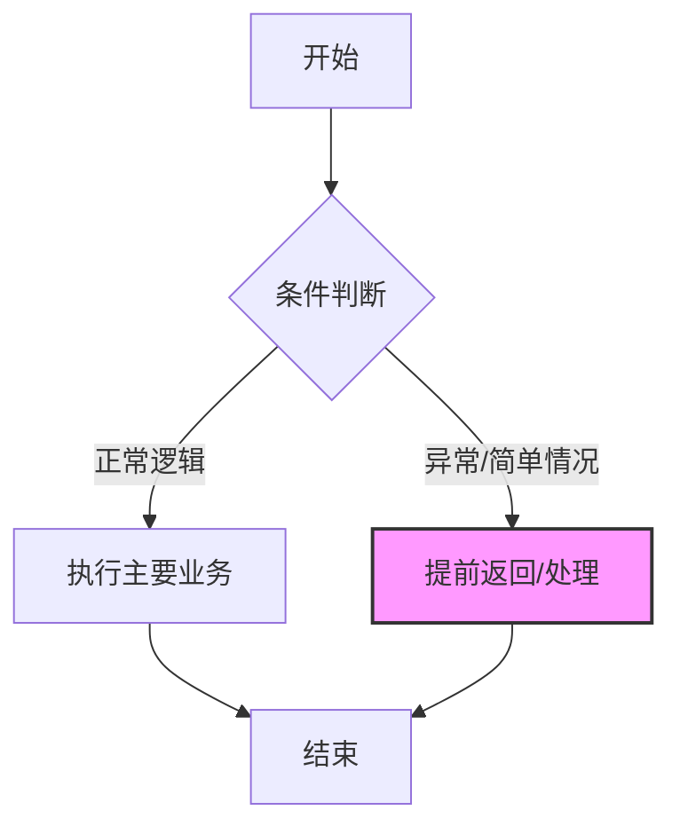
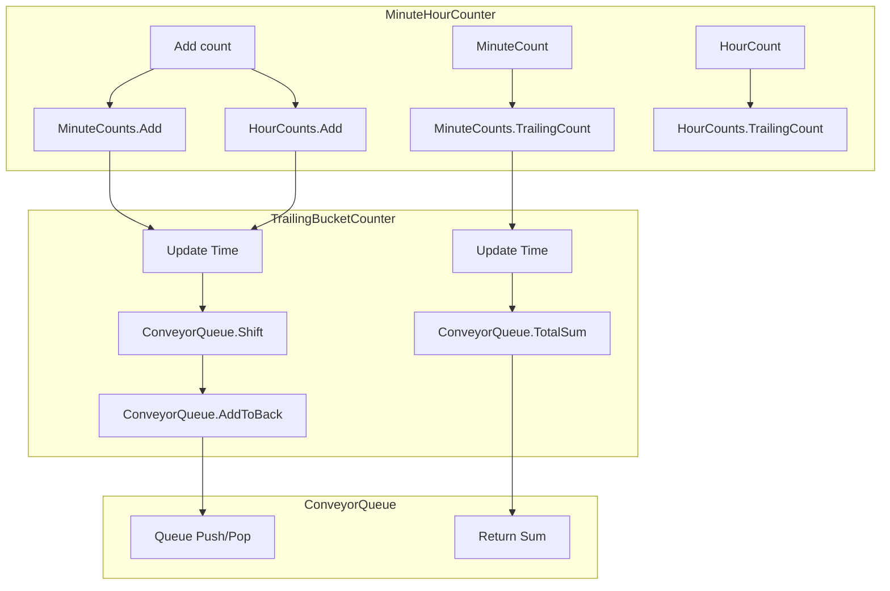

# 《编写可读代码的艺术》章节总结

## 书籍信息
- **书名**：编写可读代码的艺术 (The Art of Readable Code)
- **作者**：[美] Dustin Boswell & Trevor Foucher
- **译者**：尹哲, 郑秀雯
- **出版社**：机械工业出版社 (O'Reilly Media 授权)
- **PDF 状态**：完整文本识别
- **OCR 状态**：良好，部分代码片段格式需人工校对还原

## 目录说明
- **目录识别情况**：完整识别，包含前言、四大部分共15章及附录。
- **章节对应依据**：严格遵循原书目录结构，分为“表面层次的改进”、“简化循环和逻辑”、“重新组织代码”、“精选话题”。
- **OCR 修复说明**：代码示例中的特殊符号（如 `!=`, `->`）已根据上下文逻辑修正；部分表格内容已转化为 Markdown 表格。

## 全书核心主题
本书的核心理念是**“代码应当易于理解”**，具体定义为：**代码的写法应当使别人理解它所需的时间最小化**。

作者认为，除了正确运行外，优秀的代码必须具备良好的可读性。书中不讨论宏观架构或设计模式，而是聚焦于程序员日常工作的微观细节：命名、注释、格式化、控制流、变量作用域以及代码重构。通过大量来自 C++、Java、Python、JavaScript 的真实案例，对比“坏代码”与“好代码”，提供了一系列立竿见影的技巧。全书旨在帮助开发者从“执行者”转变为“设计者”，通过减少阅读代码的认知负荷，降低维护成本，提升团队协作效率。

---

## 前言

### 核心论点
代码最重要的读者是人，而非编译器。好代码能让人快速理解、轻松维护、容易扩展，体现了程序员对工作和同事的尊重。

### 关键概念
- **可读性基本定理**：代码的写法应当使别人理解它所需的时间最小化。
- **理解代码时间**：指通读代码并完全理解其功能、交互及潜在缺陷所需的时间。
- **少并不总是好**：减少代码行数是好目标，但最小化理解时间才是最高准则。有时增加注释或拆分表达式虽增加行数，却能减少理解时间。

### 经典金句
> “代码最重要的读者就不再是编译器、解释器或者电脑了，而是人。”

> “少的代码并不总是更好！... 把理解代码所需的时间最小化是一个更好的目标。”

---

## 第一部分：表面层次的改进

## 第2章：把信息装到名字里

### 核心论点
命名是代码可读性的基石。好的名字应像简短的注释，承载尽可能多的信息，避免模糊和空洞。

### 关键概念
- **选择专业的词**：避免使用 `get`、`size` 等空洞词汇，改用 `fetch`、`download`、`num_nodes` 等具体词汇。
- **避免泛泛的名字**：除非有特定理由（如临时交换变量），否则避免使用 `tmp`、`retval`、`foo`。
- **具体代替抽象**：用 `CanListenOnPort()` 代替 `ServerCanStart()`。
- **附带额外信息**：在名字中体现单位（`delay_ms`）、状态（`plaintext_password`）或格式（`html_utf8`）。
- **名字长度与作用域**：小作用域可用短名（如循环内的 `i`），大作用域需长名以明确含义。
- **格式传递含义**：利用大小写、下划线区分常量、成员变量、局部变量（如 `kMaxOpenFiles`, `offset_`）。

### 逻辑推演
作者首先指出名字是信息的载体，然后通过反面案例（如 `GetPage`、`Size`）展示模糊命名的危害。接着提出具体策略：选用专业动词、拒绝无意义临时变量、为变量添加属性后缀。最后讨论名字长度平衡，指出编辑器自动补全消除了长名字的输入障碍，强调一致性格式的重要性。

### 经典金句
> “把信息装入名字中。”

> “如果你要使用像 tmp、it 或者 retval 这样空泛的名字，那么你要有个好的理由。”

---

## 第3章：不会误解的名字

### 核心论点
名字不仅要包含信息，还必须消除歧义。要预判读者可能产生的误解，并主动规避。

### 关键概念
- **避免二义性动词**：如 `filter`（是保留还是剔除？），建议改用 `select` 或 `exclude`。
- **范围命名规范**：
    - 包含极限：用 `min`/`max`（如 `MAX_ITEMS`）。
    - 包含范围：用 `first`/`last`。
    - 包含/排除范围：用 `begin`/`end`。
- **布尔值命名**：使用 `is`、`has`、`can`、`should` 前缀，避免反义命名（如用 `use_ssl` 代替 `disable_ssl`）。
- **匹配用户期望**：遵守惯例，如 `get` 应为轻量级操作，若计算量大应命名为 `compute`。

### 逻辑推演
通过 `Filter()` 和 `Clip()` 的例子展示常见歧义。随后针对数值范围、布尔逻辑给出具体命名模板。最后通过 `getMean()` 和 `list::size()` 的案例，强调命名需符合调用者的心理预期，避免因命名误导导致性能陷阱。

### 经典金句
> “要多问自己几遍：‘这个名字会被别人解读成其他的含义吗？’”

> “不会误解的名字是最好的名字。”

---

## 第4章：审美

### 核心论点
代码的视觉布局直接影响阅读速度。一致的、有意义的格式化能让代码“养眼”，从而降低认知负担。

### 关键概念
- **一致性**：相似的代码块应具有相似的“剪影”。
- **列对齐**：对变量定义、参数列表进行列对齐，便于快速扫描和发现错误。
- **有意义的顺序**：变量声明按字母、重要性或逻辑关联排序，并始终保持一致。
- **代码分段**：使用空行将代码划分为逻辑“段落”，类似文章分段。
- **个人风格 vs 一致性**：团队内的一致性优于个人偏好的“正确”风格。

### 逻辑推演
作者对比了凌乱与整洁的代码布局，指出审美不仅是美观，更是效率。通过调整换行、对齐参数、重组方法声明顺序等具体技巧，展示如何优化代码视觉流。强调空行作为逻辑分隔符的作用，并重申团队规范的重要性。

### 经典金句
> “一致的风格比‘正确’的风格更重要。”

> “大家都愿意读有美感的代码。”

---

## 第5章：该写什么样的注释

### 核心论点
注释的目的是补充代码无法直接表达的信息，帮助读者达到与作者相同的理解水平，而非重复代码本身。

### 关键概念
- **不需要注释的情况**：能从代码快速推断的事实、粉饰烂代码的“拐杖式注释”。
- **记录思想**：
    - **导演评论**：解释为什么这么写（如性能权衡、妥协方案）。
    - **瑕疵标记**：使用 `TODO`、`FIXME`、`HACK` 记录待改进处。
    - **常量故事**：解释魔法数字的来源或调整指南。
- **站在读者角度**：
    - **意料之中的提问**：解释非直观的实现（如 swap trick）。
    - **公布陷阱**：警告线程安全、性能瓶颈、副作用。
    - **全局观注释**：在文件/类级别解释整体架构和数据流。
    - **总结性注释**：在长函数中用注释概括后续代码块的意图。

### 逻辑推演
首先界定注释的边界，剔除无效注释。然后重点阐述哪些“隐性知识”需要显性化：作者的思考过程、已知缺陷、常量背景。接着引入“读者视角”，要求作者预判读者的困惑点并提前解答。最后提倡克服写作障碍，先写下粗糙想法再润色。

### 经典金句
> “注释的目的是尽量帮助读者了解得和作者一样多。”

> “不要给不好的名字加注释——应该把名字改好。”

---

## 第6章：写出言简意赅的注释

### 核心论点
注释应具备高“信息/空间率”，力求紧凑、精确，避免冗余和模糊。

### 关键概念
- **保持紧凑**：合并多行注释，去除废话。
- **避免不明代词**：明确 `it`、`this` 指代的对象。
- **精确描述行为**：明确函数边界条件（如是否包含换行符）。
- **输入/输出示例**：用具体例子说明复杂逻辑或边界情况。
- **声明意图**：注释应说明“为什么”或“做什么”，而非“怎么做”，以便发现代码与意图的偏差。
- **具名函数参数**：在调用处用注释模拟命名参数（如 `/*timeout_ms=*/10`）。
- **高信息量词汇**：使用专业术语（如 `cache`、`canonicalize`）替代长篇大论。

### 逻辑推演
承接上一章，本章聚焦注释的写作技巧。通过精简句子、消除歧义代词、增加具体示例等方法，提升注释密度。特别强调用示例解释复杂函数，以及用注释揭示代码意图以辅助查错。

### 经典金句
> “注释应当有很高的信息/空间率。”

---

## 第二部分：简化循环和逻辑

## 第7章：把控制流变得易读

### 核心论点
控制流应自然流畅，减少读者的思维跳跃和嵌套层级，使执行路径一目了然。

### 关键概念
- **条件语句参数顺序**：左侧放变化的值，右侧放稳定的值（如 `if (bytes_received < bytes_expected)`）。
- **if/else 顺序**：优先处理正逻辑、简单情况、有趣/可疑情况。
- **三目运算符**：仅在简单赋值时使用，复杂逻辑应用 if/else。
- **避免 do/while**：条件后置不符合阅读习惯，易导致混淆，建议改为 while。
- **提前返回**：使用 Guard Clauses（保护语句）处理异常/简单情况，减少嵌套。
- **最小化嵌套**：通过 return/continue 打破深层嵌套，减轻“思维栈”压力。
- **警惕隐蔽控制流**：慎用线程、异常、虚函数等使流程不透明的特性。

### 逻辑推演
从微观的比较操作符顺序入手，讨论 if/else 块的排列策略。接着批判 do/while 和过度使用的三目运算符。重点阐述如何通过“提前返回”和“continue”来扁平化代码结构，减少嵌套深度。最后提醒注意高层控制流的清晰度。

### 流程图

### 经典金句
> “把条件、循环以及其他对控制流的改变做得越‘自然’越好。”

> “嵌套的代码块需要更加集中精力去理解。每层新的嵌套都需要读者把更多的上下文‘压入栈’。”

---

## 第8章：拆分超长的表达式

### 核心论点
人类短期记忆有限，超长表达式会增加认知负荷。应将其拆分为易理解的小块。

### 关键概念
- **解释变量**：引入中间变量命名子表达式，解释其含义。
- **总结变量**：用简短名字概括复杂逻辑，突出主要概念。
- **德摩根定理**：简化布尔逻辑（`!(a && b) <=> !a || !b`）。
- **避免滥用短路逻辑**：不要在条件判断中嵌入赋值或复杂副作用。
- **反向思考**：若正向逻辑复杂，尝试从反面（如“不重叠”）入手简化。
- **拆分巨大语句**：提取重复子表达式为变量或函数。

### 逻辑推演
通过几何距离计算和范围重叠判断的案例，展示复杂逻辑如何令人困惑。引入“解释变量”作为最直接的拆分手段。接着利用逻辑定律简化布尔表达式。最后通过“反向思考”策略，将复杂的重叠判断转化为简单的非重叠判断，证明重构思路的重要性。

### 经典金句
> “把你的超长表达式拆分成更容易理解的小块。”

> “要小心‘智能’的小代码段——它们往往在以后会让别人读起来感到困惑。”

---

## 第9章：变量与可读性

### 核心论点
变量越多、作用域越大、变化越频繁，代码越难理解。应减少变量数量，缩小作用域，偏好只写一次的变量。

### 关键概念
- **减少变量**：移除无价值的临时变量、中间结果变量、控制流变量（如 `done` flag）。
- **缩小作用域**：
    - 将成员变量降格为局部变量。
    - 在 C++ if 条件中定义变量。
    - JavaScript 中使用闭包创建私有变量。
    - Python/JS 中注意块级作用域缺失问题，尽早定义或使用立即执行函数。
- **只写一次的变量更好**：常量（const/final）或不可变对象更易推理。
- **把定义向下移**：在首次使用前才定义变量，减少同时关注的变量数。

### 逻辑推演
分析变量带来的认知负担。首先展示如何删除不必要的临时变量和控制标志。然后深入讨论作用域管理，通过不同语言的特性（C++、JS、Python）展示如何限制变量可见性。最后强调“只写一次”原则，提倡使用常量和不可变数据结构。

### 经典金句
> “让你的变量对尽量少的代码行可见。”

> “只写一次的变量更好。”

---

## 第三部分：重新组织代码

## 第10章：抽取不相关的子问题

### 核心论点
将大问题拆解为小问题。积极识别并抽取与主逻辑无关的子问题，形成独立函数或库。

### 关键概念
- **识别子问题**：询问每行代码是否直接服务于高层次目标。
- **纯工具代码**：如文件读取、字符串格式化，应抽取为通用工具函数。
- **项目专有功能**：如 URL 友好化处理，虽不通用但也应抽取以隔离复杂度。
- **简化接口**：为粗糙的底层 API 创建简洁的包装函数（Wrapper）。
- **过犹不及**：避免过度拆分导致函数碎片化，增加跳转成本。

### 逻辑推演
通过查找最近地点的例子，展示如何将复杂的几何计算抽取为 `spherical_distance`。接着讨论通用工具代码和项目特定代码的抽取策略。强调通过封装粗糙接口（如 Cookie 操作）来提升主逻辑的可读性。最后警告不要过度拆分，保持平衡。

### 经典金句
> “积极地发现并抽取出不相关的子逻辑。”

> “把一般代码和项目专有的代码分开。”

---

## 第11章：一次只做一件事

### 核心论点
代码块不应同时承担多个任务。应将代码组织得每次只做一件事，通过分段或拆分函数实现。

### 关键概念
- **任务分解**：列出代码块所做的所有任务（如解析、计算、更新）。
- **逻辑分段**：在函数内部用空行和注释将不同任务的代码隔开。
- **抽取函数**：将独立的任务提取为子函数。
- **案例**：投票分数更新、地址格式化、网页爬虫统计。

### 逻辑推演
以投票插件为例，展示如何将“解析投票值”和“更新总分”两个任务分离。再通过地址格式化案例，演示如何从混杂的逻辑中梳理出“提取值”、“确定城市”、“确定国家”、“组合字符串”四个步骤，并分别实现。最后通过爬虫统计案例，展示如何通过分段或抽取函数来清理交织的逻辑。

### 经典金句
> “应该把代码组织得一次只做一件事情。”

---

## 第12章：把想法变成代码

### 核心论点
先用自然语言清晰描述逻辑，再将其转化为代码。自然语言的描述能揭示逻辑本质，指导代码结构。

### 关键概念
- **自然语言描述**：像对同事解释一样描述代码意图。
- **关键词映射**：从描述中提取关键词，对应到代码结构。
- **库的利用**：熟悉标准库可简化实现（如 jQuery 的 `.next()`）。
- **递归应用**：对子问题同样使用自然语言描述，指导进一步重构。

### 逻辑推演
通过权限检查和提示轮播两个案例，展示如何用自然语言重述逻辑，从而发现更简洁的代码实现（如消除嵌套、利用库函数）。在股票数据对齐的大案例中，通过描述“并行读取、跳过不匹配、输出匹配”，引导出 `AdvanceToMatchingTime` 函数的抽取，并进一步优化其内部逻辑。

### 经典金句
> “代码应当用‘自然语言’编写。”

> “如果你不能把问题说明白或者用词语来做设计，估计是缺少了什么东西或者什么东西缺少定义。”

---

## 第13章：少写代码

### 核心论点
最好的代码是没有代码。每行代码都是负债。通过削减需求、重用库、删除无用代码来保持代码库轻量。

### 关键概念
- **质疑需求**：不要实现不需要的功能（YAGNI）。简化问题场景（如只在德州找店，无需考虑地球曲率）。
- **保持小代码库**：代码库越大，维护难度呈指数增长。
- **删除无用代码**：果断删除未使用或失效的功能代码。
- **熟悉库**：定期浏览标准库 API，避免重复造轮子。
- **利用 Unix 工具**：用命令行工具组合替代自定义脚本。

### 逻辑推演
首先强调代码的维护成本。通过商店定位器和缓存案例，展示如何通过简化需求大幅减少代码量。接着讨论代码库膨胀的危害，提倡定期修剪无用代码。最后强调熟悉标准库和利用现有工具的重要性，以实现“少写代码”的目标。

### 经典金句
> “最好读的代码就是没有代码。”

> “知道什么时候不写代码可能对于一个程序员来讲是他所要学习的最重要的技巧。”

---

## 第四部分：精选话题

## 第14章：测试与可读性

### 核心论点
测试代码也应具备高可读性。易读的测试能促进更多测试的编写，并作为活文档帮助理解被测代码。

### 关键概念
- **隐藏细节**：封装 setup 代码，突出测试核心逻辑。
- **定制微语言**：创建辅助函数（如 `CheckScoresBeforeAfter`），用一行代码表达测试意图。
- **可读的错误消息**：失败时应清晰展示输入、期望输出、实际输出。
- **选择好的输入**：使用最简单且能覆盖逻辑的输入值，避免随意的大数。
- **多个小测试**：相比单个大而全的测试，多个针对性的小测试更易读、易调试。
- **描述性命名**：测试函数名应包含被测函数和场景（如 `Test_SortAndFilterDocs_NegativeValues`）。

### 逻辑推演
从一个糟糕的测试案例出发，逐步重构：封装辅助函数、创建领域特定语言（DSL）、优化错误输出、简化输入数据、拆分测试用例。最后讨论测试驱动开发（TDD）对设计的正面影响，以及可测试性与良好设计的正相关关系。

### 经典金句
> “测试应当具有可读性，以便其他程序员可以舒服地改变或者增加测试。”

> “每个测试的最高一层应该越简明越好。最好每个测试的输入/输出可以用一行代码来描述。”

---

## 第15章：设计并改进“分钟/小时计数器”

### 核心论点
通过一个具体案例（MinuteHourCounter），展示如何从幼稚实现逐步演进到高性能、高可读、灵活的设计。

### 关键概念
- **接口设计**：命名要准确（`Add` 而非 `Count`），注释要消除歧义。
- **尝试1：幼稚方案**：存储所有事件列表。问题：内存无限增长，查询 O(N)。
- **尝试2：传送带设计**：双链表移动数据。问题：内存仍随流量增长，逻辑复杂。
- **尝试3：时间桶设计**：
    - **分层抽象**：`MinuteHourCounter` -> `TrailingBucketCounter` -> `ConveyorQueue`。
    - **固定内存**：使用离散桶（Buckets），内存占用固定。
    - **时钟无关**：传入当前时间，便于测试和解耦。
- **权衡**：精度 vs 性能/内存。

### 逻辑推演
首先定义接口并优化命名注释。接着实现一个简单的基于列表的方案，指出其性能缺陷。然后改进为传送带模式，解决部分问题但引入复杂性。最后引入“时间桶”概念，通过三层类的拆分，实现了一个固定内存、O(1) 查询、高精度的解决方案。对比三种方案的代码量、性能和灵活性，证明重构的价值。

### 流程图

### 经典金句
> “这是一个正面的改进：有100行易读的代码比有50行不易读的要好。”

---

## 附录：深入阅读

### 核心论点
推荐进一步阅读的经典书籍，涵盖代码构建、重构、编程实践等领域。

### 关键书籍
- **《Code Complete》**：软件构建百科全书。
- **《Refactoring》**：重构方法论奠基之作。
- **《Clean Code》**：Java 领域的代码整洁之道。
- **《The Pragmatic Programmer》**：程序员职业素养与实践。
- **《Effective Java》**：Java 最佳实践。

### 经典金句
> “与其把我们主要的任务想象成指示计算机做什么，不如让我们关注解释给人类我们希望让计算机做什么。” —— Donald E. Knuth

