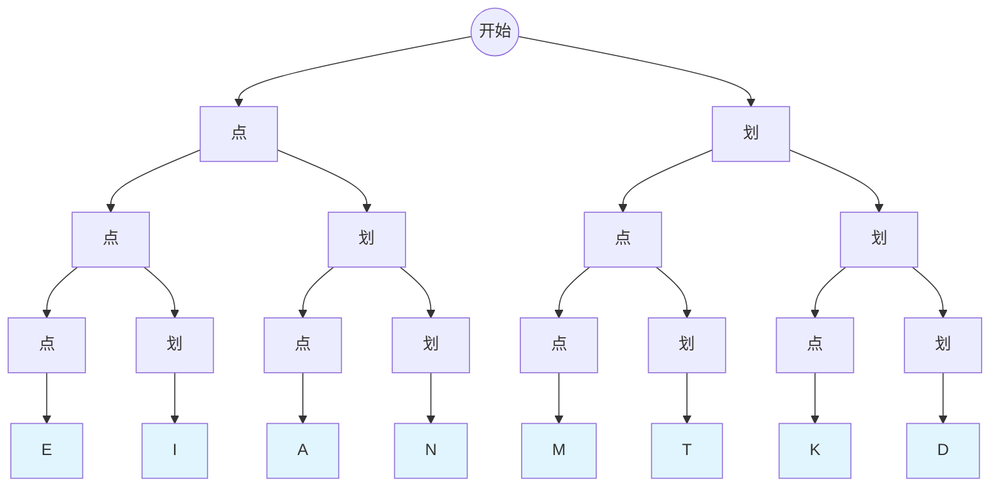
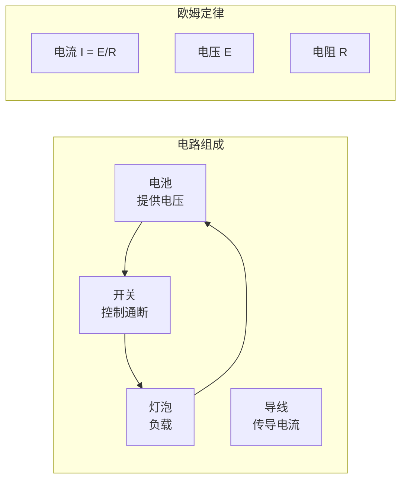
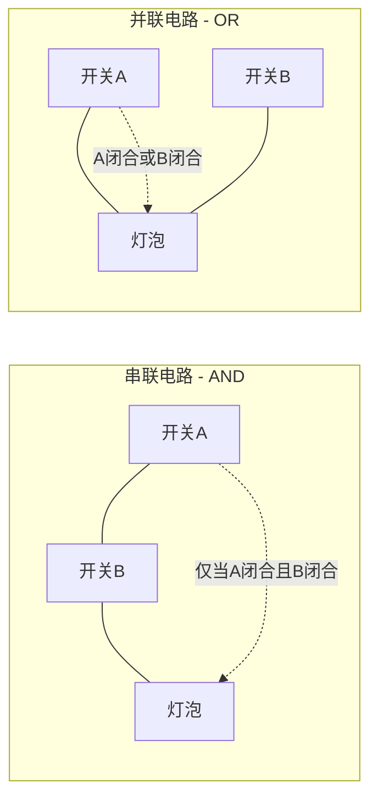
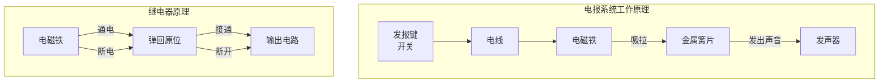
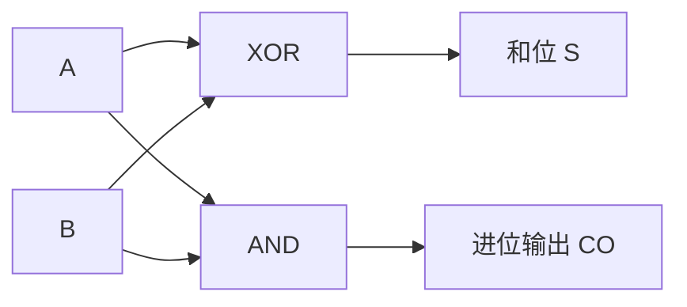
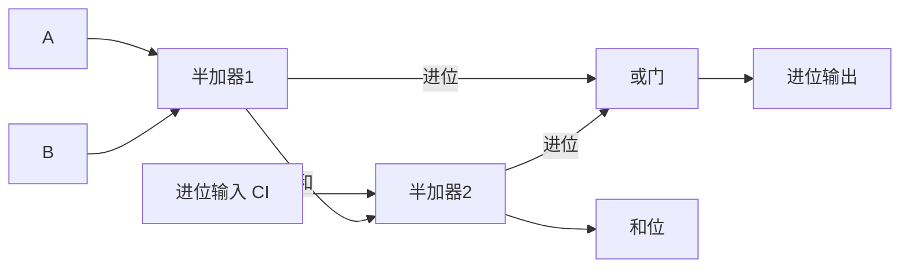
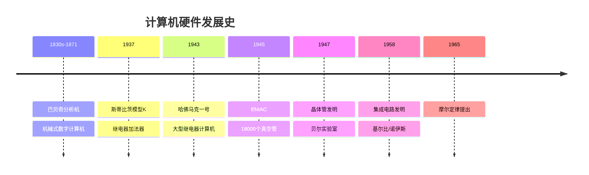
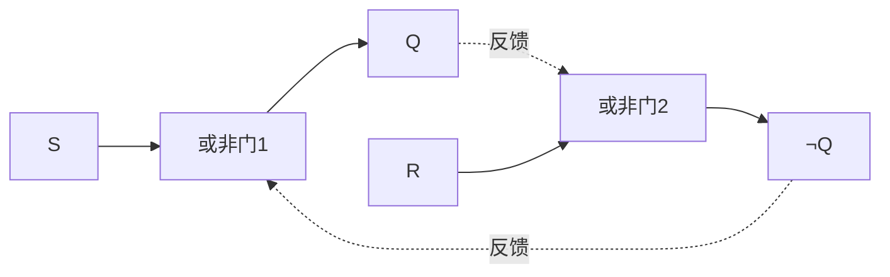

# 《编码：隐匿在计算机软硬件背后的语言》章节总结

## 书籍信息
- **书名**：《编码：隐匿在计算机软硬件背后的语言》（原书第2版）
- **英文名**：Code: The Hidden Language of Computer Hardware and Software, Second Edition
- **作者**：[美] 查尔斯·佩措尔德（Charles Petzold）
- **译者**：张建锋
- **出版社**：机械工业出版社
- **出版年份**：2025年（第2版），2026年第3次印刷
- **ISBN**：978-7-111-78509-5

## 目录说明
- **目录识别情况**：PDF中提供了完整的目录结构（第11-12页），共28章。
- **章节对应依据**：目录与正文标题一致。
- **OCR状态**：文字层PDF，识别质量良好，但部分图表为图片形式，无法提取文字内容。页码从第1页开始，至第408页结束。本书实际内容仅到第17章，后续章节未在提供的PDF范围内。

## PDF状态说明
> 说明：本次上传的PDF包含全书目录和前言，但正文仅从第1章至第17章（第408页）完整呈现。第18章至第28章内容未在提供的PDF范围内。以下总结基于可识别的第1-17章内容。

## 全书核心主题

本书旨在从最基础的概念出发，逐步深入地解释数字计算机的工作原理。作者避免使用大量隐喻和类比，而是采用工程师实际使用的语言和符号，借助古老的技术（如继电器）来展示普遍原理。第2版（2023年出版）相比第1版（1999年）增加了约70页内容，重点弥补了第1版中未能充分展示CPU内部工作原理的缺陷。

全书以“编码”概念为主线，从莫尔斯电码、布莱叶盲文等人类通信编码开始，逐步过渡到二进制、逻辑门、加法器、触发器、存储器等计算机硬件核心组件，最终揭示计算机软硬件背后的统一逻辑。

---

## 第1章：最好的朋友

### 1. 核心论点
本章通过两个孩子用手电筒在夜间交流的故事，引出“编码”这一核心概念。问题：如何在不同场景下进行有效通信？作者观点：编码是一种在人与人之间、人与计算机之间传递信息的体系，不同的编码在不同场景下各具优势。

### 2. 关键概念/事件
- **莫尔斯电码**：由塞缪尔·莫尔斯于1837年左右发明，使用“点”（短闪）和“划”（长闪）两种基本元素表示字母和数字。
- **编码**：一种在人与人之间、人与计算机之间，或计算机自身内部传递信息的体系。
- **SOS**：三个点、三个划、三个点组成的国际求救信号，易于记忆。
- **编码的多样性**：口语、手语、书面语言、布莱叶盲文、速记等，不同场景适用不同编码。

### 3. 叙事脉络
故事从两个孩子卧室窗户相对开始，他们想用手电筒夜间交流。最初尝试在空中画字母失败，后尝试用闪烁次数对应字母（A闪1次，B闪2次...），但效率太低。最终发现莫尔斯电码，它只用两种闪烁（短和长）就能高效编码所有信息。由此引出编码的本质：两种不同的事物通过适当组合可以传达所有类型的信息。

### 4. 经典金句/数据
> “这里的关键词是‘2’。2种闪烁、2种声音——实际上任何2种不同的事物，通过适当的组合都可以传达所有类型的信息。”（p.18）
> “‘How are’you?’这句话只需要32次闪烁（包括短闪和长闪），而不再是131次，这还包括了问号的编码。”（p.14）

---

## 第2章：编码与组合

### 1. 核心论点
本章探讨莫尔斯电码的数学结构，引出2的幂这一核心规律。问题：如何系统化地理解和解码莫尔斯电码？作者观点：莫尔斯电码是一种二元编码，其编码数量为2的n次幂，其中n是“点”和“划”的总数。

### 2. 关键概念/事件
- **二元编码**：由两种基本元素组成的编码系统。
- **2的幂**：编码数量 = 2ⁿ，其中n是元素数量。
- **树状解码图**：一种从根节点出发，沿“点”和“划”分支查找字母的解码方法。
- **编码数量公式**：1位→2种，2位→4种，3位→8种，4位→16种，n位→2ⁿ种。

### 3. 逻辑推演
作者首先展示按字母顺序排列的莫尔斯电码表，指出其不利于解码。随后按编码长度重新组织：1位编码（2种：E、T），2位编码（4种：I、A、N、M），3位编码（8种），4位编码（16种）。观察发现每张表的编码数量是前一张的两倍，由此归纳出2ⁿ的规律。最后以树状图形式展示完整的莫尔斯电码解码结构。

### 4. 流程图

### 5. 经典金句/数据
> “编码的数量 = 2ⁿ”（p.22）
> “二元对象（如硬币）的组合和二元编码（例如莫尔斯电码）通常都使用2的幂来描述。在本书中，2是一个非常重要的数字。”（p.23）

---

## 第3章：布莱叶盲文与二元编码

### 1. 核心论点
本章以布莱叶盲文为例，展示另一种6位二元编码系统。问题：盲人如何有效阅读和书写？作者观点：布莱叶盲文通过2×3点阵中点的凸起与否，创造了64种唯一编码，是二元编码的又一经典案例。

### 2. 关键概念/事件
- **路易斯·布莱叶**（1809-1852）：法国盲人，15岁时发明了6点盲文系统。
- **查尔斯·巴尔比耶**：法国陆军上尉，发明了“夜间书写”系统，启发了布莱叶。
- **6点编码**：2×3点阵，每个点凸起或平坦，共有2⁶=64种可能。
- **二级布莱叶盲文**：使用缩写提高阅读速度的扩展系统。
- **先行码/转换码**：改变后续编码含义的特殊编码（如数字标识符、大写标识符）。
- **转义码**：允许脱离常规解析方式的编码。

### 3. 叙事脉络
从布莱叶的身世讲起：3岁失明，10岁进入巴黎皇家盲人学校。学校的凸起字母系统难以使用。布莱叶接触到巴尔比耶的“夜间书写”后，受到启发，在15岁时发明了自己的6点盲文系统。随后解析盲文的编码结构：小写字母、数字（通过数字标识符转换）、标点符号、缩写等，并说明64种可能编码几乎全部被使用。

### 4. 关键数据
- 布莱叶盲文采用2×3点阵 → 2⁶ = 64种编码
- 八点布莱叶盲文 → 2⁸ = 256种编码

### 5. 经典金句/数据
> “转换码的作用类似于在计算机键盘上按住Shift键...布莱叶盲文中的大写标识符...这种编码被称为‘转义码’。”（p.30）
> “早在1855年，一些布莱叶盲文的倡导者就开始通过增加两个点的方式来扩展这套体系。八点布莱叶盲文...将唯一编码的数量增加到了2⁸——也就是256个。”（p.30）

---

## 第4章：手电筒的剖析

### 1. 核心论点
本章通过拆解手电筒，介绍电路的基本概念。问题：电是如何工作的？作者观点：理解电路的基本要素（电压、电流、电阻）和二元状态（开/关）是理解计算机硬件的基础。

### 2. 关键概念/事件
- **电路**：电流流动的环路，必须完整闭合才能工作。
- **电子理论**：电流是电子从原子到原子的运动。
- **电压（V）**：做功的势能，以伏特为单位，以亚历山大·伏特命名。
- **电流（I）**：单位时间内通过电路某一点的电子数，以安培为单位。
- **电阻（R）**：物质阻碍电子流动的倾向，以欧姆为单位。
- **欧姆定律**：I = E/R（电流 = 电压 / 电阻）
- **功率（P）**：P = E × I，以瓦特为单位。
- **导体 vs 绝缘体**：铜、银、金是良导体；橡胶、塑料、干燥空气是绝缘体。
- **短路**：用低电阻导线直接连接电池正负极，会导致大电流。

### 3. 逻辑推演
从手电筒的物理结构（电池、灯泡、开关、导线）出发，解释每个组件的作用。通过示意图展示如何连接电路点亮灯泡。引入电子理论解释电流的本质。定义电压、电流、电阻三个基本概念及其关系（欧姆定律）。最后指出手电筒的二元特性：开关要么闭合要么断开，灯泡要么亮要么不亮。

### 4. 流程图

### 5. 经典金句/数据
> “电路是一个环路。只有在电池到导线，再到灯泡和开关，然后通过导线回到电池的整个回路连通的情况下，灯泡才能被点亮。”（p.32）
> “就像莫尔斯和布莱叶发明的二元编码一样，这个简单的手电筒要么打开着，要么关闭着，没有中间状态。”（p.38）

---

## 第5章：绕过拐角的通信

### 1. 核心论点
本章通过扩展手电筒电路实现远距离通信，引入接地概念。问题：如何在视线之外进行远距离通信？作者观点：通过电线和公共回路（甚至利用地球作为导体），可以绕过物理障碍进行通信。

### 2. 关键概念/事件
- **公共回路**：多个电路共享的公共部分，可减少布线数量。
- **接地（Ground/Earth）**：利用地球作为巨大导体和电子源/储存库。
- **接地符号**：电气工程师使用的标准化符号。
- **电线电阻问题**：电线越长，电阻越大，电流越小，限制了通信距离。

### 3. 逻辑推演
从两个卧室窗户不对着的问题出发：用电池、灯泡、开关和电线自制远距离“手电筒”。最初用4根电线连接两个电路，发现可用公共回路减少到3根。进一步发现可用地球替代公共导线，只需2根电线。但地球电阻较大，低电压电池无法驱动。最后讨论电线电阻随长度增加的问题，为第7章继电器的引入做铺垫。

### 4. 经典金句/数据
> “地球之于电子，就像海洋之于水滴。地球是一个几乎无限的电子源，也是一片巨大的电子海。”（p.44）
> “最后用来解决这个问题的只是一个简单而不起眼的装置，但正是基于这个装置，整个计算机系统才被构建出来。”（p.46）

---

## 第6章：逻辑与开关

### 1. 核心论点
本章将布尔代数与电路开关联系起来。问题：如何用数学表示逻辑推理，并将其转化为物理电路？作者观点：乔治·布尔的代数系统可以用开关的串联（AND）和并联（OR）来实现，从而将逻辑运算转化为电路行为。

### 2. 关键概念/事件
- **乔治·布尔**（1815-1864）：英国数学家，发明布尔代数，著有《思维规律的研究》。
- **布尔代数**：用代数符号表示逻辑运算的系统，操作数代表类（集合），而非数字。
- **AND（与）**：两个集合的交集，只有当两个条件都满足时才为真。
- **OR（或）**：两个集合的并集，只要有一个条件满足就为真。
- **NOT（非）**：从全集中排除某事物。
- **串联开关**：两个开关一个接一个连接，只有两个都闭合时灯泡才亮 → 实现AND运算。
- **并联开关**：两个开关并排连接，只要有一个闭合灯泡就亮 → 实现OR运算。

### 3. 逻辑推演
从亚里士多德的三段论切入，引出布尔代数。以猫的分类为例解释布尔代数中的类、并集、交集、全集和空集。展示布尔表达式如何描述复杂条件（如“已绝育的公猫，白色或棕褐色”）。接着将布尔代数与电路连接：串联开关实现AND，并联开关实现OR。最后用开关电路验证猫的条件表达式。

### 4. 流程图

### 5. 真值表

**AND真值表**：

| A | B | 输出 |
|---|---|---|
| 0 | 0 | 0 |
| 0 | 1 | 0 |
| 1 | 0 | 0 |
| 1 | 1 | 1 |

**OR真值表**：

| A | B | 输出 |
|---|---|---|
| 0 | 0 | 0 |
| 0 | 1 | 1 |
| 1 | 0 | 1 |
| 1 | 1 | 1 |

### 6. 经典金句/数据
> “乔治·布尔从来没有连接过这样一个电路，他也没能看到如何用开关、电线和灯泡来实现一个布尔表达式。”（p.48）

---

## 第7章：电报机与继电器

### 1. 核心论点
本章介绍电报机和继电器的发明与工作原理。问题：如何实现超远距离的即时通信？作者观点：电报机利用电磁铁将电信号转化为机械动作，继电器则通过电磁铁控制开关，实现信号放大和中继。

### 2. 关键概念/事件
- **塞缪尔·莫尔斯**（1791-1872）：美国画家、发明家，1844年成功演示电报机。
- **电磁铁**：电流通过缠绕铁棒的线圈时，铁棒变成磁铁；断开电流则失去磁性。
- **发报键**：为最大限度提高发报速度而设计的特殊开关。
- **发声器**：电磁铁吸拉金属杆发出“滴嗒”声，操作员通过声音解码莫尔斯电码。
- **继电器**：用电流控制开关的设备，可放大微弱信号、实现中继。

### 3. 叙事脉络
从莫尔斯的生平切入（画家、摄影爱好者），介绍电报的发明背景。解释电磁铁原理，展示电报机的基本电路（发报键-电线-发声器）。提出长距离传输的电阻问题：电线无法无限延伸。解决方案：设置中继站，由人工接收并转发信息。但莫尔斯更早理解了“中继器”概念——用小木条连接发声器和发报键，实现自动转发，这就是继电器。

### 4. 流程图

### 5. 经典金句/数据
> “1844年5月24日是历史性的一天，一条架设在华盛顿特区和马里兰州巴尔的摩之间的电报线路成功地传送了《民数记》23:23中的一句话：‘What hath God wrought!’”（p.51）
> “继电器是一种了不起的设备。它确实是一种开关，但这种开关的打开和关闭不是通过人手——而是通过电流来控制的。”（p.54）

---

## 第8章：继电器与逻辑门

### 1. 核心论点
本章将继电器连接成逻辑门，实现布尔运算。问题：如何用继电器构建AND、OR、NOT等基本逻辑运算？作者观点：通过将继电器串联、并联或使用常闭触点，可以构建与门、或门、与非门、或非门、反相器和缓冲器六种基本逻辑门。

### 2. 关键概念/事件
- **逻辑门**：执行布尔逻辑中简单运算的电路，通过阻断或允许电流流动来实现。
- **与门（AND）**：两个继电器串联，两个输入都为1时输出为1。
- **或门（OR）**：两个继电器并联，任一输入为1时输出为1。
- **反相器（NOT）**：使用继电器的常闭输出，将0变1、1变0。
- **与非门（NAND）**：与门输出取反。
- **或非门（NOR）**：或门输出取反。
- **缓冲器**：输出与输入相同，用于增强信号或延迟。
- **克劳德·香农**：1938年发表“继电器与开关电路的符号分析”，将布尔代数与电路联系起来。
- **德·摩根定律**：¬(A ∧ B) = ¬A ∨ ¬B；¬(A ∨ B) = ¬A ∧ ¬B。

### 3. 逻辑推演
从第6章的猫选择电路出发，展示如何用开关电路实现布尔表达式。引入继电器后，可以用电流控制开关，实现更复杂的逻辑。逐一构建与门（串联继电器）、或门（并联继电器）、反相器（常闭输出）、与非门、或非门、缓冲器。展示如何使用与非门构建所有其他逻辑门（德·摩根定律）。最后介绍标准逻辑门符号。

### 4. 逻辑门真值表汇总

| 门类型 | 符号 | 输入A | 输入B | 输出 |
|--------|------|-------|-------|------|
| AND | & | 0/0/1/1 | 0/1/0/1 | 0/0/0/1 |
| OR | ≥1 | 0/0/1/1 | 0/1/0/1 | 0/1/1/1 |
| NOT | ○ | 0/1 | - | 1/0 |
| NAND | &○ | 0/0/1/1 | 0/1/0/1 | 1/1/1/0 |
| NOR | ≥1○ | 0/0/1/1 | 0/1/0/1 | 1/0/0/0 |
| XOR | =1 | 0/0/1/1 | 0/1/0/1 | 0/1/1/0 |

### 5. 经典金句/数据
> “归结其本质，计算机就是布尔代数与电学的结合体。实现数学与硬件融合的关键部件称为逻辑门。”（p.55）
> “如果只能从我展示的6种逻辑门中选择一种，那么选择NAND（与非）门或NOR（或非）门，因为你可以使用NAND门或NOR门来创建所有其他的逻辑门。”（p.75-76）

---

## 第9章：我们的十个数字

### 1. 核心论点
本章探讨数字体系的起源和结构。问题：为什么我们使用十进制？十进制数字体系有何特点？作者观点：十进制是一种位置相关的数字体系，其优雅之处在于10的幂次结构，这同样适用于任何其他进制。

### 2. 关键概念/事件
- **罗马数字**：I（1）、V（5）、X（10）、L（50）、C（100）、D（500）、M（1000）。
- **印度-阿拉伯数字体系**：起源于印度，经阿拉伯数学家传入欧洲，花剌子模（算法一词来源）是关键人物。
- **位置记数法**：数字的位置决定其代表的数量。
- **0的重要性**：支撑位置记数法，是占位符。
- **10的幂次**：4825 = 4×10³ + 8×10² + 2×10¹ + 5×10⁰。
- **加法表**：十进制一位数加法的完整表格。
- **乘法表**：十进制一位数乘法的完整表格。

### 3. 逻辑推演
从“数字是抽象编码”的观点出发，追溯数字体系的演变：从画鸭子到画竖线到罗马数字。指出罗马数字的局限性（乘除困难）。介绍印度-阿拉伯数字体系的三大特征：位置相关、无专门表示10的符号、有0。以4825为例展示10的幂次展开。呈现加法和乘法表，说明位置记数法的普适性——同样适用于非十进制。

### 4. 经典金句/数据
> “数字无疑是我们平时所能接触到的最抽象的编码。”（p.78）
> “0...是数字和数学历史上最重要的创造之一。它支撑了位置记数法...0还简化了很多在非位置计数体系中很复杂的数学运算，尤其是乘法和除法。”（p.81）

---

## 第10章：十进制的替代

### 1. 核心论点
本章探讨其他进制数字体系（八进制、四进制、二进制）。问题：除了十进制还有哪些计数方式？作者观点：任何正整数都可以作为进制基数，二进制因其与二元编码的天然联系而最为重要，比特（bit）是信息的基本单位。

### 2. 关键概念/事件
- **八进制**：基数为8，使用数字0-7，卡通角色的理想进制。
- **四进制**：基数为4，龙虾的进制。
- **二进制**：基数为2，使用0和1，海豚的进制。
- **3-8解码器**：将3位二进制数转换为8种输出的电路。
- **8-3编码器**：将8选1输入转换为3位二进制输出的电路。
- **比特（bit）**：约翰·图基于1947年创造的词，binary digit的缩写。

### 3. 逻辑推演
以卡通角色（4根手指）为例引入八进制，展示八进制计数方式0-7-10-11...。对比十进制和八进制的数字表示。展示八进制的加法和乘法表。同理引入四进制和二进制。重点展示二进制与2的幂的对应关系，以及二进制数如何转换为十进制。最后介绍3-8解码器和8-3编码器电路，引出“比特”一词的诞生。

### 4. 关键数据

| 2的幂 | 十进制 | 八进制 | 二进制 |
|-------|--------|--------|--------|
| 2⁰ | 1 | 1 | 1 |
| 2¹ | 2 | 2 | 10 |
| 2² | 4 | 4 | 100 |
| 2³ | 8 | 10 | 1000 |
| 2⁴ | 16 | 20 | 10000 |
| 2⁵ | 32 | 40 | 100000 |
| 2⁶ | 64 | 100 | 1000000 |

### 5. 经典金句/数据
> “比特这个词...已被视为信息块的基本构建单位。”（p.103）
> “二进制数最大的优点是加法表要简单得多：0+0=0，0+1=1，1+0=1，1+1=0进位1。”（p.96）

---

## 第11章：二进制数

### 1. 核心论点
本章深入探讨比特作为信息单位的意义。问题：比特如何表示信息？作者观点：信息代表在两个或更多可能性中做出的选择，任何可以简化为在可能性之间选择的信息都可以用比特表示。

### 2. 关键概念/事件
- **保罗·里维尔的提灯**：一盏灯（1比特）表示英军是否入侵，两盏灯（2比特）表示入侵路线。
- **信息=选择**：信息量取决于可能性的数量，每增加1比特，可能性翻倍。
- **编码数量公式**：n比特可表示2ⁿ种可能性。
- **对数与比特**：需要多少比特 = ⌈log₂(可能性数量)⌉。
- **毅力号降落伞编码**：橙色（1）和白色（0）条纹编码了NASA喷气推进实验室的座右铭“DARE MIGHTY THINGS”和地理坐标。
- **通用产品码（UPC）**：95比特编码12位十进制数，包含多种错误校验机制（奇偶校验、模校验）。
- **QR码**：二维条形码，可编码更多信息，包含纠错和定位图案。

### 3. 逻辑推演
从黄丝带故事（1比特：系/不系）引出比特的最小信息单位概念。用保罗·里维尔的故事（1灯→2种可能，2灯→4种可能）说明更多比特可表示更多可能性。引出公式：n比特 = 2ⁿ种可能性。以西斯克尔和艾伯特的影评为例说明比特的上下文依赖。介绍UPC和QR码作为比特编码的日常应用实例。

### 4. 关键数据
- 1比特：2种可能性
- 2比特：4种可能性
- 3比特：8种可能性
- n比特：2ⁿ种可能性
- UPC：95比特，编码12位十进制数
- QR码（版本2）：25×25=625比特

### 5. 经典金句/数据
> “信息代表的是在两个或更多的可能性中做出的选择。”（p.105）
> “每增加一个比特，编码数量就增加一倍。”（p.107）
> “如果你无法将某些信息以语言、图片或声音的形式表达出来，那也不可能将这些信息以比特的形式编码。”（p.105）

---

## 第12章：字节与十六进制

### 1. 核心论点
本章介绍字节和十六进制。问题：如何更简洁地表示二进制数？作者观点：8比特组成1字节（byte），十六进制（基数为16）用0-9和A-F表示，每4比特对应1位十六进制数，是表示字节值的理想方式。

### 2. 关键概念/事件
- **字（word）**：计算机处理数据的基本单位，比特数取决于体系结构。
- **字节（byte）**：起源于IBM（1956年），指8比特数据，可表示0-255或256种不同事物。
- **半字节（nibble）**：4比特。
- **十六进制（hexadecimal）**：基数为16，使用0-9和A-F（A=10, B=11, C=12, D=13, E=14, F=15）。
- **十六进制表示法**：数字后加h（如B6h）表示十六进制。

### 3. 逻辑推演
从计算机字长概念切入：早期6/12/18/24比特（3的倍数）方便用八进制表示，但8比特更合理。介绍“字节”一词的起源和标准化（8比特）。指出字节和八进制的不兼容（8不是3的倍数），引入十六进制（4比特=1位十六进制数）。展示十六进制数字符号（A-F）和转换方法。以RGB颜色为例说明十六进制的实际应用。

### 4. 关键数据

| 二进制 | 十六进制 | 十进制 |
|--------|----------|--------|
| 0000 | 0 | 0 |
| 0001 | 1 | 1 |
| ... | ... | ... |
| 1000 | 8 | 8 |
| 1001 | 9 | 9 |
| 1010 | A | 10 |
| 1011 | B | 11 |
| 1100 | C | 12 |
| 1101 | D | 13 |
| 1110 | E | 14 |
| 1111 | F | 15 |

### 5. 经典金句/数据
> “8比特构成1字节（byte）现已成为数字数据的通用度量单位。”（p.121）
> “每个字节由8比特组成，相当于两个十六进制数，其范围从00到FF。”（p.123）
> “RGB颜色...每种原色的取值范围为0~255，这意味着总的颜色组合数量可以达到...16777216种。”（p.125）

---

## 第13章：从ASCII码到统一码

### 1. 核心论点
本章介绍文本在计算机中的编码标准演变。问题：如何用比特和字节表示全球各种语言的文本？作者观点：从5位波特码到7位ASCII码再到16位Unicode，字符编码标准不断扩展，最终UTF-8成为互联网通用标准。

### 2. 关键概念/事件
- **波特码（Baudot code）**：5位编码（32种），使用转换码区分字母和数字，用于电传打字机。
- **ASCII码**：美国信息交换标准代码，7位编码（128个字符），包括95个图形字符和33个控制字符。
- **EBCDIC**：IBM的8位编码，字母不连续排列，排序复杂。
- **控制字符**：回车（0Dh）、换行（0Ah）、退格（08h）、制表符（09h）等，控制打印机行为。
- **扩展ASCII/编码页**：用80h-FFh表示带重音字母，不同国家有不同编码页（如Windows-1252）。
- **统一码（Unicode）**：16位编码（最初），现扩展为21位（U+0000 ~ U+10FFFF），可表示超100万字符。
- **UTF-8**：可变长度编码，向后兼容ASCII，用1-4字节表示Unicode字符，互联网97%网页使用。

### 3. 逻辑推演
从波特码（5位，使用转换码）讲到ASCII码（7位，128字符）。详细介绍ASCII码的图形字符和控制字符，及其在文本文件中的应用。指出ASCII码的“太美国化”问题，引出扩展ASCII/编码页。但不同编码页互不兼容，引出Unicode（16位，65536字符）。Unicode仍面临字节序问题（大端/小端），以及存储效率问题。最终解决方案：UTF-8，可变长度，向后兼容ASCII，是灵活性与简洁性的折中。以邮件乱码案例说明编码不匹配的问题。

### 4. 关键数据
- 波特码：5位 → 32种编码
- ASCII码：7位 → 128个字符
- 扩展ASCII：8位 → 256个字符
- Unicode（最初）：16位 → 65,536个字符
- Unicode（当前）：21位 → 1,114,112个字符
- UTF-8：97%网页使用

### 5. 经典金句/数据
> “ASCII码无疑是计算机行业最重要的标准，但从一开始，它的缺陷就显而易见，最大的问题就是太美国化了！”（p.138）
> “Unicode将计算扩展为了一种通用和多元文化的体验，是一项非常重要的标准。但与其他任何东西一样，只有正确使用才能发挥其作用。”（p.146）

---

## 第14章：使用逻辑门做加法

### 1. 核心论点
本章构建二进制加法器。问题：如何用逻辑门实现二进制加法？作者观点：通过异或门（XOR）计算和位、与门（AND）计算进位位，组合成半加器和全加器，再将8个全加器级联得到8位二进制加法器。

### 2. 关键概念/事件
- **半加器**：将两个1位二进制数相加，产生和位（S）和进位位（CO）。
- **全加器**：将三个1位二进制数（A、B、进位输入CI）相加，产生和位和进位输出。
- **异或门（XOR）**：当两个输入不同时输出1，相同时输出0 → 实现和位运算。
- **与门（AND）**：两个输入都为1时输出1 → 实现进位位运算。
- **8位加法器**：8个全加器级联，进位输出连接下一个的进位输入。

### 3. 逻辑推演
从二进制加法表出发，将其分解为和位表和进位位表。发现和位表与XOR真值表一致，进位位表与AND真值表一致。用XOR和AND构建半加器。针对多列加法需要处理进位输入的问题，用两个半加器和一个或门构建全加器。最后将8个全加器级联，得到8位二进制加法器，用开关输入、灯泡输出。

### 4. 电路图

**半加器**：

**全加器**：

### 5. 关键数据
- 异或门：6个继电器
- 半加器：1个异或门+1个与门 = 8个继电器
- 全加器：2个半加器+1个或门 = 18个继电器
- 8位加法器：8个全加器 = 144个继电器

### 6. 经典金句/数据
> “加法是最基本的算术运算，因此，如果我们想要构建一台计算机...首先必须知道怎样制作一台可以将两个数字相加的设备。”（p.147）
> “如果我们只想构建一台能进行加法运算的设备，我们就已经迈出了构建一台计算机的重要一步。”（p.147）

---

## 第15章：真的是这样吗

### 1. 核心论点
本章回顾计算机硬件的发展史。问题：计算机真的是用继电器做加法的吗？作者观点：是，也不是。早期计算机确实用继电器，但后来被真空管、晶体管、集成电路取代，发展趋势是更小、更快、更便宜。

### 2. 关键概念/事件
- **乔治·斯蒂比茨**（1937年）：在厨房桌子上用继电器制作了1位加法器（模型K）。
- **康拉德·楚泽**：Z1（机械）、Z2（继电器）、Z3（第一台可编程计算机）。
- **哈佛马克一号**（1943年）：哈佛与IBM合作，大型继电器计算机。
- **模拟计算机 vs 数字计算机**：模拟计算机用连续物理量表示数字（如差分分析器），数字计算机用离散值。
- **查尔斯·巴贝奇**：差分机（计算数学用表）、分析机（可编程，用打孔卡片）。
- **阿达·洛芙莱斯**：第一个发布计算机程序的人。
- **真空管**：比继电器快（微秒级），但功耗大、发热多、寿命短。
- **ENIAC**（1945年）：18000个真空管，30吨，第一台通用电子数字计算机。
- **冯·诺依曼体系结构**：存储程序概念，二进制，内存同时存放程序和数据。
- **晶体管**（1947年）：巴丁、布拉顿、肖克利发明，固态电子技术开端。
- **集成电路**（1958年）：基尔比和诺伊斯同时发明，将多个晶体管集成在单芯片上。
- **摩尔定律**：芯片上晶体管数量每18个月翻一番。

### 3. 叙事脉络
从继电器计算机（斯蒂比茨、楚泽、哈佛马克）讲起，介绍模拟计算机与数字计算机的区别。追溯巴贝奇和分析机的历史，以及阿达·洛芙莱斯的贡献。然后讲真空管替代继电器（ENIAC），冯·诺依曼的体系结构贡献。接着讲晶体管的发明（1947年）及其优势（更小、更省电、更可靠）。最后讲集成电路的诞生和摩尔定律。

### 4. 发展脉络图

### 5. 经典金句/数据
> “从20世纪30年代第一台数字计算机问世至今，整个计算机发展史可以用三个趋势来概括：更小、更快、更便宜。”（p.163）
> “晶体管开创了固态电子技术时代...与真空管相比，晶体管体积更小、耗电更少、发热更低，且使用寿命更长。”（p.166）
> “摩尔定律...单个芯片上可容纳的晶体管数量每18个月翻一番。”（p.169）
> “一旦你理解了纳秒这个概念，计算机运算的原理就变得相当简单了。”——罗伯特·诺伊斯（p.171）

---

## 第16章：那么减法呢

### 1. 核心论点
本章讨论如何用加法器实现减法运算。问题：如何避免减法中的借位？作者观点：用补数法（9的补数、1的补数、2的补数）将减法转化为加法，2的补数是计算机表示负数的标准方式。

### 2. 关键概念/事件
- **9的补数**：从一串9中减去数字得到的结果（如176的9的补数是823）。
- **1的补数（反码）**：二进制中从一串1中减去数字，等价于将所有位取反。
- **2的补数**：1的补数加1，计算机表示负数的标准方式。
- **加减法一体机**：用异或门实现按位取反（减法时），进位输入设为1，将减法转化为加法。
- **溢出检测**：有符号数加法中，两个正数相加得负数或两个负数相加得正数时溢出。
- **有符号整数 vs 无符号整数**：8位有符号范围-128~127，无符号范围0~255。

### 3. 逻辑推演
从减法需要借位的问题出发，展示用9的补数将减法转化为加法的方法（加999、减1000等技巧）。推广到二进制：1的补数就是按位取反。构建加减法一体机：用异或门在减法时对输入B取反，进位输入设为1。用异或门检测溢出。最后介绍2的补数体系：用最高位表示符号（1为负，0为正），正负数可直接相加。

### 4. 2的补数表（部分）

| 二进制 | 十进制（有符号） |
|--------|------------------|
| 10000000 | -128 |
| 10000001 | -127 |
| ... | ... |
| 11111111 | -1 |
| 00000000 | 0 |
| 00000001 | 1 |
| ... | ... |
| 01111111 | 127 |

### 5. 经典金句/数据
> “2的补数...是计算机表示正负数的标准方式。”（p.183）
> “二进制位就只是0和1而已，它们本身不携带任何信息，其含义必须取决于具体的上下文。”（p.185）

---

## 第17章：反馈与触发器

### 1. 核心论点
本章介绍能够“记忆”状态的电路——触发器。问题：如何让电路保持状态而不依赖持续输入？作者观点：通过反馈（输出连接回输入）可以创造双稳态电路，这种电路能“记住”一个比特的信息，是存储器的基本构建单元。

### 2. 关键概念/事件
- **振荡器/时钟**：反馈电路产生的0和1交替输出，用于同步计算机各部件。
- **R-S触发器**：用两个或非门（或两个与非门）交叉连接，有Set（置位）和Reset（复位）两个输入，可“记住”哪个输入最后被触发。
- **D型触发器**：带数据输入和时钟输入的改进版，时钟脉冲时输出等于输入。
- **边沿触发**：只在时钟信号上升沿（或下降沿）改变输出，提高稳定性。
- **寄存器**：多个D型触发器并联，可存储多比特数据。
- **计数器**：触发器级联，每来一个时钟脉冲就增加1。

### 3. 逻辑推演
从振荡器（反相器输出连输入）引出反馈概念。介绍R-S触发器：两个或非门交叉连接，具有“记忆”功能。输出Q和¬Q总是相反，Set=1时Q=1，Reset=1时Q=0。用真值表展示R-S触发器的状态转换。针对R-S触发器的不确定状态（S=R=1），引入D型触发器：只有数据输入D和时钟输入，时钟脉冲时Q=D。介绍边沿触发和主从触发器结构。最后展示如何用触发器构建寄存器和二进制计数器。

### 4. R-S触发器电路

### 5. R-S触发器真值表

| S | R | Q（下一状态） |
|---|---|---|
| 0 | 0 | 保持当前状态 |
| 0 | 1 | 0（复位） |
| 1 | 0 | 1（置位） |
| 1 | 1 | 不确定（禁止） |

### 6. 经典金句/数据
> “振荡器...是自动化的核心组件。每台计算机都配备了某种振荡器，它能让其他一切保持同步运行。”（p.188）
> “R-S触发器...可以‘记住’哪个输入最后被触发...这是存储器的基本构建单元。”（p.193-194）
> “D型触发器...时钟脉冲时输出等于输入。这种触发器是构建寄存器的基本单元。”（p.197）

---

## 说明

> 本次上传的PDF仅包含第1章至第17章内容。第18章（让我们制作一个时钟吧）至第28章（世界大脑）的内容未在提供的文件中，因此无法进行总结。如需后续章节的总结，请上传包含完整内容的PDF文件。