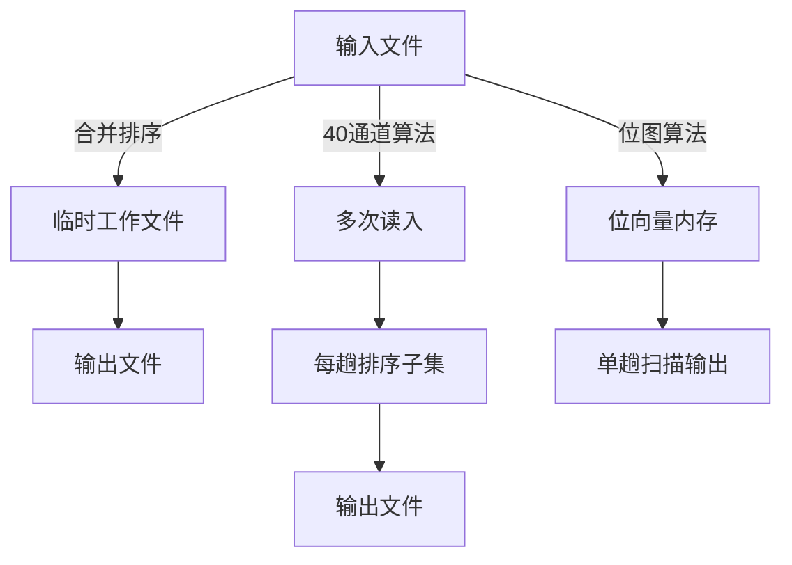
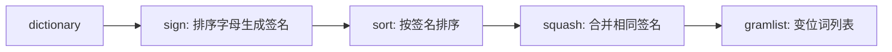

# 《编程珠玑（第二版）》章节总结

## 书籍信息

- 书名：编程珠玑（第二版）（Programming Pearls, Second Edition）
- 作者：[美] Jon Bentley 著；谢君英 石朝江 译
- PDF 状态：包含完整书籍内容（扫描版，部分页有 OCR 识别痕迹）
- OCR 状态：可识别大部分正文，少数图表和格式需基于文本重建

## 目录说明

- 目录识别情况：完整识别，包含第1部分（预备知识，第1-5章）、第2部分（性能，第6-10章）、第3部分（产品，第11-15章），以及尾声、附录等。
- 章节对应依据：按原书页码顺序提取。
- OCR 修复说明：部分流程图由文字描述重建为 Mermaid 格式，部分页的脚注或图表编号存在缺失，已根据上下文补充。

## 全书核心主题

本书通过一系列短小精悍的“珍珠”（程序设计和算法案例），展示了超越常规工程学范畴的程序设计智慧。核心主题包括：精确的问题定义、高效的数据结构选择、算法设计技术（如分治、扫描、二分查找）、代码优化、空间压缩、程序验证与测试、以及性能估算。作者强调，认真思考小问题往往能带来数量级上的改进，简单性、恰当的数据视图和“啊哈！”灵感的运用，是编写正确、高效、优雅程序的关键。

---

## 第1章 开篇

### 1. 核心论点

本章通过一个磁盘文件排序问题的对话，引出“恰当的问题定义占战役90%”的观点。作者认为，深入挖掘用户真实需求（输入范围、重复限制、内存约束）可以导向远比通用排序更巧妙的位图算法，从而极大缩短代码长度和运行时间。

### 2. 关键概念/事件

- **问题定义**：将“如何对磁盘文件排序”细化为“1000万个7位正整数，无重复，仅1MB内存，10秒完成”。  
- **位图数据结构**：用一千万位的字符串表示整数集合，第i位为1表示整数i存在。  
- **多通道算法**：40通道方案，每趟读入250000个整数排序，用时间换空间。  
- **时间与空间权衡**：位图同时减少了时间和空间（数据压缩+主存操作免去磁盘I/O）。  
- **简单设计**：最终代码仅几十行，运行约10秒，远优于合并排序的数百行代码和数分钟。

### 3. 逻辑推演

作者最初给出通用合并排序方案（200行代码，一周实现），但通过对话逐步发现输入的特殊性（范围小、无重复、无关联数据），于是提出多通道排序（40趟，读文件40次）。最后利用位图表示法，将数据完全放在内存中，实现单趟排序，运行时间接近纯I/O时间。论证过程表明：仔细分析约束可以导致数量级的优化。

### 4. 流程图（多通道 vs. 位图）



### 5. 经典金句/数据

> “恰当的问题。问题的定义要占这场战役的90%左右。”  
> “设计师的至高境界不是他不能再往作品中添加什么东西，而是他不能再从中取走什么。”  
> 输入：n=10⁷，1MB内存，排序时间适宜10秒。  
> 位图方案：10秒 vs. 合并排序数分钟。

---

## 第2章 啊哈！算法

### 1. 核心论点

通过三个问题（查找缺失的整数、向量旋转、变位词查找），展示算法洞察如何产生简单高效的代码。核心思想：将问题转化为更基本的原语操作（二分查找、签名、反转），往往能出人意料地简化问题。

### 2. 关键概念/事件

- **二分查找**：在40亿个32位整数中查找缺失整数；使用二分法比较上下半区元素个数。  
- **向量旋转**：将ab转为ba。三种方法：杂耍算法（模运算移动）、块交换递归、反转法（reverse(a), reverse(b), reverse(ab)）。  
- **签名**：变位词问题中，将单词字母排序后作为签名，排序后收集相同签名。  
- **管道实现**：sign | sort | squash 三阶段处理词典，18秒处理23万单词。  
- **手摇法**：Doug McIlroy 用双手演示转置旋转。

### 3. 逻辑推演

对于缺失整数问题：因2³² > 40亿，必有缺失。若内存足够用位图，否则用二分查找：统计文件上半区整数个数，若小于总数一半则缺失在上半区，递归处理。向量旋转问题：从直接复制（空间大）到递归块交换，再到反转法（三行代码）。变位词问题：暴力排列组合不可行，改用签名后排序，将问题转化为两个子问题。

### 4. 流程图（变位词管道）



### 5. 经典金句/数据

> “看起来困难的问题解决起来可能很简单，并且很可能出人意料之外。”  
> 22! ≈ 1.124×10²¹，假设1皮秒/置换，需几十年。  
> 230000单词两两比较需14.7小时。  
> 反转旋转代码：reverse(0,i-1); reverse(i,n-1); reverse(0,n-1)。

---

## 第3章 数据结构程序

### 1. 核心论点

合适的数据视图可以构造程序，将大程序缩减为小程序。通过用数组代替重复变量、用解释器代替硬编码输出、用通用结构代替特例，能极大简化代码、提高可维护性。

### 2. 关键概念/事件

- **调查程序**：350个变量的问卷统计，用三维数组重写后仅150行代码。  
- **表单字母生成器**：用模式（schema）和解释器代替硬编码print语句。  
- **菜单数组**：Visual Basic 中将8个相似菜单项改用一个数组循环。  
- **日期函数**：用26个整数的月累计表，5行代码代替55行。  
- **后缀剥离**：McIlroy 用表驱动代替代码规则，减少代码量。  
- **电子表格与数据库**：用高级工具代替手工编程。

### 3. 逻辑推演

作者列举多个案例：一个原本需要上千行的计数程序，用500元素数组缩减为十几行；调查程序用多维数组和offset表减少代码量；表单字母生成器将数据与控制分离，模式可独立编辑。核心思路：将重复性代码改写到数组，封装复杂结构，尽可能使用高级工具，让数据构造程序。

### 4. 经典金句/数据

> “程序员在对空间缺乏无能为力时，往往会脱离代码的纠缠，回过头去凝神考虑他的数据，这样会找到更好的方法。表示法是编程的精华。”  
> 调查程序：350个变量 → 三维数组，代码量减少一个数量级。  
> 菜单代码：100行 → 4行。

---

## 第4章 编写正确的程序

### 1. 核心论点

二分查找是验证技术的绝佳例子。通过精确的循环不变式（mustbe(l,u)）和前置/后置条件，可以系统化地开发出正确代码。程序验证不是黑盒测试，而是帮助程序员理解程序的工具。

### 2. 关键概念/事件

- **循环不变式**：mustbe(l,u) 表示如果t在数组中，必在x[l..u]中。  
- **二分查找正确实现**：初始化l=0,u=n-1；循环内计算m，分三种情况调整l或u。  
- **验证三要素**：初始化保持不变式；迭代保持不变式；终止时结果正确。  
- **前置条件/后置条件**：契约编程的基础。  
- **历史事实**：第一个二分查找1946年公布，第一个无bug版本1962年才出现。

### 3. 逻辑推演

先给出二分查找的算法草图，然后逐步细化：表示范围用l和u，初始化为0和n-1；判断空范围返回-1；计算中点；根据x[m]与t的关系缩小范围。之后用断言注释形式化证明每一步正确性。最后归纳出程序验证的一般原则：断言、顺序/选择/迭代结构的正确性证明方法。

### 4. 流程图（二分查找循环）

```mermaid
graph TD
    A[初始化 l=0, u=n-1] --> B{l <= u?}
    B -- 否 --> C[返回 -1]
    B -- 是 --> D[m = (l+u)/2]
    D --> E{x[m] 与 t 比较}
    E -- x[m] < t --> F[l = m+1]
    E -- x[m] == t --> G[返回 m]
    E -- x[m] > t --> H[u = m-1]
    F --> B
    H --> B
```

### 5. 经典金句/数据

> “只有大约10%的专业程序员能够正确编写二分查找。”  
> “尽管第一个二分查找程序于1946年公布，但第一个没有bug的二分查找程序在1962年才出现。”  
> 循环不变式：{mustbe(l,u)}。

---

## 第5章 编程中的次要问题

### 1. 核心论点

从伪码到真实代码的过程中，脚手架（测试装备）、断言、自动化测试和计时是关键辅助技术。构建独立的测试驱动可以极大地提高调试效率和信心。

### 2. 关键概念/事件

- **从伪码到C**：将第4章的二分查找转换为C函数。  
- **测试装备**：用简单的主循环读取测试用例，手工验证边界条件。  
- **断言**：在代码中加入assert，如assert(sorted())，用来捕获违反假设的错误。  
- **自动化测试**：循环n从0到maxn，测试不同大小数组上的成功/失败查找。  
- **计时脚手架**：测量二分查找的平均时间，验证对数复杂度。  
- **调试故事**：键盘键帽松动导致坐/站不同行为，国际数据“Quito”导致程序停止等。

### 3. 逻辑推演

先实现C版本的二分查找，然后构建测试驱动程序（手工输入测试用例）。发现一个常见错误（无限循环）后，用printf定位。接着引入断言来验证运行时属性，并构建自动化测试（对n从0到1000测试）。最后编写计时脚手架，测量不同n下的查找时间，绘制图表确认对数增长。整章强调：在将小函数集成到大系统前，应先用脚手架充分测试。

### 4. 经典金句/数据

> “程序员都是乐观主义者，他们倾向于采取简单的途径：编写函数代码，然后插入系统，强烈希望它能运行。”  
> “Tony Hoare：程序员测试时使用断言，生产期间关闭，就像水手岸上训练穿救生衣，出海却脱下。”  
> 计时结果：二分查找约 50+30 log₂n 纳秒。

---

## 第6章 性能透视

### 1. 核心论点

性能优化可以在多个设计层次上进行：问题定义、系统结构、算法和数据结构、代码优化、系统软件、硬件。Appel的多体仿真程序通过在不同层次改进，将运行时间从一年减为一天（加速400倍）。

### 2. 关键概念/事件

- **多体仿真**：n=10000，O(n²)算法需一年；改用二叉树O(n log n)加速12倍。  
- **算法优化**：识别近距离粒子对，加大时间步，再加速2倍。  
- **数据结构重组**：每步重组数据，减半运行时间。  
- **代码优化**：双精度→单精度（2倍），关键函数汇编（2.5倍）。  
- **硬件**：添加浮点加速器（2倍）。  
- **设计层次表**：汇总各层加速系数与修改内容。

### 3. 逻辑推演

先介绍Appel的问题：模拟10000个天体的引力相互作用，原始O(n²)算法需一年。然后逐层优化：算法层用树结构降至O(n log n)；优化层处理近距离粒子；重组数据结构适应树；代码层改用单精度和汇编；硬件层升级浮点加速器。最终总加速400倍，但代码量从几十行增至1200行。结论：大加速需跨层努力，各层加速可相乘。

### 4. 经典金句/数据

> “计算机系统最便宜、最快速、最可靠的部件就是那些不在那儿的部件。” —— Gordon Bell  
> 加速汇总：算法和数据结构12倍，算法优化2倍，数据结构重组2倍，代码优化2倍，汇编2.5倍，硬件2倍，总计400倍。

---

## 第7章 封底计算

### 1. 核心论点

通过粗略估算（“封底计算”）可以在设计早期判断方案的可行性，避免构建不可能工作的系统。关键技能包括量纲分析、72法则、双重检查和安全系数。

### 2. 关键概念/事件

- **密西西比河流量估算**：宽度×深度×流速 ≈ 0.5立方英里/天，与年鉴数据一致。  
- **量纲检测**：确保加法和乘积的量纲一致。  
- **72法则**：r×y=72时，本金翻倍（r为年利率%，y为年数）。  
- **π秒 = 一纳世纪**：3.1557×10⁷秒/年，π×10⁻⁹世纪 ≈ 3.14秒。  
- **利特尔法则**：平均队长 = 到达率 × 平均停留时间。  
- **安全系数**：Roebling将布鲁克林大桥强度设计为常规6倍，补偿未知因素。

### 3. 逻辑推演

先通过密西西比河流量估算说明快速计算的基本技巧（双重验证、量纲分析）。然后介绍72法则用于指数增长估计。接着讨论性能估计实例（内存中节点大小、平方根耗时、网络速度）。最后强调安全系数的重要性，引用Roebling建桥故事。附录包含估算测验题。

### 4. 经典金句/数据

> “任何事都应该做到尽可能的简单，除非没有更简单的了。” —— 爱因斯坦  
> “π秒是一纳世纪。” —— Tom Duff  
> 利特尔法则：系统平均负载 = 吞吐量 × (响应时间+思考时间)。  
> 安全系数：性能估计保留2/4/6倍，可靠性保留10倍。

---

## 第8章 算法设计技术

### 1. 核心论点

通过最大子向量问题，展示不同算法设计技术的效果：立方O(n³)、二次O(n²)、分治O(n log n)、线性O(n)。合适的算法可以带来几个数量级的性能提升。

### 2. 关键概念/事件

- **问题**：求实数向量中连续子向量的最大和（空向量和为0）。  
- **算法1（立方）**：三重循环，直接计算所有子区间和。  
- **算法2（二次）**：利用累积和或递推关系避免内层求和。  
- **算法3（分治）**：递归计算左半、右半、跨越中间的最大和，合并。  
- **算法4（扫描）**：线性扫描，维护“以当前位置结尾的最大子向量和”和“全局最大”。  
- **历史**：Grenander → Shamos → Kadane 在几分钟内给出线性算法。  
- **运行时间表**：n=10⁵时，算法1需15天，算法4仅5毫秒。

### 3. 逻辑推演

从最简单的立方算法开始，分析其渐近复杂度。然后提出两个二次算法：一个利用前缀和数组，一个利用递推关系。接着设计分治算法，递归分割并处理跨边界子向量，复杂度O(n log n)。最后给出Kadane的扫描算法，仅需O(n)时间和常数空间。通过运行时间表（不同n下的耗时）和跨平台对比，凸显算法选择的巨大影响。

### 4. 流程图（扫描算法）

```mermaid
graph TD
    A[初始化 maxsofar=0, maxendinghere=0] --> B[遍历 i=0..n-1]
    B --> C[maxendinghere = max(maxendinghere+x[i], 0)]
    C --> D[maxsofar = max(maxsofar, maxendinghere)]
    D --> B
    B --> E[返回 maxsofar]
```

### 5. 经典金句/数据

> “保存状态，避免重新计算。”  
> 算法运行时间：1.3n³ ns, 10n² ns, 47n log₂n ns, 48n ns。  
> n=10⁷时，算法4仅需0.48秒，算法1需41千年。

---

## 第9章 代码优化

### 1. 核心论点

代码优化是在确认热点之后进行的微观改进，常用技术包括缓存、用代数恒等式替换昂贵操作、合并测试、循环展开等。但优化前必须先度量，且不成熟的优化是万恶之源。

### 2. 关键概念/事件

- **Van Wyk的图形程序**：70%时间花在malloc上；通过缓存最常用类型的结点，运行时间减半。  
- **整数求余**：用if条件替换%运算符，在顺序访问时加速2倍，但在跳跃访问时效果不明显。  
- **函数/宏/内联**：max宏在算法4中加速2倍，但在递归中导致指数爆炸（宏展开导致重复计算）。  
- **顺序查找优化**：使用哨兵合并测试（5%加速），循环展开8次（56%加速）。  
- **球面距离**：用笛卡尔坐标（x,y,z）替换经纬度，避免三角函数，从数小时降到半分钟。  
- **二分查找展开**：固定n=1000，将循环完全展开为一系列if语句，加速36%。

### 3. 逻辑推演

先通过Van Wyk故事说明度量热点的重要性（malloc占70%），然后通过缓存常用结点加速。接着用几个小问题展示代码优化技巧：求余优化、宏的利弊、哨兵与循环展开、数据表示改变（球面距离）。最后对二分查找进行极端优化：改变不变式（用<和≤）、用下标+增量表示范围、固定大小为2的幂、完全展开循环。所有优化都需在不同输入模式下验证，因为内存访问模式会影响效果。

### 4. 经典金句/数据

> “不成熟的优化是大量编程灾害的根源。” —— Don Knuth  
> “咬人的人也应该提防被咬。” —— Jurg Nievergelt  
> 顺序查找优化：从4.06n ns → 1.70n ns。  
> 二分查找展开：n=1000时，从350ns → 125ns（顺序访问），随机访问从418ns → 266ns。

---

## 第10章 压缩空间

### 1. 核心论点

空间优化同样重要，可通过简单性、重新计算、稀疏表示、数据压缩、分配策略、解释器等方式减少内存占用。有时空间压缩反而能加快速度（更好的缓存利用）。

### 2. 关键概念/事件

- **简单性**：Brooks通过理解肯塔基州税是联邦税的简单函数，避免了存储大表。  
- **稀疏矩阵**：2000个点分布在200×200网格，用列索引+行值+点编号的稀疏表示从80KB降到8.4KB。  
- **不要保存，重新计算**：按需生成数据，如素数函数代替素数表。  
- **数据压缩**：将两个十进制数字编码为一个字节（c=10*a+b）。  
- **垃圾回收与重叠**：Kernighan将两个三角矩阵重叠在一个方阵中。  
- **解释器**：用4字节命令替代多行图形代码。  
- **Thompson的国际象棋数据库**：利用对称性将棋盘压缩8倍。

### 3. 逻辑推演

先强调简单性：Brooks通过重新理解问题消除了大表。然后以稀疏矩阵问题为例，逐步从完整矩阵（80KB）改进为列压缩（8.4KB），再进一步用字节存储行号（6.4KB），甚至删掉行数组（4.4KB）。接着归纳数据空间技术（重新计算、稀疏结构、数据压缩、分配策略）和代码空间技术（函数定义、解释器、转换成机器语言）。最后通过Thompson的国际象棋残局数据库案例，展示利用对称性将空间减少8倍。

### 4. 经典金句/数据

> “程序员的至高境界不是他不能再往作品中添加什么东西，而是他不能再从中取走什么。”  
> 稀疏矩阵：从80KB降到8.4KB。  
> Thompson的象棋数据库：从10.7亿条记录压缩到1.21亿条。  
> Macintosh ROM：64KB，汇编编码仅为高级语言编译结果的一半大小。

---

## 第11章 排序

### 1. 核心论点

排序算法有多种选择：插入排序（小规模或基本有序时快）、快速排序（平均情况最快）、堆排序（最坏情况保证O(n log n)且原地）。此外，应优先使用库函数（C的qsort、C++的sort），除非有特殊需求。

### 2. 关键概念/事件

- **插入排序**：三层实现（swap版、内联swap版、移动版），运行时间约3.2n² ns。  
- **快速排序**：Lomuto划分（简单但慢）、Hoare两路划分（快）、随机划分元素、小数组改用插入排序。  
- **优化**：随机化支点避免最坏情况，截止值（cutoff）选择，循环展开内部swap。  
- **运行时间表**：插入排序（n=10⁶约1小时），快速排序（约0.6-2.7秒）。  
- **库函数对比**：C的qsort用函数指针慢于手写；C++的sort模板内联比较，最快。

### 3. 逻辑推演

从插入排序开始，逐步优化（将swap移出循环）。然后引入快速排序，先给出简单的Lomuto划分，再改进为Hoare两路划分，并加入随机化和小数组截止值优化。通过运行时间表比较各个版本，最后给出使用库函数的建议。堆排序在后续章节介绍。

### 4. 流程图（快速排序划分）

```mermaid
graph TD
    A[选择支点 t = x[l]] --> B[i = l, j = u+1]
    B --> C[do i++ while x[i] < t]
    C --> D[do j-- while x[j] > t]
    D --> E{i > j?}
    E -- 否 --> F[swap(i, j)] --> C
    E -- 是 --> G[swap(l, j)]
    G --> H[递归排序左部分和右部分]
```

### 5. 经典金句/数据

> “尽可能盗用别人的代码。” —— Tom Duff  
> 插入排序3：3.2n² ns；快速排序4：36n log₂n ns。  
> n=10⁶时，C++ sort需0.6秒，C库qsort需2.7秒。

---

## 第12章 抽样问题

### 1. 核心论点

从实际问题（从区域列表中随机采样）抽象为“随机生成m个不重复的有序整数”问题。Knuth算法（顺序扫描，以概率s/r选择）是最优解之一，但设计空间包括基于集合的插入、数组混洗等，各有适用场景。

### 2. 关键概念/事件

- **问题规约**：输入m,n，输出0..n-1中m个随机整数，有序且无重复。  
- **Knuth算法**：for i=0..n-1，以概率select/remaining选择i。  
- **基于集合的算法**：while size<m，生成随机数，插入集合（C++ STL set）。  
- **混洗算法**：初始化数组0..n-1，随机交换前m个，再排序。  
- **Floyd算法**（答案中提及）：当m接近n时更高效。  
- **设计空间评估**：不同算法在m,n不同大小下的性能权衡。

### 3. 逻辑推演

从实际需求（自动抽取区域样本）出发，将问题转化为生成随机有序整数子集。给出Knuth的遍历算法（13行Basic），分析其时间O(n)。然后探索其他设计：基于集合的插入（O(m log m)），混洗前m个（O(n+m log m)）。通过不同m,n组合下运行时间比较，指出Knuth算法在n很大时可能太慢，而基于集合的方法在m远小于n时更好。最终鼓励读者回顾设计空间，选择最合适的方案。

### 4. 经典金句/数据

> “设计者不是他不能再往作品中添加什么东西，而是他不能再从中取走什么。”  
> Knuth算法生成2³²个随机整数需12分钟。  
> C++ STL set生成并输出10⁶个随机整数约20秒。

---

## 第13章 查找

### 1. 核心论点

通过整数集合的表示问题，比较数组、链表、二分查找树、位向量、桶（散列）的性能和空间特征。库（STL set）方便但未必最优化；专用结构可充分利用问题特性（整数范围小、随机插入等）。

### 2. 关键概念/事件

- **接口**：IntSet类，含insert、size、report。  
- **有序数组**：插入O(n)，report O(n)，空间n字。  
- **有序链表**：插入O(n)但指针开销大，递归/迭代实现。  
- **二分查找树**：随机插入下平均O(log n)，但空间大（左右指针）。  
- **位向量**：当maxval较小时，O(1)插入和报告，但初始化O(maxval)。  
- **桶**：链表数组，桶数≈m，每个桶预期长度O(1)。  
- **优化**：结点批量分配、消除递归、使用哨兵。  
- **McIlroy的拼写检查**：用27位散列+压缩，64KB存放75000单词。

### 3. 逻辑推演

定义整数集合接口后，依次实现数组、链表、BST、位向量、桶。每个实现给出伪码和运行时间表（m从1万到1000万）。分析显示：数组和链表O(m²)太慢；BST和桶O(m log m)；位向量最快但受限于maxval。通过优化（批量分配结点、迭代代替递归）可以大幅提升性能。最后介绍McIlroy的spell程序，用词缀分析、27位散列和可变长编码将字典压缩到64KB。

### 4. 运行时间表（摘录）

| 结构 | m=1000000 (秒) | m=5000000 (秒) | 内存(MB) |
|------|---------------|---------------|----------|
| STL set | 9.38 | - | 72 |
| BST | 7.30 | - | 56 |
| BST* | 3.71 | 125.2 | 68 |
| 桶 | 2.36 | - | 60 |
| 桶* | 1.02 | 16.5 | 58 |
| 位向量 | 3.72 | 16.5 | 70 |

（*表示结点批量分配等优化）

### 5. 经典金句/数据

> “我地下室有150个酒容器，每年喝掉25个，每个容器保存6年。——利特尔法则”  
> spell程序：75000单词压缩到52KB，误判率1/4000。

---

## 第14章 堆

### 1. 核心论点

堆是一种平衡二叉树（形状属性+顺序属性），可以用数组隐式表示。它支持两种关键操作：siftup（上滤）和siftdown（下滤），每个O(log n)。堆可用于实现优先队列（insert/extractmin）和堆排序（原地排序，最坏情况O(n log n)）。

### 2. 关键概念/事件

- **堆属性**：x[i/2] ≤ x[i]（最小堆）。形状属性：完全二叉树，用数组存放。  
- **siftup**：将新元素从底部向上交换直到满足堆属性。  
- **siftdown**：将根元素向下与较小子节点交换直到满足堆属性。  
- **优先队列**：insert → siftup；extractmin → 交换首位，siftdown。  
- **堆排序**：先建堆（从i=n/2到1执行siftdown O(n)），然后重复交换根与末尾并下滤。  
- **C++模板实现**：priqueue类，密集代码。

### 3. 逻辑推演

首先定义堆的数组表示和两个核心函数（siftup, siftdown），用循环不变式证明其正确性。接着实现优先队列：insert放在末尾然后siftup，extractmin取根后用末尾元素代替根再siftdown。最后实现堆排序：先用siftup建堆（简单但O(n log n)）或用更高效的siftdown建堆（O(n)），然后交换并下滤。堆排序保证最坏情况O(n log n)，但常数较大，通常比优化后的快速排序慢。

### 4. 流程图（堆排序）

```mermaid
graph TD
    A[输入数组 x[1..n]] --> B[建堆: for i=n/2 downto 1: siftdown(i)]
    B --> C[for i=n down to 2]
    C --> D[swap(1, i)]
    D --> E[siftdown(i-1)]
    E --> C
    C --> F[输出有序数组]
```

### 5. 经典金句/数据

> “好的工程师能够区分出某个组件完成什么功能以及它是如何完成这个功能的。”  
> 堆排序：最坏情况 O(n log n)，原地排序。  
> 优先队列：每个操作 O(log n)。

---

## 第15章 珍珠字符串

### 1. 核心论点

字符串处理常见问题包括单词列表生成、词频统计、最长重复子串、随机文本生成。解决方案涉及散列、平衡树、后缀数组、马尔科夫链。库组件（STL map/set）方便但定制散列往往更快；后缀数组是处理子串问题的强大工具。

### 2. 关键概念/事件

- **单词列表**：用STL set<string>去重排序。  
- **词频统计**：STL map<string,int> 或定制散列表（更快）。  
- **最长重复子串**：构造后缀数组（指向每个后缀的指针数组），排序后扫描相邻项找最长公共前缀。  
- **后缀数组**：qsort排序指针，comlen比较。  
- **马尔科夫链文本生成**：单词级order-k模型，用后缀数组或散列查找k个单词的后续列表。  
- **性能对比**：定制散列表比STL map快一个数量级。

### 3. 逻辑推演

首先用STL set和map实现单词列表和词频统计，然后定制散列表（链地址法）获得更高速度。接着介绍后缀数组，通过排序所有后缀来查找最长重复子串（O(n log n)），并在《伊利亚特》中定位一段重复文本。最后生成随机文本：order-0（随机字符）、order-1（基于前一个字符的转移概率）直至单词级马尔科夫链。用后缀数组存储k个单词的词组，二分查找随机选择后续词。

### 4. 流程图（后缀数组查找最长重复子串）

```mermaid
graph TD
    A[输入字符串 c[0..n-1]] --> B[创建后缀指针数组 a[i]=&c[i]]
    B --> C[排序 a（按字典序）]
    C --> D[扫描排序后的数组]
    D --> E[计算相邻后缀的最长公共前缀长度]
    E --> F[记录最大长度和位置]
    F --> G[输出最长重复子串]
```

### 5. 经典金句/数据

> “Shannon: 构建更高阶的近似很费劳动力。”  
> 后缀数组：处理807503字符的《伊利亚特》需4.8秒。  
> 定制散列：处理《圣经》从7.6秒降至3.0秒。

---

## 第一版本的尾声

### 核心论点

通过采访形式总结全书理念：认真考虑编程问题既实用又有趣；设计过程应包含10条建议（处理正确问题、展示设计空间、查看数据、使用封底、利用对称性、使用组件、建立原型、权衡、尽量简单、让程序优美）。简单性即使在大系统中也很有用。

### 经典金句

> “最重要就是认真考虑编程问题既实用又有趣。”  
> “Unix系统的强大来自于简单而优美的各个组成部分。”

---

## 第二版的尾声

### 核心论点

第二版更新了过时的例子，增加了真实代码（C/C++）、缓存与指令级并行讨论、新的三章（代码和脚手架、数据结构细节、高级算法）。强调应尽可能使用库（“尽可能盗用别人的代码”），但提供的伪码和脚手架可帮助评估和定制算法。

### 经典金句

> “尽可能盗用别人的代码。” —— Tom Duff  
> “Bentley每天的工作环境是一个编程涅槃。”

---

## 附录1 算法分类

### 核心内容

将本书涉及的算法按领域分类：排序（插入、快速、堆、位图等），查找（顺序、二分、散列、BST等），其他集合算法（优先队列、选择），字符串算法（变位词、后缀数组），向量/矩阵算法，随机对象，数值算法。每种算法标注书中出现位置。

---

## 附录2 估算测试

### 核心内容

给出10个常识性估算问题（美国人口、拿破仑出生年、密西西比河长度、波音747载重、地月声音传播时间、伦敦纬度、航天飞机周期、金门桥跨度、独立宣言签名数、成人骨头数），用于测试封底计算能力。附答案和评分解释。

---

## 附录3 时间和空间成本模型

### 核心内容

提供两个C/C++程序：spacemod.cpp测量各种结构的内存占用（sizeof及new分配开销），timemod.c测量基本操作（算术、数组访问、比较、数学函数、内存分配）的纳秒级耗时。给出典型输出示例（如%运算约97ns，sqrt约188ns，malloc(16)约2.5µs）。

---

## 附录4 代码优化规则

### 核心内容

归纳27条代码优化规则，分为五类：用空间换取时间（扩展数据结构、存储预计算结果、缓存、懒惰计算）；用时间换取空间（压缩、解释器）；循环规则（移出代码、合并测试、循环展开、消除分支）；逻辑规则（代数恒等式、重排序测试、预计算逻辑函数）；过程规则（压缩函数层次、利用常用情况、尾递归消除）；表示规则（编译时初始化、代数恒等式、移位替代乘除、消除公共子表达式）。每条给出本书中的应用实例。

---

## 附录5 C++中的查找类

### 核心内容

给出第13章中整数集合类的完整C++实现代码：IntSetSTL（基于STL set）、IntSetArray（有序数组）、IntSetList（有序链表）、IntSetBST（二叉搜索树）、IntSetBitVec（位向量）、IntSetBins（桶散列）。代码可直接从网站下载。

---

## 部分问题的答案提示 & 部分问题的答案

（由于原书该部分内容为解题提示和详细答案，篇幅很长且为习题解答，此处不做全文转录，仅说明存在。内容涵盖各章习题的关键思路和代码。）

---