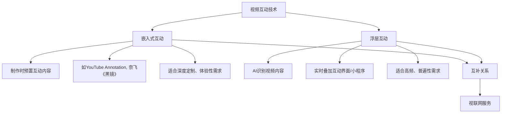
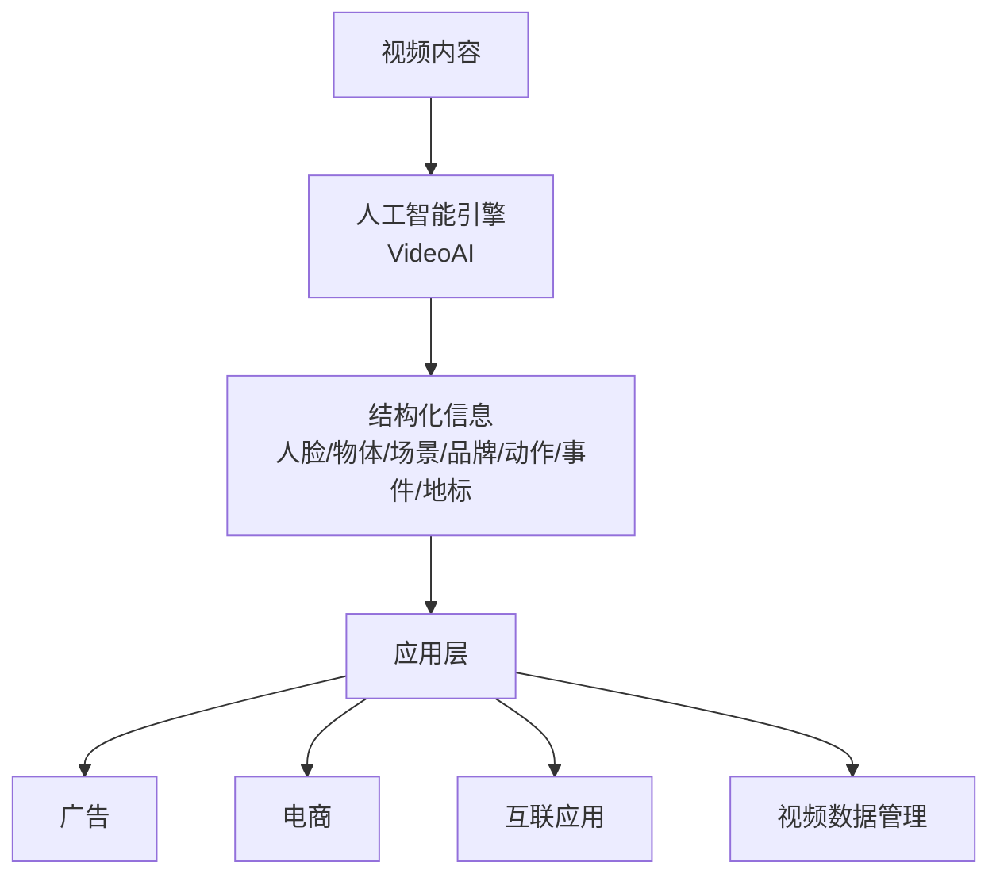
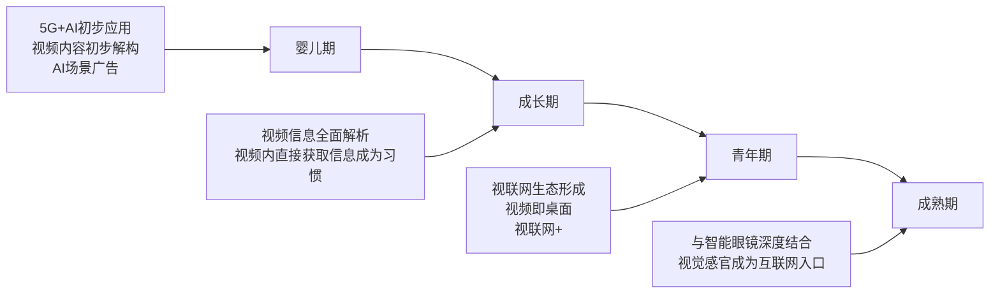
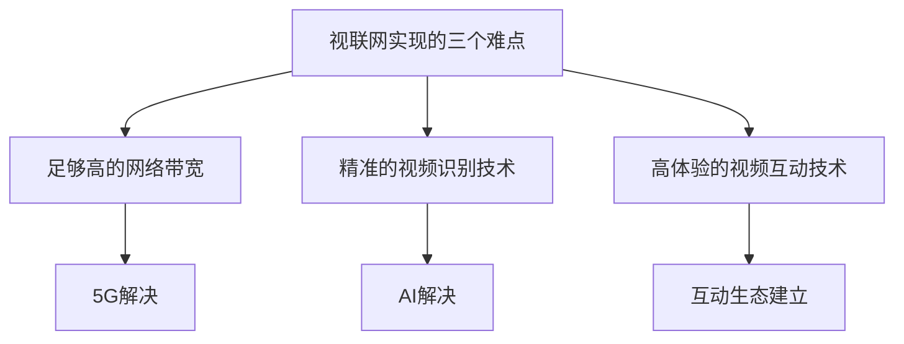
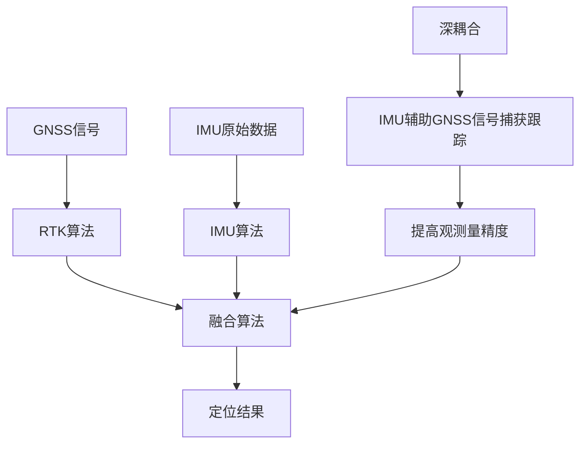
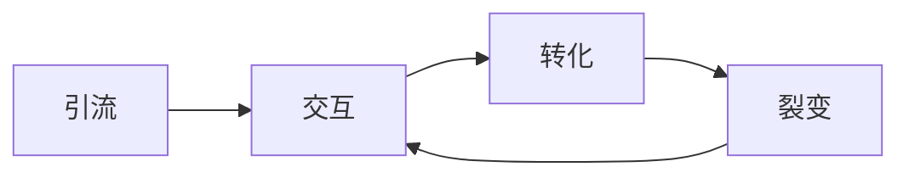

# 《视联网年度洞察报告2019》章节总结

## 书籍信息
- **书名**：视联网年度洞察报告2019
- **作者**：极链科技未来研究院
- **时间**：2019年11月25日
- **PDF状态**：46页，部分文字层可识别，部分页面为图片
- **OCR状态**：存在部分页面无法提取文字层，已基于可见文本整理

## 目录说明
- **目录识别情况**：原PDF未提供明确目录页，正文结构包含前言、正文论述、总结、出品方介绍等部分。以下按逻辑顺序整理为章。
- **章节对应依据**：根据页面标题和内容主题划分。
- **OCR修复说明**：部分页面（如第7页、第13页等）为全图片或图形，无法提取文字；部分文字层有错乱（如“增 壁”等乱码），已忽略无效字符。

## 全书核心主题
本报告提出“视联网”概念，认为在5G+AI技术驱动下，视频将成为下一代互联网的主要信息传递介质和功能载体。报告从视频的技术特性（高带宽）、用户需求（即时交互）、技术趋势（AI识别、互动技术）出发，论证视联网的必然性，并规划其发展路径（婴儿期→成长期→青年期→成熟期），分析商业机遇与产业生态构建。

---

## 前言

### 核心论点
问题：在5G+AI时代，互联网形态将如何演变？  
观点：仅关注AIoT硬件层面迭代不足，应从媒介变革和需求形式迭代出发，认识到视频将成为连接人与智能设备、人与互联网的核心媒介，形成以视频为主要信息传递介质和功能载体的“视联网”。

### 关键概念
- **AIoT（智联网）**：谷歌、亚马逊、华为等布局的下一代硬件/物理层面迭代。
- **视联网**：以5G+AI为支撑，视频作为主要信息传递介质和功能载体的互联网形态。
- **需求形式迭代**：新硬件环境下，人们需要新的渠道和形式满足新需求。

### 逻辑推演
作者指出，主流科技巨头聚焦AIoT，但忽略了软件或精神层面的迭代。移动智能时代成功的不仅是华为、高通等硬件厂商，还有微信、抖音等新内容输出。因此，从媒介变革出发，视频凭借其高带宽和交互能力，将成为下一代互联网的核心载体，由此定义“视联网”。

### 经典金句
> “在5G+AI的支持下，视频将成为连接人与下一代智能设备、人与互联网的重要媒介，进而引发人的需求形式迭代，形成以视频作为主要信息传递介质和功能载体的互联网形态，可以称之为‘视联网’。”

---

## 第一章：视频作为信息传递介质的优势

### 核心论点
问题：为什么视频适合作为下一代互联网的主要信息传递介质？  
观点：视频具有最大信息带宽，能传递更多交互信息（包括情感等默会信息），且可同时加载音频和文字。视频已占据互联网数据总量的80%，预计2022年达82%。

### 关键概念
- **信息带宽**：单位时间内传递信息的容量。视频优于文字、图片、语言。
- **默会信息**：难以用语言和图文表达的信息，如人的情感、表情、动作。
- **情感共鸣**：视频能引起观众沉浸感和代入感，促进人与人之间的情感交流。

### 逻辑推演
从技术角度对比：视频每秒24帧以上，可记录大量信息。从应用角度：影视剧、企业形象传播已广泛利用视频的情感传递能力。数据佐证：视频内容占比持续增长，APP纷纷加载视频功能。

### 经典金句/数据
> “视频的高带宽使其不仅能传递语言和图文能够表达的明示信息，更能传递其他形式较难表达的默会信息，例如人的情感。”

数据：
- 2017年视频占互联网数据总量：73%
- 2022年预计：82%  
（资料来源：思科可视化网络指数2017-2022）

---

## 第二章：视频作为互联网功能载体的价值

### 核心论点
问题：让视频承载互联网功能有何必要性？  
观点：观众在观看视频时会产生购物、社交、搜索等即时需求，当前需退出视频切换APP，打断情绪体验。视频直接承载功能可提供极大便利，尤其在智能眼镜时代，零转换、低延时的视频内服务成为必需。

### 关键概念
- **零转换**：用户无需切换应用或界面，在视频内即可完成操作。
- **低延时**：服务响应迅速，不破坏观看体验。

### 逻辑推演
举例说明：看球赛想买球星同款球鞋、看剧想吐槽、刷抖音想了解旅游地标——当前只能退出视频打开其他APP，过程中信息可能无法准确传递，且打断情绪积累。未来可穿戴设备（智能眼镜）下，视频内服务更是必备。

### 经典金句
> “如果视频能够直接承载互联网功能，满足人们视频内购物、社交、搜索等种种需求，想必会给人带来极大的便利。” (p.12)

---

## 第三章：视频互动技术的两条路线

### 核心论点
问题：视频互动技术有哪些发展路径？视联网应选择哪种？  
观点：嵌入式互动与浮层互动互补。浮层互动因AI打破视频黑箱后更具适用性和商业推广优势，成为主流。

### 关键概念
- **嵌入式互动**：将互动内容嵌入视频格式（如YouTube Annotation、Netflix《黑镜：潘达斯奈基》），在制作时预置。
- **浮层互动**：在视频上层叠加互动界面，通过AI识别实时调用小程序。
- **视频黑箱**：过去视频内容无法结构化解析，AI识别技术使其可分解为可检索信息。

### 逻辑推演
早期嵌入式互动（如《黑镜》上百种剧情选择）可实现深度定制，但制作成本高、难以规模化。AI识别技术成熟后，浮层互动（如视频AI广告、场景电商）能实时捕捉用户需求、调用服务，更易复制推广。两者互补：高频普遍需求用浮层，深度定制用嵌入式。

### 流程图

### 经典金句/数据
> “浮层互动形式具备与视频内容深度互动的条件，展现出了更强的适用性，成为了各类视联网应用服务的主要表现形式。” (p.23)

---

## 第四章：视联网基础设施——人工智能引擎

### 核心论点
问题：视联网的技术核心是什么？当前发展到什么程度？  
观点：人工智能引擎是视联网的核心，将视频内容转化为结构化信息，支撑上层应用。目前已能识别人脸、物体、场景、品牌、动作、表情、事件、地标等多维度信息，成本大幅下降。

### 关键概念
- **VideoAI**：极链科技自研的视频AI识别系统。
- **VideoOS**：视联网操作系统。
- **多模态识别**：综合视觉、语音、文本、体态等识别技术，提升高维度信息判断能力。

### 逻辑推演
AI算法、算力、数据快速进步，视频识别精度和类别多样性已达商业化标准。未来需升级的方向：多模态联合应用、视频场景商业价值综合算法、专项数据集开发。

### 流程图

---

## 第五章：视联网操作系统

### 核心论点
问题：视联网操作系统应具备哪些特点？  
观点：需要跨媒介、高性能、热更新、优体验、富创新。

### 关键概念
- **跨媒介**：在不同视频媒介中运行。
- **热更新**：不关闭服务实时更新。
- **富创新**：兼容各类创新应用和技术。

### 逻辑推演
操作系统需管理底层AI能力、视频媒介资源、小程序软件资源和云资源。市场上已有初级系统，但距离成熟还有距离。

---

## 第六章：视联网产业生态配套服务

### 核心论点
问题：视联网产业需要哪些配套服务？  
观点：需要开发者生态、全域营销平台、信用结算数据支持、多样化输入输出技术、隐私保护与伦理审核。

### 关键概念
- **全域营销平台**：整合视频AI广告、小程序广告、商品成交平台。
- **信用评级**：对开发者做信用评级。
- **隐私保护模块**：应对AI和大数据引发的伦理问题。

---

## 第七章：视联网发展路径

### 核心论点
问题：视联网将如何发展？分几个阶段？  
观点：分为婴儿期（当前，初步应用）、青年期（生态形成，“视联网+”）、成长期（规模千亿）、成熟期（15-20年后，视觉成为互联网入口）。

### 关键概念
- **“实时-调用”模式**：服务与视频内容完美结合，任意需求可实时调用对应服务。
- **“预期-推送”模式**：补充模式，用于新服务推荐或新用户引导。

### 逻辑推演
从技术成熟度、用户习惯、产业生态三个维度推演。婴儿期AI解构有限数据，初步应用如AI场景广告；成长期全内容解析，互动生态建立；青年期“视联网+”赋能各行业；成熟期与智能穿戴结合。

### 流程图

---

## 第八章：视联网带来的商业机遇

### 核心论点
问题：谁将从视联网中获益？  
观点：流量主（视频平台）获得观看体验升级和营收渠道拓展；创业者获得全新赛道，可打造“视频中的淘宝、饿了么”；其他合作者开拓新市场。

### 关键概念
- **流量主**：综合或垂直视频平台、拥有视频资源的APP。
- **视频内服务营收分成**：小程序广告、收费服务、交易返佣。

### 逻辑推演
传统视频平台广告和会员收入见顶，视联网新增营收路径。创业者避开与巨头直接竞争，在既有视频流量上提供深入服务。预计3年内百亿级，5-10年千亿级，10-20年万亿级。

### 经典金句/数据
> “预计3年内，婴儿期的视联网产业总体市场规模就可达到百亿级。未来5-10年间，视联网将进入成长期……市场规模将迅速扩大至千亿级。……青年期的视联网的相关产业规模有望在10-20年内达到万亿级。” (p.44)

---

## 总结

### 核心论点
问题：为什么视联网是真正的发展趋势而非泡沫？  
观点：第一，视频中的服务需求真实存在；第二，AI等技术进步使服务成本大幅下降；第三，视频普及和5G推动需求增加。

### 逻辑推演
从需求真实性、技术可行性、市场驱动力三个角度论证。呼吁各方共建视联网生态。

---

## 出品方介绍

**极链科技**：2014年由金明在上海创办，前身2012年创立于波士顿。专注于消费级视频AI技术研发和商业应用，拥有VideoAI、VideoOS底层操作系统。投资方包括阿里巴巴、云锋基金、旷视科技等，融资近10亿元。

**联系方式**：
- 商务合作：business@videopls.com
- 产品合作：product@videopls.com
- 媒体合作：media@videopls.com

---

# 《视联网展望报告》章节总结

## 书籍信息
- **书名**：视联网展望报告
- **作者**：极链科技
- **时间**：2019年8月
- **PDF状态**：20页，部分文字层可识别
- **OCR状态**：第13页为全图片无法提取文字，已标注

## 目录说明
- **目录识别情况**：第6页有明确目录，包含：第一章“视联网”是互联网的发展趋势（视频作为信息传递介质/功能载体、发展难点）；第二章5G+AI正在助力视联网实现（5G与AI突破、四个发展阶段）；第三章视联网的影响猜想（视频作为信息介质/功能载体带来的影响）。
- **章节对应依据**：按目录顺序整理。

## 全书核心主题
本报告简明版论述视联网为什么是下一代互联网方向，分析5G+AI如何解决视联网发展的三大难点（高带宽、精准视频识别、高体验互动），并提出四个发展阶段（婴儿期→成长期→青年期→成熟期），最后猜想视联网对图文生态和互联网入口的颠覆性影响。

---

## 前言

### 核心论点
问题：5G+AI时代互联网将迎来什么变革？  
观点：仅关注可穿戴硬件迭代不足，软件层面应是以视频为核心的“视联网”——视频成为连接人与智能设备、人与互联网的主要媒介。

### 逻辑推演
移动互联网繁荣源于3G和手机芯片提升。下一代将是可穿戴智能设备，但人需要渠道与设备沟通。在5G+AI支持下，视频将成为最佳媒介。

---

## 第一章：“视联网”是互联网的发展趋势

### 1. 视频作为信息传递介质

#### 核心论点
视频具有高带宽，能传递更多信息，引发情感共鸣。视频数据量预计2022年达全网82%。

#### 经典金句/数据
> “视频内容已经占据了互联网数据总量的80%，并且有越来越多的APP开始加载视频功能。即便没有任何技术与应用突破，预计到2022年视频内容的数据总量也将达到82%。” (p.9)

---

### 2. 视频作为互联网功能载体

#### 核心论点
当前观看视频时产生即时需求（购物、社交、搜索）需切换APP，打断情绪。视频直接承载功能可带来极大便利。在智能穿戴时代，视频将成为人与计算机交互的核心渠道。

---

### 3. 视联网发展的三个难点

#### 核心论点
- 高带宽网络传输视频
- 精准的视频识别技术
- 高体验的视频互动技术

#### 流程图

> 说明：第12页为图片，此处基于相邻文字提炼。

---

## 第二章：5G+AI正在助力视联网实现

### 1. 5G与AI技术带来的突破

#### 核心论点
5G高宽带、低延时，解决视频传输问题（例：上海2020年底实现双千兆宽带，25G蓝光电影一分钟下载完成）。AI本质是高效记忆与识别，可自动化识别视频中海量信息，使视频内容完全识别成为可能。

---

### 2. 视联网发展的四个阶段

#### 核心论点
- **婴儿期**（当前）：视频内容初步解构，AI场景广告等初级应用。
- **成长期**：视频信息全面解析，视频内直接点击获取信息成为基本习惯。
- **青年期**：视联网生态形成，“视频操作系统”出现，“视频即桌面”。
- **成熟期**：与智能穿戴设备深度结合，感官成为互联网接口，实现从“视频”到“视觉”的跨越。

#### 流程图

---

## 第三章：视联网的影响猜想

### 1. 视频作为信息介质带来的影响：对图文生态的颠覆

#### 核心论点
- 图文制作与视频制作融合：可从视频中提取所需图文信息。
- 图文系统被视频操作系统取代（类似DOS→Windows的变革）。
- 图文服务向视频服务进化：原有服务视频化移植（如搜索视频帧），以及原生视频服务。

---

### 2. 视频作为互联网功能载体带来的影响

#### 核心论点
- **行业标准之争**：视频小程序需要统一标准，将成为巨头竞争焦点（类似iOS vs Android）。
- **互联网入口的全新竞争**：入口从功能性（门户、APP）转向内容层面，视频内容提供商成为重要角色。

#### 经典金句
> “视频作为互联网的主要入口将会引爆新一轮的入口竞争。很可能不同于过去门户网站、APP等功能性入口，‘视联网’时期的入口更可能是基于内容层面的，是通过视频内容来吸引流量，进而从内容出发延伸出其他互联网功能。” (p.20)

---

# 《数都上海2035》章节总结

## 书籍信息
- **书名**：数都上海2035（Shanghai: The Global Digital Metropolis 2035）
- **主编单位**：上海市城市数字化转型应用促进中心
- **时间**：2022年
- **PDF状态**：99页，中英双语，文字层完整可识别
- **OCR状态**：良好

## 目录说明
- **目录识别情况**：第3页有完整目录，包括引言、愿景主旋律、应变求机、以数谋新、八大领域、行动原则、结语、附录、参考资料。
- **章节对应依据**：严格按目录顺序。

## 全书核心主题
本白皮书阐述上海全面推进城市数字化转型的战略意义、愿景、内涵、建设领域和行动原则。提出到2035年建成具有世界影响力的国际数字之都——“数都上海”，愿景主题词为开放创新、包容、安全、韧性和可持续。从时代、国家、区域、城市四个层面分析挑战与机遇，围绕数字经济、数字生活、数字治理、数字要素、数字保障五个内涵，聚焦八大领域（活力经济、美好家园、包容社会、智慧交通、低碳环境、未来治理、现代设施、创新生态）提出建设目标和举措。

---

## 引言

### 核心论点
问题：为什么上海要全面推进城市数字化转型？  
观点：城市数字化转型已进入3.0深化阶段，应以人为本、共建共享。上海作为超大型城市，面临人口增长、资源环境、公共管理、产业升级等挑战，数字化是解决之道。目标：2025年国际数字之都基本框架，2035年全面建成。

### 关键概念
- **城市数字化转型3.0**：以人为本，为民、便民、惠民。
- **国际数字之都**：开放创新、包容、安全、韧性和可持续的数字生态城市。

### 经典金句
> “数字上海，让生活更美好。”

---

## 愿景主旋律：开放创新、包容、安全、韧性和可持续

### 核心论点
五个主题词是上海城市精神的数字化诠释：
- **开放创新**：融合数字空间开源无界特点
- **包容**：融合万物智联，提供平等和谐城市生态
- **安全**：数据安全、隐私安全、技术安全
- **韧性**：发挥数字空间灵活多变属性，探索超大城市治理
- **可持续**：数字化助力经济、生态、生活、治理可持续发展

### 经典金句
> “国际化数字之都是指以开放创新、包容、安全、韧性与可持续发展愿景，以成为世界级数字流通节点城市为目标，以数字技术赋能经济、生活与治理的数字生态城市。” (p.7)

---

## 应变求机：大变局中上海的挑战与机遇

### 核心论点
从四个层面分析：
- **时代层面**：第四次工业革命（AI、脑科学、芯片）使东方文明崛起。全球变暖、疫情常态化加速数字化。上海要成为全球标杆城市。
- **国家层面**：数字经济逆势增长，占全球GDP 43.7%（2020）。上海数字经济规模全国第一，需引领中国转型。
- **区域层面**：长三角一体化，上海发挥核心辐射作用，解决产业同质化、公共服务错配。
- **城市层面**：面临人口扩张、老龄化、资源不足、治理复杂等挑战。需以数字化赋能公共服务，提升幸福感。

### 经典金句/数据
> “数字经济与数字贸易成为全球各主要经济体的新增长引擎” (p.11)
- 上海经济外向度回落，需从投资驱动转向创新驱动。
- 外来人口占比从23%提升至42%（过去20年）。
- 上海是中国老龄化程度最高的城市。

---

## 以数谋新：数都上海未来展望

### 核心论点
五个内涵：
- **数字经济**：新旧动能转换，打造全球数字经济新高地
- **数字生活**：延续多元文化，平等包容便捷，人民美好生活新典范
- **数字治理**：市民深度参与，城市韧性治理，全球城市智理新标杆
- **数字要素**：开放基因，安全合作共享，发挥数据资源价值
- **数字保障**：发挥市场活力，夯实数字技术，建立数字创新策源

---

## 定向扬帆：数都上海建设的八大领域

### 领域一：活力经济

#### 核心论点
目标：加速传统产业从数到质转型，打造创新驱动的“五型经济”，以数字化实现高质量发展。

#### 主要举措
1. 硬核新技术：量子计算、神经芯片、DNA存储等
2. 在线新经济：数字文创、新零售、在线设计
3. 制造新模式：智能示范工厂、数字孪生企业
4. 商务新业态：新生代互联网经济品牌
5. 金融新科技：数字人民币、开放金融服务生态

#### 案例
上海张江人工智能岛：国内首个“5G+AI”全场景商用示范园区。

---

### 领域二：美好家园

#### 核心论点
围绕医、教、养、安全等核心需求，实现公共服务数字化应用广泛落地。

#### 主要举措
- 开源优质教育资源（云服务平台、VR/AR）
- 医疗资源提质增效（远程诊疗、智慧医院、5G+远程超声）
- 安防应急智能强化（智能安防调度平台）
- 便民服务美好体验（智慧早餐、智能末端配送等）

#### 案例
瑞金医院5G+健康医疗场景（远程超声、远程康复、急救体系）。

---

### 领域三：包容社会

#### 核心论点
弥合数字鸿沟，让各类主体享受均衡、普惠的生活服务。

#### 主要举措
- 银发计划：适老化产品与服务、数字化培训
- 数字助残：残疾人数据资源平台、精准化服务
- 外来人员公平：提供经济性数字化工具
- 外籍人士包容：完善数字化产品和服务

#### 案例
甘泉路街道社区信息化管理平台（针对特殊老年群体精细化服务）。

---

### 领域四：智慧交通

#### 核心论点
增强综合交通能级，构建高质量综合交通体系。

#### 主要举措
- 港航数字化升级（数字孪生智慧机场/港口）
- 长三角交通一体化协同（跨区域一网通、一卡通）
- 创新交通数字化服务（MaaS出行即服务平台）
- 全局动态交通管控（数据驱动协同管控）

#### 案例
奉贤新城智慧出行示范项目（自动驾驶示范区、MaaS）。

---

### 领域五：低碳环境

#### 核心论点
助力双碳目标，增强城市韧性，实现可持续发展。

#### 主要举措
- 构建智慧能源体系
- 数字化赋能绿色建筑（BIM、碳排放模拟）
- 提升废弃物处理效率（智能垃圾厢房、AI识别）
- 市民碳普惠计划（个人碳积分账户）

#### 案例
黄浦区虚拟电厂示范项目、北外滩智能垃圾厢房。

---

### 领域六：未来治理

#### 核心论点
持续强化管理权责清晰，夯实数据信息安全，打造包容、和谐、普惠的社会共同体。

#### 主要举措
- **一网统管**：聚焦城市运行，向公共服务、公共管理、公共安全拓展
- **一网通办**：整合社保、医保、税务等数据，深化业务流程重塑
- **一码通行**：一码缴费、一码出行、一码游览
- **镜像治理**：建立城市运行生命体征指标体系，数字孪生城市

#### 案例
浦东“政务智能办”：高频事项“零材料填报”。

---

### 领域七：现代设施

#### 核心论点
打造万物互联、万物智联的数字新基座。

#### 主要举措
- 加快5G网络市域全覆盖
- 构建城市级服务平台（数据开放服务）
- 打造科技创新战略平台与科学大设施集群（如商汤AIDC）
- 升级AIoT感知终端
- 构建数字安全保障体系

#### 案例
商汤人工智能计算中心（AIDC）：亚洲最大超算中心之一，算力3740 Petaflops。

---

### 领域八：创新生态

#### 核心论点
建立城市各方创新转型主体的纽带，撬动城市整体转型。

#### 主要举措
- 建立多元化城市创新生态网络
- 构建线上线下协同化承载设施
- 配套运营保障机制
- 搭建科学评估模型

#### 案例
长宁区新微智谷科创基地（人工智能应用场景、智慧体验、联合办公、创新孵化）。

---

## 行远自迩：数都上海建设的行动原则

### 核心论点
三大原则：
1. **多方协同，合作共赢**：城市是主场，企业是主体，市民是主人
2. **避虚向实，长期价值**：以社会长期价值为导向
3. **以点带面，撬动全局**：点（重点场景深耕）→线（关联领域协同）→面（全球品牌影响）

---

## 结语

### 核心论点
上海将抓住数字技术革命下的历史性机遇，构建“开放创新、包容、安全、韧性和可持续”的数都上海，为全球城市提供标杆借鉴。

---

## 附录：城市数字化转型评价指标体系

### 设计原则
- 规模与质量并重
- 全面与聚焦兼顾
- 投入与成效齐举
- 定量与定性结合

### 设计目标
- 提升资源配置效率
- 提升资源投入效能
- 提升资源集聚密度

### 指标体系结构
- 5个一级维度：数字经济、数字生活、数字治理、数字要素、数字保障
- 19个二级指标
- 123个三级指标（投入类、成效类、影响类）

---

# 《汽车智能化的从0到1：高精度定位全景结构》章节总结

## 书籍信息
- **书名**：汽车智能化的从0到1 高精度定位全景结构
- **作者**：申万宏源证券研究所（证券分析师：朱型檀）
- **时间**：2022年6月5日
- **PDF状态**：39页，文字层完整
- **OCR状态**：良好

## 目录说明
- **目录识别情况**：第4-5页有完整目录。
- **章节对应依据**：严格按目录顺序。

## 全书核心主题
本报告深度分析乘用车高精度定位（卫惯组合定位）行业。指出随着自动驾驶等级提升，高精度定位属于“0到1”环节，L3及以上级别将普遍配置。报告比较各种定位技术（GNSS、INS、环境特征匹配），提出卫惯组合方案成主流，并强调算法能力是关键。测算2025年国内市场规模约60亿，2030年约90亿。分析产业链、惯导技术追赶现状，并分类梳理四大类厂商（卫导起家、惯导起家、定位服务商、通信模组厂商），推荐华测导航、导远电子、北云科技。

---

## 投资摘要

### 核心结论
乘用车高精度定位属于典型的“0到1”环节。卫惯组合定位将成主流。建议关注卫导能力较强的厂商。

### 市场空间测算
- 2025年国内车载组合定位产品市场规模约60亿
- 2030年约90亿
- 2025-2030年累计约595亿

### 风险提示
- 终端车企出货量不及预期
- 技术方案落后
- 核心元器件依赖外采

---

## 第一章：乘用车高精度定位方案多样，组合定位将成主流

### 1.1 卫惯组合方案优势显著

#### 核心论点
卫星导航提供绝对位置，但易受遮挡影响；惯性导航无外部依赖但有累积误差；环境特征匹配依赖高精度地图。组合定位（GNSS+IMU）优势互补，成主流。

#### 关键概念
- **GNSS**：全球卫星导航系统，米级精度，需RTK提升至厘米级。
- **RTK**：载波相位差分技术，精度2-3厘米。
- **INS**：惯性导航系统，输出频率高（>100Hz），有累积误差。
- **IMU**：惯性测量单元，含陀螺仪、加速度计。
- **VINS**：视觉-惯性导航，适用于GNSS拒止环境。

#### 表格：自动驾驶定位方案比较

| 方案 | GNSS | IMU | 视觉 | 激光雷达 |
|------|------|-----|------|----------|
| 定位模式 | 绝对 | 相对 | 绝对（有地图）/相对（无地图） | 绝对（有地图）/相对（无地图） |
| 误差增长 | O(1) | O(T²) | O(1)有地图/O(T)无地图 | O(1)有地图/O(T)无地图 |
| 优点 | 全天候，高精度 | 无外部依赖 | 低成本 | 高精度 |
| 缺点 | 信号遮挡，频率低 | 累积误差大 | 环境变化，地图大 | 施工环境变化，光照变化 |

---

### 1.2 重视卫惯组合系统算法能力对性能的影响

#### 核心论点
硬件多依赖外采，算法（RTK算法、IMU算法、融合算法）是关键。松耦合、紧耦合、深耦合三种方案精度和难度递增。深耦合效果最好，需自研RTK芯片。

#### 关键性能指标
- 基础指标：水平精度、高程精度、固定率（可用性）
- 重要指标：稳定性、天线适配度
- 进阶指标：完好性、车规级

#### 耦合方式对比表

| 耦合方式 | 信息融合深度 | 定位精度 | 技术难度 | 现状 |
|----------|--------------|----------|----------|------|
| 松耦合 | 浅（GNSS导航结果） | 低 | 容易 | 低端商用 |
| 紧耦合 | 中（GNSS观测量） | 中 | 较难 | 商用 |
| 深耦合 | 深（GNSS信号） | 高 | 复杂 | 研究/军用 |

#### 流程图

---

## 第二章：组合导航产业链成熟，中下游机会开始展现

### 2.1 随基础建设完备，我国组合导航应用能力提升

#### 核心论点
北斗三号系统2020年建成，提供全球服务。产业链分上游器件层（GNSS元器件、惯性传感器）、中游系统层（组合导航系统集成）、下游应用层（位置服务）。2021年我国卫星导航与位置服务产业总产值4690亿元，年增速16.3%。

#### 关键数据
- 惯性传感器占总硬件成本70%-80%
- 产业链向下游转移：2012年上中下游产值占比16%/72%/12% → 2020年9%/44%/47%
- 2021年汽车导航前装终端销量681万台

---

### 2.2 惯导系统复盘：追赶海外进行中

#### 核心论点
惯性导航技术起源于海外，中国在高端陀螺仪上仍有差距。MEMS惯导用于车上已成熟。全球高端惯性传感器市场约32.4亿美元（2019），国防和军事占40%。中国市场由博世、意法半导体、TDK、霍尼韦尔等占据。

#### 陀螺仪分类对比

| 类型 | 精度级别 | 成本 | 应用 | 中国技术水平 |
|------|----------|------|------|--------------|
| 激光陀螺 | 导航级 | 百万级 | 战略导弹、战斗机 | 国际领先 |
| 光纤陀螺 | 导航级/稳定控制 | 几十万级 | 卫星、中程导弹 | 基本持平 |
| MEMS陀螺 | 战术级 | 十万级 | 战术导弹、消费品 | 中端较弱 |

---

## 第三章：从0到1：终局未定，潜在空间可观

### 核心论点
乘用车高精度定位处于非常早期阶段，技术路径和产品方案多元化。2021年中国L2级自动驾驶乘用车装配率突破20%。预计较长一段时间内高精度（厘米级）和低精度（亚米级）共存。

### 市场空间测算

| 假设 | 2025年 | 2030年 |
|------|--------|--------|
| 国内乘用车销量 | 2500万辆 | 2500万辆 |
| 高精度定位渗透率 | 15% | 40% |
| 低精度定位渗透率 | 40% | 40% |
| 高精度单价 | 800元 | 500元 |
| 低精度单价 | 300元 | 250元 |
| 国内市场规模 | 60亿元 | 90亿元 |

### 产品形态趋势
- 集成化：将GNSS/IMU模块融入域控制器
- 分立化：独立模块更易满足应力、温度、振动条件

---

## 第四章：相关公司：参与者丰富，关注实际定点情况

### 四大类厂商

#### 1. 卫导起家的厂商
- **华测导航**：获哪吒、吉利路特斯、比亚迪、长城定点；自研“璇玑”基带芯片。
- **北云科技**：自研芯片，支持深耦合，通过IATF16949认证，自动化产能20万套/年。
- **天宝**：提供硬件+算法+RTX增强服务一站式方案。
- **U-Blox**：定位接收机出货量大。
- **意法半导体**：车规级卫星导航芯片STA8135GA。

#### 2. 惯导起家的厂商
- **导远电子**：专注乘用车自动驾驶，已应用于超15万辆量产车，定点上汽、小鹏、吉利、长城、广汽等。
- **星网宇达**：产品用于美团无人配送车、萝卜快跑、百度阿波龙。
- **华依科技**：INS4050组合导航，与上汽集团合作开发。

#### 3. 定位服务商
- **千寻位置**：FindAUTO服务，服务可用率99.99%，功能安全ASIL-B，合作小鹏、红旗、广汽埃安等。
- **六分科技**：四维图新子公司，为威马M7提供厘米级服务。

#### 4. 通信和定位模组厂商
- **移远通信**：5G&V2X车规级模组AG55xQ系列，支持高精度RTK。
- **广和通**：FG101&FM101系列，集成多星座GNSS。

---

# 《2022精致露营市场洞察》章节总结

## 书籍信息
- **书名**：2022精致露营市场洞察
- **作者**：闻道网络
- **时间**：2022年
- **PDF状态**：38页，文字层完整
- **OCR状态**：良好

## 目录说明
- **目录识别情况**：第4页有目录：市场趋势、达人表现、品类分析、品牌战况、观点总结。
- **章节对应依据**：严格按目录顺序。

## 全书核心主题
本报告定义精致露营（轻奢露营、搬家露营），分析其市场趋势、用户画像、内容营销、品类增长和品牌竞争。指出精致露营受季节和疫情影响明显，2022年4月后增速回落。女性是主力，用户追求“精致懒”，装备多样化（天幕、移动电源等高增）。品牌格局中迪卡侬一超多强，国货挪客、牧高笛、探路者紧随其后。

---

## 何为精致露营

- **传统露营**：户外生存，一切从简
- **精致露营**：轻奢、风格露营、搬家露营，强调休闲、社交、高颜值、高消费、氛围浓厚、服务到家

#### 特点
- 装备多样
- 社交功能
- 年轻化（85后占85%）
- 高颜值、高消费（单次超1000元占37%）
- 氛围浓厚
- 服务到家

---

## 第一章：市场趋势

### 核心论点
精致露营受“季节、疫情”两大因素影响明显，2022年4月全国防控放宽后增速大幅下降，预计下半年及未来将趋于平稳。

### 关键数据
- 中国露营营地市场规模持续增长
- 小红书露营笔记数及互动变化呈波动
- 露营相关企业工商注册量增加
- 用户出行频率：大部分每年1-3次

### 用户画像
- 女性是主力
- 用户聚焦三线及以上城市，新一线城市意愿最强
- 高频兴趣：时尚、爱美、爱吃、爱玩
- 出行人群：朋友、亲子家庭为主，最不愿意与同事一起露营

### 用户认知
- 搜索高频词：认知场景词、使用场景词占七成，市场仍处认知建立阶段
- 帐篷最熟悉（占搜索词5%），品牌认知薄弱
- 获取信息核心渠道：小红书

### 用户消费意愿
- 超70%用户可接受单次500元以上消费
- 选购装备关注功能与品质，品牌忠诚度不够
- 携带装备排名：帐篷、防潮垫、睡袋、灯、炊具、桌椅、移动电源等

### 露营目的
- 欣赏户外风景、聚会交友、逃离城市解压、带孩子体验自然

### 活动类型
- 春季：郊游踏青、野餐、团建、拍照
- 夏季：游泳、漂流、自驾游
- 秋季：登山、看电影
- 冬季：滑雪、登山

### 热门主题
- 星空、海边主题深受追捧

---

## 第二章：达人表现

### 核心论点
精致露营热度持续高涨，互动获取愈发困难。2022年五一期间爆文达到峰值。KOC和尾部KOL更受品牌偏好，旅游攻略内容场景表现最佳。

### 关键数据
- 达人投放数量及互动表现：2022年5月达到峰值
- 爆文率TOP10达人类型：旅行、美食、摄影、母婴等
- 1-5K粉KOC性价比最佳
- 内容类型爆文率及CPE：旅行攻略游记表现最高

---

## 第三章：品类分析

### 核心论点
新兴露营装备呈高增态势。天幕、折叠桌椅、露营炊具、灯等适应精致化需求的品类高速增长。移动电源为潜力品类代表。

### SOV排名及同比增长率
- 帐篷（基数大，增长稳健）
- 天幕（增长最快，已有赶超帐篷趋势）
- 服饰背包
- 睡袋（下降）
- 折叠桌椅
- 露营炊具
- 露营灯
- 移动电源（高增）

### 天幕品类
- 品牌布局迅速，外观颜值为核心共通卖点
- 达人投放策略与帐篷类似

### 移动电源
- 内容月度同比持续增长
- 客单价较高，用户对品牌力需求较强
- 关联场景：野外旅行、露营

---

## 第四章：品牌战况

### 核心论点
国外老牌品牌认知地位稳固，国货品牌占据较大用户市场。迪卡侬一超多强，骆驼、挪客、牧高笛、探路者紧随其后。

### 品牌SOV排名
1. 迪卡侬
2. 骆驼
3. 挪客
4. 牧高笛
5. 探路者

### 品牌营销策略
- 迪卡侬：品类广而全，母婴、家居类达人，长线运维私域
- 骆驼：摄影与母婴达人并重，直播促销
- 挪客：达人类型覆盖面广，强调颜值，IP联名
- 牧高笛：摄影类达人，性价比和颜值，IP联名
- 探路者：居家与出行类达人，国货之光人设

### 主推装备
- 帐篷与天幕是主推
- 骆驼、探路者次推服饰背包
- 挪客、牧高笛次推露营推车、移动电源

### 差异化卖点
- 帐篷品类：迪卡侬（性价比）、骆驼（星空主题）、挪客/牧高笛（颜值）、探路者（国货）
- 天幕品类：颜值与便利的“精致懒”为用户主导诉求

---

## 第五章：观点总结

### 核心论点（8条）
1. 精致露营向社交活动迈进，增长回落后仍维持较高热度
2. “伴侣游、亲子游、solo游”成新常态，最不愿意与同事出行
3. 品牌需围绕“方便省心”提供更多价值
4. 泛标签博主更具竞争力
5. 用户“精致懒”特征明显
6. 新品开拓成品牌增长核心策略
7. 移动电源为潜力品类代表
8. 外观设计与IP联名为差异化营销策略点

---

# 《新锐品牌私域增长指南：重新定义消费者关系》章节总结

## 书籍信息
- **书名**：新锐品牌私域增长指南：重新定义消费者关系
- **作者**：增长黑盒、腾讯智慧零售
- **时间**：2022年
- **PDF状态**：101页，文字层完整
- **OCR状态**：良好

## 目录说明
- **目录识别情况**：第3页有完整目录：前言、第一章（私域定位/链路/策略）、第二章（知己型/玩伴型/专家型/艺术家型案例）、第三章（调动更多资源构建私域2.0）、结语、附录。
- **章节对应依据**：严格按目录顺序。

## 全书核心主题
本指南提出私域2.0时代以“全域经营”为核心特征，新锐品牌入局正当时。品牌与用户应从买卖关系升级为信任关系。基于四大用户交互关系类型（知己型、玩伴型、专家型、艺术家型），深度解析blankme|半分一、奶糖派、C咖、可啦啦、RECLASSIFIED、飞莫、FOREO、BAUM八大新锐品牌私域案例，并提供引流-交互-转化-裂变的全链路策略。

---

## 前言：私域2.0时代，“后浪”如何赶潮

### 核心论点
私域从1.0（流量红利）到2.0（全域经营），特征为线上线下融合、品牌与渠道融合、公私域反哺拉动。新锐品牌天然具有适应私域2.0的条件（线上基因、组织扁平、聚焦圈层、数字化意识）。

### 私域1.0的问题
- 渠道割裂
- 增长受限
- 过度打扰

### 私域2.0背景
- 工具技术2.0（数据中台、元宇宙、NFT）
- 运营思维2.0（最小实验、快速迭代）
- 商业理念2.0（用户终身价值）

---

## 第一章：新锐品牌如何玩转私域2.0？

### 1.1 私域定位：从买卖关系到信任关系

#### 核心论点
私域定位三方面：品牌形象树立、人群资产累积、用户价值提升。

---

### 1.2 私域链路：引流-交互-转化-裂变

#### 核心论点
引流：公域流量沉淀 + 私域投放与裂变 + 线下用户线上化  
交互：售前产品匹配、引导社交互动、售后服务指导、打造内容调性  
转化：促销力、商品力、运营力  
裂变：公域传播、私域裂变、口碑传播

#### 流程图

---

### 1.3 私域策略：四大用户交互关系类型

#### 核心论点
- **知己型**：售前产品匹配、产品共创 → 代表品牌：blankme|半分一、奶糖派、C咖
- **玩伴型**：引导社交互动、兴趣话题 → 代表品牌：可啦啦、RECLASSIFIED
- **专家型**：售后服务指导、使用方案定制 → 代表品牌：飞莫、FOREO
- **艺术家型**：打造内容调性 → 代表品牌：BAUM

---

## 第二章：新锐品牌私域案例解析

### 2.1 知己型品牌

#### blankme | 半分一
- **私域亮点**：企业微信1V1真诚服务，无固定人设；新老客分层运营；小程序会员社区；单品复购+跨品复购双管齐下，私域复购率达到全域平均2-2.5倍。
- **策略**：售前肤质测试、10s选色；售后30天退换正装；企微根据使用周期提醒复购。

#### 奶糖派
- **私域亮点**：重线下服务（美兔私享会），进店转化率80%，NPS 96分；线上尺码助手；孵化KOC体验官和分享官。
- **策略**：线下1V1胸型顾问服务，确保完美初体验；用户共创产品；口碑传播。

#### C咖
- **私域亮点**：私域商品组合区别于公域（更全功能性产品）；强种草+强促销；小程序内置内容笔记。
- **策略**：包裹卡引流企微，企微推荐产品组合，社群分层（新客群/老客群）。

---

### 2.2 玩伴型品牌

#### 可啦啦
- **私域亮点**：全触点兴趣内容矩阵（视频号妆容教程、小程序“瞳颜瞳语”、社群话题）；KOC孵化城市兴趣群；数据标签分层自动化运营。
- **策略**：用户年消费能力是公域1.5倍；八大用户画像对应不同SOP。

#### RECLASSIFIED
- **私域亮点**：兴趣话题引导社群互动（活动参与率30%）；200+线下门店BA引流；公私域差异化商品组合（线下大包装，私域小毫升）。
- **策略**：线上复购率高于线下，线下客单价高于线上；CRM关联全渠道订单。

---

### 2.3 专家型品牌

#### 飞莫
- **私域亮点**：企微人设“莫依”（专业知性）；“美丽计划”个性化使用方案；小程序AI肤质检测；新品共创试用。
- **策略**：售后服务为核心，引导耗材复购；会员日积分活动。

#### FOREO
- **私域亮点**：新老客社群分层运营；付费黑卡会员体系（年费超1000元，贡献约50%销售额）。
- **策略**：有奖问卷了解偏好；三大企微人设（健康倡导者、互动福利官、气氛打造官）。

---

### 2.4 艺术家型品牌

#### BAUM
- **私域亮点**：从微信私域起盘，高品质内容打造品牌调性（绿色调、自然元素）；线上线下联动（快闪店引流入会率70-80%）。
- **策略**：公众号、视频号传达“树木循环”“可持续发展”理念；跨界合作（前滩太古里茑屋书店）。

---

## 第三章：调动更多资源构建私域2.0

### 核心论点
品牌可借助平台资源：私域诊断（四力增长模型）、三方合作及渠道共创（腾讯惠聚、腾讯有数、营销云）、人才赋能（私域人才认证计划、导购新势力）。

---

## 结语

### 核心论点
私域1.0到2.0本质是运营流量到运营用户。引流方式从单纯折扣激励变为功能/情感利益点；交互形成内容调性、产品匹配、深度服务、社交互动四大方向；转化从促销转向产品力和运营力；裂变形式更多样。数字化能力是底层支撑。

---

# 《人工智能知识点全景图：迈向“智能+”时代蓝皮书》章节总结

## 书籍信息
- **书名**：人工智能知识点全景图：迈向“智能+”时代蓝皮书
- **作者**：中国人工智能学会（组织编写）
- **时间**：2022年8月
- **PDF状态**：37页，文字层完整
- **OCR状态**：良好

## 目录说明
- **目录识别情况**：第10页有完整目录。
- **章节对应依据**：严格按目录顺序。

## 全书核心主题
本蓝皮书系统梳理人工智能知识点发展脉络，从达特茅斯会议启航，回顾两次AI冬天，阐述中国人工智能人才培养载体（440所高校设AI本科专业），梳理ACM/IEEE计算机课程体系中AI知识领域演变，介绍101计划《人工智能引论》10个模块62个知识点，以及K12人工智能教育（浙教版、美国AI4K12），最后提出AI学习中的升维与降维之辨。

---

## 一、从达特茅斯启航

### 核心论点
1956年达特茅斯会议标志着AI诞生。两次AI冬天（1973年莱特布尔报告导致第一次，1969年明斯基《感知机》导致第二次）源于期望过大、理论方法未能产生重大影响。如今深度学习推动第三次浪潮。

### 关键事件
- 1955年：麦卡锡等四人向洛克菲勒基金会提交建议书，首次使用“Artificial Intelligence”
- 1956年：达特茅斯夏季研讨会
- 1973年：莱特布尔报告，英国终止AI资助
- 1969年：明斯基《感知机》证明单层感知机无法解决XOR
- 2017年：国务院《新一代人工智能发展规划》

### 经典金句
> “对每一次失败的反思都孕育着下一次奋进的先机，蓄之既久，其发必速！”

---

## 二、人工智能人才培养载体

### 核心论点
截至2022年7月，全国440所高校设置人工智能本科专业，248所设置智能科学与技术本科专业。交叉学科门类下设智能科学与技术一级学科。

### 关键数据
- 2019年首批35所高校获批人工智能新专业
- 2021年，交叉学科成为第14个学科门类

---

## 三、计算机专业课程体系知识点演变

### 核心论点
ACM/IEEE从1968年开始发布计算机课程体系。1968年首次出现“AI, heuristic programming”。1991年单列“人工智能与机器人”知识领域。2013年改为“智能系统”。2021年修订中恢复“人工智能”名称，增加神经网络、伦理等内容。

### 知识点演变表（部分）

| 版本 | AI知识领域 | 知识点数量 |
|------|------------|------------|
| 2001 | 智能系统 | 13个 |
| 2013 | 智能系统 | 12个 |
| 2021修订 | 人工智能 | 13个模块 |

---

## 四、ACM和IEEE-CS制定的新版人工智能知识点

### 核心论点
13个知识模块：基本问题、基本搜索策略、基础知识表示和推理、基础机器学习、应用和社会影响、高级搜索、高级表示和推理、不确定下的推理、智能体、自然语言处理、高级机器学习、机器人、感知和计算机视觉。

### 趋势
- 神经网络和表示学习受重视
- 符号主义AI减少
- 强调实际应用（医学、可持续性、社交媒体）
- 强调伦理、公平、可信、可解释

---

## 五、101计划中人工智能知识点

### 核心论点
101计划《人工智能引论》设置10个模块62个知识点（含9个进阶），涵盖可计算理论、知识表达与推理、搜索、机器学习、神经网络与深度学习、强化学习、人工智能博弈、伦理与安全、架构与系统、应用。

### 知识点模块结构
1. 可计算理论与图灵机
2. 知识表达与推理
3. 搜索探寻与问题求解
4. 机器学习
5. 神经网络与深度学习
6. 强化学习
7. 人工智能博弈
8. 人工智能伦理与安全
9. 人工智能架构与系统
10. 人工智能应用

---

## 六、K12教育中的人工智能

### 核心论点
2017年高中新课标增加人工智能选修内容。浙教版《人工智能初步》分五章：智能之路、智能之源、智能之力、智能之用、智能之基。美国AI4K12将K12学生分为四个年龄层，知识点分五方面：感知、表示和推理、机器学习、自然交互、社会影响。

---

## 七、人工智能学习之升维和降维之辩

### 核心论点
中学生学习AI应了解“能”与“不能”，形成计算思维；本科生应成体系化学习。升维（从工具应用到模型方法）与降维（从模型方法到工具系统）交互提供互补手段。

### 经典金句
> “人工智能的教育就是让学生优雅成长，每一个阶段完成每一个阶段的使命，从而纵情向前、最终郁郁葱葱！”

---

## 八、总结

### 核心论点
AI知识点演变明晰，教学应培养“学会学习”的心智工具。“志于道，据于德，依于仁，游于艺”。

---

# 《上海老字号餐饮品牌数字化转型指数研究报告》章节总结

## 书籍信息
- **书名**：上海老字号餐饮品牌数字化转型指数研究报告
- **作者**：上海商学院、上海财经大学、阿里新服务研究中心等
- **时间**：2022年8月
- **PDF状态**：44页，文字层完整
- **OCR状态**：良好

## 目录说明
- **目录识别情况**：第7页有完整目录。
- **章节对应依据**：严格按目录顺序。

## 全书核心主题
本报告研究上海23家老字号餐饮品牌数字化转型现状，构建基于战略力、组织力、品牌力的数字化转型指数框架，对13家品牌进行评价。大富贵酒楼、德兴馆、杏花楼等排名靠前。报告提出七大转型建议，并呈现杏花楼、大富贵、鲜得来、沈大成、乔家栅五个典型案例。

---

## 第一章：上海餐饮老字号企业数字化转型背景

### 核心论点
上海数字经济GDP占比超50%，老字号180家（全国16%），餐饮27家。政策推动数字化转型（《上海市推进商业数字化转型实施方案》《上海市建设国际消费中心城市实施方案》）。

---

## 第二章：上海老字号餐饮企业数字化现状

### 2.1 行政区域在线销售分布
- 门店集中在黄浦区、静安区、徐汇区、长宁区
- 线上销售规模最高：浦东新区
- 销售密度最高：黄浦区

### 2.2 数字化建设情况（调研23家企业）
- 入驻外卖平台（饿了么/美团）：81%
- 自建微信小程序商城：58%
- 入驻天猫/淘宝：47%
- 自建APP商城：12%
- 制定了数字化转型战略：56.5%
- 数字化办公率约55%
- 44%认为数字化水平“良好”
- 严重缺乏数字化转型人才是主要障碍

### 2.3 线上运营基本情况（饿了么平台数据）
- 线上销售额稳定增长，但增速放缓（2020年14%，2021年11%）
- 40%品牌2021年在线销售额正增长
- 沈大成、鲜得来、功德林、王家沙连续两年正增长
- 30-50岁中高龄人群占在线消费约73%
- 银发人群订单增长率：2020年18.83%，2021年26.55%
- 年轻消费者订单数2020年下降14%，2021年增长15%但未达疫情前
- 客单价：银发人群最高，年轻人群最低
- 最受年轻消费者青睐：大富贵、小绍兴、杏花楼、鲜得来、王家沙

---

## 第三章：老字号餐饮品牌数字化转型指数设计

### 核心论点
指数由3个一级指标、9个二级指标、19个数据采集项构成。权重：品牌力40%，战略力30%，组织力30%。

### 指标构成

| 一级指标 | 二级指标 | 权重 |
|----------|----------|------|
| 战略力 | 数字化领导力(40%)、决策力(30%)、创新力(30%) | 30% |
| 组织力 | 流程在线(40%)、客户在线(30%)、供应链在线(30%) | 30% |
| 品牌力 | 数字化传播力(40%)、渠道力(30%)、市场力(30%) | 40% |

---

## 第四章：上海老字号餐饮品牌数字化转型指数评价结果

### 4.1 总榜单（前七）
1. 大富贵酒楼
2. 德兴馆
3. 杏花楼
4. 功德林
5. 上海老饭店
6. 新雅
7. 鲜得来

### 4.2 单项力榜单
- **战略力最强**：德兴馆
- **组织力最强**：大富贵
- **品牌力最强**：大富贵

---

## 第五章：上海老字号餐饮品牌数字化转型建议

### 七大建议
1. 重组组织框架，提升数字领导力
2. 强化数字基础建设，提升数字创新力
3. 重视内容赋能，提升数字影响力（国潮、电竞、二次元）
4. 重视数字宣传渠道，提升数字传播力（自媒体矩阵、五五购物节等）
5. 重构品牌与用户关系，提升数字市场力（私域流量、CRM）
6. 构建餐饮柔性供应链，提升数字体验力
7. 重视数字人才培养，提升数字组织力

---

## 第六章：上海老字号餐饮品牌数字化转型典型案例

### 6.1 杏花楼
- 全渠道会员管理，20多万会员线上线下联动
- 与故宫联名月饼礼盒

### 6.2 大富贵酒楼
- 上线饿了么、美团，开通抖音、微社群
- CRM系统，会员超30万
- 统一餐饮管理平台，3年销售额增长近10倍

### 6.3 鲜得来
- 品牌形象升级（logo、包装）
- 引入专业外卖运营团队，线上净利润率30.7%
- 微信公众号情怀内容吸引粉丝

### 6.4 沈大成
- 全渠道+颜值糕点，网红青团
- 达人探店，中西联名（与安佳）
- “柿柿如意”礼盒等文创产品

### 6.5 乔家栅
- 场景创新：乔咖啡（中式糕点+意式咖啡）
- 引入数字人民币支付
- 180度江景位，新品每月更新

---

## 后记（关于2022年疫情冲击）

### 核心论点
2022年4月上海疫情中，老字号餐饮企业经历了数字化“大考”。杏花楼（门店做前置仓）、邵万生（产线+自有物流）、乔家栅（团长群）等通过外卖、社区团购实现逆势增长。疫情加速了数字化转型进程。

---

> 说明：以上所有总结基于各PDF可识别文字层内容，部分页面（如图片页、乱码页）已尽力还原。无虚构内容。