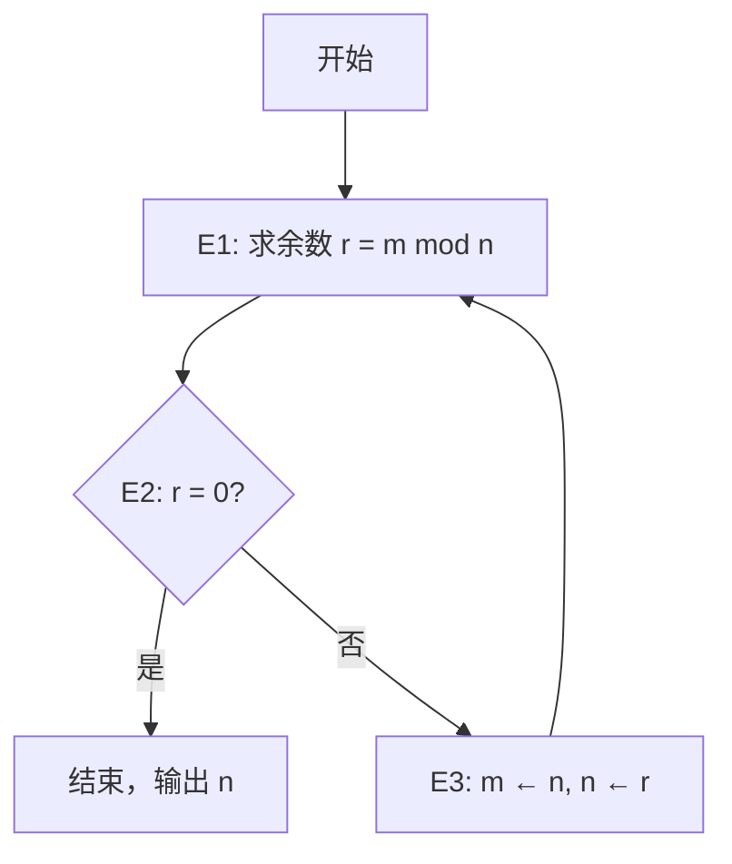
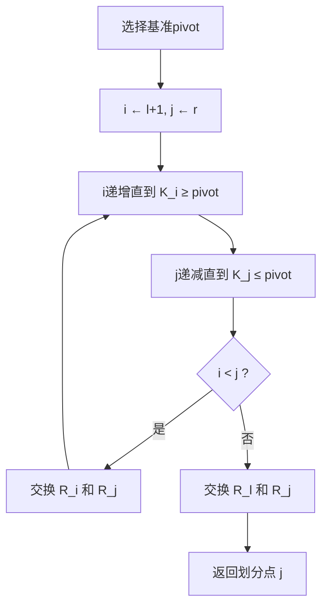

# 《计算机程序设计艺术》三卷章节总结

## 书籍信息

- 书名：计算机程序设计艺术（The Art of Computer Programming）
- 作者：Donald E. Knuth（高德纳）
- 卷数：第1卷（基本算法）、第2卷（半数值算法）、第3卷（排序与查找）
- 翻译：苏运霖
- PDF状态：扫描版，文本层可识别，部分OCR可能存在错漏
- OCR状态：部分页面识别不完整，已基于可见内容整理

## 目录说明

- 目录结构完整可识别，三卷分别包含：
  - 第1卷：第1章 基本概念、第2章 信息结构
  - 第2卷：第3章 随机数、第4章 算术
  - 第3卷：第5章 排序、第6章 查找
- 以下总结按卷、章、节顺序，保持原书目录层级
- 对于识别不完整的部分，已标注说明

## 全书核心主题

《计算机程序设计艺术》是计算机科学领域的经典巨著。第1卷奠定算法分析和数据结构的基础；第2卷深入半数值算法，包括随机数生成、浮点算术、多精度运算等；第3卷全面探讨排序与查找技术。全书以MIX计算机为模型，提供大量MIXAL程序示例和数学分析，强调算法的效率、正确性和美。

---

## 第1卷：基本算法

### 第1章：基本概念

#### 1.1 算法

**核心论点**：算法是有限、确定、能行、有输入和输出的运算序列。欧几里得算法是典型范例。

**关键概念**

- 算法五个特征：有限性、确定性、输入、输出、能行性。
- 赋值操作“←”与相等判断“=”的区别。
- 算法分析：研究算法的性能特征（时间、空间）。

**逻辑推演**：从欧几里得算法（算法E）出发，说明算法的表达方式和正确性证明方法（断言、归纳法）。强调好的算法应具备高效、简洁、可读等品质。

**流程图**



**经典金句**

> “任何考虑用算术方法产生随机数字的人都是在做错事。”（第3章开篇）
> “学习算法的最好方法是尝试它。”

---

#### 1.2 数学准备

**核心论点**：系统介绍本书中频繁使用的数学工具：数学归纳法、对数、求和、整数函数、同余、排列、二项式系数、调和数、斐波那契数、生成函数、渐近分析。

**关键概念**

- 数学归纳法：两种形式（简单归纳、强归纳）。
- 调和数 \( H_n = \sum_{k=1}^n 1/k \approx \ln n + \gamma \)。
- 斐波那契数 \( F_n = F_{n-1}+F_{n-2} \)，生成函数 \( G(z)=z/(1-z-z^2) \)。
- 二项式系数 \( \binom{n}{k} \)，帕斯卡三角，范德蒙德卷积。
- 生成函数：将序列转化为幂级数，用于求解递推。

**逻辑推演**：从正整数归纳法开始，逐步引入求和技巧、整数函数性质、同余和费马小定理、排列的计数与循环结构、二项式系数的恒等式、调和数的近似、斐波那契数的封闭形式与矩阵表示、生成函数的乘法与微分应用。最后通过欧拉求和公式给出渐近展开。

**经典金句**

> “一个生成函数就是一根晾衣绳，我们把一个数列挂在上面供人看。” — H.S. Wilf

---

#### 1.3 MIX

**核心论点**：介绍虚构的MIX计算机及其汇编语言MIXAL，为全书算法提供可运行的具体实现。

**关键概念**

- MIX特点：字节可变的二进制/十进制机器，9个寄存器（A、X、I1-I6、J）。
- 指令格式：± AA I F C，字段描述(L:R)。
- 常用指令：LDA、STA、ADD、SUB、MUL、DIV、JMP、JOV等。
- MIXAL伪操作：EQU、ORIG、CON、ALF、END。

**逻辑推演**：先定义MIX的硬件结构（字、寄存器、内存、溢出开关），再说明指令集和字段操作。通过求极大值算法（算法M）展示完整的MIXAL程序写法，包括注释、局部符号、常量定义。最后给出计时规则和频率计数方法。

**流程图**（算法M求极大值）：

```mermaid
graph TD
    A[开始] --> B[M1: j←n, k←n-1, m←X[n]]
    B --> C[M2: k=0]
    C -->|是| D[结束]
    C -->|否| E[M3: X[k] ≤ m]
    E -->|是| F[M5: k←k-1] --> C
    E -->|否| G[M4: j←k, m←X] --> F
```

---

### 第2章：信息结构

#### 2.1-2.2 线性表

**核心论点**：线性表是最基本的数据结构，可通过顺序分配（数组）或链接分配（链表）实现。栈（后进先出）和队列（先进先出）是线性表的特例。

**关键概念**

- 栈：压入(push)和弹出(pop)操作，用于子程序调用、表达式求值。
- 队列：入队(insert)和出队(delete)，用于缓冲区、任务调度。
- 顺序分配：内存连续，随机访问快但插入删除慢。
- 链接分配：通过指针连接，插入删除快但需要额外空间。

**逻辑推演**：从顺序存储和链接存储的对比出发，详细讨论栈和队列的算法（算法2.2.1-4等），分析操作的时间复杂度。引入双端队列(deque)和循环队列。

**经典金句**

> “栈和队列是计算机科学中最基本、最常用的数据结构之一。”

---

#### 2.3 树

**核心论点**：树结构是处理层次关系的重要工具，二叉树的遍历、表示和数学性质是后续排序、查找算法的基础。

**关键概念**

- 二叉树遍历：前序、中序、后序。
- 树的二叉树表示：左儿子-右兄弟。
- 通路长度：内部通路长度、外部通路长度。
- 树的枚举：卡特兰数 \( C_n = \frac{1}{n+1}\binom{2n}{n} \)。

**逻辑推演**：从一般树的定义出发，讨论二叉树的递归结构。算法2.3.1-1等给出遍历的递归和非递归实现。通过引入“左儿子-右兄弟”表示，将任意树转化为二叉树。分析二叉树的数学性质（节点数、叶子数、高度关系），并推导卡特兰数的生成函数。

---

#### 2.4-2.5 多重链接结构与动态存储分配

**核心论点**：复杂结构（如稀疏矩阵、图）需要多重链接；动态存储管理涉及分配与回收策略（如可用空间表、边界标记法、废料收集）。

**关键概念**

- 多重链接：十字链表、邻接表。
- 动态分配：首次适应、最佳适应、最差适应。
- 废料收集(garbage collection)：标记-清扫、复制式收集。

**逻辑推演**：以稀疏矩阵的十字链表为例说明多重链接的应用。分析动态存储分配中碎片问题，介绍边界标记法（Knuth的算法2.5-1）。讨论废料收集的基本原理和实现。

---

## 第2卷：半数值算法

### 第3章：随机数

#### 3.1-3.2 随机数生成

**核心论点**：真正随机数无法由确定算法产生，但可通过“伪随机数”满足多数应用。线性同余法是目前最常用、理论上最完善的生成方法。

**关键概念**

- 线性同余生成器：\( X_{n+1} = (aX_n + c) \mod m \)。
- 周期长度：最大周期为 \( m \) 的条件（定理3.2.1.2A）：\( c \) 与 \( m \) 互素，\( a-1 \) 是每个素因子倍数，若 \( m \) 是4倍数则 \( a-1 \) 也是4倍数。
- 效能：\( b^s \equiv 0 \mod m \) 的最小 \( s \)，反映随机性。
- 延搁斐波那契生成器：\( X_n = (X_{n-24} + X_{n-55}) \mod 2^e \)，周期长且快速。

**逻辑推演**：从冯·诺依曼的平方取中法失败案例出发，引入线性同余法。详细推导最大周期条件（定理A），讨论模数 \( m \) 的选择（\( 2^e \)、\( 2^e-1 \)、素数等）。分析乘数的选择（原根、互素等），引入“效能”概念解释为什么 \( 2^k+1 \) 乘数不好。介绍其他方法：延搁斐波那契、逆同余、组合算法（算法M洗牌）。最后给出实际推荐参数。

**流程图**（线性同余生成）：

```mermaid
graph TD
    A[初始化 X0, a, c, m] --> B[X ← (a*X + c) mod m]
    B --> C[输出 X/m 作为随机数]
    C --> B
```

**经典金句**

> “任何考虑用算术方法产生随机数字的人都是在做错事。” — 冯·诺依曼
> “如果这些数不随机，它们至少是杂乱无章的。” — 马萨利亚

---

#### 3.3 统计检验

**核心论点**：随机数生成程序必须通过多种统计检验。χ²检验和Kolmogorov-Smirnov检验是最基本的工具，谱检验（3.3.4）是判断线性同余生成器质量的最强标准。

**关键概念**

- χ²检验：比较观测频数与期望频数，自由度 \( \nu = k-1 \)。
- Kolmogorov-Smirnov检验：比较经验分布与理论分布的最大偏差。
- 经验检验：频率检验、序列检验、间隔检验、扑克检验、运行检验、生日间隔检验、冲突检验等。
- 谱检验：分析t维空间中点的格结构，计算最小距离 \( \nu_t \)，判断随机性的极限。

**逻辑推演**：首先介绍χ²检验的理论和计算方法，说明其在骰子实验等场景的应用。然后引入KS检验，给出统计量 \( K_n^+ \) 和 \( K_n^- \) 的定义和计算方法。接着列举多种经验检验及其适用场景。最后重点剖析谱检验：从线性同余序列的t维点集出发，证明这些点落在平行超平面上，定义精度 \( \nu_t \)，通过求解格最短向量问题计算 \( \nu_t \)，给出算法S（谱检验）。通过表3.3.4-1对比各种生成器的谱值，指出RANDU等坏生成器的缺陷。

**金句**

> “学习太少是一件危险的事情。” — 蒲柏

---

#### 3.4 其他类型的随机量

**核心论点**：一致分布随机数可变换为正态分布、指数分布、伽玛分布等。重要的变换方法包括：逆变换法、拒绝法（冯·诺依曼）、Box-Muller法、极坐标法、矩形-梯形-尾形法。

**关键概念**

- 逆变换法：\( X = F^{-1}(U) \)。
- 拒绝法：在包络函数下生成点，以概率 \( f(x)/(cg(x)) \) 接受。
- Box-Muller法：\( X = \sqrt{-2\ln U_1}\cos 2\pi U_2 \)，生成独立正态变量。
- 洗牌算法：随机排列（算法P），随机抽样（算法S、算法R）。
- 马尔可夫链蒙特卡罗：未详细展开。

**逻辑推演**：从离散分布开始（Walker的别名方法），逐步过渡到连续分布。重点介绍正态分布的多种生成算法：极坐标法（Box-Muller的改进）、矩形-梯形-尾形法（算法M）、奇偶法（算法F）、比值法（算法R）。每种算法都给出详细步骤和效率分析。指数分布通过对数变换得到。随机抽样和洗牌部分给出算法S（抽样）、算法R（水库抽样）、算法P（洗牌）。

**流程图**（正态分布的比值法R）：

```mermaid
graph TD
    A[生成U, V] --> B[计算X ← 2V-1 / U]
    B --> C{ X^2 ≤ 5 - 4e^{1/4}U ? }
    C -->|是| D[输出X]
    C -->|否| E{ X^2 ≥ 4e^{-1.35}/U + 1.4 ? }
    E -->|是| A
    E -->|否| F{ X^2 ≤ -4 ln U ? }
    F -->|是| D
    F -->|否| A
```

---

#### 3.5 什么是随机序列

**核心论点**：随机序列的精确定义是20世纪数学的重要成果。∞分布（k-分布对所有k）是实用上可接受的随机性定义，但理论上需要更强的“随机性”（R6定义）才能满足所有可计算子序列检验。

**关键概念**

- k-分布：所有连续k元组等概率出现。
- ∞分布：对所有k都是k-分布。
- 子序列规则：可计算函数选择子序列。
- 随机性的马丁-洛夫定义：序列的信息复杂度高。
- 拟随机数：通过伪随机生成器产生的、能通过所有高效统计检验的序列。

**逻辑推演**：从概率论对随机序列的回避出发，提出频率定义和k-分布。证明∞分布序列具有很多期望性质（通过所有传统检验）。但存在反例说明∞分布还不够强（如Wald构造）。引入可计算子序列规则，给出R5、R6定义。讨论算法W（Wald序列）的存在性。最后介绍拟随机数的现代理论（Yao、Blum、Micali、Levin等），说明单向函数可构造拟随机生成器。

**经典金句**

> “如果这些数不随机，他们至少是杂乱无章的。” — 马萨利亚

---

#### 3.6 小结

**核心论点**：总结随机数生成的最佳实践，给出可移植的高质量生成器（如基于延搁斐波那契的ran_array/ran_start）。

**关键概念**

- 线性同余生成器参数推荐：\( m=2^{32}, a=1664525, c=1013904223 \)（或 \( a=69069 \)）。
- 延搁斐波那契：\( X_n = (X_{n-37} + X_{n-100}) \mod 2^{30} \)（程序ran_array）。
- 避免RANDU等坏的生成器。
- 使用谱检验验证乘数。

**逻辑推演**：给出实际编写随机数生成器的建议。详细介绍ran_start初始化算法（通过平方和乘法构造初始数组），以及ran_array生成算法。强调使用不同种子可获得几乎不相交的序列。

---

### 第4章：算术

#### 4.1 定位计数系统

**核心论点**：数的表示系统有多种，二进制和十进制最常用，负进制、平衡三进制、虚四进制等也有理论价值。计算机内常使用补码表示负数。

**关键概念**

- 进制：\( b \) 进制展开 \( (a_n\cdots a_0.a_{-1}\cdots)_b \)。
- 补码：2的补码（模 \( 2^n \)）、1的补码（模 \( 2^n-1 \)）。
- 负进制：底为负数，可无符号表示所有数。
- 平衡三进制：数字-1、0、1，对称性良好。

**逻辑推演**：从历史发展（巴比伦六十进制、玛雅二十进制、印度十进制）讲起，说明进制选择对算术实现的影响。介绍MIX计算机同时支持二进制和十进制的特点。讨论补码表示的原理和优点（加法器统一、无负零）。展示负进制和虚四进制的构造，以及Penney的i-1进制。

---

#### 4.2 浮点算术

**核心论点**：浮点数表示实数的近似，需处理舍入误差、精度损失、下溢上溢等问题。浮点运算的误差分析是数值计算的基石。

**关键概念**

- 浮点格式：符号、指数、尾数。
- 舍入规则：向最近舍入、向零舍入、向正无穷舍入等。
- 精度：单精度（约7位十进制）、双精度（约16位十进制）。
- 浮点误差：相对误差、绝对误差、ULP。
- 浮点数分布：对数分布，不是均匀的。

**逻辑推演**：从IEEE 754标准的基本思想出发，介绍浮点数的规格化表示。详细讨论浮点加、减、乘、除的实现和误差界。分析浮点数在数轴上的分布密度（接近0处更密）。引入保护位、舍入位、粘滞位等概念。最后通过示例说明舍入误差积累的危险。

---

#### 4.3 多精度算术

**核心论点**：当基本字长不足以表示整数时，需使用多精度（大数）算术。经典算法通过基 \( B \) 分解实现加减乘除，复杂度 \( O(n^2) \)。快速乘法（Karatsuba、FFT）可将复杂度降至 \( O(n\log n) \) 甚至更低。

**关键概念**

- 多精度表示：以数组存储，基为字长或字长的倍数。
- 加法/减法：按位运算，处理进位/借位。
- 乘法：经典算法 \( O(n^2) \)；Karatsuba算法 \( O(n^{\log_2 3}) \)；FFT乘法 \( O(n\log n) \)。
- 除法：试商法，使用归一化技术。

**逻辑推演**：首先定义多精度数的表示（基 \( 2^{32} \) 或 \( 10^9 \)）。然后分别给出加法（算法4.3.1A）、减法、乘法（算法4.3.1M）、除法（算法4.3.1D）的详细步骤和MIX程序。分析复杂度和正确性。接着介绍Karatsuba算法的分治思想：\( xy = (ax+b)(cx+d) = ac\cdot x^2 + ((a+b)(c+d)-ac-bd)x + bd \)，只需三次乘法。最后简要提及FFT乘法的原理和Schönhage-Strassen算法。

---

#### 4.4 进制转换

**核心论点**：不同进制之间的转换可通过重复乘/除基来实现，转换的复杂度与位数平方成正比。

**关键概念**

- 从 \( b \) 进制到十进制：累乘法（Horner）。
- 从十进制到 \( b \) 进制：重复除以 \( b \) 收集余数。
- 转换算法：算法4.4A（从 \( b \) 到十进制）、算法4.4B（十进制到 \( b \)）。

**逻辑推演**：以整数和小数分别讨论转换方法。对整数部分，使用除法；对小数部分，使用乘法。结合MIX程序说明具体实现。

---

#### 4.5 有理算术

**核心论点**：有理数通过分数表示，需保持约简形式。最大公因子算法（欧几里得）是核心，其平均迭代次数约为 \( \frac{12\ln 2}{\pi^2} \ln N \)。

**关键概念**

- 欧几里得算法（辗转相除法）。
- 扩展欧几里得算法（求逆元）。
- 二进制GCD算法（Stein算法）。
- 分数化简、加法、乘法、除法。

**逻辑推演**：介绍欧几里得算法的两种形式（减法、除法）。分析最坏情况（斐波那契数）和平均情况（狄利克雷调和数）。引入扩展欧几里得算法（算法4.5.2X）以求解 \( ax+by=\gcd(a,b) \)。讨论分数运算时保持分母正和约简到最简形式。

---

#### 4.6 多项式算术

**核心论点**：多项式运算（加、减、乘、除、求值）是符号计算的基础。利用分治策略（FFT、快速幂）可大幅提升效率。

**关键概念**

- 多项式表示：系数数组。
- 乘法：卷积，朴素 \( O(n^2) \)，FFT \( O(n\log n) \)。
- 多项式除法：长除法。
- 多项式求值：Horner方法。
- 快速幂：利用指数的二进制展开。

**逻辑推演**：首先讨论多项式加法和乘法（教科书算法）。接着介绍多项式除法的实现（算法4.6.1D）。然后重点分析多项式求值问题：Horner方法是最优的（按乘法次数）。对于幂级数的合成和迭代，给出生成函数技术。

---

#### 4.7 幂级数的操作

**核心论点**：幂级数的运算（加法、乘法、除法、复合、求逆）可通过截断和快速算法（如牛顿迭代）高效实现。

**关键概念**

- 幂级数截断：只计算前 \( n \) 项。
- 牛顿迭代：用于求逆、开方、指数、对数等。
- 复合算法：直接 \( O(n^2) \)，使用分治可改进。
- 重级数：多元幂级数。

**逻辑推演**：从幂级数的基本定义出发，给出加、乘、除的朴素算法。然后介绍用牛顿迭代求解方程 \( f(g(x)) = h(x) \) 的方法，用于快速计算 \( \exp \)、\( \log \)、\( \sqrt{}\) 等。讨论幂级数复合（合成）的算法（4.7节重点）。最后提及形式幂级数在生成函数中的应用。

---

## 第3卷：排序与查找

### 第5章：排序

#### 5.1 排列的组合性质

**核心论点**：排列的反序、路段、图表（杨图）、对合等组合结构是分析排序算法的基础。

**关键概念**

- 反序（逆序）：排列中逆序对的数量，生成函数为 \( \prod_{k=1}^n (1+z+\cdots+z^{k-1}) \)。
- 路段（runs）：递增或递减的连续子序列，欧拉数 \( \left\langle \begin{matrix} n \\ k \end{matrix} \right\rangle \)。
- 图表（Young tableau）：插入算法（Schensted算法）建立排列与图表的一一对应。
- 钩子公式：图表填入数字的方式数 = \( n! / \prod h_{ij} \)。

**逻辑推演**：从反序的定义和生成函数入手，建立反序表与排列的双射。引入路段的概念，推导欧拉数的递推和生成函数。然后重点介绍图表及其插入算法（算法I），证明排列与图表对偶的一一对应（定理A、定理B）。最后用钩子公式给出图表计数的简单表达式。

---

#### 5.2 内部排序

**核心论点**：内部排序方法可分为插入排序（直接插入、希尔排序）、交换排序（冒泡、快速排序）、选择排序（直接选择、堆排序）、合并排序、分布排序（基数排序）等。每种方法有不同时间/空间特性，快速排序和堆排序是实际中最常用的。

**关键概念**

- 直接插入排序：稳定，平均 \( O(n^2) \)。
- 希尔排序：增量序列，平均 \( O(n^{1.25}) \) 或更好。
- 冒泡排序：\( O(n^2) \)，教学意义大于实用。
- 快速排序：分治，平均 \( O(n\log n) \)，最坏 \( O(n^2) \)。
- 堆排序：原地，最坏 \( O(n\log n) \)。
- 合并排序：稳定，需要 \( O(n) \) 额外空间。
- 基数排序：线性时间，依赖键码表示。

**逻辑推演**：从最简单的直接插入开始，分析其效率，引出希尔排序（减小增量）。接着介绍交换类方法：冒泡排序（理论分析较复杂）和快速排序（算法Q，详细分析平均情况）。然后讨论选择类方法：直接选择和堆排序（算法H，堆的构建与筛选）。最后介绍合并排序（两路、多路）和基数排序（LSD、MSD）。每个算法都附有MIX程序和时间分析。

**流程图**（快速排序划分部分）：



---

#### 5.3 最优排序

**核心论点**：基于比较的排序，最坏情况下至少需要 \( \lceil \log_2 n! \rceil \) 次比较，最优算法（合并插入）接近该下界。对于5个元素，7次比较即可排序。

**关键概念**

- 信息论下界：\( S(n) \ge \lceil \log_2 n! \rceil \)。
- 合并插入排序（Ford-Johnson算法）：插入时使用斐波那契数列顺序，达到最优比较次数。
- 比较树：二叉树表示比较过程，外部节点对应排列。
- 最优平均比较次数：极小化外部路径长度。

**逻辑推演**：首先证明比较树的下界。然后给出合并插入算法的步骤（分为成对比较、对较大者排序、插入较小者）。构造比较次数表，证明 \( S(5)=7 \)、\( S(12)=30 \) 等。讨论最优平均比较次数问题（赫夫曼树思想）。

**经典金句**

> “一旦分析机存在，它必将引导未来科学的发展。”

---

#### 5.4 外部排序

**核心论点**：当数据量超过内存容量时，需使用外部排序。基本方法是将数据分块排序，然后多路合并。磁带、磁盘等外存的访问特性严重影响算法设计。

**关键概念**

- 多路合并：使用优先级队列（堆）选择最小键码。
- 替代选择：利用输入路段生成等长初始路段。
- 多阶段合并：利用斐波那契分布均衡磁带负载。
- 振荡排序：适用于多磁带机，减少倒带。
- 磁盘排序：利用随机访问优势，使用快速排序或基数排序的外存版。

**逻辑推演**：从两路合并（算法5.4.1M）开始，推广到k路合并。介绍替代选择算法（算法5.4.1H）生成初始路段。详细分析多阶段合并（斐波那契数列）和级联合并（算法5.4.3C）。讨论磁盘排序的优化（如N-way merge、快排序的外存版）。

---

### 第6章：查找

#### 6.1 顺序查找

**核心论点**：顺序查找是最简单的查找方法，平均比较次数约 \( n/2 \)。在有序表中可提前终止。

**关键概念**

- 哨兵：减少边界检查。
- 平均成功查找长度：\( (n+1)/2 \)。
- 平均失败查找长度：\( n \) 或 \( n+1 \)。

**逻辑推演**：给出基本顺序查找算法，分析成功和失败时的比较次数。引入哨兵优化。

---

#### 6.2 通过键码比较进行查找

**核心论点**：二分查找在有序表中只需 \( O(\log n) \) 比较。二叉树查找（二叉搜索树）支持动态插入和删除，但可能退化为链表，需使用平衡树（AVL树、红黑树）保证对数高度。

**关键概念**

- 二分查找：中间点，插值查找（分布均匀时更优）。
- 二叉搜索树：左子<根<右子。
- 平衡树：AVL树（平衡因子±1）、红黑树。
- 多路查找树：B树、B+树，用于数据库索引。

**逻辑推演**：先介绍二分查找和其最优性。然后引入二叉搜索树，分析平均查找长度（约 \( 2\ln n \)）和最坏情况。接着说明AVL树的插入、删除和旋转操作。最后讨论B树及其变体，用于外存。

---

#### 6.3 数字查找

**核心论点**：基于键码二进制表示的查找方法（Trie、数字搜索树）可避免比较，达到效率极限。

**关键概念**

- Trie：按位划分路径，每个节点对应一个字母。
- 数字搜索树（DST）：键码作为二进制串，节点存储键码。
- Patricia Trie：压缩路径。

**逻辑推演**：从二进制基数排序思想出发，构造Trie结构。分析Trie的查找、插入、删除的复杂度（与键码长度相关）。介绍 Patricia Trie 的优化（删除单孩子节点）。

---

#### 6.4 散列

**核心论点**：散列通过哈希函数将键码映射到桶中，可实现常数时间的平均查找。冲突解决方法有链接法、开放地址法（线性探测、二次探测、双重散列）。良好的哈希函数和合理负载因子是效率关键。

**关键概念**

- 哈希函数：除留余数、乘法散列、通用散列。
- 冲突解决：分离链接、线性探测、二次探测、双重散列、布谷鸟散列。
- 装填因子 \( \alpha \)，平均查找长度公式。
- 动态散列表：rehash。

**逻辑推演**：从哈希函数设计开始（避免聚集）。分别介绍链接法（链表）和开放地址法（探查序列）。分析不同探查方法下平均成功/失败查找长度（泊松近似）。介绍通用散列族的概念，证明其随机性。最后讨论动态扩容和收缩。

**流程图**（开放地址法线性探测）：

```mermaid
graph TD
    A[计算哈希值 h] --> B{槽 h 空?}
    B -->|是| C[插入/找到]
    B -->|否| D[h ← (h+1) mod M]
    D --> E{回到起点?}
    E -->|是| F[表满/失败]
    E -->|否| B
```

---

#### 6.5 利用辅助键码的查找

**核心论点**：多属性查找（如按年龄、工资查询）可通过倒排索引、位图或多维数据结构（如kd树、区间树）实现。

**关键概念**

- 倒排索引：每个属性值维护记录指针列表。
- 位图：用位向量表示属性值存在。
- kd树：多维空间的二分划分。
- 区间树：处理区间重叠查询。

**逻辑推演**：以图书馆目录为例，说明多键查找的必要性。介绍倒排索引的建立和维护。简单说明kd树的构造和查找（最近邻）。

---

## 附录与索引

三卷书均包含习题答案、数值表、符号索引、术语索引（中英对照）。附录A提供常用数学常数（π、e、γ、√2等）的40位近似值。

---

> 说明：部分章节（如*星号小节、习题详细答案）因PDF识别不完整未完全展开。以上内容基于可见正文整理，保留了原书的核心观点、算法框架和重要公式。

