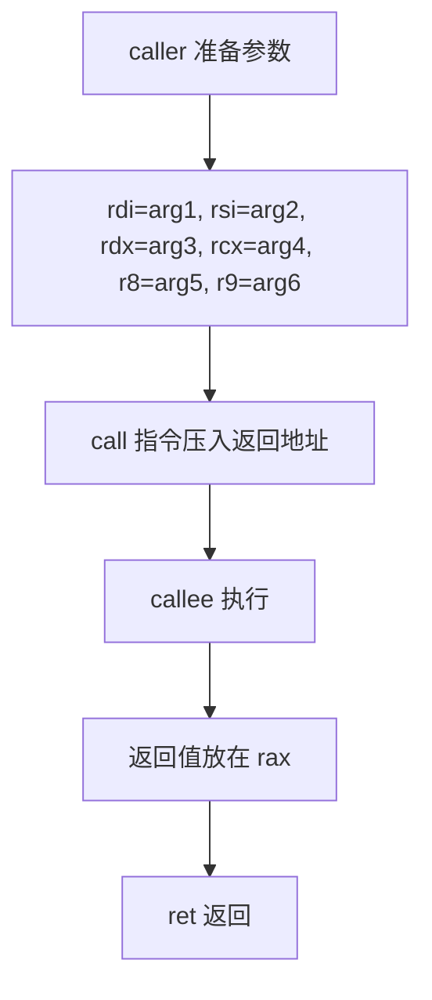
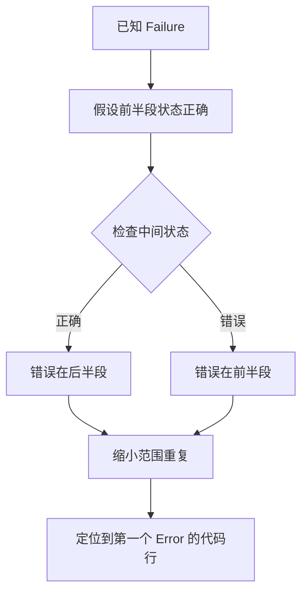
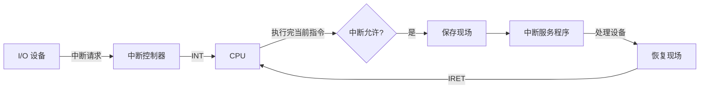
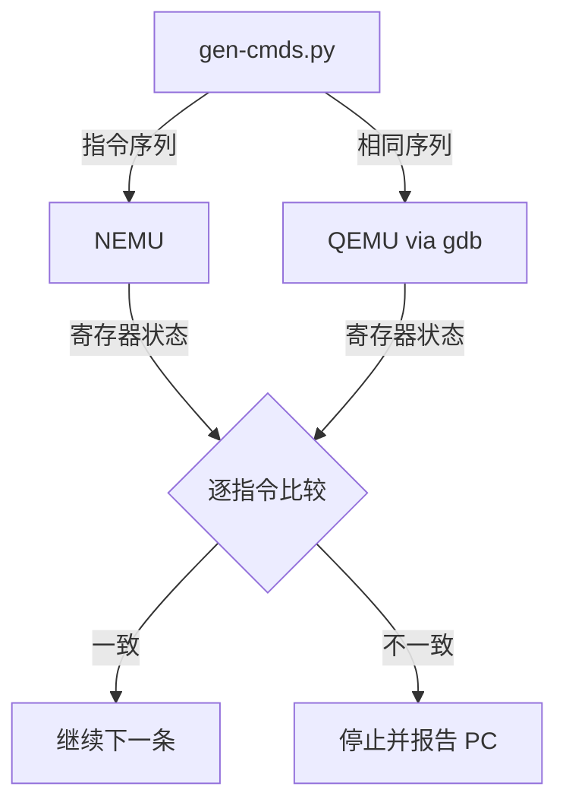
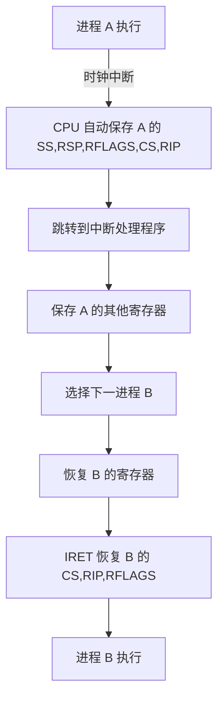
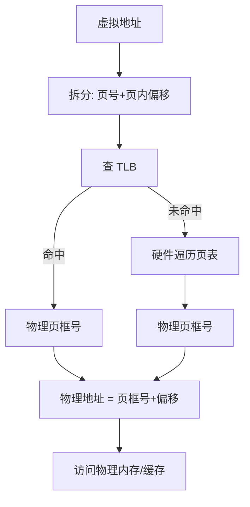
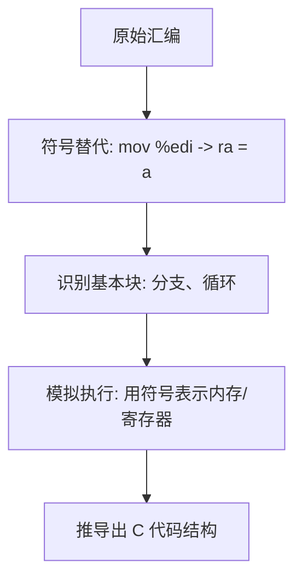

# 《计算机系统基础习题课》章节总结

## 书籍信息
- 书名：计算机系统基础习题课讲义（Missing Course of CSEducation 系列）
- 作者：王慧妍 (why@nju.edu.cn)、蒋炎岩 (jyy@nju.edu.cn) 等
- PDF 状态：共 8 个独立讲义的 PDF 文件，内容完整但包含大量代码、命令行截图及图片引用
- OCR 状态：文本可识别，部分图片描述已提取为文字说明，部分图像占位符保留

## 目录说明
- 目录识别依据：各讲 PDF 中的“本讲概述”或首屏标题
- 章节对应顺序：按文件名 W1 至 W8 依次作为第 1 至第 8 章
- OCR 修复说明：部分代码缩进、特殊符号（如反斜杠、下划线）可能存在 OCR 误差，但核心逻辑可还原；流程图和架构图通过文本描述及上下文逻辑使用 Mermaid 重建

## 全书核心主题
本课程是《计算机系统基础》理论课的补充习题课，旨在弥补传统教学中缺失的实践细节。核心内容包括：真实的开发工具链（Git、Make、命令行）、C 语言底层机制（预编译、编译链接、内存模型）、模拟器 NEMU 的架构与代码阅读、数据的机器级表示（位运算、浮点数、整数溢出）、x86-64 与内联汇编、以及系统性的调试理论与方法。通过 PA（编程大实验）和 Lab 实验，培养学生独立完成大型系统软件的能力，强调学术诚信与可读代码的编写。

---

## 第1章：Missing Course of CSEducation（课程缺失的实践环节）
### 1. 核心论点
问题：理论课程中缺乏哪些对编程生涯至关重要的实践细节？  
观点：命令行、Git、Make、调试工具、学术诚信等“缺失环节”是学生从 PA/Lab 中生存下来、并成长为合格“码农”的必需品。

### 2. 关键概念/事件
- **PA（编程大实验）**：NEMU 模拟器的四个连贯实验（简易调试器、程序执行、Cache 与存储管理、异常与 I/O）。
- **学术诚信**：独立完成作业、正确引用外部资源、不抄代码；MIT 6.005 的具体案例（如不互相看着屏幕写代码、不共享测试用例）。
- **Soft DDL / Hard DDL**：软截止前提交有 5% 奖励分，总分 100% 封顶；硬截止严格。
- **评分标准**：PA 客观评分（编译错误→10%，通过 easy 测试→≥50%，通过 hard→≥75%）；Lab 完全客观；Homework 提交即得分。
- **PA0：Linux 环境配置**：安装 GNU/Linux、熟悉命令行工具、配置 vim、获取 PA 源码。

### 3. 逻辑推演
课程首先指出理论课与实践的巨大鸿沟，引入 PA 的难度与挑战，强调“独立完成”的训练价值。然后展示评分体系与学术诚信红线，通过 MIT 和南大真实案例说明抄袭的后果。最后以 PA0 为起点，引导学生从安装 Linux 开始，逐步掌握命令行生存技能（vi, ip addr, find, grep, pipe 等），并推荐 RTFM/STFW 的学习方法。

### 4. 经典金句/数据
> “Programs are meant to be read by humans and only incidentally for computers to execute.” – D. E. Knuth (p.17)  
> “那些痛苦是对你的训练（training）”（p.24）  
> “禁用百度和中文关键字”（p.45）

---

## 第2章：C语言拾遗(1): 机制
### 1. 核心论点
问题：从 .c 到 a.out 的每一步究竟发生了什么？C 语言的内存模型如何理解？  
观点：编译、链接、加载的过程本质是对内存（地址+长度）的解读；C 语言的所有特性都可以归结为“类型 = 对内存的解读方式”。

### 2. 关键概念/事件
- **预编译**：`#include`、`#define` 的纯文本替换；X-macro 技巧；元编程。
- **编译与链接**：`.c` → `.i` → `.s` → `.o` → `a.out`；编译单元合并。
- **内存模型**：代码段、数据段、堆栈段；一切皆可取地址（函数、变量、参数）。
- **函数指针**：`int (*f)(int, char*[]) = main;` 实现递归调用 main。
- **main 的参数**：`argc`、`argv`；谁调用了 main？进程启动后的第一条指令。

### 3. 逻辑推演
从 IDE 一键编译运行出发，拆解为预编译（粘贴头文件、宏展开）、编译（C→汇编）、汇编（→机器码）、链接（合并目标文件）、加载（内存布局）。通过例子展示宏的威力与危险（IOCCC、OJ 破坏）。然后聚焦内存：用 `printptr` 函数打印 `main`、`&x`、`&argc` 等的地址和内容，说明代码/数据/堆栈的分布。最后以递归调用 main 并遍历 `argv` 的例子，演示指针运算与类型转换的实质。

### 4. 流程图


### 5. 经典金句/数据
> “C 代码的连续一段总能对应到一段连续的机器指令”（p.37）  
> “类型：对一段内存的解读方式”（p.43）  
> “Unix is user friendly. It's just selective about who its friends are.” (p.32)

---

## 第3章：C语言拾遗(2): 编程实践
### 1. 核心论点
问题：如何从“会写 C 代码”进阶到“在大型项目中存活”？  
观点：核心准则是编写可读代码（不言自明 + 不言自证）；通过数字逻辑电路模拟器和 YEMU 模拟器案例，演示如何降低模块依赖、使用宏与 enum 管理寄存器、设计可扩展的指令译码。

### 2. 关键概念/事件
- **可读性准则**：不言自明（阅读代码即理解行为）和不言自证（代码与规范一致）。
- **X-Macro**：`#define FORALL_REGS(_) _(X) _(Y)` 统一管理寄存器的定义、更新、打印。
- **YEMU**：简化版 NEMU，模拟 16 字节内存、4 个寄存器、4 条指令（mov, add, load, store）。
- **指令译码**：使用 union + bit fields 解析指令（`inst_t`），switch 分派。
- **Makefile**：描述依赖关系，支持增量编译。

### 3. 逻辑推演
先展示极端不可读（IOCCC）和可读性差的函数声明（signal），然后提出 typedef 改善。引入数字逻辑电路模拟器需求，从硬编码寄存器演进到 X-Macro 通用框架，体现“减少依赖、阻止错误”。接着过渡到 YEMU：定义存储模型（全局变量）、提升代码质量（enum 寄存器、`#define pc R[PC]`）、使用 union 解析指令。最终给出完整 YEMU 实现与测试框架，并提示 NEMU 就是加强版 YEMU。

### 4. 方法流程图（指令执行循环）

```mermaid
graph TD
    A[取指令 inst = M[pc]] --> B{译码 op}
    B -->|0x0| C[mov rt, rs]
    B -->|0x1| D[add rt, rs]
    B -->|0xE| E[load addr → R[0]]
    B -->|0xF| F[store R[0] → M[addr]]
    C --> G[pc++]
    D --> G
    E --> G
    F --> G
    G --> A
```

### 5. 经典金句/数据
> “永远不要停止对好代码的追求”（p.57）  
> “NEMU 就是加强版的 YEMU”（p.55）  
> “使用合理编程模式，减少模块之间的依赖”（p.55）

---

## 第4章：NEMU框架选讲之编译运行
### 1. 核心论点
问题：如何理解 NEMU 复杂的项目构建（Makefile、Git、提交脚本）？  
观点：现代化的项目管理依赖版本控制（Git）和构建系统（Make）；即使 Makefile 复杂，通过 `-nB` 追踪实际命令即可理解本质；Git 不仅是备份工具，还被用于追踪代码演化与抄袭检测。

### 2. 关键概念/事件
- **Git 基础**：`git clone -b 2021`、`.gitignore`（只跟踪 .c/.h/Makefile）、`make submit` 脚本。
- **Git 追踪**：编译时强制提交（`git commit` 记录 hostnamectl 和 uptime），用于学术诚信取证。
- **Make 调试**：`make -nB` 打印实际执行的命令，过滤掉 `echo`/`mkdir` 后可见编译链接全过程。
- **Makefile 彩蛋**：`make html` 将 Makefile 转换为可读 HTML。
- **AbstractMachine 构建**：`docs as code` 理念，使用 Doxygen/pydoc 生成文档。

### 3. 逻辑推演
从 UNIX Hater's Handbook 对文档的批评切入，引出 GitHub 开源社区的价值。讲解 Git 的基本操作（clone, commit, .gitignore），然后展示提交脚本（`bash -c "$(curl ...)"`）和强制 Git 追踪的 Makefile 片段。分析 YEMU 的 Makefile 作为温习，再进入 NEMU 的顶层 Makefile，指出其复杂性但鼓励使用 `make -nB` 简化。最后介绍 `make html` 彩蛋，并过渡到 AbstractMachine 的现代化文档方式。

### 4. 流程图（NEMU 构建与执行）

```mermaid
graph TD
    A[make run] --> B[git commit “compile”]
    B --> C[编译 .c → .o]
    C --> D[链接生成 nemu-interpreter]
    D --> E[执行 nemu-interpreter --log ...]
    E --> F[加载默认镜像]
    F --> G[进入命令行界面 (nemu)]
```

### 5. 经典金句/数据
> “任何感到不爽的事情都一定有工具能帮你”（p.53）  
> “Read the friendly source code!” (p.5)  
> “我们使用了‘白名单’.gitignore 文件”（p.20）

---

## 第5章：NEMU框架选讲之代码导读
### 1. 核心论点
问题：面对 5000+ 行的 NEMU 代码，如何高效阅读并找到入口？  
观点：读代码不是逐行浏览，而是使用工具（grep, find, fzf, vim tags）进行“导航”；从 main 函数开始，理解参数解析、初始化、引擎启动的流程。

### 2. 关键概念/事件
- **代码规模**：`find . -name "*.c" -o -name "*.h" | xargs cat | wc -l` 约 23069 行（含工具）。
- **寻找 main**：`grep -n main $(find . -name "*.c")` 或 `vimgrep /\<main\>/**/*.*`。
- **parse_args**：使用 `getopt_long` 解析 `-b`、`-l`、`-d`、`-p`、`--help` 等选项。
- **static 函数**：限制符号的 internal linkage，防止 multiple definition。
- **static inline**：在头文件中定义小函数，零开销（避免 call 指令）。
- **assert 宏**：`do { if(!(cond)) panic(...); } while(0)` 的经典实现。
- **编辑器配置**：使用 marks, tags, tabs, folding 提升导航效率；VSCode 需要配置 `c_cpp_properties.json`。

### 3. 逻辑推演
首先给出“RTFSC”的口号，然后建议先用 tree 和 find 了解项目规模。接着用多种方法（grep, vimgrep, fzf）定位 main 函数，进入 `nemu-main.c`。逐行解释 main：`init_monitor` 或 `am_init_monitor`，然后 `engine_start`。深入 `parse_args`，讲解 `getopt_long` 的用法。中间穿插技术细节：static 函数的作用、static inline 的性能优势、assert 的安全写法。最后提供编辑器（Vim/VSCode）的配置建议，并鼓励征服畏惧的工具。

### 4. 流程图（NEMU 启动流程）

```mermaid
graph TD
    A[main] --> B{CONFIG_TARGET_AM?}
    B -->|Yes| C[am_init_monitor]
    B -->|No| D[init_monitor(argc,argv)]
    D --> E[parse_args 解析命令行]
    E --> F[init_mem / load_img]
    F --> G[welcome 打印]
    G --> H[engine_start]
    H --> I[cpu_exec 循环]
```

### 5. 经典金句/数据
> “静态 inline 函数定义在头文件中……编译优化成零开销”（p.41）  
> “敲黑板：征服你畏惧的东西，就会有意想不到的收获。”（p.61）  
> “我们看到了太多的同学，到最后都没有学会使用编辑器/IDE”（p.63）

---

## 第6章：数据的机器级表示
### 1. 核心论点
问题：数据在计算机中为什么以二进制表示？位运算、整数溢出、浮点数（IEEE754）有什么深层设计和实用技巧？  
观点：一切数据都是 bit string；位运算可实现 SIMD 和高效集合操作；整数溢出是 C 语言的 undefined behavior，但也是优化机会；IEEE754 浮点数通过精巧设计平衡了范围和精度。

### 2. 关键概念/事件
- **位运算与 SIMD**：&, |, ^, <<, >> 并行操作所有 bit；bitset 实现集合（成员测试、并交差、遍历 lowbit）。
- **popcount**：`x = (x & 0x55555555) + ((x>>1)&0x55555555)` 的分治算法。
- **lowbit**：`x & -x` 得到最低位的 1。
- **整数溢出**：有符号溢出为 UB，编译器可优化（如 `1<<-1` 被删除）；无符号溢出定义良好（wrap around）。
- **IEEE754 浮点数**：`(-1)^S × (1.F) × 2^(E-B)`；非规格化数、±0、Inf、NaN；浮点数加法不满足结合律；`float` 密度不均。
- **快速倒数平方根**：`0x5f3759df - (i>>1)` 的 magic number。

### 3. 逻辑推演
从逻辑电路易实现位运算开始，展示 6502 处理器。然后位运算在集合操作中的应用（bitset），引出 popcount 的 SIMD 实现和 lowbit 技巧。讨论整数溢出的 UB 历史包袱，以及编译器利用 UB 优化可能带来的“意外”。最后介绍浮点数的 IEEE754 标准，通过实验说明大数间隔大、累加顺序影响结果，并展示快速倒数平方根的位操作技巧。

### 4. 流程图（lowbit 求法）


### 5. 经典金句/数据
> “Everything is a bit-string!” (p.48)  
> “IEEE754 天才的设计保证了数值计算的稳定”（p.42）  
> “快 1.5 倍：640×480 → 800×600”（p.44）

---

## 第7章：x86-64与内联汇编
### 1. 核心论点
问题：为什么需要从 x86 (IA32) 转向 x86-64？x86-64 的调用惯例和寄存器变化带来了什么优势？如何在 C 中嵌入汇编？  
观点：x86-64 扩展了寄存器数量，使用寄存器（rdi, rsi, rdx, rcx, r8, r9）传递参数，大幅减少内存访问；内联汇编允许在 C 代码中直接编写特定指令，但需要小心处理 clobber 列表和优化。

### 2. 关键概念/事件
- **字长发展**：8 位 (6502) → 16 位 (8086) → 32 位 → 64 位（x86-64, AArch64, RV64）。
- **cdecl 调用惯例**（32 位）：参数从右向左压栈，调用方清理栈，返回值 eax。
- **x86-64 System V ABI**：参数通过 rdi, rsi, rdx, rcx, r8, r9 传递；多余的才压栈；callee-saved 寄存器（rbx, rbp, r12-r15）。
- **内联汇编**：`asm volatile("addl %1, %2; movl %2, %0" : "=r"(z) : "r"(x), "r"(y) : "cc")`；输入/输出操作数、clobber list。
- **符号执行**：用数学符号表示内存/寄存器，模拟单步执行来理解汇编。

### 3. 逻辑推演
从机器字长历史（8→16→32→64）引出地址空间和数据宽度的需求。比较 32 位 cdecl 和 64 位 System V ABI 的参数传递方式，通过 `add`、`max`、`fprintf` 等实例展示代码密度的提升。分析 `foo` 函数中对参数取地址时编译器如何分配栈内存。最后介绍内联汇编的语法，展示编译器优化可能删除无用汇编（通过 `volatile` 阻止），以及 clobber list 的重要性。

### 4. 流程图（x86-64 函数调用）



### 5. 经典金句/数据
> “x86-64 是更现代的体系结构，更精简的指令序列”（p.49）  
> “使用寄存器传递函数参数：编译器有了更大的调度空间”（p.35）  
> “一旦掌握了分析汇编代码的方法，x86-64 也不可怕”（p.61）

---

## 第8章：调试：理论与实践
### 1. 核心论点
问题：面对 bug，如何系统性定位并修复？  
观点：调试遵循 Fault → Error → Failure 的因果链；通过二分查找（检查程序状态）可定位 fault；实际中常用 printf 日志和 gdb 单步；优秀的代码（可读、带断言）能大幅缩短调试时间。

### 2. 关键概念/事件
- **机器永远是对的**：所有 bug 最终都是自己的责任。
- **未测代码永远是错的**：最不可能出 bug 的地方往往藏着 bug。
- **二分定位法**：如果能判断任意状态下程序是否正确，则从 failure 向前二分查找第一个 error 状态。
- **断言 (assert)**：将 specification 写成可执行代码，尽早暴露 error。
- **工具**：`gdb`（backtrace、layout asm）、`printf`（自定义日志）、`-fsanitize=address`。
- **知名 bug**：第一只真正的 bug（继电器上的飞蛾）、千年虫、Intel 浮点除法 bug。

### 3. 逻辑推演
先提出两个基本信条（机器永远正确、未测代码永远错误）。然后介绍调试理论：Fault（代码错误）→ Error（内部状态错）→ Failure（可观测错误）。通过二分法和单步调试的理论依据，指出判定状态正确性是难点。实践中结合 `printf` 日志（粗粒度）和 `gdb`（细粒度）进行。强调断言的重要性，展示 NEMU 中的 `check_reg_idx` 和内存边界检查。最后给出 Address Sanitizer 等现代工具，并以“不要放弃 PA”鼓励学生。

### 4. 方法流程图（调试二分法）



### 5. 经典金句/数据
> “机器永远是对的，未测代码永远是错的”（p.4）  
> “Fault → Error → Failure”（p.7）  
> “每当你写出不好维护的代码，你都在给你未来的调试挖坑。”（p.33）  
> “不要放弃 PA。”（p.51）

---

## 附录：课程实验与评分要点（综合自各讲提醒）
- **PA1 Soft DDL**：2021.10.3  
- **Lab1 Soft DDL**：2021.10.17  
- **PA2**：2.1 (2021.10.11), 2.2 (2021.10.25), 2.3 (2021.10.31)  
- 提交方式：`make submit` 通过 curl 下载脚本；Git 追踪用于抄袭检测  
- 评分：PA 客观+人工，Lab 全客观，Homework 提交即得分  
- 学术诚信严格：禁止共用测试用例、禁止查看他人代码、禁止虚拟机镜像拷贝

# 《计算机系统基础习题课》章节总结（续：第9章至第17章）

## 书籍信息
- 书名：计算机系统基础习题课讲义（Missing Course of CSEducation 系列）
- 作者：王慧妍 (why@nju.edu.cn)、蒋炎岩 (jyy@nju.edu.cn) 等
- PDF 状态：包含 W1 至 W17 共 17 个讲义的 PDF 片段（其中 W10 未提供，W1‑W8 已总结，现补充 W9、W11‑W17）
- OCR 状态：文本可识别，部分代码和表格需还原

## 目录说明
- 目录识别依据：各讲标题及“本讲概述”
- 章节顺序：W1‑W8（已输出），W9（链接与加载选讲），W11（I/O设备选讲），W12（系统编程与基础设施），W13（中断与分时多任务），W14（程序优化），W15（虚拟存储选讲），W16（造轮子的方法和乐趣），W17（复习答疑）
- 说明：W10 缺失，W12‑W16 中部分文件分为多个 part，已合并为一章处理

---

## 第9章：链接与加载选讲
### 1. 核心论点
问题：静态链接、动态链接和加载的底层机制是什么？为什么动态链接比静态链接更常用？  
观点：链接的本质是合并目标文件并解析符号；动态链接通过位置无关代码（PIC）和 PLT/GOT 实现运行时绑定，节省内存并支持共享库；加载由动态链接器 `/lib64/ld-linux-x86-64.so.2` 完成。

### 2. 关键概念/事件
- **ELF 文件类型**：可重定位文件 (.o)、可执行文件、共享目标文件 (.so)、核心转储文件。
- **静态链接**：`-static` 选项，将库代码直接合并到可执行文件，体积大，每个进程独立副本。
- **动态链接**：默认方式，通过 `ld-linux.so` 在加载时解析未定义符号，共享库代码在内存中只保留一份。
- **位置无关代码 (PIC)**：使用相对偏移寻址，使共享库可加载到任意地址；x86-64 默认 PIC。
- **PLT / GOT**：过程链接表 (PLT) 和全局偏移表 (GOT) 实现延迟绑定：首次调用 `printf@plt` 时跳转到动态链接器解析地址，后续直接调用。
- **链接器脚本 (ld script)**：描述如何合并段、定义符号地址，可用 `-Wl,--verbose` 查看。
- **binutils**：`objdump`, `readelf`, `nm`, `addr2line` 等工具分析二进制文件。

### 3. 逻辑推演
以 `a.c`, `b.c`, `main.c` 为例，先用 `-fno-pic -static` 编译，观察 `.o` 中的重定位项（`00 00 00 00`），链接后变成实际地址。然后去掉 `-static`，看到可执行文件大幅缩小，库代码消失，新增 `.interp` 段指向动态链接器。通过 `ldd` 和 `readelf -l` 验证动态链接器的存在。解释动态链接器如何启动程序、加载共享库、处理 PLT/GOT。最后指出中文资料稀缺，鼓励学生直接阅读英文手册。

### 4. 方法流程图（静态 vs 动态链接）

```mermaid
graph TD
    subgraph 静态链接
    A1[a.o] --> L1[ld -static]
    B1[b.o] --> L1
    C1[libc.a] --> L1
    L1 --> OUT1[a.out 大]
    end
    subgraph 动态链接
    A2[a.o] --> L2[ld]
    B2[b.o] --> L2
    L2 --> OUT2[a.out 小]
    OUT2 -->|执行时| DL[/lib64/ld-linux.so]
    DL -->|加载| LIBC[libc.so.6]
    end
```

### 5. 经典金句/数据
> “为什么我从来没听说过这些知识？？？因为百度搜不到啊？” (p.28)  
> “你们才是未来的希望。不要动不动就说内卷，不要停止自我救赎。” (p.28)  
> `readelf -l a.out | grep interpreter` → `[Requesting program interpreter: /lib64/ld-linux-x86-64.so.2]` (p.20)

---

## 第10章：I/O设备选讲
### 1. 核心论点
问题：按下键盘后，计算机软硬件系统到底发生了什么？  
观点：I/O 设备是能与 CPU 交换数据的“小计算机”；通过 PMIO（端口映射 I/O）或 MMIO（内存映射 I/O）访问；中断机制让 CPU 不必轮询设备；2D/3D 图形硬件（PPU、GPU）是专用处理器，极大提升图形性能。

### 2. 关键概念/事件
- **设备接口**：设备 = 一组寄存器（控制、状态、数据）；CPU 通过 `inb/outb` (PMIO) 或普通内存读写指令 (MMIO) 访问。
- **UART 示例**：COM1 端口 `0x3f8`，`outb(COM1, data)` 发送字符。
- **PostScript**：页面描述语言，PDF 是其超集；打印机执行 PS 程序，而非传输大位图。
- **总线**：连接多个设备的骨架，支持枚举和配置（`lspci -t`, `lsusb -t`）。
- **中断控制器**：汇总多个设备中断，向 CPU 发送中断信号。
- **NES PPU**：图形处理单元，CPU 只描述 8x8 贴块的摆放，PPU 负责绘制，实现 60FPS。
- **3D 图形**：GPU 执行 shader 程序，并行处理三角形，支持透视矫正纹理映射。

### 3. 逻辑推演
从图灵机模型出发，说明计算机需要从外部读取数据、输出结果。以 UART 为例展示 PMIO 编程。引入中断以避免 CPU 忙等，解释硬件驱动的中断处理流程。然后深入到 NES PPU 的设计：在极低主频 (1.79MHz) 下如何实现 60FPS 游戏（通过 tile-based 渲染、卷轴、精灵）。对比现代 GPU 的 SIMD 架构和 shader 编程，展示 `CUDA` 示例。最后总结：I/O 设备本质上是完成特定任务的专用处理器。

### 4. 流程图（中断驱动的 I/O）



### 5. 经典金句/数据
> “任何能与 CPU 交换数据的‘东西’。” (p.56)  
> “NES 屏幕共有 256×240 = 61K 像素，60FPS → 每一帧必须在 ~10K 条指令内完成。” (p.34)  
> “GPU 中有数千个运算单元实现并行的计算。” (p.50)

---

## 第11章：系统编程与基础设施
### 1. 核心论点
问题：面对大型 PA 项目，如何高效开发、调试？  
观点：基础设施（Makefile、并行编译、IDE/编辑器配置、DiffTest）可以大幅减少思维中断时间。程序员应该主动“造轮子”来自动化重复劳动，并利用参考实现（如 QEMU）进行差分测试定位 bug。

### 2. 关键概念/事件
- **时间分析**：`make` 从 4s 优化到 `make -j8` 0.5s，减少打断。
- **MAKEFLAGS**：在 Makefile 中加入 `MAKEFLAGS += -j 8` 永久并行。
- **DiffTest (差分测试)**：同时运行 NEMU 和 QEMU，逐条指令比较寄存器状态，第一个不一致的地方即为 bug。
- **fork + execlp**：NEMU 中 `difftest_init()` 通过 `fork()` 子进程执行 QEMU，父进程通过 gdb 协议连接。
- **ptrace**：系统调用，用于实现调试器（gdb）和追踪器（strace）。
- **基础设施清单**：`make`, `gdb`, `-Wall -Werror`, `-fsanitize=address`, `vim/IDE`, `python` 脚本。

### 3. 逻辑推演
首先指出学生普遍“面向浪费时间编程”：反复手动编译、运行、调试。以 `make` 并行编译为例说明自动化降低中断时间。引入“抱大腿”调试思想：用大腿同学的正确代码逐文件替换定位 bug，进而演进为 DiffTest：自动生成指令序列，同时喂给 NEMU 和 QEMU，比较输出。展示 NEMU 中 `difftest_init()` 的 fork 逻辑和 `gdb_si()` 实现。强调基础设施是软件工程的核心，鼓励学生不断改进自己的工具链。

### 4. 流程图（DiffTest 工作原理）



### 5. 经典金句/数据
> “如果你认为有提高效率的可能性，一定有人已经做了。” (p.1)  
> “每做的一点自动化都是在给大项目节约维护成本。” (p.6)  
> `diff <(python3 cmdgen.py $N | ./x86-nemu-datui img) <(python3 cmdgen.py $N | ./x86-nemu img)` (p.5)

---

## 第12章：中断与分时多任务
### 1. 核心论点
问题：为什么 `while(1);` 死循环不会卡死电脑？  
观点：因为有硬件中断，处理器在每条指令后检查中断信号，自动保存现场并跳转到中断处理程序。操作系统利用时钟中断实现进程调度，造成多个程序“同时”运行的假象。

### 2. 关键概念/事件
- **中断 vs 异常**：中断是异步（外部设备），异常是同步（如除零、缺页）。
- **中断处理过程**：CPU 自动压栈（SS,RSP,RFLAGS,CS,RIP,ErrorCode），查中断描述符表 (IDT)，跳转到处理程序。
- **CLI 指令**：Ring 3 执行 CLI 会触发 #GP(0) 异常，操作系统发送 SIGSEGV。
- **调度**：时钟中断处理程序中，保存当前进程上下文，选择下一个进程，恢复其上下文并返回。
- **thread-os.c**：演示三个任务轮询打印 a,b,c 的迷你操作系统。

### 3. 逻辑推演
从“死循环为什么不卡死”问题出发，引入中断概念（硬件在每条指令后插入检查）。展示 `cli.c` 在用户态执行 CLI 导致 segmentation fault。然后以 `thread-os.c` 为例：`cte_init(on_interrupt)` 注册中断处理函数，`on_interrupt` 切换 `current->next` 并返回新任务的 Context。主函数创建三个任务的堆栈和入口，`iset(true)` 开中断，`while(1);` 等待中断。从而说明操作系统就是中断驱动的程序。

### 4. 流程图（中断上下文切换）



### 5. 经典金句/数据
> “中断 = 硬件驱动的函数调用。” (p.8)  
> “操作系统：中断驱动的上下文切换。” (p.7)  
> “Interrupt is forced. Ring 3 关闭中断将导致 Exception(GP(0))。” (p.7)

---

## 第13章：程序优化选讲
### 1. 核心论点
问题：如何编写能被编译器高效优化并充分利用现代处理器能力的代码？  
观点：算法选择 > 代码优化 > 指令优化；编译器优化受限于内存别名（aliasing）和函数调用副作用；循环展开、多累积器、SIMD 可以提升指令级并行；分支预测对排序数据敏感。

### 2. 关键概念/事件
- **优化障碍**：内存别名（两个指针可能指向同一内存，阻止 `*xp += *yp; *xp += *yp` 优化为 `*xp += 2**yp`）；函数调用（strlen 在循环中重复计算）。
- **强度降低**：`n*i` 用累加代替乘法。
- **循环展开**：每次迭代处理多个元素，减少分支开销。
- **多个累积变量**：打破依赖链，提高流水线利用率。
- **SIMD**：一条指令操作多个数据（如 SSE/AVX）。
- **分支预测**：排序后的数组使条件分支更容易预测，加速循环。

### 3. 逻辑推演
以 `combine1` 向量求和为例，逐步优化：提前计算长度 → 直接访问底层数组 → 累积变量 → 循环展开 2 路 → 多累积变量。对比汇编代码的变化。展示 `lower` 函数因循环内调用 `strlen` 导致 O(n²) 复杂度，改为提前计算长度后性能飙升。通过 `f1` 函数展示内存别名如何阻止优化。最后介绍超标量、分支预测等硬件特性。

### 4. 流程图（优化步骤）


### 5. 经典金句/数据
> “编译器优化前提是 safe。” (p.12)  
> “排序后的数组比未排序的快 6 倍（分支预测示例）。” (p.53-56)  
> `make -j8` 可实现接近吞吐量最优 (p.61)

---

## 第14章：虚拟存储选讲
### 1. 核心论点
问题：为什么同一个程序、同一个地址可以运行多个实例而不冲突？  
观点：虚拟存储为每个进程提供独立的地址空间，通过 MMU 将虚拟地址转换为物理地址；硬件维护页表（多级 radix tree）和 TLB 加速转换；中断 + 虚存 + 缓存 + 投机执行可导致 Meltdown 漏洞。

### 2. 关键概念/事件
- **虚拟地址空间**：每个进程拥有 0x0 到 2^N-1 的独立地址视图。
- **MMU (Memory Management Unit)**：硬件执行虚拟→物理地址翻译，检查权限。
- **页表**：多级 radix tree（x86-64 四级页表，每级 9 位），节省内存。
- **TLB**：页表缓存，加速地址转换。
- **缓存策略**：虚拟地址缓存 vs 物理地址缓存；物理地址缓存简单但需等 TLB 翻译。
- **Meltdown 漏洞**：利用乱序执行和缓存侧信道，在特权检查前读取内核内存。

### 3. 逻辑推演
从“为什么同时运行多个程序不冲突”引入，说明虚拟地址空间通过 MMU 映射到不同物理页。用 `vm-demo.c` 演示同一指针在不同进程中指向不同物理内存。介绍页表结构和 TLB。然后讨论缓存设计：虚拟地址缓存会导致同义词问题（aliasing），物理地址缓存需等待地址翻译。最后介绍 Meltdown：攻击者通过投机执行访问非法内核地址，虽然指令最终被取消，但缓存中留下痕迹，通过测信道读取。

### 4. 流程图（地址翻译）



### 5. 经典金句/数据
> “MMU: 硬件维护数据结构 M，在运行时把地址 x 映射到 M(x)。” (p.6)  
> “Meltdown: Reading kernel memory from user space。” (p.38)  
> “x86: 2^20 → 2^20 (页表项)” (p.13)

---

## 第15章：造轮子的方法和乐趣
### 1. 核心论点
问题：计算机系统基础课到底学了什么？如何证明“gcc 不是单独一个程序”？  
观点：所有工具（编译器、汇编器、链接器、调试器、跟踪器）都可以自己实现玩具版；程序是状态机，我们可以观测其状态变化；使用 `strace` 可以揭示 `gcc` 实际调用的子程序（cc1, as, collect2, ld）。

### 2. 关键概念/事件
- **状态机模型**：任何程序（包括 gcc）都是状态机，系统调用改变状态。
- **strace**：追踪系统调用，可用来分析 `gcc a.c` 的内部执行流程。
- **编译器**：表达式求值 → 栈式虚拟机指令 → 汇编。
- **汇编器**：将汇编文本翻译成 ELF 重定位文件（`.o`）。
- **链接器**：按 ld script 合并段，解析符号，输出可执行文件。
- **调试器**：基于 `ptrace` 实现断点（`int3`）和单步。
- **静态分析 (Lint)**：`cppcheck`，CERT C Coding Standard。
- **动态分析 (Sanitizer)**：`-fsanitize=address` 插入运行时检查。

### 3. 逻辑推演
回到第一次 C 语言课的问题：IDE 按一个键发生了什么？学生可能认为 gcc 是单一程序。使用 `strace -f -qq gcc a.c` 观察系统调用，发现实际执行了 `cc1` (编译器), `as` (汇编器), `collect2` (链接器包装), `ld` (链接器)。证明 gcc 是一个驱动，而非单一程序。然后回顾整个学期造过的轮子：YEMU 模拟器、表达式求值器、汇编器、链接器、DiffTest、迷你线程操作系统等。总结：课程的核心是理解“程序是状态机”，并学会观测和控制状态机。

### 4. 流程图（gcc 内部调用链）

```mermaid
graph LR
    GCC[gcc a.c] -->|fork+exec| CC1[cc1 (编译器)]
    CC1 -->|输出 a.s| AS[as (汇编器)]
    AS -->|输出 a.o| LD[ld (链接器)]
    LD -->|结合 crt 等| OUT[a.out]
```

### 5. 经典金句/数据
> “程序是个状态机。我们可以观测状态机的设计、实现和执行。” (p.3)  
> “能实现几乎任何工具（的玩具版）。” (p.3)  
> `strace -f -qq gcc a.c 2>&1 | vim` (p.6)

---

## 第16章：复习与答疑
### 1. 核心论点
问题：本学期课程内容脉络是什么？如何高效阅读汇编代码应对期末考试？  
观点：课程从 C 语言机制、可读代码、模拟器、工具链、数据表示、x86-64、调试、I/O、优化、虚拟存储到造轮子，覆盖计算机系统的核心抽象。阅读汇编时，应将内存/寄存器用符号表示，人肉模拟单步执行，遵循“7±2 法则”简化复杂代码。

### 2. 关键概念/事件
- **学期回顾**：W1 缺失课程，W2 编译链接内存模型，W3 YEMU，W4 Make/Git，W5 NEMU 导读，W6 位运算/浮点数，W7 x86-64 内联汇编，W8 调试理论，W9 链接加载，W11 I/O，W12 基础设施，W13 中断，W14 优化，W15 虚存，W16 造轮子。
- **汇编阅读技巧**：
  - 将 `mov 0xc(%ebp), %eax` 理解为 `rax = p2`。
  - 标注分支跳转，人肉模拟（符号执行）。
  - 利用 `7±2` 法则，先简化代码（如删除 nop 指令，合并重复表达式）。
- **期末考试形式**：提供 C 和汇编对照，主要考察理解而非死记硬背。

### 3. 逻辑推演
以两个期末汇编真题（`sort` 和 `func`）为例，逐步演示如何注释每一行，用符号代替难懂的名字，画出堆栈变化，最终还原出 C 代码（冒泡排序和递归求和）。强调“7±2 法则”：人的短时记忆只能记住 7±2 个单元，所以必须将汇编代码改写为更高级的表达。最后总结课程的核心：机器永远是对的，RTFM/STFW/RTFSC 可以解决大部分问题。

### 4. 流程图（汇编代码阅读方法）



### 5. 经典金句/数据
> “7 ± 2 法则：除非刻意训练，否则人的短时记忆能力非常有限。” (p.70)  
> “机器永远是对的，未测代码永远是错的。” (p.82)  
> “Happy New Year & 明年见 (?)” (p.82)

---

**全书总结**  
本课程系统弥补了传统计算机理论教育中缺失的实践环节，从编译器工具链、Make/Git、模拟器开发、数据表示、汇编语言、调试理论、I/O 与中断、性能优化、虚拟存储到“造轮子”，构建了一个完整的“计算机系统状态机”视角。学生通过 PA 和 Lab 获得了大型系统软件的开发经验，理解了从源代码到可执行文件、再到运行时与硬件交互的全过程。课程反复强调“机器永远是对的”、“RTFM/STFW/RTFSC”、“学术诚信”和“编写可读代码”，培养的不仅是技能，更是一种严谨、自律的工程素养。