# 《计算机网络课程讲义》章节总结

## 书籍信息
- 书名：计算机网络（课程讲义）
- 作者：李全龙
- PDF 状态：多份独立讲义文件，内容来源于课堂幻灯片，包含文本、图像占位符和部分流程图。
- OCR 状态：文本基本可识别，部分图像描述（如 `image[[...]]`）未还原为实际图形，部分页面存在格式错位。

## 目录说明
- 目录识别情况：原始讲义无统一目录。本总结依据文件名编号（L01～L15、L27）及内容中的“本讲主题”整理出顺序目录。
- 章节对应依据：每个 PDF 文件对应一个独立主题，作为一章。章标题取自文件内“本讲主题”或根据首屏内容归纳。
- OCR 修复说明：对部分错乱文本进行了逻辑重组；图像占位符处根据上下文补充了逻辑描述；无法识别的内容已标注。

## 全书核心主题
本课程系统讲解计算机网络的原理、协议、体系结构和应用。从网络定义、性能指标、交换技术入手，深入介绍网络层（IP、路由算法、BGP、NAT、IPv6）、传输层 Socket 编程接口，以及网络安全基本概念。重点覆盖了 Internet 核心协议（IP、ICMP、DHCP、RIP、OSPF、BGP）和网络体系结构（OSI 模型、TCP/IP 模型）。课程强调理论与编程实践结合，通过大量图表、例题和代码示例帮助理解。

---

## 第1章：什么是计算机网络？
### 核心论点
问题：什么是计算机网络？作者观点：计算机网络是“互连的、自治的计算机集合”，本质是通信技术与计算机技术的结合。Internet 是全球最大的互联网络，从组成细节看是“网络之网络”，从服务角度看是提供通信基础设施和 API 的系统。

### 关键概念
- 计算机网络：互连、自治的计算机集合。
- 通信链路：光纤、铜缆、无线电、卫星等传输介质。
- 分组交换：将数据分成数据包（分组）转发。
- 主机/端系统：运行各种网络应用的设备。
- 协议：控制网络中信息发送和接收的规则。

### 逻辑推演
从通信系统模型出发，说明计算机网络是一种通信网络。接着区分硬件（主机、链路、路由器）和软件（协议）的作用，指出仅有硬件无法顺畅运行，必须依靠协议。最后从两个角度定义 Internet：组成细节角度（ISP 互连的网络之网络）和服务角度（为应用提供通信基础设施和 API）。

### 经典金句
> “计算机网络=通信技术+计算机技术”
> “仅有硬件（主机、链路、路由器……）连接，Internet能否顺畅运行？……还需要协议！”

---

## 第2章：网络层服务
### 核心论点
问题：网络层提供哪些核心服务？作者观点：网络层负责将数据段从源主机传送到目的主机，核心功能包括转发、路由，以及可选的连接建立。网络层服务模型分为无连接（数据报网络）和连接（虚电路网络）。

### 关键概念
- 转发：分组从路由器输入端口转移到合适输出端口。
- 路由：确定分组从源到目的经过的路径。
- 连接建立：某些网络（如 ATM）在数据传输前建立虚拟/逻辑连接。
- 无连接服务：每个分组独立选路（数据报网络）。
- 连接服务：先建立路径再传输系列分组（虚电路网络）。

### 逻辑推演
首先定义网络层的基本任务（封装数据报、检验头部、决策转发）。然后区分转发与路由的核心差异。接着介绍某些网络需要连接建立功能，并对比网络层连接（主机到主机，网络设备参与）与传输层连接（进程到进程，对网络透明）。最后通过表格比较 Internet、ATM 等网络的服务模型（带宽、丢失、顺序、拥塞反馈等）。

### 经典金句
> “网络层核心功能-转发与路由”
> “数据报网络提供网络层无连接服务，虚电路网络提供网络层连接服务”

---

## 第3章：什么是网络协议？
### 核心论点
问题：协议在计算机网络中扮演什么角色？作者观点：协议是网络中数据交换必须遵守的规则、标准或约定，规定了消息的格式、意义、顺序及动作。协议三要素为语法、语义、时序。

### 关键概念
- 网络协议：为进行网络数据交换而建立的规则。
- 语法：数据与控制信息的结构或格式。
- 语义：需要发出的控制信息、完成的动作及响应、差错控制。
- 时序：事件顺序和速度匹配。
- RFC：Internet 协议标准文档（Request for Comments）。

### 逻辑推演
以交通系统和人类交谈类比，说明任何信息交换都需要规则。指出网络通信主体是机器，交换数字化消息，因此必须遵守协议。引入协议三要素，解释每个要素的含义。最后说明协议是网络学习的重要内容和网络创新的表现形式，并介绍 RFC 和 IETF。

### 经典金句
> “协议规定了通信实体之间所交换的消息的格式、意义、顺序以及针对收到信息或发生的事件所采取的‘动作’”
> “协议三要素：语法、语义、时序”

---

## 第4章：虚电路网络
### 核心论点
问题：什么是虚电路网络？作者观点：虚电路网络提供网络层连接服务，通信前需建立呼叫，分组携带虚电路标识，路径上的网络设备维护连接状态，可预分配资源以提供可预期的服务性能。

### 关键概念
- 虚电路：源到目的类似电路的逻辑路径（分组交换）。
- 呼叫建立：数据传输前的连接建立阶段。
- 虚电路标识（VC ID）：每个分组携带，而非目的地址。
- 转发表：路由器维护每条虚电路的输入/输出接口和 VC ID 映射。
- 信令协议：用于 VC 的建立、维护与拆除（如 ATM）。

### 逻辑推演
首先对比数据报网络和虚电路网络，指出前者是无连接，后者是面向连接。然后描述虚电路的通信过程（呼叫建立→数据传输→拆除呼叫），强调每个分组携带 VC ID，每段链路 VC ID 可能不同，路由器改写 VC ID。给出路由器转发表示例。最后说明虚电路需要信令协议，目前 Internet 不采用，但 ATM、帧中继等网络使用。

### 流程图（虚电路转发过程）

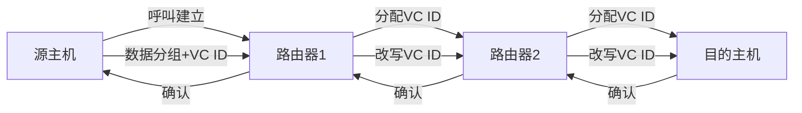

### 经典金句
> “虚电路网络提供网络层连接服务”
> “每个分组携带虚电路标识(VC ID)，而不是目的主机地址”

---

## 第5章：计算机网络结构
### 核心论点
问题：计算机网络由哪些部分组成？作者观点：网络分为边缘（主机、应用）、接入网络（有线/无线通信链路）和核心（互联的路由器）。网络核心的关键功能是路由与转发。

### 关键概念
- 网络边缘：主机（端系统）运行网络应用。
- 接入网络：将边缘接入核心网的方式（DSL、电缆、以太网、无线）。
- 网络核心：互联的路由器网络，实现数据交换。
- 客户/服务器模型：客户发送请求，服务器响应。
- 对等（P2P）模型：对等实体之间直接通信。

### 逻辑推演
提出计算机网络的三层结构：边缘、接入、核心。分别展开：边缘的主机分为客户/服务器和 P2P 两种应用模型；接入网络包括 DSL（利用电话线）、电缆网络（HFC）、以太网（机构接入）和无线接入（WiFi、蜂窝网）；网络核心完成路由与转发，解决“如何实现数据从源到目的”的问题，引出数据交换概念。

### 经典金句
> “网络核心的关键功能:路由+转发”
> “主机(端系统): 位于‘网络边缘’”

---

## 第6章：数据报网络
### 核心论点
问题：数据报网络如何工作？作者观点：数据报网络提供无连接服务，每个分组携带目的地址，路由器基于转发表独立选路，采用最长前缀匹配优先。Internet 采用数据报网络模型，ATM 采用虚电路网络。

### 关键概念
- 数据报网络：网络层无连接，每个分组独立转发。
- 转发表：根据目的地址前缀匹配输出接口。
- 最长前缀匹配优先：检索时选择匹配前缀最长的表项。
- 对比：Internet 选择数据报网络（简化网络，复杂边缘），ATM 选择虚电路网络（简化边缘，复杂网络）。

### 逻辑推演
先给出数据报网络的基本转发流程（携带目的地址，查表转发）。然后以具体转发表为例，演示如何根据目的地址范围选择接口。引入“最长前缀匹配优先”解决地址范围不完美的问题。最后对比数据报网络和虚电路网络的设计哲学：Internet 端系统智能，适合弹性服务；ATM 端系统哑，适合实时对话。

### 流程图（数据报转发）

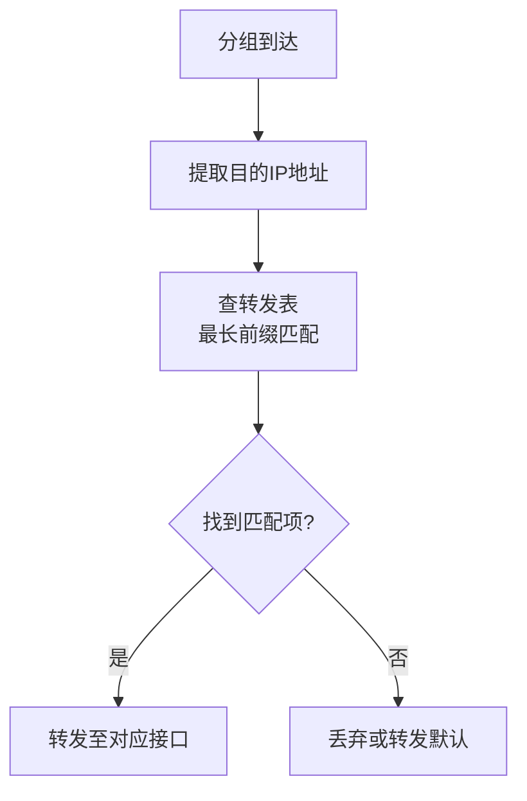

### 经典金句
> “最长前缀匹配优先”
> “Internet (数据报网络) …… 简化网络，复杂‘边缘’”

---

## 第7章：Internet 结构
### 核心论点
问题：Internet 的拓扑结构是怎样的？作者观点：Internet 是“网络之网络”，由接入 ISP、区域网络、一级 ISP 和内容提供商网络互连而成。经济和国家政策是主要驱动力，没有单一精确描述。

### 关键概念
- 接入 ISP：家庭、公司、大学等接入网络。
- 一级 ISP：提供国家或国际覆盖的商业 ISP（如 Sprint、AT&T）。
- 内容提供商网络：Google、Microsoft 等私有网络，连接数据中心并绕过一级 ISP。
- 网络之网络：通过 IXP（交换点）或直接连接实现 ISP 互连。

### 逻辑推演
首先提出端系统通过接入 ISP 连接 Internet，但接入 ISP 必须互连才能让任意两台主机通信。否定“所有接入 ISP 直接互连”和“全部连接到一个全球 ISP”的方案，因为商业竞争存在。然后逐步引入区域网络、一级 ISP 和内容提供商网络，说明 Internet 是由多级网络互连形成的分层结构。

### 经典金句
> “无人能给出精确描述”
> “内容提供商网络……通常绕过一级ISP和区域ISPs”

---

## 第8章：IP协议（1）- IP数据报
### 核心论点
问题：IPv4 数据报的首部有哪些字段及其作用？作者观点：IPv4 首部包含版本、首部长度、服务类型、总长度、标识、标志、片偏移、TTL、协议、首部校验和、源/目的 IP 地址、选项和填充字段。

### 关键概念
- 版本号：IPv4 或 IPv6。
- 首部长度：以 4 字节为单位，最小 5。
- 服务类型（TOS）/区分服务：指示期望的服务质量。
- 总长度：首部+数据，最大 65535 字节。
- TTL：生存时间，每跳减1，为0则丢弃。
- 协议：指示上层协议（6=TCP，17=UDP）。
- 首部校验和：仅校验首部，逐跳计算。

### 逻辑推演
逐字段解释 IPv4 首部格式。说明版本号区分 IP 版本；首部长度因选项可变；TOS 通常不用；总长度限制最大 IP 分组；TTL 防止循环；协议字段实现复用/分解；校验和只覆盖首部以提高效率；源/目的地址各 32 位；选项很少使用，填充用于 32 位对齐。

### 经典金句
> “首部校验和字段……逐跳计算、逐跳校验”
> “协议字段占8位：指示IP分组封装的是哪个协议的数据包”

---

## 第9章：IP协议（2）- IP分片
### 核心论点
问题：当 IP 分组长度超过链路 MTU 时如何处理？作者观点：路由器可以对 IP 分组进行分片，到达目的主机后再重组。分片使用标识、标志位（DF、MF）和片偏移字段。

### 关键概念
- MTU：链路层最大传输单元，不同链路 MTU 不同。
- 分片：将大 IP 分组分成多个较小的片。
- 标识：同一原始分组的各片标识相同。
- DF 标志：1 表示禁止分片，0 表示允许。
- MF 标志：1 表示后面还有片，0 表示最后一片。
- 片偏移：该片在原分组中的相对位置，以 8 字节为单位。

### 逻辑推演
先说明 MTU 的存在导致需要分片。然后介绍 IP 首部中用于分片和重组的三个字段：标识、标志位、片偏移。给出分片计算公式：每个最大片封装的数据为 floor((M-20)/8)*8，总片数 ceil((L-20)/d)。通过一个 4000 字节数据报在 MTU=1500 的链路上分片为例，演示计算结果（3 个片，偏移量 0、185、370 等）。

### 经典金句
> “大IP分组向较小MTU链路转发时，可以被‘分片’”
> “片偏移字段占13位……以8字节为单位”

---

## 第10章：IP协议（3）- IP编址
### 核心论点
问题：IP 地址如何标识主机/路由器的接口？作者观点：IPv4 地址是 32 位编号，与每个接口关联。IP 地址由网络号（NetID）和主机号（HostID）组成，具有相同网络号的接口属于同一个 IP 子网，子网不跨越路由器。

### 关键概念
- 接口：主机/路由器与物理链路的连接点。
- IP 地址：32 位，标识接口而非设备。
- 网络号（NetID）：高位比特，标识网络。
- 主机号（HostID）：低位比特，标识该网络内的特定接口。
- IP 子网：具有相同网络号且不跨越路由器的接口集合。

### 逻辑推演
从“源地址-从哪儿来，目的地址-到哪儿去”引入。说明 IP 地址与接口关联，路由器有多个接口，主机通常有一两个。然后提出 IP 地址的构成：网络号+主机号。定义子网：相同网络号且物理上可以不经过路由器互通的接口。最后用图示（文字描述）让读者练习数一数网络中有多少个子网。

### 经典金句
> “IP地址与每个接口关联”
> “IP子网: IP地址具有相同网络号的设备接口，不跨越路由器可以彼此物理联通”

---

## 第11章：IP协议（4）- 有类IP地址
### 核心论点
问题：传统的“有类”编址如何划分？作者观点：IPv4 地址分为 A、B、C、D、E 类，其中 A、B、C 类用于单播，网络号和主机号的长度固定。此外还有特殊 IP 地址（网络地址、广播地址、环回地址）和私有 IP 地址。

### 关键概念
- A 类：0 开头，8 位网络号，24 位主机号。
- B 类：10 开头，16 位网络号，16 位主机号。
- C 类：110 开头，24 位网络号，8 位主机号。
- D 类：1110 开头，多播地址。
- E 类：1111 开头，保留。
- 特殊地址：全 0（本机/默认路由）、全 1（广播）、127.x.x.x（环回）。
- 私有地址：10.0.0.0/8，172.16.0.0/12，192.168.0.0/16。

### 逻辑推演
展示有类编址的格式图。分别说明 A、B、C 类的网络号位数和范围。给出特殊 IP 地址的用途表格（源/目的地址可否使用、用途）。最后列出私有 IP 地址块，用于内部网络，不在公网路由。

### 经典金句
> “私有（Private）IP地址：10.0.0.0/8，172.16.0.0/12，192.168.0.0/16”
> “127.0.0.1 用于本地软件环回测试”

---

## 第12章：IP协议（5）- IP子网划分与子网掩码
### 核心论点
问题：如何将一个有类网络划分为更小的子网？作者观点：通过从主机号借用若干比特作为子网号（SubID），并使用子网掩码来标识网络号和子网号的长度。子网掩码与 IP 地址按位与运算得到子网地址。

### 关键概念
- 子网划分：将原有网络的主机号部分划分为子网号和主机号。
- 子网掩码：32 位，网络号和子网号位取 1，主机号位取 0。
- 默认子网掩码：A 类 255.0.0.0，B 类 255.255.0.0，C 类 255.255.255.0。
- 子网地址：IP 地址与子网掩码按位与的结果。

### 逻辑推演
首先回顾有类编址的不足，引出子网划分。展示 IP 地址的新结构：网络号 + 子网号 + 主机号。介绍子网掩码的概念，并给出示例（B 网借用 3 比特，掩码 255.255.224.0）。然后演示如何通过掩码计算子网地址和地址范围。最后以 C 类网络 201.2.3.0/24 划分为 8 个等长子网为例，列出每个子网的 SubID 二进制、HostID 取值范围和第 4 八位组范围。

### 经典金句
> “子网掩码：NetID、SubID位全取1，HostID位全取0”
> “将IP分组的目的IP地址与子网掩码按位与运算，提取子网地址”

---

## 第13章：IP协议（6）- CIDR与路由聚合
### 核心论点
问题：如何解决有类地址浪费并提高路由效率？作者观点：CIDR（无类域间路由）消除了传统 A、B、C 类界限，使用任意长度的网络前缀（a.b.c.d/x）。CIDR 支持路由聚合（构造超网），减少路由表项，采用最长前缀匹配优先。

### 关键概念
- CIDR：Classless InterDomain Routing，无类域间路由。
- 网络前缀：任意长度，替代 NetID+SubID。
- 超网：将多个子网聚合为一个较大的网络。
- 路由聚合：通过 CIDR 减少路由通告数量。
- 最长前缀匹配：选择匹配前缀最长的路由。

### 逻辑推演
指出 CIDR 消除有类地址界限，格式为 a.b.c.d/x。说明 CIDR 提高了 IPv4 地址分配效率，支持路由聚合（例如将多个连续子网聚合成一个超网）。通过图示展示层级编址如何使路由信息通告更高效。最后强调最长前缀匹配优先，并在聚合后仍能选择更具体的路由。

### 经典金句
> “CIDR: 消除传统的A类、B类和C类地址界限”
> “路由聚合 (route aggregation) …… 提高路由效率”

---

## 第14章：DHCP协议
### 核心论点
问题：主机如何动态获取 IP 地址及相关配置？作者观点：DHCP（动态主机配置协议）允许主机从服务器动态获取 IP 地址、子网掩码、默认网关、DNS 服务器等，即插即用，支持地址重用和续租。

### 关键概念
- DHCP：Dynamic Host Configuration Protocol。
- 即插即用：无需手工配置。
- 四步交互：Discover → Offer → Request → Ack。
- 广播通信：DHCP 报文封装在 UDP 中，使用 IP 广播和链路层广播。
- 地址租期：可续租。

### 逻辑推演
首先提问主机如何获得 IP 地址，回答可以静态配置或动态获取。介绍 DHCP 的好处（即插即用、地址重用、支持移动用户）。详细说明四步交互过程：客户端广播 Discover，一个或多个 DHCP 服务器响应 Offer，客户端选择并广播 Request，服务器确认 Ack。最后说明 DHCP 在应用层实现，报文封装到 UDP，使用 IP 广播（255.255.255.255）和链路层广播。

### 流程图（DHCP 交互）

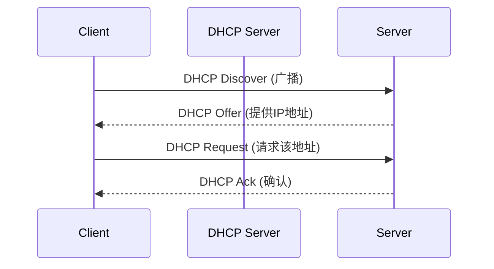

### 经典金句
> “动态主机配置协议-DHCP: 从服务器动态获取”
> “即插即用，允许地址重用，支持在用地址续租”

---

## 第15章：数据交换 - 电路交换
### 核心论点
问题：什么是电路交换？作者观点：电路交换是电话网络使用的交换方式，分为建立连接、通信、释放连接三个阶段，通信期间独占资源。通过多路复用（FDM、TDM 等）共享中继线。

### 关键概念
- 电路交换：建立电路后独占通信资源。
- 三个阶段：建立连接（呼叫）、通信、释放连接。
- 多路复用：将链路资源划分为多个“资源片”分配给各路呼叫。
- FDM：频分多路复用，按频率分割。
- TDM：时分多路复用，按时隙分割。

### 逻辑推演
从“为什么需要数据交换”引入，介绍数据交换的三种类型。聚焦电路交换，以电话网络为例说明其特点：呼叫建立后独占资源，即使无数据也占用。然后指出电路交换网络如何共享中继线——通过多路复用技术。为后续 FDM、TDM、WDM、CDM 做铺垫。

### 经典金句
> “电路交换的三个阶段：建立连接、通信、释放连接”
> “独占资源”

---

## 第16章：NAT
### 核心论点
问题：网络地址转换（NAT）解决什么问题？如何工作？作者观点：NAT 允许一个本地网络使用私有 IP 地址，通过一个公共 IP 地址（及端口号映射）访问外部网络。它缓解了 IPv4 地址耗尽问题，但违反了端到端原则，给 P2P 应用带来困难。

### 关键概念
- NAT：Network Address Translation。
- 私有地址：内部使用，对外不可见。
- NAT 转换表：记录 (内网IP, 内网端口) ↔ (公网IP, 新端口)。
- 端口映射：NAT 路由器替换源/目的 IP 和端口。
- 解决方案：静态配置 NAT、UPnP、中继（如 Skype）。

### 逻辑推演
列出 NAT 的动机：节省公网 IP 地址、隐藏内部网络、便于更换 ISP。展示 NAT 工作过程：外出数据报替换源 IP 和端口，记录映射；进入数据报反向替换。指出 16 位端口号支持 6 万多并发连接。讨论 NAT 的主要争议（违背端到端原则、影响 P2P）。最后给出三种允许外部访问内网服务器的方案：静态端口映射、UPnP 自动配置、中继服务器。

### 流程图（NAT 转换）

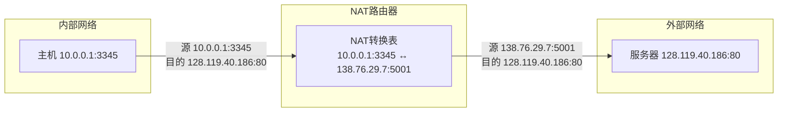

### 经典金句
> “只需/能从ISP申请一个IP地址”
> “违背端到端通信原则”

---

## 第17章：多路复用
### 核心论点
问题：链路/网络资源如何被多个通信共享？作者观点：多路复用（FDM、TDM、WDM、CDM）将资源划分为“资源片”，各用户独占分配到的资源进行通信。CDM 使用正交码片序列，允许所有用户同时使用相同频率。

### 关键概念
- 多路复用：共享链路资源。
- FDM：按频率分割，各用户占用不同频带。
- TDM：按时间分割，各用户占用周期性时隙。
- WDM：波分多路复用，用于光纤（不同波长）。
- CDM：码分多路复用，每个用户分配唯一码片序列，信号叠加后可用码片序列解码。

### 逻辑推演
先定义多路复用，说明资源片的概念。分别图示并解释 FDM、TDM、WDM。重点介绍 CDM：每个用户分配 m 比特码片序列（正交），发送比特 1 时发送原序列，发送 0 时发送反码。多个用户的信号叠加后，解码时计算内积即可恢复原始数据。给出码片序列正交的数学条件，以及编码/解码过程。

### 方法流程图（CDM 编解码）

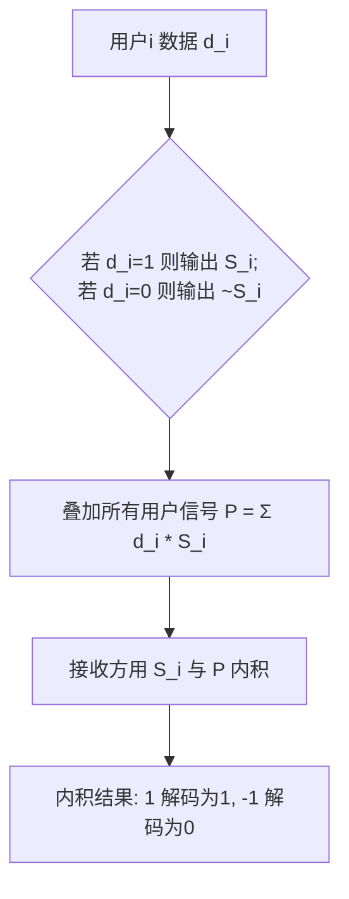

### 经典金句
> “码分多路复用……各用户使用相同频率载波，利用各自码片序列编码数据”
> “各用户码片序列相互正交”

---

## 第18章：ICMP协议
### 核心论点
问题：ICMP 协议的功能是什么？作者观点：ICMP（互联网控制报文协议）用于差错报告和网络探询。典型应用是 ping（回声请求/应答）和 traceroute（通过 TTL 超时报文探测路径）。

### 关键概念
- ICMP：Internet Control Message Protocol。
- 差错报告报文：目的不可达、源抑制、超时、参数问题、重定向。
- 网络探询报文：回声请求/应答、时间戳请求/应答。
- 不发送 ICMP 报文的特殊情况：对 ICMP 差错报文、分片非首片、多播报文、特殊地址等不发送。
- traceroute：利用 TTL 逐跳递增，收集超时报文和端口不可达报文。

### 逻辑推演
分类 ICMP 报文为差错报告和网络探询两类。列出常见类型和编码（如 0=回声应答，3=端口不可达，8=回声请求，11=TTL 超期）。说明几种不发送 ICMP 差错报文的情况。介绍 traceroute 工作原理：源主机发送 TTL=1,2,3... 的 UDP 数据报，每跳路由器返回 TTL 超时报文，最终目的主机返回端口不可达报文，从而记录路径和 RTT。

### 流程图（traceroute 原理）

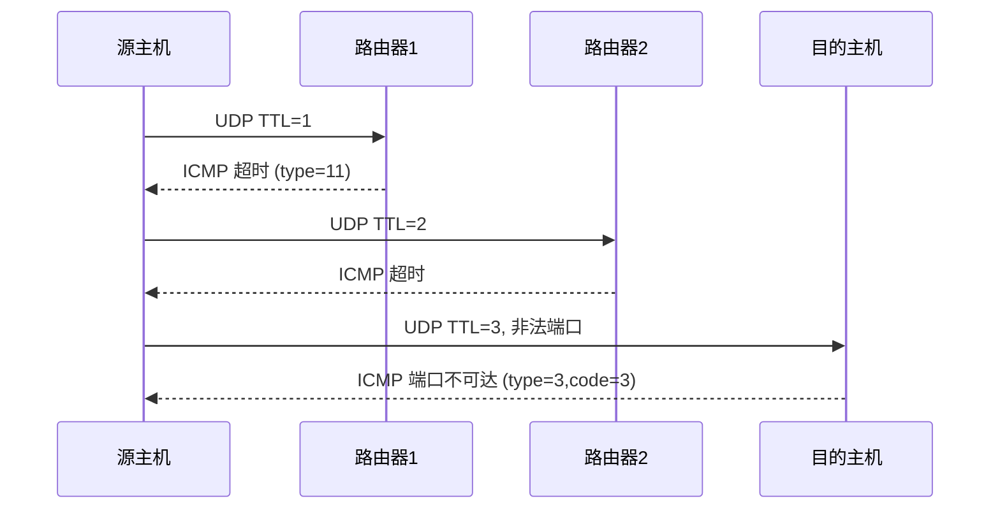

### 经典金句
> “traceroute 利用 TTL 超时报文和端口不可达报文探测路径”
> “对 ICMP 差错报告报文不再发送 ICMP 差错报告报文”

---

## 第19章：数据交换 - 报文交换、分组交换
### 核心论点
问题：报文交换和分组交换的区别是什么？作者观点：报文交换以完整报文进行存储-转发，分组交换将报文拆分为多个小分组独立存储-转发。分组交换具有更小的延迟、更好的资源利用率（统计多路复用），但需要拆分重组开销。

### 关键概念
- 报文交换：整个报文作为一个整体在节点间存储转发。
- 分组交换：报文拆分为多个分组，分组独立存储转发。
- 存储-转发：节点先完整接收再转发。
- 统计多路复用：分组按需共享链路，而非固定分配。
- 传输延迟：L/R（分组长度/链路带宽）。

### 逻辑推演
从存储-转发概念入手，指出报文交换和分组交换都采用该方式，区别在于交换单元大小。通过一个具体例子（M=7.5 Mbits，L=1500 bits，R=1.5 Mbps）计算报文交换和分组交换的交付时间。报文交换需要 5 秒（M/R），分组交换需要约 5.002 秒，但第一个分组到达时间更早。演示多跳情况下分组交换的总延迟公式：M/R + n*L/R。最后比较分组交换与电路交换：分组交换允许更多用户共享网络（统计多路复用），但可能产生拥塞。

### 经典金句
> “分组交换绝对优于电路交换？……适用于突发数据传输网络”
> “分组交换允许更多用户同时使用网络！——网络资源充分共享”

---

## 第20章：IPv6简介
### 核心论点
问题：为什么需要 IPv6？IPv6 的主要特点是什么？作者观点：IPv4 地址耗尽是最初动机。IPv6 使用 128 位地址，简化首部（固定 40 字节，不允许分片，无校验和），支持即插即用、安全、QoS。过渡采用隧道技术。

### 关键概念
- 地址长度：128 位（16 字节）。
- 首部格式：固定 40 字节，包含版本、流量类、流标签、载荷长度、下一个首部、跳限制、源/目的地址。
- 移除字段：首部校验和、分片相关字段。
- 地址表示：冒号十六进制，压缩零，IPv4 嵌入式。
- 地址类型：单播、多播、任意播。
- 过渡技术：隧道（IPv6 over IPv4）。

### 逻辑推演
指出 IPv6 动机：IPv4 地址耗尽、改进首部便于快速处理、支持 QoS。对比 IPv6 与 IPv4 首部差异（移除校验和、分片，增加流标签）。介绍 IPv6 地址的三种表示法（完整、压缩、IPv4 嵌入）。说明地址类型（单播、多播、任意播）。最后讨论过渡问题：不可能瞬间切换，采用隧道技术将 IPv6 数据报封装在 IPv4 中穿越 IPv4 网络。

### 流程图（IPv6 隧道）

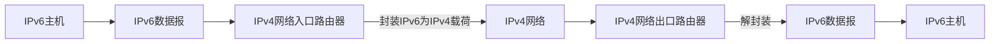

### 经典金句
> “32位IPv4地址空间已分配殆尽”
> “隧道(tunneling): IPv6数据报作为IPv4数据报的载荷进行封装”

---

## 第21章：计算机网络性能
### 核心论点
问题：如何衡量计算机网络性能？作者观点：主要性能指标包括速率、带宽、延迟（时延）、时延带宽积、丢包率、吞吐量。其中延迟分为处理、排队、传输、传播四种，排队延迟受流量强度影响。

### 关键概念
- 速率：数据率（b/s）。
- 带宽：数字信道最高数据率（b/s）。
- 延迟：分组从源到目的的时间。
  - 处理延迟：检错、查表（微秒级）。
  - 排队延迟：等待输出链路（可变）。
  - 传输延迟：L/R（分组长度/带宽）。
  - 传播延迟：d/s（距离/信号速度）。
- 流量强度：La/R，接近 1 时排队延迟剧增。
- 时延带宽积：传播延迟×带宽（比特为单位的链路长度）。
- 吞吐量：端到端数据传送速率，受瓶颈链路限制。

### 逻辑推演
先定义速率和带宽。通过排队现象引出四种延迟，用车队类比区别传输延迟和传播延迟。给出排队延迟与流量强度的关系图。介绍时延带宽积（衡量链路能容纳的比特数）。丢包率是拥塞的体现。最后定义吞吐量，并通过多连接共享瓶颈链路说明端到端吞吐量取决于最小链路带宽和公平共享。

### 经典金句
> “排队延迟取决于路由器拥塞程度，流量强度 La/R → 1 时平均排队延迟很大”
> “端到端吞吐量 = min(R_c, R_s, R/10)”

---

## 第22章：计算机网络体系结构
### 核心论点
问题：为什么需要网络体系结构？分层有什么好处？作者观点：计算机网络采用分层结构，每层完成特定功能，通过协议与对等层通信，通过接口向上层提供服务。分层有利于复杂系统管理、更新维护和标准化。

### 关键概念
- 分层结构：将复杂系统分解为若干层次。
- 实体：任何可发送/接收信息的硬件或软件进程。
- 协议：对等实体间通信的规则（水平）。
- 服务：下层向上层提供的功能（垂直）。
- 服务访问点（SAP）：层间接口。
- 体系结构：分层及其协议的集合（抽象）。

### 逻辑推演
以航空旅行类比说明分层思想。指出网络体系结构的定义：功能上分层，每层遵循协议。总结分层优点（清晰、模块化、易维护、标准化）和可能缺点（效率降低、层间依赖）。解释实体、协议、服务、SAP 等基本概念，并强调协议是“水平的”，服务是“垂直的”。

### 经典金句
> “协议是‘水平的’，服务是‘垂直的’”
> “体系结构是抽象的”

---

## 第23章：路由算法
### 核心论点
问题：路由算法的分类及目标是什么？作者观点：路由算法找到最小费用路径。分为静态 vs 动态、全局（链路状态） vs 分散（距离向量）。链路状态算法需要全网拓扑，距离向量算法仅与邻居交换信息。

### 关键概念
- 图抽象：路由器为结点，链路为边，费用为权值。
- 最小费用路径：路由算法的目标。
- 静态路由：手工配置，更新慢。
- 动态路由：自动更新，响应拓扑变化。
- 全局信息：所有路由器掌握完整拓扑（链路状态）。
- 分散信息：路由器仅知邻居信息（距离向量）。

### 逻辑推演
首先用图模型抽象网络。定义路径费用为链路费用之和。然后分类路由算法：静态/动态，全局/分散。指出链路状态算法（如 OSPF）需要广播链路状态，距离向量算法（如 RIP）通过迭代交换距离估计。为后续具体算法铺垫。

### 经典金句
> “路由算法: 寻找最小费用路径的算法”
> “链路状态(LS)路由算法……距离向量(DV)路由算法”

---

## 第24章：OSI 与 Internet 参考模型
### 核心论点
问题：OSI 七层模型和 Internet 五层模型分别是什么？作者观点：OSI 是理论模型（7层），市场失败但教育价值高；TCP/IP 模型（4层或5层）是事实标准。每层有特定功能，通过数据封装增加控制信息。

### 关键概念
- OSI 七层：物理层、数据链路层、网络层、传输层、会话层、表示层、应用层。
- 物理层：比特传输、接口特性、编码、同步。
- 数据链路层：帧、物理寻址、流量控制、差错控制、访问控制。
- 网络层：分组交付、逻辑寻址、路由。
- 传输层：端到端报文传输、分段重组、SAP 寻址（端口）。
- 会话层：对话控制、同步（最薄一层）。
- 表示层：数据表示转化、加密、压缩。
- 应用层：用户接口（HTTP、FTP、SMTP）。
- 数据封装：每层增加 PDU 头部（可能尾部）。

### 逻辑推演
介绍 OSI 模型的 7 层及每层功能。以主机 A 到主机 B 的通信为例，解释数据封装过程。然后给出 TCP/IP 模型的 4 层（网络接口层、互联网层、传输层、应用层）或 5 层（将网络接口层拆分为链路层和物理层）。最后总结 5 层模型的数据封装顺序。

### 流程图（OSI 数据封装）

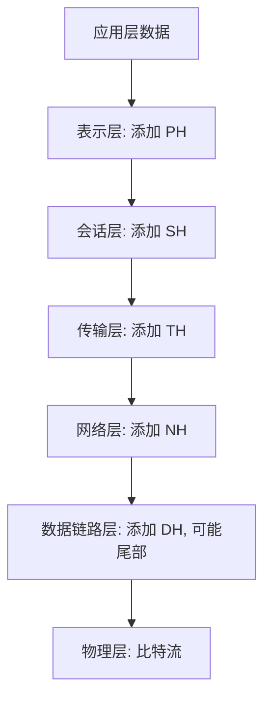

### 经典金句
> “OSI 参考模型……理论成功，市场失败”
> “5层模型：物理层、链路层、网络层、传输层、应用层”

---

## 第25章：链路状态路由算法
### 核心论点
问题：链路状态路由算法（如 Dijkstra）如何工作？作者观点：每个路由器通过链路状态广播获得完整拓扑，使用 Dijkstra 算法计算到所有结点的最短路径，生成转发表。算法复杂度 O(n²)，可能出现震荡。

### 关键概念
- 链路状态广播：每个路由器向全网发送其邻居信息。
- Dijkstra 算法：迭代计算从源到所有结点的最短路径。
- 符号：c(x,y) 链路费用，D(v) 当前路径费用，p(v) 前驱结点，N' 已确定结点集。
- 震荡：链路费用依赖流量时，路由变化可能导致不稳定。

### 逻辑推演
给出 Dijkstra 算法的伪代码（初始化 N'={u}，对每个 v 设 D(v)=c(u,v)；Loop 找出不在 N' 中最小 D(w) 的 w，加入 N'，更新 w 的邻居）。以图例演示算法步骤（u 到各结点的最短路径计算）。最后说明算法复杂性 O(n²) 和可能的震荡问题（链路费用随负载变化，导致路由反复改变）。

### 经典金句
> “链路状态路由算法……所有结点掌握网络拓扑和链路费用”
> “存在震荡(oscillations)可能……链路费用是该链路承载的通信量”

---

## 第26章：距离向量路由算法
### 核心论点
问题：距离向量路由算法（Bellman-Ford）如何工作？有什么问题？作者观点：每个结点维护到所有目的的距离估计，与邻居交换距离向量，迭代更新。该算法具有分布式、异步特点，但存在“无穷计数”问题，可通过毒性逆转和定义最大度量缓解。

### 关键概念
- Bellman-Ford 方程：d_x(y) = min_v { c(x,v) + d_v(y) }。
- 距离向量：D_x = [D_x(y) for y in N]。
- 异步迭代：链路费用变化或收到邻居 DV 时触发更新。
- 好消息传播快，坏消息传播慢。
- 无穷计数：链路费用增加时，收敛慢，可能计数到无穷。
- 毒性逆转：若 Z 经过 Y 到达 X，则 Z 向 Y 通告 D_z(X)=∞。
- 最大度量：RIP 中 16 跳表示无穷。

### 逻辑推演
从 Bellman-Ford 方程出发，说明距离向量算法的理论基础。描述每个结点维护距离向量，周期性地向邻居发送自己的 DV，收到邻居 DV 后更新。给出一个具体计算例子。然后指出“好消息传播快”，但坏消息（链路费用增加）会导致无穷计数问题，通过图示展示。最后介绍两种解决方案：毒性逆转（告诉邻居不要通过我）和定义最大度量（如 15 跳为最大，16 跳为无穷）。

### 经典金句
> “好消息传播快! 坏消息会怎么样呢? …… 无穷计数问题”
> “毒性逆转……通告给该邻居结点到达该目的的距离为无穷大”

---

## 第27章：层次路由
### 核心论点
问题：为什么需要层次路由？如何实现？作者观点：大规模网络中，扁平路由不可行（路由表巨大、更新流量大）。将路由器划分为自治系统（AS），AS 内部运行内部网关协议（IGP），AS 之间运行外部网关协议（EGP）。层次路由支持管理自治和路由聚合。

### 关键概念
- 扁平路由问题：6 亿目的结点的路由表无法存储，更新流量巨大。
- 自治系统（AS）：同一管理域内的路由器集合。
- 内部网关协议（IGP）：AS 内部路由协议（RIP、OSPF）。
- 外部网关协议（EGP）：AS 间路由协议（BGP）。
- 网关路由器：连接其他 AS 的边缘路由器。
- 热土豆路由：将分组发送给最近的网关路由器。

### 逻辑推演
首先指出扁平路由在大规模网络中不可行（路由表规模、更新开销、管理自治需求）。引入 AS 概念，每个 AS 运行自己的 IGP。AS 之间通过网关路由器互连，运行 EGP（如 BGP）。通过图示说明 AS 内部和外部路由如何协同构建转发表：内部路由负责 AS 内部目的，外部路由通过 AS 间协议学习外部网络可达性，并选择网关（如热土豆路由）。最后以具体例子演示路由器 1d 如何设置去往外部子网 x 的转发表项。

### 经典金句
> “层次路由……聚合路由器为一个区域：自治系统AS”
> “热土豆路由：将分组发送给最近的网关路由器”

---

## 第28章：RIP协议
### 核心论点
问题：RIP 协议的工作原理和特点是什么？作者观点：RIP 是一种基于距离向量的 AS 内部路由协议，以跳步数（最大 15）为度量，每 30 秒与邻居交换路由表。RIP 使用毒性逆转和最大跳步数限制来缓解无穷计数问题，其实现是一个应用层进程（route-d），通过 UDP 通信。

### 关键概念
- RIP：Routing Information Protocol。
- 度量：跳步数（每链路 1 跳，最大 15 跳，16 跳不可达）。
- 通告：每 30 秒邻居交换一次 DV，最多 25 个目的子网。
- 失效检测：180 秒未收到通告则邻居/链路失效。
- 路由表：使用 route-d 守护进程管理，通过 UDP 发送通告。

### 逻辑推演
介绍 RIP 的历史和基本特点（距离向量，跳步数）。展示路由表的格式（目的子网、下一跳、跳数）。说明失效检测机制（180 秒超时）和重新计算路由的流程。指出无穷计数问题的缓解方法：最大 15 跳（16 跳无穷）和毒性逆转。最后说明 RIP 的实现是在应用层（route-d 进程），通过 UDP 发送通告报文。

### 经典金句
> “RIP……距离度量：跳步数 (max = 15 hops)”
> “RIP路由表是利用一个称作route-d的进程进行管理……通过UDP数据报发送”

---

## 第29章：OSPF协议
### 核心论点
问题：OSPF 协议的特点和优势是什么？作者观点：OSPF 是基于链路状态的 AS 内部路由协议，公开可用（开放）。支持安全认证、多条等费用路径、不同 TOS 的不同度量、多播路由以及分层结构（区域和主干）。

### 关键概念
- OSPF：Open Shortest Path First。
- 链路状态路由：每个路由器构造完整 AS 拓扑，用 Dijkstra 计算路由。
- 分层 OSPF：划分为区域（Area）和主干（Backbone）。区域内部链路状态通告仅限于区内，主干负责区域间路由。
- 路由器类型：内部路由器、区域边界路由器、主干路由器、AS 边界路由器。

### 逻辑推演
首先指出 OSPF 是链路状态协议，开放可用。列举其高级特性：认证、等费用多路径、TOS 相关度量、集成多播（MOSPF）。重点介绍分层 OSPF 的设计：将 AS 分成多个区域，区域内部维护详细拓扑，区域间通过主干区域交换汇总路由。图示说明区域边界路由器、主干路由器等角色，以及 LSA（链路状态通告）的传播范围限制。

### 经典金句
> “OSPF……采用链路状态路由算法”
> “OSPF支持对大规模AS分层(hierarchical)”

---

## 第30章：BGP协议
### 核心论点
问题：BGP 如何实现 AS 之间的路由？作者观点：BGP 是事实上的域间路由协议，将 Internet“粘合”为一个整体。BGP 使用 eBGP 在 AS 之间交换前缀可达性信息，使用 iBGP 在 AS 内部传播。BGP 基于策略（而非最短路径）选择路由，重要属性包括 AS-PATH 和 NEXT-HOP。

### 关键概念
- BGP：Border Gateway Protocol。
- eBGP：从邻居 AS 获取子网可达性信息。
- iBGP：向 AS 内部路由器传播可达性信息。
- 路径向量协议：通告前缀时携带经过的 AS 序列（AS-PATH）。
- NEXT-HOP：指向下一跳 AS 的路由器接口。
- 路由选择准则：本地偏好、最短 AS-PATH、最近 NEXT-HOP（热土豆）、附加准则。

### 逻辑推演
先说明 BGP 的关键作用（粘合 Internet）。介绍 BGP 会话基于半永久 TCP 连接，报文类型有 OPEN、UPDATE、KEEPALIVE、NOTIFICATION。通过图示（AS3 向 AS1 通告前缀）说明 eBGP 和 iBGP 的协作过程。引出路径属性和路由（前缀+属性），重点解释 AS-PATH（防环、选路）和 NEXT-HOP。最后给出网关路由器接收路由后的输入策略和路由选择准则。

### 流程图（BGP 路由传播）

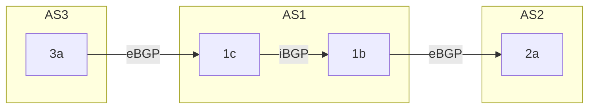

### 经典金句
> “BGP……将Internet‘粘合’为一个整体的关键”
> “基于策略 (policy-based) 路由”

---

## 第31章：Socket 编程基础
### 核心论点
问题：什么是 Socket 编程？作者观点：Socket 是应用编程接口（API），允许应用进程通过操作系统控制网络通信。Socket 接口源于 Berkeley UNIX，现已成为工业标准。它提供类似于文件的抽象，使用套接字描述符标识。

### 关键概念
- API：应用编程接口，连接应用进程和操作系统网络功能。
- Socket（套接字）：网络应用编程接口，支持 TCP/IP。
- 套接字描述符：小整数，操作系统返回的标识符。
- 端点地址：IP 地址 + 端口号。
- 结构 sockaddr_in：存储地址族、端口号、IP 地址。
- 客户/服务器模型：Socket 编程的主要通信模型。

### 逻辑推演
先从应用层需要访问网络服务引出 API 概念。介绍历史：Berkeley Socket、Winsock、TLI。说明 Socket 已成为事实上的工业标准，支持客户/服务器模型。解释套接字的抽象机制：类似于文件，创建时返回描述符，操作系统维护相关数据结构。最后给出存储端点地址的结构体 sockaddr_in 的定义。

### 经典金句
> “应用编程接口API: 应用进程的控制权和操作系统的控制权进行转换的一个系统调用接口”
> “套接字描述符（socket descriptor）- 小整数”

---

## 第32章：Socket API 函数（1）
### 核心论点
问题：Socket 编程有哪些基本函数？作者观点：主要函数包括 WSAStartup/WSACleanup（Windows 初始化）、socket（创建套接字）、bind（绑定本地地址）、listen（监听）、accept（接受连接）、connect（连接服务器）、send/sendto、recv/recvfrom、closesocket 等。TCP 使用流套接字（SOCK_STREAM），UDP 使用数据报套接字（SOCK_DGRAM）。

### 关键概念
- WSAStartup/WSACleanup：仅 Windows，初始化和释放 Winsock DLL。
- socket：创建套接字，指定协议族（PF_INET）、类型（SOCK_STREAM/SOCK_DGRAM）、协议。
- bind：绑定本地 IP 地址和端口号（服务器必需，客户端可选）。
- listen：将 TCP 套接字设为被动监听，设置连接请求队列大小。
- accept：从完成队列取出连接，创建新套接字用于通信。
- connect：客户端主动连接服务器（TCP）或指定对端地址（UDP）。
- send/sendto、recv/recvfrom：发送/接收数据，TCP 用 send/recv，UDP 用 sendto/recvfrom 或已连接的 UDP 用 send/recv。
- closesocket：关闭套接字，引用计数减至 0 时真正关闭。

### 逻辑推演
按照 Winsock 初始化 → 创建套接字 → 绑定（服务器）→ 监听/接受（TCP 服务器）或 connect（客户端）→ 数据传输 → 关闭的顺序介绍函数。区分 TCP 与 UDP 的不同：TCP 需要 listen/accept/connect 建立连接，UDP 不需要。说明 bind 函数对服务器的重要性（绑定熟知端口）。最后给出每个函数的参数和返回值含义。

### 经典金句
> “客户程序一般不必调用bind函数”
> “服务器应该绑定哪个地址？……地址通配符：INADDR_ANY”

---

## 第33章：Socket API 函数（2）
### 核心论点
问题：Socket API 中还包含哪些辅助函数和注意事项？作者观点：包括获取主机信息（gethostbyname）、服务信息（getservbyname）、协议信息（getprotobyname），以及字节顺序转换函数（htons、ntohs 等）。网络字节顺序是大端序，需要与主机字节顺序转换。

### 关键概念
- gethostbyname：域名 → IP 地址（返回 hostent 结构）。
- inet_addr：点分十进制 IP → 32 位二进制 IP。
- getservbyname：服务名（如 “http”） → 端口号（返回 servent 结构）。
- getprotobyname：协议名（如 “tcp”） → 协议号（返回 protoent 结构）。
- 网络字节顺序：TCP/IP 协议头使用大端序。
- htons/htonl：主机字节顺序 → 网络字节顺序（16/32 位）。
- ntohs/ntohl：网络字节顺序 → 主机字节顺序。

### 逻辑推演
首先说明客户端需要解析服务器 IP 地址（域名或点分十进制）和端口号（服务名）。演示 gethostbyname 的使用和 hostent 结构。说明 getservbyname 和 getprotobyname 的用途。然后强调字节顺序问题：网络字节顺序（大端）与主机字节顺序可能不同，需要转换函数。最后总结客户端编程的六步流程和服务器端编程流程。

### 经典金句
> “TCP/IP定义了标准的用于协议头中的二进制整数表示：网络字节顺序”
> “函数 gethostbyname() 实现域名到32位IP地址转换”

---

## 第34章：Socket 编程 - 客户端实现
### 核心论点
问题：如何封装一个通用的客户端连接函数？作者观点：通过 connectsock 函数封装 socket 创建、地址解析和 connect 调用，支持 TCP 和 UDP。高层函数 connectTCP 和 connectUDP 调用 connectsock 简化代码。客户端异常处理使用 errexit 函数。

### 关键概念
- connectsock：通用函数，参数为 host（主机名或 IP）、service（服务名或端口）、transport（“tcp” 或 “udp”）。内部调用 gethostbyname/inet_addr、getservbyname/atoi、getprotobyname，然后创建 socket 并 connect。
- connectTCP：调用 connectsock(host, service, “tcp”)。
- connectUDP：调用 connectsock(host, service, “udp”)。
- errexit：打印错误信息并退出，调用 WSACleanup。
- DAYTIME 服务：TCP 端口 13，UDP 端口 13，返回日期和时间。

### 逻辑推演
给出 connectsock 的完整实现代码，包括：清空 sockaddr_in、服务名转端口（若为数字直接转换）、主机名转 IP（若点分十进制则直接转换）、协议名转协议号、根据 transport 选择 SOCK_STREAM 或 SOCK_DGRAM、创建套接字、调用 connect（对 UDP 也可用，记录对端地址）。然后给出 connectTCP 和 connectUDP 的简单包装。最后以 DAYTIME 客户端为例（TCP 和 UDP 版本），演示如何使用这些封装函数：连接后 recv 数据并打印。

### 经典金句
> “设计一个connectscok过程封装底层代码”
> “DAYTIME服务……获取日期和时间，端口号13”

---

## 第35章：Socket 编程 - 服务器实现
### 核心论点
问题：如何设计不同类型的服务器？作者观点：服务器分为循环无连接、循环面向连接、并发无连接、并发面向连接四种模式。通过 passivesock 函数封装服务器端套接字的创建、绑定和监听。高层函数 passiveUDP 和 passiveTCP 分别用于 UDP 和 TCP 服务器。

### 关键概念
- 循环无连接服务器：创建 UDP 套接字，绑定，循环 recvfrom/sendto。
- 循环面向连接服务器：创建 TCP 套接字，绑定，listen，循环 accept 并服务（顺序处理，无法并发）。
- 并发无连接服务器：主线程 recvfrom，每个请求创建新线程处理 sendto。
- 并发面向连接服务器：主线程 accept，每个连接创建新线程处理通信。
- passivesock：创建套接字，绑定 INADDR_ANY 和指定服务端口，若为 TCP 则 listen。
- passiveUDP/passiveTCP：调用 passivesock 并传递 "udp" 或 "tcp"。

### 逻辑推演
先介绍四种服务器模式的流程，用步骤列表说明。然后给出 passivesock 的实现（类似 connectsock 但调用 bind 和 listen）。passiveUDP 和 passiveTCP 是简单包装。最后以 DAYTIME 服务器为例：UDP 版本使用循环无连接（recvfrom 后 sendto 时间）；TCP 版本使用并发面向连接（主线程 accept，子线程 send 时间后关闭）。展示完整代码。

### 流程图（并发 TCP 服务器）

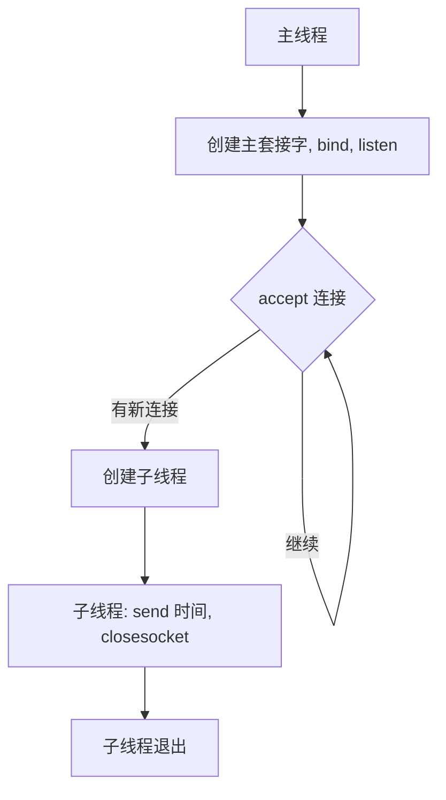

### 经典金句
> “循环无连接服务器……反复接收来自客户端的请求”
> “并发面向连接服务器……主线程反复 accept，创建新子线程处理该客户”

---

## 第36章：网络安全现状
### 核心论点
问题：当前网络安全形势如何？作者观点：总体平稳但形势严峻。基础网络存在漏洞，云服务成为攻击重点，域名系统面临严重 DDoS 攻击，工业互联网也受到威胁。移动恶意程序快速增长，数据泄露高发。

### 关键概念
- 数据来源：2014 年中国互联网网络安全报告。
- 关键数据：网站总量 364.7 万，网民 6.49 亿。
- 主要威胁：路由器/交换机漏洞、域名系统 DDoS、Havex 木马（工业控制）、分布式反射型拒绝服务、心脏出血/破壳漏洞、移动恶意程序（恶意扣费、资费消耗、隐私窃取）。
- 木马与僵尸网络：控制服务器 IP 10.4 万，受控主机 1399 万。
- 网站安全：被篡改网站 3.7 万个，植入后门 4 万个，仿冒页面 9.9 万个。
- 漏洞：应用程序漏洞占 68.5%，Web 应用 16.1%，网络设备 6.0%。

### 逻辑推演
先给出 2014 年我国互联网基本状况。然后从多个角度说明严峻形势：基础网络漏洞、云服务攻击、域名系统 DDoS、工业互联网渗透、移动恶意程序、数据泄露、网页仿冒、钓鱼等。用具体数据（如木马控制服务器数量变化、移动恶意程序样本增长 35.3%）佐证。最后总结：“网络，安全？不！不十分安全！目标：网络，安全！”

### 经典金句
> “分布式反射型攻击逐渐成为拒绝服务攻击的重要形式”
> “网络，安全？……目标：网络，安全！”

---

## 第37章：网络安全基本概念
### 核心论点
问题：网络安全的定义和基本属性是什么？作者观点：网络安全是指网络系统的硬件、软件和数据受到保护，不因偶然或恶意原因被破坏、更改、泄露，系统连续可靠运行。基本属性包括机密性、身份认证、信息完整性、可访问与可用性。网络安全具有相对性、时效性、相关性、不确定性、复杂性、重要性。

### 关键概念
- 机密性：只有发送方和预定接收方能理解报文内容（加密）。
- 身份认证：确认彼此的真实身份。
- 信息完整性：确保信息未被篡改，篡改可被检测。
- 可访问与可用性：网络服务对被授权用户可访问。
- 网络安全的特点：相对（无绝对安全）、时效（新漏洞不断）、相关（新组件引入风险）、不确定（攻击不可预测）、复杂（系统工程）、重要（关系国家/企业/个人）。
- 研究领域：攻击、防护、免疫设计。

### 逻辑推演
首先给出网络安全的定义。然后解释四个基本属性，并举例（加密保证机密性，数字签名保证完整性等）。阐述网络安全的六大特点，强调只有相对安全。最后指出 Internet 最初设计未考虑安全，协议设计者扮演“追赶者”角色，安全需要在网络各层次考虑。

### 经典金句
> “只有相对的安全，没有绝对的安全”
> “Internet最初设计几乎没考虑安全性”

---

## 第38章：网络安全拟人模型
### 核心论点
问题：网络安全中常用的拟人化模型是什么？作者观点：Alice 和 Bob 是期望安全通信的合法用户，Trudy 是入侵者（试图拦截、删除、篡改信息）。该模型用于描述攻击场景和防护方案。

### 关键概念
- Alice & Bob：安全通信的双方。
- Trudy：入侵者，主动或被动攻击。
- 恶意软件：病毒、蠕虫、间谍软件。
- 僵尸网络：被感染主机组成，用于发送垃圾邮件、DDoS。

### 逻辑推演
介绍拟人场景（情侣通信，Trudy 破坏）。说明 Bob 和 Alice 可以是 Web 浏览器/服务器、网络银行、DNS 服务器、路由器等。说明 Trudy 对应的真实世界 Bad Guys，通过恶意软件感染主机，组建僵尸网络发起攻击。

### 经典金句
> “Bob与Alice是期望进行安全通信的情侣，Trudy是企图破坏通信的入侵者”
> “被感染主机可能加入僵尸网络（botnet），用于发送垃圾邮件、DDoS攻击等”

---

## 第39章：网络安全威胁（1）
### 核心论点
问题：网络攻击者可以实施哪些类型的威胁？作者观点：威胁包括窃听、插入、假冒、劫持、拒绝服务（DoS）。攻击前常进行映射（ping 扫描、端口扫描），并可采用分组嗅探、IP 欺骗等技术。

### 关键概念
- 窃听：被动监听信息。
- 插入：主动在连接中插入信息。
- 假冒：伪造源地址或其他字段。
- 劫持：接管连接（移除/取代一方）。
- 拒绝服务（DoS）：过载资源阻止服务。
- 映射：使用 ping、端口扫描（如 nmap）发现服务。
- 分组嗅探：在广播介质上捕获所有分组（如 Wireshark）。
- IP 欺骗：伪造源 IP 地址。

### 逻辑推演
分类威胁类型并举例。然后详细介绍映射、嗅探和欺骗三种具体技术：映射是攻击前侦察（ping 扫 IP，端口扫描）；嗅探利用共享介质（对策：主机监测混杂模式、交换以太网）；欺骗可直接设置 IP 源地址，接收方难以判断真假。最后简要提及对策（记录流量、分析可疑活动）。

### 经典金句
> “分组‘嗅探’……可以读到所有未加密数据(e.g., 包括口令!)”
> “IP欺骗……接收方无法判断源地址是否被欺骗”

---

## 后记
本课程讲义系统覆盖了计算机网络的主要知识点，从基础概念、性能指标、交换技术，到网络层协议（IP、ICMP、DHCP、NAT、IPv6）、路由算法（RIP、OSPF、BGP）、传输层 Socket 编程，以及网络安全概述。内容结构清晰，配有大量例题和代码示例，适合作为计算机网络课程的复习资料。

> 说明：部分讲义中的图像（如网络拓扑图、时序图）由于 OCR 提取不完整，本文档已用 Mermaid 流程图或文字描述替代其逻辑。原始幻灯片中可能包含更多视觉细节，但核心内容均已保留。

# 《计算机网络课程讲义》章节总结（续）

## 说明
本部分接续前文，继续整理后续章节。原始讲义为幻灯片形式，内容涵盖链路层、无线网络、网络安全、密码学、IPSec、防火墙等。以下按文件编号顺序逐章总结。

---

## 第40章：以太网交换机（1）
### 核心论点
问题：以太网交换机如何工作？作者观点：交换机是链路层存储-转发设备，透明、即插即用、自学习。它通过自学习建立交换表（MAC地址-接口映射），选择性转发帧，隔离冲突域。

### 关键概念
- 交换机：链路层设备，存储-转发以太网帧。
- 透明：主机感知不到交换机存在。
- 自学习：从帧的源MAC地址学习到到达主机的接口信息。
- 交换表：记录（MAC地址，接口，时间戳）。
- 泛洪：目的MAC未知时，向除接收接口外的所有接口转发。

### 逻辑推演
首先定义交换机的基本属性（透明、即插即用）。说明交换机支持多端口同时传输，每段链路独立冲突域，可全双工。然后引出问题：交换机如何知道目的主机的位置？答案是通过自学习：收到帧时记录源MAC地址和接口，形成交换表。最后给出帧过滤/转发的决策流程：若目的MAC在表中且与入接口相同则丢弃；若在不同接口则转发；若不在表中则泛洪。

### 流程图（交换机转发决策）
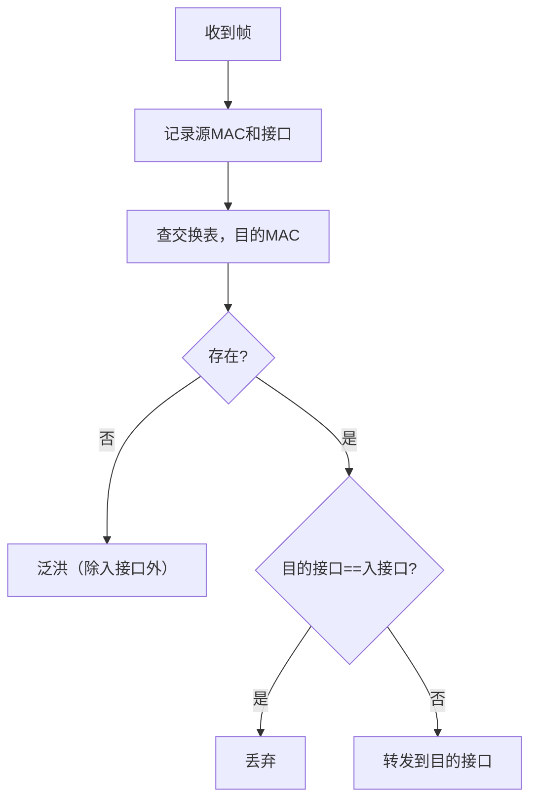

### 经典金句
> “交换机通过自学习，获知到达主机的接口信息”
> “交换机是链路层设备……利用CSMA/CD访问链路，发送帧”

---

## 第41章：以太网交换机（2）
### 核心论点
问题：交换机如何互联以及和路由器有什么区别？作者观点：交换机可以互联扩展网络，自学习机制同样适用于互联场景。路由器是网络层设备，使用IP地址和路由算法；交换机是链路层设备，使用MAC地址和自学习。

### 关键概念
- 交换机互联：多台交换机可以级联，自学习过程与单台相同。
- 路由器：网络层设备，检测IP分组首部，基于路由协议构建转发表。
- 交换机：链路层设备，检测帧首部，基于自学习构建交换表。
- 集线器（hub）：物理层设备，不隔离冲突域和广播域。
- 网桥（bridge）：链路层设备，类似交换机。

### 逻辑推演
通过图示说明交换机可以互联，并提问当A向G发送帧时，S1和S4如何知道转发路径？答案仍然是自学习。然后举例C向H发送帧的过程，要求读者分析交换表变化。最后对比交换机和路由器：两者都是存储-转发，但层次不同（链路层 vs 网络层），转发表构建方式不同（自学习 vs 路由算法），地址依据不同（MAC vs IP）。给出设备对比表格。

### 经典金句
> “路由器：网络层设备，交换机：链路层设备”
> “交换机：自学习、泛洪构建转发表，依据MAC地址”

---

## 第42章：虚拟局域网（VLAN）
### 核心论点
问题：如何解决单一广播域带来的安全和效率问题？作者观点：VLAN在物理LAN上划分多个逻辑局域网，实现流量隔离、广播域分割。支持基于端口的VLAN，跨交换机时使用802.1Q中继端口。

### 关键概念
- VLAN：虚拟局域网，物理上共用一个交换机，逻辑上独立。
- 基于端口的VLAN：交换机管理软件将端口分组，每组构成一个独立VLAN。
- 流量隔离：不同VLAN的帧不互相转发。
- 中继端口（trunk port）：连接多个交换机，承载多个VLAN的帧，需要VLAN ID标识。
- 802.1Q：在以太网帧中插入VLAN标签的协议。

### 逻辑推演
提出场景：CS用户迁移到EE但仍想连接CS交换机，广播域过大导致安全/效率问题。引入VLAN概念，通过图示说明一台物理交换机可以划分为多个虚拟交换机（如EE VLAN端口1-8，CS VLAN端口9-16）。VLAN间转发需要通过路由器（或三层交换机）。跨交换机时使用中继端口和802.1Q帧格式（增加标签字段）。

### 经典金句
> “虚拟局域网……在一个物理LAN架构上配置、定义多个VLAN”
> “中继端口……为多VLAN转发802.1帧”

---

## 第43章：PPP协议
### 核心论点
问题：点对点链路如何控制数据传输？作者观点：PPP协议用于点对点链路（如拨号），提供组帧、透明传输、差错检测、网络层地址协商等功能，但不提供差错纠正和流量控制。

### 关键概念
- PPP：点对点协议，用于拨号、ISDN等。
- 组帧：标志字段（01111110）定界。
- 字节填充：数据中出现标志字节时插入转义字符（01111101）以保证透明传输。
- 协议字段：指示上层协议（如LCP、IP、IPCP）。
- LCP：链路控制协议，用于建立、配置和测试链路。
- IPCP：IP控制协议，用于配置IP地址。

### 逻辑推演
先描述点对点链路的特点（无MAC寻址、无需介质访问控制）。列出PPP应提供的功能：组帧、透明传输、差错检测、连接活性检测、网络层地址协商。强调PPP不做差错纠正/恢复、流量控制（由高层负责）。给出PPP帧格式（标志、地址、控制、协议、信息、校验）。重点介绍字节填充机制。最后说明PPP链路建立需要配置链路参数（LCP）和网络层参数（如IPCP）。

### 经典金句
> “PPP……数据域必须支持承载任何比特模式（比特透明传输）”
> “字节填充……发送端在数据中的01111110和01111101前添加额外的字节01111101”

---

## 第44章：802.11无线局域网（1）
### 核心论点
问题：802.11无线局域网的特点和工作模式是什么？作者观点：802.11标准家族（b/a/g/n）使用CSMA/CA多路访问控制，支持基础设施模式和自组网模式。主机通过被动或主动扫描关联AP。

### 关键概念
- 802.11b/g/n：2.4GHz频段，最高速率11/54/600 Mbps。
- 802.11a：5GHz频段，最高54 Mbps。
- DSSS/OFDM/MIMO：不同物理层技术。
- 基础设施模式：主机通过AP（基站）通信。
- 自组网模式：主机直接通信，无AP。
- 关联：主机选择AP并建立连接的过程。
- 被动扫描：主机监听AP发送的信标帧。
- 主动扫描：主机广播探测请求帧，AP回复探测响应。

### 逻辑推演
先介绍802.11各标准（b/a/g/n）的频段、速率和特点。说明无线局域网有两种模式：基础设施（有AP）和自组网（无AP）。在基础设施模式下，主机需要与AP关联：通过被动扫描（监听信标帧）或主动扫描（发送探测请求）发现AP，然后发送关联请求，AP回复关联响应。关联后通常运行DHCP获取IP地址。

### 流程图（主动扫描与关联）
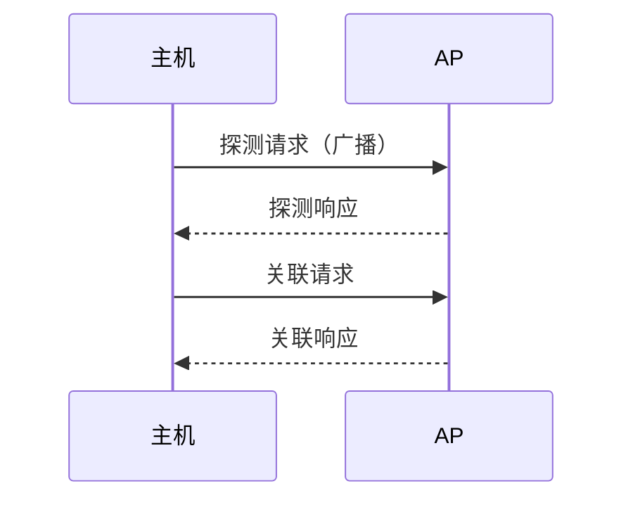

### 经典金句
> “802.11b……最高速率：11 Mbps，物理层采用直接序列扩频”
> “主机必须与某个AP关联”

---

## 第45章：802.11无线局域网（2）
### 核心论点
问题：802.11如何实现多路访问控制和冲突避免？作者观点：802.11使用CSMA/CA，因为无线信道难以实现冲突检测。通过监听信道、随机退避、以及可选的RTS/CTS预约机制避免冲突。

### 关键概念
- CSMA/CA：载波监听多路访问/冲突避免。
- DIFS：分布式帧间间隔，发送前需信道空闲DIFS。
- SIFS：短帧间间隔，ACK发送前需等待SIFS。
- 随机退避：信道忙时，随机选择退避时间，倒计时结束后发送。
- RTS/CTS：请求发送/清除发送，用于预约信道，解决隐藏站问题。
- 隐藏站：两个结点彼此不在信号范围内，但都能与AP通信，可能导致冲突。

### 逻辑推演
说明无线信道难以像有线那样边发边听（CD），因此采用冲突避免（CA）。详细描述CSMA/CA流程：发送前监听DIFS，空闲则发送；忙则随机退避。接收方正确接收后延迟SIFS回复ACK。引入RTS/CTS机制：发送端先发短RTS帧，AP广播CTS，所有听到CTS的结点推迟发送，然后发送端发送数据帧。这样可以避免长数据帧的冲突。最后给出802.11帧的地址字段（最多4个），用于区分To AP和From AP等场景。

### 流程图（CSMA/CA with RTS/CTS）
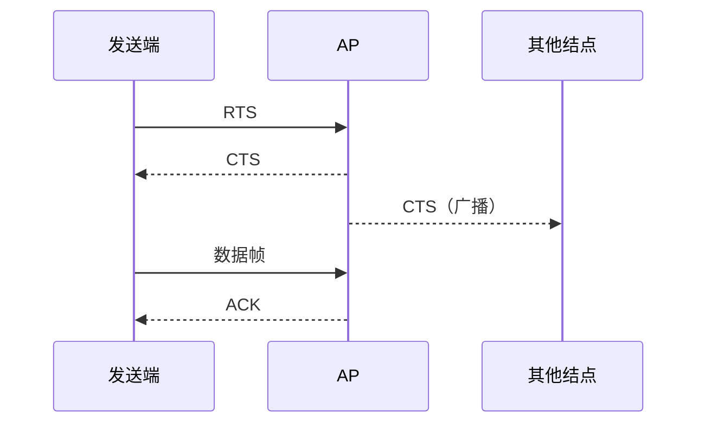

### 经典金句
> “802.11: 不能像CSMA/CD那样边发送、边检测冲突”
> “RTS-CTS交换……利用很小的预约帧彻底避免了数据帧冲突”

---

## 第46章：网络安全威胁（2）
### 核心论点
问题：什么是拒绝服务攻击（DoS）和分布式拒绝服务攻击（DDoS）？作者观点：DoS攻击通过泛洪分组淹没接收方，耗尽带宽或资源。DDoS使用多台僵尸主机协同攻击，反射式DDoS利用第三方服务器放大攻击流量。

### 关键概念
- DoS：拒绝服务攻击，使目标无法提供正常服务。
- DDoS：分布式拒绝服务，多源协同攻击。
- SYN泛洪：发送大量TCP SYN请求，耗尽服务器连接资源。
- 僵尸网络：被入侵的主机组成的网络，用于发起DDoS。
- 反射式DDoS：攻击者伪造源IP为受害者，向反射服务器发送请求，反射服务器将响应发往受害者，放大流量。

### 逻辑推演
先定义DoS攻击的类型（带宽耗尽、资源耗尽）。以SYN泛洪为例说明攻击原理。然后引入DDoS，说明多个源同时攻击更难以防御。介绍反射式DDoS：攻击者选择反射服务器（如DNS、NTP），伪造受害者IP，发送请求，反射服务器响应放大后发往受害者。最后简要提及对策：过滤、追溯、SYN Cookie等。

### 流程图（反射式DDoS）


### 经典金句
> “分布式拒绝服务攻击 (DDOS): 多个源主机协同淹没接收方”
> “反射式DDoS攻击……借助反射服务器向目标发起攻击”

---

## 第47章：密码学基础（1）
### 核心论点
问题：密码学的基本术语和分类是什么？作者观点：密码学涉及明文、密文、加密、解密。分为对称密钥加密（共享密钥）和公开密钥加密（公私钥对）。攻击类型包括唯密文攻击、已知明文攻击、选择明文攻击。

### 关键概念
- 明文（m）：原始消息。
- 密文：加密后的消息。
- 加密：使用密钥K将明文转换为密文。
- 解密：使用密钥将密文还原为明文。
- 对称密钥加密：加密和解密使用相同密钥。
- 公开密钥加密：使用公钥加密，私钥解密。
- 唯密文攻击：仅知道密文。
- 已知明文攻击：知道部分明文-密文对。
- 选择明文攻击：可以选择任意明文获得对应密文。

### 逻辑推演
首先给出密码学术语（明文m、密钥K、加密K_A(m)、解密m=K_B(K_A(m))）。然后区分对称加密（共享密钥）和公开密钥加密（公钥、私钥）。最后介绍三种攻击方式：唯密文、已知明文、选择明文，指出其难度递增。

### 经典金句
> “对称密钥加密: Bob和Alice共享相同(对称)密钥”
> “公开密钥加密……发送方与接收方无需共享秘密密钥”

---

## 第48章：密码学基础（2）
### 核心论点
问题：传统加密方法有哪些？作者观点：传统加密包括替代密码（凯撒、单码、多码）和换位密码（置换法、列置换）。这些方法为现代加密奠定了基础。

### 关键概念
- 凯撒密码：字母后移固定k位。
- 单码替代密码：26个字母到26个字母的固定映射。
- 多码替代密码：使用多个单码替代密码，不同位置使用不同映射。
- 换位密码：重新排列明文中的字母顺序。
- 列置换：将明文按行写入矩阵，按指定列顺序读出。

### 逻辑推演
先介绍凯撒密码（k=3示例）。然后说明单码替代（映射表），举例“bob. i love you. alice”加密。进一步介绍多码替代（如使用两个凯撒交替），增强安全性。最后介绍换位密码：固定长度组的置换法和列置换法（以单词为密钥，如“nice”确定列顺序）。传统方法操作对象是字母，现代加密则针对二进制位。

### 经典金句
> “替代密码(substitution cipher): 利用一种东西替代另一种东西”
> “换位(transpositions)密码: 重新排列明文中的字母”

---

## 第49章：密码学基础（3）
### 核心论点
问题：现代加密技术的主要结构和流密码如何工作？作者观点：现代加密基于替代和置换的二进制操作，分为流密码和分组密码。Feistel结构通过交替使用替代和置换实现加密。

### 关键概念
- 流密码：使用密钥产生密钥流，与明文逐字节异或加密。
- 分组密码：将明文分组，每组独立加密。
- Feistel结构：将明文分成左右两半，经过多轮迭代，每轮使用轮函数和子密钥，加密和解密过程对称。
- 扩散：将明文统计特性散布到密文中。
- 混淆：使密文与密钥的统计关系复杂化。

### 逻辑推演
首先说明现代加密操作对象是二进制位。区分流密码（逐位加密）和分组密码（分块加密）。重点介绍Feistel结构：明文分为L0和R0，每轮计算L_i = R_{i-1}，R_i = L_{i-1} ⊕ F(R_{i-1}, K_i)。加密和解密使用相同过程，只是子密钥顺序相反。Feistel结构的安全性取决于分组长度、子密钥大小、轮数、轮函数复杂度等。Feistel是设计原则，DES是其典型实现。

### 流程图（Feistel一轮加密）
```mermaid
graph LR
    L_{i-1} --> L_i[L_i = R_{i-1}]
    R_{i-1} --> F[F函数] --> XOR --> R_i
    K_i --> F
```

### 经典金句
> “Feistel是一种设计原则，并非一个特殊的密码”
> “扩散和混淆……破坏对密码系统进行各种统计分析攻击”

---

## 第50章：密码学基础（4）
### 核心论点
问题：DES（数据加密标准）的基本参数和结构是什么？作者观点：DES是16轮的Feistel结构分组密码，分组长度64位，使用56位密钥，每轮使用48位子密钥。1998年后不再作为标准。

### 关键概念
- DES：1977年成为美国加密标准，1998年退役。
- 分组长度：64位。
- 密钥长度：56位（有效）。
- 轮数：16轮。
- 子密钥：每轮48位，由56位主密钥生成。
- 初始置换IP和逆初始置换：打乱位顺序，便于硬件实现。

### 逻辑推演
介绍DES的历史背景（IBM研制，NBS征集）。给出DES的关键参数：64位分组、56位密钥、16轮Feistel结构。说明初始置换IP的作用（将64位重新排列），然后进入16轮迭代，最后逆置换。每轮使用48位子密钥。DES的安全性在1998年被破解（56位密钥太小），因此被淘汰。

### 经典金句
> “DES是16轮的Feistel结构密码，分组长度是64位，使用56位的密钥”
> “1998年12月以后不再将DES作为数据加密标准”

---

## 第51章：密码学基础（5）
### 核心论点
问题：DES的轮函数和子密钥生成细节？作者观点：DES的轮函数包含扩展变换、S盒替代、P盒置换。S盒是非线性替代，是DES安全的核心。

### 关键概念
- 扩展变换：将32位扩展到48位，用于与子密钥异或。
- S盒替代：8个S盒，每个输入6位输出4位，非线性映射。
- P盒置换：对32位进行置换，增加扩散。
- 子密钥生成：56位主密钥经置换选择、循环左移、置换选择2生成16个48位子密钥。

### 逻辑推演
详细描述一轮DES的加密过程：右半部分32位经过扩展变换成48位，与48位子密钥异或，然后通过8个S盒（每个输入6位输出4位）压缩回32位，再经过P盒置换，最后与左半部分异或得到新的右半部分。解释S盒是DES安全性的关键（非线性）。子密钥生成：56位密钥经过置换选择1，分成两半，每轮循环左移1或2位，再经过置换选择2得到48位子密钥。

### 流程图（DES一轮）
```mermaid
graph LR
    R_{i-1}[32位] --> E[扩展置换] -->48位--> XOR --> S[S盒] -->32位--> P[P盒置换] --> XOR --> R_i
    K_i[48位] --> XOR
    L_{i-1} --> XOR
```

### 经典金句
> “S-盒替代……是非线性替代，是DES安全的核心”
> “P-盒置换……增加扩散”

---

## 第52章：密码学基础（6）
### 核心论点
问题：DES的安全性问题和改进方法是什么？作者观点：DES的主要问题是56位密钥过短，易被暴力破解。改进方法包括3DES（三次DES加密）和AES（高级加密标准）。

### 关键概念
- DES安全性问题：56位密钥太小（1998年3天内破解），迭代次数可能不足，S盒可能存在后门。
- 差分分析、线性分析：针对DES的密码分析方法。
- 3DES：使用三个密钥（或两个密钥）执行三次DES（加密-解密-加密），有效密钥长度112位或168位。
- AES：高级加密标准，分组长度128位，密钥128/192/256位，Rijndael算法，非Feistel结构。

### 逻辑推演
指出DES的致命弱点：56位密钥（1998年专用机器3天破解）。介绍多重DES：3DES采用EDE模式（加密-解密-加密），可以使用两个密钥（K1=K3）或三个密钥。3DES向后兼容单DES。然后介绍AES：NIST征集，Rijndael当选。AES特点：分组128位，密钥128/192/256位，非Feistel结构，数学基础良好，抗攻击能力强。最后介绍CBC模式：每个明文分组与前一密文分组异或后再加密，解决重复明文暴露问题。

### 经典金句
> “DES的56位密钥可能太小……1998年……不到3天的时间”
> “AES……如果1秒暴力破解DES，则需要149万亿年破解AES”

---

## 第53章：密码学基础（7）
### 核心论点
问题：公开密钥加密（RSA）的基本原理是什么？作者观点：RSA基于大数分解的困难性，使用公钥（n,e）加密，私钥（n,d）解密。加密：c = m^e mod n，解密：m = c^d mod n。

### 关键概念
- 公钥加密：发送方使用接收方公钥加密，接收方使用私钥解密。
- RSA算法步骤：选择大质数p和q；计算n=pq，z=(p-1)(q-1)；选择e与z互质；计算d使ed mod z =1。公钥(n,e)，私钥(n,d)。
- 模运算：模指数性质。
- 安全性：基于大数分解难题，已知n难以求出p和q。

### 逻辑推演
首先对比对称密钥的问题（密钥分发困难），引出公钥加密。描述RSA密钥生成过程（选择p,q→计算n,z→选e→求d）。加密时计算c=m^e mod n，解密时m=c^d mod n。通过模运算证明解密正确性：c^d mod n = m^{ed} mod n = m^{ed mod z} mod n = m^1 mod n = m。RSA的安全性依赖于分解大整数n的困难性。

### 经典金句
> “RSA的安全性建立在‘大数分解和素性检测’这个数论难题的基础上”
> “给定公钥(n,e)，不可能计算得到私钥(n,d)”

---

## 第54章：密码学基础（8）
### 核心论点
问题：RSA的数学证明和重要性质是什么？作者观点：RSA满足K_B^+(K_B^-(m)) = m = K_B^-(K_B^+(m))，即公钥加密私钥解密与私钥加密公钥解密结果相同，这为数字签名提供了基础。

### 关键概念
- 证明：利用模指数性质，ed mod z =1，因此m^{ed} mod n = m。
- 性质：公钥加密与私钥加密是可交换的：K_B^+(K_B^-(m)) = m = K_B^-(K_B^+(m))。
- 数字签名基础：用私钥加密（签名），用公钥解密（验证）。

### 逻辑推演
给出RSA正确性的数学推导：c^d mod n = (m^e mod n)^d mod n = m^{ed} mod n。由于ed ≡ 1 mod z，设ed = kz+1，则m^{ed} mod n = m^{kz+1} mod n = m * (m^z)^k mod n。由欧拉定理，m^z ≡ 1 mod n，因此结果为m。强调重要性质：加密和解密顺序可交换。这意味可以用私钥“加密”（即签名），任何人可用公钥“解密”（验证），从而实现数字签名。

### 经典金句
> “K_B^+(K_B^-(m)) = m = K_B^-(K_B^+(m))”
> “利用私钥加密，可以利用公钥解密”

---

## 第55章：身份认证
### 核心论点
问题：如何证明“我是我”？作者观点：从简单声明到口令，再到加密口令，最终使用一次性随机数（nonce）防止回放攻击。但公钥认证仍可能遭受中间人攻击。

### 关键概念
- ap1.0：直接声明“I am Alice”（易伪造）。
- ap2.0：IP地址伪造。
- ap3.0：秘密口令（可被窃听）。
- ap3.1：加密口令（可被回放）。
- ap4.0：使用一次性随机数nonce，Bob发送R，Alice用共享密钥加密返回。
- ap5.0：使用公钥和nonce，Bob发送R，Alice用私钥签名返回。
- 中间人攻击：Trudy同时冒充Alice与Bob通信，分别建立连接。

### 逻辑推演
逐步展示身份认证协议的演进：ap1.0（声言）→ap2.0（IP地址）→ap3.0（口令）→ap3.1（加密口令）→ap4.0（nonce+共享密钥）。ap4.0的关键是Bob发送一个随机数，Alice用共享密钥加密后返回，证明她拥有密钥。ap5.0使用公钥：Bob发送R，Alice用私钥加密返回，Bob用公钥验证。但即使如此，如果Bob的公钥被替换，中间人攻击仍然可能。这引出认证中心（CA）的必要性。

### 流程图（ap4.0协议）
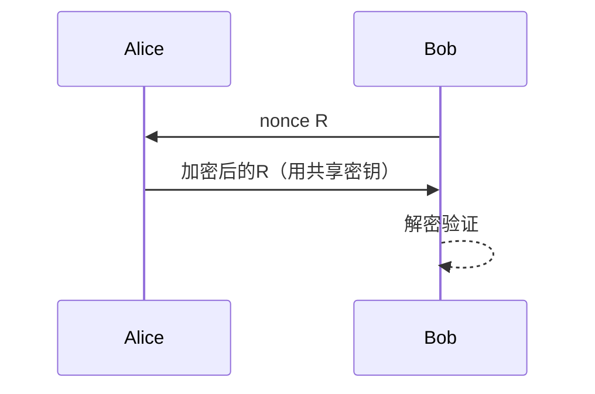

### 经典金句
> “一次性随机数(nonce): 一个生命期内只用一次的数”
> “中间人攻击……Trudy向Bob假扮Alice，向Alice假扮Bob”

---

## 第56章：报文完整性
### 核心论点
问题：如何确保报文未被篡改且来自声称的发送方？作者观点：使用密码散列函数生成报文摘要（message digest），结合共享密钥生成报文认证码（MAC），可以同时实现完整性保护和身份认证。

### 关键概念
- 密码散列函数：H(m)固定长度输出，单向性，抗碰撞（弱、强）。
- MD5：128位输出，已不够安全。
- SHA-1：160位输出，安全性优于MD5。
- 报文摘要：H(m)作为数字指纹。
- 报文认证码（MAC）：H(m+s)，其中s是共享密钥。
- Internet校验和：不是安全的散列函数，易构造碰撞。

### 逻辑推演
定义报文完整性的目标：防止篡改、防止抵赖、验证来源。介绍密码散列函数的特性（快速、定长、单向、抗碰撞）。对比Internet校验和与安全散列函数：校验和虽有多对一映射，但易于构造碰撞（举例：IOU100.99BOB与IOU900.19BOB校验和相同）。常用散列算法MD5（128位，已不安全）和SHA-1（160位）。简单方案：发送(m, H(m))，但攻击者可同时修改m和H(m)。改进：使用共享密钥s，发送(m, H(m+s))，接收方计算并比较，即MAC。

### 经典金句
> “密码散列函数……单向性: 无法根据散列值倒推出报文”
> “报文认证码MAC: 报文m+认证密钥s+密码散列函数H→H(m+s)”

---

## 第57章：数字签名
### 核心论点
问题：如何实现不可抵赖的数字签名？作者观点：使用发送方的私钥对报文（或其摘要）加密，即数字签名。接收方用发送方公钥解密验证，可证明报文确实来自发送方，且发送方无法否认。

### 关键概念
- 数字签名性质：可验证、不可伪造、不可抵赖。
- 简单签名：用私钥加密整个报文，K_B^-(m)。
- 签名摘要：先对m计算散列H(m)，再对H(m)签名（更高效）。
- 验证：用公钥解密签名，与计算的H(m)比较。
- 不可抵赖：Bob不能否认他用私钥签名的报文。

### 逻辑推演
提出报文完整性的进一步需求：防止否认和伪造。数字签名基于公钥密码，发送方用私钥加密（签名），接收方用公钥解密（验证）。直接签名整个报文效率低，因此先计算报文摘要，再签名摘要。图示说明签名与验证过程。数字签名提供了不可抵赖性：Alice可以持有(m, K_B^-(m))作为证据提交法院。

### 流程图（数字签名）
```mermaid
graph LR
    subgraph 发送方Bob
        m --> Hash --> H --> 私钥加密 --> 签名
    end
    subgraph 接收方Alice
        m' --> Hash --> H'
        签名 --> 公钥解密 --> H''
        H' == H'' --> 验证成功
    end
```

### 经典金句
> “数字签名技术是实现安全电子交易的核心技术之一”
> “不可抵赖性: Alice可以持有m和签名，必要时可以提交给法院”

---

## 第58章：密钥分发中心（KDC）
### 核心论点
问题：如何安全地分发对称密钥？作者观点：KDC是可信任的第三方，每个用户与KDC共享一个密钥。当两个用户需要通信时，KDC生成会话密钥并分别加密后发送给双方。

### 关键概念
- 对称密钥问题：如何安全地共享密钥。
- KDC：密钥分发中心，可信第三方。
- 主密钥：每个用户与KDC共享的长期密钥。
- 会话密钥：KDC为一次通信生成的临时密钥。

### 逻辑推演
回顾ap4.0需要共享密钥，但双方初始没有共享密钥。引入KDC：每个用户注册时与KDC共享一个密钥（主密钥）。当Alice想与Bob通信时，她向KDC请求，KDC生成一个会话密钥，用Alice的主密钥加密发给Alice，同时用Bob的主密钥加密发给Bob（或通过Alice转发）。这样Alice和Bob都有了会话密钥，可用于加密后续通信。

### 流程图（KDC会话密钥分发）
```mermaid
sequenceDiagram
    participant A as Alice
    participant K as KDC
    participant B as Bob
    A->>K: 请求与Bob通信
    K->>A: 用K_A加密的会话密钥K_s，以及用K_B加密的K_s
    A->>B: 转发用K_B加密的K_s
    B-->>B: 解密得到K_s
    A<->B: 用K_s加密通信
```

### 经典金句
> “可信任的密钥分发中心(KDC)作为实体间的中介”
> “会话密钥(session key)用于共享对称加密”

---

## 第59章：公钥认证中心（CA）
### 核心论点
问题：如何确保获得的公钥确实属于声称的实体？作者观点：认证中心（CA）为实体颁发数字证书，绑定实体身份与其公钥。证书包含CA的签名，任何信任CA的人可以验证证书的真实性。

### 关键概念
- 公钥问题：如何确认公钥的归属。
- CA：认证中心，可信第三方。
- 证书：包含实体身份、公钥、有效期等信息，由CA签名。
- X.509：证书格式标准。
- 信任链：通过验证CA的签名信任证书。

### 逻辑推演
通过“比萨恶作剧”故事说明：如果Trudy可以冒充Bob的公钥，就能伪造Bob的签名。解决方案是引入CA。CA验证实体身份后，签发证书（包含实体公钥和CA的签名）。当Alice需要Bob的公钥时，她获取Bob的证书，用CA的公钥验证签名，确认证书未被篡改，从而信任其中的公钥。证书格式（X.509）包含证书版本、序列号、签名算法、颁发者、有效期、主体公钥等信息。

### 经典金句
> “认证中心(CA): 实现特定实体E与其公钥的绑定”
> “证书包含由CA签名的E的公钥——CA声明: ‘这是E的公钥’”

---

## 第60章：安全电子邮件基本原理
### 核心论点
问题：如何实现电子邮件的机密性、完整性和认证？作者观点：邮件具有单向性和非实时性，不能建立隧道，只能对邮件本身加密。使用混合加密（对称+公钥）实现机密性，使用数字签名实现认证和完整性。

### 关键概念
- 邮件安全需求：机密性、完整性、身份认证、抗抵赖。
- 混合加密：用随机对称密钥加密邮件内容，用收件人公钥加密对称密钥。
- 数字签名：用发件人私钥签名邮件（或摘要），收件人用公钥验证。
- 同时实现：可以同时使用加密和签名。

### 逻辑推演
先列举电子邮件安全威胁（垃圾邮件、诈骗、病毒、钓鱼）。指出邮件安全需求。由于邮件是异步、非实时的，不能用隧道（如SSL）保护，只能加密邮件本身。实现机密性：Alice生成随机对称密钥K，用K加密邮件，用Bob的公钥加密K，发送两个部分。Bob用私钥解密得到K，再用K解密邮件。实现认证和完整性：Alice用私钥签名邮件（或摘要），发送明文+签名。Bob用Alice公钥验证。同时实现两者时，先签名后加密（或先加密后签名），需要三个密钥：自己的私钥、对方的公钥、临时对称密钥。

### 流程图（安全电子邮件）
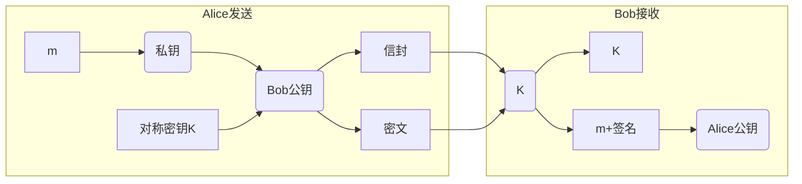

### 经典金句
> “邮件具有单向性和非实时性，不能通过建立隧道来保证安全，只能对邮件本身加密”
> “Alice使用3个密钥: 她自己的私钥、Bob的公钥和新生成的对称密钥”

---

## 第61章：安全电子邮件标准
### 核心论点
问题：PGP和S/MIME两种安全电子邮件标准有何不同？作者观点：PGP使用“信任网”模型，用户可以自行认证公钥；S/MIME依赖层级CA，证书格式X.509。两者均提供加密和签名。

### 关键概念
- PGP：Pretty Good Privacy，基于RSA和IDEA等，使用“信任网”。
- PGP公钥认证：用户可以自己认证信任的密钥，也可以为他人签名做担保。
- S/MIME：Secure/Multipurpose Internet Mail Extensions，基于X.509证书和层级CA。
- MIME类型：application/pkcs7-mime, multipart/signed等。

### 逻辑推演
介绍PGP：安装时生成密钥对，私钥用口令保护。PGP的公钥认证机制与传统CA不同：用户可以亲自交换公钥、通过电话验证、从信任的朋友处获取（“信任网”）。用户可以为他人的公钥签名证明其真实性。然后介绍S/MIME：增加新的MIME数据类型，保护邮件主体（不加密头部），依赖X.509证书和CA层级。S/MIME常用于企业环境。

### 经典金句
> “PGP公钥认证机制与传统CA差异较大……用户可以自己认证任何其信任的‘公钥/用户名’对”
> “S/MIME……认证机制依赖于层次结构的CA”

---

## 第62章：Web应用安全
### 核心论点
问题：Web应用面临哪些安全威胁？如何在不同层次实现安全？作者观点：Web安全威胁包括主动攻击和被动攻击，可在应用层（S/MIME、PGP）、传输层（SSL/TLS）或网络层（IPSec）实现安全服务。

### 关键概念
- Web安全威胁：网络监听、修改数据、DoS、假冒。
- 主动攻击：篡改信息（难防易检）。
- 被动攻击：监听（难检易防）。
- 不同层次安全方案：
  - 应用层：为特定应用定制（如S/MIME、SET）。
  - 传输层：SSL/TLS，对应用透明。
  - 网络层：IPSec，端到端通用。
- HTTPS：HTTP over SSL/TLS。

### 逻辑推演
首先列举Web服务器、浏览器和通信信道的安全威胁。然后给出三种不同层次的安全实现：应用层（需修改应用）、传输层（SSL/TLS，无需修改应用，已成为标准）、网络层（IPSec，提供主机到主机安全）。通过图示比较各层次对应的协议栈位置。

### 经典金句
> “SSL或TLS可作为基础协议栈的组成部分，对应用透明”
> “IPSec提供端到端（主机到主机）的安全机制……通用解决方案”

---

## 第63章：安全套接字层（SSL）（1）
### 核心论点
问题：SSL如何为应用提供安全信道？作者观点：SSL介于应用层和传输层之间，提供握手、密钥派生、数据传输和连接关闭功能。它通过记录分割、序列号和MAC防止重放和篡改。

### 关键概念
- SSL：Secure Sockets Layer，广泛用于Web（HTTPS）。
- 握手：交换证书、协商算法、生成主密钥。
- 密钥派生：从主密钥派生多个密钥（加密密钥、MAC密钥）。
- 记录：将数据流分割为记录，每个记录包含MAC。
- 序列号：在MAC中包含序列号，防止重放和重排序。
- 连接关闭：使用特殊类型记录安全关闭。

### 逻辑推演
先介绍SSL的目标（机密性、完整性、认证）。SSL分为握手阶段和传输阶段。握手过程：交换随机数、证书、预主密钥，生成主密钥。密钥派生：从主密钥生成4个密钥（客户加密、客户MAC、服务器加密、服务器MAC）。数据传输时，将字节流分割为记录，每个记录包含长度、类型、数据和MAC。MAC计算包括序列号、类型、数据，确保记录顺序和完整性。连接关闭时发送类型为1的记录。

### 流程图（SSL记录格式）
```mermaid
graph LR
    subgraph SSL记录
        H[长度] --> T[类型] --> Data[数据] --> MAC
    end
```

### 经典金句
> “不同加密操作使用不同密钥会更加安全……报文认证码(MAC)密钥和数据加密密钥”
> “MAC = MAC(Mx, sequence||type||data)”

---

## 第64章：安全套接字层（SSL）（2）
### 核心论点
问题：SSL的协议组成和各子协议的功能是什么？作者观点：SSL分为记录协议、握手协议、更改密码规格协议和警告协议。记录协议封装所有数据，握手协议完成认证和密钥协商。

### 关键概念
- SSL协议栈：SSL记录协议为上层服务，上层包括握手协议、更改密码规格协议、警告协议、应用数据协议。
- 密码组：公开密钥算法+对称加密算法+MAC算法的组合（如RSA+3DES+MD5）。
- 握手协议：交换算法列表、证书、随机数，协商密码组，生成密钥。
- 更改密码规格协议：通知对端加密策略改变（单个字节）。
- 警告协议：报告错误或关闭连接（两个字节：级别+代码）。

### 逻辑推演
展示SSL在TCP之上的位置，以及SSL内部的子协议层次。握手协议是最复杂的，负责认证和密钥协商。更改密码规格协议发送一个值为1的字节，表示后续记录将使用新密钥。警告协议用于关闭连接或报告异常。记录协议负责分段、压缩、加密、添加MAC。客户和服务器在握手时协商密码组（客户提供列表，服务器选择一个）。

### 经典金句
> “SSL不是一个单独的协议，而是两层协议”
> “密码组(cipher suite): 公开密钥算法+对称加密算法+MAC算法”

---

## 第65章：安全套接字层（SSL）（3）
### 核心论点
问题：SSL握手协议的详细步骤和密钥派生过程？作者观点：SSL握手使用两个随机数防止重放，握手消息的MAC防止算法降级攻击。密钥通过伪随机数发生器从主密钥派生。

### 关键概念
- 握手步骤：
  1. 客户发送算法列表和客户随机数。
  2. 服务器选择算法，发送证书、服务器随机数。
  3. 客户验证证书，生成预主密钥，用服务器公钥加密发送。
  4. 双方基于预主密钥和两个随机数计算主密钥。
  5. 客户发送所有握手消息的MAC。
  6. 服务器发送所有握手消息的MAC。
- 目的：最后两步MAC防止攻击者从算法列表中删除强算法。
- 两个随机数的作用：确保每次连接的密钥不同，防止重放攻击。
- 密钥派生：客户随机数、服务器随机数、预主密钥 → 主密钥 → 密钥块 → 切片得到4个密钥和IV。

### 逻辑推演
详细描述6步握手过程，重点说明为何需要最后两步MAC：防止中间人修改算法列表（如删除强算法）。解释为何需要两个随机数：如果只有预主密钥，攻击者可重放昨天的连接。密钥派生使用伪随机数发生器（PRF），产生主密钥，再产生密钥块，然后分割成客户MAC密钥、服务器MAC密钥、客户加密密钥、服务器加密密钥、客户IV、服务器IV。

### 流程图（SSL握手）
```mermaid
sequenceDiagram
    participant C as 客户
    participant S as 服务器
    C->>S: 算法列表+客户随机数
    S->>C: 选择的算法+证书+服务器随机数
    C->>C: 验证证书，生成预主密钥
    C->>S: 预主密钥（用服务器公钥加密）
    C->>S: 所有握手消息的MAC
    S->>C: 所有握手消息的MAC
    C<->S: 应用数据加密传输
```

### 经典金句
> “为什么使用两个一次随机数？……确保两天的加密密钥不同”
> “最后2步传输的消息是加密的……保护握手过程免遭篡改”

---

## 第66章：虚拟专用网（VPN）
### 核心论点
问题：VPN如何利用公共网络构建专用网络？作者观点：VPN通过在公共网络上建立安全隧道，实现远程用户、分支机构与总部网络的安全连接。关键技术包括隧道技术、加密、认证和密钥管理。

### 关键概念
- 专用网（PN）：专属设备、链路，成本高。
- 虚拟专用网（VPN）：利用公共网络（如Internet）构建逻辑上专用、安全的网络。
- 隧道：通过封装（乘客协议+封装协议+承载协议）实现安全传输。
- 隧道协议：PPTP（二层）、L2TP（二层）、IPSec（三层）。
- 典型VPN技术：IPSec（最安全）、SSL、L2TP。

### 逻辑推演
对比专用网（安全但成本高）和VPN（安全+成本低）。VPN的“虚拟”是指不实际独占资源，而是通过隧道技术创建逻辑安全通道。VPN需要提供机密性、完整性、认证、防重放、访问控制。核心技术包括隧道（封装）、加密、身份认证、密钥管理。隧道协议涉及三层：乘客协议（被封装的数据）、封装协议（如IPSec）、承载协议（如IP）。常见VPN实现：IPSec VPN（网关到网关）、SSL VPN（远程访问）。

### 流程图（VPN隧道）
```mermaid
graph LR
    subgraph 公司总部
        R1[VPN网关]
    end
    subgraph 公共网络
        Tunnel[加密隧道]
    end
    subgraph 分支机构
        R2[VPN网关]
    end
    R1 <-->|封装| Tunnel <-->|解封装| R2
```

### 经典金句
> “虚拟专用网……通过建立在公共网络上的安全通道……构建专用网络”
> “隧道技术……通过Internet提供安全的点到点数据传输‘安全通道’”

---

## 第67章：IPSec（1）
### 核心论点
问题：IPSec提供的安全服务和协议模式是什么？作者观点：IPSec提供机密性、完整性、源认证和防重放，通过AH和ESP两个协议实现。支持传输模式和隧道模式。

### 关键概念
- IPSec：IP安全协议，在网络层提供安全服务。
- AH（认证头）：协议号51，提供源认证和完整性，不提供机密性。
- ESP（封装安全载荷）：协议号50，提供机密性、认证、完整性，更常用。
- 传输模式：端到端，IP头部之后插入IPSec头部，适用于主机间通信。
- 隧道模式：网关到网关，整个原始IP数据报封装在新IP头之后，适用于VPN。

### 逻辑推演
IPSec的目标是保护IP数据报。两个主要协议：AH（仅认证）和ESP（加密+认证，更常用）。两种模式：传输模式（用于端主机之间，IP头部可见）和隧道模式（用于网关之间，原始IP数据报被隐藏）。传输模式适用于内部网络，隧道模式适用于跨越公网的VPN。图示说明不同模式下IP数据报的结构变化。

### 经典金句
> “IPsec提供……机密性、数据完整性、源认证/鉴别、重放攻击预防”
> “传输模式……隧道模式……最普遍、最重要”

---

## 第68章：IPSec（2）
### 核心论点
问题：IPSec如何管理安全关联（SA）和安全策略？作者观点：IPSec是面向连接的，通信前需建立单向安全关联（SA）。SA存储在SAD中，安全策略存储在SPD中，通过SPI索引。

### 关键概念
- SA（安全关联）：单向逻辑连接，定义了加密算法、密钥、SPI等。
- SPI（安全参数索引）：32位标识，唯一标识SA。
- SAD（安全关联数据库）：存储SA的详细信息。
- SPD（安全策略数据库）：定义对哪些数据流应用何种安全处理（应用IPSec、绕过、丢弃）。
- 选择符：用于匹配数据流，如源IP、目的IP、协议、端口。

### 逻辑推演
IPSec是面向连接的（尽管IP无连接）。在发送数据前需要建立SA（单向）。每个SA有SPI、加密密钥、认证密钥、序列号等。端点维护SAD，接收时通过SPI查找SA。同时维护SPD，定义安全策略：哪些流量需要IPSec保护。处理数据报时，先从数据报中提取选择符，查询SPD决定处理方式，然后查询SAD获得SA参数。

### 经典金句
> “IP是无连接的；IPsec是面向连接的”
> “安全关联SA……是单工的：单向”

---

## 第69章：IPSec（3）
### 核心论点
问题：AH和ESP在不同模式下的封装格式是什么？作者观点：AH在传输模式下插入IP头之后，认证整个IP数据报（除可变字段）。ESP加密载荷并在尾部添加认证。隧道模式新增IP头。

### 关键概念
- 传输模式AH：IP头后插入AH头，认证范围包括IP头（除可变字段）和载荷。
- 隧道模式AH：新IP头后跟AH头，再跟原IP数据报。
- 传输模式ESP：IP头后插入ESP头，加密载荷和ESP尾部，添加ESP认证。
- 隧道模式ESP：新IP头后跟ESP头，加密原IP数据报，添加ESP认证。

### 逻辑推演
通过图示和表格展示四种组合的封装结构。AH认证整个数据报，但不能保护可变字段（如TTL）。ESP加密原始载荷，提供机密性。隧道模式中，新IP头的源和目的地址是网关地址，隐藏了内部主机地址。

### 经典金句
> “AH提供源认证/鉴别和数据完整性检验，但不提供机密性”
> “ESP提供源认证/鉴别、数据完整性检验以及机密性”

---

## 第70章：IPSec（4）
### 核心论点
问题：IPSec处理数据报的具体步骤和防重放机制？作者观点：发送方从SPD和SAD获取参数，加密并添加MAC；接收方根据SPI查找SAD，验证MAC并解密。序列号用于防重放，滑动窗口检测重复分组。

### 关键概念
- 发送处理：检索SPD→检索SAD→添加ESP尾部→加密→添加ESP头→计算MAC→添加新IP头。
- 接收处理：提取SPI→查SAD→验证MAC→解密→校验。
- 序列号：发送方每发一个数据报递增，接收方用滑动窗口检测重放。
- ESP头：包含SPI和序列号。
- ESP尾部：填充使分组长度满足分组密码要求。

### 逻辑推演
详细描述IPsec处理流程（以ESP隧道模式为例）。发送方先构建ESP尾部（填充），然后加密（原IP数据报+ESP尾部），添加ESP头（SPI+序列号），计算整个“enchilada”的MAC，附加MAC，最后加上新IP头。接收方提取IP头中的SPI，查SAD得到SA，验证MAC（防篡改），解密，去除填充，得到原IP数据报。序列号防止重放攻击：接收方维护滑动窗口，只接受窗口内的新序列号。

### 流程图（IPSec ESP隧道模式处理）
```mermaid
graph TD
    subgraph 发送
        A[原IP数据报] --> B[添加ESP尾部] --> C[加密] --> D[添加ESP头] --> E[计算MAC] --> F[添加新IP头]
    end
    subgraph 接收
        G[收到IPSec数据报] --> H[提取SPI查SAD] --> I[验证MAC] --> J[解密] --> K[去除填充] --> L[原IP数据报]
    end
```

### 经典金句
> “序列号……预防嗅探与回放分组攻击”
> “接收方检验分组重复……利用一个窗口”

---

## 第71章：IPSec（5）
### 核心论点
问题：IPSec如何自动管理密钥和SA？作者观点：IKE（Internet密钥交换）协议自动建立、协商和管理IPSec SA。IKE分为阶段1（建立IKE SA，双向）和阶段2（协商IPSec SA）。

### 关键概念
- IKE：Internet Key Exchange，IPSec的密钥管理协议。
- ISAKMP：IKE的框架，定义SA协商过程。
- 阶段1：建立双向IKE SA（用于保护IKE通信本身），支持主模式（6个消息，提供身份保护）和野蛮模式（3个消息）。
- 阶段2：基于IKE SA协商IPSec SA（单向，用于实际数据）。
- 认证方式：预共享密钥（PSK）或公钥基础设施（PKI）。

### 逻辑推演
手工配置SA对大规模VPN不可行，因此需要IKE。IKE基于ISAKMP框架，分两阶段。阶段1建立IKE SA（双向），提供安全的通道用于后续协商；支持主模式（6个消息，隐藏身份）和野蛮模式（3个消息，速度快但身份暴露）。阶段2在IKE SA保护下协商IPSec SA（单向，每个方向一个）。IKE可以自动生成密钥、SPI等参数，大大简化VPN管理。

### 经典金句
> “IKE协议可自动管理SA的建立、协商、修改和删除”
> “阶段1：建立双向IKE SA……阶段2：进行IPsec SA的安全协商”

---

## 第72章：无线局域网安全
### 核心论点
问题：WEP协议有哪些安全缺陷？802.11i如何改进？作者观点：WEP使用RC4流密码、24位IV（易重用），存在严重漏洞。802.11i引入更强的加密（AES）、TKIP、独立认证服务器（RADIUS）和EAP，显著提升安全性。

### 关键概念
- WEP：有线等效协议，使用RC4流密码，24位IV，每帧独立加密。
- WEP漏洞：IV过短导致重用；IV明文传输；CRC32不抗篡改；可恢复密钥流。
- 802.11i：改进的无线安全标准。
- TKIP：临时密钥完整性协议，用于升级WEP。
- CCMP：基于AES的加密协议，更强。
- 认证服务器：使用RADIUS，独立于AP。
- 4阶段运行：发现、认证、密钥生成、加密传输。

### 逻辑推演
先介绍WEP设计目标：每帧独立加密（自同步）。WEP使用RC4流密码，每帧使用24位IV与共享密钥组合生成密钥流。但IV空间仅2^24，繁忙网络很快重用，且IV明文传输，攻击者可获得密钥流。CRC32不是安全的MAC，可被篡改。802.11i的改进：使用更长的密钥、更安全的加密（AES-CCMP）、独立的认证服务器（RADIUS）。802.11i运行4阶段：发现AP、EAP认证（与AS交互）、生成成对主密钥（PMK）、派生临时密钥（TK）用于加密。EAP是端到端协议，通过EAPoL和RADIUS承载。

### 经典金句
> “WEP……每帧一个24位的IV→IV最终会被重用”
> “802.11i……多种（更强的）可选的加密方法……提供密钥分发”

---

## 第73章：防火墙与访问控制
### 核心论点
问题：防火墙的类型和工作原理是什么？作者观点：防火墙分为无状态分组过滤器、有状态分组过滤器和应用网关。无状态过滤器基于IP/TCP/UDP头部字段决策；有状态跟踪连接状态；应用网关检查应用层数据。

### 关键概念
- 防火墙：隔离内部网和公共网，允许/阻止分组通过。
- 无状态分组过滤器：逐包检查源IP、目的IP、端口、协议标志位等，不关心上下文。
- ACL（访问控制列表）：规则表，按顺序匹配。
- 有状态分组过滤器：跟踪TCP连接状态（SYN、FIN、超时），决策更智能。
- 应用网关：代理应用层流量，可检查应用数据（如允许特定用户telnet）。

### 逻辑推演
定义防火墙及其目的（防DoS、防非法修改、控制访问）。无状态过滤器：举例阻止UDP或Telnet、阻止外部主动TCP连接（通过检查ACK标志）。给出ACL表格示例。有状态过滤器：跟踪连接状态，只允许属于已建立连接的流量进入，避免ACL过于宽松。应用网关：为特定应用（如Telnet）提供代理，用户需先认证，路由器只允许来自网关的该应用流量。最后讨论防火墙的局限性（IP欺骗、多应用需要多个网关、UDP难以精细控制）。

### 流程图（有状态防火墙）
```mermaid
graph LR
    subgraph 内部网络
        H[主机]
    end
    subgraph 防火墙
        F[有状态过滤器]
        T[连接状态表]
    end
    subgraph Internet
        S[服务器]
    end
    H -->|SYN| F -->|记录状态| T
    F --> S
    S -->|ACK| F -->|检查状态| T -->|允许| H
```

### 经典金句
> “防火墙……允许某些分组通过，而阻止其他分组进入/离开内部网络”
> “有状态分组过滤器：跟踪每个TCP连接……根据状态确定是否放行”

---

## 第74章：数据链路层服务
### 核心论点
问题：数据链路层提供哪些核心功能？作者观点：链路层负责相邻结点间帧的传输，提供组帧、链路接入、可靠交付、流量控制、差错检测、全双工/半双工控制等功能。

### 关键概念
- 结点：主机和路由器。
- 链路：连接相邻结点的通信信道。
- 帧：链路层数据分组，封装网络层数据报。
- 组帧：添加首部和尾部，实现帧同步。
- 链路接入：共享介质时需要MAC协议。
- 可靠交付：无线链路需要，有线链路通常不需要。
- 流量控制：防止接收方溢出。
- 差错检测/纠正：通过校验和、CRC等。

### 逻辑推演
首先定义链路层的服务范围（相邻结点之间）。列出链路层的主要功能：组帧、链路接入（MAC寻址）、可靠交付（如无线）、流量控制、差错检测、差错纠正、半双工/全双工控制。说明链路层在NIC（网络接口卡）中实现，由硬件、软件、固件共同完成。最后给出网卡间通信的示意图：发送方封装帧，接收方解封装交付上层。

### 经典金句
> “数据链路层负责通过一条链路从一个节点向另一个物理链路直接相连的相邻结点传送数据报”
> “链路层在‘适配器’（即网络接口卡- NIC）中实现”

---

## 第75章：差错编码
### 核心论点
问题：如何通过差错编码检测和纠正错误？作者观点：差错编码通过添加冗余比特实现检错和纠错。汉明距离决定检错/纠错能力。常见编码有奇偶校验码、校验和、循环冗余校验（CRC）。

### 关键概念
- 差错编码：D → D+R，R为冗余比特。
- 汉明距离：两个码字不同比特的个数。
- 检错能力：d_s = r+1 可检测r位错误。
- 纠错能力：d_s = 2r+1 可纠正r位错误。
- 奇偶校验：1位校验可检测奇数个错误；二维奇偶可定位错误。
- 校验和：16位补码求和，取反。
- CRC：基于多项式除法，检测能力强（可检测突发错误）。

### 逻辑推演
先给出差错编码的基本思想：添加冗余比特。引入汉明距离概念，通过编码集例子说明检错和纠错的条件。介绍一维奇偶校验（只能检测奇数错）和二维奇偶校验（可定位并纠正单比特错）。介绍Internet校验和（16位补码求和）的原理。重点介绍CRC：将数据视为多项式，除以生成多项式G，余数即为CRC码。接收方用G除，余数为0则无错。CRC广泛用于以太网、WiFi。

### 经典金句
> “差错编码不能保证100%可靠”
> “CRC……可以检测所有突发长度小于r+1位差错”

---

## 第76章：MAC协议
### 核心论点
问题：共享广播信道上的多路访问控制协议有哪些类型？作者观点：MAC协议分为三类：信道划分（TDMA、FDMA、CDMA）、随机访问（ALOHA、CSMA）、轮转（轮询、令牌传递）。每种协议在不同负载下有不同效率。

### 关键概念
- 信道划分：将信道资源划分为独立部分，避免冲突但效率受限于最活跃用户。
- 随机访问：允许冲突，通过算法恢复，轻负载效率高，重负载冲突严重。
- 轮转：结点轮流使用信道，重负载效率高，有轮询/令牌开销。
- TDMA：时分多址，每个结点固定时隙。
- FDMA：频分多址，每个结点固定频带。

### 逻辑推演
先描述广播链路的问题（冲突）。理想MAC协议应具备：单结点时全速率，多结点时公平共享，分散控制，简单。然后分类介绍：信道划分（TDMA/FDMA/CDMA）——无冲突但资源固定分配；随机访问（ALOHA，CSMA）——轻负载好但冲突浪费；轮转（轮询、令牌）——结合两者优点但存在单点故障和开销。为后续详细讲解各协议铺垫。

### 经典金句
> “多路访问控制协议……分布式算法决定结点何时可以传输数据”
> “理想MAC协议……当只有一个结点希望传输数据时，它可以以速率R发送”

---

## 第77章：随机访问MAC协议（1）
### 核心论点
问题：ALOHA协议的效率如何？作者观点：时隙ALOHA最大效率为1/e≈37%，纯ALOHA更低（1/(2e)≈18%）。ALOHA效率低，但结构简单。

### 关键概念
- 时隙ALOHA：时间划分为时隙，结点只在时隙开始时发送，冲突后以概率p重传。
- 纯ALOHA：有帧立即发送，不等待时隙，冲突窗口是发送时长的两倍。
- 效率计算：时隙ALOHA最大效率1/e；纯ALOHA最大效率1/(2e)。
- 冲突：时隙ALOHA的冲突发生在同一时隙；纯ALOHA的冲突发生在前后各一个帧时间内。

### 逻辑推演
描述时隙ALOHA的运行机制（同步、时隙、冲突检测、概率重传）。推导效率：N个结点每个以概率p发送，成功概率Np(1-p)^{N-1}，取极限得1/e。纯ALOHA无需同步，但冲突概率更高，效率为1/(2e)。ALOHA简单但效率低，适用于极低负载场景。

### 经典金句
> “时隙ALOHA……最好情况: 信道被成功利用的时间仅占37%”
> “纯ALOHA……更差! 最大效率= 1/(2e) = 0.18”

---

## 第78章：随机访问MAC协议（2）
### 核心论点
问题：CSMA/CD如何提高信道利用率？作者观点：CSMA通过载波监听减少冲突，CSMA/CD增加冲突检测，一旦冲突立即停止发送，避免浪费。以太网采用二进制指数退避算法。

### 关键概念
- CSMA：载波监听多路访问，发送前监听信道。
- 1-坚持CSMA：信道空闲立即发送，忙则持续监听。
- 非坚持CSMA：忙则随机等待后再监听。
- CSMA/CD：添加冲突检测，边发边听，冲突后立即停止并发送堵塞信号。
- 最小帧长：保证在发送完成前能检测到冲突，L_min/R ≥ RTT_max。
- 二进制指数退避：连续冲突次数越多，退避窗口越大。

### 逻辑推演
CSMA可减少但无法完全避免冲突（传播延迟导致）。CSMA/CD进一步在冲突发生时立即中止传输，节省信道时间。推导最小帧长条件：发送时间至少等于最大传播延迟的2倍，以确保能检测到冲突（公式L_min/R = RTT_max）。以太网采用二进制指数退避：第m次冲突后，从0到2^{min(m,10)}-1中随机选择K，等待K个时槽。效率公式为1/(1+5t_prop/t_trans)，远高于ALOHA。

### 经典金句
> “CSMA/CD……短时间内可以检测到冲突，冲突后传输中止，减少信道浪费”
> “二进制指数退避……连续冲突次数越多，平均等待时间越长”

---

## 第79章：轮转访问MAC协议
### 核心论点
问题：轮转MAC协议如何综合信道划分和随机访问的优点？作者观点：轮询和令牌传递在负载重时高效公平，负载轻时也有较低延迟（相比信道划分）。但存在单点故障和轮询/令牌开销。

### 关键概念
- 轮询：主结点轮流邀请从属结点发送。
- 轮询开销：轮询消息本身占用带宽。
- 等待延迟：从结点需等待被轮询。
- 单点故障：主结点故障导致整个网络瘫痪。
- 令牌传递：令牌（特殊帧）在结点间循环，持有令牌的结点可发送。
- 令牌开销：令牌传输和维护开销。

### 逻辑推演
对比信道划分（重负载高效但轻负载浪费）和随机访问（轻负载高效但重负载冲突严重）。轮转协议试图结合两者：轮询（主结点控制）和令牌传递（分布式控制）。轮询适用于哑从属设备；令牌传递用于FDDI、令牌环等。两者在重负载下可公平分配信道，轻负载下无冲突，但存在控制开销和单点故障风险（令牌丢失需恢复）。

### 经典金句
> “轮转访问MAC协议：综合两者的优点！”
> “轮询……令牌传递……问题: 轮询开销，等待延迟，单点故障”

---

## 第80章：ARP协议（1）
### 核心论点
问题：同一局域网内如何通过IP地址找到对应的MAC地址？作者观点：ARP协议通过广播查询目标IP的MAC地址，目标应答，源缓存映射关系。ARP是即插即用协议。

### 关键概念
- MAC地址：48位，固化在网卡，平面地址（可携带）。
- IP地址：32位，层次地址（依赖子网）。
- ARP：地址解析协议，用于IP到MAC的映射。
- ARP表：存储IP-MAC映射及TTL（典型20分钟）。
- ARP查询：广播帧（目的MAC FF-FF-FF-FF-FF-FF），包含目标IP。
- ARP应答：单播帧返回MAC地址。

### 逻辑推演
先对比IP地址（逻辑、层次）和MAC地址（物理、平面）。当同一LAN内主机A想向B发送IP数据报时，需要知道B的MAC地址。如果ARP表中没有，则广播ARP请求（目标IP=B），所有主机接收，只有B应答其MAC。A缓存映射关系，然后发送数据帧。ARP无需配置，即插即用。

### 流程图（ARP解析）
```mermaid
sequenceDiagram
    participant A as 主机A
    participant B as 主机B
    A->>B: 广播ARP请求（B的IP）
    B-->>A: 单播ARP应答（B的MAC）
    A->>A: 更新ARP表
    A->>B: 发送数据帧（目的MAC=B）
```

### 经典金句
> “ARP是‘即插即用’协议: 结点自主创建ARP表，无需干预”
> “MAC地址：身份证号；IP地址：邮政地址”

---

## 第81章：ARP协议（2）
### 核心论点
问题：跨局域网通信时IP地址和MAC地址如何协作？作者观点：IP数据报中的源/目的IP地址保持不变，而每一跳链路层帧的源/目的MAC地址随链路变化。路由器根据目的IP转发数据报，并根据下一跳IP使用ARP获取MAC。

### 关键概念
- 跨网络通信：源主机A→路由器R→目的主机B。
- IP地址：端到端，数据报中始终为A和B的IP。
- MAC地址：逐跳变化，帧中为当前链路两端的MAC。
- 第一跳：A需要知道R（左）的MAC，通过ARP获取。
- 第二跳：R需要知道B的MAC，通过ARP（如果在同一LAN）或进一步路由。

### 逻辑推演
以A通过路由器R向B（不同子网）发送数据报为例。A构造IP数据报：源IP=A，目的IP=B。A需要知道下一跳路由器R左接口的MAC，通过ARP得到。然后构造帧：源MAC=A，目的MAC=R_left，封装IP数据报发送。R接收后，解封得到IP数据报，查路由表决定从右接口转发。R需要知道B的MAC，若在同一LAN则通过ARP获取，然后构造新帧：源MAC=R_right，目的MAC=B，发送。整个过程中IP地址不变，MAC地址逐跳改变。

### 经典金句
> “IP地址不变，MAC地址逐跳变化”
> “路由器转发IP数据报（源和目的IP地址不变！）”

---

## 第82章：以太网
### 核心论点
问题：以太网的标准、帧结构和CSMA/CD退避算法？作者观点：以太网是目前最流行的有线LAN技术，使用CSMA/CD和二进制指数退避。帧格式包括前导码、目的/源MAC、类型、数据（46-1500B）、CRC。

### 关键概念
- 以太网：统治地位的有线LAN，速率10Mbps-10Gbps。
- 拓扑：早期总线型，现在星型（中心交换机）。
- 服务：无连接、不可靠。
- 帧结构：前导码（8B，用于同步）、目的MAC（6B）、源MAC（6B）、类型（2B，指示上层协议）、数据（46-1500B）、CRC（4B）。
- 最小数据长度46B：保证最小帧长64B（含18B头部），以满足CSMA/CD的冲突检测要求。
- 二进制指数退避：连续冲突后，退避时间指数增长。

### 逻辑推演
介绍以太网的历史和主导地位。说明物理拓扑演变。强调以太网提供无连接、不可靠服务（没有确认，差错靠高层恢复）。详细描述CSMA/CD的算法流程（监听、发送、检测冲突、中止、退避）。给出以太网帧格式，解释前导码的作用、类型字段、数据字段长度下限（46B）的原因（最小帧长64B-18B=46B）。最后列举不同速率的以太网标准（10Base-T、100Base-T、1G、10G等），共享相同的MAC协议和帧格式。

### 经典金句
> “以太网……无连接(connectionless)……不可靠(unreliable)”
> “最小帧长64B……以保证CSMA/CD的冲突检测条件”

---

## 后记
以上续篇涵盖了链路层交换技术、无线局域网、网络安全（密码学、身份认证、报文完整性、数字签名、KDC、CA）、安全电子邮件、SSL、VPN、IPSec、防火墙，以及链路层核心功能（差错编码、MAC协议、ALOHA、CSMA/CD、轮转协议、ARP、以太网）。讲义内容全面，理论结合实践，适合网络学习者系统掌握从数据链路层到应用层安全的知识体系。

> 说明：部分图示（如IPSec封装格式、SSL记录格式）已用文字或简化Mermaid表示。原始幻灯片中的具体置换表格（如IP、P盒）未完整列出，但核心逻辑已提炼。

# 《计算机网络课程讲义》章节总结（聂兰顺主讲部分）

## 书籍信息
- 书名：计算机网络（MOOC课程讲义）
- 作者：聂兰顺（部分章节主讲人）
- PDF 状态：多份独立讲义文件，内容为课堂幻灯片，文本可识别，部分图像含占位符。
- OCR 状态：良好，文本完整，流程图和表格基本可读。

## 目录说明
- 目录识别情况：无统一目录，依据文件编号（200_开篇、201_网络应用体系结构、…、319_总结）及“本讲主题”整理顺序。
- 章节对应依据：每个独立主题作为一章，章标题取自“本讲主题”或首屏内容。
- 说明：以下章节接续前文（第1-82章），从第83章开始编号。

---

## 第83章：开篇——网络应用与传输层概览
### 核心论点
问题：本模块将讲授哪些内容？作者观点：涵盖网络应用体系结构（C/S、P2P、混合）、应用需求（可靠性、带宽、时延）、传输层服务（TCP/UDP）、具体应用协议（HTTP、SMTP、DNS、P2P）以及Socket编程。

### 关键概念
- 应用体系结构：客户机/服务器、P2P、混合。
- 应用需求：数据丢失容忍度、时间敏感性、带宽要求。
- 传输层服务：TCP（面向连接、可靠）、UDP（无连接、不可靠）。
- 特定应用：HTTP、SMTP/POP/IMAP、DNS、P2P。

### 逻辑推演
开篇提纲挈领地列出后续各讲主题，帮助学习者建立整体框架。

---

## 第84章：网络应用体系结构
### 核心论点
问题：网络应用应采取什么样的体系结构？作者观点：三种体系结构——客户机/服务器（C/S）、点对点（P2P）、混合结构。各有优缺点，适用于不同场景。

### 关键概念
- C/S：服务器7×24小时在线，固定IP；客户机间歇接入，动态IP，不直接通信。
- P2P：无永远在线服务器，节点直接通信，高度可伸缩，难于管理。
- 混合结构：如Napster——文件传输用P2P，文件搜索用C/S（中央服务器）。

### 逻辑推演
先提出问题：网络应用与单机应用的本质区别。然后分别介绍三种体系结构的特征和例子。C/S以Web为例；P2P以文件共享为例；混合以Napster为例。最后留练习题：为每种结构找出5种以上应用并对比优缺点。

### 经典金句
> “P2P结构：高度可伸缩，缺点：难于管理”
> “混合结构：能够利用两者的优点同时规避两者的缺点”

---

## 第85章：网络应用进程通信
### 核心论点
问题：不同主机上的进程如何通信？作者观点：通过Socket API进行消息交换。进程标识符为“IP地址+端口号”。应用层协议定义了消息类型、语法、语义和规则。

### 关键概念
- 进程间通信：同一主机用操作系统机制，不同主机用消息交换。
- 客户机进程：发起通信；服务器进程：等待请求。
- Socket：类似于寄信，应用进程通过Socket发送/接收消息。
- 进程标识：IP地址（主机）+端口号（进程）。
- 应用层协议：公开协议（HTTP、SMTP等RFC定义）或私有协议（多数P2P）。

### 逻辑推演
先区分同一主机和不同主机的进程通信。引入Socket抽象，类比寄信。说明进程需要唯一标识，IP地址定位主机，端口号定位进程。最后定义应用层协议的四个要素：消息类型、语法、语义、规则。

### 经典金句
> “进程的标识符：IP地址+端口号”
> “应用层协议：公开协议……允许互操作”

---

## 第86章：网络应用的需求与传输层服务
### 核心论点
问题：网络应用对传输服务有哪些需求？TCP和UDP分别满足哪些需求？作者观点：应用需求包括数据丢失容忍度、时间敏感性、带宽要求。TCP提供可靠、流量控制、拥塞控制，但不保证时延和带宽；UDP提供无连接、不可靠服务，无额外保障。

### 关键概念
- 数据丢失：文件传输需100%可靠，音视频可容忍少量丢失。
- 时间敏感性：实时应用（VoIP）需低延迟，弹性应用（Email）可容忍延迟。
- 带宽：视频需最低带宽，Email可适应任何带宽。
- TCP服务：面向连接、可靠、流量控制、拥塞控制；无时延/带宽保障。
- UDP服务：无连接、不可靠、无流量/拥塞控制。

### 逻辑推演
通过表格展示典型应用对丢失、带宽、时延的需求。然后对比TCP和UDP提供的服务。最后给出常见应用使用的传输层协议（SMTP/TCP、HTTP/TCP、VoIP/UDP等）。

### 经典金句
> “TCP……不提供时间/延迟保障，不提供最小带宽保障”
> “UDP……无连接，不可靠的数据传输”

---

## 第87章：Web应用与HTTP
### 核心论点
问题：Web应用的核心协议HTTP是如何工作的？作者观点：HTTP基于C/S结构，使用TCP传输，默认端口80。HTTP是无状态协议，每个请求独立处理。

### 关键概念
- Web：万维网，由Tim Berners-Lee发明。
- URL：统一资源定位器，格式 scheme://host:port/path。
- HTTP：超文本传输协议，C/S模式。
- 无状态：服务器不维护客户端的历史信息。

### 逻辑推演
介绍Web的基本组成（网页、对象、URL）。引出HTTP协议，说明其使用TCP 80端口。强调无状态特性，并解释设计原因：有状态协议更复杂，故障恢复代价高。

### 经典金句
> “HTTP：超文本传输协议，C/S结构”
> “无状态(stateless): 服务器不维护任何有关客户端过去所发请求的信息”

---

## 第88章：HTTP连接类型
### 核心论点
问题：非持久连接和持久连接的区别和性能差异？作者观点：HTTP 1.0使用非持久连接（每个对象一个TCP连接），HTTP 1.1默认持久连接（多个对象复用同一连接），并支持流水线机制，显著降低响应时间。

### 关键概念
- 非持久连接：每个TCP连接最多传输一个对象。
- RTT：往返时间，客户端发送小包到服务器并返回的时间。
- 响应时间：非持久连接下，每个对象约需2RTT+传输时间。
- 持久连接：发送响应后保持TCP连接打开。
- 无流水线持久连接：收到前一个响应后才发下一个请求。
- 有流水线持久连接：连续发送请求，理想情况所有对象约1RTT。

### 逻辑推演
以包含10个图片的网页为例，计算非持久连接的总响应时间（每个对象2RTT+传输）。然后介绍持久连接的优势：减少连接建立开销。进一步区分无流水线和有流水线，后者效率更高。HTTP 1.1默认采用有流水线的持久连接。

### 流程图（非持久连接时序）
```mermaid
sequenceDiagram
    participant C as 客户端
    participant S as 服务器
    C->>S: TCP连接请求
    S-->>C: TCP连接确认
    C->>S: HTTP请求(index.html)
    S-->>C: HTTP响应(index.html)
    S--x C: 关闭TCP连接
    Note over C,S: 重复上述过程获取每个图片对象
```

### 经典金句
> “非持久性连接：每个TCP连接最多允许传输一个对象”
> “带有流水机制的持久性连接……理想情况下，收到所有的引用对象只需耗时约1个RTT”

---

## 第89章：HTTP消息格式
### 核心论点
问题：HTTP请求消息和响应消息的格式是什么？作者观点：HTTP消息为ASCII文本，包含请求行/状态行、头部行、空行、实体主体。方法有GET、POST、HEAD、PUT、DELETE等。

### 关键概念
- 请求消息格式：请求行（方法、URL、版本）、头部行、空行、实体主体。
- 方法：GET（请求资源）、POST（提交表单数据）、HEAD（只请求头部）、PUT（上传文件）、DELETE（删除文件）。
- 上传输入：POST方法在实体体中；GET方法通过URL参数。
- 响应消息：状态行（版本、状态码、短语）、头部、空行、实体主体。
- 常见状态码：200 OK、301 Moved、400 Bad Request、404 Not Found、505 Version Not Supported。

### 逻辑推演
展示请求消息的通用格式，并举例说明GET和POST的区别。介绍HEAD方法的用途（测试链接有效性）。列出HTTP/1.0和1.1支持的方法。响应消息部分强调状态码的含义。最后建议使用telnet手动与Web服务器交互，观察原始消息。

### 经典金句
> “HTTP请求消息的通用格式：请求行、头部行、空行、实体主体”
> “HEAD: 请Server不要将所请求的对象放入响应消息中”

---

## 第90章：Cookie技术
### 核心论点
问题：HTTP无状态，如何实现网上购物车等需要状态的场景？作者观点：Cookie通过在客户端存储小型文本文件，并在HTTP请求/响应头中携带，使服务器能识别客户端身份，维持会话状态。

### 关键概念
- Cookie：服务器发送给客户端的键值对，由浏览器存储并随请求返回。
- Cookie组件：响应消息的Set-Cookie头部、请求消息的Cookie头部、客户端本地cookie文件、服务器后端数据库。
- 用途：身份认证、购物车、推荐、Web邮箱。
- 隐私问题：Cookie可被用于跟踪用户浏览行为，引发隐私担忧。

### 逻辑推演
先提问：HTTP无状态，如何实现购物车？引出Cookie技术。以首次访问Amazon为例，演示服务器发送Set-Cookie，浏览器存储，后续请求自动携带Cookie，服务器通过Cookie识别用户。讨论Cookie的正面用途和隐私问题，并提及现代浏览器对第三方Cookie的限制。

### 经典金句
> “Cookie……为了辨别用户身份、进行session跟踪而储存在用户本地终端上的数据”
> “隐私问题……cookie时代终结”

---

## 第91章：Web缓存/代理服务器技术
### 核心论点
问题：如何在不访问原始服务器的情况下满足客户HTTP请求？作者观点：Web缓存（代理服务器）存储已请求对象的副本，命中时直接返回，减少响应时间和网络流量。通过条件性GET保持缓存与服务器一致。

### 关键概念
- Web缓存：介于客户端和原始服务器之间的中间实体。
- 功能：缩短响应时间、减少机构出口流量、实现有效内容分发。
- 命中率：缓存命中的请求比例。
- 条件性GET：客户端在请求中携带If-Modified-Since头，服务器返回304 Not Modified（未修改）或200 OK（返回新对象）。

### 逻辑推演
先描述缓存的基本工作流程。通过一个数值例子（对象大小100kb，每秒15个请求，RTT=2秒）分析无缓存时的性能（接入链路利用率100%，延迟几分钟）。方案1：增加带宽（成本高）。方案2：安装缓存（命中率40%），接入链路利用率降至60%，平均延迟<1.4秒。最后介绍条件性GET，确保缓存不会返回过期内容。

### 流程图（Web缓存工作流程）
```mermaid
sequenceDiagram
    participant C as 浏览器
    participant Cache as Web缓存
    participant S as 原始服务器
    C->>Cache: HTTP请求
    alt 缓存命中
        Cache-->>C: 返回缓存对象
    else 缓存未命中
        Cache->>S: HTTP请求
        S-->>Cache: 响应
        Cache-->>C: 转发响应并缓存
    end
```

### 经典金句
> “Web缓存/代理服务器……在不访问服务器的前提下满足客户端的HTTP请求”
> “条件性GET方法……如果缓存有最新的版本，则不需要发送请求对象”

---

## 第92章：Email应用（SMTP）
### 核心论点
问题：电子邮件系统由哪些组件构成？SMTP协议如何工作？作者观点：Email系统包括用户代理、邮件服务器、SMTP协议。SMTP使用TCP 25端口，采用命令/响应交互，传输7位ASCII邮件，是“推”协议。

### 关键概念
- 用户代理：读写邮件的客户端（Outlook、Foxmail、Webmail）。
- 邮件服务器：存储用户邮箱和待发送消息队列。
- SMTP：简单邮件传输协议，TCP 25端口。
- 传输过程：握手→消息传输→关闭，使用持久连接。
- 命令/响应：命令（HELO、MAIL FROM、RCPT TO、DATA、QUIT）为ASCII文本，响应包含状态码。
- 与HTTP对比：HTTP是“拉”（pull），SMTP是“推”（push）；HTTP每个对象独立封装，SMTP多个对象可在一条消息中发送。

### 逻辑推演
先分解Email系统的三个组件。SMTP负责邮件服务器之间的传输。展示SMTP交互示例（从crepes.fr到hamburger.edu）。建议用telnet手动与SMTP服务器交互体验。最后对比SMTP和HTTP的异同。

### 经典金句
> “SMTP: 邮件服务器之间传递消息所使用的协议”
> “HTTP：拉式(pull)；SMTP：退式(push)”

---

## 第93章：Email消息格式与POP3
### 核心论点
问题：Email消息的格式标准是什么？用户如何从邮件服务器获取邮件？作者观点：RFC 822定义文本消息格式（头部+正文，仅ASCII）。MIME扩展支持多媒体。邮件访问协议有POP3（下载并删除/保持，无状态）和IMAP（服务器端管理，有状态）。

### 关键概念
- RFC 822：文本消息格式，头部（To、From、Subject）和正文（仅ASCII）。
- MIME：多媒体扩展，增加MIME版本、内容类型等头部。
- 邮件访问协议：POP3、IMAP、HTTP。
- POP3：认证（user+pass）→事务（list、retr、dele）→退出。两种模式：下载并删除（换客户端无法重读）、下载并保持。
- IMAP：更复杂，允许在服务器上管理文件夹、跨会话维护状态。

### 逻辑推演
先展示纯文本邮件格式，然后介绍MIME如何添加附件和多媒体。邮件访问协议的必要性：SMTP仅负责传输到接收方服务器，用户需从服务器取回邮件。POP3的工作流程（认证、事务）。比较POP3的两种模式。最后介绍IMAP的高级功能。

### 经典金句
> “MIME：多媒体邮件扩展……在邮件头部增加额外的行以声明MIME的内容类型”
> “POP3是无状态的；IMAP支持跨会话的用户状态”

---

## 第94章：DNS概述
### 核心论点
问题：域名和IP地址如何映射？为什么不使用集中式DNS？作者观点：DNS是分布式的层次数据库，应用层协议，完成域名解析。采用层次结构（根、顶级域、权威域名服务器），本地域名服务器作为代理。

### 关键概念
- DNS：域名系统，将域名翻译为IP地址。
- 分布式层次数据库：避免单点故障、流量、距离、维护问题。
- 根域名服务器：全球13个，指导顶级域查询。
- 顶级域名服务器：负责com、org、edu等及国家顶级域。
- 权威域名服务器：组织自己的域名解析服务器。
- 本地域名服务器：ISP提供，作为代理进行递归或迭代查询。

### 逻辑推演
先提出问题：如何通过域名访问主机？引出DNS。列举集中式DNS的四个问题（单点失败、流量、距离、维护）。介绍分布式层次结构，以www.amazon.com为例演示查询路径。区分递归查询和迭代查询。最后讨论缓存机制，以及动态更新（RFC 2136）。

### 流程图（DNS迭代查询）
```mermaid
sequenceDiagram
    participant C as 客户端
    participant L as 本地DNS服务器
    participant R as 根DNS服务器
    participant T as com TLD服务器
    participant A as amazon.com权威服务器
    C->>L: 查询www.amazon.com
    L->>R: 查询www.amazon.com
    R-->>L: 返回com TLD服务器地址
    L->>T: 查询www.amazon.com
    T-->>L: 返回amazon.com权威服务器地址
    L->>A: 查询www.amazon.com
    A-->>L: 返回IP地址
    L-->>C: 返回IP地址
```

### 经典金句
> “DNS: 多层命名服务器构成的分布式数据库”
> “为什么不使用集中式的DNS？单点失败、流量、距离、维护性问题”

---

## 第95章：DNS记录和消息格式
### 核心论点
问题：DNS资源记录的类型和格式是什么？DNS消息如何构造？作者观点：资源记录有A、NS、CNAME、MX等类型，格式为(name, value, type, ttl)。DNS消息包含头部（标识、标志、计数）和四个段（问题、答案、权威、附加）。

### 关键概念
- 资源记录（RR）：(name, value, type, ttl)。
  - Type=A：name=域名，value=IP。
  - Type=NS：name=域，value=权威服务器域名。
  - Type=CNAME：name=别名，value=真实域名。
  - Type=MX：name=域名，value=邮件服务器域名。
- 消息头部：16位标识、标志（查询/响应、期望递归等）、四个计数字段。
- 问题段：包含域名、类型、类。
- 注册域名：向域名管理机构提供权威服务器信息，管理机构在顶级域插入NS和A记录。

### 逻辑推演
先详细解释四种RR类型及其用途。然后解析DNS消息格式，头部结构。最后以注册新域名networkutopia.com为例，说明需要在com顶级域插入NS和A记录，并在自己的权威服务器添加A和MX记录。

### 经典金句
> “DNS协议：查询(query)和回复(reply消息)，消息格式相同”
> “Type=MX……是与name相对应的邮件服务器”

---

## 第96章：P2P应用——原理与文件分发
### 核心论点
问题：P2P文件分发相比C/S有什么优势？作者观点：P2P分发时间远短于C/S，因为节点不仅下载还上传。BitTorrent采用分块、稀缺优先、对等激励（tit-for-tat）机制，实现高效公平的文件分发。

### 关键概念
- 纯P2P：无服务器，节点直接通信，间歇接入，IP可变。
- C/S分发时间：d_cs = max(NF/u_s, F/d_min)，随N线性增长。
- P2P分发时间：d_p2p = max(F/u_s, F/d_min, NF/(u_s+∑u_i))，当N大时显著优于C/S。
- BitTorrent：文件分为256KB块（chunk）。
- 稀缺优先：优先下载邻居中稀有的块。
- 对等激励：向速率最快的4个邻居上传（top 4），每30秒随机选择一个节点乐观解锁。

### 逻辑推演
用数学模型推导C/S和P2P分发时间。示例：F/u=1小时，u_s=10u，d_min≥u_s，N=100时，C/S约10小时，P2P约1小时。然后详细介绍BitTorrent的工作流程：加入tracker获取邻居列表，交换块列表，稀缺优先请求，tit-for-tat上传策略。图示说明乐观解锁如何让新节点有机会进入top 4。

### 经典金句
> “BitTorrent……下载的同时，节点需要向其他节点上传chunk”
> “稀缺优先……上传速率高，则能够找到更好的交易伙伴，从而更快地获取文件”

---

## 第97章：P2P应用——索引技术
### 核心论点
问题：P2P系统如何定位资源（索引）？作者观点：索引技术分为集中式（Napster）、完全分布式洪泛查询（Gnutella）、层次式（超级节点，如Skype）。各有优缺点。

### 关键概念
- 索引：信息到节点位置（IP+端口）的映射。
- 集中式索引（Napster）：中央服务器维护目录，单点失效、性能瓶颈、版权问题。
- 洪泛式查询（Gnutella）：完全分布式，节点通过覆盖网络广播查询消息，反向路径返回。规模有限。
- 层次式（Skype）：超级节点负责子节点内容，超级节点之间互连，结合集中和分散的优点。

### 逻辑推演
先定义P2P索引的需求（文件共享、即时消息）。Napster方式：节点向中央服务器注册，查询由服务器返回，文件传输P2P。缺点明显。Gnutella方式：覆盖网络，查询消息洪泛，TTL限制范围。Skype方式：普通节点连接到超级节点，超级节点形成覆盖网络，索引分布在超级节点上。比较三种方法的可扩展性、鲁棒性。

### 流程图（Gnutella洪泛查询）
```mermaid
graph TD
    A[Alice] -->|查询| B[邻居1]
    A -->|查询| C[邻居2]
    B -->|转发| D[邻居3]
    C -->|转发| E[邻居4]
    D -->|命中| F[Bob]
    F -->|反向路径返回| A
```

### 经典金句
> “集中式索引……单点失效问题、性能瓶颈、版权问题”
> “洪泛式查询……完全分布式架构，Gnutella采用这种架构”

---

## 第98章：开篇——传输层
### 核心论点
问题：传输层学习的目标和内容是什么？作者观点：理解传输层服务的基本理论和机制（复用/分用、可靠数据传输、流量控制、拥塞控制），掌握Internet的UDP和TCP协议。

### 关键概念
- 传输层服务：逻辑通信机制，为进程提供服务。
- 可靠数据传输机制：校验和、序列号、ACK/NAK、重传、定时器。
- 流量控制：速度匹配。
- 拥塞控制：防止网络过载。
- UDP：无连接、不可靠。
- TCP：面向连接、可靠、拥塞控制。

---

## 第99章：传输层服务概述
### 核心论点
问题：传输层在网络中的位置和作用是什么？作者观点：传输层提供进程间的逻辑通信，位于网络层之上，可增强网络层服务（如将不可靠的IP变为可靠的TCP）。

### 关键概念
- 逻辑通信：传输层为应用进程提供端到端通信抽象。
- 网络层：主机间通信。
- 传输层：进程间通信。
- 家庭类比：房子=主机，孩子=进程，李雷/韩梅梅=传输协议，邮政服务=网络层。

### 逻辑推演
先定义传输层的核心任务。区分网络层和传输层的职责。用家庭类比说明：邮政服务（网络层）负责将信送到房子，李雷和韩梅梅（传输层）负责将信送到具体孩子手中。最后强调TCP增强了IP的不可靠服务，但两者均不保证延迟和带宽。

---

## 第100章：多路复用和多路分用
### 核心论点
问题：传输层如何区分不同进程的数据？作者观点：复用和分用通过端口号实现。UDP使用二元组（目的IP、目的端口）分用；TCP使用四元组（源IP、源端口、目的IP、目的端口）分用，因此每个客户端连接有独立的Socket。

### 关键概念
- 复用：发送方将多个Socket的数据封装成段，交给网络层。
- 分用：接收方根据头部信息将段导向正确的Socket。
- 无连接分用（UDP）：仅检查目的端口号，不同源IP/端口可映射到同一Socket。
- 面向连接分用（TCP）：检查源IP、源端口、目的IP、目的端口四个字段，每个连接独立Socket。

### 逻辑推演
用图示说明多个进程共享传输层协议。UDP分用示例：服务器监听6428端口，所有发往该端口的UDP段（无论来自哪个客户端）都被送到同一个Socket。TCP分用示例：Web服务器为每个连接创建新Socket，四元组唯一标识。多线程服务器中，主线程监听，每个子线程处理一个连接。

### 经典金句
> “UDP的Socket用二元组标识……来自不同源IP地址和/或源端口号的IP数据包被导向同一个Socket”
> “TCP的Socket用四元组标识……每个Socket用自己的四元组标识”

---

## 第101章：UDP协议
### 核心论点
问题：UDP的特点和为什么存在？作者观点：UDP在IP基础上仅增加了复用/分用和简单的错误校验。优点：无连接（低延迟）、简单、头部开销小、无拥塞控制（应用可精确控制发送速率）。常用于流媒体、DNS、SNMP。

### 关键概念
- UDP特点：基于IP，尽力而为，可能丢失、乱序；无连接；无拥塞控制。
- UDP优点：无需建立连接，实现简单，头部8字节，应用可控制发送时间和速率。
- 常见应用：流媒体（容忍丢失）、DNS、SNMP。
- UDP校验和：计算伪首部+UDP首部+数据，检错但不纠错。

### 逻辑推演
列举UDP的四个优点。然后解释为什么应用可能选择UDP而不是TCP（低延迟、速率敏感）。给出UDP段格式（源端口、目的端口、长度、校验和）。详细描述校验和计算过程（16位整数求和，进位回卷，取反）。

### 经典金句
> “UDP为什么存在？无需建立连接（减少延迟）、实现简单、头部开销少、没有拥塞控制”
> “在UDP上实现可靠数据传输？在应用层增加可靠性机制”

---

## 第102章：可靠数据传输原理（概述）
### 核心论点
问题：什么是可靠数据传输？作者观点：可靠意味着不错、不丢、不乱。可靠数据传输协议（rdt）通过状态机（FSM）刻画，逐步增加复杂性处理不同类型信道错误。

### 关键概念
- 可靠：不错（无比特错误）、不丢（无丢失）、不乱（按序到达）。
- 信道分类：完全可靠、可能产生比特错误、可能丢失分组。
- rdt协议设计：渐近式，从rdt1.0到rdt3.0。
- FSM：有限状态机，描述发送方和接收方的状态转换。

### 逻辑推演
定义可靠性。指出可靠数据传输协议在应用层、传输层、链路层都很重要。以rdt的接口（rdt_send、udt_send、rdt_rcv、deliver_data）为基础，开始渐进设计。rdt1.0假设底层信道完全可靠，发送方直接发送，接收方直接交付。

### 流程图（rdt接口）
```mermaid
graph LR
    A[应用层] -->|rdt_send| B[发送方]
    B -->|udt_send| C[不可靠信道]
    C -->|udt_rcv| D[接收方]
    D -->|deliver_data| E[应用层]
```

---

## 第103章：rdt2.0——处理比特错误
### 核心论点
问题：信道可能产生比特错误时如何实现可靠传输？作者观点：rdt2.0引入差错检测、ACK/NAK反馈、重传机制（ARQ）。但未处理ACK/NAK本身出错的情况。

### 关键概念
- 差错检测：校验和。
- 反馈：接收方发送ACK（正确）或NAK（错误）。
- 重传：发送方收到NAK后重传分组。
- ARQ：自动重传请求协议。
- 停等：发送方发送一个分组后等待响应。

### 逻辑推演
rdt2.0在rdt1.0基础上增加校验和和ACK/NAK。发送方状态机：等待上层调用→构造分组+校验和→发送→等待ACK/NAK。如果收到NAK，重传；如果收到ACK，进入下一分组。接收方：等待分组→校验→若正确则交付并发送ACK，否则发送NAK。问题：如果ACK/NAK本身损坏，发送方无法判断接收方状态。

### 经典金句
> “Rdt 2.0中引入的新机制：差错检测、接收方反馈控制消息(ACK/NAK)、重传”

---

## 第104章：rdt2.1和rdt2.2——处理ACK/NAK损坏
### 核心论点
问题：如何应对ACK/NAK被损坏？作者观点：为ACK/NAK增加校验和；若损坏，发送方重传当前分组。引入序列号（0和1）区分新旧分组，接收方丢弃重复分组。rdt2.2使用只含ACK的协议，通过确认序列号实现相同功能。

### 关键概念
- 序列号：发送方为每个分组加序号（0/1），停等协议下两个足够。
- 重传：收到损坏的ACK/NAK时重传当前分组。
- 重复分组：接收方根据序列号丢弃。
- rdt2.2：不使用NAK，通过重复ACK（确认上一个正确分组）隐式请求重传。

### 逻辑推演
rdt2.1对发送方和接收方FSM进行扩展。发送方需记住当前序列号，等待ACK/NAK时若收到损坏响应则重传。接收方需记住期望的序列号，若收到重复分组则丢弃并重发ACK。rdt2.2进一步简化：只用ACK，每个ACK明确携带所确认的序列号。收到重复ACK（确认的是上一个分组）相当于NAK。

### 经典金句
> “两个序列号(0,1)就够用，为什么？……发送方重传当前分组”
> “rdt 2.2……只使用ACK……接收方通过ACK告知最后一个被正确接收的分组”

---

## 第105章：rdt3.0——处理分组丢失
### 核心论点
问题：信道既可能出错又可能丢失分组，如何应对？作者观点：在rdt2.2基础上增加定时器。发送方发送后启动定时器，若超时未收到ACK则重传。可能产生重复分组，由序列号处理。

### 关键概念
- 定时器：发送方为每个分组设置超时时间。
- 超时重传：若超时未收到ACK，重传该分组。
- 重复分组：由序列号机制去重。
- 性能问题：停等协议严重限制吞吐量。

### 逻辑推演
rdt3.0处理三种情况：无错（正常ACK）、分组丢失（超时重传）、ACK丢失（超时重传，接收方收到重复分组后丢弃）。示例时序图说明各种场景。但性能分析显示，在1Gbps链路、RTT=30ms、1KB分组下，发送方利用率仅0.027%，吞吐量33KB/sec。问题根源是停等机制。

### 经典金句
> “Rdt 3.0能够正确工作，但性能很差……网络协议限制了物理资源的利用”
> “发送方利用率 = (L/R) / (RTT + L/R)”

---

## 第106章：流水线机制与滑动窗口协议
### 核心论点
问题：如何解决停等协议的低效问题？作者观点：采用流水线机制，允许发送方在收到ACK之前连续发送多个分组。滑动窗口协议（GBN和SR）管理未确认的分组。

### 关键概念
- 流水线：发送方连续发送多个分组，提高链路利用率。
- 窗口：允许已发送但未确认的最大分组数。
- 滑动窗口：随着ACK到达，窗口向前滑动。
- 序列号空间需足够大（≥窗口尺寸+1）。

### 逻辑推演
通过对比图展示流水线带来的效率提升。引入窗口概念，窗口尺寸为N。两种常见滑动窗口协议：Go-Back-N（GBN）和Selective Repeat（SR）。为后续详细讲解做铺垫。

### 经典金句
> “流水线机制：提高资源利用率”
> “滑动窗口协议：允许使用的序列号范围，窗口尺寸为N”

---

## 第107章：Go-Back-N协议（GBN）
### 核心论点
问题：GBN协议如何工作？作者观点：发送方窗口大小为N，累积确认，为窗口中最旧的分组设置单一定时器。超时后重传所有未确认分组。接收方仅缓存按序分组，丢弃乱序分组。

### 关键概念
- 累积确认：ACK(n)表示序号n及之前的所有分组已被正确接收。
- 单一定时器：只对窗口基序号的分组计时。
- 超时重传：重传从base到nextseqnum的所有分组。
- 接收方：只接受期望序号的分组，丢弃乱序分组，重新确认最大按序序号。

### 逻辑推演
描述发送方FSM：从上层接收数据，若窗口未满则发送并启动定时器；收到ACK后移动窗口，若还有未确认分组则重启定时器；超时则重传base及之后所有分组。接收方FSM：只接收期望序号，交付后更新期望序号，发送ACK。示例演示分组丢失后回退重传。GBN简单但可能重传大量已正确接收的分组。

### 经典金句
> “GBN: 发送方只设置一个定时器，超时后重传所有未确认分组”
> “接收方没有缓存，乱序分组直接丢弃”

---

## 第108章：Selective Repeat协议（SR）
### 核心论点
问题：GBN的批量重传浪费资源，如何改进？作者观点：SR协议让接收方缓存乱序分组，发送方只重传丢失的分组，为每个分组设置独立定时器。需要解决序列号空间和窗口尺寸的关系，防止歧义。

### 关键概念
- 独立确认：接收方对每个正确分组单独确认（非累积）。
- 接收方缓存：缓存所有正确接收但乱序的分组，等待缺失分组补全后交付。
- 发送方定时器：每个分组独立定时器，超时仅重传该分组。
- 序列号空间要求：窗口尺寸N ≤ 2^(k-1)（k为序列号位数），否则可能出现窗口重叠歧义。

### 逻辑推演
GBN的缺陷：一个分组丢失导致后续所有分组重传。SR只重传丢失的。描述发送方FSM：收到ACK后标记该分组已确认，若为窗口基序号则移动窗口；每个分组独立超时重传。接收方FSM：收到序号在窗口内的分组，缓存并发送ACK；若为期望序号则交付并移动窗口，同时交付后续缓存中按序的分组。举例说明序列号空间不足时的歧义（窗口尺寸3，序列号0-3，无法区分新分组和旧分组重传），得出结论：窗口尺寸 ≤ 2^(k-1)。

### 经典金句
> “Selective Repeat协议……只重传那些没收到ACK的分组，为每个分组设置定时器”
> “序列号空间大小与窗口尺寸需满足关系: N_S + N_R ≤ 2^k”

---

## 第109章：TCP概述
### 核心论点
问题：TCP协议的核心特征是什么？作者观点：TCP是点对点、面向连接、可靠、按序的字节流协议，支持全双工和流水线。使用序列号和累积确认，连接状态仅在端系统维护。

### 关键概念
- 点对点：一个发送方一个接收方。
- 面向连接：传输数据前需建立连接（三次握手）。
- 可靠、按序的字节流：将应用数据视为连续的字节流，每个字节有自己的序列号。
- 全双工：连接中可同时双向传输数据。
- 流水线：通过窗口大小（拥塞控制+流量控制）控制发送速率。
- 序列号：Segment中第一个字节的编号，初始随机。
- 累积确认：ACK号表示期望收到的下一个字节序号，确认之前所有字节。

### 逻辑推演
列出TCP的主要特性。对比UDP，强调TCP的可靠性、连接管理、流量控制和拥塞控制。解释序列号和ACK号的区别：序列号是发送数据的字节偏移，ACK是接收方期望的下一个字节序号。接收方对乱序到达的Segment处理由实现决定（通常立即回复ACK）。

### 经典金句
> “TCP……可靠的、按序的字节流”
> “序列号指的是segment中第一个字节的编号，而不是segment的编号”

---

## 第110章：TCP可靠数据传输
### 核心论点
问题：TCP如何实现可靠数据传输？作者观点：TCP在IP不可靠服务上增加了流水线、累积确认、单一重传定时器、超时重传和快速重传。定时器超时时间通过估计RTT和RTT偏差动态计算。

### 关键概念
- TCP可靠性机制：基于rdt3.0+流水线+累积确认。
- RTT估计：SampleRTT（测量段发出到ACK的时间），指数加权移动平均：EstimatedRTT = (1-α)EstimatedRTT + α*SampleRTT（α=0.125）。
- 偏差估计：DevRTT = (1-β)DevRTT + β*|SampleRTT - EstimatedRTT|（β=0.25）。
- 超时时间：TimeoutInterval = EstimatedRTT + 4*DevRTT。
- 发送方事件：从应用收到数据（创建段、启动定时器）、超时（重传最小序号未确认段）、收到ACK（更新SendBase）。
- 快速重传：收到3个重复ACK后立即重传丢失段，不等超时。

### 逻辑推演
TCP使用累积确认和单一重传定时器。RTT估计重要，过短导致不必要的重传，过长导致响应慢。引入EstimatedRTT和DevRTT动态调整超时时间。发送方FSM详细描述。快速重传机制：当发送方收到3个重复ACK时，认为对应段丢失，立即重传。最后给出TCP ACK生成策略表（RFC 1122）。

### 经典金句
> “TCP使用单一重传定时器……超时触发重传”
> “快速重传：在定时器超时之前即进行重传，收到3个重复ACK即触发”

---

## 第111章：TCP流量控制
### 核心论点
问题：TCP如何防止发送方淹没接收方？作者观点：接收方通过通告窗口（RcvWindow）告知发送方剩余缓存空间。发送方保证已发送但未确认的数据不超过RcvWindow。若窗口为0，发送方仍可发送一个1字节段以防死锁。

### 关键概念
- 接收窗口（RcvWindow）：接收方空闲缓存大小，在Segment头部通知发送方。
- LastByteRcvd - LastByteRead ≤ RcvBuffer。
- RcvWindow = RcvBuffer - [LastByteRcvd - LastByteRead]。
- 发送方限制：LastByteSent - LastByteAcked ≤ RcvWindow。
- 零窗口探测：若接收方通告0窗口，发送方发送1字节段探测量，接收方回复窗口更新。

### 逻辑推演
接收方为每个TCP连接分配接收缓冲区。上层应用可能处理较慢，导致缓冲区满。流量控制机制使发送方调整发送速率。图示缓冲区结构。若接收方通告RcvWindow=0，发送方停止发送，但会定期发送1字节段避免死锁。流量控制与拥塞控制独立但共同决定发送窗口。

### 经典金句
> “流量控制……发送方不会传输的太多、太快以至于淹没接收方”
> “RcvWindow = RcvBuffer - [LastByteRcvd - LastByteRead]”

---

## 第112章：TCP连接管理
### 核心论点
问题：TCP如何建立和关闭连接？作者观点：三次握手建立连接（SYN、SYN-ACK、ACK），四次挥手关闭连接（FIN、ACK、FIN、ACK）。连接状态在客户端和服务器端有清晰的生命周期。

### 关键概念
- 三次握手：客户端发SYN（初始序列号x）→服务器回复SYN-ACK（序列号y，ACK=x+1）→客户端发ACK（ACK=y+1，可携带数据）。
- 目的：初始化序列号、协商窗口、建立连接状态。
- 四次挥手：客户端发FIN→服务器回复ACK→服务器发FIN→客户端回复ACK。
- TIME_WAIT：客户端发送最后ACK后等待2MSL，防止最后一个ACK丢失。
- 状态转换图：CLOSED、LISTEN、SYN_SENT、SYN_RCVD、ESTABLISHED、FIN_WAIT_1、FIN_WAIT_2、CLOSE_WAIT、LAST_ACK、TIME_WAIT。

### 逻辑推演
三次握手图示和步骤。四次挥手图示，强调主动关闭方进入TIME_WAIT状态。完整的TCP状态转换图。最后说明为什么需要TIME_WAIT：确保最后一个ACK被接收，且旧连接的所有段在网络中消失。

### 流程图（TCP三次握手）
```mermaid
sequenceDiagram
    participant C as 客户端
    participant S as 服务器
    C->>S: SYN (seq=x)
    S-->>C: SYN-ACK (seq=y, ack=x+1)
    C->>S: ACK (ack=y+1，可携带数据)
```

### 经典金句
> “Three way handshake: SYN, SYNACK, ACK”
> “TIME_WAIT……如果收到FIN，会重新发送ACK”

---

## 第113章：拥塞控制原理（1）
### 核心论点
问题：什么是网络拥塞？拥塞的成因和代价是什么？作者观点：拥塞是非正式定义“太多主机发送太快，网络无法处理”。表现为分组丢失和延迟增大。拥塞的代价包括：增大延迟、浪费上游传输资源、重传加剧拥塞。

### 关键概念
- 拥塞：路由器缓存溢出导致丢包，队列过长导致大延迟。
- 场景1：单路由器无限缓存——拥塞导致延迟急剧增加，吞吐量不会超过链路容量。
- 场景2：有限缓存+重传——有效吞吐量（goodput）小于发送速率，重传浪费带宽。
- 场景3：多跳+超时重传——当分组被丢弃时，上游链路传输该分组的带宽全部浪费。

### 逻辑推演
用三个递增的场景逐步揭示拥塞的成因。场景1：无限缓存，延迟趋于无穷但吞吐量上限为R。场景2：有限缓存，超时重传导致goodput<λ_in，浪费的传输（重传）使网络更拥塞。场景3：多跳，一个丢失的分组导致上游所有链路的传输白费。结论：拥塞控制是必要的。

### 经典金句
> “拥塞……太多发送主机发送了太多数据或者发送速度太快，以至于网络无法处理”
> “当分组被drop时，任何用于该分组的‘上游’传输能力全都被浪费掉”

---

## 第114章：拥塞控制原理（2）
### 核心论点
问题：拥塞控制有哪两种类型？作者观点：端到端拥塞控制（如TCP，网络不提供显式反馈，端系统通过观察loss、delay推断拥塞）；网络辅助拥塞控制（如ATM ABR，路由器显式反馈拥塞信息）。

### 关键概念
- 端到端拥塞控制：网络层不提供支持，端系统通过丢包、延迟变化判断拥塞。
- 网络辅助拥塞控制：路由器给发送方显式反馈（1bit指示、显式速率）。
- ATM ABR：可用比特率服务，使用RM（资源管理）信元。交换机设置NI（不增长）、CI（拥塞指示）位，或ER（显式速率）字段。接收方将RM信元返回发送方。

### 逻辑推演
对比两种方法。详细讲解ATM ABR机制：发送方发送数据信元同时发送RM信元；交换机根据拥塞程度设置NI/CI位或ER字段；接收方将RM信元返回；发送方据此调整速率。EFCI（显式前向拥塞指示）位用于数据信元，若接收方收到EFCI=1的数据，则在返回的RM中置CI。

### 经典金句
> “端到端拥塞控制：网络层不需要显式的提供支持，TCP采取这种方法”
> “ATM ABR……交换机设置RM cell位”

---

## 第115章：TCP拥塞控制
### 核心论点
问题：TCP如何具体实施拥塞控制？作者观点：TCP使用加性增乘性减（AIMD）和慢启动（Slow Start）。拥塞窗口（CongWin）调整：无丢失时增加，发生丢包时减小。慢启动阈值（Threshold）区分指数增长和线性增长。

### 关键概念
- 拥塞窗口：发送方限制未确认数据量，CongWin ≤ 接收窗口。
- 加性增（AIMD）：每个RTT将CongWin增加1个MSS（拥塞避免阶段）。
- 乘性减：发生丢包时CongWin减半（3个重复ACK）或降至1（超时）。
- 慢启动：初始CongWin=1 MSS，每收到一个ACK翻倍（指数增长）。
- 阈值：当CongWin达到Threshold时，从慢启动切换到拥塞避免。
- 丢包处理：3个重复ACK→Threshold=CongWin/2，CongWin=Threshold；超时→Threshold=CongWin/2，CongWin=1。

### 逻辑推演
TCP感知拥塞通过丢包事件。AIMD谨慎探测带宽。慢启动使连接快速达到可用带宽。阈值变量的作用。用图示展示CongWin随时间的变化。给出完整的TCP拥塞控制算法伪代码。最后通过例题巩固：超时后Threshold=8KB，经过4个RTT（慢启动到8KB，然后线性增长到9KB）得到答案。

### 流程图（TCP拥塞窗口变化）
```mermaid
graph LR
    A[开始] --> B[慢启动: CongWin翻倍]
    B --> C{CongWin ≥ Threshold?}
    C -->|是| D[拥塞避免: CongWin += 1 MSS/RTT]
    D --> E{丢包事件?}
    E -->|3个重复ACK| F[Threshold = CongWin/2, CongWin = Threshold]
    E -->|超时| G[Threshold = CongWin/2, CongWin = 1]
    F --> D
    G --> B
```

### 经典金句
> “加性增—乘性减：AIMD”
> “Slow start: initialize Congwin=1, for each segment ACKed Congwin++ until loss event or CongWin > threshold”

---

## 第116章：TCP性能分析
### 核心论点
问题：TCP的吞吐率与丢包率的关系是什么？TCP是否公平？作者观点：平均吞吐率 ≈ 1.22×MSS/(RTT×√L)。TCP是公平的，但UDP和多连接可破坏公平性。

### 关键概念
- 吞吐率公式：当CongWin从W/2增加到W时发生丢包，平均吞吐率 ≈ 0.75W/RTT。
- 丢包率L ≈ 8/(3W^2)，导出 W ≈ √(8/(3L))，吞吐率 ≈ 1.22×MSS/(RTT×√L)。
- 公平性：K个TCP会话共享瓶颈带宽R时，每个会话平均速率R/K。
- 不公平场景：UDP无拥塞控制，可占过多带宽；应用打开多个并发TCP连接（如Web浏览器）可获取不公平份额。

### 逻辑推演
推导吞吐率与丢包率的关系。举例：MSS=1500B，RTT=100ms，要达10Gbps，需要窗口W=83,333。L极小（约2×10^-10）。高速网络下TCP吞吐率受丢包率严重限制。公平性论证：TCP的AIMD使各连接收敛到公平共享。但UDP不配合，多连接应用可抢占带宽。提出TCP友好（TCP-friendly）概念。

### 经典金句
> “吞吐率 ≈ 1.22×MSS/(RTT×√L)”
> “公平性……如果K个TCP Session共享相同的瓶颈带宽R，那么每个Session的平均速率为R/K”

---

## 第117章：传输层总结
### 核心论点
问题：传输层课程的核心内容回顾。作者观点：总结了传输层的基本原理（复用/分用、可靠数据传输、流量控制、拥塞控制）和Internet的TCP/UDP协议。下一章进入网络核心。

### 关键概念
- 传输层服务：进程间逻辑通信。
- 可靠数据传输机制：校验和、序列号、ACK、定时器、重传、流水线、滑动窗口。
- 流量控制：防止接收方溢出。
- 拥塞控制：防止网络过载。
- UDP：无连接、简单、不可靠。
- TCP：面向连接、可靠、拥塞控制、流量控制。

### 逻辑推演
本讲为传输层模块的收尾，概括所学内容，并预告下一部分将进入网络核心（网络层）。

---

## 后记
本部分由聂兰顺主讲，内容涵盖网络应用（Web、Email、DNS、P2P）和传输层（UDP、可靠数据传输、滑动窗口、TCP、拥塞控制）。结构清晰，由浅入深，理论与例题结合，适合系统学习计算机网络应用层和传输层知识。

> 说明：原始幻灯片中的部分图像（如FSM图、TCP状态转换图）已用文字或简化Mermaid表示。核心逻辑和公式均已保留。