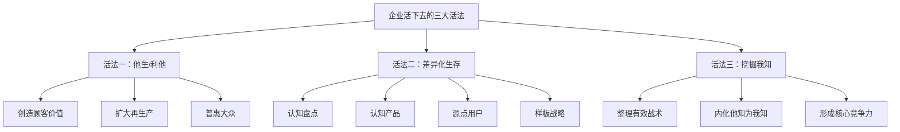
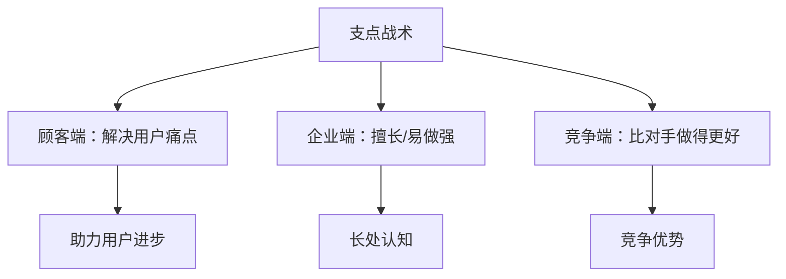
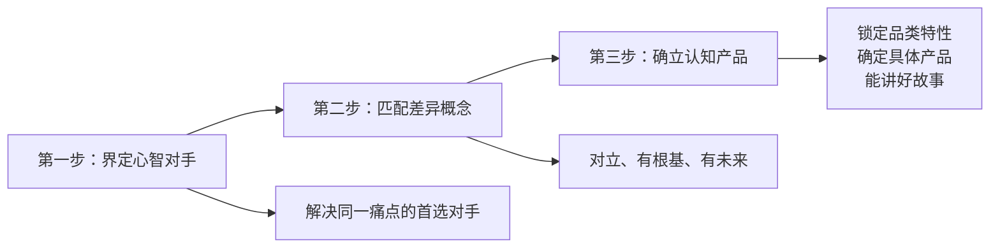
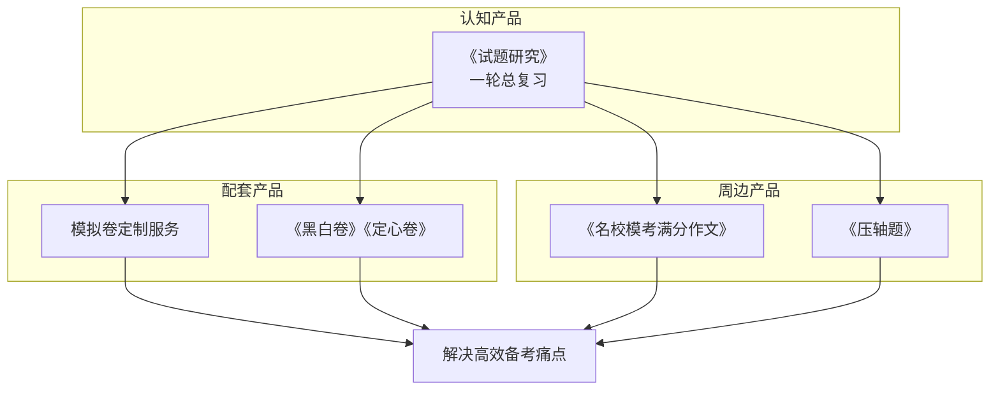
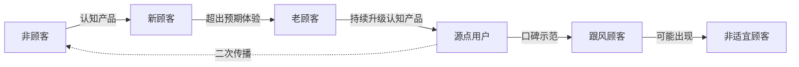
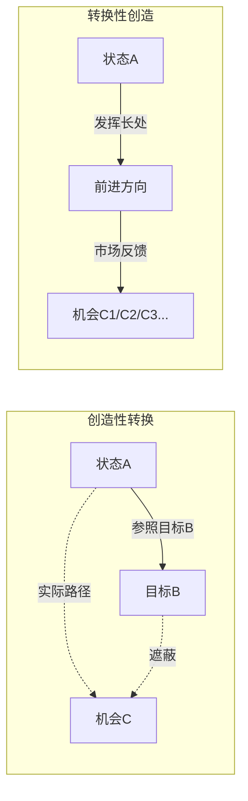
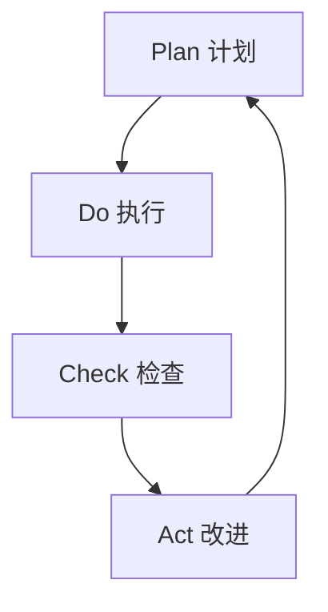
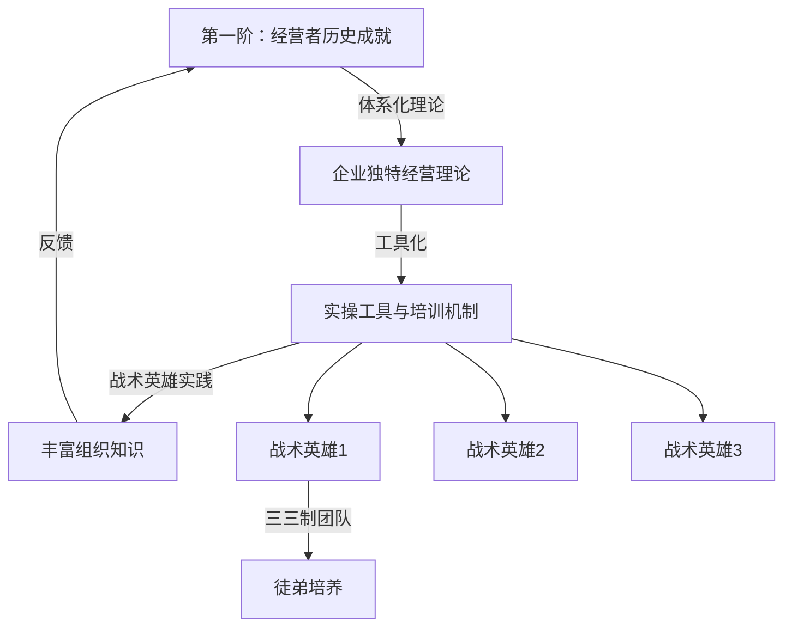

# 《认知产品》章节总结

## 书籍信息
- 书名：认知产品
- 作者：谈云海
- 出版社：机械工业出版社
- 出版时间：2024年5月
- ISBN：9787111743828
- 字数：102千字

## PDF/OCR 状态
说明：本书内容基于提供的文本文件，已完整识别。部分图片引用（如images/xxx.png）无实际图像数据，但文本描述可支撑流程图重建。所有图表基于文本描述重构。

## 目录说明
- 推荐序一：企业的命脉：“认知产品”
- 推荐序二：“认知产品”是企业的生存之道
- 推荐序三：我的“认知产品”实践故事
- 前言
- 导读：企业如何活下去
- 第一章：单一认知，多元经营
- 第二章：什么是认知产品
- 第三章：为何要强推认知产品
- 第四章：如何挖掘用户痛点，确定认知产品
- 第五章：如何经营认知产品
- 第六章：为何升级认知产品
- 第七章：谁来负责认知产品
- 跋：“活”出企业自己

## 全书核心主题
本书以“认知产品”——描述品牌差异化概念的具象产品——为核心概念，将传统定位理论由“心智定位”升级为“痛点定位”。作者提出：对内发挥企业独特长处，对外助力特定用户持续进步，是企业活下去的关键。全书围绕认知产品，从认识企业长处、发掘源点用户、洞察用户痛点、创建品牌认知、建立样板市场等角度，建立企业与市场的深度连接。并探讨了企业基业长青的三大核心法则：“他生”/“利他”是企业生存的根本；立足企业长处的差异化生存是企业生存的保障；经由“有效”实践习得的独特“我知”是企业生存的核心竞争力。

---

## 推荐序一：企业的命脉：“认知产品”

### 核心论点
- **问题**：企业如何从复杂的多元经营中抓住核心，实现可持续生存？
- **观点**：谈云海博士提出的“认知产品”“源点用户”“样板市场”三要素，让品牌塑造落实到实操层面。认知产品是企业的生命，源点用户是企业成长的源头活水，样板市场是企业的家和实验室。

### 关键概念/事件
- **认知产品**：最能体现品牌差异化价值、超越所有竞争对手的产品，是企业必须做到极致的大单品。
- **源点用户**：识别并持续消费品牌差异、自身获得持续进步的用户，是企业最忠实的粉丝。
- **样板市场**：源点用户密度大、可探索成功商业模式的区域市场，是企业的“家”和实验室。
- **“一”思维**：产品的“一”是认知产品，用户的“一”是源点用户，市场的“一”是样板市场。企业要找到自己的“一”并做到最好。

### 逻辑推演
武泽涛（万唯教育集团董事长）从自身实践出发，指出企业常陷入产品繁多、运营复杂的困境。谈博士的三要素理论让企业找到“一”：先有一个超越所有对手的产品，再不断创新迭代、拉大差距。企业不能盲目打造第二个这样的产品，而应先把第一个做到极致。同时，源点用户和样板市场提供了成长的源头和实验基地。

### 经典金句
> “做企业就是要找到企业的那个‘一’，并把它做到最好、做到极致，这样就有可能打造一家优秀的企业。”
> “一旦企业凭借大单品建立起强大的品牌认知，就如同进入了摆脱地球引力的轨道。”

---

## 推荐序二：“认知产品”是企业的生存之道

### 核心论点
- **问题**：企业如何在“专一”与“多元”之间平衡，并找到生存的意义？
- **观点**：“认知产品”不仅构建品牌认知，更赋予企业新的使命：用企业长处解决用户痛点，助力用户持续进步，赋能员工成长。这蕴含着企业的生存之道。

### 关键概念/事件
- **单一认知，多元经营**：帮助企业厘清专业化发展与多元化经营之间的逻辑关系。
- **企业生存哲学**：如何活——活在差异化的顾客认知上；为什么活——以助力用户进步为己任；活得怎样——认清自身、发扬长处。
- **利他生存之本**：引自《道德经》“天地所以能长且久者，以其不自生，故能长生”。

### 逻辑推演
王淑琴（山西潞安府潞绸集团董事长）回顾企业转型，谈博士的理论让他们从绝境中找到希望。企业的“认知产品”从表象看是具象产品，深究则蕴含生存之道。立足长处利他，才是生存之本，并指引用东方智慧探寻新商业文明：企业之间互生共荣，动态竞争、价值共创。

### 经典金句
> “企业如何活：企业应该活在差异化的顾客认知上。企业为什么活：以助力用户进步为己任，是企业生存的意义。企业活得怎样：认清企业自身是基础，发扬企业长处是战略。”

---

## 推荐序三：我的“认知产品”实践故事

### 核心论点
- **问题**：创业者如何通过认知产品创建品牌？
- **观点**：解决用户痛点是发现认知产品的最重要动力；好产品需要率先进入新品类、新赛道；认知产品需要有视觉竞争力、有场景、有颜值。

### 关键概念/事件
- **痛点就是使命**（谈博士）与“问题就是品类”（《成为独角兽》）相通。
- **德高防水**：通过“K11”防水产品建立品牌认知，成为同行模仿对象。
- **丰胜花园木**：港珠澳大桥户外地板项目被央视报道，仿旧地板成为认知产品。
- **懒猫木阳台**：将“花园阳台”确定为认知产品，提出“没有别墅，也可以给孩子一个花园”。

### 逻辑推演
吴海明（丰胜花园木董事长）分享三次创业经历：悉尼创业时因一款独特地砖赢得客户信任；回国推广德高，意外发现“K11”防水产品成为明星，顺势转型；为丰胜策划认知产品，从凉亭到仿旧地板取得成功；创建懒猫木阳台，最终确定“花园阳台”为认知产品。总结规律：痛点驱动、新赛道差异化、有颜值的产品更易成功。

### 经典金句
> “对于企业来说，选取认知产品需要考虑具有视觉竞争力、有场景、有颜值的产品，这样的产品才能获得顾客的关注。”

---

## 前言

### 核心论点
- **问题**：如何从“认知产品”概念出发，构建企业从品牌传播到内部经营、人才培养的完整体系？
- **观点**：“认知产品”不只是一个产品概念，它是企业建立与外部市场深度连接的支点，是搭建有序经营模式（认知+配套+周边）的核心，是培养人才梯队、发掘战术英雄的平台，也是回答企业“如何活、为什么活、活得怎样”的哲学钥匙。

### 关键概念/事件
- **源点用户**：识别并持续消费品牌差异，且自身获得持续进步的用户。
- **二次传播**：市场自发形成的口碑传播，区别于广告等“一次传播”。
- **我知**：经由个体实践习得的知识，知行合一的那部分内容。
- **转换性创造**（李泽厚）：区别于“创造性转换”，企业只能从自身实际出发，走出自己的路。
- **认知+配套+周边**产品结构形态：认知产品建立认知，配套产品协同解决痛点，周边产品满足源点用户多样需求。

### 逻辑推演
作者回顾“认知产品”概念的提出历程（2014年课程，2017年出版《认知战：30秒讲好品牌故事》）。经过多年深度服务企业，他意识到仅靠品牌传播不够，需要深入企业内部经营，从“用户故事”“有效战术”“我知”中挖掘企业长处和用户痛点。同时，认知产品承担着培养人才的任务：围绕认知产品持续创新，能激发群体性创造（美第奇效应），涌现战术英雄。最终，作者提出企业发展战略的实质：在内发挥长处，在外助力用户持续进步。第一步是盘点出体现长处且支持用户进步的认知产品，作为战略支点。

### 经典金句
> “在内发挥企业独特的长处，在外助力特定用户的持续进步，这就是企业发展战略的实质。”
> “认知产品”是一种经营视角，以最终成果（顾客认知）为经营方向，“以终为始”来思考产品的定位。
> “知止而后有定，定而后能静，静而后能安，安而后能虑，虑而后能得。”

---

## 导读：企业如何活下去

### 核心论点
- **问题**：企业战略的最高目标是活下去，但多数企业难以长久。企业应该如何活下去？
- **观点**：提出三大长久活法——①“他生”/“利他”是企业生存的根本；②立足企业长处的差异化生存是企业生存的保障；③深度挖掘经由“有效”实践习得的独特“我知”是企业生存的核心竞争力。

### 关键概念/事件
- **决定判断力**（康德）：将一般原理运用到特殊事例的能力，只能通过实践获得。
- **反思判断力**（康德）：由特殊到一般，从成功实践中整理出规律性认知。
- **他生 vs 自生**：老子“天地所以能长且久者，以其不自生”，德鲁克“企业的目的在于创造消费者”，稻盛和夫“利他就是最大的利己”。
- **认知盘点**：从企业历史的有效实践中理解组织长处和解决的用户痛点，系统整理“我知”。

### 逻辑推演
企业活不下去的原因常是向外求、模仿标杆、忽视自身长处。作者指出，没有企业能挣到超出认知范围的钱。企业只能依靠“能做什么”的有效实践赢得竞争。赢得竞争靠的是个性独特能力，而非共性能力。经营者应向内求“明心见性”，认识自身长处和知识局限。随后展开三大活法：利他（他生）是根本；差异化生存是保障；挖掘“我知”是核心竞争力。

### 流程图

### 经典金句
> “天长地久。天地所以能长且久者，以其不自生，故能长生。” ——老子
> “企业的目的不在于创造利润，而在于创造消费者。” ——德鲁克
> “利他就是最大的利己。” ——稻盛和夫

---

## 第一章：单一认知，多元经营

### 核心论点
- **问题**：长期困扰经营者的“聚焦与多元如何平衡”如何解决？
- **观点**：通过“单一认知，多元经营”理念平衡。三层解读：①单一的长处认知，辅助多元经营的能力；②单一源点用户认知，辐射多元跟风顾客；③用认知产品建立新顾客的单一认知，其他多元产品满足老顾客的多样需求。

### 关键概念/事件
- **单一认知，多元经营**：在顾客认知层面聚焦，在物理经营层面保持多元。
- **战术盘点**：从“有效战术”中盘点企业长处和用户痛点的工具。
- **痛点**（作者定义）：用户持续进步的个性需求。
- **源点用户**：市场中的“关键少数”，率先尝试消费并影响他人。
- **用户进步**（克里斯坦森）：在特定情境中想要获得的进步。

### 逻辑推演
企业多元经营常导致认知障碍：①难认清自身长处；②对顾客理解含糊；③对产品理解肤浅。作者主张先立后破：先通过创造市场主动选择倒逼聚焦。企业应通过市场表现、复盘分析、战术盘点来识别长处。顾客方面，不要依赖大数据和用户画像，而要关注“源点用户”这一关键少数。产品方面，企业常只做表面功夫（调研泛、关注对手胜过顾客），应转向从“用户进步”角度理解产品，将“用户痛点”视为持续进步的个性需求，并以此确定认知产品。

### 经典金句
> “各企业都必须有核心领域，并在此领域占有领导地位。因此，企业必须专业化。不过，企业还必须努力从专业化中获得最大的利益。也就是说，企业要多元化。” ——德鲁克
> “完美的人就是没用的人。” ——任正非
> “顾客不是要买一个‘钻头’，而是需要用钻头打一个‘洞’。”

---

## 第二章：什么是认知产品

### 核心论点
- **问题**：企业的真正成果是什么？品牌认知如何建立？认知产品如何定义？
- **观点**：企业的成果是品牌认知（在顾客心智中占据的差异化概念）。认知产品是描述品牌差异化概念的具象产品。品牌概念宜小不宜大。认知产品是品牌定位的具象化载体。

### 关键概念/事件
- **品牌定位**：让品牌在顾客心智中占据一个差异化概念。
- **认知产品**：描述品牌差异化概念的具象产品（如茅台飞天茅台、奔驰S600、万唯《试题研究》）。
- **品牌认知的排他性**：一个概念只能被一个品牌占据，一个品牌只能占据一个概念。
- **品牌认知的少数性**：品牌只能服务部分顾客，无法取悦所有人。
- **认知成本**：企业获得成果的最大障碍，包括打消顾客质疑、引导尝试消费的成本。

### 逻辑推演
从德鲁克“成果在外部”到特劳特“心智之战”，作者强调品牌认知才是企业真正的成果。顾客认知大于事实，甚至创造事实。品牌认知具有排他性和少数性，因此概念宜小不宜大（小概念更容易进入心智）。大概念导致认知同质化、易被攻击、难以形成统一二次传播。作者提出“认知产品”作为描述差异化概念的具象产品，命名要站在顾客角度（区别于“招牌产品”“流量产品”等企业视角命名）。

### 经典金句
> “品牌定位=让品牌在顾客心智中占据一个差异化概念。”
> “认知产品=描述品牌差异化概念的具象产品。”
> “认知大于事实，认知强化事实，认知创造事实。”
> “概念越小，企业越容易被顾客识别；概念越小，企业团队越容易达成共识；概念越小，企业收获的市场反而越大。”

---

## 第三章：为何要强推认知产品

### 核心论点
- **问题**：如何理解“满足顾客需求”？认知产品不清晰有何后果？如何用认知产品拓展新客户？
- **观点**：不管新顾客有何需求，企业一律强推认知产品。用同一个认知产品去满足不同顾客的需求。企业要先有“聚焦”，后有“多元”。

### 关键概念/事件
- **低价拓客法**：成本高、不可持续，会强化不信任、同质化认知。
- **流量拓客法**：依赖大渠道客户，博弈妥协，无法建立品牌认知。
- **认知产品拓客法**：最具可持续性，能建立品牌差异记忆，带来丰厚利润，源点用户会自发传播。
- **聚焦与多元平衡**：认知聚焦、能力聚焦、顾客聚焦、干部聚焦。先有聚焦，后有多元。

### 逻辑推演
企业常陷入“用不同产品满足不同顾客的不同需求”，导致产品越来越多、经营同质化。作者主张锁定同一类顾客，专注用同一产品挖掘深层需求。认知产品不清晰会导致品牌认知模糊、内耗、难以持续开发客户。三种拓客法中，低价和流量法不可持续，而认知产品拓客法虽然起步慢，但能建立品牌认知、培育源点用户，后期指数增长。聚焦应先发生在认知层面，再落实到能力、顾客、干部上。

### 经典金句
> “不管新顾客有何需求，企业一律强推认知产品。”
> “用同一个认知产品去满足不同顾客的需求。”
> “企业要先有‘聚焦’，后有‘多元’，要聚焦产品、聚焦长处、聚焦顾客、聚焦英雄。”

---

## 第四章：如何挖掘用户痛点，确定认知产品

### 核心论点
- **问题**：什么是用户痛点？如何找到？什么是痛点定位法？如何推进落实认知产品？
- **观点**：用户痛点=用户持续进步的个性需求。通过战术盘点遴选支点战术，锁定用户痛点。用痛点定位三步法（界定心智对手→匹配差异概念→确立认知产品）确定认知产品。

### 关键概念/事件
- **用户痛点定义**：用户持续进步的个性需求。分解为五个层次（利我生存、自主掌控、被群体认同、被社会尊重、自我实现）和六个维度（个性小众、更高品质、提升效率、长期持续、获得感和成就感、自我否定）。
- **战术盘点**：三步流程——①从用户故事中盘点有效战术；②遴选支点战术（三轮投票：最擅长、有竞争优势、能解决痛点）；③解读用户痛点。
- **支点战术**：包含三方面信息——顾客端（解决痛点）、企业端（擅长能力）、竞争端（比较优势）。
- **痛点定位三步法**：①界定心智对手（解决同一用户痛点的首选对手）；②匹配差异概念（对立、有根基、有未来）；③确立认知产品（锁定品类特性、确定具体产品、能讲好故事）。
- **高和传媒案例**：从“城市讲旅游故事”→“企业讲品牌故事”→“城市讲招商故事”→“企业家讲故事”，认知产品历经四次调整，最终确定《企业家说》栏目。

### 流程图
**支点战术的三角关系**

**痛点定位三步法**

### 经典金句
> “用户痛点=用户持续进步的个性需求。”
> “痛点即使命。”
> “企业要有痛点焦虑，不要有竞争焦虑。”
> “某一天，当我们不再为我们企业的成功彻夜难眠，而开始为我们顾客的成功辗转反侧时，我们的企业重新振作的时候就到了。” ——《你的顾客需要一个好故事》

---

## 第五章：如何经营认知产品

### 核心论点
- **问题**：认知产品只是用来构建品牌认知的吗？如何平衡当下与未来？如何构建产品结构秩序？
- **观点**：认知产品是企业经营的主角，承载七项任务。企业应以“认知+配套+周边”构建产品结构秩序，实现力出一孔。

### 关键概念/事件
- **认知产品七项任务**：传播投放统一认知、深度调研挖掘痛点、渠道重构发掘源点用户、持续创新升级组织认知、追溯源头塑造产业生态、打造平台培育战术英雄、开放协作构建行业统一战线。
- **认知+配套+周边结构**：
  - 认知产品：描述差异化概念，建立品牌认知。
  - 配套产品：协同解决用户痛点（如万唯的模拟卷、潞安府的家居潞绸小被）。
  - 周边产品：满足源点用户多样需求（寄生关系）。
- **品牌成本**：认知产品的研发和广告费用应作为品牌成本，20%计入认知产品，80%分摊到其他产品。
- **六类顾客群体**：非顾客→新顾客→老顾客→源点用户→跟风顾客→非适宜顾客。
- **万唯中考产品结构图**（见流程图）

### 流程图
**万唯中考系列教辅图书产品结构图**

**品牌成长过程中的六类顾客群体**

### 经典金句
> “产品结构有秩序是一种美，也是企业的生产力。”
> “企业应该围绕‘认知+配套+周边’来设计产品结构。”
> “企业经营以认知产品为主角，可以做到力出一孔。”
> “配套产品=协同解决用户痛点的产品；周边产品=满足源点用户多样需求的产品。”

---

## 第六章：为何升级认知产品

### 核心论点
- **问题**：企业为何“加个不休”？为何要在认知产品上持续创新？如何升级？品牌拓界有何原则？
- **观点**：企业“加个不休”源于短板归因。长处归因才能获得真正成长。应在认知产品上做持续创新，用“转换性创造”思维升级创新。品牌拓界遵循三大原则：主导、信任、英雄。

### 关键概念/事件
- **短板归因 vs 长处归因**：短板归因导致不断补短、陷入“加个不休”；长处归因聚焦小亮点、持续强化己之长。
- **任正非论创新**：“只允许员工在主航道上发挥主观能动性”；“站在前人的肩膀上，做出成绩才是伟大的”。
- **创造性转换 vs 转换性创造**（李泽厚）：前者以他人为参照、弥补差距；后者以自身为出发点、发挥长处、自我超越。
- **品牌拓界三原则**：
  - 主导原则：认知产品是否已实现心智主导？
  - 信任原则：新产品是否解决用户问题？是否在认知产品代表的痛点品类范畴内？
  - 英雄原则：战术英雄的能力在哪里，品牌的边界就在哪里。
- **灰度理论**（任正非）：方向在混沌中产生，合理掌握灰度。

### 流程图
**创造性转换与转换性创造的图示**

### 经典金句
> “长处归因才能让企业获得真正的成长。”
> “不要追求什么原创发明、自主创新，站在前人的肩膀上，做出成绩才是伟大的。” ——任正非
> “你打你的，我打我的。”
> “主导原则、信任原则、英雄原则是品牌拓界的三原则。”

---

## 第七章：谁来负责认知产品

### 核心论点
- **问题**：量化考核如何落实到人？谁能负责认知产品？企业最重要的产品是什么？
- **观点**：“人”具有不可量化的部分（非理性、创造性、成长性）。经营者应负责认知产品。战术英雄是企业最重要的产品。人是起点，更是目的。

### 关键概念/事件
- **人的不可量化**：非理性（有限理性、损失规避）、创造性（来源于偶然性、意外性）、成长性（无法预设路径）。
- **能对产品负责者的特质**：全局思维、利他思维、亮点思维、支点思维、“他知”思维、善于自我归因、乐于自我革新。
- **经营者负责认知产品**：认知产品承载企业战略，经营者注意力在哪里，成果就在哪里。
- **用“事”成就“人”**：以“人的成长”为终极目标，而非“事上成功”。
- **组织成长三阶模型**：第一阶：经营者历史成就→体系化理论；第二阶：理论工具化；第三阶：战术英雄实践丰富组织知识。
- **三三制**：战术英雄 + 政委搭档 + 小白徒弟，以师徒制培养接班人。
- **战术英雄是企业最重要的产品**：品牌拓界的英雄原则——战术英雄的能力在哪里，企业的边界就在哪里。

### 流程图
**基于全面质量管理的PDCA循环图**

**组织成长三阶模型**

### 经典金句
> “在你成为领导者之前，成功都和你自己的成长有关。在你成为领导者之后，成功都与让别人成长有关。” ——杰克·韦尔奇
> “战术英雄是企业最重要的产品。”
> “人是起点，更是目的。”
> “康德：人是目的，不是手段。”

---

## 跋：“活”出企业自己

### 核心论点
- **问题**：企业如何回答“如何活”“为什么活”“活得怎样”三大哲学课题？
- **观点**：企业应立足于“认识自己”，以发挥长处回答“如何活”，以助力用户进步回答“为什么活”，以认知产品持续升级和人才接力培养回答“活得怎样”。活出自己的路，活出自信和从容。

### 关键概念/事件
- **如何活**：放大企业长处，创造差异化，实现差异化生存。
- **为什么活**：解决用户痛点，助力用户持续进步（利他），这是“公共理性”和最大公约数。
- **活得怎样**：不被贪欲异化，在“转换性创造”中收获自信，在“有效”实践中实现组织知识成长。
- **情本体**（李泽厚）：用户持续进步是对用户的“情”，自我成长是对组织的“情”。

### 逻辑推演
西方商业伦理多基于“利己”基因，易导致非理性伤害。中华文化强调“利他”作为公共理性。企业最大的敌人是自己的贪欲。焦虑和内卷源于以他人为标杆的“创造性转换”。企业应转向“转换性创造”，以自身为出发点，发挥长处，实现自我超越。认知产品是连接“如何活”“为什么活”“活得怎样”的桥梁。

### 经典金句
> “认识你自己。” ——希腊阿波罗神庙箴言
> “企业最大的敌人或对手不是他人，而是自己的贪欲。”
> “只要不执着、不拘泥、不束缚于那些具体事件对象、烦忧中，那么，‘四时佳兴与人同’‘日日均好日’，你为什么不去好好地欣赏和‘享受’这生活呢？” ——李泽厚
> “哲学不提供知识，而是转换、更新人的知性世界。” ——李泽厚

---

> 说明：本书内容基于提供的文本完整整理。部分插图（如图4-1、5-1、5-2、6-1、7-1）已按文本描述重建为Mermaid流程图。所有核心概念、论点、金句均忠实于原文。