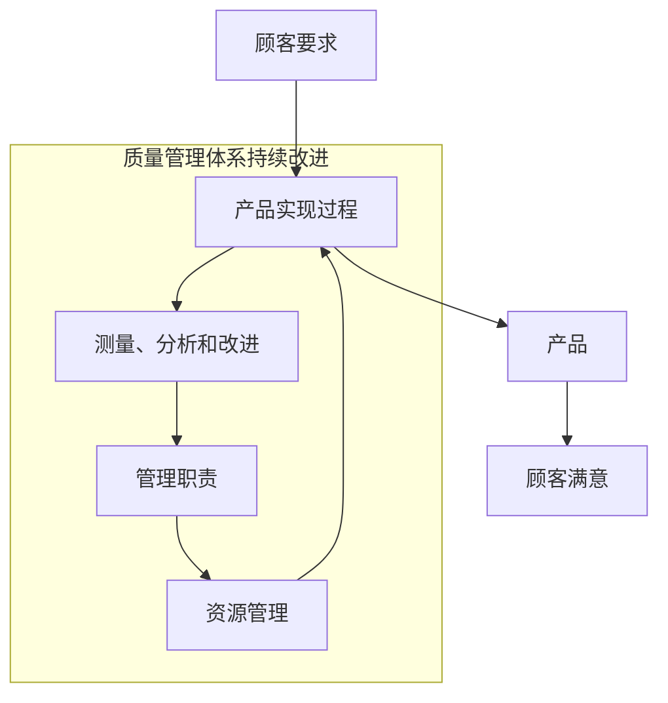
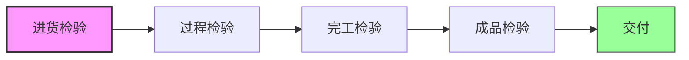
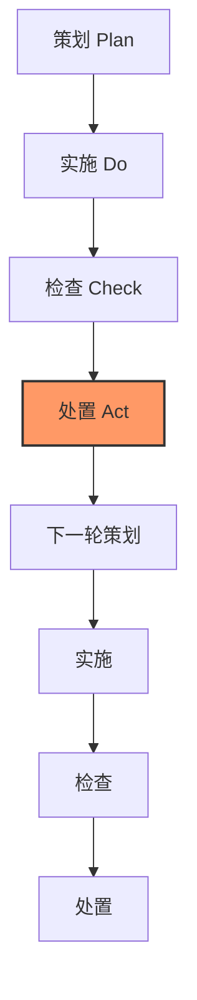
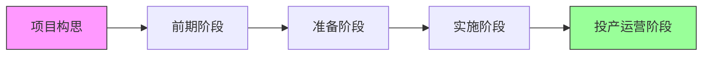
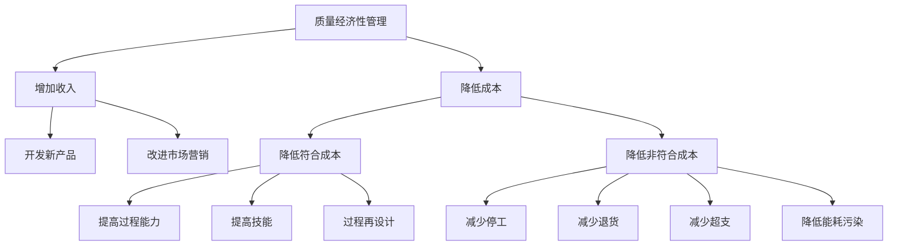
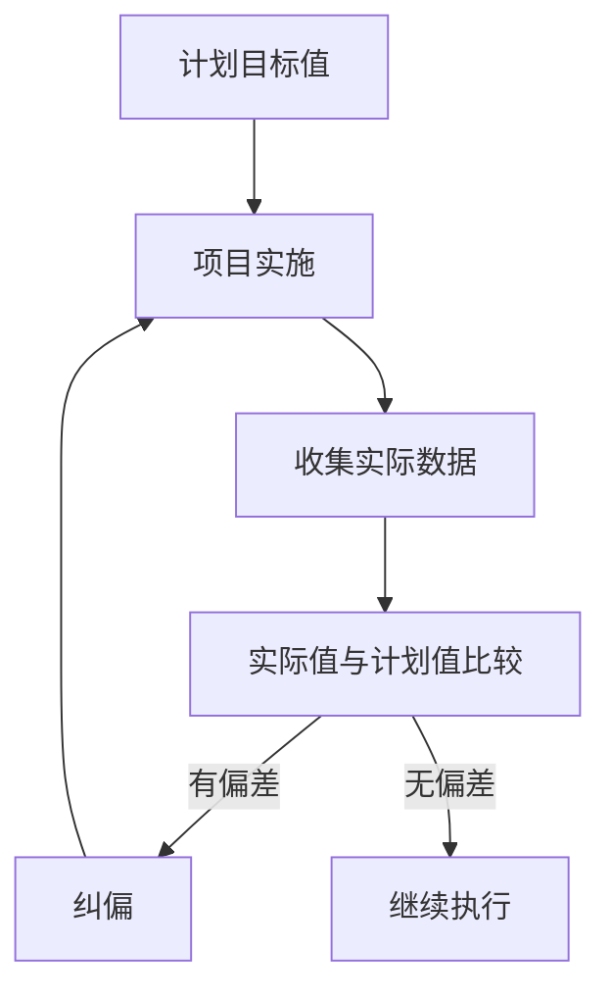

# 《质量专业综合知识(中级)》章节总结

## 书籍信息
- 书名：《质量专业综合知识(中级) 2014年修订版》
- 作者：全国质量专业技术人员职业资格考试办公室 组织编写
- PDF 状态：扫描版，文字可识别，页码连续
- OCR 状态：基本完整，部分表格和图片可能存在错位，但核心内容可读

## 目录说明
- 目录识别情况：完整识别，共九章及附录（模拟试卷、考试大纲）
- 章节对应依据：PDF 页码与目录一致
- OCR 修复说明：部分表格（如质量成本构成表）需调整列宽，但数据完整；流程图以文字描述为主，未丢失关键信息

## 全书核心主题
本书是质量专业中级资格考试的核心教材，系统阐述了质量管理的理论、方法和实践。全书从质量的基本概念出发，涵盖质量管理体系、质量检验、计量基础、供应商质量控制、顾客关系管理、卓越绩效评价、质量改进等核心模块。内容强调理论与实务结合，注重培养质量管理人员的综合能力，包括质量策划、控制、保证、改进以及经济性分析、标准化、职业道德等。本书既是考试用书，也是企业质量管理实践的参考指南。

---

## 第1章：质量管理概论

### 核心论点
本章是全书的理论基础，主要解决“什么是质量”“如何系统管理质量”的问题。作者认为：质量是“一组固有特性满足要求的程度”，质量管理必须从全局出发，通过方针目标管理、质量经济性分析、信息管理、教育培训、标准化等基础工作，构建系统化的质量管理体系，并最终导向卓越绩效。

### 关键概念/事件
- **质量的概念**：固有特性满足要求的程度；特性分为固有与赋予；要求包括明示的、通常隐含的、必须履行的。
- **质量管理**：在质量方面指挥和控制组织的协调活动，包括质量方针、质量目标、质量策划、质量控制、质量保证、质量改进。
- **朱兰三部曲**：质量策划、质量控制、质量改进。
- **戴明14条原则**：强调管理责任、停止依赖检验、持续改进等。
- **卓越绩效评价准则(GB/T 19580)**：用于组织自我评价和质量奖评价，包含7个类目（领导、战略、顾客与市场、资源、过程管理、测量分析与改进、结果）。

### 逻辑推演
本章从质量的基本定义入手，区分了符合性质量、适用性质量和广义质量。接着引入管理职能和质量管理发展史（检验阶段→统计控制阶段→全面质量管理阶段），引出质量管理八项原则。然后详细阐述方针目标管理（制定、展开、动态管理、考评）、质量经济性分析（质量成本PAF模型、劣质成本）、质量信息管理（信息流、信息系统）、质量教育培训（意识、知识、技能）以及标准化（标准分级、标准形式、采用国际标准、WTO/TBT协议）。最后介绍卓越绩效评价准则的结构、理念和评价方法，并简要说明产品质量法和职业道德要求。整章逻辑从微观到宏观，从基础到前沿。

### 经典金句/数据
> “质量是构成社会财富的关键内容。” (p.1)
> “21世纪是质量的世纪。” ——朱兰博士 (p.3)
> “控制图就是运用数理统计原理进行预防的工具。” (p.22)
> 卓越绩效评价准则满分1000分，500分为基本成熟，获奖者得分在600~750分之间 (p.71)

---

## 第2章：供应商质量控制与顾客关系管理

### 核心论点
本章聚焦质量管理体系的输入（供应商）和输出（顾客）。作者认为：企业必须与供应商建立互利共赢的合作伙伴关系，通过供应商选择、审核、业绩评定实现动态管理；同时要以顾客为中心，识别顾客要求，测量顾客满意，并运用顾客关系管理（CRM）提升顾客忠诚度。

### 关键概念/事件
- **供应商关系模式**：竞争关系（价格驱动、短期合同）与合作伙伴关系（信息共享、长期合作、共同开发）。
- **供应商审核**：产品审核、过程审核、质量管理体系审核；审核顺序：产品→过程→体系。
- **供应商选择方法**：直接判断法、招标法、协商选择法、采购成本比较法、层次分析法、质量与价格综合选优法。
- **顾客满意**：可感知效果与期望的差异函数；Kano模型（理所当然质量、一元质量、魅力质量）。
- **中国顾客满意指数(CCSI)**：包含品牌形象、预期质量、感知质量、感知价值、顾客满意度、顾客忠诚六个结构变量。

### 逻辑推演
首先分析供应商产品质量对企业的影响，对比竞争关系与合作伙伴关系的特征，阐述如何选择供应商（自产/外购决策、供应商分类、基本情况调查、审核、评价）。接着说明供应商动态管理（业绩评定指标、评级A/B/C/D、订单分配策略）。然后转向顾客满意，讲解顾客识别、SIPOC图、顾客要求识别、Kano模型和满意度测评。最后介绍顾客关系管理的含义、内容、技术类型（运营型、分析型、协作型）以及CRM与满意度持续改进的关系。

### 经典金句/数据
> “没有顾客就没有市场，就没有组织效益。” (p.37)
> 许多企业产品质量问题有85%是由供应商提供的零部件引起的 (p.86)
> Kano模型：魅力质量不充足时顾客无所谓，充足时十分满意；理所当然质量不充足时很不满意，充足时无所谓。

---

## 第3章：质量管理体系

### 核心论点
本章系统介绍ISO 9000族标准，阐述如何建立、实施、保持和持续改进质量管理体系。作者强调：质量管理体系是全面质量管理的实施细则，通过过程方法、管理的系统方法、八项质量管理原则等，帮助组织稳定提供满足要求的产品，并增强顾客满意。

### 关键概念/事件
- **质量管理体系特征**：总体性、关联性、有序性、动态性。
- **质量管理八项原则**：以顾客为关注焦点、领导作用、全员参与、过程方法、管理的系统方法、持续改进、基于事实的决策方法、与供方互利的关系。
- **ISO 9000族核心标准**：GB/T 19000（基础和术语）、GB/T 19001（要求）、GB/T 19004（持续成功指南）、GB/T 19011（审核指南）。
- **文件要求**：质量手册、形成文件的程序（6项：文件控制、记录控制、内部审核、不合格品控制、纠正措施、预防措施）、记录（22项）。
- **管理评审输入/输出**：输入包括审核结果、顾客反馈、过程业绩等；输出包括体系改进、产品改进、资源需求。

### 逻辑推演
从体系、管理体系、质量管理体系定义出发，引出质量管理体系的四个特性。然后阐述八项质量管理原则及其在组织中的应用。接着介绍ISO 9000族标准的发展历史和核心标准。之后详细解读GB/T 19001的各条款：范围、总要求、文件要求、管理职责、资源管理、产品实现（策划、顾客相关过程、设计开发、采购、生产服务提供、监视测量设备）、测量分析和改进（监视测量、不合格品控制、数据分析、改进）。最后说明如何建立和实施质量管理体系（原则、主要活动、八个步骤）以及质量管理体系审核（术语、目的、原则、主要活动、与认证的区别）。

### 流程图（Mermaid重建）

### 经典金句/数据
> “质量管理八项原则是ISO 9000族标准的基础。” (p.127)
> “质量手册是规定组织质量管理体系的文件，具有唯一性。” (p.134)
> “内部审核和管理评审都是组织自我评价、促进自我改进机制的手段。” (p.145)

---

## 第4章：质量检验

### 核心论点
本章阐述质量检验的基本知识、技术方法、机构设置、检验计划、不合格品控制及检验质量控制。作者强调：质量检验具有鉴别、把关、预防和报告四大功能，是质量管理不可或缺的环节，但检验不能提高产品固有质量，只能验证符合性。

### 关键概念/事件
- **质量检验步骤**：检验准备→获取样品→样品制备→测量试验→记录描述→比较判定→确认处置。
- **检验技术方法**：理化检验（物理、化学）、感官检验（分析型、嗜好型）、生物检验（微生物、动物毒性）、在线检测（主动测量、自动测量）。
- **检验站类型**：进货检验站、工序检验站（分散式/集中式）、完工检验站（开环分类式/开环处理式/闭环处理式）。
- **不合格严重性分级**：A类（极重要）、B类（重要）、C类（一般）。
- **不合格品处置**：纠正（返工、降级、返修）、报废、让步。

### 逻辑推演
首先定义质量检验，说明其基本要点和主要功能（鉴别、把关、预防、报告）。然后介绍检验的七个步骤和产品验证、监视的概念。接着分类介绍理化检验、感官检验、生物检验、在线检测的原理和适用场合。之后转向质量检验机构，明确其工作范围、权限、责任以及设置模式（集中管理型、集中与分散相结合）。再讲解检验站设置原则、分类和特点。然后阐述质量检验计划（概念、内容、作用）、检验流程图、检验手册和检验指导书。接着说明质量特性分析表和不合格严重性分级。最后详细说明不合格品控制程序（判定、隔离、处置、纠正措施）以及检验误差来源和质量控制方法。

### 流程图（Mermaid重建）

### 经典金句/数据
> “质量把关是质量检验最重要、最基本的功能。” (p.165)
> “任何检测都会有检测误差产生，检测误差是质量检验结果的质量综合表征。” (p.202)
> “检验人员一般只能发现实际存在缺陷的80%，其余的20%会被漏掉。” (p.204)

---

## 第5章：计量基础

### 核心论点
本章介绍计量的基本概念、计量单位、测量仪器、测量结果与准确度、测量不确定度以及测量控制体系。作者强调：计量是实现单位统一、量值准确可靠的活动，是质量管理的重要基础；测量不确定度是对测量结果质量的定量表征，必须学会评定和报告。

### 关键概念/事件
- **计量的分类**：科学计量（基础性）、工程计量（工业应用）、法制计量（强制管理）。
- **计量特点**：准确性、一致性、溯源性、法制性。
- **校准与检定**：校准是非强制性的，确定示值与标准值的关系；检定是法定的，必须合格/不合格结论。
- **测量不确定度**：标准不确定度（A类/B类）、合成标准不确定度、扩展不确定度。
- **测量控制体系**：测量设备的计量确认 + 测量过程实施的控制。

### 逻辑推演
从计量的定义和内容出发，区分科学计量、工程计量、法制计量，阐述计量的四个特点。然后介绍我国计量法律、法规体系及《计量法》基本内容。接着讲解量值溯源、校准和检定的区别。之后详细说明法定计量单位的构成（SI基本单位、导出单位、倍数单位、并用的非SI单位）和使用规则。然后介绍测量仪器的分类、计量特性（标称范围、量程、测量范围、额定操作条件、极限条件、参考条件、示值误差、最大允许误差、灵敏度、分辨力、稳定性、漂移）及选用原则。再讲解测量结果与测量误差、准确度、精密度、重复性、再现性。最后重点阐述测量不确定度的来源、评定方法（A类/B类）、合成、扩展以及测量控制体系的建立。

### 经典金句/数据
> “计量既属于测量而又严于一般的测量。” (p.212)
> “测量不确定度是测量结果质量的定量表征。” (p.229)
> “六西格玛质量水平对应的不合格品率为3.4 ppm。” (p.214)

---

## 第6章：质量改进

### 核心论点
本章是质量管理的实践应用，阐述质量改进的概念、步骤、组织、工具、QC小组活动和六西格玛管理。作者认为：质量改进是消除系统性问题、提高质量保证能力的过程，必须遵循PDCA循环，运用多种统计工具，并建立全员参与的组织机制。

### 关键概念/事件
- **质量改进步骤**：选择课题→掌握现状→分析问题原因→拟定对策并实施→确认效果→防止再发生和标准化→总结。
- **质量改进工具**：因果图、排列图、直方图、头脑风暴法、树图、PDPC法、网络图、矩阵图、亲和图、流程图、水平对比法。
- **QC小组**：自主性、群众性、民主性、科学性；组建原则（自愿参加、上下结合；实事求是、灵活多样）。
- **六西格玛管理**：DMAIC流程（定义、测量、分析、改进、控制）；角色（执行领导、倡导者、黑带大师、黑带、绿带）；度量指标（西格玛水平、DPMO、流通合格率）。

### 逻辑推演
先对比质量改进与质量控制的区别（目的、手段、重点）。然后详细讲解PDCA循环（计划、实施、检查、处置）及其特点（完整性、大环套小环、不断上升）。接着按七步骤逐一说明每个阶段的工作内容、注意事项和常用工具。然后介绍质量改进的组织形式（管理层/实施层）、不同层次的职责以及持续改进的制度化措施。之后分类介绍因果图、排列图、直方图等10多种工具的原理、绘制方法和应用场景。再讲解QC小组的组建、活动推进、成果评审和激励。最后介绍六西格玛管理的统计含义、度量指标、关键角色和DMAIC改进流程。

### 流程图（Mermaid重建）

### 经典金句/数据
> “质量改进是质量管理的一部分，致力于增强满足质量要求的能力。” (p.182)
> “PDCA循环是质量改进的基本过程，最早由休哈特提出，后由戴明传到日本，也称戴明环。” (p.196)
> “六西格玛质量水平是指正态分布从-6σ到+6σ均在规范下限到规范上限范围内。” (p.214)

---

## 附录：质量专业理论与实务(中级)辅导与训练（略）

> 说明：该辅导训练书主要为练习题和模拟测试，结构与教材章节对应，此处从略。如需详细习题，可另行提取。

---

# 《工程项目组织与管理》章节总结

## 书籍信息
- 书名：《工程项目组织与管理》(2012年版)
- 作者：全国注册咨询工程师(投资)资格考试参考教材编写委员会
- PDF 状态：扫描版，文字清晰，图表完整
- OCR 状态：良好，部分水印不影响阅读

## 目录说明
- 目录识别情况：完整，共13章及主要参考文献
- 章节对应依据：PDF页码一致
- OCR 修复说明：无重大修复

## 全书核心主题
本书是注册咨询工程师(投资)资格考试的核心教材之一，系统讲述工程项目管理的全过程知识。涵盖工程项目管理概论、主要参与方管理、综合管理、范围管理、组织管理、人力资源管理、招标投标管理、合同管理、进度管理、费用管理、质量管理、风险管理以及健康安全与环境管理。本书强调理论与实践结合，突出项目管理的系统原理、过程方法和最新的管理模式（如BOT、PFI、PPP、EPC等）。

---

## 第1章：概述

### 核心论点
本章介绍工程项目管理的基础知识，包括工程项目的特征、生命周期、利益相关方、管理模式和发展趋势。作者认为：工程项目管理是运用系统管理和过程管理原理，通过多主体、多阶段的协调控制，实现项目目标。

### 关键概念/事件
- **工程项目特征**：唯一性、一次性、目标明确性、约束性、复杂性。
- **项目生命周期**：前期阶段、准备阶段、实施阶段、投产运营阶段。
- **国际项目管理知识体系**：PMBOK（9大知识领域）、PRINCE2（8类管理要素）、ICB（7大类60细项）。
- **项目管理模式**：业主方管理（自行、委托）、融资管理模式（BOT、PFI、PPP）、承发包模式（DBB、DB、EPC、CM、DBO）。

### 逻辑推演
首先定义工程项目并分类，列举工程项目的五个典型特征。然后划分项目投资建设周期的四个阶段，并说明各阶段的工作重点。接着分析工程项目管理的主体（业主、政府、承包商、银行、咨询工程师）、客体（各项任务）和环境（内部/外部因素）。然后介绍国际上流行的项目管理知识体系（PMBOK、PRINCE2、ICB）。之后重点阐述系统管理原理（目标系统、行为系统、组织系统、管理系统）和过程管理原理（PDCA循环、动态控制）。最后分类讲解业主方管理模式（自行、PM、PMC、CM、代建制、设计-管理）、融资管理模式（BOT、PFI、PPP）和承发包管理模式（DBB、DB、EPC、CM、DBO），并讨论管理模式选择因素及发展趋势（可持续发展、合作伙伴关系、信息化、BIM等）。

### 流程图（Mermaid重建）

### 经典金句/数据
> “工程项目管理是一种多主体的管理。” (p.19)
> “PDCA循环实际上是有效进行任何一项工作的合乎逻辑的工作程序。” (p.31)
> “BOT是一种有限追索权的项目融资方式。” (p.38)

---

（后续章节因篇幅限制，仅列出核心结构，详细内容可按需扩展）

## 第2章：工程项目主要参与方的项目管理
- 业主管理：目的、特点、各阶段任务（决策、准备、实施、竣工）
- 政府管理：作用、特点、主要方面（宏观经济政策、投资管理权限、土地/资源/能源管理、环境保护、安全）
- 承包商管理：目的、特点、主要任务（施工组织、进度质量成本控制）
- 银行管理：贷前管理、贷后管理、项目评估
- 咨询工程师管理：工作阶段（任务取得、组织与实施、总结）、主要任务

## 第3章：工程项目综合管理
- 综合管理框架、目标体系（多元性、相关性、均衡性、层次性、动态性）
- 综合管理计划制订、实施与控制、变更控制
- 绩效评价（KPI、平衡计分卡、赢得值法）

## 第4章：工程项目范围管理
- 范围界定（WBS工作分解结构）
- 范围确认（依据、方法）
- 范围控制（变更令、估价程序）

## 第5章：工程项目管理的组织
- 组织作用与构成、组织设计原则
- 组织结构形式：职能式、项目式、矩阵式、复合式

## 第6章：工程项目人力资源管理
- 人力资源管理过程（组织计划、人员吸纳、考核）
- 项目经理作用、选择、主要工作
- 团队建设（发展过程、能力开发）

## 第7章：工程项目招标投标管理
- 基本原则、法律依据、咨询工程师工作
- 招标范围、程序（施工招标、货物招标）
- 开标、评标、定标、合同签订

## 第8章：工程项目合同管理
- 合同特点、体系（咨询、勘察设计、监理、施工、货物采购）
- FIDIC合同条件（施工合同条件）
- 我国施工合同管理（标准施工招标文件）
- 索赔管理（程序、费用计算）

## 第9章：工程项目进度管理
- 工作定义与顺序安排（网络图、关键路径法）
- 工作时间估算（类比、参数、三点）
- 进度计划编制（甘特图、里程碑、计划评审技术）
- 进度控制（偏差分析、赶工）

## 第10章：工程项目费用管理
- 费用构成（建筑安装工程费、设备工器具费、工程建设其他费）
- 资源消耗计划、费用估算（设计概算、施工图预算、投标报价）
- 费用计划编制（赢值法）
- 费用控制（偏差分析、成本超支应对）

## 第11章：工程项目质量管理
- 质量管理特点、标准（ISO 9000）
- 前期工作质量管理（质量计划、评审）
- 设计阶段质量管理（会签、评审）
- 施工阶段质量管理（依据、监理工程师工作）
- 试运行质量管理

## 第12章：工程项目风险管理
- 风险识别（方法：头脑风暴、德尔菲、SWOT、核对表）
- 定性风险分析（风险量、风险坐标）
- 定量风险分析（敏感性分析、决策树、蒙特卡洛）
- 风险应对计划（规避、转移、减轻、接受）
- 风险监测与控制

## 第13章：工程项目健康、安全与环境管理
- HSE含义、安全生产管理条例
- 安全管理（策划决策、设计、施工）
- 环境管理（环境影响评价、绿色设计、绿色施工）
- 职业健康安全与环境管理体系（标准、建立步骤）

---

> 说明：以上为《工程项目组织与管理》各章核心结构，因全书内容庞大，详细案例、公式、图表未逐一展开。如需某章完整详细总结，可单独提取。

# 《质量专业综合知识(中级)》完整章节总结

## 书籍信息
- 书名：《质量专业综合知识(中级) 2014年修订版》
- 作者：全国质量专业技术人员职业资格考试办公室 组织编写
- PDF 状态：扫描版，文字可识别，页码连续
- OCR 状态：完整，部分表格需调整但数据可读

## 全书核心主题
本书是质量专业中级资格考试的核心教材，系统阐述质量管理的理论、方法和实践。从质量的基本概念出发，涵盖质量管理体系、质量检验、计量基础、供应商质量控制、顾客关系管理、卓越绩效评价、质量改进等核心模块。强调理论与实务结合，培养质量管理人员的综合能力，包括质量策划、控制、保证、改进、经济性分析、标准化及职业道德。

---

## 第1章：质量管理概论

### 1.1 质量的基本知识

#### 核心论点
质量是“一组固有特性满足要求的程度”，具有经济性、广义性、时效性和相对性。质量概念经历了从“符合性”到“适用性”再到“广义质量”的发展。理解质量必须掌握固有特性与赋予特性、明示要求与隐含要求的区别。

#### 关键概念
- **固有特性**：事物本来就有的永久特性（如螺栓直径、机器生产率）。
- **赋予特性**：完成后增加的特性（如价格、保修时间）。
- **要求**：明示的（文件规定）、通常隐含的（惯例）、必须履行的（法律法规）。
- **质量特性**：产品、过程或体系与要求有关的固有特性，可分为关键、重要、一般三级。
- **服务质量特性**：可靠性、响应性、保证性、移情性、有形性。
- **软件质量特性**：功能性、可靠性、易使用性、效率、可维护性、可移植性。

#### 逻辑推演
从GB/T19000定义出发，解释“固有特性”和“要求”的内涵，对比固有与赋予、明示与隐含。然后归纳质量的四个基本特性（经济性、广义性、时效性、相对性）。接着介绍产品概念（过程的结果）及四种通用类别（服务、软件、硬件、流程性材料）。再详细说明质量特性分类及服务质量特性。最后回顾质量概念发展史：符合性→适用性→广义质量，并对比朱兰博士对狭义与广义质量的区分（产品、过程、产业、质量认识等）。

#### 经典金句
> “质量是构成社会财富的关键内容。” (p.1)
> “质量的内涵是由一组固有特性组成，并以满足顾客及其他相关方所要求的能力加以表征。” (p.14)

---

### 1.2 质量管理的基本知识

#### 核心论点
管理包括计划、组织、领导、控制四大职能，不同管理层需要不同技能。质量管理是在质量方面的指挥和控制活动，包括质量策划、质量控制、质量保证、质量改进。质量管理经历了检验阶段、统计控制阶段、全面质量管理阶段。休哈特、戴明、朱兰、石川馨等专家的理念奠定了现代质量管理的基础。

#### 关键概念
- **管理职能**：计划（确立目标、制定策略）、组织（确定机构、分配资源）、领导（激励、指挥）、控制（评估、纠正）。
- **管理层次**：高层（战略、外部联系）、中层（资源利用、监督基层）、基层（日常业务、作业监督）。
- **管理技能**：技术技能、人际技能、概念技能（高层重概念，基层重技术）。
- **质量管理**：制定质量方针和目标，进行质量策划、质量控制、质量保证、质量改进。
- **质量策划**：致力于制定质量目标并规定过程和资源。
- **质量控制**：致力于满足质量要求（设定标准、测量、判定、纠正）。
- **质量保证**：致力于提供满足要求的信任（内部/外部）。
- **质量改进**：致力于增强满足要求的能力。

#### 逻辑推演
先定义管理及四大职能，说明各职能间的关系。然后分析管理幅度与管理层次，介绍扁平化、虚拟扁平化趋势。接着按层次划分管理者及所需技能。之后引入质量管理定义，解释质量策划、控制、保证、改进的区别与联系。再回顾质量管理发展三阶段：质量检验（事后把关）、统计质量控制（预防）、全面质量管理（系统、全员、全过程）。最后总结四位专家的核心理念：休哈特（控制图、PDCA）、戴明（14条原则、管理责任）、朱兰（质量三部曲、质量源于顾客）、石川馨（因果图、TQC、始于教育终于教育）。

#### 经典金句
> “计划是前提，组织是保证，领导是关键，控制是手段。” (p.18)
> “产品质量不是检验出来的，而是生产出来的。” ——休哈特 (p.23)
> “引起效率低下和不良质量的原因主要在公司的管理系统而不在员工。” ——戴明 (p.24)

---

### 1.3 方针目标管理

#### 核心论点
方针目标管理是以行为科学和系统理论为基础，通过制定、展开、动态管理和考评，实现企业经营目标的一种科学管理方法。它强调系统管理、重点管理、措施管理和自我管理。

#### 关键概念
- **方针目标管理**：企业为实现中长期和年度经营方针目标，通过个体与群体的自我控制与协调，实现个人目标从而保证共同成就。
- **特点**：系统管理、重点管理、措施管理、自我管理。
- **制定依据**：顾客需求、市场状况、法律法规、竞争对手、企业中长期规划、上年度问题点等。
- **展开方法**：横向展开（矩阵图）、纵向展开（系统图）。
- **考评方式**：考核（执行过程）、评价（综合结果）、诊断（分析问题、提出改进）。

#### 逻辑推演
首先定义方针目标管理，指出其理论依据（行为科学的激励理论+系统理论）。然后说明其作用（实现经营目的、调动积极性、提高整体素质）。接着阐述制定要求（总方针+目标+措施有机统一，目标有挑战性）和程序（宣传教育→搜集资料→确定问题点→起草建议草案→组织评议→审议通过）。再讲解展开要求（上下级措施与目标对应、量化、展开到考核层）和程序（横向矩阵图、纵向系统图、协调、经济考核、签字）。之后介绍动态管理（下达计划任务书、跟踪分析、信息管理、QC小组活动、人力资源开发）。最后区分考核、评价、诊断的侧重点。

#### 经典金句
> “方针目标管理是将‘以物为中心’转变为‘以人为中心’。” (p.26)
> “班组目标管理的开展是企业方针目标管理的基础环节。” (p.29)

---

### 1.4 质量经济性分析

#### 核心论点
质量问题本质是经济问题。质量经济性管理通过增加收入和降低成本两条途径提高组织效益。质量成本（PAF模型）是衡量质量经济性的重要工具，劣质成本（不增值的质量成本）则是现代质量管理的焦点。

#### 关键概念
- **质量经济性管理原则**：组织方面降低经营资源成本；顾客方面提高满意度，增加收入。
- **质量成本PAF分类**：预防成本、鉴定成本、故障成本（内部+外部）。
- **符合性/非符合性成本**：符合性=预防+预先鉴定；非符合性=查明故障的鉴定+故障成本。
- **质量成本模型**：总质量成本=故障成本+（预防+鉴定）成本，存在最佳点。
- **劣质成本**：不增值的质量成本，包括非符合性成本及符合性成本中不增值部分（如设计失误、文件延迟、人员流动等），约占销售额的20%~40%。

#### 逻辑推演
首先提出质量经济性问题，说明从组织和顾客两方面考虑。然后给出质量经济性管理的基本原则和途径（增加收入：开发新产品、改进营销；降低成本：降低合格成本、降低不合格成本）。接着介绍质量成本概念及PAF分类，详细列出预防、鉴定、内部故障、外部故障各包含的具体费用项目。再讲解符合性与非符合性分类，并绘制质量成本模型图（故障成本随质量提高而下降，预防鉴定成本上升，总成本存在最小值）。之后引入劣质成本概念，强调“冰山理论”——显性成本只占一小部分，大部分隐藏在水下。最后说明实现财务和经济效益的指南（八项质量管理原则的应用）。

#### 流程图（Mermaid重建）

#### 经典金句
> “质量成本是指为确保和保证满意的质量而导致的费用以及没有获得满意的质量而导致的有形的和无形的损失。” (p.37)
> “劣质成本如同冰山，浮出水面的只是其中一角。” (p.42)

---

### 1.5 质量信息管理

#### 核心论点
质量信息是有意义的数据，伴随物流产生并反映、控制、改进物流。质量信息系统需支持作业活动、战术活动和战略计划活动三个层次。质量信息管理包括识别需求、获取信息、转换知识、利用信息、确保安全、评估收益。

#### 关键概念
- **信息流**：伴随物流产生，反映物流状态，通过它控制、调节、改进物流。
- **信息源**：内部（产品实现过程、体系运行）和外部（相关方、社会、环境）。
- **信息传递**：信源—信道—信宿，要求完整、准确、及时。
- **信息处理**：将原始数据加工成有用信息（输入→整理分析→输出）。
- **信息反馈**：处理后的信息反馈给需要的人员和部门，双向传递。
- **三个层次信息特点**：作业层（重复、可预见、详细、内部化）；战术层（汇总、不可预见、阶段性、概要、内外结合）；战略层（随机、预测、概要、外部化、非结构化）。

#### 逻辑推演
先定义信息和信息流，说明信息源分类及组织应提供的四方面信息（顾客满意度、产品符合性、过程能力趋势、纠正预防措施）。然后解释信息传递的三大要素及要求。再说明信息处理是将原始数据转化为有用信息的过程，强调反馈的重要性。接着介绍质量信息系统的框架，区分作业、战术、战略三个层次的信息特点及任务。最后列出质量信息管理的六个步骤。

#### 经典金句
> “一个组织的质量管理，从某种意义上说，就是要管好物流和信息流。” (p.44)
> “记录是最重要的信息载体。” (p.44)

---

### 1.6 质量教育培训

#### 核心论点
质量教育培训是质量管理的重要基础工作，应作为高回报的投资。培训内容包括质量意识教育、质量知识培训和技能培训。实施过程遵循ISO 10015：确定培训需求、设计和策划培训、提供培训、评价培训效果。

#### 关键概念
- **培训内容**：质量意识（首要）、质量知识（主体）、技能（专业技术与操作）。
- **培训范围**：高层管理者（质量意义、责任）、管理人员/关键岗位（共同理解、改进效率）、特殊职能部门（引进方法）、广泛员工（基本常识）。
- **培训需求识别**：基于组织战略、岗位能力差距、过程变化、新技术、法规变化等。
- **培训制约条件**：制度、财务、时间、资源、学员态度等。
- **培训方式**：外部公开课、内部讲座、研讨、技能训练、师傅带徒弟、自学、远程等。
- **培训效果评价**：短期（学员自评、考试、管理者跟踪）、长期（工作业绩、效率改进）。

#### 逻辑推演
强调教育培训是投资而非成本。先列出三大培训内容及其各自重点。然后按层次和职能说明不同对象的培训目的。接着引用ISO 10015标准，详细阐述四个阶段：确定需求（基于能力差距和组织战略）、设计和策划（确定内容、制约条件、方式、提供者）、提供培训（前中后三阶段管理）、评价效果（短期与长期）。最后强调过程监督和持续改进。

#### 经典金句
> “没有经过适当培训的人，质量管理的一切工作都很难落实。” (p.45)
> “始于教育，终于教育。” ——石川馨 (p.25)

---

### 1.7 质量与标准化

#### 核心论点
标准化是质量管理的依据和基础。我国标准分为四级（国标、行标、地标、企标），按性质分为强制性和推荐性。标准化的常用形式有简化、统一化、通用化、系列化。采用国际标准是我国的重要技术经济政策，WTO/TBT协议规定了避免贸易技术壁垒的六大原则。

#### 关键概念
- **标准**：经协商一致、公认机构批准的规范性文件。
- **标准化**：制定、发布、实施、修订标准的活动。
- **标准分级**：国家标准（GB/GB/T）、行业标准（如JB）、地方标准（DB）、企业标准。
- **标准性质**：强制性（必须执行，违反违法）和推荐性（自愿采用，纳入合同则具约束力）。
- **标准化形式**：简化（缩减类型）、统一化（归并一致）、通用化（互换性）、系列化（参数合理规划）。
- **采用国际标准**：等同采用（IDT）或修改采用（MOD）。
- **WTO/TBT协议基本原则**：避免不必要壁垒、非歧视、标准协调、同等效力、相互承认、透明度。

#### 逻辑推演
先定义标准和标准化，说明两者关系。然后介绍我国标准体制：四级标准及代号，强制性标准的范围和形式（全文强制/条文强制），推荐性标准的特点。接着阐述制定标准的基本原则（贯彻法规、考虑使用要求、利用资源、协调配套、保障安全、采用国际标准）和对象（重复性事物）。再讲解标准制定程序（九个阶段）、备案和复审。之后详细介绍标准化的四种常用形式，并对比其区别。然后说明企业标准化的任务、标准体系构成（技术标准为主体）及贯彻监督。再讲解采用国际标准的原则、方法和程度表示。最后介绍WTO/TBT协议的核心内容和六大原则。

#### 经典金句
> “标准化是进行质量管理的依据和基础。” (p.48)
> “强制性标准必须执行，不符合强制性标准的产品，禁止生产、销售和进口。” (p.50)
> “系列化是标准化的高级形式，是标准化走向成熟的标志。” (p.56)

---

### 1.8 卓越绩效评价准则

#### 核心论点
GB/T 19580《卓越绩效评价准则》用于组织自我评价和质量奖评价，是测评组织经营管理成熟度的标准。它包含7个类目（领导、战略、顾客与市场、资源、过程管理、测量分析与改进、结果），强调远见卓识的领导、战略导向、顾客驱动、社会责任、以人为本、合作共赢、重视过程与关注结果、学习改进与创新、系统管理等基本理念。

#### 关键概念
- **目的**：组织自我评价、质量奖评价。
- **与ISO 9001关系**：ISO 9001是符合性评定（合格/不合格）；卓越绩效是成熟度评价（诊断式，打分）。
- **评分条款**：过程类（方法—展开—学习—整合，A-D-L-I）和结果类（水平—趋势—对比—整合，L-T-C-I）。
- **分值分布**：结果（400分）、资源（130分）、领导（110分）、过程管理（100分）、战略（90分）、顾客与市场（90分）、测量分析与改进（80分）。
- **成熟度等级**：500分基本成熟，600~750分获奖水平。

#### 逻辑推演
首先说明标准制定的目的和意义，指出其参照美国波多里奇奖、欧洲EFQM奖和日本戴明奖，结合中国实际。然后对比与ISO 9001、ISO 9004的关系（ISO 9001是基础，卓越绩效更全面系统）。接着列出9项基本理念。再展示框架图（领导作用三角：领导、战略、顾客与市场；资源过程结果三角；测量分析与改进为基础）。然后概述7个类目和22个评分条款的内容概要及分值。最后讲解评价方法：对过程用A-D-L-I，对结果用L-T-C-I，并给出评分流程。

#### 经典金句
> “卓越绩效评价准则为组织追求卓越提供了系统集成的管理框架和评价准则。” (p.65)
> “卓越绩效模式旨在通过卓越的过程获得卓越的结果。” (p.68)

---

### 1.9 产品质量法和职业道德规范

#### 核心论点
《产品质量法》是规范产品质量责任的基本法律，明确了生产者、销售者的义务和产品质量担保责任制度。质量专业技术人员必须遵守职业道德，具备相应的专业能力，包括质量评定、检验、改进、审核、安全鉴定等。

#### 关键概念
- **产品质量法立法原则**：有限范围、统一立法区别管理、属地化、奖优罚劣。
- **适用范围**：以销售为目的的工业加工产品、手工业产品、农产品（不包括初级农产品、建筑工程、自用赠予产品）。
- **产品质量责任**：行政、刑事、民事的综合责任。
- **产品缺陷**：设计缺陷、制造缺陷、告知缺陷（指示/说明缺陷）。
- **生产者/销售者义务**：生产者保证内在质量、标识、包装；销售者进货验收、保持质量、标识合规。
- **产品质量担保责任**：修理、更换、退货、赔偿损失（三包规定）。
- **职业道德要求**：诚实、公正、服务公众、增强公益、维护法律。

#### 逻辑推演
首先介绍《产品质量法》的立法宗旨和基本原则。然后说明适用产品范围及不适用产品。接着解释产品质量责任的含义，详述认定责任的三个依据（法律法规、明示标准、产品缺陷）及缺陷的三种原因。再列出生产者、销售者的具体义务及法律禁止的质量欺诈行为。之后说明政府对产品质量的监督管理措施（体系认证、产品认证、监督检查制度、奖励制度）。然后讲解产品质量担保责任制度（法律关系、归责原则、方式、期限、追偿）。最后给出质量专业技术人员的职业道德行为准则和专业能力要求（企业内部和社会中介两个层面）。

#### 经典金句
> “生产者、销售者应当健全内部产品质量管理制度、严格实施岗位质量规范、质量责任及相应的考核办法。” (p.73)
> “产品存在缺陷造成他人损害，是生产者承担产品责任的前提。” (p.73)

---

## 第2章：供应商质量控制与顾客关系管理

### 2.1 供应商选择与质量控制

#### 核心论点
供应商产品质量直接影响企业产品质量。企业应与供应商建立互利共赢的合作伙伴关系，通过科学的选择、审核、评价，并在产品设计和开发阶段及批量生产阶段实施有效的质量控制。

#### 关键概念
- **供应商关系模式**：竞争关系（价格驱动、短期合同、多供应商）与合作伙伴关系（信息共享、长期合作、早期参与）。
- **供应商重要性分类**：I类（非常重要、供应源少）、II类（比较重要、供应商不多）、III类（一般、市场充足）。
- **供应商选择方法**：直接判断法、招标法、协商选择法、采购成本比较法、层次分析法、质量价格综合选优法。
- **供应商审核**：产品审核、过程审核、体系审核；顺序：产品→过程→体系。
- **质量协议**：规定供应商质量职责、验收程序、不合格处理、质量指标、违约责任等。

#### 逻辑推演
先说明供应商产品质量对企业影响巨大（数据：汽车零部件外购比例上升）。然后对比两种供应商关系模式，列出互利共赢的益处。接着阐述供应商战略（自产/外购决策、供应商分类、关系定位）。再详细讲解供应商选择步骤：准备、确定潜在供应商、调查（基础信息、设备、过程能力、原材料、顾客反馈、守法、信息化）、审核（时机、分类、顺序）、评价（全面兼顾、科学、可操作）、选定程序和方法。之后讨论供应商数量确定（一般2~3个，特殊情况下可单一供应源）。然后说明产品质量要求信息（技术文件、法律法规）和质量协议的内容。最后分阶段介绍供应商质量控制：设计和开发阶段（早期参与、共享资源、样件检验）、批量生产阶段（监控过程能力、测量系统、进货检验）。

#### 经典金句
> “如果供应商选择不当，无论后续的控制方法多么先进，都只能起到事倍功半的效果。” (p.87)
> “精简供应商数量、优化供应商队伍已经成为一种趋势。” (p.94)

---

### 2.2 供应商动态管理

#### 核心论点
通过业绩评定（产品质量、服务质量、订货满足率、供货及时率）对供应商进行动态分级（A、B、C、D），并采取不同的管理对策（订单分配、激励、淘汰）。供应商发展旨在提升供应商能力，实现互利共赢。

#### 关键概念
- **业绩评定指标**：产品实物质量、进货检验质量、投入使用质量、产品寿命、售前售中售后服务、订货满足率、供货及时率。
- **评定方法**：不合格评分法、综合评分法、模糊综合评价法。
- **供应商分级**：A级（优秀）、B级（良好）、C级（合格）、D级（不合格）。
- **动态管理**：根据定点个数（1、2、3）及供应商级别组合，分配订单比例。
- **供应商发展**：成立支持团队、提供培训、技术支持、分享收益。

#### 逻辑推演
先区分供应商选择评价与业绩评定的不同（前者间接推断、后者基于合作数据）。然后列出业绩评定的主要指标（质量、服务、订货、及时）。接着介绍三种评定方法及适用场合。再详细说明A、B、C、D四级供应商的特征及管理对策（例如I类供应商业绩至少B级，否则暂停供货）。然后给出不同定点个数下的订单分配示例。最后介绍供应商发展的重点（提升能力而非仅解决问题）和常见做法。

#### 经典金句
> “供应商发展的重点不在于企业帮助供应商快速解决问题，重点在于提升供应商的能力。” (p.104)

---

### 2.3 顾客满意

#### 核心论点
顾客满意是顾客对其要求已被满足的程度的感受，取决于感知效果与期望的差异。Kano模型将质量特性分为理所当然质量、一元质量、魅力质量。顾客满意度测评需建立科学的指标体系，中国顾客满意指数（CCSI）包含六个结构变量。

#### 关键概念
- **顾客类型**：内部/外部、过去/当前/潜在。
- **SIPOC图**：供方—输入—过程—输出—顾客，用于识别顾客要求。
- **Kano模型**：理所当然质量（不满足则很不满意，满足则无所谓）；一元质量（越充足越满意）；魅力质量（不充足无所谓，充足则惊喜）。
- **顾客满意度指标**：必须重要、可控制、具体可测量。
- **CCSI模型**：品牌形象、预期质量、感知质量、感知价值、顾客满意度、顾客忠诚（11种因果关系）。

#### 逻辑推演
首先定义顾客及相关方。然后说明顾客要求的构成（明示、隐含、必须）及识别方法（SIPOC图、CTQ树、顾客之声）。接着讲解顾客满意的概念和三种状态（不满意、满意、高度满意/忠诚），归纳其主观性、层次性、相对性、阶段性。再详细介绍Kano模型及其应用策略。之后介绍顾客满意度测评的指标体系（产品、服务、购买、价格、供货相关指标）。最后介绍中国顾客满意指数测评模型的结构、要素含义及层次（国家、产业、行业、企业）。

#### 经典金句
> “顾客满意与否取决于顾客的价值观和期望与所接受产品或服务状况的比较。” (p.110)
> “魅力质量是质量的竞争性元素。” (p.112)

---

### 2.4 顾客关系管理

#### 核心论点
顾客关系管理（CRM）是通过收集顾客信息、识别顾客、与顾客接触、调整产品和服务，建立长期良好关系，赢得顾客忠诚的管理方法。CRM技术分为运营型、分析型和协作型，是顾客满意度持续改进的有效手段。

#### 关键概念
- **CRM含义**：企业战略，通过信息技术改善组织和过程，创建和维持长期的、有利润的顾客关系。
- **CRM主要内容**：收集顾客信息、顾客识别、与顾客接触、调整产品和服务。
- **CRM技术类型**：运营型（服务、订购、销售自动化）、分析型（数据捕捉、存储、分析、个性化服务）、协作型（沟通中心、伙伴关系管理）。
- **顾客生命周期**：顾客与企业维持关系的整个过程。

#### 逻辑推演
首先给出CRM的定义，强调技术是驱动者但战略是核心。然后列出CRM支持的四个业务过程（营销、销售、电子贸易、服务）。接着详细说明CRM的四个主要内容：收集信息（渠道、内容）、顾客识别（分类、更新）、接触（目的、方式）、调整（传递改进）。之后介绍CRM技术组成（引擎、前台、EAI、后端）和三种类型的特点。最后分析CRM与顾客满意度持续改进的关系：相同理念（以顾客为中心、长期盈利），CRM是有效手段。

#### 经典金句
> “顾客关系管理必须从企业战略开始，通过相应的信息技术的帮助，改善组织和相应的过程。” (p.115)

---

## 第3章：质量管理体系

### 3.1 质量管理体系的基本知识

#### 核心论点
质量管理体系是“在质量方面指挥和控制组织的管理体系”，具有总体性、关联性、有序性、动态性。ISO 9000族标准的核心是八项质量管理原则，四项核心标准（19000、19001、19004、19011）构成了通用框架。

#### 关键概念
- **体系**：相互关联或相互作用的一组要素。
- **质量管理体系特征**：总体性（总体功能大于要素之和）、关联性（要素相互作用）、有序性（程序化）、动态性（适应变化）。
- **其他管理体系**：环境（ISO 14001）、职业健康安全（OHSAS 18001/GB/T 28001）、食品安全（ISO 22000）、汽车工业（ISO/TS 16949）。
- **八项原则**：以顾客为关注焦点、领导作用、全员参与、过程方法、管理的系统方法、持续改进、基于事实的决策方法、与供方互利的关系。

#### 逻辑推演
从体系定义出发，引申出管理体系和质量管理体系。然后分析质量管理体系的四个特性。接着简要介绍环境、职业健康安全、食品安全、汽车工业等管理体系标准。之后系统阐述八项质量管理原则，每一条给出含义和组织应用要点。最后介绍ISO 9000族标准的由来和发展（1987、1994、2000、2005、2008、2009版）及四项核心标准的主要内容和应用范围。

#### 经典金句
> “不了解体系，就不能理解标准，更不能建立和实施有效的质量管理体系。” (p.123)
> “八项质量管理原则是ISO 9000族标准的基础。” (p.127)

---

### 3.2 质量管理体系的基本要求

#### 核心论点
GB/T 19001规定了质量管理体系应满足的基本要求，包括总要求、文件要求、管理职责、资源管理、产品实现、测量分析和改进。标准允许删减（仅限于第7章），但不影响满足顾客要求的能力和责任。

#### 关键概念
- **总要求**：符合、文件、实施、保持、改进。
- **文件要求**：质量手册、6项形成文件的程序、22项记录。
- **管理职责**：最高管理者承诺、以顾客为关注焦点、质量方针、质量目标（可测量）、质量管理体系策划、职责权限、管理者代表、内部沟通、管理评审。
- **资源管理**：人力资源（能力、培训、意识）、基础设施、工作环境。
- **产品实现**：策划、顾客相关过程、设计和开发、采购、生产和服务提供、监视和测量设备控制。
- **测量分析和改进**：顾客满意监视、内部审核、过程和产品监视测量、不合格品控制、数据分析、纠正措施、预防措施。

#### 逻辑推演
先说明标准的适用范围和删减条件。然后阐述总要求及过程方法的建立步骤。接着详细说明文件要求（范围、质量手册内容、文件控制、记录控制）。再讲解最高管理者的职责（承诺、方针、目标、管理评审等）。然后说明资源管理（人力资源的能力与培训、基础设施、工作环境）。之后重点介绍产品实现过程的各项子过程（策划、顾客要求评审、设计开发、采购、生产服务提供、监视测量设备）。最后介绍测量分析和改进的各项活动（顾客满意、内审、过程/产品监视测量、不合格品控制、数据分析、纠正预防措施）。

#### 经典金句
> “质量管理体系文件至少应包括：形成文件的质量方针和质量目标、质量手册、标准所要求的形成文件的程序和记录。” (p.133)
> “管理评审是为确定质量管理体系实现规定的质量方针、质量目标的适宜性、充分性和有效性所进行的活动。” (p.137)

---

### 3.3 质量管理体系的建立与实施

#### 核心论点
建立和实施质量管理体系应遵循八项原则为基础、领导作用是关键、全员参与是根本、注重实效是重点、持续改进求发展。主要活动包括学习标准、确定方针目标、策划、确定职责、编制文件、发布实施、学习文件、运行、内审、管理评审。质量管理体系方法有八个步骤。

#### 关键概念
- **基本原则**：八项原则为基础、领导作用是关键、全员参与是根本、注重实效是重点、持续改进求发展。
- **主要活动**（10项）：学习标准、确定方针目标、策划、确定职责、编制文件、发布实施、学习文件、运行、内审、管理评审。
- **八个步骤**：确定需求→建立方针目标→确定过程和职责→提供资源→规定测量方法→应用测量→防止不合格→持续改进。

#### 逻辑推演
先列出建立体系的五个基本原则。然后按顺序介绍十项主要活动，特别强调质量手册由最高管理者签署发布、内审和管理评审每年按策划实施。之后给出八个步骤的质量管理体系方法，并解释每一步的含义。最后说明从内部审核到管理评审再到认证申请的路径。

#### 经典金句
> “质量手册的正式发布实施即意味着质量手册所规定的质量管理体系正式开始实施和运行。” (p.148)

---

### 3.4 质量管理体系审核

#### 核心论点
审核是为获得审核证据并客观评价以确定满足审核准则的程度所进行的系统的、独立的、形成文件的过程。审核原则包括道德行为、公正表达、职业素养、独立性、基于证据的方法。审核活动包括启动、文件评审、现场准备、现场实施、报告编制、完成。

#### 关键概念
- **审核定义**：系统、独立、形成文件的过程。
- **审核准则**：一组方针、程序或要求（用作比较的依据）。
- **审核证据**：与审核准则有关的能够证实的记录、事实陈述或其他信息。
- **审核发现**：将证据对照准则进行评价的结果（可表明符合或不符合）。
- **审核结论**：审核组考虑审核目的和所有审核发现后得出的最终结果。
- **审核原则**：道德行为、公正表达、职业素养（与审核员有关）；独立性、基于证据的方法（与审核活动有关）。
- **审核主要活动**：启动、文件评审、现场准备、现场实施、报告编制、完成。
- **认证与审核区别**：认证包括审核全部活动，但还需纠正措施验证、颁发证书、监督审核。

#### 逻辑推演
先定义审核及相关术语（准则、证据、发现、结论、委托方、方案、计划、能力）。然后说明审核目的（确定符合程度、评价能力、评价有效性、识别改进）。接着阐述五项审核原则及遵循意义。再详细介绍审核的主要活动：启动（指定组长、确定目的范围准则、确定可行性、选择审核组、初步联系）、文件评审（确定体系与准则的符合性）、现场准备（编制计划、分配工作、准备工作文件）、现场实施（首次会议、沟通、收集信息、形成发现、准备结论、末次会议）、报告编制（组长负责、批准分发）、审核完成。最后对比质量管理体系审核与认证的区别（认证需验证纠正措施、颁发证书、监督审核）。

#### 经典金句
> “审核原则是审核员及审核员从事审核活动应遵循的基本要求。” (p.153)
> “审核员不应审核自己的工作。” (p.145)

---

## 第4章：质量检验

### 4.1 质量检验概述

#### 核心论点
质量检验是通过观察、测量、试验并将结果与规定要求比较，以确定产品质量合格与否的技术性检查活动。它具有鉴别、把关、预防、报告四大功能。检验方法包括理化检验、感官检验、生物检验和在线检测。

#### 关键概念
- **质量检验定义**：对产品一个或多个质量特性进行观察、测量、试验，并与规定要求比较。
- **主要功能**：鉴别（基础）、把关（最重要）、预防（通过工序能力、首检巡检、前工序把关）、报告（提供信息）。
- **检验步骤**：准备→获取样品→样品制备→测量试验→记录描述→比较判定→确认处置。
- **产品验证**：管理性检查活动，对客观证据进行认定（不同于检验的技术性）。
- **监视**：对事物给予应有的观察、检查和验证，作为检验的补充（尤其适用于过程结果不能后续验证的情形）。
- **理化检验**：物理检验（力、电、声、光、热等）和化学检验（化学分析、仪器分析）。
- **感官检验**：分析型（固有特性）和嗜好型（人的感觉、嗜好）。
- **生物检验**：微生物检验（检查有害微生物）和动物毒性试验。
- **在线检测**：检测装置集成在生产过程中，实现自动监测和控制，属于比较法测量。

#### 逻辑推演
先定义质量检验，列出基本要点。然后详细说明四大功能。接着按顺序讲解七个步骤，强调检测仪器异常时数据失效。再区分产品验证（管理性）与检验（技术性），说明监视的适用场合（过程结果无法后续验证、连续过程、自动化生产线）。之后分类介绍理化检验（物理、化学）、感官检验（分析型、嗜好型、结果表示方法）、生物检验（微生物、动物毒性）、在线检测（特点、应用、优点、局限性）。

#### 经典金句
> “质量把关是质量检验最重要、最基本的功能。” (p.165)
> “任何检测都会有检测误差产生。” (p.202)

---

### 4.2 质量检验机构

#### 核心论点
质量检验机构是独立行使检验职权的技术职能部门，其工作范围包括宣传贯彻质量法规、编制检验程序文件、准备检验用文件、全过程质量检验、配置检测设备、培训检验人员。检验站的设置应遵循质量控制关键部位、与生产节拍同步、适宜环境、节约成本、动态调整等原则。

#### 关键概念
- **工作范围**：6项（宣贯法规、编制程序文件、准备技术文件、全过程检验、配置设备、培训人员）。
- **权限**：8项（判定合格与否、拒绝无依据检验、参与材料代用、制止弄虚作假、追查事故等）。
- **责任**：8项（对错漏检负责、对未执行首检造成成批事故负责、对报表正确性负责等）。
- **设置模式**：集中管理型（全部检验人员归检验部门，有利统一和把关，易形成检验与生产对立）和集中与分散相结合（中间工序检验员行政属车间，业务指导属检验部门，有利协作但权力分散）。
- **检验站**：按产品、按作业组织、按工艺流程、按检验技术分类设置。
- **完工检验站**：开环分类式（只分合格/不合格）、开环处理式（可返修/让步）、闭环处理式（分析原因、反馈改进）。

#### 逻辑推演
先列出质量检验机构的主要工作范围，包括需要准备的各类技术文件（设计、工艺、销售、标准化部门提供）。然后说明检验机构的权限和职责。接着分析设置检验部门的必要性和性质（两重性）。再介绍两种设置模式的优缺点。之后讲解检验站的概念、设置原则、四种分类方式，并重点介绍进货检验站、工序检验站、完工检验站的特点，特别区分三种完工检验站的形式（开环分类、开环处理、闭环处理）。

#### 经典金句
> “质量检验部门在质量管理体系的组织结构中处于既不能缺少，又不能削弱的重要地位。” (p.176)

---

### 4.3 质量检验计划

#### 核心论点
质量检验计划是对检验活动、过程和资源做出规范化的书面规定，用以指导检验工作。其内容包括检验流程图、检验站设置、质量特性分析表、检验规程、检验手册、测量工具明细等。编制原则是体现检验目的、指导操作、优先保证关键质量、综合考虑成本。

#### 关键概念
- **检验计划**：系统策划和总体安排的结果，是质量计划的一部分。
- **作用**：降低鉴定成本、合理配置资源、实施不合格分级、实现规范化。
- **检验流程图**：用图形符号表示检验流程、工序、设置、方法和顺序，依据是作业流程图（工艺流程图）。
- **检验手册**：质量检验活动的管理规定和技术规范的文件集合，是指导性文件。
- **检验指导书**：具体规定检验操作要求的技术文件，又称检验规程或检验卡片，用于重要产品和关键过程。

#### 逻辑推演
首先定义检验计划，说明其编制目的（指导检验人员正确操作）。然后列出检验计划的八大作用。再详细说明检验计划的基本内容（流程图、检验站、质量特性分析表、检验规程、检验手册、测量工具等）。接着提出编制检验计划的六项原则。之后重点介绍检验流程图：概念、编制过程（熟悉设计工艺→确定检验点→绘制→评审）。再介绍检验手册的主要内容（程序性+技术性）。最后介绍检验指导书：概念、作用（统一规范）、编制要求（列出所有质量特性、选择合适测量工具、说明抽样方案）和基本内容（检测对象、质量特性、检验方法、检测手段、判定、记录）。

#### 经典金句
> “检验手册是质量检验活动的管理规定和技术规范的文件集合。” (p.187)

---

### 4.4 质量特性分析和不合格品控制

#### 核心论点
质量特性分析表分析重要质量特性与产品适用性的关系，是编制检验规程的依据。不合格严重性分级（A、B、C级）有助于明确检验重点、选择抽样方案、综合评价质量。不合格品控制程序包括标识、记录、隔离、评定、处置、通报。处置方式有纠正（返工、降级、返修）、报废、让步。纠正措施是针对原因防止再发生。

#### 关键概念
- **质量特性分析表**：由设计/技术部门编制，分析重要质量特性与适用性关系及影响因素。
- **不合格分级**：A类（极重要特性不符合）、B类（重要特性不符合）、C类（一般特性不符合）。
- **不合格品控制程序**：7项内容（职责、标识、记录、评定、隔离、处置、通报）。
- **不合格品处置**：纠正（返工、降级、返修）、报废、让步。
- **纠正措施**：消除不合格原因，防止再发生（区别于“纠正”仅消除不合格）。

#### 逻辑推演
先定义质量特性分析表及其编制依据。然后说明不合格与不合格品的概念，引出不合格严重性分级的作用（明确重点、选择方案、综合评价）。再详细说明分级原则（特性重要程度、适用性影响、顾客不满意程度、外观包装、对下道工序影响）。然后介绍我国三级分类（A、B、C）和美国贝尔四级分类（100、50、10、1分）。接着给出不合格严重性分级表的示例。之后讲解不合格品控制程序的具体内容，以及符合性判定与处置性判定的区别。再说明不合格品隔离的要求。最后介绍不合格品的三种处置方式及纠正措施的实施步骤。

#### 经典金句
> “不合格严重性分级就是将产品质量可能出现的不合格，按其对产品适用性影响的不同进行分级。” (p.192)
> “纠正措施的对象是针对产生不合格的原因并消除这一原因，而不是对不合格的处置。” (p.201)

---

### 4.5 质量检验的质量控制

#### 核心论点
检测误差不可避免，来源包括计量器具、环境条件、方法、检验人员、受检产品。为保证检验结果准确，需正确选择和控制检测手段（量值溯源）、检测环境、检测方法、检验人员能力。

#### 关键概念
- **检测误差**：质量检验结果的质量综合表征，误差越大准确度越差。
- **误差来源**：计量器具/仪器/试剂、环境条件、方法、检验人员、受检产品。
- **检测手段控制**：正确选用（适用、适宜）、量值溯源（校准/检定、周期检定、故障后重检）。
- **环境条件控制**：依据技术标准或设备要求，实施监控和记录。
- **检验方法控制**：优先采用标准方法，非标准方法需验证。
- **检验人员误差**：技术性误差（技能缺乏）和粗心大意误差（责任心不强）。

#### 逻辑推演
先说明检测误差的客观存在。然后列出误差产生的五大来源。接着提出对质量检验结果进行质量控制的意义。之后详细讲解四个方面的控制：检测手段（正确选用、量值溯源的三个重要时机）、检测环境（依据标准或设备要求）、检验方法（优先采用标准方法）、检验人员（区分技术性误差和粗心大意误差，采取培训、考核、调岗、测量准确性等控制方法）。

#### 经典金句
> “检验人员一般只能发现实际存在缺陷的80%，其余的20%会被漏掉。” (p.204)

---

## 第5章：计量基础

### 5.1 基本概念

#### 核心论点
计量是实现单位统一、量值准确可靠的活动，分为科学计量、工程计量、法制计量。计量具有准确性、一致性、溯源性、法制性四个特点。校准和检定是实现计量溯源的主要技术手段，强制检定与非强制检定均属法制检定。

#### 关键概念
- **计量的内容**：计量单位与单位制、计量器具、量值传递与溯源、物理常量测定、测量不确定度、计量管理。
- **计量分类**：科学计量（基础、探索）、工程计量（工业应用）、法制计量（政府强制管理）。
- **计量特点**：准确性（与真值一致）、一致性（结果可重复、可再现、可比较）、溯源性（通过校准链溯源到基准）、法制性（法律保障）。
- **校准**：非强制，确定示值与标准值的关系，出具校准证书，不判断合格与否。
- **检定**：法制性，查明和确认是否符合法定要求，必须合格/不合格结论。
- **强制检定**：贸易结算、安全防护、医疗卫生、环境监测四个方面且列入目录的工作计量器具，以及社会公用计量标准、部门/企事业单位最高计量标准。

#### 逻辑推演
先定义量和计量，概述计量内容。然后按作用地位分类，并说明各类计量的特点。接着阐述计量的四个特点，特别强调溯源性。之后介绍我国计量法律、法规体系及《计量法》基本内容。再重点讲解校准和检定的区别（目的、依据、结论、性质），以及强制检定与非强制检定的范围和特点。最后说明计量溯源体系表（校准等级序列）的作用。

#### 经典金句
> “计量既属于测量而又严于一般的测量。” (p.212)
> “强制检定与非强制检定均属于法制检定，都要受法律的约束。” (p.213)

---

### 5.2 计量单位

#### 核心论点
我国法定计量单位以国际单位制（SI）为主体，包括7个SI基本单位、21个具有专门名称的SI导出单位、SI单位的倍数单位（20个词头）以及16个可与SI并用的非SI单位。使用时应遵守名称、符号、词头等规则。

#### 关键概念
- **SI基本单位**：米、千克（公斤）、秒、安培、开尔文、摩尔、坎德拉。
- **SI导出单位**：用基本单位代数形式表示，如牛（N）、焦（J）、帕（Pa）、瓦（W）、伏（V）、欧（Ω）等。
- **SI词头**：20个，如M（106）、k（103）、m（10-3）、μ（10-6）、n（10-9）等。
- **可与SI并用的非SI单位**：分、时、日、度、分、秒、升、吨、海里、节、公顷、转每分、分贝、特克斯、电子伏、原子质量单位。
- **使用规则**：单位符号一律正体；源于人名的符号首字母大写；词头不得重叠；组合单位分母一般不用词头等。

#### 逻辑推演
先定义计量单位和计量单位制。然后说明我国法定计量单位的构成（SI主体+并用的非SI单位）。接着列出7个SI基本单位和21个具有专门名称的导出单位，以及20个词头。再列出16个可与SI并用的非SI单位。最后详细讲解法定计量单位的名称规则、符号规则（正体、大写、无复数、无标点）、词头使用规则（不得重叠、一般加在分子、分母中一般不用词头、kg作为基本单位）以及书写和读数规范。

#### 经典金句
> “国家采用国际单位制。国际单位制计量单位和国家选定的其他计量单位，为国家法定计量单位。” (p.203)

---

### 5.3 测量仪器

#### 核心论点
测量仪器（计量器具）按结构和功能分为显示式、比较式、积分式、累积式。其计量特性包括标称范围、量程、测量范围、额定操作条件、极限条件、参考条件、示值误差、最大允许误差、灵敏度、分辨力、稳定性、漂移等。选用测量仪器应从技术性和经济性出发。

#### 关键概念
- **测量仪器分类**：显示式（模拟、数字、记录）、比较式（天平、比较仪）、积分式（电能表）、累积式（累加求和）。
- **实物量具**：以固定形态复现量值（砝码、量块）。
- **测量设备**：测量仪器、软件、标准物质、辅助设备、资料的组合。
- **标称范围、量程、测量范围**：标称范围是操纵器件调到特定位置时的示值范围；量程是上下限绝对值；测量范围是误差在极限内的示值范围（≤标称范围）。
- **示值误差**：示值－实际值（实物量具为标称值－实际值）。
- **最大允许误差**：规范、规程允许的误差极限值。
- **灵敏度**：响应变化除以激励变化。
- **分辨力**：显示装置能有效辨别的最小示值差。
- **稳定性**：计量特性随时间恒定的能力。
- **漂移**：计量特性的慢变化。

#### 逻辑推演
首先定义测量仪器和实物量具。然后按结构和功能分类，并给出各类的例子。接着介绍测量设备的概念（硬件+软件）。之后详细解释标称范围、量程、测量范围的区别。再说明额定操作条件、极限条件、参考条件的定义及区别。然后讲解示值误差和最大允许误差的计算及含义。再依次解释灵敏度、分辨力、稳定性、漂移。最后给出测量仪器的选用原则：技术性（误差1/3~1/5、测量范围覆盖、注意额定/极限条件）和经济性（成本、安装、维护）。

#### 经典金句
> “示值误差是测量仪器最主要的计量特性之一，本质上反映了测量仪器准确度的大小。” (p.224)

---

### 5.4 测量结果与测量准确度

#### 核心论点
测量结果与真值的差称为测量误差，分为系统误差和随机误差。测量准确度包括正确度（系统误差的影响）和精密度（随机误差的影响）。重复性（同一条件下的精密度）和再现性（不同条件下的精密度）是精密度的两个极端值。

#### 关键概念
- **测量结果**：按规定的测量程序获得的量值。
- **测量误差**：测量结果－真值（实际用约定真值或接受参照值）。
- **系统误差**：多次测量中保持常量或以可预测形式变化，可以修正。
- **随机误差**：以不可预测形式变化，不可修正。
- **修正值**：用代数方法与未修正测量相加以补偿系统误差的值（等于负的系统误差）。
- **准确度**：测量结果与真值的一致程度，包括正确度和精密度。
- **正确度**：大量测量结果的算术平均值与真值的一致程度（偏倚）。
- **精密度**：规定条件下独立测量结果间的一致程度（随机误差影响）。
- **重复性**：重复性条件下的精密度（同一操作员、方法、设施、地点、短时间）。
- **再现性**：再现性条件下的精密度（不同操作员、设施、地点，方法相同）。

#### 逻辑推演
先定义测量结果，然后引入测量误差，说明约定真值和接受参照值的概念。接着区分随机误差和系统误差，指出系统误差可修正而随机误差不可修正。然后定义修正值。之后重点讲解准确度（包括正确度和精密度）的概念，并说明正确度用偏倚表示，精密度用重复性和再现性表示。最后详细阐述重复性条件和再现性条件的定义，以及两者在计量领域与GB/T 6379中的细微差别。

#### 经典金句
> “准确度包括正确度和精密度两个概念。” (p.227)
> “重复性和再现性是精密度的两个极端值。” (p.228)

---

### 5.5 测量不确定度

#### 核心论点
测量不确定度是表征合理地赋予被测量之值的分散性、与测量结果相联系的参数。它包括标准不确定度（A类、B类）、合成标准不确定度和扩展不确定度。评定流程包括建立模型、评定分量、合成、扩展、报告。

#### 关键概念
- **测量不确定度**：分散性参数，反映测量结果的可信程度。
- **标准不确定度**：以标准差表示的测量不确定度（符号u）。
- **A类评定**：用对观测列统计分析的方法（如实验标准差）。
- **B类评定**：用其他方法（已知扩展不确定度、均匀分布、重复性限等）。
- **合成标准不确定度**：各分量方差和协方差适当和的平方根（uc）。
- **扩展不确定度**：合成标准不确定度乘以包含因子k（U = k uc）。
- **包含因子**：k=2时对应约95%置信概率。
- **测量模型**：Y = f(X1, X2, …, XN)。

#### 逻辑推演
首先定义测量不确定度，对比与误差的区别。然后列出不确定度的十个来源。接着介绍分类（标准不确定度A类/B类、合成、扩展）。再详细讲解A类评定（平均值的实验标准差、合并样本标准差）和B类评定的四种常用方法（已知U和k、已知U_p和k_p、均匀分布、由重复性限/再现性限）。之后说明测量模型的建立和输出估计值标准不确定度的计算（灵敏系数、和差积商公式）。再讲解扩展不确定度的评定（k=2或3）。最后给出测量不确定度的报告方式（用合成标准不确定度或扩展不确定度）和修约规则。

#### 经典金句
> “测量结果表述必须同时包含赋予被测量的值及与该值相关的测量不确定度，才是完整并有意义的。” (p.229)

---

### 5.6 测量控制体系

#### 核心论点
测量控制体系由测量设备的计量确认和测量过程实施的控制两部分组成。计量确认是确保测量设备满足预期使用要求的一组操作，其输入是顾客计量要求和测量设备特性，输出是确认状态。

#### 关键概念
- **测量控制体系**：为实现测量过程连续控制和计量确认所需的要素集合。
- **目标**：控制由测量设备和测量过程产生的不正确的测量结果及其影响。
- **计量确认**：确保测量设备满足预期使用要求的一组操作。
- **计量确认过程**：输入（顾客计量要求、测量设备特性）→比较→输出（确认状态：是否满足要求）。
- **顾客计量要求**：通常用最大允许误差、测量不确定度表述。
- **测量过程控制**：包括分析特性（最大允许误差、不确定度、稳定性、重复性、再现性等），并按规定程序和时间间隔监控。

#### 逻辑推演
首先定义测量控制体系，说明其目标和采用的方法（不仅是校准/检定，还包括统计技术）。然后指出体系由两部分组成。接着重点讲解计量确认：定义、两个输入、一个输出，并举例说明如何根据生产过程要求确定压力测量设备的计量要求，以及通过校准比较是否满足。最后简单说明测量过程实施的控制要求。

#### 经典金句
> “计量确认是指为确保测量设备满足预期使用要求而进行的一组操作。” (p.240)

---

## 第6章：质量改进

### 6.1 质量改进的概念及意义

#### 核心论点
质量改进是质量管理的一部分，致力于增强满足质量要求的能力。它区别于质量控制（后者致力于满足质量要求）。质量改进是消除系统性问题，使质量水平在受控基础上提高。

#### 关键概念
- **质量改进定义**：增强满足质量要求的能力。
- **质量控制定义**：满足质量要求。
- **区别**：目的（改进消除系统性问题，控制消除偶发性问题）；手段（改进采取纠正预防措施，控制靠日常检验）；重点（改进提高保证能力，控制防止差错）。
- **联系**：质量控制是质量改进的基础；没有稳定的质量控制，改进效果无法保持。

#### 逻辑推演
先给出质量改进的定义，然后对比质量改进与质量控制的异同点。最后强调两者相辅相成的关系。

#### 经典金句
> “质量控制是质量改进的基础。” (p.182)

---

### 6.2 质量改进的步骤和内容

#### 核心论点
质量改进遵循PDCA循环（策划、实施、检查、处置），具体分为七个步骤：选择课题、掌握现状、分析问题原因、拟定对策并实施、确认效果、防止再发生和标准化、总结。每一步都有详细的活动内容和注意事项。

#### 关键概念
- **PDCA循环**：策划（Plan）、实施（Do）、检查（Check）、处置（Act）。
- **特点**：完整性、大环套小环、不断上升。
- **七步骤**：选择课题→掌握现状→分析原因（设立假说、验证假说）→拟定对策并实施→确认效果→防止再发生和标准化→总结。
- **原因分析**：因果图是建立假说的有效工具；验证假说需重新收集数据。
- **对策类型**：应急对策（去除现象）、永久对策（消除原因）、隔断因果关系。
- **标准化**：将有效的措施纳入标准（5W1H）。

#### 逻辑推演
先介绍PDCA循环的含义和三个特点。然后按七步骤顺序，详细阐述每一步的活动内容、常用工具和注意事项。特别强调：选择课题要说明必要性、目标值有根据；掌握现状要用调查表等工具；分析原因要区分设立假说和验证假说，验证必须用新数据；拟定对策要区分应急和永久，防止副作用；确认效果要用同一图表并换算成金额；防止再发生要标准化并培训；总结要找出遗留问题进入下一循环。

#### 经典金句
> “PDCA是不断上升的循环，每循环一次，产品质量、工序质量或工作质量就提高一步。” (p.196)

---

### 6.3 质量改进的组织与推进

#### 核心论点
质量改进的组织分为管理层（质量委员会）和实施层（质量改进团队）。高层管理者必须参与，不能下放职责包括批准方针目标、提供资源、表彰、修改工资奖励制度。持续改进需要制度化、检查、表彰、报酬、培训等措施。

#### 关键概念
- **质量委员会**：高级管理层组成，负责制定方针、参与、配备资源、评估成绩。
- **质量改进团队**：临时性组织（QC小组、六西格玛小组等），组长和成员职责明确。
- **高层管理者不宜下放的职责**：参与质量委员会、批准方针目标、提供资源、予以表彰、修改工资奖励制度。
- **制度化措施**：年度计划包含改进目标、管理评审包含改进进度、技术评定和奖励挂钩、纳入岗位职责。
- **成果报告内容**：改进前问题、预计成果、实际成果、资本投入及利润、活动充分性、其他收获。

#### 逻辑推演
首先介绍质量改进的两种组织形式（自上而下和自下而上），并指出六西格玛团队是自上而下的典型。然后说明质量委员会和质量改进团队的构成及职责。接着强调高层管理者必须参与，列出不宜下放的五项职责。最后介绍为保证持续质量改进而应采取的五项措施（制度化、检查、表彰、报酬、培训）。

#### 经典金句
> “管理者必须参与质量改进活动，只参与意识教育、制定目标而把其余的工作都留给下属是不够的。” (p.190)

---

### 6.4 质量改进的工具与技术

#### 核心论点
质量改进有11种常用工具：因果图、排列图、直方图、头脑风暴法、树图、PDPC法、网络图、矩阵图、亲和图、流程图、水平对比法。每种工具都有特定的用途和绘制规则。

#### 关键概念
- **因果图**：分析因果关系，绘制时需集思广益、原因细化到可采取措施。
- **排列图**：识别“关键的少数”，按累计比率分A（0~80%）、B（80~90%）、C（90~100%）三类。
- **直方图**：显示数据分布，常见类型有标准型、锯齿型、偏峰型、陡壁型、平顶型、双峰型、孤岛型。
- **头脑风暴法**：创造性思考，规则：平等、依次发言、不评论、求异、记录。
- **树图**：将目的与手段系统地展开。
- **PDPC法**：预测障碍和结果，提出多种应变计划。
- **网络图**：安排进度，计算最早/最迟时间，确定关键线路（总时差为零）。
- **矩阵图**：用矩阵形式分析成对要素之间的关系，有L型、T型、X型、Y型。
- **亲和图**：收集语言资料，按亲和性归纳整理（KJ法）。
- **流程图**：描述过程步骤，常用符号（开始/结束、活动、决策、流向）。
- **水平对比法**：与领先对手比较，识别改进机会。

#### 逻辑推演
依次介绍每种工具的定义、用途、绘制/使用方法、注意事项，并配以示例。特别强调排列图与因果图结合使用、直方图与公差限的比较、网络图中关键线路的确定、PDPC法与PDCA的区别等。

#### 经典金句
> “排列图建立在帕累托原理的基础上——主要的影响往往是少数项目导致的。” (p.207)

---

### 6.5 质量管理小组活动

#### 核心论点
QC小组是围绕企业经营战略和现场问题，运用质量管理理论和方法开展活动的小组。它具有自主性、群众性、民主性、科学性。组建原则是自愿参加、上下结合；实事求是、灵活多样。成果评审包括现场评审和发表评审。

#### 关键概念
- **QC小组定义**：在生产或工作岗位上从事各种劳动的职工，围绕企业经营战略、方针目标和现场问题，以改进质量、降低消耗、提高素质和经济效益为目的组织起来的小组。
- **特点**：明显的自主性、广泛的群众性、高度的民主性、严密的科学性。
- **与行政班组区别**：组织原则不同（兴趣感情 vs 效率原则）、活动目的不同、活动方式不同。
- **组建程序**：了解→阅读→沟通→确定组长→确定组员→命名→注册登记（每年一次，课题注册）。
- **组长职责**：抓教育、制定计划、日常管理。
- **成果评审**：现场评审（占60%，组织、活动、效果、教育）和发表评审（选题、原因、对策、效果、发表、特点）。
- **激励方式**：物质（奖金）、精神（荣誉、培训、组织、关怀）。

#### 逻辑推演
先定义QC小组，区分与行政班组和技术革新小组的不同。然后说明QC小组在全面质量管理中的作用。接着介绍组建原则（自愿、灵活）和组建程序（六个步骤），以及注册登记要求。再讲解小组长的职责和推进QC小组应做好的工作。之后介绍成果发表的作用和组织注意事项。最后说明评审标准（现场+发表）和激励手段。

#### 经典金句
> “QC小组活动是实施全面质量管理的有效手段，是全面质量管理的群众基础和活力源泉。” (p.209)

---

### 6.6 六西格玛管理

#### 核心论点
六西格玛管理是通过持续改进追求卓越质量、提高顾客满意度、降低成本的一种突破性改进方法论。它强调质量经济性、测量和数据说话、系统的方法（DMAIC和DFSS）。常用度量指标包括西格玛水平（Z）、DPMO、流通合格率（RTY）。关键角色有执行领导、倡导者、黑带大师、黑带、绿带。

#### 关键概念
- **六西格玛质量水平**：正态分布从-6σ到+6σ均在规范限内，对应不合格品率3.4 ppm（考虑1.5σ偏移时为3.4 ppm）。
- **西格玛水平计算**：无偏移 Z0 = (TU-TL)/(2σ)；有偏移 Z = Z0 + 1.5。
- **DPMO**：百万机会缺陷数 = (缺陷总数×106)/(产品数×机会数)。
- **流通合格率（RTY）**：各子过程合格率的乘积，能反映“隐蔽工厂”。
- **DMAIC**：定义（D）、测量（M）、分析（A）、改进（I）、控制（C）。
- **角色**：执行领导（愿景、战略）、倡导者（部署、协调）、黑带大师（专家、培训）、黑带（领导项目）、绿带（兼职参与）。

#### 逻辑推演
首先介绍六西格玛的起源（摩托罗拉）和核心特征（经济性、测量、系统方法）。然后解释六西格玛质量的统计含义，给出西格玛水平计算公式，并说明有偏移1.5σ的考虑。接着介绍DPMO和RTY的概念及计算。再详细列出六西格玛团队的关键角色及职责。之后说明六西格玛项目的选择原则（有意义、可管理）和衡量标准（顾客、财务、内部过程、学习与成长）。最后重点介绍DMAIC五个阶段的活动要点和常用工具，并简要说明六西格玛设计（DFSS）与DMAIC的区别。

#### 经典金句
> “六西格玛管理是通过过程的持续改进，追求卓越质量，提高顾客满意度，降低成本的一种突破性质量改进方法论。” (p.213)
> “六西格玛质量水平对应的不合格品率为3.4 ppm。” (p.214)

---

# 《工程项目组织与管理》完整章节总结

## 书籍信息
- 书名：《工程项目组织与管理》(2012年版)
- 作者：全国注册咨询工程师(投资)资格考试参考教材编写委员会
- PDF 状态：扫描版，文字清晰，图表完整
- OCR 状态：良好

## 全书核心主题
本书是注册咨询工程师(投资)资格考试的核心教材，系统讲述工程项目管理的全过程知识。涵盖工程项目管理概论、主要参与方管理、综合管理、范围管理、组织管理、人力资源管理、招标投标管理、合同管理、进度管理、费用管理、质量管理、风险管理以及健康安全与环境管理。强调系统管理和过程管理原理，介绍BOT、PFI、PPP、EPC等最新管理模式。

---

## 第1章：概述

### 1.1 工程项目管理

#### 核心论点
工程项目是指为形成特定生产能力或使用效能而进行投资建设的项目，具有唯一性、一次性、目标明确性、约束性和复杂性。工程项目投资建设周期分为前期、准备、实施、投产运营四个阶段。工程项目管理是运用科学理念和方法对项目进行策划、组织、协调和控制的系列活动。

#### 关键概念
- **工程项目特征**：唯一性、一次性、目标明确性、约束性、复杂性。
- **生命周期阶段**：前期阶段（投资机会研究、可行性研究、决策）、准备阶段（设计、征地、招标）、实施阶段（施工、试车、竣工验收）、投产运营阶段（经营、维护、后评价）。
- **利益相关方**：业主、咨询部门、承包商、供应商、生产运营部门、政府、金融机构、公用设施、社会公众、内部各部门。
- **项目管理知识体系**：PMBOK（9大知识领域）、PRINCE2（8个管理过程）、ICB（7大类60细项）。

#### 逻辑推演
首先定义工程项目并分类。然后列举工程项目的五个典型特征。接着划分项目生命周期的四个阶段，说明各阶段的主要工作。之后从主体、客体、环境三个维度分析工程项目管理的内涵。再介绍工程项目的主要利益相关方及其要求和期望。最后概述国际上流行的项目管理知识体系（PMBOK、PRINCE2、ICB）。

#### 经典金句
> “工程项目管理是一种多主体的管理。” (p.19)
> “业主方的项目管理是工程项目管理的核心。” (p.20)

---

### 1.2 工程项目管理的基本原理

#### 核心论点
工程项目管理的基本原理是系统管理和过程管理。系统管理以系统工程为理论基础，包括目标系统、行为系统、组织系统、管理系统。过程管理遵循PDCA循环（计划、实施、检查、处理），实现动态控制。

#### 关键概念
- **系统工程特征**：先整体后详细、整体最优化、融合环境、多学科协作、多方案设计。
- **目标系统**：系统目标、子目标、可执行目标（层次结构）。
- **行为系统**：所有工程活动构成的动态工作过程。
- **组织系统**：建设单位、承包商、咨询单位等构成的基本结构。
- **管理系统**：组织、方法、措施、信息、工作过程。
- **PDCA循环**：计划（Plan）、实施（Do）、检查（Check）、处理（Act）。
- **动态控制**：计划→实施→比较→纠偏，包括组织、管理、经济、技术措施。

#### 逻辑推演
先阐述系统管理的理论基础——系统工程，并列出其七个特征。然后构建工程项目系统的总体框架，分别说明目标系统（建立过程、依据、方法）、行为系统（基本要求）、组织系统（基本结构）、管理系统（总体工作）。接着引入过程管理概念，区分创造项目产品的过程和项目管理过程。再详细讲解PDCA循环各阶段的工作内容，以及PDCA的三个特点（完整性、大环套小环、不断上升）。最后说明工程项目过程的动态控制原理，以费用控制为例给出示意图。

#### 流程图（Mermaid重建）

#### 经典金句
> “PDCA循环实际上是有效进行任何一项工作的合乎逻辑的工作程序。” (p.31)

---

### 1.3 工程项目的管理模式

#### 核心论点
工程项目管理模式决定了项目投资建设的基本组织模式、参与方角色及合同关系。分为业主方管理模式（自行管理、PM、PMC、CM、代建制、设计-管理）、融资管理模式（BOT、PFI、PPP）和承发包管理模式（DBB、DB、EPC、CM、DBO）。

#### 关键概念
- **PM（项目管理服务）**：代表业主对项目实施全过程或若干阶段进行管理，不直接与承包商签合同。
- **PMC（项目管理承包）**：业主聘请PMC承包商进行集成化管理，PMC可直接承担部分施工。
- **CM（阶段发包）**：分为代理型（CM经理为业主代理）和风险型（CM经理提出GMP）。
- **代建制**：政府投资项目委托专业项目管理单位建设实施。
- **BOT**：建造-运营-移交，特许经营，有限追索融资。
- **PFI/PPP**：私人主导融资/公私伙伴关系，用于公共设施。
- **DBB**：设计-招标-建造，传统模式。
- **DB**：设计-建造，总价合同。
- **EPC/Turnkey**：设计-采购-施工/交钥匙，承包商全面负责。
- **DBO**：设计-施工-运营，不涉及融资。

#### 逻辑推演
首先说明管理模式的重要性，然后按业主方管理模式、融资管理模式、承发包管理模式分别介绍。业主方模式包括：自行管理、PM、PMC、代理型CM、风险型CM、代建制（委托代理合同模式、事业单位模式）、设计-管理。融资模式包括：BOT及其衍生方式（BOO、BLT、BT）、PFI、PPP，并对比三者异同。承发包模式包括：DBB、DB、EPC/Turnkey、风险型CM、DBO。最后给出选择管理模式时应考虑的因素（项目特点、投资方要求、法律法规、风险分担、市场适应性等）。

#### 经典金句
> “BOT是一种有限追索权的项目融资方式。” (p.38)
> “EPC工程管理模式代表了现代西方工程项目管理的主流。” (p.41)

---

### 1.4 工程项目管理的发展趋势

#### 核心论点
工程项目管理在思想、方法和工具层面均呈现新趋势：可持续发展成为指导思想；合作共赢、伙伴关系理念产生；项目群管理、私营部门参与公共基础设施（PPP）、廉洁管理成为新内容；信息技术应用体现标准化、集成化、网络化、虚拟化（BIM技术）。

#### 关键概念
- **可持续发展**：人、工程建设与环境的平衡优化，集中在城乡规划、产品开发、制造与建设、运营、拆除。
- **伙伴关系（Partnering）**：基于信任、资源共享、风险合理分担、争议友好解决。
- **项目群管理**：对一组项目进行统一协调管理，重在整体规划、控制和协调。
- **廉洁管理**：FIDIC《工程咨询业的廉洁管理指南》。
- **BIM**：建筑信息模型，5D建模，冲突识别、可视化模拟、成本预测。

#### 逻辑推演
先说明工程项目管理在思想层面的趋势：可持续发展、合作共赢。然后在方法层面：多阶段管理一体化、职业化、项目群管理、私营部门参与（PPP）、廉洁管理。最后在工具层面：标准化（IFC、STEP）、集成化（MIS、DSS）、网络化（基于Internet的项目管理）、虚拟化（BIM）。特别强调BIM技术对建筑行业的重大变革。

#### 经典金句
> “将IT全面地应用于工程项目管理全过程，是未来IT应用的重中之重。” (p.45)

---

（后续章节因篇幅限制，此处列出核心结构，完整详细内容可按需扩展）

## 第2章：工程项目主要参与方的项目管理
- 业主管理：目的（实现投资目标、控制投资、保证质量）、特点（代表投资主体、全面管理、间接管理）、各阶段任务（决策、准备、实施、竣工）
- 政府管理：作用（保证投资方向、符合规划、引导规模、控制外债、维护经济安全）、特点（权威性、法律严肃性、手段多样）、主要方面（政策、投资管理权限、土地/资源/能源、经济安全、优化布局、环保、安全等）
- 承包商管理：目的（保证合同要求、追求收益）、特点（固定场地、以合同为根本、直接作用于实体、资金投入大、风险最后控制）、主要任务（工程承包商/设备承包商）
- 银行管理：目的（安全性、流动性、效益性）、特点（主动权随资金投入而降低、金融专业性、以资金运动为主线）、贷前管理（申请、调查、信用评价、财务评价、评估、法律文件、审批、发放）、贷后管理（检查、预警、偿还）、贷款项目评估（借款人资信、项目基本情况、贷款方式、银行效益和风险）
- 咨询工程师管理：目的（保障委托方实现目标、取得合法收入、创造社会声誉）、特点（智力型、内容视委托而变化、不直接建设实体、职业规范性、服务有偿性）、主要任务（决策阶段、准备阶段、实施阶段、投产后阶段）、工作阶段（任务取得、组织与实施、总结）

## 第3章：工程项目综合管理
- 综合管理含义：从整体出发，对范围、人力资源、进度、费用、质量、采购、风险、健康安全环境等进行综合协调与控制。
- 基本原则：以综合目标为核心、系统视角、动态管理。
- 目标体系：多元性、相关性、均衡性、层次性、动态性。
- 综合管理计划：制订（定义目标、划分工作包、安排进度、确定质量节点、资源计划、风险分析）、实施和控制（建立监测记录、偏差分析、纠正措施）、变更控制（原则：保持整体目标、减少影响、严格评审、协商沟通；变更控制委员会）
- 绩效评价：KPI（关键绩效指标）、平衡计分卡（BSC）、赢得值法（BCWP、BCWS、ACWP、CV、SV、CPI、SPI）
- 沟通管理：正式沟通（项目手册、书面文件、协调会议）、非正式沟通（聊天、非正式磋商、现场观察）；内部沟通（任务分配、进度通报）、外部沟通（上级、业主、设计、监理、供应商）；消除沟通障碍（发送者、传递、接收者、组织、反馈）

## 第4章：工程项目范围管理
- 范围界定：WBS（工作分解结构），层次化树状结构，将项目划分为可管理的单元。WBS作用：划分合同、分配任务、控制费用和时间、确定工作内容。
- 范围确认：正式接收可交付成果的过程，包括中间确认和最终确认。依据：完成的可交付成果、项目合同文件、评价报告、WBS。方法：试验、专家评定、第三方评定。结果：完全接收、拒收、带缺陷接收。
- 范围控制：监督项目工作范围状态和管理范围基准变更。依据：项目合同文件（技术规范优先于图纸）、进度报告、变更令。变更控制系统：申请变更→审查批准→编制变更令→估价→实施和支付。

## 第5章：工程项目管理的组织
- 组织作用：汇聚和放大个体力量，提高效率、分解目标、优化资源、平衡稳定与调整、协调内外关系。
- 组织体系构成：直接管理子系统（综合、范围、质量、进度、费用、采购、试运行、营销）和服务支持子系统（人力资源、财务、行政后勤、信息管理）。
- 社会技术支持：专业技术、管理技术、宏观知识、技术经济与财务分析、法律国际贸易。
- 组织设计原则：目标导向、整合分、封闭、最佳幅度与层次、弹性。
- 组织结构形式：职能式（优点：无后顾之忧、灵活性、技术支撑；缺点：无正式权威、沟通差）、项目式（优点：项目经理真正负责、目标单一、决策快；缺点：资源重复、封闭、团队无归属感）、矩阵式（弱、平衡、强；优点：目标明确、无后顾之忧、资源利用率高；缺点：权力平衡困难、信息回路复杂、多头领导）、复合式。
- 组织再造原则：保持连续性、避免因人调整、维护客户利益、选好时机、克服原问题。

## 第6章：工程项目人力资源管理
- 人力资源管理特点：对象相对集中、有时只是企业HR的一部分、受组织结构影响、与项目规模周期密切相关、与项目内容密切相关。
- 管理过程：制订组织计划（角色职责、人员配备、组织关系图）→人员吸纳（依据：人员配备计划、可吸纳人力资源情况、招聘惯例；方法：预安排、商谈、招聘）→团队发展（改善环境、培训、团队建设性活动、评价、表彰与奖励、外部反馈、调整）→结束。
- 项目经理：作用（保证目标实现、日常管理、决策）。选择：能力（决策、领导、沟通、应变、业务技术、综合分析）、素质（社会道德、职业道德、性格、学习思维、知识面）。培养（实践、放手与帮带、知识更新）。主要工作：建立工作基础（了解项目、分析相关人员、编制工作计划）→正式启动（组建团队、启动会议、制订实施计划）→管理团队工作（指导、控制、协调）→结束项目。
- 团队发展过程：形成→磨合→规范→表现→休整。能力开发技巧：改善环境、培训（初期/工作中/人员配合）、建设性活动、评价、表彰与奖励、外部反馈、调整。

## 第7章：工程项目招标投标管理
- 基本原则：公开、公平、公正、诚实信用、独立、接受行政监督。
- 法律依据：《招标投标法》（2000年实施）立法目的（规范招标投标、提高经济效益、保证项目质量、保护国家利益和当事人合法权益）。适用范围：境内工程、货物、服务招标。
- 咨询工程师工作：可行性研究阶段（列入招标内容：范围、组织形式、方式）；招标实施阶段（拟订工作方案、实施招标、编制标底、制定评标标准、组织开标评标定标、草拟合同）。
- 招标范围和规模：大型基础设施、公用事业；全部或部分国有资金；国际组织或外国政府贷款。施工单项200万以上；重要设备材料100万以上；勘察设计监理50万以上；总投资3000万以上。
- 招标程序：招标资格（自行招标条件或委托招标）→招标备案→确定招标方式（公开/邀请）→发布招标公告或投标邀请书→资格审查（预审/后审）→编制发放招标文件→编制标底（可选）→踏勘现场→投标预备会→投标文件编制与送达→开标→评标（初步评审、详细评审）→定标→提交招标投标情况书面报告→签订合同。
- 货物招标原则：质量保证、安全保证、进度保证、经济、国产化。
- 评标方法：经评审的最低投标价法（适用于通用技术）、综合评估法（适用于复杂技术）。

## 第8章：工程项目合同管理
- 合同管理原则：符合法律法规、平等自愿、公平、诚实信用、等价有偿、不损害社会公共利益。
- 法律依据：《民法通则》、《合同法》、《招标投标法》、《建筑法》、《担保法》、《保险法》、《劳动法》、《仲裁法》等。
- 合同特点：合同群体、标的物仅限于工程项目内容、内容庞杂、具有较强的国家管理性。
- 合同体系：前期咨询合同、勘察设计合同、监理合同、招标代理合同、工程造价咨询合同、施工合同（总包、分包、劳务）、材料设备采购合同、贷款合同。
- FIDIC合同条件（施工合同条件）：合同文件组成（合同协议书、中标函、投标函、专用条件、通用条件、规范、图纸、工程量清单等）；合同担保（承包商提供履约担保、预付款担保；业主可提供支付保函）；合同价格（接受的合同款额与合同价格的区别）；指定分包商；争端裁决委员会（DAB）；施工阶段管理（进度、质量、变更、计量与支付）；竣工验收；缺陷通知期。
- 我国标准施工招标文件（九部委2007年版）：合同条款包括通用合同条款和专用合同条款。主要内容：一般约定、发包人义务、承包人义务、监理人、工程质量、安全、进度、变更、计量与支付、竣工验收、缺陷责任、争议解决。
- 货物采购合同：当事人、标的、主要内容（包装、运输、检验、交付、支付、违约责任、保修）、履行（催交、监造、检验）。
- 索赔管理：索赔概念（工期索赔和费用索赔）；常见索赔内容（不利现场条件、工程变更、工期延误、加速施工、业主风险、不可抗力等）；索赔费用计算（直接费、间接费、利润）；索赔证据（合同文件、往来函件、会议记录、现场记录、照片、进度计划等）；索赔程序（提交索赔意向→同期记录→详细索赔报告→工程师审核→协商或仲裁）。

## 第9章：工程项目进度管理
- 工作定义与顺序安排：工作分解结构（WBS）→工作定义→工作顺序安排（逻辑关系：强制性、组织性、外部依赖性）。网络图（双代号、单代号），关键路径法（CPM），紧前关系绘图法（PDM），搭接网络（STS、FTF等）。
- 工作时间估算：依据（工作范围、资源、约束、历史数据）；方法（类比估算、参数估算、三点估算（PERT））；成果（工作历时估算、估算依据）。
- 进度计划编制：依据（网络图、历时估算、资源日历、日历、约束）；方法（关键路径法、计划评审技术、甘特图、里程碑图、资源平衡、模拟）；优化（工期优化、费用优化、资源优化）；成果（进度基准、横道图、里程碑图、网络图、资源需求更新）。
- 进度控制：依据（进度计划、绩效报告、变更请求）；方法（偏差分析、横道图比较法、S曲线比较法、香蕉曲线比较法、列表比较法、赢得值法）；成果（更新后的进度基准、变更请求、经验教训）。

## 第10章：工程项目费用管理
- 费用构成：设备及工器具购置费、建筑安装工程费（直接费、间接费、利润、税金）、工程建设其他费、预备费、建设期利息。
- 资源消耗计划编制：各阶段特点（前期、设计、施工、竣工）；依据（WBS、范围说明、历史资料、资源库、组织政策）；方法（专家判断、备选方案、定额法、统计分析法）；成果（资源需求计划、资源结构图、支持细节）。
- 费用估算：设计概算（单位工程概算、单项工程综合概算、建设项目总概算）；施工图预算（单位工程预算、单项工程综合预算）；投标报价（成本加利润、不平衡报价等）；成果（费用估算、支持文件、估算依据）。
- 费用计划编制：依据（WBS、费用估算、进度计划、风险计划）；方法（按时间进度分解、赢得值法、费用曲线）；成果（费用基准、现金流量、费用计划）。
- 费用控制：依据（费用基准、绩效报告、变更请求）；步骤（检查、比较、分析、预测、纠偏）；方法（赢得值法（CV、SV、CPI、SPI）、偏差分析、趋势预测、变更控制）；成果（更新后的费用基准、纠正措施、完工估算）。

## 第11章：工程项目质量管理
- 质量管理特点：影响因素多、质量波动大、质量变异大、容易产生错误、隐蔽性大、终检局限大。
- 质量管理标准：ISO 9000族、卓越绩效模式。
- 建立和实施质量管理体系：八项原则在工程项目中的应用。
- 前期工作质量管理：建立项目质量责任制、制订质量计划、咨询成果质量评审制度、质量评价标准（前期、设计、施工、试运行各阶段）。
- 设计阶段质量管理：基本要求（满足使用、经济合理、技术先进、符合规范）；处理好投资、质量、进度三者关系；设计过程管理（设计策划、输入、接口、输出、验证、确认、更改、会签）；设计评审（可行性、初步设计、施工图设计）。
- 施工阶段质量管理：依据（合同、图纸、规范、标准）；施工单位质量管理（质量体系、过程控制、检验、不合格品处理）；咨询（监理）工程师工作（审查施工组织设计、控制材料设备、工序检查、隐蔽工程验收、质量验收）。
- 试运行质量管理：特点（验证性、联动性、安全性）；基本要求（编制试运行计划、培训人员、记录、故障处理）；质量记录和总结。

## 第12章：工程项目风险管理
- 风险与风险管理：风险的复杂性（外部环境、合同、技术、管理等）；风险因素（政治、经济、自然、社会、管理、技术、合同等）；风险管理目标（识别、评估、应对、监控）；任务（制定计划、识别、定性分析、定量分析、应对、监控）。
- 建立风险管理体系：依据（政策、合同、计划、组织、资源）；主要内容（目标、组织、程序、预算、报告）。
- 风险识别：重要性（风险管理的起点）；步骤（收集资料→识别风险因素→形成风险清单）；依据（WBS、计划、历史资料、假设、合同）；方法（头脑风暴、德尔菲、SWOT、核对表、因果图、流程图）；结果（风险源清单、风险分类、潜在风险事件）。
- 定性风险分析：依据（已识别的风险、假设、数据质量）；风险量（风险概率×影响）；风险坐标（低/中/高）；方法（风险概率与影响评估、风险矩阵、风险紧迫性评估）；结果（按优先级排序的风险清单、补充信息）。
- 定量风险分析：依据（风险清单、项目计划、历史数据、专家判断）；方法（敏感性分析（龙卷风图）、决策树、蒙特卡洛模拟、期望值法）；结果（概率分布、完工时间/费用概率、风险事件排序）。
- 制订风险应对计划：依据（风险清单、风险排序、组织风险承受能力）；方法（规避、转移（保险、合同）、减轻、接受（主动/被动））；结果（风险应对计划、应急储备、合同条款、剩余风险、二次风险）。
- 风险监测与控制：依据（风险登记册、工作绩效信息）；方法（风险再评估、风险审计、偏差分析、技术绩效测量、储备分析）；结果（风险更新、变更请求、纠正措施、经验教训）。

## 第13章：工程项目健康、安全与环境管理
- HSE含义：健康（Health）、安全（Safety）、环境（Environment）的集成管理。
- 建设工程安全生产管理条例：建设单位、勘察设计、监理、施工单位的安全责任；安全生产许可、监督、事故报告。
- 职业健康安全管理制度：安全生产责任制度、教育培训制度、特种作业持证上岗、安全检查制度、危险源辨识与评价、事故报告处理等。
- 工程项目安全管理：策划决策阶段（安全预评价、安全专篇）；设计阶段（安全设施设计、安全技术措施）；施工阶段（施工组织设计中的安全措施、安全技术交底、施工现场安全管理、应急预案、安全事故处理）。
- 工程项目环境管理：环境影响评价（项目环评、规划环评）；绿色设计（可拆卸、可回收、节能、环保材料）；绿色施工（节地、节能、节水、节材、环保、减少污染）。
- 职业健康安全与环境管理体系标准：GB/T 28001（OHSAS 18001）、GB/T 24001（ISO 14001）。体系建立步骤（领导决策、培训、初始评审、体系策划、文件编制、体系试运行、内审、管理评审）。

---

> 说明：以上为《工程项目组织与管理》各章完整结构总结。因全书内容庞大，详细公式、案例、图表未逐一展开，但核心论点、关键概念、逻辑推演已按章节完整输出。如需某章更详细的内容（如具体合同条款、网络图计算方法、赢得值法例题等），可进一步提取。