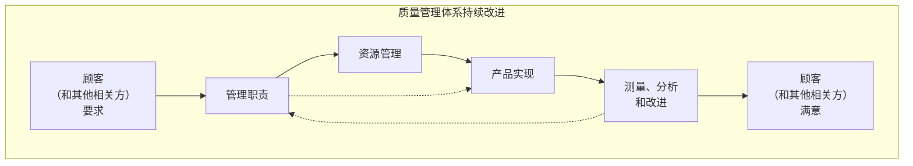
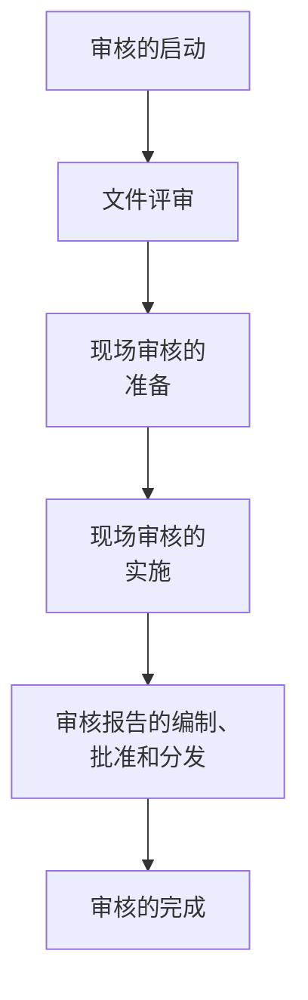
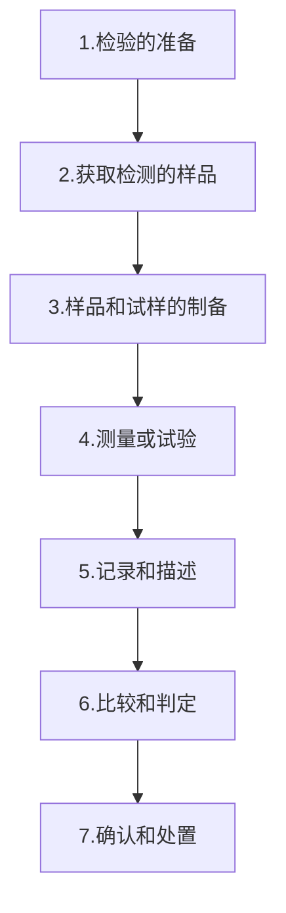
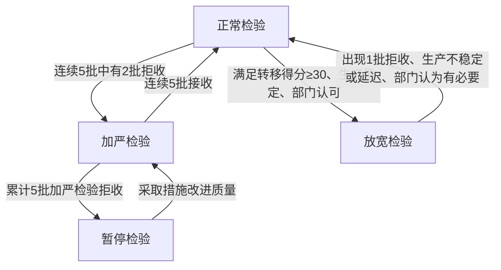
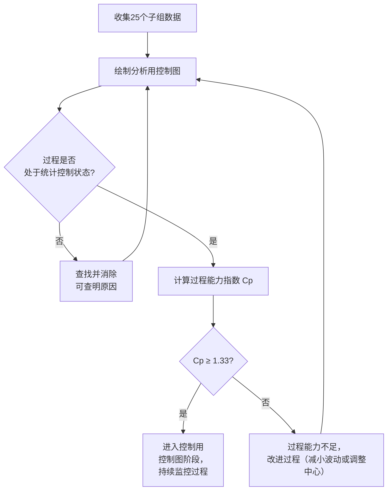

# 《质量专业职业资格考试辅导资料》章节总结

## 书籍信息
- **书名**：质量专业职业资格考试辅导资料（初级/中级）
- **作者**：全国质量专业技术人员职业资格考试办公室、网络培训机构（环球网校等）
- **PDF 状态**：混合文档，包含教材正文、讲义、练习题及模拟试卷
- **OCR 状态**：文本可识别，部分图片/公式需手动还原

---

## 全书核心主题

本套资料是为全国质量专业技术人员职业资格考试（初级与中级）编写的系统性辅导教材与讲义，内容覆盖质量管理的核心知识体系。全书分为上、下两篇，上篇（相关知识）主要阐述质量管理概论、质量管理体系、质量检验和计量基础等理论性、法规性知识；下篇（理论与实务）则侧重概率统计、抽样检验、统计过程控制和质量改进等应用性、技术性内容。资料以考试大纲为依据，旨在帮助考生系统掌握质量专业的基本概念、管理原则、技术方法和法规要求，具备从事质量工作的理论功底和实践能力。

---

## 第1章：质量管理概论（教材 + 讲义）

### 核心论点

本章系统阐述了质量与质量管理的基本概念、发展历程和核心原则，并介绍了标准化、产品质量法和职业道德规范等支撑性知识。其核心观点是：质量是一组固有特性满足要求的程度，而质量管理则是通过建立质量方针、目标、策划、控制、保证和改进等一系列协调活动，实现组织的持久成功和顾客满意。

### 关键概念

- **质量**：一组固有特性满足要求的程度。“要求”包括明示的、通常隐含的或必须履行的需求或期望。质量具有经济性、广义性、时效性和相对性。
- **质量特性**：产品、过程或体系与要求有关的固有特性。可分为硬件特性（性能、可靠性等）、服务特性（可靠性、响应性、保证性、移情性、有形性）、软件特性（功能性、可维护性等）和流程性材料特性。按重要程度分为关键、重要和次要三类。
- **质量管理**：在质量方面指挥和控制组织的协调活动，包括制定质量方针和质量目标，以及质量策划、质量控制、质量保证和质量改进。
- **全面质量管理（TQM）**：以质量为中心，以全员参与为基础，通过让顾客和相关方满意而达到长期成功的管理途径。
- **八项质量管理原则**：以顾客为关注焦点、领导作用、全员参与、过程方法、管理的系统方法、持续改进、基于事实的决策方法、与供方互利的关系。
- **卓越绩效评价准则（GB/T 19580）**：用于组织自我评价和质量奖评价的标准，包括“领导”“战略”“顾客与市场”“资源”“过程管理”“测量、分析与改进”和“结果”七大类目。

### 逻辑推演

本章从“质量”这一核心概念的演变入手（符合性→适用性→广义性），逐步展开到质量管理的定义、职能和内容。接着，通过阐述八项质量管理原则和过程方法模式，建立了现代质量管理的思想框架。然后，引入了顾客满意、卓越绩效评价等绩效评价工具，并将质量管理专家的理念作为理论补充。最后，将标准化和产品质量法作为质量管理的外部规范和保障，构建了一个从内部管理到外部法规的完整知识体系。

### 经典金句

> “质量是一组固有特性满足要求的程度。”——GB/T 19000-2008
> “全面质量管理是为了能够在最经济的水平上并考虑到充分满足用户需求的条件下进行市场研究、设计、生产和服务，把企业各部门的研制质量、维持质量和提高质量的活动构成一体的有效体系。”——费根堡姆

---

## 第2章：质量管理体系（教材 + 讲义）

### 核心论点

本章详细解读了质量管理体系的基本术语、基础理论、ISO 9000族核心标准、质量管理体系审核以及质量认证。核心观点是：质量管理体系是组织建立质量方针和质量目标并实现这些目标的体系，它通过过程方法、文件化管理和持续改进，为组织及其顾客提供信任，证明其有能力稳定地提供满足要求的产品。

### 关键概念

- **质量管理体系**：在质量方面指挥和控制组织的管理体系。作用是提供持续改进的框架和提供信任。
- **ISO 9000族核心标准**：包括 GB/T 19000（基础和术语）、GB/T 19001（要求，用于认证）、GB/T 19004（业绩改进指南）和 GB/T 19011（审核指南）。
- **审核**：为获得审核证据并对其进行客观评价，以确定满足审核准则的程度所进行的系统的、独立的并形成文件的过程。分为第一方（内部）、第二方（顾客）和第三方（认证机构）审核。
- **认证与认可**：认证是证明产品、服务、管理体系符合相关标准的合格评定活动；认可是对认证机构、实验室等机构能力和执业资格的承认。
- **合格评定**：指与产品、过程、体系、人员或机构有关的规定要求得到满足的证实，包括认证和认可。

### 方法流程图

#### 以过程为基础的质量管理体系模式



#### 质量管理体系审核的主要活动



### 逻辑推演

本章首先构建了质量管理体系的基本术语和理论基础，明确了体系的要求与产品要求的关系。然后，详细介绍了ISO 9000族核心标准，特别是用于认证的GB/T 19001标准。接着，将理论付诸实践，阐述了质量管理体系审核和认证的全过程，包括审核的启动、文件评审、现场审核、报告编制等具体活动。最后，对质量认证中的产品认证和体系认证进行了比较，理清了二者的区别与联系。

---

## 第3章：质量检验（教材 + 讲义）

### 核心论点

本章阐明了质量检验的基本概念、必要性和功能，并按照多种分类方法详细介绍了不同类型质量检验的内容、形式和特点。其核心观点是：质量检验是通过对产品的一个或多个质量特性进行观察、测量、试验，并与规定要求进行比较，以确定其合格情况的技术性检查活动，具有鉴别、把关、预防和报告四大功能。

### 关键概念

- **质量检验**：通过观察和判断，适当时结合测量、试验或估量所进行的符合性评价。
- **质量检验的功能**：鉴别功能（判断是否符合要求）、“把关”功能（防止不合格品流转）、预防功能（通过首检、巡检等预防问题）、报告功能（提供质量信息）。
- **质量检验的步骤**：检验准备 → 获取样品 → 样品制备 → 测量或试验 → 记录和描述 → 比较和判定 → 确认和处置。
- **检验分类**：
  - **按阶段**：进货检验、过程检验（含首件、巡回）、最终检验（含型式试验、包装检验）。
  - **按场所**：固定场所检验、流动检验。
  - **按数量**：全数检验、抽样检验。
  - **按执行人员**：自检、互检、专检。
  - **按技术**：理化检验（物理/化学）、感官检验、生物检验、在线检测。

### 逻辑推演

本章从“检验”的定义出发，逐步深入到质量检验的六个基本要点。接着论证了检验的必要性和基本任务，并详细阐述了其四大功能。然后，按照通用的七步骤法描述了检验的完整流程。最后，通过按阶段、按场所、按数量、按技术等多个维度对检验进行分类讲解，使读者能够根据不同的场景和目的，选择和应用合适的检验方法。

### 方法流程图

#### 质量检验的步骤



---

## 第4章：计量基础（教材 + 讲义）

### 核心论点

本章介绍了计量的基本概念、法定计量单位、计量溯源体系、测量数据的修约规则以及测量结果的误差分析。核心观点是：计量是实现单位统一、量值准确可靠的活动，它具有准确性、一致性、溯源性和法制性四大特点，是质量管理的重要技术基础。

### 关键概念

- **计量**：实现单位统一、量值准确可靠的活动。分为科学计量、工程计量和法制计量。
- **法定计量单位**：由国家法律承认、具有法定地位的计量单位。我国采用国际单位制（SI）。
- **SI基本单位**：长度（米）、质量（千克）、时间（秒）、电流（安培）、热力学温度（开尔文）、物质的量（摩尔）、发光强度（坎德拉）。
- **计量溯源性**：通过文件规定的不间断的校准链，使测量结果与参照对象联系起来，确保量值的准确和可比。
- **校准与检定**：校准是确定测量仪器示值误差，不具法制性；检定是查明和确认测量仪器是否符合法定要求，具有法制性，是执法行为。
- **测量误差**：测量结果减去被测量的真值。分为系统误差和随机误差。修正值等于负的系统误差。
- **数值修约**：遵循“四舍六入五单双”法则，即拟舍弃数字最左一位小于5则舍，大于5则进，等于5时其后全为零则看前一位奇进偶舍，否则进一。

### 逻辑推演

本章首先定义了计量及其相关内容，强调了计量的四个特点及其法律、法规体系。接着，系统介绍了我国法定计量单位的构成，特别是国际单位制（SI）的基本单位、导出单位和词头，并给出了使用规则。然后，阐述了量值溯源的重要性及测量标准的管理，并区分了校准和检定这两个关键技术手段。最后，讲解了测量数据的修约规则和测量结果的误差分析方法，为准确处理和报告测量数据提供了技术指导。

### 经典金句

> “计量是实现单位统一、量值准确可靠的活动。”
> “测量结果 = 测量结果 + 修正值 = 测量结果 - 误差。”

---

## 第5章：概率统计基础（教材 + 讲义）

### 核心论点

本章是统计过程控制和抽样检验的理论基础，介绍了概率论基础、常见随机变量分布、统计量、参数估计和回归分析。核心观点是：通过概率论和数理统计的方法，可以描述、分析和推断产品质量特性的随机变化规律，为质量控制和改进提供科学依据。

### 关键概念

- **随机现象**：在一定条件下，并不总是出现相同结果的现象。
- **概率的统计定义**：频率的稳定值。概率具有非负性、规范性、可加性和独立性等性质。
- **二项分布**：描述n次独立重复试验中成功次数的分布。如产品抽检中的不合格品数。
- **正态分布**：最重要、最常用的连续分布，记作 \(N(\mu, \sigma^2)\)。\(\mu\) 决定分布中心，\(\sigma\) 决定分布离散程度。
- **统计量**：不含未知参数的样本函数。如样本均值 \(\bar{x}\)、样本方差 \(s^2\)。
- **参数估计**：用样本统计量估计总体参数。样本均值是总体均值的无偏估计，样本方差是总体方差的无偏估计。
- **一元线性回归**：用于研究两个变量之间的线性关系，方程为 \(\hat{y} = a + bx\)。相关系数 \(r\) 衡量线性关系的密切程度。

### 方法流程图

#### 正态分布标准化

```mermaid
graph LR
    A[正态分布 X ~ N(μ, σ²)] --> B[标准化变换 U = (X-μ)/σ]
    B --> C[标准正态分布 U ~ N(0,1)]
    C --> D[查标准正态分布表计算概率]
```

### 逻辑推演

本章从随机现象和事件概率的基础概念开始，逐步介绍了概率的运算规则。然后重点讲解了二项分布和正态分布这两种在质量管理中最常用的分布，特别是正态分布的计算和标准化方法。在统计基础部分，定义了总体、样本等概念，并引入了样本均值、方差等统计量和点估计方法。最后，通过回归分析，介绍了如何研究变量间的相关关系，并建立一元线性回归方程进行预测。整个章节为后续的抽样、控制和改进技术提供了坚实的数学基础。

---

## 第6章：抽样检验（教材 + 讲义）

### 核心论点

本章详细介绍了抽样检验的基本概念、方案设计、操作特性曲线、以及计数调整型和孤立批抽样标准（GB/T 2828.1和GB/T 2828.2）的使用方法。核心观点是：抽样检验是一种通过抽取少量样本来推断整批产品质量的科学方法，它具有一定的风险，但通过设计合理的抽样方案（如调整型方案），可以在保证质量的同时兼顾经济性。

### 关键概念

- **抽样检验**：按照规定的抽样方案，随机抽取少量个体进行检验，以判定一批产品是否可以被接收。
- **生产方风险(α)**：合格批被判为不合格的概率。
- **使用方风险(β)**：不合格批被判为合格的概率。
- **OC曲线**：操作特性曲线，反映抽样方案对不同质量水平批次的接收概率。曲线越陡，方案的判别能力越强。
- **接收质量限(AQL)**：对于连续批，可容忍的最差过程平均质量水平。是调整型抽样的核心检索要素。
- **检验水平(IL)**：明确批量N和样本量n之间的关系。一般检验水平Ⅲ的样本量最大、判别力最强。
- **转移规则**：在连续批检验中，根据历史检验结果在正常、加严、放宽检验之间进行转换的规则。连续5批中有2批拒收，则从下批起转为加严检验。

### 方法流程图

#### 计数调整型抽样检验的转移规则



### 逻辑推演

本章首先阐述了抽样检验的必要性和基本原理，定义了批量、不合格品、AQL等核心术语。接着，介绍了抽样方案的设计和对批接收性的判定，并引入OC曲线来评价方案的性能。之后，重点讲解了适用于连续批的计数调整型抽样标准GB/T 2828.1，详细说明了其使用程序，包括AQL的确定、检验水平的选择、样本量字码的检索和转移规则的运用。最后，介绍了适用于孤立批的GB/T 2828.2标准，它使用极限质量LQ作为质量指标，更侧重于保护使用方利益。

---

## 第7章：统计过程控制（教材 + 讲义）

### 核心论点

本章介绍了统计过程控制（SPC）的核心工具——控制图，以及过程能力分析方法。核心观点是：通过应用控制图对生产过程进行实时监控，可以区分过程的偶然波动和异常波动，从而及时发现异常并采取措施；通过计算过程能力指数（Cp、Cpk），可以评价过程满足技术要求的程度，并为过程改进提供方向。

### 关键概念

- **统计过程控制（SPC）**：应用统计方法对过程进行监控和评估，以建立和保持过程处于可接受的稳定水平。
- **控制图**：SPC的主要工具，用于监控过程质量特性值。图上有中心线（CL）、上控制限（UCL）和下控制限（LCL）。3σ原则是常规控制图的依据。
- **两类错误**：第一类错误（虚发警报），过程正常但点子出界；第二类错误（漏发警报），过程异常但点子未出界。
- **判异准则**：包括点子出界和界内点排列不随机（如连续9点落在中心线同侧、连续6点递增或递减等）。
- **过程能力**：处于统计控制状态下过程输出的最小变差，通常用6σ表示。
- **过程能力指数**：
  - \(C_p = \frac{T}{6\sigma}\)，衡量过程潜在能力（无偏移）。
  - \(C_{pk} = (1-K)C_p\)，衡量过程实际能力（考虑偏移）。
- **常规控制图类型**：
  - **计量值**：\(\bar{X}-R\)（均值-极差）图、\(\bar{X}-s\)（均值-标准差）图、\(X-R_s\)（单值-移动极差）图。
  - **计件值**：\(p\)（不合格品率）图、\(np\)（不合格品数）图。
  - **计点值**：\(c\)（不合格数）图、\(u\)（单位不合格数）图。

### 方法流程图

#### 过程改进策略



### 逻辑推演

本章从SPC的基本概念和预防性原则出发，引出核心工具——控制图。首先详细讲解了控制图的原理、结构和3σ原则。然后，介绍了8种常用的判异准则，用于判断过程是否处于统计控制状态。接着，区分了分析用控制图（用于研究过程）和控制用控制图（用于日常监控）。在此基础上，重点讲解了 \(\bar{X}-R\) 图、\(X-R_s\) 图和 \(p\) 图等几种最常用控制图的作图方法和应用。最后，阐述了过程能力的概念，并给出了 \(C_p\) 和 \(C_{pk}\) 的计算方法和评价标准，形成了“监控-分析-评价-改进”的完整逻辑链条。

---

## 第8章：质量改进（教材 + 讲义）

### 核心论点

本章介绍了质量改进的概念、意义、基本过程（PDCA循环）、步骤、组织推进以及常用工具（因果图、排列图、直方图等）和QC小组活动。核心观点是：质量改进是质量管理的一部分，致力于增强满足质量要求的能力，它与质量控制相辅相成，通过PDCA循环的持续运作，实现产品质量和管理水平的螺旋式上升。

### 关键概念

- **质量改进**：致力于增强满足质量要求的能力。与质量控制（维持现有水平）不同，质量改进是消除系统性问题，实现“质量突破”。
- **PDCA循环**：质量改进的基本过程。由策划（Plan）、实施（Do）、检查（Check）、处置（Act）四个阶段组成，具有完整性、上升性和大环套小环的特点。
- **质量改进的步骤**（四阶段七步骤）：
  1. 选择课题  2. 掌握现状  3. 分析问题原因
  4. 拟定对策并实施  5. 确认效果  6. 防止再发生和标准化  7. 总结
- **质量改进工具**：
  - **因果图（鱼刺图）**：分析原因与结果之间的关系。
  - **排列图（帕累托图）**：识别“关键的少数”，确定主要问题。
  - **直方图**：显示数据分布形态，与公差限比较判断过程能力。
  - **调查表**：收集和记录数据。
  - **分层法**：按不同类别对数据进行分组，找出差异。
- **QC小组**：围绕企业经营战略和现场问题，运用质量管理方法开展活动的小组，具有自主性、群众性、民主性和科学性。

### 方法流程图

#### PDCA循环

```mermaid
graph TD
    subgraph P (策划)
        A[选择课题]
        B[掌握现状]
        C[分析原因]
        D[拟定对策]
    end
    subgraph D (实施)
        E[实施对策]
    end
    subgraph C (检查)
        F[确认效果]
    end
    subgraph A (处置)
        G[防止再发生和标准化]
        H[总结]
    end
    A --> B --> C --> D --> E --> F --> G --> H
    H -.->|遗留问题进入下一循环| A
```

### 逻辑推演

本章首先区分了质量改进与质量控制，强调了改进的必要性。然后，系统阐述了质量改进的核心过程——PDCA循环，并给出了“四阶段七步骤”的具体操作指南。接着，讨论了质量改进的组织形式（质量委员会、改进团队）和高层管理者的职责。之后，介绍了因果图、排列图、直方图等七种常用的质量改进工具，详细说明了它们的作用和制作方法。最后，介绍了QC小组的概念、特点和活动过程，展示了群众性质量改进活动的具体实践形式。整个章节构建了一套从理念、流程到工具、组织的完整质量改进方法论。

---

## 附录

### 1. 常用统计分布表（教材附录）

- **附表1-1**：标准正态分布函数表（\(\Phi(u)\) 值）
- **附表2-1至2-6**：GB/T 2828.1 计数调整型抽样检验用表（样本量字码表、正常/加严/放宽一次/二次抽样方案主表）
- **附表3-1至3-2**：GB/T 2828.2 孤立批计数抽样检验用表（模式A一次抽样方案主表、模式B抽样方案表）

### 2. 质量专业技术人员职业资格考试相关制度

- **《暂行规定》与《实施办法》**：明确了考试的性质、级别、报名条件、考试科目和组织管理，确立了质量专业资格实行一考多用、全国统一考试、定期登记注册等原则。
- **《注册登记管理暂行办法》**：规定了质量专业资格证书的注册登记流程、有效期（3年）、继续教育要求（实行学分制）及监督管理。
- **制度问答**：解答了关于考试制度的目的、与国外互认、报考资格、证书效力等常见问题，强调该制度是加强质量专业队伍建设、从源头抓质量的重要举措。