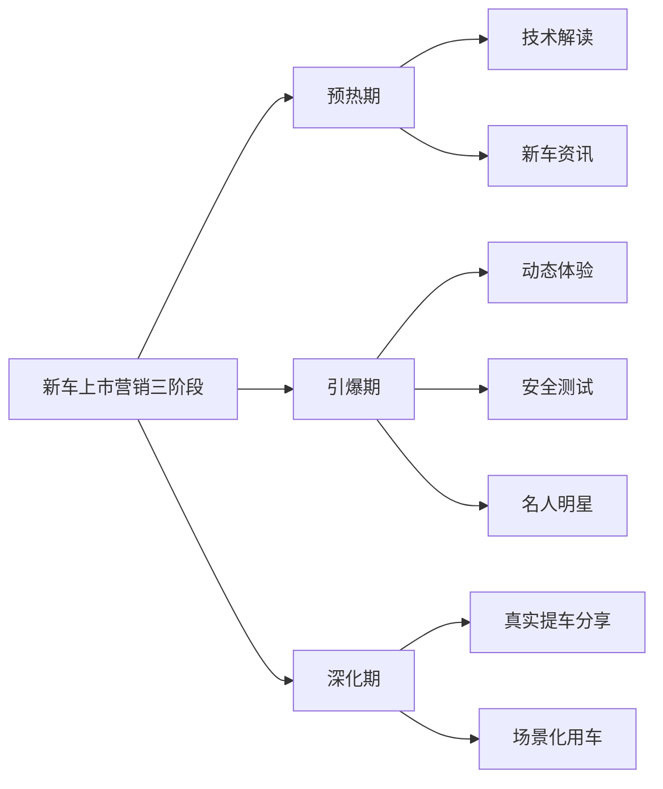

# 《起点财经每日精选7篇报告摘要》结构化总结

## 书籍信息
- 书名：起点财经每日精选7篇报告摘要（2026年5月23日）
- 作者：起点财经（汇编）
- PDF 状态：完整
- OCR 状态：良好

## 目录说明
- 本文件为7份独立报告的摘要汇编，包含：脑机接口商业化研究报告、世界移民报告、保险业AI大模型应用白皮书、宠物情绪行业白皮书、跨国公司在华发展报告、纺织行业产品数字护照白皮书、新车上市营销洞察。
- 本文按原始顺序逐份总结。

## 全书核心主题
本汇编精选7份不同领域的产业研究报告摘要，覆盖脑机接口商业化、全球移民格局、保险业AI转型、宠物情绪经济、跨国公司对华投资、纺织业欧盟合规、汽车营销洞察。核心主线是：技术（AI/BCI）与产业（保险/宠物/纺织/汽车）的深度交叉融合，以及全球化（移民/跨国公司）与本土化（合规/市场准入）的双重挑战。

---

## 报告一：脑机接口商业化研究报告

### 核心论点
问题：脑机接口（BCI）技术从实验室走向商业化的路径与障碍是什么？
观点：产业生态日趋成熟，“临床器械注册+医院采购”是当前商业化价值最大的主流路径。产业正从技术探索转向以临床需求为牵引的系统化发展阶段，但上游核心部件依赖进口、中游转化通道未通、下游价值认知不足仍是系统性困局。

### 关键概念
- 侵入式BCI：面向截瘫、失语等重大疾病，作为三类创新医疗器械通过NMPA注册后进入医院采购。
- 非侵入式BCI：形成严肃医疗（脑卒中康复）与消费医疗（注意力训练、睡眠改善）双域共振。
- 博睿康：2026年3月，其植入式脑机接口系统率先获批上市，为全球首个侵入式BCI医疗器械。

### 逻辑推演
首先指出BCI产业进入政策护航期——工信部等七部门联合发文，北京、上海纳入医保支付，2026年Q1融资超2025全年。然后分析两条商业化路径：侵入式走医疗器械注册+医院采购；非侵入式走医疗+消费双轮驱动。接着揭示三大瓶颈：上游高端芯片/电极依赖进口，中游临床数据标准化不足，下游价值认知未形成共识。最后提出破局建议：政府提供审评标准，医院成为医工协作枢纽，企业采用“替代终点验证+滚动式注册”敏捷策略。

### 经典金句/数据
> 2026年3月，博睿康的植入式脑机接口系统率先获批上市，标志着全球首个侵入式BCI医疗器械进入临床应用。
> 2026年Q1融资事件数量已超过2025年全年，投资逻辑从“概念炒作”转向“价值投资”。
> 投资逻辑从“概念炒作”转向关注临床有效性、核心器件自主化和商业化路径清晰度的“价值投资”。

---

## 报告二：2026年世界移民报告

### 核心论点
问题：全球移民与流离失所的最新格局和趋势是什么？
观点：全球流离失所人口已超1.2亿达历史顶峰，但国际移民占世界人口比例（3.7%）仍缓慢增长。国际汇款（9050亿美元）仍是发展中国家重要经济命脉，超过FDI和ODA总和。关于移民的错误信息泛滥，使基于证据的理性分析尤为重要。

### 关键概念
- 国内流离失所者（IDPs）：超8300万，2024年约6580万次国内流离失所事件，大部分由灾害引发。
- 国际汇款：2024年全球总额预计达9050亿美元，流向中低收入国家6850亿美元。
- 气候流动：地方和社区行动在应对气候相关移徙中的核心作用。

### 逻辑推演
先给出核心数据：国际移民3.04亿占人口3.7%，流离失所者超1.2亿达历史顶峰。再论述移民的发展贡献：汇款9050亿美元是战略资产，但受不平等、人权侵犯和排外情绪威胁。接着剖析主要议题：正规移民途径日益不平等，关闭正规途径只会推高非正规移民；气候流动需赋能本地行动；国内流离失所需持久解决方案。最后强调理性分析对抗错误信息的重要性。

### 经典金句/数据
> 截至2024年中，全球国际移民总人数约3.04亿，占世界人口的3.7%。
> 全球流离失所人口已超过1.2亿，达到现代历史的顶峰。
> 2024年全球国际汇款总额预计达到9050亿美元，其中流向中低收入国家的达6850亿美元，超过外国直接投资（FDI）和官方发展援助（ODA）的总和。

---

## 报告三：保险业AI大模型应用白皮书

### 核心论点
问题：AI大模型在保险行业的应用进展、实践与挑战是什么？
观点：保险AI应用已从“能用”的技术验证阶段转入“如何用深、用好、用稳”的流程嵌入阶段。智能体技术正推动AI从单点任务赋能迈向跨环节流程协同与自主决策，成为保险业数字化转型的核心引擎。

### 关键概念
- 智能体（Agent）：能将核保、理赔等复杂任务拆解为多个专业Agent协同完成，实现端到端“流水线”式处理。
- “通用大模型+行业知识库+检索增强生成（RAG）”：抑制“幻觉”的主流技术模式。
- 人机协同：智能核保、智能理赔、反欺诈识别的行业标配模式。

### 逻辑推演
首先概述AI已渗透保险前中后台：前台智能客服/AI销售助手，中台智能核保理赔反欺诈为最深应用，后台智慧审计加速。然后指出应用模式从“单点任务赋能”演进到“流程协同编排”，以智能体为代表的新架构实现端到端处理（案例：平安产险智能出单时效提升80%，中再寿险理赔审核从30-60分钟降至10-15分钟）。接着说明技术底座四大支柱（数据知识、算力、模型能力、安全合规），以及“通用大模型+RAG”抑制幻觉的方案。最后提出挑战：模型可靠性、数据治理、人才短缺、监管责任，并建议“大模型+智能体平台”建设模式。

### 经典金句/数据
> 保险行业AI应用已从“能用”的技术验证阶段，全面转入“如何用深、用好、用稳”的流程嵌入与价值创造阶段。
> 平安产险的智能出单时效提升了80%，中再寿险的智能理赔助手将案件审核时长从30-60分钟降至10-15分钟。
> 智能体技术的发展，正在推动AI由单点任务赋能迈向跨环节的流程协同与自主决策。

---

## 报告四：2026年中国宠物情绪行业白皮书

### 核心论点
问题：宠物情绪健康市场的现状、驱动因素与未来趋势是什么？
观点：养宠理念正从生理关怀转向心理共鸣，宠物角色从“看家护院”升级为“情感伴侣”。宠主愿为缓解宠物焦虑、抑郁、恐惧等情绪问题投资，行业正从“生存消费”升级为“情感投资”，形成“识别—干预—追踪”的闭环市场。

### 关键概念
- 宠物情绪问题：焦虑、抑郁、愤怒、恐惧四类最常见，犬类外显、猫类隐蔽。
- 干预手段：行为训练（正向激励）、心理咨询、营养补充剂、环境丰容（信息素、舒缓音乐）。
- 科技设备：AI情绪识别摄像头、可穿戴设备为新增长点。

### 逻辑推演
先指出宠物情绪问题已广泛引起关注，四类情绪问题诱因包括分离、环境巨变、社会化不足等。然后分析市场形成“识别—干预—追踪”闭环，干预手段多元，科技设备成新增长点，消费群体分层明显（年轻人为主力）。接着给出市场规模：2025年约85亿元，预计2030年突破111.5亿元，CAGR 5.6%，产品矩阵涵盖功能性主粮、营养补充剂、信息素喷雾、智能玩具等。最后总结三大趋势：科技驱动（AI量化情绪）、服务化订阅制扩张、从关注宠物到关注“人宠共情关系”。

### 经典金句/数据
> 2025年，中国宠物情绪舒缓相关产品市场规模已达约85亿元，预计2030年将突破111.5亿元，年复合增长率为5.6%。
> 养宠理念正经历从生理关怀到心理共鸣的深刻转变。
> 行业正从提供基础食宿的“生存消费”，全面升级到进行行为矫正、购买情绪产品和使用智能监测设备等的“情感投资”阶段。

---

## 报告五：跨国公司在华发展报告（2025）

### 核心论点
问题：跨国公司在华投资与经营的现状、差异与趋势是什么？
观点：中国市场对跨国公司仍具强大吸引力，投资聚焦高端制造、新能源和数字化。但亚洲与欧美来源地的跨国公司在投资模式、创新策略和本地融合程度上存在显著差异：亚洲企业倾向于“围棋式”多点布局和高合资比例，欧美企业更倚重全资子公司和聚焦核心业务。

### 关键概念
- 围棋式布局：亚洲跨国公司倾向于多点、分散、高渗透的网点布局策略。
- 三方专利：衡量高端创新质量的指标，中国仍有提升空间。
- 本地融合度：亚洲企业因文化相近，建立党支部比例和产业链嵌入深度更高。

### 逻辑推演
首先指出投资规模可观：超15%样本企业在华投资超100亿元，先进制造业（汽车、能源化工、电子设备）位居前三。然后分析创新加速：2024年新增发明专利近3万件，累计超20万件，数字化和AI为创新焦点，但高端三方专利仍有提升空间。接着揭示差异化模式：亚洲企业“围棋式”多点布局+高合资比例+高本地融合度；欧美企业全资子公司+聚焦核心业务+较低渗透率。最后指出可持续发展战略多为全球通用框架，缺乏中国本土化设计。

### 经典金句/数据
> 超过15%的样本企业在华投资超100亿元，汽车、能源化工和电子设备制造等先进制造业投资额位居前三。
> 2024年新增发明专利近3万件，累计储备超20万件，数字化和人工智能成为创新焦点。
> 来自亚洲的跨国公司倾向于“围棋式”多点布局和高合资比例，且因文化相近性，其本地融合度和产业链嵌入深度更高。

---

## 报告六：2025中国纺织行业产品数字护照（DPP）白皮书

### 核心论点
问题：欧盟《可持续产品生态设计法规》（ESPR）项下产品数字护照（DPP）对中国纺织业的挑战及应对方案是什么？
观点：欧盟DPP法规将于2027年正式实施，凡在欧盟销售的纺织品须附带全生命周期信息数字护照，对中国纺织业构成重大市场准入挑战。报告提出基于GS1国际标准的中国纺织DPP解决方案和应对策略。

### 关键概念
- 产品数字护照（DPP）：承载产品从原材料、生产、分销、使用到回收全链条信息的数字标识。
- ESPR法规：欧盟《可持续产品生态设计法规》，2024年7月生效，纺织授权法案预计2026年发布，2027年实施。
- GS1标准：全球统一编码标准，为每件产品生成全球唯一数字身份标识（GTIN），以二维码为载体。

### 逻辑推演
先指出紧迫性：欧盟ESPR已生效，纺织法案2027年实施，不合规产品将丧失欧盟市场准入。再阐明DPP四重价值：赋能绿色循环经济、应对绿色贸易壁垒、驱动ESG治理、培育可持续消费。然后详细阐述技术路径：基于GS1标准生成GTIN，以二维码为载体，链接分布式数据存储库，实现“一物一码、一码多用”（不同角色扫描获不同权限信息）。最后提出应对策略：建立自主可控的DPP标准体系，通过APEC试点项目探索可行方案，加速标准建设、推动行业试点、解决数据跨境合规。

### 经典金句/数据
> 欧盟ESPR法规已于2024年7月生效，针对纺织品的授权法案预计2026年发布，2027年实施。届时，不合规产品将丧失欧盟市场准入资格。
> DPP不仅是应对绿色贸易壁垒的“通行证”，也被视为中国纺织业实现高质量发展的新引擎。
> 基于GS1国际标准，为每件产品生成一个全球唯一的数字身份标识（如GTIN编码），并以二维码为载体，实现“一物一码，一码多用”。

---

## 报告七：新车上市营销洞察（2026）

### 核心论点
问题：2025年新车上市的趋势、营销表现及成功要素是什么？
观点：新车仍是驱动销量的核心引擎，但“保质期”急剧缩短，呈现“上市即巅峰、半年就过气”的脉冲化特征。成功上市需要“预热—引爆—口碑深化”的完整节奏，技术类内容、评测和名人效应是关键爆点要素。

### 关键概念
- 脉冲化特征：41%全新车型销量高峰集中在上市后第1个月，87%峰值出现在上市半年内。
- 长销爆款：月销过万的“爆款车”在达到高峰后，第二个月销量下滑42%，第三个月超50%。
- 成功上市营销节奏：上市前技术解读/新车资讯预热；上市当月动态体验/安全测试/名人引爆；上市后期真实提车/场景化用车延续口碑。

### 逻辑推演
先给出市场趋势：2026年Q1新能源新车占比突破六成，新车大型化显著，中大型及以上车型占比近半（47%），800V高压快充和1000公里续航成标配。再揭示销量困境：“昙花一现”成集体困境——41%新车销量高峰在第1个月，87%在第半年内；月销过万爆款车第二个月下滑42%，第三个月超50%。然后分析成功营销的特征：启动早、预热充分、内容“量多效优”，成功车型关注指数是失败车的2-3倍，内容篇数是2.5倍；节奏上分三阶段（预热期技术资讯、引爆期体验测试+名人、深化期真实分享）。最后预测2026北京车展方向：电池参数继续内卷（续航破千+超充），座舱“客厅化”（超大贯穿屏+零重力座椅普及）。

### 方法流程图

### 经典金句/数据
> 2025年，全新车型中41%的销量高峰集中在上市后第1个月，87%的销量峰值出现在上市半年内。
> 即便是月销过万的“爆款车”，在达到销量高峰后，第二个月销量下滑就高达42%，第三个月超50%，长销爆款的打造越发艰难。
> 成功上市车型的关注指数和意向指数是非成功车的2~3倍。成功车型在上市期投放的内容篇数是非成功车的2.5倍。
> 2026年Q1，新能源新车占比已突破六成。车展发布的新车中，中大型及以上车型占比近半（47%）。