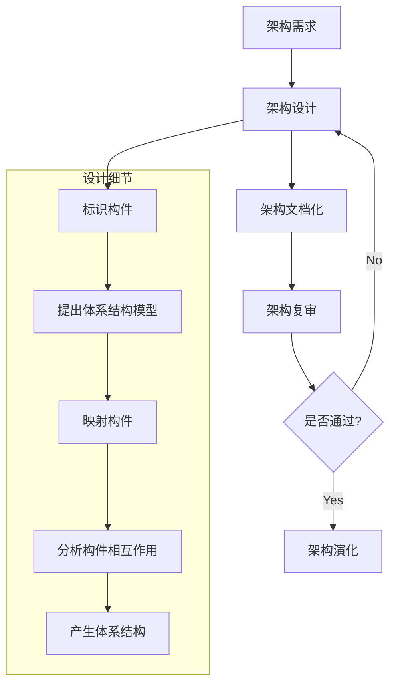
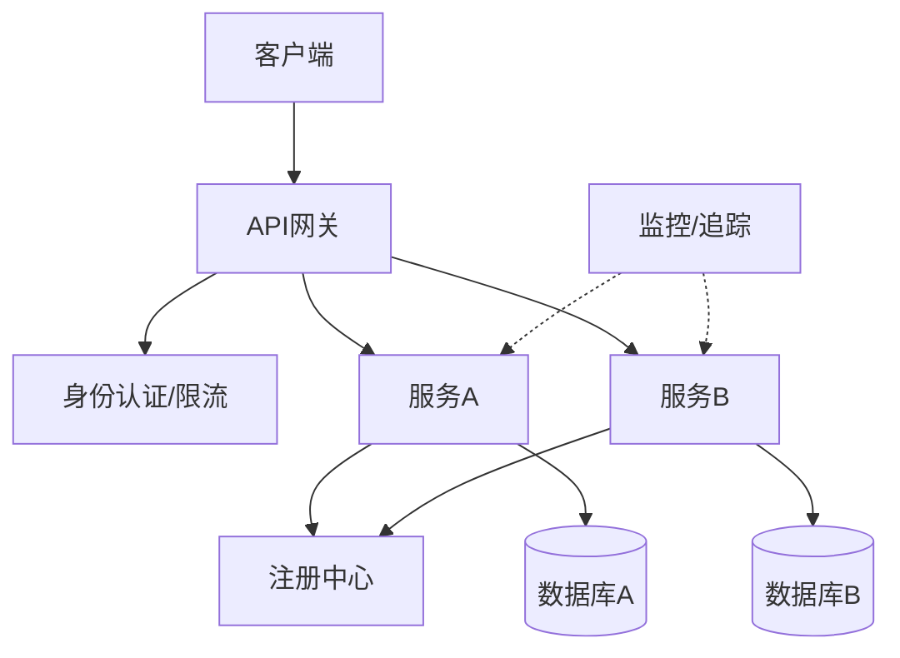
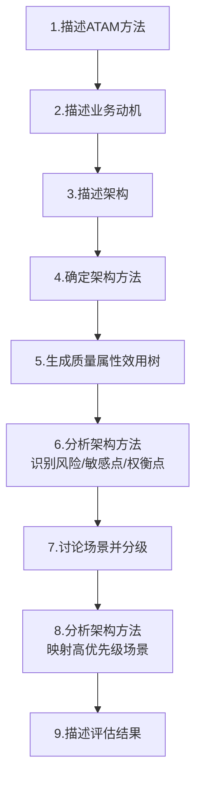

# 《软件架构设计》章节总结

## 书籍信息
- **书名**：软件架构设计
- **作者/讲师**：邹月平（51CTO学院）
- **PDF 状态**：文本提取完整，包含大量图表文字描述及典型真题解析。
- **OCR 状态**：良好，内容结构清晰，主要涵盖软件架构概述、ABSD方法、架构风格、质量属性及评估方法。

## 目录说明
基于提供的文本内容，本书（或课程讲义）主要划分为以下核心模块：
1. **软件架构概述**：定义、生命周期、“4+1”视图模型。
2. **基于架构的软件设计方法 (ABSD)**：基础、流程、文档化与复审。
3. **软件架构风格**：数据流、调用/返回、独立构件、虚拟机、仓库、特定领域软件架构 (DSSA)。
4. **常见系统架构模式**：C/S, B/S, J2EE, ORM, MVC/MVP/MVVM, SOA, 微服务。
5. **软件质量属性**：性能、可用性、可修改性、安全性等及其策略。
6. **软件架构评估**：ATAM, SAAM, CBAM 方法及风险/敏感点/权衡点识别。

## 全书核心主题
本书系统阐述了软件架构设计的核心理论与实践方法。首先定义了软件架构的关注点（构件、属性、交互）及“4+1”视图模型，强调从不同视角全面描述系统。接着介绍了基于架构的软件设计方法（ABSD），主张由商业、质量和功能需求组合驱动设计。重点分析了多种经典架构风格（如数据流、事件驱动、黑板系统等）及其适用场景，并对比了从传统C/S/B/S到现代SOA和微服务架构的演进。此外，深入探讨了软件质量属性（性能、可用性、可修改性、安全性）的定义、场景描述及提升策略。最后，介绍了架构评估方法（ATAM, SAAM, CBAM），强调在开发前通过场景分析来识别风险、敏感点和权衡点，确保架构满足业务和质量目标。

---

## 第1章：软件架构概述

### 1. 核心论点
本章主要解决“什么是软件架构以及如何全方位描述它”的问题。作者认为软件架构不仅关注构件结构，还需通过“4+1”视图模型从逻辑、进程、物理、开发和场景五个视角进行全面描述，其中场景视图（用例）是连接其他视图的核心。

### 2. 关键概念
- **软件架构**：关注软件构件的结构、属性和交互作用，通过多种视图全面描述特定系统。
- **4+1 视图模型**：
    - **逻辑视图**：系统的抽象描述，包括类图、对象图等，关注功能分解。
    - **进程视图**：描述系统中的进程和并发，关注运行时行为，通常包含活动图。
    - **物理视图**：描述软件如何映射到硬件实体，关注部署，通常包含部署图。
    - **开发视图**：描述软件模块组织和组件打包，关注静态组织结构，通常包含包图、组件图。
    - **场景视图（用例视图）**：从外部角度描述系统功能，指导其他视图，包含用例图。
- **架构设计生命周期**：需求分析 -> 设计阶段 -> 实现阶段 -> 构件组装 -> 部署 -> 后开发。

### 3. 逻辑推演
文章首先定义软件架构的核心要素，随后引入“4+1”视图模型作为描述架构的标准框架。通过逐一解释每个视图的关注点和常用UML图表，说明了单一视图的局限性以及多视图结合的必要性。特别强调用例视图（+1）对其他四个视图的指导作用，确立了以用户需求场景为驱动的设计思想。

### 4. 经典金句
> “每一个视图只关心系统的一个侧面，只有5个视图结合在一起才能反映系统的体系结构的全部内容。”

> “所有其他视图都依靠用例视图（场景）来指导它们，这就是将模型称为4＋1的原因。”

---

## 第2章：基于架构的软件设计方法 (ABSD)

### 1. 核心论点
本章解决“如何系统化地进行架构设计”的问题。作者提出ABSD方法是由商业、质量和功能需求组合驱动的，其核心基础包括功能分解、架构风格选择和质量场景描述。

### 2. 关键概念
- **ABSD三个基础**：
    1. **功能分解**：使用基于模块的内聚和耦合技术。
    2. **架构风格选择**：通过选择风格来实现质量和商业需求。
    3. **软件模板使用**：利用已有系统结构作为模板。
- **需求描述方式**：
    - **用例**：描述功能需求。
    - **质量场景**：描述质量需求（非功能需求）。
- **ABSD流程**：架构需求 -> 架构设计 -> 架构文档化 -> 架构复审 -> 架构演化。
- **架构复审**：迭代过程，旨在早期发现缺陷，需外部人员（用户代表、领域专家）参与。

### 3. 逻辑推演
本章首先界定ABSD的定义和驱动力（商业+质量+功能）。接着阐述其三大理论基础，强调架构设计不是凭空产生，而是基于分解、风格选择和模板复用。随后详细列出ABSD的生命周期步骤，特别突出了“架构文档化”输出规格说明书，以及“架构复审”在风险控制中的关键作用。最后通过真题强化了“视角与视图”、“用例”和“质量场景”在ABSD中的对应关系。

### 4. 流程图

### 5. 经典金句
> “在基于体系结构的软件设计方法中，采用视角与视图来描述软件架构，采用用例来描述功能需求，采用质量场景来描述质量需求。”

---

## 第3章：软件架构风格

### 1. 核心论点
本章解决“如何选择合适的系统组织模式”的问题。作者指出架构风格是特定领域中系统组织方式的惯用模式，定义了词汇表和约束。不同的业务需求（如数据流处理、规则匹配、自定义解析）对应不同的架构风格。

### 2. 关键概念
- **数据流风格**：
    - **批处理**：整体数据传送，顺序执行，延迟高（如日志分析）。
    - **管道-过滤器**：增量数据传送，可并发，实时性好（如编译器、Unix管道）。
- **调用/返回风格**：
    - **主程序/子程序**：单线程控制。
    - **面向对象**：封装性，对象间通过消息交互。
    - **层次系统**：分层服务，邻接层交互（如TCP/IP, MVC）。
- **独立构件风格**：
    - **进程通信**：点对点、异步/同步、RPC。
    - **事件驱动**：隐式调用，发布/订阅，解耦（如新闻订阅）。
- **虚拟机风格**：
    - **解释器**：执行效率低，支持自定义语言/规则（如JVM, 自定义地图解析）。
    - **基于规则的系统**：规则集+解释器+工作内存（如AI, DSS）。
- **仓库（数据共享）风格**：
    - **数据库系统**：中央数据源。
    - **黑板系统**：知识源+黑板+控制器，用于无确定性算法的问题（如语音识别）。
- **特定领域软件架构 (DSSA)**：
    - **三层模型**：领域开发环境、特定应用开发环境、应用执行环境。
    - **基本活动**：领域分析（获领域模型）、领域设计（获DSSA）、领域实现（重用信息）。

### 3. 逻辑推演
本章分类介绍了主流架构风格。首先区分数据流的两种形态（批处理vs管道），对比其粒度和实时性。接着介绍传统的调用返回风格及其变体（OO、层次）。重点阐述了独立构件风格中的事件驱动机制，强调其解耦优势。随后介绍虚拟机和仓库风格，特别指出解释器适用于“自定义”场景，黑板适用于“非确定性”问题。最后引入DSSA，说明如何在特定领域内通过标准化架构支持重用。

### 4. 经典金句
> “体系结构风格反映了领域中众多系统所共有的结构和语义特性，并指导如何将各个模块和子系统有效地组织成一个完整的系统。”

> “黑板系统通常应用在对于解决问题没有确定性算法的软件中。”

### 5. 典型场景映射
- **玩家自行创建战役地图** -> **解释器风格**（需解析自定义内容）。
- **VIP审核标准不定期更新** -> **基于规则的系统**（规则易变）。
- **语音识别/信号处理** -> **黑板系统**（无确定性算法，多知识源协作）。

---

## 第4章：常见系统架构模式与技术栈

### 1. 核心论点
本章解决“具体技术实现中的架构选型”问题。作者对比了C/S与B/S、J2EE分层、ORM框架差异、MVC/MVP/MVVM表现层模式以及SOA与微服务的服务化架构，指出了各自的优缺点及适用场景。

### 2. 关键概念
- **C/S vs B/S**：
    - **二层C/S**：难以扩展，安全性差，服务器负荷重。
    - **三层C/S/B/S**：表示层、功能层、数据层分离。B/S实现“零客户端”，维护集中在服务器端。
- **J2EE分层**：客户层、Web层（Servlet/JSP）、业务逻辑层（EJB）、持久层（Hibernate/MyBatis）。
- **ORM对比 (Hibernate vs MyBatis)**：
    - **Hibernate**：全自动，开发快，SQL封装，复杂查询困难，二级缓存脏数据报错。
    - **MyBatis**：半自动，SQL手工编写，性能可控，灵活，脏读不报错。
- **表现层模式**：
    - **MVC**：Model-View-Controller，控制器协调，视图与模型解耦。
    - **MVP**：Model-View-Presenter，Presenter持有View接口，完全分离，易单元测试。
    - **MVVM**：Model-View-ViewModel，双向数据绑定，自动更新，适合复杂前端。
- **SOA (面向服务架构)**：
    - **核心**：松散耦合，接口中立。
    - **关键技术**：SOAP (传输), WSDL (描述), UDDI (注册查找), ESB (企业服务总线，负责路由、转换、整合)。
- **微服务架构**：
    - **特点**：小服务、独立进程、轻量通信(HTTP/JSON)、围绕业务能力、独立部署、去中心化。
    - **组件**：API网关（统一入口、鉴权、限流）、注册中心、服务监控/追踪/治理。
    - **缺点**：分布式事务难、测试复杂、部署复杂、跨团队协作要求高。

### 3. 逻辑推演
本章从传统分布式架构（C/S）演进到Web架构（B/S），深入J2EE内部的分层与持久层技术选型。接着聚焦前端架构演变，从MVC到MVVM，强调解耦程度和数据绑定的自动化。最后转向服务端架构，从SOA的ESB集中式管理过渡到微服务的去中心化、轻量化治理，客观分析了微服务带来的开发灵活性与其运维复杂性之间的权衡。

### 4. 流程图：微服务基本组件交互

### 5. 经典金句
> “微服务是松耦合的，是有功能意义的服务，无论是在开发阶段或部署阶段都是独立的。”

> “B/S架构...真正达到了‘零客户端’的功能，很容易在运行时自动升级。”

---

## 第5章：软件质量属性

### 1. 核心论点
本章解决“如何定义和提升软件非功能性需求”的问题。作者指出质量属性（性能、可用性、可修改性、安全性等）往往相互抑制，需通过具体的“质量场景”（刺激源、刺激、制品、环境、响应、响应度量）来描述，并采用特定的架构策略进行优化。

### 2. 关键概念
- **质量场景六要素**：刺激源、刺激、制品、环境、响应、响应度量指标。
- **可用性 (Availability)**：
    - **定义**：正常运行的时间比例。
    - **策略**：
        - **错误检测**：心跳、Ping/Echo、异常。
        - **错误恢复**：表决、主动冗余（热备）、被动冗余（冷备）、重新同步、检查点/回滚。
        - **错误避免**：服务下线、事务、进程监控。
- **性能 (Performance)**：
    - **定义**：处理任务所需时间或单位时间处理量。
    - **策略**：
        - **资源需求**：减少计算开销（改进算法）、减少事件数量（控制采样）。
        - **资源管理**：并发机制、增加资源。
        - **资源仲裁**：先来先服务、固定/动态优先级、轮转调度。
- **可修改性 (Modifiability)**：
    - **定义**：修改的成本、时间、影响范围。
    - **策略**：
        - **局部化修改**：高内聚低耦合、预测变更、模块通用。
        - **防止连锁反应**：信息隐藏、维持接口、限制通信路径、使用中介（代理/工厂）。
        - **推迟绑定**：运行时注册、多态、配置文件。
- **安全性 (Security)**：
    - **定义**：向合法用户提供服务并阻止非法用户。
    - **策略**：
        - **抵抗攻击**：身份验证、授权、加密、完整性校验。
        - **检测攻击**：入侵检测、限制暴露（关闭端口）、限制访问（黑白名单）。
        - **从攻击中恢复**：恢复状态、识别攻击者、审计记录。

### 3. 逻辑推演
本章首先建立质量属性的通用描述模型（六要素）。然后分别深入四大核心属性：可用性侧重冗余和故障恢复；性能侧重资源优化和调度；可修改性侧重解耦和抽象；安全性侧重防御和审计。每个属性都按照“定义->场景->策略”的逻辑展开，提供了具体的工程手段（如心跳、负载均衡、代理模式、加密等）。

### 4. 经典金句
> “质量属性之间可能相互抑制。”

> “敏感性是一个或多个构件的特性；权衡点是影响多个质量属性的特性，是多个质量属性的敏感点。”

### 5. 典型真题解析
- **交易请求0.5秒响应** -> **性能** -> 策略：**资源调度/并发**。
- **崩溃后0.5小时恢复** -> **可用性** -> 策略：**主动冗余/心跳**。
- **抵挡入侵并报警** -> **安全性** -> 策略：**追踪审计/入侵检测**。
- **改变编码方式影响性能和安全** -> **权衡点**。
- **请求频率低且响应时间宽松** -> **非风险**。

---

## 第6章：软件架构评估

### 1. 核心论点
本章解决“如何验证架构设计是否满足需求”的问题。作者介绍了三种评估技术手段（问卷、场景、度量），重点讲解了基于场景的评估方法（SAAM, ATAM, CBAM），强调在开发前通过模拟场景来识别风险、敏感点和权衡点。

### 2. 关键概念
- **评估方法分类**：
    - **基于问卷/检查表**：依赖专家经验，主观性强。
    - **基于场景**：SAAM, ATAM, CBAM。通过分析架构对场景的支持程度来判断。
    - **基于度量**：定量指标（如代码行数），需建立映射。
- **SAAM (软件架构分析方法)**：
    - 最早的方法，输入为问题描述、需求、架构描述。
    - 过程：场景开发 -> 架构描述 -> 单个场景评估 -> 场景交互 -> 总体评估。
- **ATAM (架构权衡分析方法)**：
    - **核心**：针对性能、可用性、安全性、可修改性进行评价和折中。
    - **四个阶段**：需求收集、架构视图描述、属性模型构造和分析、架构决策与折中。
    - **关键产出**：效用树、敏感点、权衡点、风险点、非风险点。
    - **步骤**：描述ATAM -> 业务动机 -> 架构 -> 架构方法 -> **生成质量属性效用树** -> 分析架构方法 -> 讨论场景 -> 分析场景 -> 描述结果。
- **CBAM (成本收益分析方法)**：
    - ATAM的补充，对架构决策的经济性进行评估（ROI）。
- **关键术语**：
    - **风险点**：有问题的设计决策，可能导致失败。
    - **非风险点**：良好的设计决策。
    - **敏感点**：特定构件的特性，影响特定质量属性。
    - **权衡点**：影响多个质量属性的特性（通常是矛盾的）。

### 3. 逻辑推演
本章首先概览评估方法，随后聚焦于最主流的基于场景的方法。详细介绍SAAM作为基础，重点展开ATAM的执行步骤，特别是“效用树”的构建和“场景分级”的重要性。最后引入CBAM，说明如何将技术评估转化为经济价值评估。通过真题强化了对风险、敏感点、权衡点的辨析。

### 4. 流程图：ATAM评估步骤

### 5. 经典金句
> “ATAM主要在系统开发之前，针对性能、可用性、安全性和可修改性等质量属性进行评价和折中。”

> “整个评估过程强调以属性作为架构评估的核心概念。”