# 《迈向2060碳中和——聚焦脱碳之路上的机遇和挑战》章节总结

## 书籍信息
- 书名：迈向2060碳中和——聚焦脱碳之路上的机遇和挑战
- 作者：北京绿色金融与可持续发展研究院 & 高瓴产业与创新研究院
- 日期：2021年3月
- PDF状态：完整可识别
- OCR状态：良好

## 目录说明
- 目录清晰，包含摘要、四章正文、参考文献
- 章节顺序：第一章什么是碳中和，第二章中国实现碳中和面临的挑战，第三章碳中和带来的投资机遇，第四章政府、企业和金融的作用
- 已按原目录顺序整理

## 全书核心主题
本报告系统梳理了中国在2060碳中和目标下面临的挑战与机遇。作者认为，全球已形成碳中和共识，中国作为最大碳排放国，从碳达峰到碳中和仅有30年时间，任务紧迫。报告指出电力、交通、工业、建筑、农业等八个重点领域的脱碳路径和投资机会，并呼吁政府、企业、金融机构协同行动，以绿色金融和科技创新驱动转型。

---

## 摘要

### 核心论点
问题：中国如何在保持经济增长的同时实现2060碳中和？  
观点：通过颠覆性的能源革命、科技革命和经济转型，在八大重点领域进行大规模绿色投资，可以有效应对挑战并创造多重效益。

### 关键概念
- 碳中和（净零二氧化碳排放）：特定时期内人为二氧化碳排放量与消除量相等。
- 隐含碳：国际贸易中生产国承担消费国的碳排放。
- 碳锁定：长期依赖化石能源的技术系统和基础设施导致的路径依赖。
- 负碳排放技术：包括碳汇、CCUS（碳捕集利用与封存）、直接空气碳捕集（DAC）。

### 逻辑推演
报告首先确立全球碳中和共识和趋势，指出中国碳排放仍增长、能源结构以煤为主、各部门脱碳技术待突破等挑战。然后逐领域分析投资机遇，强调电力、交通、工业、新材料、建筑、农业、负碳排放、数字化等方向。最后提出政府应设定碳总量目标、完善碳市场，企业应开展碳核算，金融机构应创新绿色金融产品。

### 经典金句/数据
> “中国从碳达峰目标到碳中和目标之间只有大约30年的时间，因此面临着更大的挑战。”
> “中国实现碳中和可能需要数百万亿级的投资和持续数十年的努力。”
> “截至2020年底，全球共有44个国家和经济体正式宣布碳中和目标。”

---

## 第一章：什么是碳中和

### 1. 核心论点
问题：碳中和的概念、全球共识及碳排放来源是什么？  
观点：全球已形成碳中和共识，减碳不可阻挡；能源活动是主要排放源（73%），发电供热占30.4%。

### 2. 关键概念
- 碳中和定义：特定时期内人为CO2排放量与消除量相等。
- 温室气体（GHGs）：包括CO2、甲烷等，以CO2当量计。
- 全球碳预算：实现《巴黎协定》温控目标所允许的累积排放上限。

### 3. 逻辑推演
首先介绍气候变化科学事实，引用NASA数据说明全球升温超1.2℃。然后列举承诺碳中和的国家（44个），包括中国2060目标。最后根据WRI数据分解全球排放部门：能源73%、农业11.8%、土地利用变化6.4%、工业过程5.7%、废弃物3.2%。

### 4. 经典金句/数据
> “过去170年里，人类活动让大气中的二氧化碳浓度相对于工业革命之前的水平提高了47%。”
> “2019年中国一次能源消费总量达48.7亿吨标煤，同比增速3.3%。”

### 方法流程图

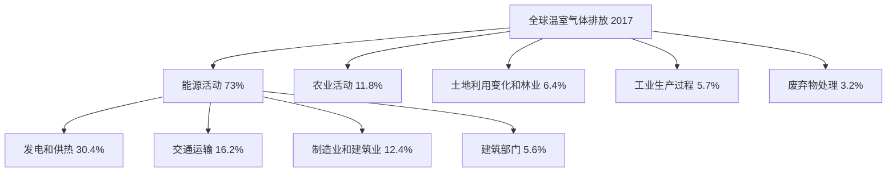

---

## 第二章：中国实现碳中和面临的挑战

### 1. 核心论点
问题：中国实现碳中和面临哪些独特且艰巨的挑战？  
观点：中国经济增速高、能源需求未达峰；以煤为主的电力结构转型难；交通、工业、建筑脱碳技术待突破；农业减排受蛋白质供应上升制约；地区发展不平衡加剧公平性问题。

### 2. 关键概念
- 能源强度：单位GDP能耗，中国仍高于发达国家。
- 碳达峰与碳中和的间隔：发达国家40-60年，中国仅30年。
- 资产搁浅：煤电等化石能源资产因转型提前退役造成的经济损失。
- 隐含碳责任：中国承担了约1/4的出口产品隐含碳排放。

### 3. 逻辑推演
从五个维度展开：①经济增长5%以上，能源需求持续增长，工业用电占67%；②电力结构中火电占72%，水电核电发展空间有限，风光资源区域错配；③交通部门排放持续上升，商用车和民航技术瓶颈；④工业部门钢铁水泥脱碳需颠覆性工艺；⑤农业人均蛋白供应量仍低于发达国家，人造肉口感和成本瓶颈。最后指出地区不平衡问题。

### 4. 经典金句/数据
> “中国从碳达峰到碳中和之间只有三十年的时间，因此任务会更加紧迫。”
> “2019年煤炭占我国能源消费的58%，占全国二氧化碳总排放的80%。”
> “重型货车碳排放目前占中国道路交通二氧化碳排放的40%-55%。”
> “建筑行业碳排放达到峰值时间预计为2039年前后，比全国整体实现碳达峰的时间预计晚9年。”

### 图表结构提炼

**主要国家碳达峰与碳中和时间对比**

| 国家 | 达峰时间 | 承诺碳中和时间 | 间隔 |
|------|----------|----------------|------|
| 英国 | 1970s | 2050 | ~80年 |
| 德国 | 1970s | 2050 | ~80年 |
| 美国 | 2007 | 2050 | 43年 |
| 日本 | 2013 | 2050 | 37年 |
| 中国 | 2030前 | 2060 | 约30年 |

---

## 第三章：碳中和带来的投资机遇

### 1. 核心论点
问题：碳中和目标下哪些领域存在重大投资机遇？  
观点：电力、交通、工业、新材料、建筑、农业、负碳排放、数字化八个领域将迎来颠覆性技术突破和巨大市场空间。

### 2. 关键概念
- 绿氢：可再生能源制氢，用于工业深度脱碳。
- CCUS：碳捕集利用与封存，负碳排放技术。
- 生物基高分子材料：替代石化基材料，实现材料脱碳。
- 直接空气碳捕集（DAC）：从空气中捕集CO2并封存或利用。

### 3. 逻辑推演
依次分析八大领域：电力部门以光伏、风电为主力，储能和智能电网配套；交通部门电气化为主，氢能用于重卡和航运；工业部门需氢能炼钢、熟料替代；新材料用生物基替代石化基；建筑部门节能改造与热泵技术；农业部门植物蛋白、精准农业、基因编辑；负碳排放技术（CCUS、DAC）作为兜底；数字化技术赋能全行业减排。

### 4. 经典金句/数据
> “全球光伏发电成本在过去十年间累计下降了82%。”
> “到2050年，全球电力消费量将是目前的2.5倍。”
> “ICT技术在未来十年内有潜力通过赋能其他行业帮助减排全球碳排放的20%。”
> “CCUS低浓度捕集成本为每吨40-120美元，DAC成本约400-600美元每吨。”

### 方法流程图（八大领域投资机遇）

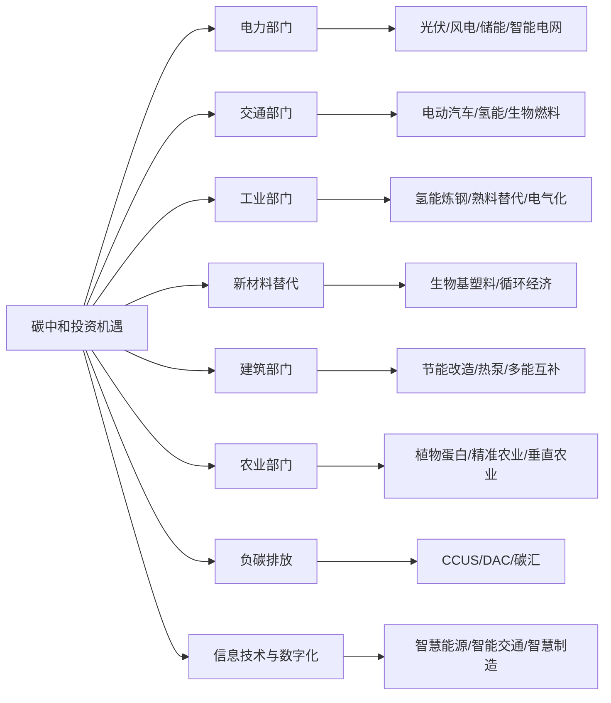

---

## 第四章：政府、企业和金融的作用

### 1. 核心论点
问题：各方主体如何协同推动碳中和？  
观点：政府应设立碳总量目标、完善碳市场和碳税，推动电力市场改革；企业应开展碳核算并制定减排计划；金融机构应创新绿色金融产品，大力投资绿色科技。

### 2. 关键概念
- 碳定价：碳交易和碳税两种机制。
- 科学碳目标（SBTi）：企业设定与《巴黎协定》一致的减排目标。
- 投贷联动：银行与股权投资基金合作支持绿色科技。
- 转型金融：支持高碳行业向低碳转型的金融产品。

### 3. 逻辑推演
首先阐述政府角色：设定碳配额、建设全国碳市场、推动电力市场化改革、制定战略性产业规划（如电动汽车）。然后说明企业行动：碳核算（自身、产品、价值链）、设定减排目标、推动核心业务转型，尤其是煤炭相关行业需研发CCUS或彻底转型。最后强调金融机构：通过绿色信贷、绿色债券、绿色基金、私募股权投资等支持绿色技术，尤其是建立支持早期绿色科技的PE/VC体系。

### 4. 经典金句/数据
> “实现1.5℃目标导向转型路径需累计新增投资约138万亿元人民币。”
> “在全国碳交易市场运行的基础上，政府引入碳税可以扩大碳定价覆盖范围。”
> “上市公司因为接受大范围的投资者投资，因此需要公开碳排放情况。”
> “鼓励保险公司、养老基金、政府产业引导基金等逐步增加对绿色科技投资的比例。”

### 方法流程图（企业碳核算步骤）

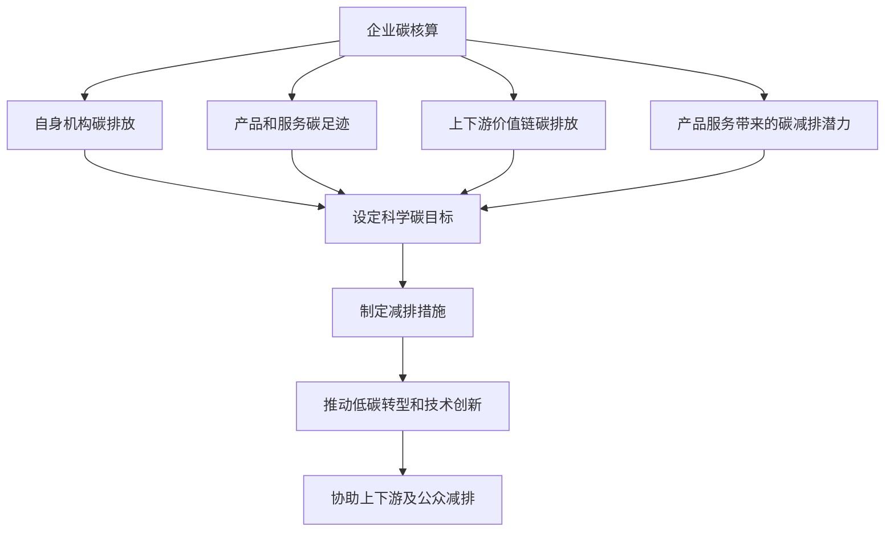

---

## 参考文献
报告列出了约40篇国内外文献，包括IPCC报告、IEA数据、清华气候变化研究院研究等。

---

# 《红杉中国零碳研究报告》章节总结

## 书籍信息
- 书名：红杉中国零碳研究报告（全称：红杉中国2021年4月零碳研究报告）
- 作者：红杉中国
- 日期：2021年4月
- PDF状态：完整可识别
- OCR状态：良好

## 目录说明
- 目录包含0-6章：责任、全局、解析、投资、技术、使命、合力
- 结构清晰，按顺序整理

## 全书核心主题
本报告从全球碳共同体的视角，阐述中国承担隐含碳责任的担当，分析中央政府与地方政府面临的碳约束，分解碳中和目标的时间、空间、要素维度，测算资金缺口，提出十大技术方向，并给出红杉中国的十大行动愿景和政策建议。核心观点是：中国需要在刀锋之路上实现减碳与增长双赢，股权投资应成为碳中和资本的重要来源。

---

## 第0章：责任：全球“碳共同体”中的中国担当

### 1. 核心论点
问题：中国在全球碳减排中承担了怎样的责任？  
观点：中国通过出口贸易承担了大量“隐含碳”，相当于美日加英四国滞留他国的碳排总和；中国从碳达峰到碳中和仅30年，减排斜率远陡峭于欧美，展现了前所未有的大国担当。

### 2. 关键概念
- 隐含碳：国际贸易中生产国为消费国承担的碳排放。
- 碳达峰-碳中和间隔：中国30年，欧盟71年，美国45年。
- 刀锋之路：在人均GDP1万美元且需保持高增长的背景下实现快速减排。

### 3. 逻辑推演
首先用OECD数据说明中国净出口隐含碳20.14亿吨（2015年），占中国全部碳排放约1/4。然后对比各国达峰至碳中和的年限，指出中国需用30年完成欧美40-60年的减排量。最后提出中国选择“低碳或零碳的绿色技术和产业体系，同时实现高生产率”的刀锋之路。

### 4. 经典金句/数据
> “中国净出口贸易中的隐含碳排放在2015年高达20.14亿吨，接近美、日、加、英滞留他国的‘隐含碳’总量（共22.04亿吨）。”
> “中国的中和斜率会远陡峭于欧美，减排速度要超出欧盟一倍。”
> “刘世锦：既要马儿跑得快，又要马儿少吃草，即少排放，或者是零排放。”

---

## 第1章：全局：低碳化重塑的政策制定约束

### 1. 核心论点
问题：中央和地方政府在碳中和目标下面临哪些关键约束？  
观点：中央需要解决碳排放定义、经济发展与化石燃料脱钩、长短期目标协调三大难题；地方政府则面临行动方案属地化适配、财政不均衡、就业不均衡三大挑战。

### 2. 关键概念
- 碳锁定：长期依赖化石能源技术系统形成的路径依赖。
- 资产搁置：煤电厂平均退役年限需从50年缩短至30年，带来财务风险。
- 差别化转型：根据城市类型（服务型、工业型、综合型、农业型）制定不同方案。

### 3. 逻辑推演
中央层面：首先明确碳排放核算边界；其次指出中国能源结构以煤为主（2019年煤炭生产占68.8%），且存在“碳锁定”；最后用清华ICCSD路径说明非化石能源增速需从0.8%加速至3%，碳排每年下降4%。地方层面：举例山西、内蒙古等资源型省份财政对采矿业依赖度高（山西达48%），煤炭行业从业人员从530万可能降至20万，面临转型阵痛。

### 4. 经典金句/数据
> “2019年我国GDP增长2.3%，第二产业消耗了76%的化石燃料。”
> “中国GDP单位能耗为世界平均水平的1.5倍。”
> “中国拥有全球超过一半的煤电装机容量，平均产能利用率已降至50%以下。”
> “预计到2050年，整个煤炭行业从业人员可能减少到20万人。”

### 图表结构提炼

**城市分类与碳约束特点**

| 城市类型 | 代表城市 | 碳约束特点 |
|----------|----------|-------------|
| 服务型 | 北京 | 服务业占比大，燃煤治理效应减小 |
| 工业型 | 宁波 | 碳排放总量和强度基数高，增长惯性大 |
| 综合型 | 武汉 | 工业与服务型相当，碳排放基数不低 |
| 农业型 | 西双版纳 | 农业养殖和机械耕种碳排放占比高 |

---

## 第2章：解析：碳中和目标的全方位分解

### 1. 核心论点
问题：如何从时间、空间、要素三个维度分解碳中和目标？  
观点：时间上分为四个十年（蓄势、切换、近零、中和）；空间上通过各省碳排放测算识别区域差异；要素上强调政府和市场协同发力。

### 2. 关键概念
- 四个十年阶段：2021-2030转型过渡蓄势期，2031-2040能源结构切换期，2041-2050近零排放发力期，2051-2060全面中和决胜期。
- 第二产业碳排占比：各省普遍超过70%，西部地区尤为明显。
- 碳排测算方法：用能源终端消费量乘以标准煤碳排放因子（2.7725 tCO2/tce）。

### 3. 逻辑推演
时间维度：列出每个五年规划的战略要点，如“十四五”摸清家底、“十五五”严格指标、“十八五”电力系统碳中和、“十九五”与CO2脱钩等。空间维度：用红杉中国测算方法得出江苏（9.32亿吨）、广东、河北、山东、河南为碳排前五省份；第二产业碳排占比突出，北京是唯一第三产业碳排超过第二产业的省市。要素维度：政府需制定规划，市场需引导资金和技术流向。

### 4. 经典金句/数据
> “王金南院士：不少地方认为2030年前还可以继续大幅提高化石能源使用量，甚至在‘高碳’的轨道上谋划‘十四五’发展规划。”
> “江苏2019年排放二氧化碳9.32亿吨，居全国首位。”
> “宁夏第二产业碳排放量占比突出为87%。”

### 方法流程图（碳中和时间线）

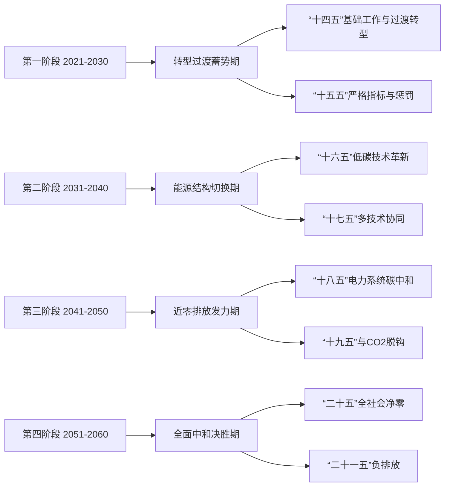

---

## 第3章：投资：为决定性低碳转型调集资金

### 1. 核心论点
问题：碳中和资金缺口多大？当前投资存在什么问题？  
观点：2021-2060年绿色投资年均缺口约3.84万亿元；资本来源单一（社会资本激励不足）、资本结构失衡（信贷占90%，股权投资仅3%）是主要问题。

### 2. 关键概念
- 资金缺口测算：假设GDP增速4.7%、绿色投资占GDP 2.5%、财政绿色投资增速7.9%，得出碳达峰后缺口扩大。
- 绿色投资机构：如英国绿色投资银行、美国州绿色银行，通过公共资本撬动社会资本。
- 财政资金+激励机制：如德国复兴信贷银行贴息、美国能源部贷款担保。

### 3. 逻辑推演
首先汇总各机构预测：年资金需求2.6-4.2万亿元，社会资本占90%左右。然后构建模型测算：2021-2030年均缺口2.7万亿，2031-2060年均缺口4.1万亿。接着分析问题：社会资本参与不足，股权投资占比仅3%。最后介绍国际经验：英国绿色投资银行私有化、美国康涅狄格州绿色银行定制融资产品、德国贴息信贷等。

### 4. 经典金句/数据
> “到2060年，我国绿色投资年均缺口约3.84万亿元。”
> “当前绿色投资资本工具中，信贷占比90%，股权投资占比仅3%。”
> “英国绿色投资银行以23亿英镑出售给麦格理集团，私有化后撬动更多私人资本。”
> “德国复兴信贷银行2012-2016年支持能源转型资金规模高达1030亿欧元。”

### 图表结构提炼

**绿色投资需求与缺口预测（2020年价格，万亿元）**

| 年份 | 2020 | 2030 | 2040 | 2050 | 2060 |
|------|------|------|------|------|------|
| 绿色投资需求 | 4.0 | 6.36 | 10.07 | 15.95 | - |
| 财政绿色投资 | 0.53 | 1.13 | 2.41 | 5.15 | 11.02 |
| 资金缺口 | 2.5 | 2.89 | 3.96 | 4.92 | 4.93 |

---

## 第4章：技术：创新技术引导零碳产业化

### 1. 核心论点
问题：哪些技术方向可加速商业化落地？  
观点：十大技术方向包括固态电池、家用储能、新材料、智慧车路协同、暖通AI控制、存算一体AI芯片、化石能源+CCUS、直接空气碳捕获、碳量化审计、合成生物技术。

### 2. 关键概念
- 固态电池：能量密度500Wh/kg以上，解决续航焦虑。
- 存算一体AI芯片：突破冯·诺依曼架构，能效比大幅提升。
- 直接空气捕获（DAC）：从空气中捕集CO2，成本高但前景广阔。
- 合成生物学：改造生物体实现能源转换、生物采矿等。

### 3. 逻辑推演
先列出碳中和技术图谱（供给侧、需求侧、负排放）。然后按优先级分三档：第一档（光伏、新能源汽车）产业替代空间大、迫切性高；第二档（固态电池、储能、合成生物）产业竞争力上升期；第三档（碳移除、太阳辐射管理）产业空间大但短期见效慢。最后逐项介绍十大技术方向，给出减排原理和市场前景。

### 4. 经典金句/数据
> “丰田可于2025年前实现固态电池汽车量产，充电10分钟续航500公里，30年后保持90%以上性能。”
> “中国有40万个中小数据中心总体耗电超1000亿度，折算碳排放约9600万吨。”
> “存算一体AI芯片训练所需能耗仅为基于数字CMOS方法的十万分之一。”
> “合成生物学市场规模2022年将达到139亿美元。”

### 方法流程图（碳中和技术优先级）

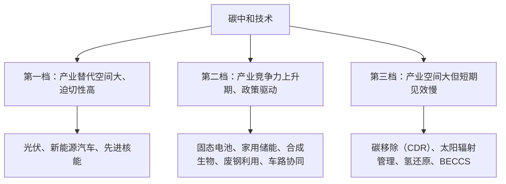

---

## 第5章：使命：红杉中国赋能零碳科技创新生态

### 1. 核心论点
问题：红杉中国在碳中和领域有哪些布局和承诺？  
观点：红杉中国通过绿色投资版图、百亿碳中和技术基金、投后赋能支持零碳企业，并承诺十大行动愿景，包括布局长坡赛道、关注五大排放部门、培育隐形冠军、2025年前放弃本地数据中心等。

### 2. 关键概念
- 长坡赛道：跨越40年的投资主题，分四个十年阶段。
- 公民碳普惠：从个人消费端对绿色低碳行为赋予碳减排量价值。
- ESG投资：将环境、社会、治理因素纳入投资决策。

### 3. 逻辑推演
首先展示红杉中国的零碳生态：投资中持水务、百川环能、蔚来汽车、小鹏汽车、远景动力等。然后介绍2021年3月与远景科技成立100亿元碳中和技术基金。接着列举被投企业案例：国能中电超低排放技术、蔚来“蓝点计划”、蒙草抗旱、班布竹纤维。最后列出十大行动愿景：拓展长坡赛道、覆盖五大部门终端节能、培育隐形冠军、基于自然的解决方案、ESG纳入投资、扩大信息披露、强化政策研究、加速实验室到市场转换、2025年前上云、推动公民碳普惠。

### 4. 经典金句/数据
> “红杉中国与远景科技集团共同成立总规模为100亿元人民币的碳中和技术基金。”
> “蔚来成为全球第一家帮助用户进行碳减排认证的汽车品牌，用户行驶近14亿公里，减排超9万吨。”
> “班布1千克本色生活用纸碳足迹2.54千克CO2，比漂白纸低31%。”
> “采用绿色方法将本地数据中心数据迁移至云端，全球每年可减排5900万吨。”

### 方法流程图（红杉中国十大行动愿景）

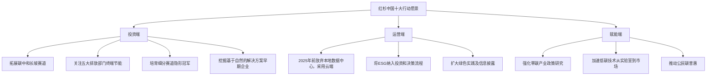

---

## 第6章：合力：中国长期低碳发展的政策建议

### 1. 核心论点
问题：为推动碳中和需要哪些政策？  
观点：建议从市场化推动新技术、促进市场化资本、完善配套基础政策三方面发力，包括加强基础研究、鼓励产学研合作、设立专项资金、统一绿色金融标准、明晰环境信息披露、建立碳排放核算体系、提供转型培训等。

### 2. 关键概念
- 产学研合作：高校科研资源与产业界联动。
- 绿色金融标准统一：解决《绿色产业指导目录》《绿色债券支持项目目录》等不一致问题。
- 转型培训：为高碳行业人员提供再就业培训。

### 3. 逻辑推演
针对传统部门建议：加强碳达峰碳中和基础研究、鼓励产学研合作攻关关键技术、深化股权激励。针对新兴产业建议：加快建设运用低碳技术的新场景、设立专项资金。针对资本市场建议：完善统一绿色金融标准、明晰金融机构环境信息披露规范、运用政策工具激励可持续投融资。配套基础政策：建立统一规范的核算体系、建立脱碳关键技术综合成本收益分析框架、政府提供转型培训支持、因地制宜推进区域差别化转型。

### 4. 经典金句/数据
> “我们建议政府运用政策工具引导、鼓励碳达峰碳中和相关基础研究的有序高效开展。”
> “建议政府明晰对金融机构披露环境信息的标准，针对不同行业分别制定合理、精细的披露规范。”
> “针对传统电力、煤炭、建筑等高碳行业就业人员，地方政府可通过服务采购、培训消费券、税费优惠等举措吸引第三方培训机构参与。”

---

# 《光大证券碳中和专题报告》章节总结

## 书籍信息
- 书名：践行绿色发展，拥抱低碳革命——碳中和专题报告
- 作者：光大证券研究所（殷中枢、马瑞山、郝骞、黄帅斌、陈无忌）
- 日期：2021年3月5日
- PDF状态：完整可识别
- OCR状态：良好

## 目录说明
- 目录分为：大重构、碳市场、投资、风险提示三个主要部分（实际正文有三个大章）
- 按原顺序整理

## 全书核心主题
本报告从供给侧改革、能源革命与产业升级的大重构视角出发，系统分析碳中和的六大减排路线（源头减量、能源替代、回收利用、节能提效、工艺改造、碳捕集），详细解读欧洲碳市场发展经验及中国碳市场建设，最后全景梳理三大方向（源头减量、能源替代、节能措施等）对应的投资标的。

---

## 第一部分：大重构：供给侧改革、能源革命与产业升级

### 1. 核心论点
问题：碳中和如何推动能源系统和产业经济的大重构？  
观点：碳中和不仅是环境目标，更是能源保障、产业转型、大国博弈的战略抓手；六大减排路线（源头减量、能源替代、回收利用、节能提效、工艺改造、碳捕集）构成技术路径。

### 2. 关键概念
- 能源进口依赖：原油73%，天然气40%以上。
- 碳关税：发达国家可能对未实施碳减排国家的进口产品征收。
- 六大路线：源头减量（压减产能、差别电价）、能源替代（光伏、风电、储能、电气化）、回收利用（废钢、再生铝、塑料回收、电池梯次利用）、节能提效（余热回收、热泵、IGBT）、工艺改造（氢炼钢、原料替代）、碳捕集（CCUS）。

### 3. 逻辑推演
首先论述碳中和对中国能源保障（降低油气依赖）和产业转型（在太阳能等领域已建立优势）的意义，指出碳关税既是压力也是动力。然后重点展开六大路线：源头减量包括直接压减产能（如钢铁）和差别电价；能源替代详细预测光伏风电新增装机、储能投资、终端电气化率；回收利用强调废钢和再生铝比例远低于发达国家；节能提效列举热泵、IGBT等；工艺改造针对钢铁、水泥、电解铝等过程排放；碳捕集介绍成本（300-500元/吨）。

### 4. 经典金句/数据
> “2019年我国能源消费总量48.7亿吨标煤，其中煤炭占57.7%。”
> “预测‘碳中和’将为可再生能源发电领域累计增加约84万亿元人民币的新增投资。”
> “我国电炉钢产量占比仅9%，远低于全球平均水平27.7%。”
> “CCUS低浓度燃煤电厂捕集成本约300-500元/吨。”

### 方法流程图（六大减排路线）

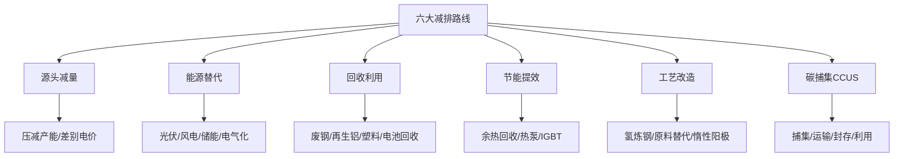

---

## 第二部分：碳市场：欧洲到中国，渐行渐近的碳约束

### 1. 核心论点
问题：碳市场如何运作？欧洲经验对中国有何启示？  
观点：碳市场通过市场化方式形成碳价，倒逼减排；欧洲经历了四个阶段，采用渐进式、柔性机制（MSR）和衍生品市场；中国从试点走向全国，首批纳入发电行业，碳价将稳步增长。

### 2. 关键概念
- EU ETS：欧盟排放交易体系，2005年启动，全球最大碳市场。
- MSR（市场稳定储备）：解决配额过剩问题，稳定碳价。
- CCER（国家核证自愿减排量）：用于配额抵消，比例不超过5%。
- MRV（监测、报告、核查）：碳核查的核心流程。

### 3. 逻辑推演
首先介绍全球碳市场现状，21个运行体系覆盖18%排放。然后分析欧洲碳市场：四个阶段（2005-2007、2008-2012、2013-2020、2021后），配额分配从免费转向拍卖，线性折减系数增至2.2%，MSR机制使碳价进入上涨通道（2021年初约33欧元/吨），期货交易占九成。接着分析中国试点：8个试点，2020年成交均价27.5元/吨，北京碳价突破90元/吨。最后介绍全国碳市场：首批仅发电行业，未来纳入八大行业；CCER重启预期；配额分配对机组技术路线的影响。

### 4. 经典金句/数据
> “2019年全球碳市场总交易额约1940亿欧元，同比增长34%。”
> “欧盟碳价因MSR机制进入稳定上涨通道，2021年初约33欧元/吨。”
> “中国试点碳市场2020年成交均价27.5元/吨，北京突破90元/吨。”
> “CCER出售可为光伏、风电带来约4%的收入增量。”

### 方法流程图（中国碳市场结构）

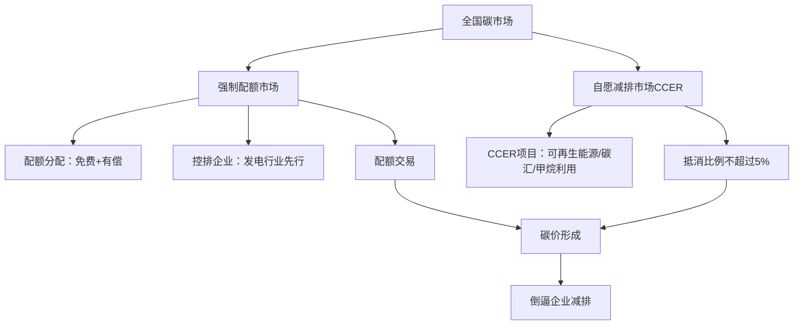

---

## 第三部分：投资：减排路径全景分析及对应标的梳理

### 1. 核心论点
问题：六大路径对应的投资标的有哪些？  
观点：源头减量关注能耗大户（电解铝、硅铁等）；能源替代关注光伏、风电、储能、氢能、新能源汽车全产业链；节能措施关注IGBT、热泵等设备；回收利用关注废钢、电池回收、垃圾分类；工艺改造关注智慧电网、特高压、装配式建筑。

### 2. 关键概念
- 能耗大户产品：电解铝、硅铁、石墨电极、水泥、铜加工、烧碱、涤纶、黄磷、锌。
- 逆变器：贯穿风光储氢的核心电力电子设备。
- 锂电回收：动力电池梯次利用与金属回收。
- 车桩比：假设2030年达到1:1。

### 3. 逻辑推演
先列出源头减量相关标的（鄂尔多斯、方大炭素、海螺水泥等）。然后详细展开能源替代：逆变器（阳光电源、固德威）、光伏（隆基、通威）、风电（日月股份、明阳智能）、储能（宁德时代、派能科技）、氢能（亿华通）、锂电新能源车（宁德时代、亿纬锂能）、运营商（太阳能、节能风电）、锂电回收（格林美）、充电桩（特锐德）。最后列出节能措施（汇川技术、陕鼓动力）、回收利用（华宏科技、格林美、中再资环）、工艺改造（国电南瑞、鸿路钢构）。

### 4. 经典金句/数据
> “碳减排（碳捕捉）等方式的经济性尚未满足大规模市场化推广的需求，政府可能通过‘能耗’等措施进行供给侧改革。”
> “电动车领域累计将带来130万亿人民币的累计新增投资。”
> “充电桩累计新增投资达到18.15万亿元人民币。”
> “风险提示：政策推动不及预期、技术路线发展不及预期、能源系统出现超预期事件。”

### 图表结构提炼（投资标的梳理）

| 路径 | 细分领域 | 代表标的 |
|------|----------|----------|
| 源头减量 | 高耗能产品 | 鄂尔多斯、方大炭素、海螺水泥 |
| 能源替代 | 逆变器 | 阳光电源、固德威、锦浪科技 |
| 能源替代 | 光伏 | 隆基股份、通威股份、福斯特 |
| 能源替代 | 风电 | 日月股份、明阳智能、振江股份 |
| 能源替代 | 储能 | 宁德时代、派能科技、永福股份 |
| 能源替代 | 氢能 | 亿华通、潍柴动力 |
| 能源替代 | 锂电新能源车 | 宁德时代、亿纬锂能、先导智能 |
| 能源替代 | 充电桩 | 特锐德、盛弘股份、中恒电气 |
| 节能措施 | 变频/IGBT | 汇川技术、斯达半导 |
| 回收利用 | 废钢/电池/垃圾分类 | 华宏科技、格林美、中再资环 |
| 工艺改造 | 智慧电网/特高压/装配式 | 国电南瑞、许继电气、鸿路钢构 |

---

## 风险提示

### 核心论点
本章指出三大风险：政策推动不及预期、技术路线发展不及预期、能源系统出现超预期事件（如风光不稳定性对电网的冲击）。

---

# 《零碳中国·绿色投资》章节总结

## 书籍信息
- 书名：零碳中国·绿色投资——以实现碳中和为目标的投资机遇
- 作者：中国投资协会，落基山研究所
- 日期：2020年（蓝皮书）
- PDF状态：完整可识别
- OCR状态：良好

## 目录说明
- 包含执行摘要、七大投资领域分析、结论等
- 结构清晰，按顺序整理

## 全书核心主题
本报告提出“零碳中国”倡议，识别七大最具潜力的零碳投资领域：再生资源利用、能效、终端消费电气化、零碳发电技术、储能、氢能、数字化。报告认为，到2050年这七大领域当年市场规模将达15万亿元，撬动70万亿元基础设施投资，并创造3000万以上就业岗位。

---

## 执行摘要

### 1. 核心论点
问题：零碳中国将催生哪些投资机遇，规模多大？  
观点：七大投资领域到2050年市场规模近15万亿元，2020-2050年撬动70万亿元基础设施投资，创造3000万以上就业岗位。

### 2. 关键概念
- 颠覆性技术临界点：市场份额达3%时资本开始从传统企业抽离（电动汽车2019年2.6%，2020年超3%）。
- 七大领域：再生资源利用、能效、终端消费电气化、零碳发电技术、储能、氢能、数字化。
- 零碳情景：2050年终端能源消费22亿吨标煤（较2016年下降27%），化石燃料需求降幅超90%。

### 3. 逻辑推演
首先指出全球零碳共识和中国碳中和目标的政策信号。然后分析新能源技术正接近临界点（EV、光伏、风电份额）。接着描绘2050年零碳图景：电气化率74%（交通）、75%（建筑），光伏风电占总装机70%，氢能占终端能源12%。最后给出七大领域市场规模和投资撬动效应。

### 4. 经典金句/数据
> “当新的颠覆性技术的市场份额达到3%左右时，资本将开始从传统企业抽离。”
> “到2050年，七大领域当年的市场规模将达到近15万亿元。”
> “未来30年，中国为实现碳中和目标，仅在能源相关基础设施建设领域的投资规模将达到100万亿元。”
> “零碳电力、再生资源利用、氢能等新兴行业将带来3000万个以上新就业机会。”

### 方法流程图（零碳中国七大投资领域）

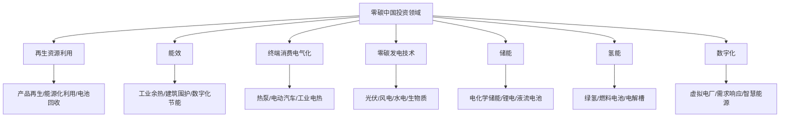

---

## 七大领域详细分析（摘要）

### 领域1：再生资源利用
- 发展阶段：高耗能产品再生和废弃物能源化处于稳步复苏期；电池回收处于技术萌芽期
- 重点：钢铁、水泥、铝、塑料的产品再生；秸秆、生活垃圾能源化；动力电池回收
- 投资策略：抓住技术和商业模式突破口，关注上下游价值链整合

### 领域2：能效
- 发展阶段：政策主导向市场主导转变，建筑能效是增长新动力
- 重点：工业余热余压利用、通用设备能效提升、建筑围护结构和供暖制冷系统
- 投资策略：关注数字化技术应用和整体节能解决方案

### 领域3：终端消费电气化
- 发展阶段：建筑热泵（泡沫破裂后爬升）、交通电动化（期望膨胀期）、工业电热（技术萌芽期）
- 重点：空气源热泵、电动汽车、微波/红外/电弧加热
- 投资策略：北方农村采暖维持补贴，南方高端市场培育，电动汽车差异化优势

### 领域4：零碳发电技术
- 发展阶段：产业成熟期
- 重点：光伏、风电（成本持续下降，非技术成本是关键）
- 投资策略：关注技术创新和模式创新，降低土地、并网等非技术成本

### 领域5：储能
- 发展阶段：多种技术共存，锂电主流
- 重点：锂离子电池、液流电池、铝炭电池
- 投资策略：关注应用场景经济性、安全性、可回收性，政策需解决价格机制问题

### 领域6：氢能
- 发展阶段：交通氢能（期望膨胀期），工业绿氢（技术萌芽期）
- 重点：燃料电池、电解槽、绿氢制取
- 投资策略：未来十年战略机遇期，关注核心技术和基础设施

### 领域7：数字化
- 发展阶段：运营优化成熟，系统优化（虚拟电厂、需求响应）处于期望膨胀期
- 重点：智能运维、虚拟电厂、V2G、产销一体化
- 投资策略：需要政策支持和市场机制，建立有效合作机制

### 方法流程图（技术生命周期与投资阶段）

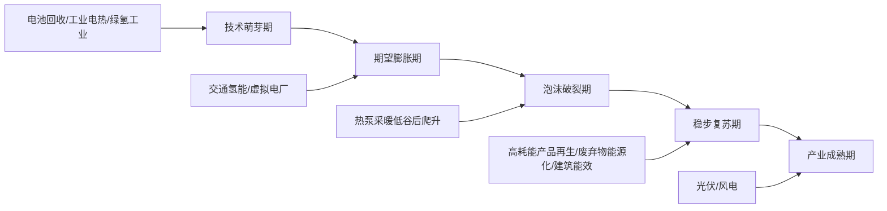

---

# 《中国2060年前碳中和研究报告》章节总结

## 书籍信息
- 书名：中国2060年前碳中和研究报告
- 作者：未明确（内容涉及中国能源互联网、全球能源互联网发展合作组织等）
- 日期：未明确（2020-2021年左右）
- PDF状态：完整可识别
- OCR状态：良好

## 目录说明
- 目录：碳中和重大意义与挑战、碳中和总体思路、基于中国能源互联网的碳中和实现路径、碳中和重点行动、碳中和综合效益
- 按顺序整理

## 全书核心主题
本报告提出以中国能源互联网（智能电网+特高压电网+清洁能源）为基础平台，大力实施“两个替代”（清洁替代、电能替代），实现“双主导、双脱钩”（能源生产清洁主导、能源使用电能主导，能源发展与碳脱钩、经济发展与碳排放脱钩）。报告给出分阶段路径、八大重点行动和投资成本分析。

---

## 第1章：碳中和重大意义与挑战

### 1. 核心论点
问题：中国实现碳中和的重大意义和主要挑战是什么？  
观点：意义包括开创生态文明、保障能源安全、推动经济转型；挑战包括碳排放总量大（占全球27%）、碳减排时间短（仅30年）、经济转型压力大、能源系统“一煤独大”（煤占58%）。

### 2. 关键概念
- 一煤独大：煤炭占能源消费58%，占CO2排放80%，煤电装机10.4亿千瓦（全球50%）。
- 碳达峰-碳中和间隔：发达国家40-60年，中国仅30年。
- 应对气候危机窗口期：不足10年。

### 3. 逻辑推演
首先阐述碳中和的三大意义：生态文明、能源安全、经济高质量发展。然后列举四大挑战：碳排放总量大（2014年温室气体比2005年增54%）、时间短（从达峰到中和仅30年）、产业转型难（第二产业占39%但高能耗产业仍高）、能源系统转型难（煤电占比高，清洁能源需全面提速）。

### 4. 经典金句/数据
> “2019年煤炭占我国能源消费的58%，占全国二氧化碳总排放的80%。”
> “煤电装机高达10.4亿千瓦，占全球煤电总装机的50%。”
> “能源消费的二氧化碳排放强度比世界平均水平高出30%以上。”

---

## 第2章：碳中和总体思路

### 1. 核心论点
问题：实现碳中和的总体思路是什么？  
观点：以中国能源互联网为基础平台，实施“两个替代”，实现“双主导、双脱钩”，分三个阶段（尽早达峰、快速减排、全面中和）。

### 2. 关键概念
- 中国能源互联网：智能电网+特高压电网+清洁能源。
- 两个替代：能源开发清洁替代、能源使用电能替代。
- 双主导：能源生产清洁主导、能源使用电能主导。
- 双脱钩：能源发展与碳脱钩、经济发展与碳排放脱钩。

### 3. 逻辑推演
首先指出我国清洁能源资源与负荷中心逆向分布（67%水能、90%风能、80%太阳能分布在西部北部），必须依靠特高压输电。然后说明特高压技术已成熟（已建在建32项工程，并网清洁能源7.6亿千瓦）。最后提出总体思路：以中国能源互联网为平台，实施两个替代，三个阶段实现碳中和。

### 4. 经典金句/数据
> “我国67%水能、90%风能、80%太阳能资源分布在西部北部，距离东中部负荷中心1000-4000公里。”
> “特高压输电技术已经全面成熟，已建和在建特高压工程32项。”
> “中国率先提出全球能源互联网理念和方案，为落实《巴黎协定》提供全球碳中和方案。”

### 方法流程图（碳中和总体思路）

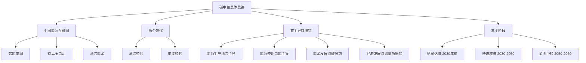

---

## 第3章：基于中国能源互联网的碳中和实现路径

### 1. 核心论点
问题：全社会、分领域、能源系统、电力系统的脱碳路径具体如何？  
观点：全社会碳排2028年左右达峰（109亿吨），2050年降至1.0吨，2055年碳中和；电力系统2050年近零排放，2060年负排放；清洁能源2060年占比90%，电气化率66%。

### 2. 关键概念
- 全社会碳排放路径：2028年达峰109亿吨→2050年1.0吨→2055年碳中和。
- 能源系统转型：煤电2025年达峰，2060年全部退出；清洁能源2040年成主导，2060年占90%。
- 电力系统：2060年电源总装机80亿千瓦，清洁能源占96%，煤电全部退出。

### 3. 逻辑推演
首先给出宏观发展指标（GDP到2060年435万亿元，人口13.33亿）。然后详细分解三个阶段：尽早达峰阶段以化石能源总量控制为核心；快速减排阶段以全面建成中国能源互联网为关键；全面中和阶段以深度脱碳和碳捕集为重点。接着分领域：能源活动减排87亿吨（占80%以上），工业生产过程减排7.4亿吨，碳汇增4.6亿吨，碳移除8.7亿吨。最后给出电源装机预测：2060年光伏35.5亿千瓦、风电25亿千瓦、水电5.8亿千瓦、核电2.5亿千瓦、煤电0、气电3.2亿千瓦、氢电2亿千瓦。

### 4. 经典金句/数据
> “我国实现全社会碳中和总体可按照尽早达峰、快速减排、全面中和三个阶段有序实施。”
> “2060年实现90%能源需求由清洁能源满足。”
> “2060年全社会用电量17万亿千瓦时，终端电气化率66%。”
> “2020-2060年我国能源电力系统累计投资约122万亿元。”

### 图表结构提炼（电源装机预测，亿千瓦）

| 电源类型 | 2030年 | 2050年 | 2060年 |
|----------|--------|--------|--------|
| 光伏 | 10 | 32.7 | 35.5 |
| 风电 | 8 | 22 | 25 |
| 常规水电 | 4.4 | 5.7 | 5.8 |
| 核电 | 1.1 | 2 | 2.5 |
| 煤电 | 10.5 | 3 | 0 |
| 气电 | 1.85 | 3.3 | 3.2 |
| 氢电 | 0 | 1 | 2 |

---

## 第4章：碳中和重点行动

### 1. 核心论点
问题：落实碳中和需要哪些重点行动？  
观点：八大重点行动包括清洁发展跨越、化石能源转型、能源互联互通、全面电能替代、产业转型升级、能效综合提升、零碳社会建设、生态治理协同。

### 2. 关键概念
- 清洁发展跨越：开发18个大型太阳能基地、21个大型陆上风电基地、7大流域水电基地。
- 化石能源转型：煤电2025年达峰（11亿千瓦），2060年全部退出；石油2030年达峰。
- 能源互联互通：建设东部“九横五纵”、西部“三横两纵”特高压骨干网。
- 全面电能替代：2060年电动汽车保有量3.9亿辆，替代率超90%。
- 零碳社会：2030年建设超300个零碳城市，2060年全面普及。
- 生态治理协同：光伏治沙、电-水-土-林-汇模式、BECCS。

### 3. 逻辑推演
逐项列出八大行动的目标和路线图。清洁发展跨越给出具体装机目标；化石能源转型明确煤电、石油、天然气达峰时间；能源互联互通给出特高压骨干网格局和跨区电力流（2060年8.3亿千瓦）；全面电能替代给出各领域电气化率目标（工业54%、交通81%、建筑79%）；产业转型升级给出战略性新兴产业占GDP比重；能效提升给出能源强度下降目标；零碳社会建设给出零碳城市数量；生态治理协同给出光伏治沙面积和BECCS捕集量。

### 4. 经典金句/数据
> “力争2025年煤电达峰，峰值11亿千瓦，2060年煤电装机全部退出。”
> “到2060年，电动汽车保有量约3.9亿辆，替代率超过90%。”
> “到2030年，打造多类零碳城市新模式，建设零碳城市（区、县）超过300个。”
> “实施‘板上发电、板下种植、板间养殖’的光伏治沙模式。”

### 方法流程图（八大重点行动）

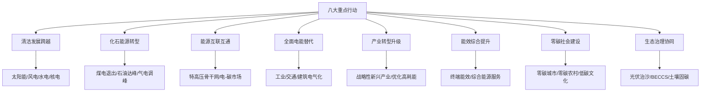

---

## 第5章：碳中和综合效益

### 1. 核心论点
问题：实现碳中和能带来哪些综合效益？  
观点：至2060年，能源投资122万亿元带动全社会投资410万亿元，创造1亿就业岗位，减少污染物排放90%以上，避免气候损失31万亿元，获得社会福利累计约1100万亿元。

### 2. 关键概念
- 投资乘数效应：1元能源投资获得9元社会福祉。
- 环境健康效益：减少二氧化硫、氮氧化物、PM2.5排放90%以上。
- 东西部协调发展：带动西部地区人均可支配收入增长。

### 3. 逻辑推演
从经济效益、能源保障、就业、区域协调、环境健康等维度展开。指出能源系统累计投资122万亿元，带动整体投资超410万亿元，对GDP增长贡献超2%。能源自给率接近100%，全社会用电成本下降20%。到2060年累计增加约1亿就业岗位。污染物减排90%以上，避免因空气污染和气候变化造成死亡2000万例。

### 4. 经典金句/数据
> “1元的能源投资能获得9元的社会福祉。”
> “到2060年，二氧化硫、氮氧化物、细颗粒物排放分别减少91%、85%、90%。”
> “可避免因室内和室外空气污染、气候变化、极端天气造成死亡人数2000万例。”
> “到2060年，我国清洁能源供应量能够满足90%的一次能源需求，能源自给率提升至接近100%。”

---

# 《远景科技集团碳中和报告2021》章节总结

## 书籍信息
- 书名：碳中和报告2021
- 作者：远景科技集团（CEO张雷）
- 日期：2021年
- PDF状态：完整可识别
- OCR状态：良好

## 目录说明
- 目录：前言与介绍、2022年实现运营碳中和、2028年实现全价值链碳中和、赋能影响力、附录
- 按顺序整理

## 全书核心主题
远景科技集团承诺2022年底实现运营碳中和，2028年底实现全价值链碳中和，是中国首个承诺价值链碳中和的企业。报告详细披露2020年碳排放数据（97,255吨CO2e），提出运营碳中和路线图（节能、绿电、碳抵消），并介绍“远景方舟”智能碳管理系统、可再生能源解决方案、以及赋能客户（如微软、PSA）的零碳实践。

---

## 前言与介绍

### 1. 核心论点
问题：远景的零碳使命和承诺是什么？  
观点：远景以“为人类的可持续未来解决挑战”为使命，承诺2022年运营碳中和、2028年全价值链碳中和，加入RE100倡议，致力于成为企业、政府、城市的零碳技术伙伴。

### 2. 关键概念
- RE100：承诺100%使用可再生能源电力。
- 科学碳目标（SBTi）：与1.5℃温控目标一致。
- 零碳技术伙伴：赋能客户实现碳中和。

### 3. 逻辑推演
首先由CEO张雷致辞，强调气候危机紧迫性。然后列出报告亮点：累计输出清洁电力超150,000GWh（相当于北京2020年用电量），减排约1亿吨CO2e；全球近60万辆电动汽车使用远景AESC电池；EnOS™管理超200GW可再生能源资产；远景维珍车队获碳中和认证。最后明确三大承诺：2022运营碳中和、2028全价值链碳中和、2025年100%绿电。

### 4. 经典金句/数据
> “远景累计输出清洁电力超过150,000GWh，超过了北京市2020年全年用电量，累计减排约一亿吨二氧化碳当量。”
> “全球已有近60万辆电动汽车安装了远景AESC生产的动力电池。”
> “远景智能物联操作系统EnOS™管理超过200GW的可再生能源资产。”
> “远景维珍车队成为电动方程式赛场中首支碳中和车队。”

### 方法流程图（远景零碳战略）

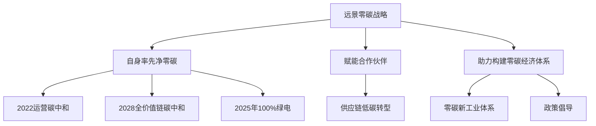

---

## 2022年实现运营碳中和

### 1. 核心论点
问题：远景2020年运营排放多少？如何实现2022年碳中和？  
观点：2020年运营排放97,255吨CO2e（范围一+二），电力消费占80%以上，远景AESC占87%。实现路径包括：能效提升、绿电替代（自建分布式+采购绿电）、剩余排放购买碳抵消。

### 2. 关键概念
- 范围一：直接排放（自有车辆、燃料燃烧）。
- 范围二：采购电力、热力、蒸汽的间接排放。
- 基于位置 vs 基于市场：基于市场方法考虑绿电采购，排放更低（82,268吨）。
- 远景方舟碳管理系统：实时监测碳足迹，自动生成报告，优化减排路径，一站式采购绿证/碳汇。

### 3. 逻辑推演
首先披露2020年排放数据：总计97,255吨CO2e，电力占80%以上，蒸汽和热力占13%。分业务：远景AESC占87%，远景能源占12%。分地区：日本占一半以上。预计到2022年排放将增长3倍以上（业务扩张），需减少或抵消约40万吨。路线图：优先能效管理和绿电，剩余购买碳补偿。解决方案包括：方舟碳管理系统、分布式风电光伏、储能、绿证交易。案例：江阴智慧能源产业园实现70%绿电，2022年成为碳中和园区典范。

### 4. 经典金句/数据
> “远景科技集团2020年温室气体排放量为97,255吨二氧化碳当量。”
> “电力消费产生的温室气体排放占总排放量的80%以上。”
> “远景AESC的碳排放占集团总排放量的87%。”
> “远景方舟碳管理系统能实时监测企业或机构的碳足迹，自动生成碳排放报告，同时模拟及优化减排路径。”

### 方法流程图（2022运营碳中和路线图）

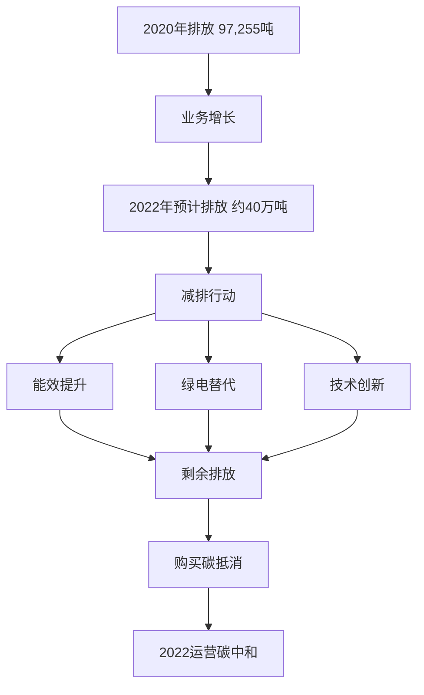

---

## 2028年实现全价值链碳中和

### 1. 核心论点
问题：价值链排放（范围三）的构成及减排承诺是什么？  
观点：2020年范围三排放占集团总排放的95%以上，其中远景能源购买的商品和服务（风机材料）占64%。远景承诺2028年全价值链碳中和，将通过优化产品设计、采购低碳材料、赋能供应商减排来实现。

### 2. 关键概念
- 范围三：价值链间接排放，包括购买商品和服务、上游运输、产品使用、废弃处置等。
- 热点分析：基于财务数据估算范围三排放，识别重点类别。
- 科学碳目标（SBTi）：远景将向SBTi提交1.5℃目标方案。

### 3. 逻辑推演
首先披露范围三数据：远景能源占84%，其中购买商品和服务占64%（风机制造材料），运输和分销占28%；远景AESC购买商品和服务占65%，电池使用阶段占11%；远景智能产品使用阶段占一半。然后提出双管齐下策略：内部优化产品设计（降低使用排放、使用可循环材料），外部赋能供应商（提供零碳解决方案）。最后承诺2028年底前实现全价值链碳中和。

### 4. 经典金句/数据
> “超过95%的温室气体排放来自于集团运营以外的价值链间接排放。”
> “购买的商品和服务占远景能源范围三排放量的64%，其中大部分用于风机制造。”
> “远景将设定与《巴黎协定》目标相一致的科学碳目标，并向科学碳目标倡议（SBTi）提交方案。”
> “力争在2028年底前实现全价值链碳中和。”

---

## 赋能影响力

### 1. 核心论点
问题：远景如何通过产品和服务赋能客户实现碳中和？  
观点：通过智能风机、智慧储能、动力电池、EnOS™智能物联操作系统、方舟碳管理系统等，远景帮助客户降低度电成本、提升能效、实现绿电交易和碳管理。典型案例包括微软大中华区、新加坡PSA港口、德国电信充电解决方案。

### 2. 关键概念
- 零碳产业园：在风光资源丰富地区，通过风光储氢一体化、绿电制氢、碳管理，吸引高耗电产业集聚。
- 智能充电：100%绿电充电解决方案，与德国电信合作。
- 虚拟电厂（VPP）：聚合分布式能源参与电力市场。

### 3. 逻辑推演
首先介绍智能风机和储能产品：远景预测到2023年三北地区“风电+储能”度电成本降至2毛钱。然后介绍零碳产业园示范：在鄂尔多斯矿区为重卡提供电气化升级，每年减碳超3000万吨。接着介绍数字化赋能：EnOS™管理超200GW资产，每天处理700亿数据点。案例：为微软大中华区提供智慧楼宇和储能方案，累计收益超25万美元；为PSA新加坡港口设计五大智慧能源应用，打造“零碳超级港”；与德国电信合作100%绿电智能充电。

### 4. 经典金句/数据
> “远景预测到2023年，三北地区‘风电+储能’度电成本降至2毛钱。”
> “在内蒙古鄂尔多斯矿区，远景为重卡提供电气化升级，每年减少二氧化碳排放超过3000万吨。”
> “EnOS™已管理超过200GW能源资产，每天处理约700亿能源数据交易量。”
> “远景为微软设计的楼宇储能解决方案，累计收益超25万美元。”

---

## 附录

### 附录一：环境数据表
- 2020年远景能源范围一+二（基于位置）：约41,584吨CO2e（能源部分，总表显示远景能源范围一+二约1.5万吨？实际表1数据需核对，但原文表1显示远景能源范围一+二基于位置为11,767？建议以报告正文为准）

### 附录二：核算边界与方法
- 组织边界：运营控制权法，覆盖四个业务部门
- 运营边界：范围一、二、三（15类中报告了部分，排除不显著类别）
- 测算方法：排放因子法、物料平衡法，使用国际公认数据库
- 排放因子来源：UK Government GHG Conversion Factors、IEA、中国发改委等

> 说明：附录部分表格数据因OCR识别精度有限，未完整转录，但核心方法已概括。