# 《这就是GEO：在AI流量红利中抢占先机》章节总结

## 书籍信息

- **书名**：这就是GEO：在AI流量红利中抢占先机
- **作者**：张其来 武寒波
- **出版社**：人民邮电出版社有限公司
- **出版时间**：2026-03-01
- **ISBN**：9787115689856
- **PDF状态**：完整电子版（EPUB格式转换）
- **OCR状态**：良好，图文均可识别

## 目录说明

本书共分为5个主要章节，外加前言和小结：
- 前言：欢迎来到“答案经济”时代
- 第1章：GEO是什么
- 第2章：理解GEO思维
- 第3章：GEO实战四步法
- 第4章：GEO工具箱
- 第5章：GEO的未来
- 各章均附有小节

## 全书核心主题

本书系统阐述了在AI驱动的“答案经济”时代，企业如何通过GEO（生成式引擎优化）构建数字信任，从传统SEO的“抢排名”思维转向“成为答案”的战略。作者提出，用户获取信息的方式已从“搜索→点击→整合”转变为“提问→接收”，AI直接生成整合答案。GEO的核心是将企业信息优化为高质量、结构化的知识单元（KU），让AI理解、验证并采纳。本书提供了K-DAF闭环模型（知识确权、语义定义、信任放大、效果反馈）作为实战方法论，并构建了GEO-ROI评估体系。最终指向KGO（知识图谱优化）的未来演进，强调投资“不变的知识”是企业最深阔的护城河。

---

## 前言：欢迎来到“答案经济”时代

### 核心论点

**问题**：AI时代信息获取方式发生了怎样的根本性变革？企业面临什么新挑战？

**观点**：用户已从“获得链接列表”转向“期待直接答案”，企业必须从SEO思维转向GEO思维，否则将在AI驱动的商业世界中“隐形”。

### 关键概念

- **答案经济时代**：用户直接向AI提问并获得整合答案的新信息获取范式，区别于传统搜索时代的关键词检索和链接点击。
- **GEO（生成式引擎优化）**：让企业的知识、服务与品牌成为AI生成答案时所依赖的可信引用源的优化方法。
- **SEO（搜索引擎优化）**：传统的信息可见性优化，目标是让网站在搜索结果中排名靠前。
- **大脱钩（The Great Decoupling）**：曝光量与点击量的价值分离现象——内容被AI“看见”但品牌“消失”。

### 逻辑推演

作者从一个咖啡馆观察切入：年轻妈妈用AI询问幼儿园选择，AI直接给出结构化答案。这标志着信息获取方式的根本变革。作者回顾20年前从黄页到搜索引擎的转变，类比说明当前转折点的重要性。Gartner预测到2026年传统搜索使用量将下降25%。ChatGPT截至2025年8月拥有约800万周活跃用户，每天处理超10亿次查询。作者指出，许多企业仅停留在“用ChatGPT写文案”层面，未意识到AI正在重新定义数字营销规则。本书核心问题是：在AI主导的信息获取时代，企业如何构建真正有效的数字资产？

### 经典金句

> “我们已不再满足于可能‘在哪里’，而更想知道‘它是什么’。”

> “如果你的企业信息无法被AI理解并有效引用，那么在AI驱动的未来商业中，你的企业就如同在数字世界里‘隐形’。”

> “GEO并非旨在全面取代SEO，它们各自有适用的场景。”

> “AI正在重新定义整个数字营销的游戏规则。”

---

## 第1章：GEO是什么

### 1. 核心论点

**问题**：GEO是什么？它与传统SEO有何本质区别？

**观点**：GEO是将业务信息从独立网页优化为高质量、结构化知识体系，让AI理解、验证并采纳的方法论。其核心逻辑是从PageRank的“链接权威”评估转向AnswerRank的“事实信任”评估。

### 2. 关键概念

- **AnswerRank**：作者提出的概念模型，描述AI如何为知识而非网页排序的信任评估逻辑。评估知识本身的可信度而非外部链接权重。
- **知识单元（Knowledge Unit, KU）**：GEO操作的基本单位，是被AI识别、提取和重组的知识模块。
- **四大数字资产支柱**：
  - 实体权威性：AI确认“你是谁”
  - 结构化语义资产：AI看懂“你有什么”
  - 多模态专业深度：AI相信“你说的是真的”
  - 跨平台知识一致性：AI确认“你没撒谎”
- **RAG（检索增强生成）**：AI在回答问题时先检索相关信息，再生成答案的技术机制。
- **中国五大AI生态系统**：百度系（知识权威型）、腾讯系（社交关系与交易融合型）、阿里系（交易信用型）、字节系（算法推荐型）、独立生态系统（开放网络型）。

### 3. 逻辑推演

作者通过“寻找咖啡馆”的场景对比SEO和GEO的用户体验差异。SEO时代用户需在多个App间切换、交叉验证、手动整合信息，耗时约10分钟。GEO时代用户直接向AI提问，3秒后获得结构化推荐。

深入剖析后，作者提出SEO与GEO的三大维度差异：价值逻辑（从抢排名到成为答案）、用户交互（从手动整合到直接获取）、策略评估（从技术优化到信任构建）。

作者追溯算法演变：PageRank评估“容器”（网页）的权威性，AnswerRank评估“容器内事实”（知识）的准确性。普林斯顿大学2024年研究显示，传统关键词策略在AI信息提取中可能无效甚至有害。

作者重新定义“数字资产”，提出四大支柱，并分析中国五大AI生态系统的不同“口味”。最后提供“用AI透视AI偏好”的四步测试框架，并展示GEO对医疗健康、教育培训、电商零售三个行业的重塑。

### 4. 流程图

#### SEO与GEO对比图（重构）

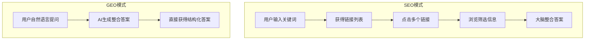

#### PageRank vs AnswerRank 对比

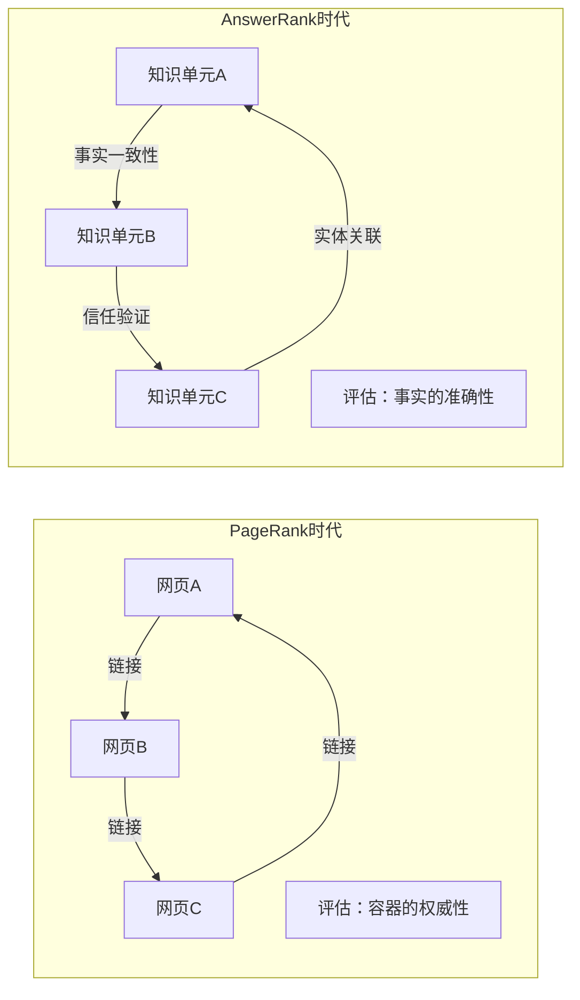

### 5. 经典金句/数据

> “GEO的核心，就是将你的业务信息，从一堆独立的网页，优化成高质量、结构化的知识体系，以便AI可以轻松理解、验证并采纳。”

> “你的目标不再是让用户‘找到你的链接’，而是让AI‘选择你的答案’。”

> “如果说SEO是在搜索引擎制定的规则下进行一场内容排序的竞技，那么GEO就是在AI的语境中进行一场知识信任的博弈。”

> “Gartner预测，到2026年，中国AI搜索将分流50%的传统SEO流量，催生百亿规模的GEO市场。”

> “截至2025年7月，ChatGPT月访问量稳定在约57亿，Perplexity查询量逼近10亿大关，谷歌的AI Overview功能已导致部分新闻网站的点击量暴跌79%。”

> “新流量公式：流量 ≈ （生态内）AI信任度 × 知识关联强度”

---

## 第2章：理解GEO思维

### 1. 核心论点

**问题**：企业在向GEO转型过程中面临哪些思维陷阱？如何建立正确的GEO思维？

**观点**：最大的阻力源于对旧有SEO经验的路径依赖。企业必须完成从“流量思维”到“信任思维”的战略升级，避开5个关键思维陷阱，并采取“双轨并行”策略平稳过渡。

### 2. 关键概念

- **双轨并行**：在保持传统SEO稳定运营的同时战略性地布局GEO，覆盖分化中的用户行为。
- **5个思维陷阱**：
  1. 将GEO视为技术补丁而非战略蓝图
  2. 只优化能被搜索的内容，忽略能被引用的结构
  3. 将GEO视为曝光手段，忽视其信任资产价值
  4. 幻想一劳永逸，忽略持续演进与反馈
  5. 对GEO的根本性认知错位（核心陷阱）
- **语义架构师**：GEO时代企业内容创作者的新角色定位。
- **知识原子**：标准化、结构化的最小知识单元，便于AI提取和重组。

### 3. 逻辑推演

作者首先论证“双轨并行”的必要性：用户行为分化（部分仍用传统搜索，部分转向AI）、平台风险分散、决策路径非线性。然后提供5个实施节点：内容策略双向适配、技术底座双重优化、评估体系双维协同、组织协同与能力建设、内容资产生命周期管理。

作者指出天平正不可逆转地向GEO倾斜，预测到2027年AI生成内容将成为超70%搜索流量的核心入口。

随后深入剖析5个思维陷阱。陷阱一是最常见的错误：将GEO简化为技术任务。破局之道是将其提升为“CEO工程”。陷阱二源于对“内容为王”的惯性解读：AI需要的是可被快速定位的知识成品，而非长篇大论。陷阱三是将GEO视为广告位：AI引用是信誉延伸而非一次性曝光。陷阱四是SEO时代投放式思维的延续：GEO需要动态运营闭环。陷阱五是最根本的认知错位，作者用对比表格系统性地重塑认知框架。

### 4. 表格重构

#### 新旧思维差异对比表

| 维度 | 旧思维（SEO延伸） | 新思维（GEO原生） |
|------|-------------------|-------------------|
| 核心目标 | 提升关键词排名 | 成为AI信任的答案源 |
| 优化单位 | 网页/页面 | 知识单元（KU） |
| 内容策略 | 关键词布局、密度 | 结构化、语义清晰、可验证 |
| 评估指标 | 流量、点击率、排名 | 引用率、答案占有率、品牌提及 |
| 技术核心 | 外链建设、标签优化 | 知识图谱、Schema.org、实体关联 |
| 组织定位 | 技术/营销任务 | 企业级战略工程 |

### 5. 经典金句/数据

> “在‘知道’和‘做到’之间，往往隔着一道最难逾越的鸿沟——思维模式的转变。”

> “GEO不是一项新技术，而是一种面向未来的内容思维方式。”

> “根据Gartner的预测，到2027年，AI生成内容将成为超过70%搜索流量的核心入口，GEO的优化能力也将成为企业最重要的数字资产之一。”

> “企业必须为其设立专职角色、专属预算和明确的业务目标。只有当GEO被视为企业的语义基础设施而非技术附属品时，才能真正实现从内容到语义、从页面到结构的战略跃迁。”

---

## 第3章：GEO实战四步法

### 1. 核心论点

**问题**：如何系统性地实施GEO战略？企业应遵循怎样的作业流程？

**观点**：作者提出K-DAF“答案飞轮”闭环模型，包含知识确权（K）、语义定义（D）、信任放大（A）、效果反馈（F）四个递进节点，将企业内部专业知识转化为AI可识别、采纳和信赖的知识资产。

### 2. 关键概念

- **K-DAF模型**：GEO实战的闭环方法论，四个节点循环驱动形成价值螺旋上升。
- **三大知识源**：AI生成答案的知识来源——内部预训练知识、离线知识库、实时联网搜索。
- **AVIV模型**：优秀KU的四大核心属性——原子性（Atomicity）、可验证性（Verifiability）、互联性（Interconnectivity）、价值驱动（Value-Driven）。
- **JSON-LD**：部署结构化数据的技术标准，将知识封装为机器可读的格式。
- **答案占有率（Share of Answer, SoA）**：在AI生成答案中品牌知识所占的影响力份额。

### 3. 逻辑推演

作者首先解析AI的知识来源：预训练知识（静态基石）、离线知识库（RAG技术的“白名单”）、实时联网搜索（时效性问题的入口）。基于此提出GEO的三大策略：长期（影响预训练）、中期（进入离线知识库）、短期（优化实时搜索）。

然后详细拆解K-DAF四节点：

**K（知识确权）**：向内看，系统盘点企业独有知识资产，输出“企业知识资产清单”。案例包括独有方法论、深度行业洞察、客户成功案例、关键人物专业知识。

**D（语义定义）**：通过Schema.org等结构化数据，将非结构化内容转化为机器可读数据。核心是识别实体、标记属性、声明关系。

**A（信任放大）**：构建三大信任支柱——实体身份夯实（作者页、关于我们页）、知识社会化验证（高语境引用、行业共建、数字公关）、跨平台知识一致性（多模态内容同步）。

**F（效果反馈）**：建立“监测→诊断→迭代”闭环。核心指标是答案占有率（SoA），通过核心问题集（CQS）和多引擎答案审计追踪。

作者随后详解KU创作：AVIV四大属性、倒金字塔写作范式（开篇即答案→展开论证→提供上下文→嵌入式FAQ）、语义增强三原则、JSON-LD部署示例。最后通过三个案例（NineTwoThree Studio、Xponent21/IEEE Spectrum、本地生活商家）验证K-DAF模型有效性。

### 4. 流程图

#### 生成式AI引擎的知识来源

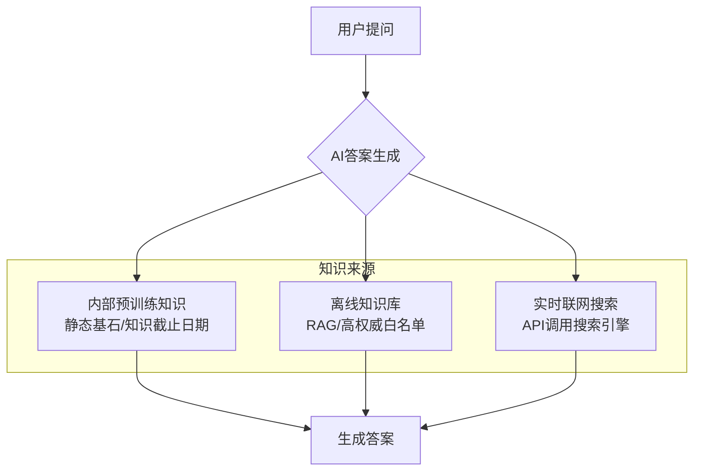

#### K-DAF闭环模型

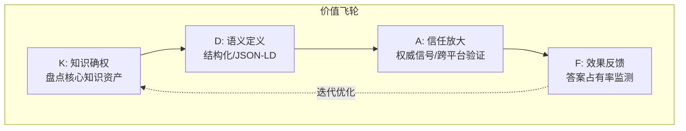

#### KU创作倒金字塔范式

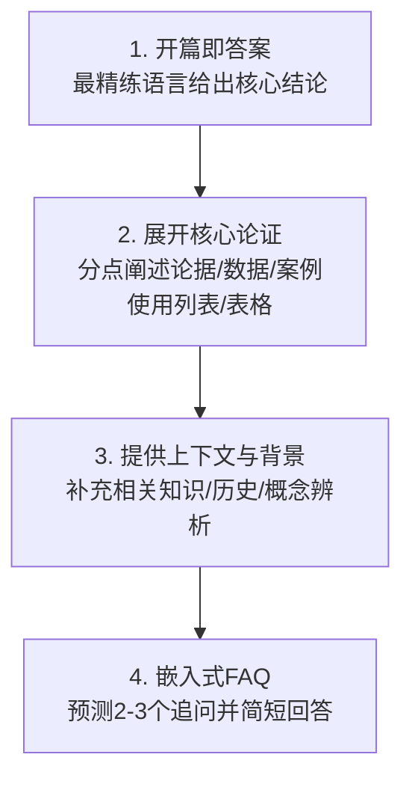

### 5. 经典金句/数据

> “GEO不是一次性投产的项目，它是一个动态且需要持续运营的语义生态系统。”

> “你不只是在写文章，而是在为AI的知识库提供语言原材料。”

> “一个原子化的KU，就像一块标准尺寸、接口清晰的乐高积木，AI可以直接拿来‘拼装’答案。”

> “JIT模式旨在最大限度地减少库存，但在需求突然波动时较为脆弱。动态库存分配算法通过AI预测来主动应对波动。”（JSON-LD代码中的问答示例）

> “案例分析：NineTwoThree Studio在90天内通过ChatGPT直接获取了超过100万美元的合格销售线索，实现了92%的顶部答案占有率。”

---

## 第4章：GEO工具箱

### 1. 核心论点

**问题**：如何科学衡量GEO效果？如何量化ROI并诊断优化？

**观点**：作者建立了从衡量、诊断到优化的科学运营框架，包括GEO核心指标体系、GEO-ROI模型（直接转化价值+品牌影响价值+信任资产增值）、系统性诊断流程图和A/B测试指南。

### 2. 关键概念

- **AI可见性评分**：量化品牌在AI答案中整体曝光度的综合性指标。
- **引用率**：AI答案中直接引用品牌内容的次数占总查询次数的比例。
- **来源引用排名**：品牌内容在AI答案来源链接列表中的排序位置。
- **GEO-ROI模型**：将回报定义为直接转化价值+品牌影响价值+信任资产增值的综合框架。
- **广告价值等值（AVE）**：量化零点击品牌曝光价值的方法，引入质量乘数校准。
- **序列对比测试**：适用于GEO环境的A/B测试方法，通过对照组和基准期数据排除外部干扰。

### 3. 逻辑推演

作者首先指出传统SEO评估体系（排名、点击率）在GEO时代可能得出错误结论——零点击答案中的品牌曝光是成功而非失败。核心转变是从“网站流量获取”到“答案引擎影响力”。

作者定义核心指标：AI可见性评分、引用率、来源引用排名、竞品可见度对比、品牌提及与情绪分析、AI流量估算。介绍三类监测工具：原生GEO平台（Goodie AI、Writesonic）、传统SEO巨头集成功能（Semrush、Ahrefs）、特定诊断工具（HubSpot's AI Search Grader）。

然后构建GEO-ROI模型：

**直接转化价值**：通过“AI Referrals”渠道追踪的转化（Demo预约、报告下载等）。

**品牌影响价值**：引入AVE，公式为 C（基准成本）× M（总提及数）× Q（质量乘数）。

**信任资产增值**：衡量品牌搜索量提升、核心渠道转化率提升、销售周期缩短。

投入部分分为固定成本（一次性技术改造）和可变成本（人力、工具、外包）。

作者提供完整计算案例演示从投入到回报的汇总，得出ROI为197%。

随后提供系统性诊断流程图，按“技术可访问性→KU质量→信任权威度→知识资产覆盖度”四个阶段逆向排查。最后提供A/B测试四步流程：建立假设→设计方案与基准→执行改动与监测→分析结果。

### 4. 流程图

#### GEO评估指标体系

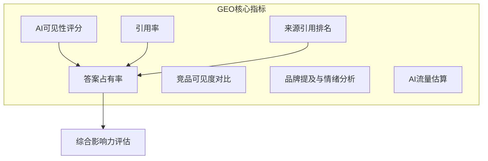

#### GEO-ROI模型框架

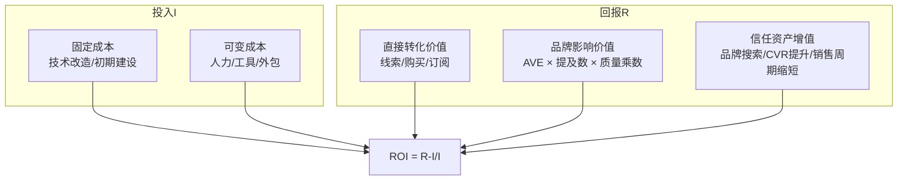

#### GEO项目诊断流程图

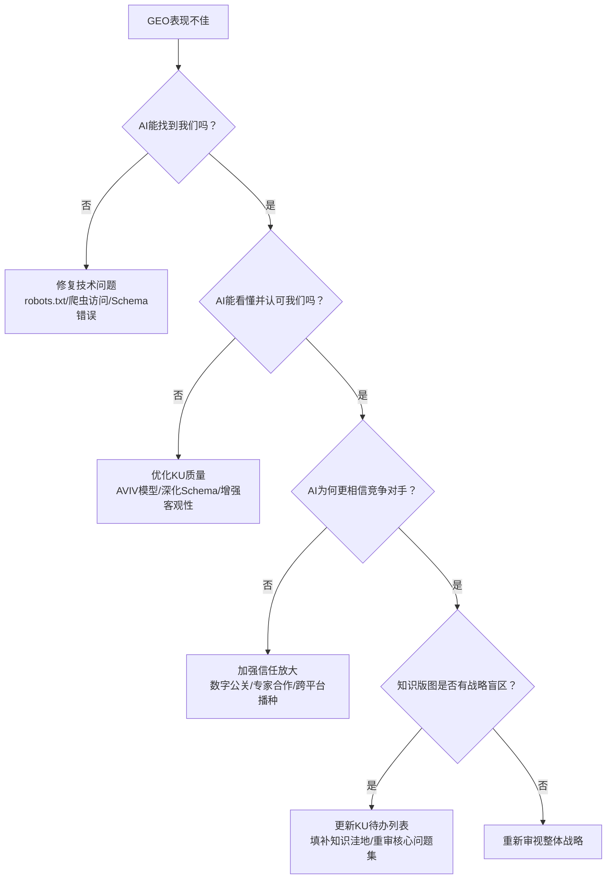

### 5. 经典金句/数据

> “在答案经济时代，过度依赖传统指标，不仅会使我们错判形势，甚至可能得出完全错误的结论。”

> “GEO的成功，不再仅仅以‘将用户引导至我们的网站’为唯一标准，其核心目标是让企业的知识、品牌和观点，成功渗透并主导AI在特定问题领域的答案生成。”

> “模型的真正力量，不在于能否完美复制我们示例中的每一个数字，而在于是否吸收了其背后的量化逻辑，并利用它来构建专属于自己业务的ROI罗盘。”

> “计算示例：GEO-ROI = (179,000 - 60,300)/60,300 ≈ 197%”

---

## 第5章：GEO的未来

### 1. 核心论点

**问题**：GEO未来将如何演进？企业应如何构建穿越周期的核心竞争力？

**观点**：AI Agent时代将到来，信息获取从“AI回答我”进化为“AI为我做事”。GEO将向KGO（知识图谱优化）演进，企业应投资“不变的知识”，构建以信任为核心的持久护城河。

### 2. 关键概念

- **AI Agent时代**：AI化身数字化助理，自主执行复杂任务链（查询、决策、预订、交付）的新范式。
- **KGO（知识图谱优化）**：GEO的未来演进方向，从优化零散知识转向构建系统性企业知识网络。
- **能力API**：将企业核心能力封装为可被机器调用的服务接口，从“内容资产”进化为“任务模块”。
- **三元组（主语-谓语-宾语）**：知识图谱中描述实体关系的标准数据结构。
- **不变的知识**：用户对可信赖且能解决根本问题的专业知识的永恒需求，是企业最持久的护城河。

### 3. 逻辑推演

作者通过“周末出游规划”场景对比当前AI和未来AI Agent的差异：当前AI提供答案但用户仍需亲力亲为；未来Agent自主完成查询、决策、预订、交付全流程。

基于此提出三种新“玩法”：
1. **从内容资产到能力API的进化**：以Accio（AI驱动的采购引擎）为例，封装“寻找并验证供应商”能力为Agent可直接调用的服务。
2. **从被动引用到主动执行的跃迁**：企业应成为Agent任务工作流中的“行动模块”。
3. **从单一触点到任务链的布局**：具备“任务链思维”，加强上下游数据协同。

作者提出GEO向KGO演进的四个步骤：
1. **核心实体资产化**：盘点组织、产品、人物、事件、概念实体。
2. **实体关系网络化**：用三元组定义实体间关系。
3. **技术部署与链接**：深度应用Schema.org，建立实体枢纽页面，链接开放数据。
4. **外部验证与信任共建**：让行业权威引用和验证企业知识图谱。

最后，作者引用贝索斯的“不变思维”，指出GEO和KGO的本质是将企业内部零散的知识提炼、塑造、放大为数字资产的“炼金术”。K是自我叩问核心智慧，D是构筑知识展现形态，A是寻求社会共识，F是动态监测系统。

### 4. 流程图

#### GEO与KGO范式对比

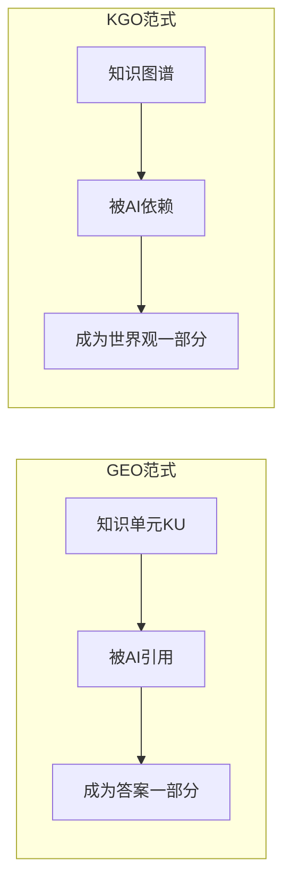

#### KGO实施四步骤

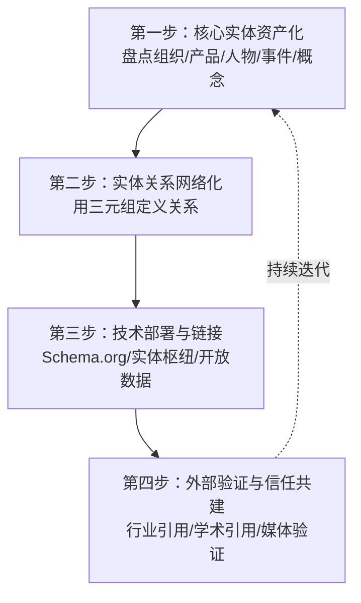

#### AI Agent任务链示例

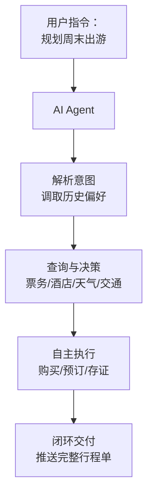

### 5. 经典金句/数据

> “当AI Agent在海量信息中为用户做决策并直接执行时，它提供的将不再是选项列表，而是唯一结果。落选的服务，甚至连被用户知晓的机会都没有。”

> “如果说GEO像是在为AI这位聪明的‘学生’精心撰写一本权威且画满重点的教科书，那么KGO就像是直接参与绘制了这位学生脑海中认知世界的‘底层地图集’。”

> “亚马逊创始人杰夫·贝索斯曾分享：‘人们总爱问我，未来十年会发生什么变化？但我很少被问到，未来十年有什么是不变的。我认为第二个问题其实更重要。’”

> “在AI驱动的商业世界里，用户对可信赖且能解决其根本问题的专业知识的永恒需求——这个底层需求是永恒的。”

> “在链接经济的时代，流量为王；在答案经济的时代，信任则是唯一的货币。”

> “谁拥有了定义答案的权力，谁就拥有了未来。”

---

## 全书总结

《这就是GEO》为企业应对AI驱动的“答案经济”时代提供了完整的战略蓝图和实战工具箱。核心洞见是：信息获取的权力中枢正从“链接列表”迁移至“整合答案”，企业必须完成从SEO（抢排名）到GEO（成为答案）的思维革命。

作者提出的K-DAF闭环模型（知识确权、语义定义、信任放大、效果反馈）是一套可执行的作业系统，将企业内部专业知识转化为AI可识别、采纳和信赖的知识资产。GEO-ROI模型则为这项新兴实践提供了科学的度量衡。

展望未来，AI Agent时代将要求企业从“内容资产”进化到“能力API”，从GEO迈向KGO（知识图谱优化）。但最根本的启示是：企业应投资“不变的知识”——用户对可信赖专业知识的永恒需求，才是穿越技术周期的真正护城河。