# 《重学Java设计模式》章节总结

## 书籍信息

- **书名**：重学Java设计模式
- **作者**：小傅哥
- **PDF状态**：扫描/图像版，OCR文本可识别，部分图表为图片需重建
- **OCR状态**：可识别正文和大部分代码，部分页眉/页码存在错位，但核心内容完整

## 目录说明

本书共分为三大类设计模式：
- **创建型模式**（5节）：工厂方法、抽象工厂、建造者、原型、单例
- **结构型模式**（7节）：适配器、桥接、组合、装饰器、外观、享元、代理
- **行为模式**（10节）：责任链、命令、迭代器、中介者、备忘录、观察者、状态、策略、模板方法、访问者

每一节均以“真实业务场景 → 坏代码（ifelse/一把梭） → 设计模式重构 → 测试验证”的结构展开。

> 说明：部分图表（如结构图）在原PDF中为图片，以下使用Mermaid重建逻辑关系。书中无显式Prompt，因此不单独生成Prompt汇总章节。

## 全书核心主题

本书通过22个互联网一线业务场景（交易、营销、秒杀、中间件、源码等），将设计模式从理论落地到实战代码。作者强调：好的代码不是为了完成现有功能，而是为了后续扩展、松耦合、易读易维护。书中反复批判“一坨ifelse”的代码风格，并展示了如何用设计模式（工厂、抽象工厂、建造者、原型、单例、适配器、桥接、组合、装饰器、外观、享元、代理、责任链、命令、迭代器、中介者、备忘录、观察者、状态、策略、模板方法、访问者）进行重构。核心思想：高内聚、低耦合、可扩展、可复用，满足开闭原则、单一职责等六大设计原则。

---

## 第一部分：创建型模式（5节）

### 第1节：工厂方法模式

#### 核心论点

- **问题**：多种不同类型商品（优惠券、实物商品、第三方兑换卡）的发放接口不统一，若用ifelse直接调用，会导致代码臃肿、难以扩展。
- **观点**：定义一个创建对象的接口，让子类决定实例化哪一个工厂类，将创建过程延迟到子类。这样可以屏蔽具体实现，方便新增商品类型。

#### 关键概念

- **工厂方法模式**：父类提供创建对象的抽象方法，子类实现具体对象的实例化。
- **统一接口（ICommodity）**：所有奖品发放类实现相同接口，统一入参（uId, commodityId, bizId, extMap）和异常处理。
- **商店工厂（StoreFactory）**：根据类型返回对应的奖品服务实现。

#### 逻辑推演

作者首先展示了三个不同接口（优惠券返回CouponResult、实物商品返回Boolean、第三方卡void）以及各自不同的入参。然后用一个PrizeController类，通过ifelse分别调用这些接口，实现了功能但极难维护。接着使用工厂方法模式：定义ICommodity接口，为每种奖品创建独立的实现类（CouponCommodityService、GoodsCommodityService、CardCommodityService），最后用StoreFactory根据类型返回对应的服务。测试结果一致，但代码结构清晰，符合开闭原则。

#### 流程图

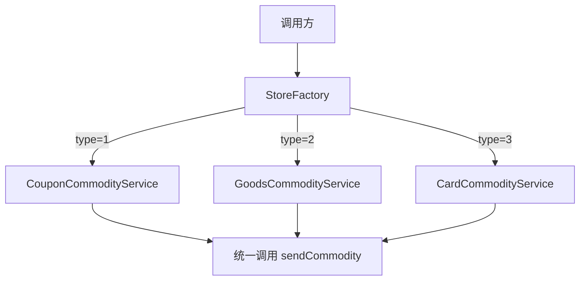

#### 经典金句

> “好看的代码千篇一律，恶心的程序升职加薪。”（P12）
> “避免创建者与具体的产品逻辑耦合、满足单一职责、满足开闭原则。”（P23-24）

---

### 第2节：抽象工厂模式

#### 核心论点

- **问题**：单机Redis需要升级为集群，但有两套不同的集群（EGM、IIR），它们的方法名不一致（gain/get、set/setEx等）。不能影响原有系统，需要平滑适配。
- **观点**：创建一个中心工厂（代理类），通过适配器将不同集群的接口统一为相同的方法名，再通过代理模式动态选择具体集群。

#### 关键概念

- **抽象工厂**：提供一个创建一系列相关或相互依赖对象的接口，而无需指定具体类。
- **适配接口（ICacheAdapter）**：定义统一的get/set/del方法。
- **代理（JDKProxy）**：通过InvocationHandler动态代理原有CacheService实现类，实际调用适配器。

#### 逻辑推演

原系统使用CacheServiceImpl调用RedisUtils的方法。现在需要支持EGM和IIR集群。坏代码解法：在CacheServiceImpl中增加ifelse判断redisType，分别调用不同集群的方法，导致调用方也需要传递类型，改动很大。重构：定义ICacheAdapter接口，分别实现EGMCacheAdapter和IIRCacheAdapter，这两个适配器内部调用各自集群的原始方法。再通过JDKProxy和JDKInvocationHandler，在运行时根据传入的适配器对象生成代理类，使原有CacheServiceImpl无需修改即可切换到不同集群。测试时通过`JDKProxy.getProxy(CacheServiceImpl.class, new EGMCacheAdapter())`获得代理对象，调用方式不变。

#### 流程图

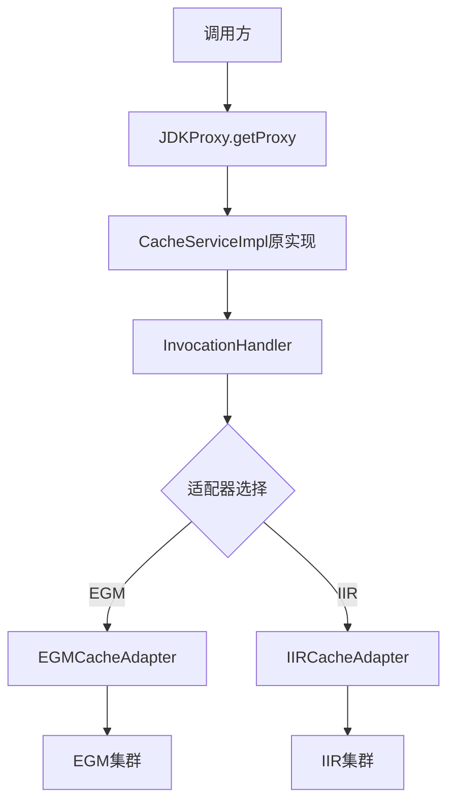

#### 经典金句

> “你的代码只是被ifelse埋上了！”（P37）
> “抽象工厂模式，所要解决的问题就是在一个产品族中存在多个不同类型的产品情况下的接口选择问题。”（P37）

---

### 第3节：建造者模式

#### 核心论点

- **问题**：装修公司提供多种套餐（豪华欧式、轻奢田园、现代简约），每个套餐由不同的物料（吊顶、涂料、地板、地砖）组合而成。如果用ifelse直接组合物料和计算价格，会导致大量重复代码，难以维护。
- **观点**：将一个复杂对象的构建与其表示分离，同样的构建过程可以创建不同的表示。通过建造者模式，将物料的添加和价格计算封装在建造者中，最终返回统一的装修清单。

#### 关键概念

- **建造者模式**：使用多个简单对象一步步构建一个复杂对象。
- **装修菜单接口（IMenu）**：定义添加各种物料的方法，每个方法返回自身（this）实现链式调用。
- **建造者类（Builder）**：提供levelOne、levelTwo等预设套餐方法，内部通过new DecorationPackageMenu并链式添加物料。

#### 逻辑推演

坏代码实现：在一个DecorationPackageController中，根据level（1,2,3）分别创建不同物料对象并计算价格，大量重复代码。重构：定义Matter接口（所有物料实现它），DecorationPackageMenu实现IMenu，在appendCeiling等方法中添加到列表并累加价格。Builder类中每个套餐方法返回一个组装好的DecorationPackageMenu。最终调用链如`builder.levelOne(132.52D).getDetail()`，清晰易扩展。

#### 流程图

```mermaid
graph TD
    A[Builder] --> B[levelOne]
    A --> C[levelTwo]
    A --> D[levelThree]
    B --> E[new DecorationPackageMenu]
    E --> F[appendCeiling(二级顶)]
    F --> G[appendCoat(多乐士)]
    G --> H[appendFloor(圣象)]
    H --> I[返回IMenu]
    I --> J[getDetail输出清单]
```

#### 经典金句

> “一些基本物料不会变，而其组合经常变化的时候，就可以选择建造者模式。”（P55）
> “开发代码的过程不是炫技，就像盖房子如果不按照图纸来修建，回首就在山墙上搭一个厨房卫浴！”（P39）

---

### 第4节：原型模式

#### 核心论点

- **问题**：在线考试需要为每个考生生成相同的试卷，但题目和选项顺序必须乱序（防止抄袭）。每次都从数据库或RPC重新创建试卷对象非常耗时。
- **观点**：用原型实例指定创建对象的种类，并通过拷贝这些原型创建新的对象。通过克隆（clone）已有的试卷模板，然后对副本进行题目和选项的乱序操作。

#### 关键概念

- **原型模式**：实现Cloneable接口，重写clone方法进行深拷贝。
- **深拷贝**：不仅克隆对象本身，还要克隆对象内部的集合（ArrayList的clone）。
- **乱序工具（TopicRandomUtil）**：对选项Map进行重排，并更新正确答案的位置。

#### 逻辑推演

坏代码：每次调用createPaper都重新new选择题和问答题列表，内容固定，没有乱序。重构：设计QuestionBank类实现Cloneable，内部有两个ArrayList。在clone()方法中，先调用super.clone()，然后分别clone两个列表，再调用Collections.shuffle对题目顺序打乱，最后对每个选择题的选项和答案进行随机重排（使用TopicRandomUtil）。初始化一个原型对象questionBank填充所有题目，然后为每个考生克隆一份，设置考生和考号，返回toString。测试结果每个考生的题目顺序和选项顺序都不同。

#### 流程图

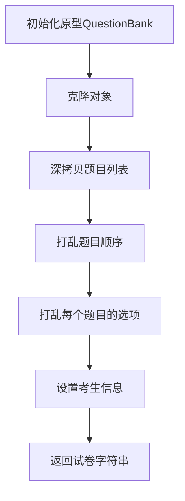

#### 经典金句

> “原型模式主要解决的问题就是创建重复对象，而这部分对象内容本身比较复杂，生成过程可能从库或者RPC接口中获取数据的耗时较长，因此采用克隆的方式节省时间。”（P57）

---

### 第5节：单例模式

#### 核心论点

- **问题**：需要保证一个类只有一个实例，并提供全局访问点。在多线程环境下也要保证唯一。
- **观点**：提供了7种单例实现方式，推荐使用枚举单例（Effective Java作者推荐）或静态内部类方式。

#### 关键概念

- **懒汉模式（线程不安全）**：首次调用时创建，但多线程可能创建多个实例。
- **懒汉模式（线程安全）**：方法上加synchronized，性能差。
- **饿汉模式**：类加载时创建，线程安全但不支持懒加载。
- **静态内部类**：利用JVM类加载机制，既懒加载又线程安全。
- **双重锁校验**：减少同步开销，需要volatile。
- **CAS（AtomicReference）**：基于忙等算法，无锁。
- **枚举单例**：最简洁，无偿提供序列化机制，防止反射攻击。

#### 逻辑推演

逐个列举每种方式的代码和优缺点。重点强调枚举单例的优势，并给出调用示例。最后总结不同场景下的选择。

#### 流程图

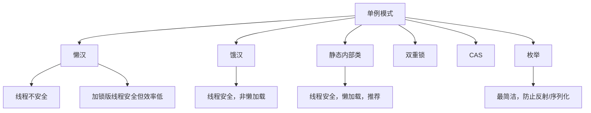

#### 经典金句

> “Effective Java作者推荐使用枚举的方式解决单例模式，此种方式可能是平时最少用到的。这种方式解决了最主要的：线程安全、自由串行化、单一实例。”（P82）

---

## 第二部分：结构型模式（7节）

### 第1节：适配器模式

#### 核心论点

- **问题**：营销系统需要接入多种不同的MQ消息（注册开户MQ、内部订单MQ、第三方订单MQ），这些MQ的字段名不同（uid/number、orderId等），而且后续还会新增。如果为每个MQ单独写一个消费类，会非常繁琐。
- **观点**：通过适配器，将不同MQ消息中的字段统一映射成标准字段（userId、bizId、bizTime等），从而用一个通用的处理逻辑消费所有MQ。

#### 关键概念

- **适配器模式**：将一个类的接口转换成客户希望的另一个接口，使原本不兼容的类可以一起工作。
- **通用消息体（RebateInfo）**：定义标准字段。
- **MQAdapter**：静态方法filter，接收JSON字符串和映射关系Map，通过反射将源字段值赋给目标对象。

#### 逻辑推演

坏代码：为每个MQ创建独立的消费类（如create_accountMqService），手动提取字段。重构：定义通用RebateInfo，MQAdapter.filter方法接收原始JSON和映射Map（例如`{"userId":"number"}`），使用反射调用setter完成赋值。这样所有MQ都可以通过配置映射关系统一转换成RebateInfo，后续只需一个处理逻辑。同时展示了接口适配：两个查询订单的接口（一个返回订单数，一个返回是否首单），通过统一的OrderAdapterService接口包装，各自实现isFirst方法。

#### 流程图

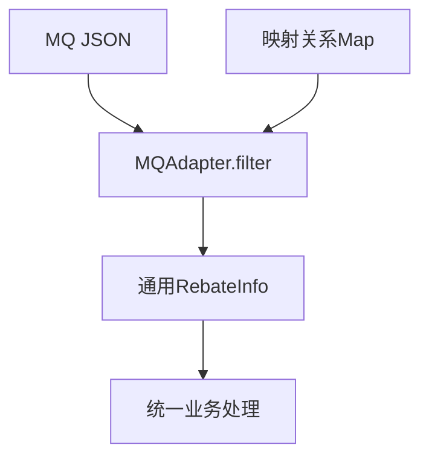

#### 经典金句

> “适配器模式的主要作用就是把原本不兼容的接口，通过适配修改做到统一。”（P86）

---

### 第2节：桥接模式

#### 核心论点

- **问题**：支付平台需要对接多个支付渠道（微信、支付宝）和多种支付模式（人脸、指纹、密码）。如果为每个渠道和模式的组合创建子类，会产生笛卡尔积式的类爆炸。
- **观点**：将抽象部分（支付渠道）与实现部分（支付模式）分离，通过组合而非继承的方式实现。支付渠道类中持有支付模式接口的引用，在运行时动态组合。

#### 关键概念

- **桥接模式**：将抽象与实现解耦，使它们可以独立变化。
- **支付抽象类（Pay）**：包含IPayMode成员，定义transfer抽象方法。
- **支付模式接口（IPayMode）**：定义security风控方法。

#### 逻辑推演

坏代码：一个PayController类，通过ifelse判断channelType和modeType，调用相应逻辑。重构：定义Pay抽象类，WxPay和ZfbPay继承它，构造函数传入IPayMode。IPayMode有多个实现（PayFaceMode、PayFingerprintMode、PayCypher）。调用方直接`new WxPay(new PayFaceMode())`组合所需模式。这样新增支付渠道或模式只需增加对应类，无需修改已有代码。

#### 流程图

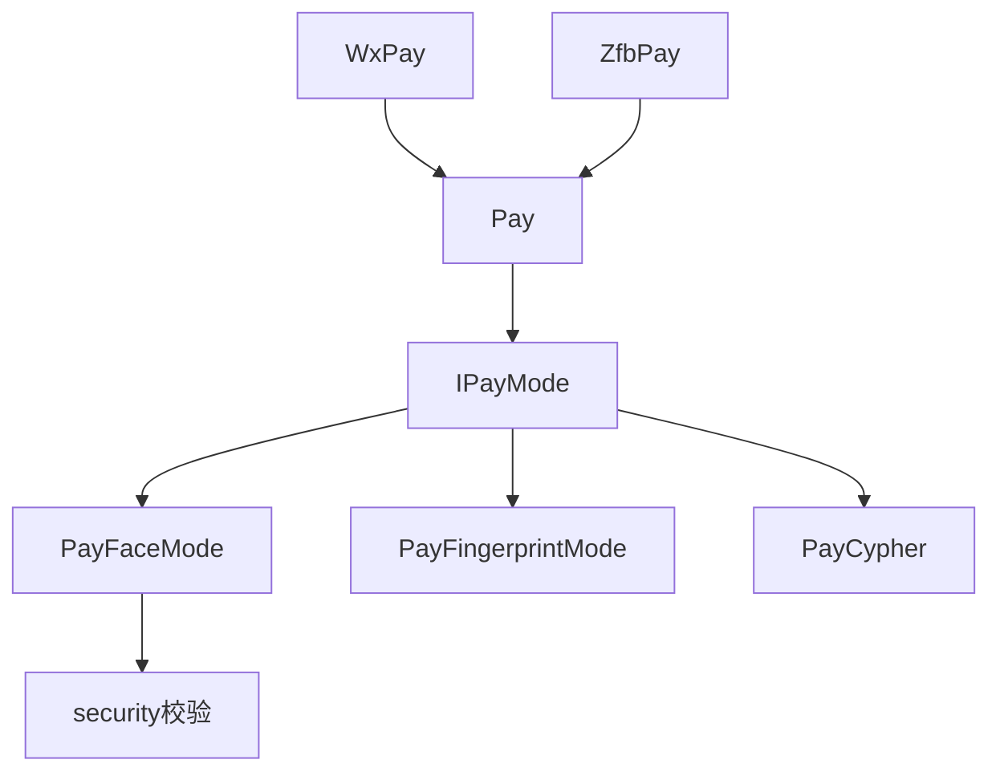

#### 经典金句

> “桥接模式的关键是选择的桥接点拆分，是否可以找到这样类似的相互组合，如果没有就不必要非得使用桥接模式。”（P101）

---

### 第3节：组合模式

#### 核心论点

- **问题**：营销规则决策树根据用户性别和年龄发放不同优惠券，如果使用ifelse嵌套，随着规则增多代码会指数级膨胀。
- **观点**：将决策逻辑拆分为一个个独立的节点（性别节点、年龄节点），再将节点组合成一棵决策树。调用方只需传入决策物料，引擎自动遍历树节点输出结果。

#### 关键概念

- **组合模式**：将对象组合成树形结构以表示“部分-整体”的层次结构，使得用户对单个对象和组合对象的使用具有一致性。
- **逻辑过滤器（LogicFilter）**：定义决策逻辑，包含filter（根据决策值找到下一节点）和matterValue（获取决策值）。
- **决策引擎（EngineBase）**：遍历树节点，根据节点规则和决策值走向下一个节点，直到叶子节点（果实）。

#### 逻辑推演

坏代码：EngineController类中用两层ifelse判断性别和年龄返回不同结果。重构：定义TreeNode（树节点）、TreeNodeLink（节点间链路）、TreeRoot（树根）。实现两个具体过滤器：UserAgeFilter和UserGenderFilter。在EngineBase中循环遍历：从根节点开始，根据当前节点的ruleKey获取对应的LogicFilter，获取决策值，调用filter找到下一个节点ID，直到节点类型为果实（NodeType=2）。最后返回果实值。测试时手动组装树结构（性别→年龄分支），调用引擎得到结果。

#### 流程图

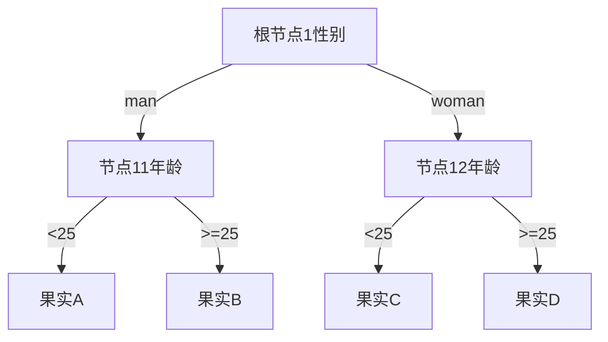

#### 经典金句

> “组合模式主要解决的是一系列简单逻辑节点或者扩展的复杂逻辑节点在不同结构的组织下，对于外部的调用是仍然可以非常简单的。”（P122）

---

### 第4节：装饰器模式

#### 核心论点

- **问题**：已有的单点登录（SSO）服务需要扩展功能，例如增加用户访问方法的权限校验。但不希望修改原有SSO服务代码，也不想通过继承导致子类爆炸。
- **观点**：使用装饰器模式，创建一个抽象装饰类继承原有接口，并在构造函数中持有原有接口的实例。具体装饰类只扩展需要增强的方法，其他方法委托给原实例。

#### 关键概念

- **装饰器模式**：动态地给一个对象添加额外的职责，比生成子类更灵活。
- **抽象装饰（SsoDecorator）**：实现HandlerInterceptor接口，持有HandlerInterceptor成员，preHandle方法委托给成员。
- **具体装饰（LoginSsoDecorator）**：继承SsoDecorator，重写preHandle，先调用super.preHandle，再添加额外的权限校验逻辑。

#### 逻辑推演

坏代码：直接继承SsoInterceptor，重写preHandle，在子类中添加校验逻辑。这种方式在多个扩展场景下会导致大量子类。重构：定义SsoDecorator抽象类，包装原有的HandlerInterceptor。LoginSsoDecorator扩展时，在preHandle中先调用父类的preHandle（即原校验），然后通过userId模拟方法权限校验。调用时`new LoginSsoDecorator(new SsoInterceptor())`。

#### 流程图

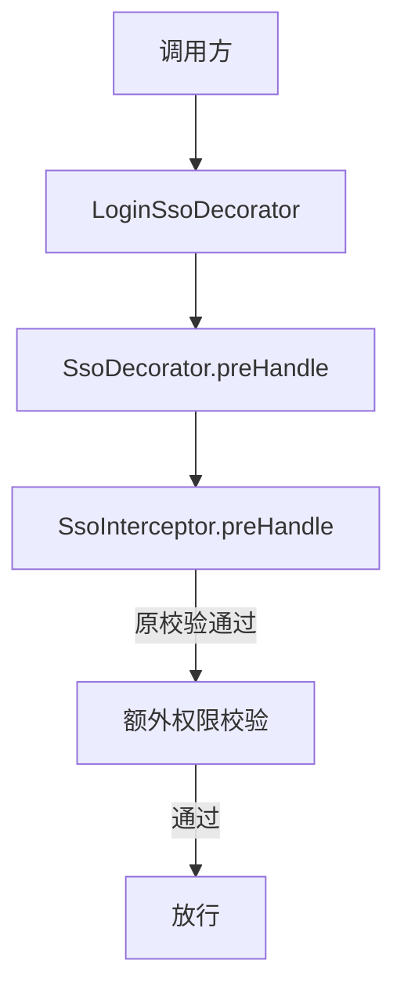

#### 经典金句

> “装饰器模式满足单一职责原则，你可以在自己的装饰类中完成功能逻辑的扩展，而不影响主类。”（P132）

---

### 第5节：外观模式（门面模式）

#### 核心论点

- **问题**：在SpringBoot项目中，多个接口需要统一添加白名单功能（只有指定用户ID可访问）。如果每个接口都加if判断，非常冗余且不易维护。
- **观点**：通过外观模式（门面模式）结合SpringBoot Starter中间件，定义一个注解`@DoDoor`，使用AOP切面统一拦截，根据配置的白名单用户列表决定是否放行或返回预设JSON。

#### 关键概念

- **外观模式**：为子系统中的一组接口提供一个一致的界面，定义高层接口使子系统更易用。
- **自定义注解（@DoDoor）**：包含key（取参数字段名）和returnJson（拦截时返回的JSON）。
- **切面逻辑**：通过JoinPoint获取参数值，与配置文件中的白名单比较，决定是否执行原方法或直接返回预设JSON。

#### 逻辑推演

坏代码：直接在Controller方法中写if判断userId是否在白名单内。重构：开发starter，定义StarterServiceProperties读取白名单配置（enabled、userStr）。定义切面类，注解`@Pointcut("@annotation(DoDoor)")`，在@Around中获取注解的key，从参数中提取userId，判断是否在白名单中，是则放行，否则返回returnJson。最后通过META-INF/spring.factories自动装配。使用方只需添加依赖，配置application.yml，并在需要白名单的方法上添加@DoDoor注解。

#### 流程图

```mermaid
graph TD
    A[请求进入] --> B[切面拦截@DoDoor]
    B --> C[获取key提取userId]
    C --> D{userId在白名单?}
    D -->|是| E[执行原方法]
    D -->|否| F[返回returnJson]
```

#### 经典金句

> “门面模式可以是对接口的包装提供出接口服务，也可以是对逻辑的包装通过自定义注解对接口提供服务能力。”（P139）

---

### 第6节：享元模式

#### 核心论点

- **问题**：秒杀活动中，活动信息（名称、描述、时间等）是不变的，而库存是变化的。每次都从数据库或缓存中完整查询活动信息（包括固定部分）会造成内存和性能浪费。
- **观点**：使用享元模式，将不变的活动信息存储在享元工厂的Map中复用，变化的部分（库存）单独从Redis实时获取，组装后返回。

#### 关键概念

- **享元模式**：运用共享技术有效地支持大量细粒度的对象，减少内存使用。
- **享元工厂（ActivityFactory）**：静态Map存储活动信息，第一次获取时初始化，后续直接返回。
- **外部状态**：库存（变化），从Redis动态获取。

#### 逻辑推演

坏代码：每次查询活动都从模拟的数据库创建完整的Activity对象。重构：ActivityFactory.getActivity(Long id)从Map中取，如果不存在则创建并放入。ActivityController中先获取Activity（享元），再创建Stock对象（从RedisUtils获取已用库存），set到Activity中返回。测试多次查询，活动信息相同，库存变化。

#### 流程图

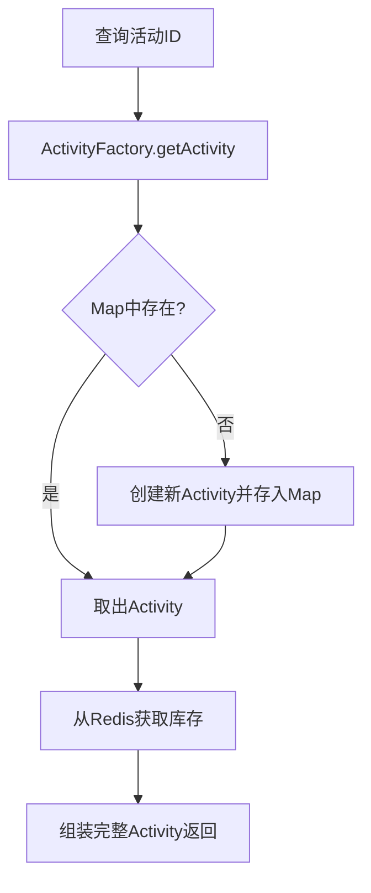

#### 经典金句

> “享元模式主要在于共享通用对象，减少内存的使用，提升系统的访问效率。”（P146）

---

### 第7节：代理模式

#### 核心论点

- **问题**：MyBatis中只需要定义DAO接口，不需要写实现类，就能执行SQL。这种功能如何实现？
- **观点**：通过代理模式，在Spring容器启动时，为DAO接口生成代理对象，代理对象的invoke方法中根据方法上的注解（如@Select）获取SQL，执行数据库操作并返回结果。

#### 关键概念

- **代理模式**：为其他对象提供一种代理以控制对这个对象的访问。
- **FactoryBean**：Spring提供的工厂Bean接口，getObject方法返回代理对象。
- **InvocationHandler**：代理逻辑，根据方法注解构造SQL语句，模拟执行。

#### 逻辑推演

模拟MyBatis：定义@Select注解，IUserDao接口方法上使用。实现MapperFactoryBean<T> implements FactoryBean<T>，在getObject中使用Proxy.newProxyInstance创建代理，InvocationHandler中解析方法上的@Select注解，替换占位符，打印SQL并返回固定结果。实现RegisterBeanFactory implements BeanDefinitionRegistryPostProcessor，手动注册GenericBeanDefinition，将MapperFactoryBean与IUserDao关联。最后在spring-config.xml中配置该处理器。测试时从Spring容器获取IUserDao代理对象，调用方法即可输出SQL和模拟结果。

#### 流程图

```mermaid
graph TD
    A[Spring启动] --> B[RegisterBeanFactory注册BeanDefinition]
    B --> C[MapperFactoryBean.getObject]
    C --> D[创建动态代理]
    D --> E[InvocationHandler]
    E --> F[解析@Select获取SQL]
    F --> G[模拟执行SQL返回结果]
```

#### 经典金句

> “代理模式除了开发中间件外还可以是对服务的包装，物联网组件等等，让复杂的各项服务变为轻量级调用。”（P161）

---

## 第三部分：行为模式（10节）

由于篇幅限制，以下每节以精炼形式呈现。

### 第1节：责任链模式

- **核心论点**：618大促上线审批流程，不同级别负责人（三级、二级、一级）根据时间节点依次审批。用责任链将审批节点串联，每个节点决定是否放行或转交下一节点。
- **关键概念**：抽象链路类AuthLink，包含next指针；具体节点Level1AuthLink等，每个节点doAuth中判断当前审批状态，若未完成则返回待审批信息，否则调用next.doAuth。
- **逻辑推演**：坏代码用大量if-else按顺序判断审批时间范围和状态。重构：创建责任链`Level3AuthLink.appendNext(Level2AuthLink).appendNext(Level1AuthLink)`，调用链头doAuth，内部自动流转。

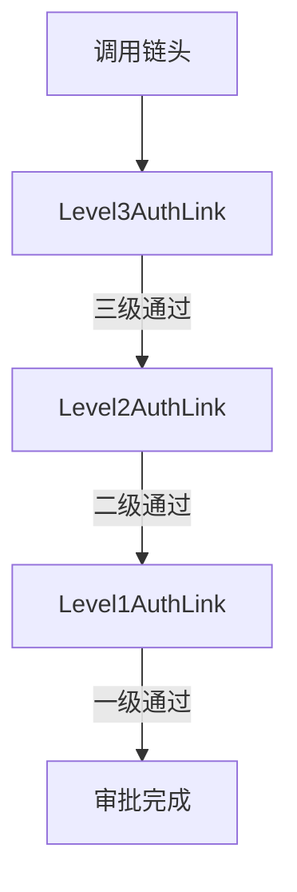

---

### 第2节：命令模式

- **核心论点**：餐厅点餐，客户（调用者）不关心具体厨师，只通过小二（命令调用者）下达命令，命令对象封装菜品和对应厨师。实现请求与执行解耦。
- **关键概念**：命令接口ICuisine，具体命令（GuangDoneCuisine等）持有厨师ICook；调用者XiaoEr持有命令列表，placeOrder时遍历执行cook。
- **逻辑推演**：坏代码一个类通过ifelse判断菜品类型并直接调用厨师。重构：将每种菜品和厨师的组合封装成命令，小二只负责添加命令和执行。

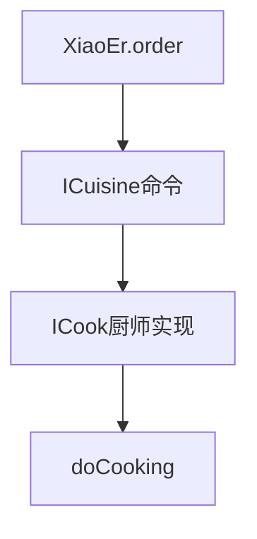

---

### 第3节：迭代器模式

- **核心论点**：遍历公司树形组织架构（部门-雇员结构），需要提供统一的迭代器，屏蔽底层树结构遍历的复杂度。
- **关键概念**：自定义Iterator接口，实现hasNext/next；在GroupStructure中实现iterator()，返回深度遍历迭代器，内部维护遍历栈或指针。
- **逻辑推演**：构建雇员和链路关系（Link），迭代器按照深度优先顺序返回雇员。测试时通过while(iterator.hasNext())打印所有雇员。

---

### 第4节：中介者模式

- **核心论点**：手写简易MyBatis ORM框架，通过中介者（SqlSession）统一封装数据库操作、XML解析、结果映射，让用户只需调用简单方法。
- **关键概念**：SqlSession（中介者）提供selectOne/selectList；SqlSessionFactoryBuilder解析配置文件和XML Mapper，生成DefaultSqlSession；XNode存储SQL和参数映射。
- **逻辑推演**：使用方读取mybatis-config.xml，构建SqlSessionFactory，获取SqlSession，调用selectOne传入statementId和参数，内部通过JDBC执行SQL并反射转换为POJO。

---

### 第5节：备忘录模式

- **核心论点**：ERP系统配置文件的版本管理，需要支持撤销、重做、按版本号恢复。备忘录模式保存对象状态快照。
- **关键概念**：发起人ConfigOriginator持有当前ConfigFile，saveMemento返回ConfigMemento；管理者Admin存储多个备忘录，支持undo/redo/get。
- **逻辑推演**：每次修改配置时，调用saveMemento保存快照到Admin，需要回退时从Admin获取备忘录恢复。

---

### 第6节：观察者模式

- **核心论点**：抽奖结束后需要发送MQ消息和短信通知，如果直接在业务代码中调用发送逻辑，会耦合且不易扩展。使用观察者模式，抽奖结果作为事件，通知多个监听器。
- **关键概念**：事件管理器EventManager，维护监听器列表，支持订阅/取消/通知；具体监听器（MQEventListener、MessageEventListener）实现doEvent。
- **逻辑推演**：LotteryService中持有EventManager，在draw方法中执行业务后通知所有监听器。业务代码无需关心通知细节。

---

### 第7节：状态模式

- **核心论点**：活动状态的流转（编辑→提审→审核通过→活动中→关闭等）有复杂的规则。用ifelse判断当前状态和目标状态导致代码冗长。状态模式将每个状态的行为封装到独立的类中。
- **关键概念**：抽象State类定义所有可能的行为（arraignment、checkPass等）；每个具体状态实现类只处理合法的状态转换，非法返回错误。
- **逻辑推演**：StateHandler维护状态到State对象的映射，调用时根据当前状态获取对应State实例，执行行为方法。

---

### 第8节：策略模式

- **核心论点**：优惠券计算有多种策略（直减、满减、折扣、N元购），使用ifelse判断type会使算法类臃肿。策略模式定义算法族，封装可互换。
- **关键概念**：策略接口ICouponDiscount<T>，定义discountAmount；具体策略类（ZJCouponDiscount直减、MJCouponDiscount满减等）；上下文Context持有策略并调用。
- **逻辑推演**：调用方根据优惠券类型选择具体策略，传入Context中，统一调用discountAmount。

---

### 第9节：模板方法模式

- **核心论点**：爬取多个电商网站的商品海报（京东、淘宝、当当），流程相同（登录→爬取→生成Base64），但具体实现细节不同。使用模板方法定义骨架，子类实现差异化步骤。
- **关键概念**：抽象类NetMall定义generateGoodsPoster模板方法，按顺序调用login、reptile、createBase64；子类实现这些抽象方法。
- **逻辑推演**：JDNetMall、TaoBaoNetMall分别实现爬取逻辑。调用方只需实例化具体子类并调用generateGoodsPoster。

---

### 第10节：访问者模式

- **核心论点**：学校数据展示系统，校长和家长对同一份数据（学生和老师）的访问视角不同（校长看升学率、老师信息；家长看孩子排名）。在不修改数据结构的前提下，新增访问者。
- **关键概念**：Element接口（User）定义accept(Visitor)；Visitor接口定义visit(Student)和visit(Teacher)；具体访问者（Principal、Parent）实现不同视角的输出。
- **逻辑推演**：DataView持有用户列表，show(Visitor)时遍历调用user.accept(visitor)，由具体用户类回调visitor的对应visit方法。这样新增访问者无需修改User类。

```mermaid
graph TD
    A[DataView.show(Visitor)] --> B[遍历User]
    B --> C[user.accept(visitor)]
    C --> D[visitor.visit(this)]
    D --> E[执行具体访问逻辑]
```

---

# 全书总结

本书通过22个真实场景，完整覆盖了23种设计模式（除访问者外均详细演示）。每个模式均采用“问题场景 → 坏代码 → 重构 → 测试”的结构，强调设计模式在实际业务中的应用价值。书末提供了完整的源码获取方式和作者联系方式。对于Java开发者，本书是一本极佳的“从理论到落地”的实战指南。