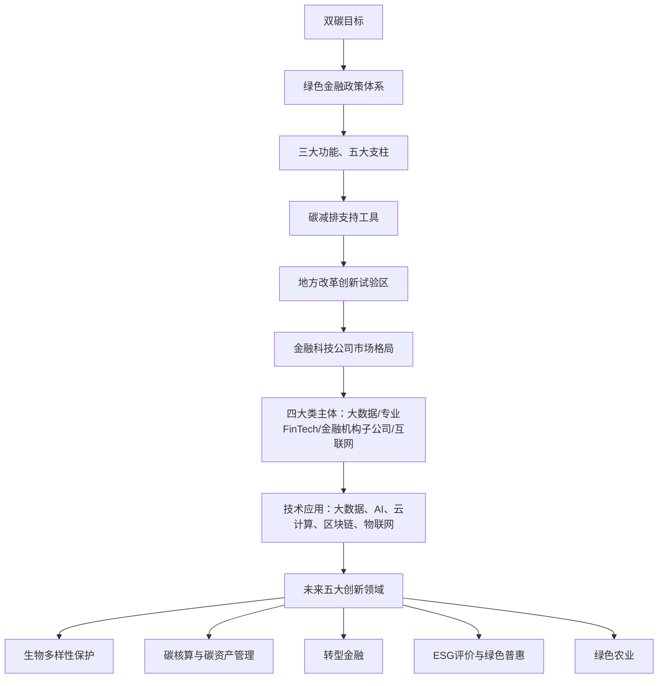
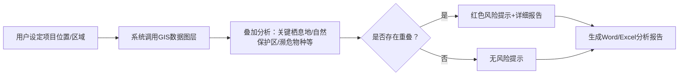
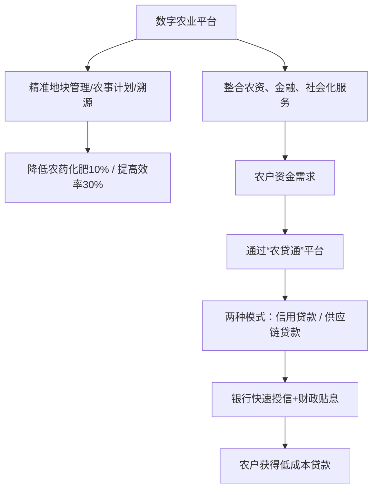
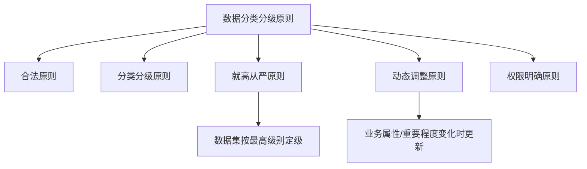
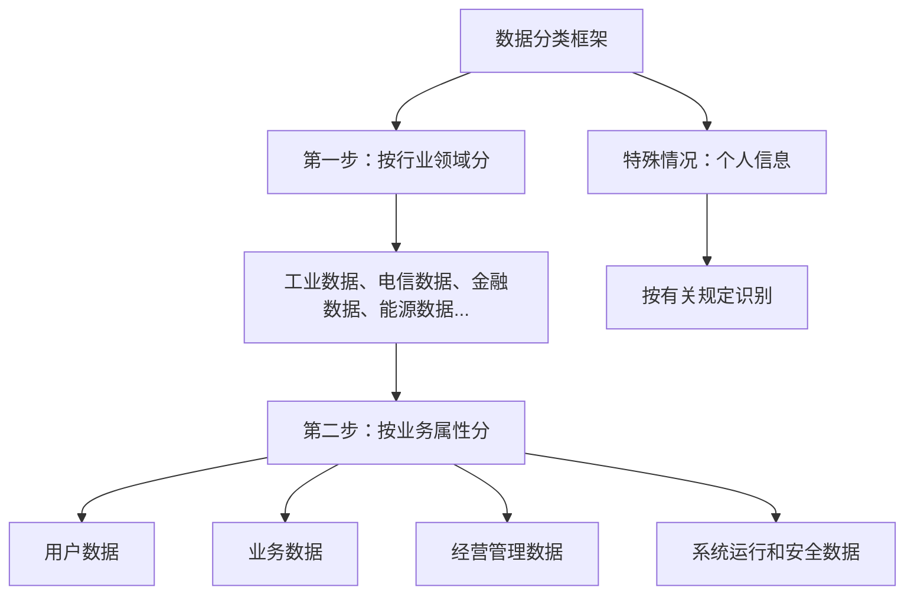
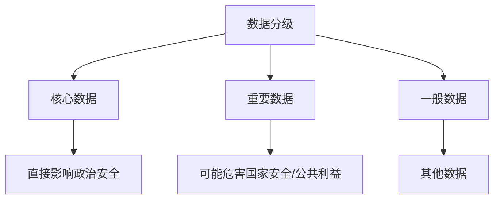
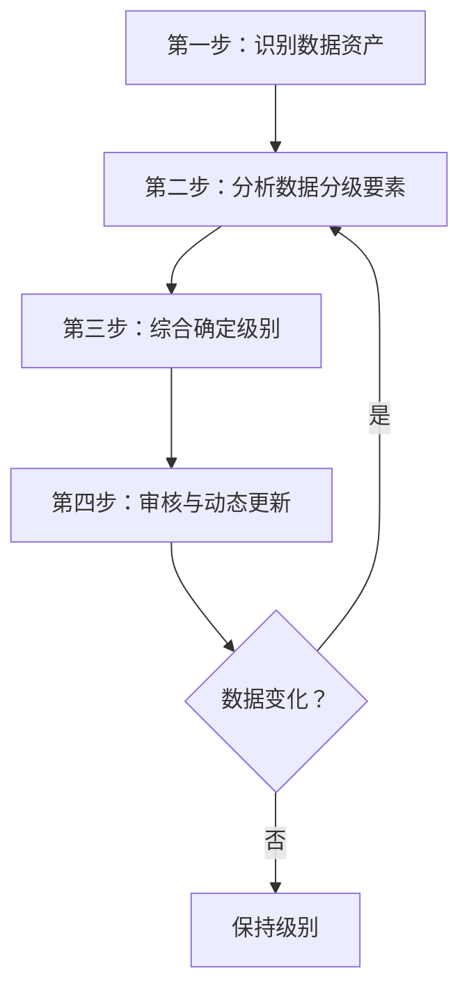
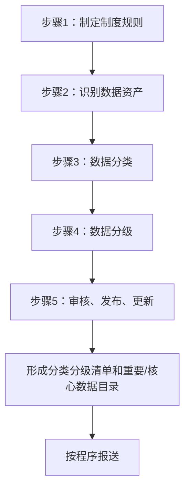
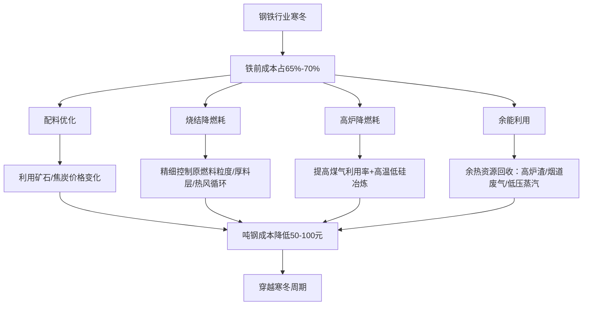
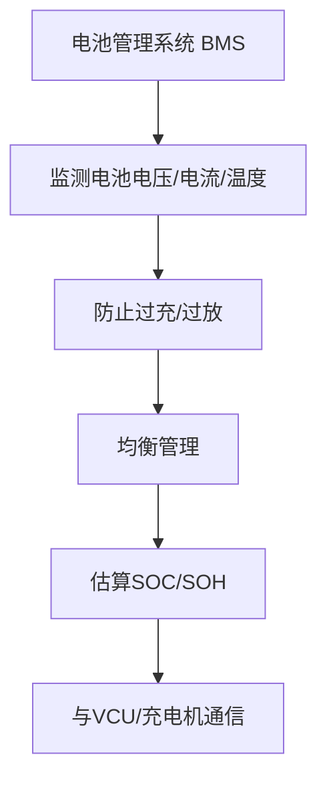

# 《金融科技推动中国绿色金融发展（2022报告）：案例与展望》章节总结

## 书籍信息
- 书名：金融科技推动中国绿色金融发展（2022报告）：案例与展望
- 作者：保尔森基金会绿色金融中心、北京绿色金融与可持续发展研究院联合课题组（研究指导：戴青丽、马骏；研究团队组长：孙蕊、刘嘉龙等）
- PDF 状态：完整可识别
- OCR 状态：文本清晰

## 目录说明
- 目录识别完整，共五部分：引言、政策市场与机遇、2020/2021案例跟踪、2022案例研究、问题与建议。
- 章节层级清晰，按原目录顺序输出。

## 全书核心主题
本报告系统梳理2021年以来金融科技在中国绿色金融领域的最新应用与发展趋势。报告指出，在“双碳”目标背景下，金融科技已在绿色资产识别、环境气候风险管理、数据共享等领域显现成效，并逐步向绿色农业、碳核算、生物多样性保护、转型金融等新领域拓展。报告通过跟踪往期案例和新增案例（境外投资环境风险筛查工具、湖州ESG评价体系、成都数字农业平台），总结了金融科技赋能绿色金融的市场格局、技术应用及面临的问题，并从监管部门、地方政府、金融机构、科技公司四个角度提出针对性建议。

---

## 第1章：引言
### 核心论点
本章介绍2021年作为“十四五”开局之年与碳中和元年，中国绿色金融迎来重大发展机遇，金融科技在支持绿色金融发展中发挥重要作用，且深度与广度进一步延展。报告旨在通过案例研究，总结成功经验、识别问题挑战并提出建议。

### 关键概念/事件
- 碳中和元年：2021年被定义为中国碳中和目标行动全面启动的年份。
- “1+N”政策体系：碳达峰碳中和的顶层设计与各领域实施方案。
- 绿色金融科技应用场景：包括绿色资产识别、环境气候风险管理、环境数据共享、绿色农业、企业碳账户、金融机构碳核算、生物多样性保护、转型金融等。
- 487万亿人民币：未来三十年中国绿色低碳投资累计需求预测值。

### 逻辑推演
报告首先回顾2021年绿色金融与金融科技融合的政策与市场背景；然后跟踪2020/2021年四个典型案例的最新进展；接着新增三个案例，聚焦公共服务平台（生物多样性、小微企业ESG、数字农业）；最后从四类主体角度分析问题与挑战，并提出建议。逻辑递进：现状→案例→问题→建议。

### 经典金句/数据
> “2021年是‘十四五’规划的开局之年，也是碳中和元年，中国担当大国责任、践行低碳发展承诺，构建碳达峰、碳中和‘1+N’政策体系。” (p.7)
> “研究测算未来三十年绿色低碳投资累计需求将达到约487万亿人民币（约73万亿美元）。” (p.7)

---

## 第2章：金融科技推动中国绿色金融发展：政策、市场与机遇
### 核心论点
本章分析“双碳”目标下绿色金融的政策框架、市场格局及未来需求。作者认为：金融科技正从单一产品创新向系统性解决方案转变，并将在生物多样性保护、碳核算、转型金融、ESG评价、绿色农业等领域获得更大创新空间。

### 关键概念/事件
- 三大功能、五大支柱：中国人民银行确立的绿色金融发展思路（标准体系、信息披露、激励约束、产品服务、国际合作）。
- 碳减排支持工具：利率1.75%，按贷款本金60%提供资金支持。
- 六省（区）九地绿色金融改革创新试验区：浙江、江西、广东、贵州、甘肃、新疆。
- 84家科技公司：2021年活跃在中国绿色金融领域的科技公司数量。
- 四大类科技公司：环境信息大数据提供商、以服务绿色金融为主业的金融科技公司、金融机构下属科技服务子公司、互联网科技公司。

### 逻辑推演
首先回顾国内外绿色低碳相关政策（G20路线图、央行碳减排工具、地方试验区成果）；接着分析服务于绿色金融的科技公司市场格局（数量、类型、技术应用、区域分布）；最后展望未来需求与机遇（生物多样性、碳核算、转型金融、ESG评价、绿色农业）。论证清晰：政策驱动→市场响应→需求牵引→技术创新。

### 流程图

### 经典金句/数据
> “碳达峰、碳中和目标提出以来，中国绿色金融发展步入快车道，金融科技在绿色金融领域中的应用空间广阔。” (p.11)
> “2021年，活跃在中国绿色金融领域的科技公司有84家，相较上一年增加25家。” (p.15)
> “大数据、人工智能和云计算仍是目前推动绿色金融发展的三大支柱性技术。” (p.16)

---

## 第3章：金融科技在中国绿色金融的应用：2020年与2021年案例跟踪
### 核心论点
本章跟踪了四个往期案例的最新进展：嘉实基金ESG评分系统、中国华电集团碳排放管理信息系统、湖州市绿色金融综合服务平台、湖州银行绿色信贷管理系统。作者发现：金融科技应用持续深入，通过共享数据、优化模型提高了效率，部分成功经验已复制推广。

### 关键概念/事件
- 嘉实ESG评分：覆盖A股及港股，登录彭博BEAP平台，成为国内外参考的本土化ESG数据。
- 华电碳排放系统：实现130余家火电企业数据全覆盖，减少40%工作量，提前完成碳市场履约。
- 湖州“绿贷通”：累计注册企业超4万家，授信近2930亿元，新增ESG评价与“政采贷”模式。
- 湖州银行绿色信贷系统：绿色识别准确率98%以上，审批时间缩短为1/3，已推广至18家金融机构。

### 逻辑推演
分别对四个案例进行“举措→成效→推广”的叙述。每个案例先说明2021年升级内容（如嘉实覆盖港股、华电按新规优化、湖州平台上线ESG、湖州银行提升识别效率），再展示量化成果（覆盖率、效率提升、复制推广数量），最后总结金融科技的价值。

### 经典金句/数据
> “嘉实ESG评分于2020年上线Wind金融终端后，2021年5月登录彭博第三方另类数据平台BEAP，成为在彭博上线的首家由中资机构提供的ESG数据。” (p.23)
> “中国华电以平台碳排放数据为基础……提前完成全国碳市场第一个履约周期碳排放配额清缴工作。” (p.24)
> “湖州市绿色金融综合服务平台……已累计注册企业40759家，比2020年增加40.21%。” (p.24)
> “湖州银行绿色信贷系统绿色识别准确率稳定在98%以上，绿色信贷审批时间缩短为原来的1/3。” (p.25)

---

## 第4章：金融科技在中国绿色金融的应用：2022年案例研究
### 核心论点
本章新增三个案例，分别聚焦生物多样性保护（ERST工具）、小微企业普惠发展（湖州ESG评价体系）、绿色农业发展（成都数字农业平台），开拓了金融科技支持绿色金融的新场景。

### 案例一：金融科技支持生物多样性保护——中国境外投资项目环境风险快速筛查工具（ERST）
#### 核心论点
ERST工具基于GIS和空间分析，帮助金融机构和企业在境外投资项目早期快速筛查生物多样性等环境风险，弥补了现有环评工具的不足。

#### 关键概念/事件
- ERST：中国境外投资项目环境风险快速筛查工具，由保尔森基金会与生态环境部对外合作与交流中心合作开发。
- 关键栖息地：评估核心指标，参照国际金融公司“绩效标准6”。
- 数据来源：联合国环境规划署世界自然保护监测中心、国际自然保护联盟等。
- 四大特点：与国际标准接轨、直观易用快速、数据和网络安全、预留扩展空间。

#### 逻辑推演
背景：中国对外直接投资位居全球第一，但境外项目面临生物多样性风险，现有政策和工具缺乏快速筛查能力。举措：开发ERST工具，集成了全球生物多样性数据，采用IFC标准，可叠加分析项目区与敏感区域。成效：已向多家金融机构演示，获得肯定，但需进一步整合到现有业务流程。展望：拓展水、碳汇、污染物等评估功能。

#### 流程图

#### 经典金句/数据
> “ERST工具所集成的数据采用了联合国环境规划署世界自然保护监测中心……等国际机构长期系统收集整理的全球生物多样性数据。” (p.30)

### 案例二：金融科技支持小微企业普惠发展——湖州融资主体ESG评价体系
#### 核心论点
湖州率先建立面向中小企业的ESG评价工具，通过多部门数据共享、自动化计算，解决了小微企业绿色识别难、融资难问题，推动绿色金融与普惠金融融合。

#### 关键概念/事件
- 三个维度：环境影响（E）、社会责任（S）、公司治理（G）。
- 碳效码：湖州首创，将碳排放指标纳入ESG评价。
- 两个特点：多部门数据协同（17个部门）、实时动态更新；系统开放，金融机构可定制应用。
- 三个应用场景：信用风险全流程管理、贷款定价、绿色信贷自动化管理。

#### 逻辑推演
背景：小微主体绿色识别困难，被排斥在绿色金融体系外。举措：开发ESG评价体系4.0版，针对小微企业调整权重，协同17个政府部门数据，实现100%线上取数。成效：已评价1.7万家企业，绿色贷款不良率降至0.38%，贷款不良率为0。展望：加强底层数据、探索银行应用路径、推动企业提升ESG表现。

#### 经典金句/数据
> “截至2021年12月，在该评价体系的支持下，湖州绿色贷款余额同比增长49.46%，不良贷款率控制在0.38%，比年初下降0.1个百分点。截至目前，当地采用该评价体系发放的贷款不良率为0。” (p.37)

### 案例三：数字农业系统助力绿色农业发展——成都数字农业平台
#### 核心论点
成都数字农业平台通过物联网、遥感等技术实现粮食生产精准化管理，减少农药化肥使用和碳排放，同时与“农贷通”平台对接，提升普惠金融服务绿色农业的效率。

#### 关键概念/事件
- 四大功能：助力粮食生产精准化管理、降低农户交易成本、提高政府管理精度、帮助金融机构决策。
- 碳减排效应：种植20万亩小麦/水稻每年可实现碳减排约2759吨。
- 两种贷款模式：信用贷款模式、供应链贷款模式。
- 农贷通：农村金融数字化基础设施。

#### 逻辑推演
背景：农业是重要温室气体排放部门，数字技术可助力低碳农业。举措：搭建数字农业平台，整合农资、金融、社会化服务，形成现代农业生态圈。成效：精准施肥施药减少化肥农药10%，水稻种植碳排放强度下降约5%；农户获得超1700万元信贷支持，利率降低70%以上。展望：扩大覆盖面，深化与融资平台对接。

#### 流程图

#### 经典金句/数据
> “根据该平台测算，种植20万亩小麦、水稻每年可实现碳减排共计约2759吨，小麦种植碳排强度较传统模式下降约13%-21%。” (p.41)
> “截至2021年末，该平台的农户共获得超过1700万元人民币信贷支持……贷款利率水平较以往资金借贷和农资赊销降低了70%以上。” (p.42)

---

## 第5章：金融科技推动中国绿色金融发展：问题与建议
### 核心论点
本章从监管部门、地方政府、金融机构、科技公司四个角度总结当前面临的问题与挑战，并分别提出针对性建议，以推动金融科技更有效支持绿色金融发展。

### 关键概念/事件
- 监管部门层面问题：缺乏金融科技支持绿色金融的规划指引；产业与金融部门数据共享机制未打通。
- 地方政府层面问题：环境数据共享与认证互信难；ESG评价多依赖人工评分。
- 金融机构层面问题：重视不足；部门间缺乏互动；复合型人才缺失。
- 科技公司层面问题：部分技术不成熟（如遥感）；对绿色金融需求理解不深。

### 逻辑推演
采用“问题→建议”一一对应的结构。先分四类主体列出具体问题，然后针对每一类问题给出相应建议：监管部门应纳入规划、优化激励、推动数据共享、促进能力建设；地方政府应建立数据共享平台和量化评价体系；金融机构应提升认识、建立联动机制、加强产品创新；科技公司应关注重点技术、深化应用场景、研发新领域解决方案。

### 经典金句/数据
> “现有绿色金融政策框架下缺乏金融科技支持绿色金融发展的规划与指引。” (p.44)
> “许多金融机构对金融科技应用于绿色金融的重视程度不足……绿色金融业务部门与金融科技部门缺乏互动与了解。” (p.45)
> “建议监管部门将金融科技支持绿色金融纳入未来版本的绿色金融和转型金融的指导意见。” (p.45)

---

## 附录
### 核心内容
报告末尾列出了参考文献，包括G20可持续金融路线图、央行与监管机构绿色金融网络报告、中国保险行业协会蓝皮书、中国信息通信研究院白皮书等，为研究提供资料支撑。

### 机构介绍
- 保尔森基金会绿色金融中心：成立于2018年，聚焦碳市场、绿色金融、金融科技。
- 北京绿色金融与可持续发展研究院：非营利智库，专注绿色金融、自然资本、低碳发展。

---

# 《图解《网络数据分类分级要求》（征求意见稿）》章节总结

## 书籍信息
- 书名：图解《网络数据分类分级要求》（征求意见稿）
- 作者：炼石网络
- PDF 状态：完整可识别
- OCR 状态：文本清晰，含大量图表

## 目录说明
- 文件为图解形式，章节结构按标准概述、法律政策协调、术语定义、分类分级原则、框架、方法、流程、附录等展开。按原文顺序输出。

## 全书核心主题
本文件以图解方式解读《网络数据分类分级要求》征求意见稿，旨在为国家统一的数据分类分级规则提供实施参考。内容涵盖标准编制的背景、协调性、术语定义、分类分级的基本原则、方法框架、数据定级规则、影响对象与程度、衍生数据定级、动态更新、实施流程等，为数据处理者开展数据分类分级工作提供指导。

---

## 第1部分：标准概述
### 核心论点
本部分说明标准的目的是为数据处理者开展数据分类分级工作提供参考，细化统一数据分类分级规则，支撑《数据安全法》第二十一条的贯彻落实。

### 关键概念/事件
- 《数据安全法》第二十一条：国家建立数据分类分级保护制度。
- 问题导向原则、协调性原则：标准编制遵循的两大原则。
- 数据分类分级基本原则、分类方法、分级框架、定级方法：标准给出的核心内容。

### 逻辑推演
首先指出缺乏国家统一规则导致制度落地困难；然后提出本标准的解决方案：规定统一规则、明确方法、给出示例；最后说明有利于各行业规则衔接和协调。

### 经典金句/数据
> “本标准给出数据分类分级基本原则、数据分类方法、数据分级框架和数据定级方法等。” (p.4)

---

## 第2部分：与现行法律、法规、规章及相关标准的协调性
### 核心论点
本标准与《数据安全法》《个人信息保护法》以及已有国标、行标、地标相协调，属于配套衔接关系。

### 关键概念/事件
- 法律：《数据安全法》《个人信息保护法》
- 政策：《关于构建更加完善的要素市场化配置体制机制的意见》、“十四五”规划
- 国标：GB/T 35273-2020、GB/T 38667-2020、GB/T 37973-2019
- 行业标准：JR/T 0197-2020、JR/T 0158-2018、YD/T 3813-2020
- 地方标准：DB52/T 1123-2016

### 逻辑推演
分别列举法律、政策、标准三个层面的已有规定，指出本标准充分借鉴和参考上述标准，与GB/T 35273-2020等属于协调配套关系，不存在冲突。

---

## 第3部分：术语定义（引用GB/T 25069—2022）
### 核心论点
明确重要数据、核心数据、一般数据、个人信息等关键术语的定义。

### 关键概念/事件
- 数据：任何以电子或其他方式对信息的记录。
- 重要数据：特定领域、群体、区域或达到一定精度和规模的数据，泄露可能危害国家安全、经济运行等；仅影响组织或公民个体的不作为重要数据。
- 核心数据：对领域、群体、区域具有较高覆盖度或达到较高精度、较大规模的重要数据，可能直接影响政治安全。
- 一般数据：核心数据、重要数据之外的数据。
- 个人信息：与已识别或可识别的自然人有关的各种信息。

### 逻辑推演
通过定义区分数据类别，强调重要数据与核心数据的危害程度差异，明确仅影响个人或组织的不是重要数据。

---

## 第4部分：数据分类分级基本原则
### 核心论点
提出数据分类分级应遵循的五项原则：合法原则、分类分级原则、就高从严原则、动态调整原则、权限明确原则。

### 流程图

### 经典金句/数据
> “在遵循国家数据分类分级保护要求的基础上，按照数据所属行业领域进行分类分级管理。” (p.7)

---

## 第5部分：数据分类基本思路
### 核心论点
数据分类先按行业领域分类，再按业务属性分类。行业领域包括工业、电信、金融、能源等；业务属性包括用户数据、业务数据、经营管理数据、系统运行和安全数据等。

### 关键概念/事件
- 行业领域数据：如工业数据、电信数据、金融数据等。
- 业务属性分类：用户数据、业务数据、经营管理数据、系统运行和安全数据。
- 个人信息特殊处理：按有关规定单独识别。

### 流程图

### 经典金句/数据
> “先按行业领域分类，再按业务属性分类。” (p.8)

---

## 第6部分：数据分级框架
### 核心论点
根据数据重要程度和危害程度从高到低分为核心数据、重要数据、一般数据三个级别。

### 关键概念/事件
- 核心数据：关系国家安全、国民经济命脉、重要民生、重大公共利益。
- 重要数据：可能危害国家安全、公共利益。
- 一般数据：核心、重要之外的数据。

### 逻辑推演
参照《网络数据安全管理条例（征求意见稿）》和《重要数据识别指南》的思路，从后果角度描述识别因素，践行总体国家安全观，涵盖十六个领域（科技、网络、生态、资源、海外利益、太空、生物等）。

### 流程图

---

## 第7部分：数据定级方法（影响对象与影响程度）
### 核心论点
数据分级需考虑影响对象（国家安全、经济运行、社会稳定、公共利益、组织权益、个人权益）和影响程度（特别严重危害、严重危害、一般危害），按照定级参考规则确定最终级别。

### 关键概念/事件
- 影响对象：六大类。
- 影响程度：从高到低三档。
- 定级参考规则表：交叉判断。

### 表格提炼

| 影响对象 | 特别严重危害 | 严重危害 | 一般危害 |
|----------|--------------|----------|----------|
| 国家安全 | 核心数据 | 核心数据 | 重要数据 |
| 经济运行 | 核心数据 | 重要数据 | 重要数据 |
| 社会稳定 | 核心数据 | 重要数据 | 一般数据 |
| 公共利益 | 核心数据 | 重要数据 | 一般数据 |
| 组织权益、个人权益 | 一般数据 | 一般数据 | 一般数据 |

### 经典金句/数据
> “数据定级确定参考规则：结合影响对象和影响程度综合判定。” (p.30)

---

## 第8部分：数据分级流程
### 核心论点
数据分级四步走：识别数据资产、分析数据分级要素、综合确定级别、审核与动态更新。

### 流程图

---

## 第9部分：重要数据、核心数据和一般数据定级要求
### 核心论点
明确各类数据的具体定级要求，如重要数据需给出本行业本领域重要数据目录，核心数据需提出目录建议，一般数据可进一步细化分级。

### 关键概念/事件
- 重要数据识别细则：需明确特定领域、群体、区域、精度、规模。
- 核心数据：需明确覆盖度、精度、规模、深度。
- 一般数据：可参照附录G从低到高细分。

---

## 第10部分：数据集、衍生数据、跨行业领域的数据分级
### 核心论点
数据集按就高从严原则定级；衍生数据可在原始数据级别基础上调整；跨行业数据按来源行业分级，若融合加工需重新评估。

### 关键概念/事件
- 数据集级别：取包含数据项的最高级别。
- 衍生数据：脱敏/标签数据可降级，统计数据/融合数据可能升级。

---

## 第11部分：数据分类分级实施流程（五个步骤）
### 流程图

---

## 附录内容（节选）
### 附录H：个人信息分类示例
- 一级类别包括：个人基本资料、个人身份信息、个人生物识别信息、网络身份标识信息、个人健康生理信息、个人教育信息、个人工作信息、金融账户信息、个人交易信息、个人资产信息、个人借贷信息、身份鉴别信息、个人通信信息、联系人信息、个人上网记录、个人设备信息、个人位置信息、个人标签信息、个人运动信息等。

### 附录B：数据分级要素考虑因素
- 数据领域、群体、区域；数据精度（数值、空间、时间、生产工艺、视频清晰度等）；数据规模（存储量、市值、容量、群体规模等）；数据深度（特征分析、行踪轨迹等）。

### 附录C：影响对象考虑因素（国家安全、经济运行、社会稳定、公共利益等）

---

# 《罗兰贝格-铁前降本，应对钢铁行业寒冬》章节总结

## 书籍信息
- 书名：铁前运营降本，应对钢铁行业“寒冬”
- 作者：罗兰贝格（全亮、施国键等）
- PDF 状态：完整，共6页
- OCR 状态：清晰

## 目录说明
- 简短报告，无独立目录。内容分为：引言、铁前运营降本的核心观点（配料优化、烧结降燃耗、高炉降燃耗、余能利用、钢后降本）、结论。

## 全书核心主题
报告指出2021年下半年以来钢铁行业进入新一轮“寒冬”，企业亏损面扩大。罗兰贝格认为铁前运营降本（成本占比65%-70%）是钢企最直接有效的速赢手段，重点从配料优化、烧结及高炉燃耗降低、余能利用等方面实现吨钢成本降低50-100元。

---

## 引言
### 核心论点
2021年下半年起钢铁企业盈利大幅下降，7月基本全行业亏损。应对当前形势，运营降本特别是铁前运营降本是核心工作。

### 经典金句/数据
> “近期，部分钢企在内部会议上甚至发出‘准备好钢铁长期亏损……’‘保生存……’等警示。” (p.3)

---

## 铁前运营降本的核心观点
### 核心论点
铁前成本占长流程炼钢成本的65%-70%，其中原材料及能源占80%以上。配料优化、烧结及高炉的燃耗降低、余能利用是实现铁水成本显著降低的速盈手段。

### 关键概念/事件
- 配料优化：利用铁矿石价格下降、焦炭价格高位的机会，优化配矿结构，降低铁水成本。
- 烧结降燃耗：通过原燃料粒度精细控制、厚料层热风循环、返矿率降低等手段实现。
- 高炉降燃耗：提高煤气利用率（从低于47%到50%可降低焦比30kg/t-p）、高温低硅冶炼（硅降低0.1%可降焦比5kg/t-p）。
- 余能利用：当前多数钢厂能源利用率仅30-40%，领先企业达70%。可利用高炉渣、烧结烟道废气等余热。
- 钢后降本：合金元素配方优化、减少铁损等。

### 逻辑推演
从成本结构分析→识别关键环节（铁前）→具体速赢手段（配料、烧结、高炉、余能）→量化效果（50-100元/吨钢）→总结管理提升即可见效。

### 流程图

### 经典金句/数据
> “铁前成本约占65%-70%，是成本控制的核心，而其中原材料及能源又占到80%以上。” (p.4)
> “通过管理提升及优化，就能够在铁前实现50-100元的吨钢成本降低。” (p.5)

---

## 作者与联系方式
（略）

---

# 《罗兰贝格-优化升级产品组合，助力普钢企业长期发展》章节总结

## 书籍信息
- 书名：优化升级产品组合，助力普钢企业长期发展
- 作者：罗兰贝格（全亮、陈友业、王星、张玮、施国键等）
- PDF 状态：完整，共10页
- OCR 状态：清晰

## 目录说明
文件含引言和四个部分：瞄准市场的研发体系、满足品种钢生产的运营体系、完善品种钢生产采购体系、围绕用户的销售模式。

## 全书核心主题
普钢企业面临基建减缓、成本上升、盈利下降的困境，而制造业高端化及“双碳”目标推动品种钢需求上升。报告认为跨越从普钢到品种钢的鸿沟，关键在于从“成本为王”转向“质量为核心”，从研、产、供、销四个维度构建新竞争力。

---

## 引言
### 核心论点
普钢企业盈利下降，品种钢需求上升。拓展品种钢是有价值的战略路径，但转型者众、成果者寡。关键在于转变经营思路，建立以产品质量为核心的经营体系。

### 经典金句/数据
> “跨越从普钢到品种钢的鸿沟，关键在于彻底转变成本为王，产量优先的经营思路，逐步建立起以产品质量为核心的经营体系。” (p.3)

---

## 一、瞄准市场的研发体系
### 核心论点
保持定力，以市场需求为最终目标，结合自身特点循序渐进向品种钢高端路线发展。需设定目标、认证优先。

### 关键概念/事件
- 设定目标：了解区域下游需求、竞争格局、内部能力，设计产品型号规格（如节能型、新能源用特种钢）。
- 认证优先：高端品种钢需通过客户认证（如天津西门子采购齿轮钢需一年时间）。
- 循序渐进：兴澄特钢轴承钢、汽车用钢有30年发展历程。

### 逻辑推演
先定位目标市场→再提前布局产品认证→按路线图逐步推进，实现品种系列化。

---

## 二、满足品种钢生产的运营体系
### 核心论点
围绕产品质量高端化，坚持“质量才是最大的成本”理念。需建立质保体系、使用专业质量管理工具，并改变考核体系。

### 关键概念/事件
- 质量保证：品种钢成分控制要求极窄范围（如Cr、Ni），需过程控制、源头预防、事后追溯。
- 设备体系：品种钢对设备功能精度要求高（如热处理温度870±10℃），普钢企业设备管理仅满足开动，需提升到精度维护。

### 逻辑推演
对比普钢（仅满足国标）与品种钢（极窄成分控制）→提出质量保证体系→强调设备精度管理→改变绩效导向。

---

## 三、完善品种钢生产采购体系
### 核心论点
原辅料、备品备件是质量基础。需建立与品种钢相适应的原料标准，采购模式从低价中标转向全生命周期成本最优。

### 关键概念/事件
- 原料采购：废钢残余元素、合金品质标准需保证质量。
- 备品备件管理：从吨钢费用外包制转向自主采购，综合考虑全生命周期成本。

---

## 四、围绕用户的销售模式
### 核心论点
品种钢销售需重视下游客户“个性化”需求，加强“贴身服务”。完善售前售后服务、推行近终产品销售、大力拓展直销用户。

### 关键概念/事件
- 售前售后服务：精准理解客户需求（如轴承钢钛含量要求），售后跟踪异常并闭环整改。
- 近终产品：与客户共建加工企业，挖掘利润点。
- 直销用户：螺纹钢价格透明，直销影响不大；品种钢直销是实现技术溢价的关键。

---

## 结语
### 核心论点
普钢企业经历过2008年金融危机和2014年生存危机，但老办法不能解决当前困难。应拥抱新趋势，以质量为核心，小步快跑拓展品种钢。

### 经典金句/数据
> “与其被动地苦盼牛市回归，不如更勇敢地拥抱新趋势，拓展品种钢机会。” (p.9)

---

# 《美中贸易全国委员会-中国商业环境调查-2022.8》章节总结

## 书籍信息
- 书名：中国商业环境调查
- 作者：美中贸易全国委员会
- PDF 状态：完整，共27页
- OCR 状态：清晰

## 目录说明
包含执行摘要、前言、2022年度主题（新冠肺炎疫情、中美关系、数据隐私法规）、企业业绩与规划、中国政策环境等。按顺序输出。

## 全书核心主题
本调查基于117家会员企业反馈，评估美国企业在华商业环境。主要结论：中国新冠疫情防控政策成为首要挑战，取代中美关系；紧张的双边关系继续损害企业；新数据法规引发关切；企业乐观情绪下跌至历史新低；多数企业仍保持盈利，但投资计划趋于观望。

---

## 执行摘要
### 核心论点
新冠防控政策成为美企首要挑战，取代连续四年首位的“中美关系”。紧张的双边关系导致销售损失和供应链分离。企业悲观情绪创历史新高，但中国仍是全球前五大优先市场。

### 十大挑战（2022）
1. 新冠肺炎疫情：企业关停
2. 中美关系
3. 新冠肺炎疫情：旅行限制
4. 数据、个人信息和网络安全规则
5. 成本上升
6. 中美技术脱钩
7. 与中国本土企业的竞争
8. 产业政策
9. 在华采购政策
10. 知识产权保护

---

## 前言
### 核心论点
过去一年美国企业面临重大挑战：疫情封控、地缘政治紧张、供应链扰乱。企业反映防控措施、中美关系、数据政策是主要挑战，技术脱钩问题显著。

---

## 2022年度主题：新冠肺炎疫情封控动摇企业信心
### 核心论点
96%受访企业业务受防控措施负面影响，近一半受到严重负面影响。半数以上企业暂停、推迟或取消投资计划。

### 经典金句/数据
> “百分之九十六的受访企业的在华业务都曾因新冠肺炎疫情防控措施而遭受负面影响，将近一半的企业反映其受到严重的负面影响。” (p.6)
> “半数以上的受访企业因新冠肺炎防控策略而暂停、推迟或取消了在中国的投资计划。” (p.7)

---

## 2022年度主题：中美关系的紧张局势继续影响企业
### 核心论点
87%企业业务受到中美紧张局势影响，创历史新高。影响主要表现为销售损失和民族主义情绪。企业面临来自中美双方的压力，采取供应链分离、减少投资等战略。

### 经典金句/数据
> “百分之八十七的企业反映公司业务受到中美紧张局势的影响，这一数字创历史新高。” (p.9)

---

## 2022年度主题：新数据和隐私保护法规引发前所未有的关切
### 核心论点
87%企业对此十分或有些关切，创历史新高。跨境数据流动限制、数据本地化、模糊合规要求是主要问题。已有企业因合规成本增加而调整产品（中国版精简版）。

### 经典金句/数据
> “百分之八十七的受访企业表示对此十分或有些关切，自此问题被纳入调查问卷以来，企业关切程度创历史新高。” (p.11)

---

## 企业业绩与规划
### 核心论点
尽管挑战重重，89%企业仍保持盈利（但为七年最低）。乐观情绪下跌至历史新低（51%），悲观情绪升至21%。仅25%计划未来一年增加资源投入（五年前为50%）。77%认为中国是全球前五大优先市场之一（十年前为96%）。

### 经典金句/数据
> “乐观情绪下跌至历史新低……认为前景乐观或者有些乐观的公司比去年减少18%，下滑至前所未有的51%。” (p.15)
> “与三年前相比，企业对当前中国商业环境的看法：83%表示现在没有之前乐观。” (p.16)

---

## 中国政策环境
### 核心论点
产业政策、政府采购、本土企业竞争成为主要关切。四分之三企业对中国推动国内制造和创新政策表示担忧。86%企业表示与中国国有企业存在竞争，55%与民企竞争。政府采购政策十年首次进入十大挑战。

### 关键概念/事件
- 产业政策影响：三分之一企业观察到负面影响，主要体现为与本土企业竞争加剧。
- 政府采购：半数企业指出采购环境对外资不利。

---

## 总结
### 核心论点
美国企业在华面临多重不利因素，但中国市场仍对其全球竞争力至关重要。建议中国平衡疫情防控与经济增长，改善市场准入，公平竞争；建议两国政府管控地缘政治，探索气候、公共卫生等领域合作。

---

# 《品牌价值-2022年度中国品牌价值500强报告》章节总结

## 书籍信息
- 书名：2022年度中国品牌价值500强报告
- 作者：Brand Finance
- PDF 状态：完整，共55页
- OCR 状态：清晰

## 目录说明
包含关于Brand Finance、董事长致辞、行业优秀品牌点评、全国领军区域分析、品牌守护指数榜中国表现、全球软实力指数榜中国表现、2022年中国500强榜单（1-500名）、品牌定义解释、品牌估值方法等。

## 全书核心主题
报告发布了2022年中国品牌价值500强排名，分析了中国品牌价值变化趋势。亮点：抖音品牌价值增长202%全球最快；华为克服地缘政治挑战增长23%；工商银行蝉联最具价值品牌；比亚迪、李宁、伊利等品牌价值显著增长；北京市品牌总价值占全国43%；中国在Brand Finance全球软实力指数中排名第4，取得历史最好成绩。

---

## 关于Brand Finance
（略，介绍公司背景）

---

## 董事长致辞
### 核心论点
建立强大品牌的目的是赚钱。品牌价值评估连接营销与财务，帮助董事会做出回报最大化的决策。强势品牌与股市表现紧密相关。

### 经典金句/数据
> “建立强大品牌的目的是什么？是为了吸引客户？建立忠诚度？激励员工？这些都没错，但对于一个品牌来说，尤其是商业品牌，其首要目的永远是‘赚钱’。” (p.10)

---

## 行业优秀品牌点评
### 核心论点
总结2022年中国品牌500强中表现突出的品牌：抖音（全球增长最快+202%）、华为（+23%）、工商银行（第一，4837亿）、比亚迪（+100%）、五粮液（+7%）、李宁（+61%）、国家电网（+5%）、伊利（排名升7位）、拼多多（+52%）、京东物流（新上榜）等。

### 关键数据
- 抖音品牌价值：3798亿人民币，增长202%
- 华为：4587亿，+23%
- 工商银行：4837亿，-1%
- 比亚迪：413亿，+91.8%
- 五粮液：1851亿，+7%
- 李宁：129亿，+61%
- 国家电网：3875亿，+5%
- 拼多多：640亿，+52%
- 京东物流：267亿（新上榜）

---

## 全国领军区域分析
### 核心论点
北京品牌总价值占全国43%（97个品牌，工商银行、建行、农行、国家电网、抖音等前十大品牌占5个）。粤港澳大湾区125个品牌占25%。浙江省位列第三，占8%。

---

## 品牌守护指数榜中国表现
### 核心论点
全球前100名CEO中，中国有19位（约五分之一），仅次于美国。代表人物：长城汽车魏建军、腾讯马化腾。

---

## 全球软实力指数榜中国表现
### 核心论点
中国排名第4（分数64.2），创历史最好成绩。在“商业与贸易”支柱排名第一，“强劲稳定的经济”获9.5分。“拥有在世界范围内备受喜爱的产品和品牌”指标从5.7升至7.9。冬奥会提升“体育领袖”排名至第10。

### 经典金句/数据
> “今年中国的软实力表现非常出色，在抗击新冠疫情的政策措施、创新、冬奥会以及商业品牌几个方面都得到了国际社会较高的认可。” (p.26)

---

## Brand Finance 2022年中国500强榜单（1-500名）
（完整列表见原PDF，此处仅列前10名）

| 2022排名 | 品牌 | 省/市 | 产业 | 品牌价值(百万人民币) | 变化率 |
|----------|------|-------|------|---------------------|--------|
| 1 | 中国工商银行 | 北京 | 银行 | 483,735 | -1.0% |
| 2 | 华为 | 广东 | 科技 | 458,708 | +23.3% |
| 3 | 中国建设银行 | 北京 | 银行 | 422,091 | +5.4% |
| 4 | 微信 | 广东 | 媒体文化 | 401,201 | -12.0% |
| 5 | 中国农业银行 | 北京 | 银行 | 399,454 | +12.0% |
| 6 | 国家电网 | 北京 | 公用事业 | 387,500 | +4.5% |
| 7 | 抖音 | 北京 | 媒体文化 | 379,805 | +201.7% |
| 8 | 中国平安 | 广东 | 保险 | 350,016 | -4.5% |
| 9 | 淘宝 | 浙江 | 零售 | 346,201 | -3.3% |
| 10 | 中国银行 | 北京 | 银行 | 319,102 | -2.4% |

---

## 品牌定义解释与估值方法
（略，介绍品牌价值、品牌强度、特许费率法等）

---

# 《普华永道-砥砺前行 拥抱未来 中国连锁餐饮企业资本之路系列报告》章节总结

## 书籍信息
- 书名：砥砺前行 拥抱未来 中国连锁餐饮企业资本之路系列报告2022
- 作者：中国连锁经营协会、普华永道联合
- PDF 状态：完整，共57页
- OCR 状态：清晰

## 目录说明
包含前言、行业整体情况、餐饮行业一二级市场动态、餐饮食材供应链行业一二级市场动态、税务实务建议、结语、附录。

## 全书核心主题
报告追踪2021-2022上半年中国连锁餐饮企业的资本之路。受疫情影响，餐饮行业震荡但展现韧性。2021年餐饮投融资数量显著增长，2022年上半年有所降温。报告分析了30家上市及拟上市餐饮企业的业绩与市值，新增对餐饮食材供应链企业的研究（预制菜、集成供应链）。最后提出税务实务建议。

---

## 前言
### 核心论点
2020年以来餐饮行业受疫情冲击，2021年恢复至4.7万亿，2022上半年同比下滑8%。餐饮企业通过外卖、供应链优化、零售化等提升韧性。2021年3家餐饮企业港股上市，超10家提交申请。报告新增餐饮食材供应链研究。

---

## 行业整体情况
### 核心论点
长期看，餐饮行业规模与经济体量显著正相关。中国城镇化率64.7%、人均可支配收入增长、家庭小型化（每户2.6人）推动餐饮消费。疫情后趋势：连锁化、规模化、品牌化提升；产品矩阵多元化；线上渗透进一步深化；门店经济模型优化；供应链体系趋完善。

### 经典金句/数据
> “2021年我国人均每年餐饮支出约500美元，与美国的差距接近3倍，与日本和韩国的差距接近2倍。” (p.9)
> “当前中国餐饮连锁化率不到20%，较美国的59%和日本的58%还存在差距。” (p.33)

---

## 餐饮行业一二级市场动态
### 核心论点
2021年下半年至2022上半年，3家餐饮企业完成IPO，11家在进程中。样本30家企业中，快餐和火锅平均营收规模较大，正餐受疫情冲击最大。大多企业盈利水平下滑1-5个百分点，但部分企业通过下沉市场、优化场景、自建供应链、孵化新品牌等策略谋求发展。一级市场2021年投资数量超130笔，茶饮、咖啡、中式快餐最受关注。

### 关键数据
- 样本企业营收多数在10-25亿。
- 火锅类龙头企业百亿级别。
- 2021年线下餐饮投资数量超130笔。
- 喜茶D轮5亿美元、蜜雪冰城20亿人民币、和府捞面8亿人民币等重大交易。

---

## 餐饮食材供应链行业一二级市场动态
### 核心论点
中国餐饮食材供应链相对落后，食材损耗率10-15%，蔬菜冷链渗透率仅7%（美国80-100%）。预制菜成为热点，集成供应链服务商（如美菜、蜀海）市场格局分散。样本16家上市食材供应商，初级食材供应商营收规模大但毛利率低；深加工食品供应商毛利率高。疫情期间85%以上供应商实现营收增长。

### 关键数据
- 中美日对比：中国食材损耗率10-15%，美国约5%；蔬菜冷链渗透率7% vs 80-100%；每百万人冷藏车保有量118辆 vs 749辆。
- 美国Sysco市值1439.5亿美元，收入513亿美元。

### 流程图（餐饮供应链图谱略）

---

## 税务实务建议
### 核心论点
餐饮企业可通过增值税留抵退税、享受抗疫政策补贴（房租减免、五险一金缓缴）、设立地区总部享受税收优惠、研发费用加计扣除等方式优化财税管理。

---

## 结语
### 核心论点
餐饮行业连锁化、规模化、品牌化、工业化不可逆。集成供应链将取代传统分散体系。餐饮企业应修炼内功，借助资本获得可持续发展。

---

# 《汽车及零部件行业：电动百科》章节总结

## 书籍信息
- 书名：电动百科 (Electric Vehicle Encyclopedia)
- 作者：海通国际（吴旖婕、金云涛）
- PDF 状态：完整，共156页
- OCR 状态：清晰，含大量图示

## 目录说明
文件按零部件分类，包括：国产化率高的零部件、中等、低的零部件；车身及附件（挡泥板、中网、保险杠、翼子板、灯具、防撞梁、汽车玻璃、立柱、侧围、顶盖、座椅、车载音响、HUD）；饰件（车标、地毯）；底盘（车桥、轮胎、轮毂、消音器、车架、副车架、悬架各部件、传感器）；驱动零部件（VCU、IGBT、减速器、永磁同步电机、交流感应电机、旋转变压器、差速器、变速箱、传动轴、耦合器、集成化电驱）；能源系统（水冷板、电池壳、电池端板、支架、盖板、绝缘板、汇流排、BMS、高压配电箱、车载充电机、DC/DC、充电枪）；连接器和线束；驾驶舱热管理（压缩机、PTC、热泵、冷媒、四通阀、气液分离器、电磁阀、热交换器、ECU、蒸发器、冷凝器、电子膨胀阀、散热器、电子风扇、截止阀、单向阀）；电池电控热管理（冷油器、电子水泵、膨胀水箱）；管路（塑胶、塑料、橡胶、油管、水管、波纹管、燃油管、管件、金属接头）；转向系统（方向盘、转向器、转向轴、横拉杆、直拉杆、摇臂、EPS、蜗轮蜗杆、ECU、线控转向）；制动系统（制动踏板、盘式制动器、鼓式制动器、碳陶瓷刹车、制动钳、制动主缸、电子真空泵、线控制动、真空助力器）；感知系统（车载摄像头、激光雷达、毫米波雷达、超声波雷达、夜视系统）。每个零部件包含简介、主要供应商、国产化率、价格。

## 全书核心主题
本报告是新能源汽车零部件的百科全书式手册，系统介绍了各类零部件的功能、主要供应商（区分外资/合资/国内）、国产化率（高/中/低）以及市场价格。覆盖车身、底盘、动力系统、能源系统、热管理、线束、转向、制动、感知等全车部件，为行业研究提供基础数据。

---

## 说明
由于该文件为零部件词典式结构，无传统章节划分。以下按主要类别提炼核心信息。

---

## 核心零部件国产化率与价格概览

| 零部件类别 | 国产化率 | 典型价格区间 | 主要国内企业示例 |
|------------|----------|--------------|------------------|
| 挡泥板 | 高 | 约100元 | 宁国中辰、浙江模具厂 |
| 中网 | 高 | 900-4000元 | 湖南浩润、延锋汽车 |
| 保险杠 | 高 | 前300-600元 | 江南模具、华翔电子 |
| 灯具 | 高 | 前照灯100-300元 | 星宇股份、科博达 |
| 汽车玻璃 | 高 | 约103元/平方米 | 福耀玻璃、南玻 |
| 座椅 | 低 | 商务用2930元/件 | 继峰股份、上海沿浦 |
| HUD | 低 | 800-5000元 | 华阳集团、经纬恒润 |
| 轮胎 | 中 | 250-400元/条 | 赛轮金宇、万力轮胎 |
| 轮毂 | 高 | 600-3000元/只 | 中信戴卡、万丰奥威 |
| 减震器 | 中 | 300-800元 | 蒙诺、KYB |
| IGBT | 高 | 用途差异大 | 杨杰电子、龙腾半导体 |
| 永磁同步电机 | 高 | 2000-4000元 | 华域汽车、方正电机 |
| 电池壳 | 中等 | 单车3000-4000元 | 和胜股份、旭升股份 |
| BMS | 低（芯片受限） | 3000-20000元 | 宁德时代、比亚迪 |
| 车载充电机 | 中偏高 | 2000-3000元 | 威迈斯、欣锐科技 |
| 高压连接器 | 中偏低 | 30-400元 | 中航光电、瑞可达 |
| 高压线束 | 低 | 单车2500元 | 沪光股份、天海集团 |
| 线控制动 | 低 | 约1500元/套 | 同驭汽车、伯特利 |
| 激光雷达 | 34%份额（国产） | 4000-7000元 | 速腾聚创、华为、禾赛 |
| 毫米波雷达 | 不到5% | 约400元 | 森思泰克、德赛西威 |

---

## 典型零部件结构图（Mermaid示例：电池管理系统）

---

## 风险提示
> “新能源汽车销量增速低于预期” (p.138)

---

# 《私域成长新引擎—百度企业号私域运营解决方案》章节总结

## 书籍信息
- 书名：私域成长新引擎—百度企业号私域运营解决方案
- 作者：百度（智星计划）
- PDF 状态：完整，共47页
- OCR 状态：清晰

## 目录说明
文件包含：打通流量+私域（百度企业号价值与优势）、“智星计划”品牌招募计划、百度企业号功能模块、用户链接（搜索授权、Feed分发、品专挂载）、用户沉淀（粉丝运营、多账号矩阵）、转化套件、行业运营策略（低频高客单价、高频高客单价、高频低客单价等）以及案例展示。

## 全书核心主题
百度企业号作为企业在百度生态内的私域经营阵地，通过内容、粉丝沉淀和持续经营，实现生意增长。报告介绍了企业号的核心功能（蓝V认证、搜索授权、Feed分发、转化套件等），并推出“智星计划”招募品牌，提供免费蓝V席位、亿级流量扶持、运营指导等资源。针对不同行业（汽车、3C、教育培训、B2B、快消品等）给出定制化私域运营策略。

---

## 第一部分：打通流量+私域，品牌营销生意新增量
### 核心论点
百度企业号被众多品牌广告主重视，覆盖超30个一级行业。企业号是品牌资产沉淀与转化获客的必选阵地，链接搜索流量和Feed分发，实现三域（公域、商域、私域）打通。

### 经典金句/数据
> “自2022年起，百度企业号越来越被众多品牌广告主所重视...企业百家号不断夯实阵地建设能力，与用户长效沟通的效果持续增强。” (p.6)

---

## 百度企业号是什么
### 核心论点
企业号是企业在百度生态内的私域经营阵地，具备丰富完善的模块组件（主页、底bar、转化套件等）。蓝V认证提供5大核心特权：品牌展示、搜索特权、内容加热、数据分析、转化组件。

### 流程图（企业号能力地图略）

---

## 用户链接
### 核心论点
- 搜索授权：品牌+企业号关键词搜索首位展现，丰富样式。
- Feed分发：通过优质内容获得公域流量，百+加热。
- 超级品专挂载企业号：打通搜索到私域的闭环。

### 案例
- 江湖搜食记总曝光2亿+，范牌冠名。

---

## 用户沉淀
### 核心论点
企业号粉丝运营与多账号矩阵联动，完成获客、种草、直播转化。转化套件包括线索留资、商品带货（度小店、淘宝、京东等）。

---

## 智星计划：百度企业号品牌招募计划
### 核心论点
为应对品牌企业号系统化经营需求，百度推出“智星计划”，提供六大扶持：
- 亿级搜索流量扶持（C位直达）
- 100席蓝V企业号免费体验
- 专业运营团队多维度指导
- 创新产品应用绿色通道
- 专属百+币内容加热包
- 长期经营资源包（课程、榜单）

共开放600席，期限2022年9月15日-12月31日。

---

## 行业运营策略方法+案例
### 针对不同行业的核心策略

| 行业类型 | 策略要点 | 案例 |
|----------|----------|------|
| 低频、高客单价、偏线下（汽车、奢侈品、房地产） | 完善客服体系、KOL联动、输出优质内容、线上线下转化一体化、私域精细化、长期活动运营 | 一汽红旗（粉丝15万+）、雅汇汽车内饰 |
| 低频、高客单价、偏线上（金融、保险、3C、教育） | 创建行业专家形象、建设粉丝社群、多账号矩阵、品牌新品发布会 | 焦点财税（知识付费专栏） |
| 高频、高客单价（贵价白酒、化妆品） | 营造专业形象、KOL联动、借势百度大IP、转化套件+POI引流 | 小米11发布会、荣耀Magic3 |
| 高频、低客单价、偏线上（食品饮料、服饰、二类电商） | 凸显品牌主页特色、持续运营粉丝、打造官方系列活动、借势大IP | 58同城（直播招聘） |
| B2B行业 | 日更高频运营，打造信任感 | 某纸品机械客户 |

---

## 结语
智星计划通过流量、权益、指导、工具等多维度支持，助力品牌在百度生态内构建私域阵地，实现长效增长。

---

# 《中国电解水制氢产业蓝皮书2022》章节总结

## 书籍信息
- 书名：中国电解水制氢产业蓝皮书2022
- 作者：势银（TrendBank）
- PDF 状态：完整，共88页
- OCR 状态：清晰

## 目录说明
包含前言、鸣谢、目录；第一章产业发展概述（背景、技术现状、国内外市场）；第二章产业政策（国家/地方规划、补贴）；第三章碱性电解水制氢（原理、系统、企业、产品、产能、应用）；第四章PEM电解水（原理、系统、企业、部材）；第五章新型电解水（SOEC、AEM）；第六章绿氢认证（国内外标准、认证步骤）。

## 全书核心主题
在“双碳”目标驱动下，中国电解水制氢产业迎来发展窗口期。报告系统介绍了碱性（ALK）、质子交换膜（PEM）、高温固体氧化物（SOEC）、阴离子交换膜（AEM）四种电解水技术的工作原理、供应链现状、主要企业、产品参数、产能及应用项目。2021年中国碱性电解槽出货量约350MW，PEM约5MW，预测2030年装机量超100GW。同时介绍了国内外绿氢认证标准（GH2、欧盟RED II、中国《低碳氢、清洁氢与可再生氢的标准与评价》）。

---

## 第一章：中国电解水制氢产业发展概述
### 核心论点
双碳目标推动绿氢需求，电解水制氢产业链迅速扩张。2020年以来新增电解槽企业超百家，碱性技术成熟主导，PEM商业化初期，SOEC/AEM处于研发示范。2021年碱性出货量约350MW，PEM约5MW。国内已有百个绿氢项目，约75%位于三北地区。

### 关键数据
- 2021年碱性电解槽出货量约350MW，PEM约5MW。
- 2022年电解槽出货量预测800MW，2030年装机量超100GW。
- 已有超百个在建/规划绿氢项目。
- 内蒙古、甘肃、宁夏、成都规划2025年可再生能源制氢合计约80万吨/年。

---

## 第二章：产业政策
### 核心论点
国家《氢能产业发展中长期规划（2021-2035）》提出2025年可再生能源制氢10-20万吨/年。科技部近两年设立15个电解水制氢研发项目。地方政策中，内蒙古、宁夏等聚焦工业领域应用，广东、上海聚焦交通和加氢站内制氢。成都、深圳、濮阳出台电价补贴或设备购置补贴。

---

## 第三章：碱性电解水制氢技术及供应链
### 核心论点
碱性电解水技术成熟，电解质为30%KOH，工作温度70-90℃，电流密度3000-6000A/m²，产氢纯度99.8%，直流能耗4.2-5.5kWh/Nm³。单槽最大制氢规模已达1400Nm³/h。国内主流企业：中船派瑞、考克利尔竞立、天津大陆、隆基氢能等，2022年已披露产能接近11GW。关键部材：极板、隔膜（PPS为主，逐步向复合膜发展）、电极（镍网+催化剂涂层）。

### 关键数据
- 单槽最大1400Nm³/h（苏州希倍优）
- 代表企业能耗≤4.4kWh/Nm³
- 2022年已披露产能约11GW

---

## 第四章：质子交换膜电解水制氢技术及供应链
### 核心论点
PEM技术使用质子交换膜，纯水为原料，电流密度>10000A/m²，氢气纯度99.99%，能耗4.3-6kWh/Nm³。设备成本高，依赖贵金属（铂、铱）和进口膜。国内企业约20家，中船派瑞、赛克赛斯、国氢科技等可生产兆瓦级设备，单槽最大260Nm³/h。关键部材：质子交换膜（进口依赖）、催化剂（铱/铂）、气体扩散层（钛毡）、双极板（钛）。国产化率低，尤其是膜和催化剂。

### 关键数据
- 单槽最大260Nm³/h
- 铱载量1-2g/cm²，铂载量0.4-0.6g/cm²
- 全球铱年产量约7吨

---

## 第五章：新型电解水制氢技术
### SOEC
高温（600-1000℃），能耗3.0-4.0kWh/Nm³，需热量输入，适合钢铁、化工余热场景。国外Sunfire、Bloom Energy已有示范；国内上海应物所、清华、思伟特等处于研发示范阶段。

### AEM
结合ALK和PEM优点，使用阴离子交换膜，非贵金属催化剂，成本低，但尚处研发早期。国外Enapter已商业化小模块（0.5Nm³/h），国内未来氢能、稳石氢能有布局。

---

## 第六章：绿氢认证
### 核心论点
绿氢认证是国际氢能贸易和碳减排的重要依据。国际GH2标准、欧盟RED II授权法案（额外性、时间/地理关联、温室气体减排70%）。中国《低碳氢、清洁氢与可再生氢的标准与评价》设定阈值：低碳氢≤14.51 kgCO2e/kgH2，清洁氢/可再生氢≤4.9 kgCO2e/kgH2。可再生氢要求制氢能源为可再生能源。国内绿氢认证尚处于观望阶段。

### 关键数据
- 欧盟可再生氢阈值：3.38 tCO2/tH2（相当于28.2gCO2/MJ）
- 中国清洁氢阈值：4.9 kgCO2e/kgH2

---

## 结语
（本报告无独立结语，内容在各章总结）

---

# 《中国矿产资源报告(2022)》章节总结

## 书籍信息
- 书名：中国矿产资源报告2022
- 作者：中华人民共和国自然资源部
- PDF 状态：完整，共48页
- OCR 状态：清晰

## 目录说明
包含前言；第一章地质矿产调查评价；第二章矿产资源储量；第三章矿产资源勘查；第四章矿产资源开发利用；第五章矿山生态修复和绿色发展；第六章矿产资源政策法规；第七章矿产资源管理；第八章地质资料管理与服务；第九章矿产资源领域科技创新；第十章矿产资源领域国际合作。

## 全书核心主题
本报告系统总结了2021年中国在地质矿产调查、矿产资源勘查开发、矿山生态修复、绿色矿山建设、政策法规、管理改革、科技创新及国际合作等方面的进展。截至2021年底，全国已发现173种矿产。地质勘查投资972.87亿元，增长11.6%，非油气矿产勘查投资自2013年以来首次正增长。煤炭、石油、天然气等主要矿产品产量保持增长，能源消费结构持续优化。绿色矿山建设、矿山生态修复、储量管理改革等取得积极成效。

---

## 第一章：地质矿产调查评价
### 核心论点
基础地质调查程度不断提高，完成1:5万区域地质调查1.59万平方千米。矿产调查评价新发现矿产地11处，圈定找矿靶区55处。油气调查在贵州石炭系获工业页岩气、柴达木盆地石炭系获天然气流。地热调查在青海共和干热岩试采取得突破。全国地下淡水储存量约37.4万亿立方米。

---

## 第二章：矿产资源储量
### 核心论点
截至2021年底，已发现173种矿产。主要能源矿产储量：煤炭2078.85亿吨，石油36.89亿吨，天然气63392.67亿立方米。金属矿产：铁矿161.24亿吨，铜矿3494.79万吨，金矿2964.37吨。非金属矿产：磷矿37.55亿吨，钾盐28424.65万吨，晶质石墨7826.33万吨。

---

## 第三章：矿产资源勘查
### 核心论点
2021年地质勘查投资972.87亿元，增长11.6%。非油气矿产勘查投资85.85亿元，增长4.1%，自2013年以来首次正增长。油气勘查在鄂尔多斯、准噶尔、塔里木、四川、渤海湾等盆地获重大突破。新发现矿产地95处（大型38处），煤炭、金矿、“三稀”矿产勘查取得重大进展。

---

## 第四章：矿产资源开发利用
### 核心论点
采矿业固定资产投资增长10.9%（上年为-14.1%）。一次能源生产总量43.3亿吨标准煤，增长6.2%。煤炭消费占能源消费总量56.0%，比十年前下降14.2个百分点；非化石能源占16.6%，提高8.2个百分点。铁矿石产量9.8亿吨，粗钢产量10.4亿吨。持续构建“三率”指标体系，已覆盖124种矿产。

---

## 第五章：矿山生态修复和绿色发展
### 核心论点
制定“十四五”历史遗留矿山生态修复行动计划，开展全国历史遗留矿山核查。推广《绿色地质勘查工作规范》，发布第二批绿色勘查示范项目77个。26个省推进绿色矿山建设，已建成1100多家国家级绿色矿山。

---

## 第六章：矿产资源政策法规
### 核心论点
持续推进《矿产资源法》修改。《地下水管理条例》公布实施。矿业权评估师职业资格纳入国家职业资格目录。明确与地质勘查相关的临时用地范围。资源税收入2288亿元，增长30.4%。探矿权采矿权出让收益1388.33亿元。页岩气资源税减征30%政策延长至2023年底。

---

## 第七章：矿产资源管理
### 核心论点
编制实施新一轮矿产资源规划（国家级、31个省、300余个地市、1500余个县）。启用全国地质勘查行业监管服务平台，注册地勘单位账户5000余家。推进储量管理改革，建立评审质量监控机制。截至2021年底，全国登记探矿权10202个，采矿权32536个。矿业权人勘查开采信息公示率探矿权98.9%、采矿权99.1%。

---

## 第八章：地质资料管理与服务
### 核心论点
成果地质资料总量69.48万档，原始地质资料5.66万档。地质资料汇交率从2012年32%提高到2021年91%。“地质云”注册用户8.5万人，全年访问量482.6万人次。

---

## 第九章：矿产资源领域科技创新
### 核心论点
深部矿产资源智能预测、干热岩勘查试采、深海探测等技术取得突破。2021年发布实施地质矿产领域国家标准8项、行业标准115项。建有天然气水合物勘查开发国家工程研究中心等4个国家工程技术研究中心，以及40个部重点实验室、24个工程技术创新中心、38个野外站。

---

## 第十章：矿产资源领域国际合作
### 核心论点
推动与哈萨克斯坦、沙特、俄罗斯等国地矿合作。成功竞选CCOP指导委员会主席。举办2021中国国际矿业大会（线上线下）、中国-东盟矿业合作论坛、“一带一路”国际地学合作与矿业投资论坛。

---

## 结尾
（无独立结语）