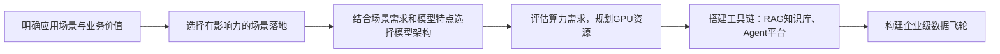
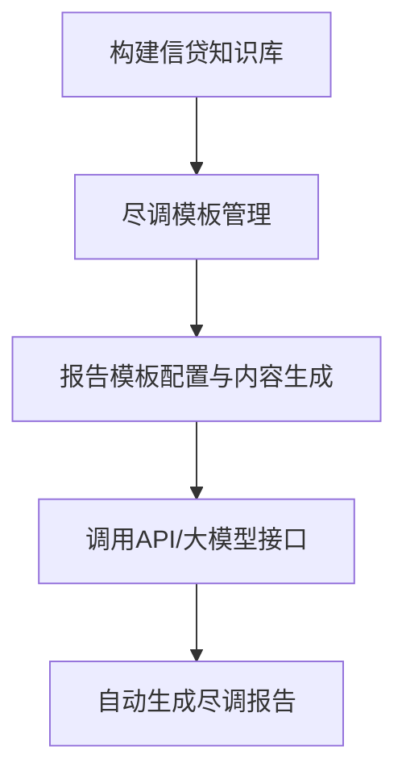

# 《金融行业Agent百景图》章节总结
## 书籍信息
- **书名**：金融行业Agent百景图 (Agent 100 in Financial Industry)
- **作者**：张翅（阿里云智能集团公共云事业部副总裁、新金融行业总经理）
- **PDF状态**：基于文本提取，内容基本完整，存在少量OCR/格式识别偏差
- **OCR状态**：文字识别率较高，图表以占位符形式呈现，部分流程图逻辑可通过文本还原

## 目录说明
- **目录识别情况**：完整识别一级、二级、三级目录结构
- **章节对应依据**：按书中原始页码顺序
- **OCR修复说明**：部分图表无法还原视觉样式，已通过Mermaid逻辑重建；不确定内容已标注

## 全书核心主题
本书系统梳理了金融行业大模型Agent的落地场景与实践案例，覆盖银行、证券、保险三大金融子行业及通用业务领域，共计100余个Agent应用。作者张翅基于阿里云与多家金融机构的合作经验，提出未来企业大模型架构将是MoA（Mixture of Agents）混合架构：一个强大的通用MoE基座模型 + N个中小尺寸领域蒸馏模型 + 工具链（训练推理平台+Agent工厂）+ 数据飞轮。全书强调：大模型Agent正从辅助问答走向复杂业务流程托管，成为金融数字化转型的关键力量。

---

## 前言
### 核心论点
2025年，通用人工智能成为全球科技竞争制高点。DeepSeek开源、Qwen2.5-Max智能跃迁，推动中国力量引领AI革命。杰文斯悖论（效率提升反而刺激更大算力需求）与梅特卡夫定律（开源生态加速创新）共同作用，使金融机构大模型应用从局部试水迈向全场景渗透。作者提出MoA混合架构，并认为未来企业需构建“大尺寸MoE模型+小尺寸蒸馏模型+数据飞轮”的范式。

### 关键事件
- **DeepSeek春节开源革命**：引爆全球大模型开源生态
- **Qwen2.5-Max在ChatbotArena智能跃迁**：中国模型进入世界前列
- **招商银行×阿里云合作**：实现大模型在智能投研、财富管理等高价值环节的专家级推理能力

### 经典金句
> “河海不择细流，故能就其深。” (p.3)
> “未来企业的大模型架构是一个MoA混合架构，即一个强大的通用模型加一个强大的推理模型，作为企业智能基座。” (p.3)

---

## 第一章：金融场景创新的AI时代
### 核心论点
本章讨论：金融行业如何在大模型技术驱动下实现数字化转型？作者观点：数字化转型不是“转不转”的问题，而是必须坚定不移推进。大模型从认知能力（语义理解、逻辑推理）和感知能力（多模态）两个维度突破，配合Agent的规划、记忆、工具、行动四大组件，可应对金融行业信息密集、逻辑严谨、监管严格的要求。

### 关键概念/事件
- **ScalingLaw延伸**：从Pre-Training扩展到Post-Training和Test-Time阶段，强化学习带来新方向
- **开源模型成为世界顶级**：Qwen和DeepSeek推动模型创新和应用创新
- **杰文斯悖论（大模型时代）**：算力应用效率提升反而刺激全社会算力需求增长
- **MoA混合架构**：大尺寸MoE模型 + 小尺寸蒸馏模型 + 数据飞轮

### 逻辑推演
作者首先描述政策背景（中央金融工作会议提出“五篇大文章”）和技术演进（ChatGPT后大模型认知与感知能力跃升）。接着指出单靠大模型难以应对金融复杂场景，必须引入Agent架构（规划、记忆、工具、行动）。然后给出三个典型案例：蚂蚁集团“蚂小财”与“支小助”（普惠金融）、网商银行“大雁系统”（科技金融）、某商业银行养老AI Native APP（养老金融）。最后提出金融机构大模型落地路径：应用价值驱动 → 选择场景 → 模型架构 → 算力规划，并以客服系统为例估算资源需求。展望2025年，金融Agent将从辅助工具升级为重塑业务流程的关键力量。

### 方法流程图（金融机构大模型落地路径）

### 经典金句/数据
> “数字化转型不是纸面上的鸿篇巨制，而是一线工作的针头线脑。” (p.6)
> “截至2024年8月底，‘蚂小财’月度活跃用户数已达7000万人，其中45%来自三线及以下城市。” (p.8)
> “网商银行大雁系统已识别超2100万产业链上下游小微企业，为58万家科创型企业提供信贷额度超千亿元。” (p.9-10)
> “假设某银行1000个坐席，每天约产生25万次大模型推理请求。” (p.12)

---

## 第二章：金融行业 Agent 百景图
### 说明
本章为全书核心，按行业（银行、证券、保险、通用）分类，共收录100余个Agent案例。每个Agent包含概述、需求分析、典型案例、价值分析等模块。以下按目录顺序逐一总结。

## 一、银行

### （一）信贷（8个Agent）

#### 1. 尽调报告生成助手
- **核心论点**：利用大模型自动收集互联网资料、行业分析、行内信息，交互式生成尽调报告，降低客户经理工作量和专业要求。
- **关键概念**：信贷知识库、尽调模板配置、内容自动编排
- **典型案例**：某银行使用Qwen-plus，效率提升2~3倍
- **流程图**（报告生成流程）：

#### 2. 信贷授信方案助手
- **核心论点**：通过大模型理解客户经理问题，RAG检索制度条款和授信要点，自动判断准入条件，提高授信通过率和效率。
- **关键概念**：意图识别、授信知识库、条款判断智能体
- **典型案例**：钉钉机器人助手，效率提升90%以上

#### 3. 交易流水分析助手
- **核心论点**：利用大模型对OCR识别后流水数据进行经营分类分析，自动生成报告，解决各银行流水格式不统一问题。
- **关键概念**：智能匹配流水格式、经营性流水识别、分钟级生成报告
- **典型案例**：Qwen-VL+QwQ-plus，流水分析效率提升90%以上

#### 4. 企业股权/关联分析助手
- **核心论点**：大模型调用搜索引擎获取企业股权和关联信息，自动绘制股权结构图，深度分析实际控制人和关联风险。
- **关键概念**：股东信息Agent、脑图绘制Agent、股权穿透
- **典型案例**：从数小时缩短至几分钟，效率提升90%以上

#### 5. 财务报表分析助手
- **核心论点**：基于大模型提取资产负债表、利润表、现金流量表关键指标，结合历史数据和审计报告，自动生成智能财务分析报告。
- **关键概念**：财报指标抽取、异常分析、事件召回
- **典型案例**：Qwen-VL+QwQ-plus，财报分析效率提升95%以上

#### 6. 行业分析助手
- **核心论点**：集成知识库RAG和互联网搜索，自动生成行业概况、周期性、上下游、政策法规等分析报告，辅助评估借款企业行业风险。
- **关键概念**：行业知识库、多源信息整合
- **典型案例**：从1天缩短至2小时，效率提升75%以上

#### 7. 信审资料查全助手
- **核心论点**：大模型自动检查信贷申请材料的完整性和时效性，比对信贷产品准入条件，推荐合适产品，实现“只跑一次”。
- **关键概念**：材料完备性校验、时效性核验、产品智能匹配
- **典型案例**：初始材料审核环节效率提升80%以上

#### 8. 尽调报告审核助手
- **核心论点**：按照预设量化及非量化指标自动审核尽调报告，生成详细审核意见，帮助审核人员快速定位关键信息和风险点。
- **关键概念**：报告拆解、规则审核智能体、综合评估
- **典型案例**：审批效率提升50%以上

### （二）风控（3个Agent）

#### 1. 信贷进件风控助手
- **核心论点**：多模态大模型识别进件材料内容，通过照片背景识别虚假经营场地，防范骗贷。
- **关键概念**：材料一致性审核、欺诈检测、场地识别
- **典型案例**：Qwen-VL+Qwen-plus，信审员工作量减少30%以上

#### 2. 风控智能助理
- **核心论点**：基于大模型提供风控知识问答、策略分析推理、函数开发、策略生成、智能建模等能力，全面提升风控效率。
- **关键概念**：风险特征挖掘、策略workflow自动生成、智能建模
- **典型案例**：风险特征挖掘效率提升100%，策略配置效率提升200%

#### 3. 生成用户可疑交易报告
- **核心论点**：大模型理解可疑交易特征，通过NL2SQL构建查询获取数据，自动生成反洗钱可疑交易报告。
- **关键概念**：NL2SQL、可疑特征识别、报告自动生成
- **典型案例**：报告生成从1天缩短至1小时，数据获取准确率90%

### （三）AI Native手机银行（4个Agent）

#### 1. APP零售业务助理
- **核心论点**：为手机银行APP提供智能零售客服，支持账单查询、转账、账户管理，通过自然语言对话改善用户体验。
- **关键概念**：意图识别、工具调用、智能推荐
- **典型案例**：Qwen-72B/32B，转人工客服通话量下降50%

#### 2. APP信用卡服务助理
- **核心论点**：专门处理信用卡还款、账单查询、智能问答，简化操作流程。
- **关键概念**：信用卡业务UI组件、多轮对话
- **典型案例**：工具调用准确率95%

#### 3. APP理财业务助理
- **核心论点**：结合客户画像和私域理财产品库，提供个性化产品推荐、理财购买与赎回服务。
- **关键概念**：客户画像分析、智能产品推荐、资配工具
- **典型案例**：会话轮数提升50%

#### 4. APP养老咨询规划
- **核心论点**：面向养老金融场景，提供个人养老金知识问答、投教、规划方案引导，支持语音交互，适老化设计。
- **关键概念**：思维链牵引、养老规划智能体
- **典型案例**：目标感增强提升35%，场景深度增强提升29.6%

---

## 二、证券

### （一）投研（7个Agent）

#### 1. 研报快读
- **核心论点**：将长篇研报转化为长图形式，提取核心观点和图表，配合头图生成，提升传播效率。
- **关键概念**：超长文本理解（Qwen-long）、文生图（万相）、口播稿生成
- **典型案例**：制作周期从2-3周缩短至2-3天

#### 2. 研报观点问答
- **核心论点**：构建研报向量知识库，通过RAG实现语义级检索，快速回答研报相关问题。
- **关键概念**：文档切片与索引、语义检索、LLM生成回答
- **典型案例**：检索效率从1小时缩短至1分钟，准确度达90%

#### 3. 路演解析
- **核心论点**：ASR转写路演视频为文本，大模型进行内容总结、发言人区分、观点提取，提升信息获取效率。
- **关键概念**：语音转文字、会议摘要、问答对抽取
- **典型案例**：关键实体提取准确率95%

#### 4. 行业周报观点
- **核心论点**：整合公开研报、第三方数据、内部观点，自动生成覆盖行业估值、指数、新闻、政策的周报。
- **关键概念**：Chain-of-Mind思维模式、RAG实体化检索
- **典型案例**：从1天缩短至10分钟

#### 5. 日报早评收评
- **核心论点**：每日自动扫描市场资讯，生成早评（开盘前分析）和收评（收盘后复盘），辅助理财师洞察市场。
- **关键概念**：多源扫描、热点事件剖析、资金流向分析
- **典型案例**：从1小时缩短至5分钟

#### 6. 热门事件助手
- **核心论点**：针对事件类问答或新闻链接，快速进行多维度解读，输出各方观点和市场分析。
- **关键概念**：事件检索、多维度拆解、专家意见整合
- **典型案例**：从1小时缩短至5分钟

#### 7. 深度研报写作
- **核心论点**：基于公司积累的研报写作框架，自动从开放/内部信息中提取数据，生成公司深度研报，覆盖长尾个股。
- **关键概念**：Chain-of-Mind思维导图链路、信息归纳筛选、指标图表生成
- **典型案例**：从1周缩短至1小时

### （二）投行（2个Agent）

#### 1. 股权激励助手
- **核心论点**：结合法律法规、市场动态、企业特点，通过RAG+Text2SQL快速生成定制化股权激励方案。
- **关键概念**：业务意图理解、子任务拆分、多模态内容输出
- **典型案例**：从3天缩短至1小时

#### 2. 投行法规解读
- **核心论点**：构建包含现行2500篇、历史8000篇法规的向量知识库，利用RAG进行精准法规问答和解读。
- **关键概念**：多模态大模型预处理（Qwen-VL）、向量知识库、语义检索
- **典型案例**：问答准确率超过85%

### （三）投顾（3个Agent）

#### 1. 投顾资讯简报
- **核心论点**：整合金融数据，结合客户持仓画像，自动生成个性化异动提醒和简报，辅助理财师进行客户陪伴。
- **关键概念**：兴趣匹配（小模型+大模型）、摘要生成、新闻解读
- **典型案例**：推送物料生成从1小时缩短至5分钟

#### 2. 理财产品问答助手
- **核心论点**：整合企业内理财产品信息，通过大模型语义理解精准回答产品说明、投向、收益、风控等问题。
- **关键概念**：意图识别、FAQ匹配、RAG检索生成
- **典型案例**：答案生成准确度达90%

#### 3. 营销优先级判断
- **核心论点**：基于客户对话历史和持仓数据，识别购买意愿和转化概率，为客服标记服务优先级。
- **关键概念**：意图识别、营销时点识别、优先级排序
- **典型案例**：提升高潜客群转化率

### （四）智能运营（2个Agent）

#### 1. 信披报告审核
- **核心论点**：对基金年报、季报等信披材料进行跨文档审核，包括财务勾稽关系校验、语义审核、合同条款比对。
- **关键概念**：信息抽取、稽核校验、智能比对
- **典型案例**：审核准确率99%，效率提升300%

#### 2. 营销物料审核
- **核心论点**：自动检测营销物料中的错别字、敏感词、语义错误、格式问题，确保合规性和品牌一致性。
- **关键概念**：内容审核、格式结构分析、风险评估
- **典型案例**：审核准确率98%，效率提升400%

---

## 三、保险

### （一）产品开发及销售（7个Agent）

#### 1. 保险产品解读
- **核心论点**：将晦涩的保险条款转化为通俗易懂的图文、表格、思维导图混排内容，提升用户理解度和销售效率。
- **关键概念**：条款抽取（版式分析、OCR、图表识别）、个性化解读
- **典型案例**：人工抽取成本从40元/条降至2元/条；制作时间从4小时降至10分钟

#### 2. 条款解析助手
- **核心论点**：利用大模型高效解析保险条款，按核心系统数据结构输出结构化数据，取代人工解读和配置。
- **关键概念**：险种解析模板、文档预处理、字段抽取与校验
- **典型案例**：成本降低20倍，时间从4小时降至10分钟

#### 3. 保险营销创作
- **核心论点**：大模型挖掘创作线索、产品特点、用户画像，自动生成个性化营销文案、海报等素材。
- **关键概念**：创作线索挖掘、产品特征提取、用户画像、合规质检
- **典型案例**：单张海报设计从1天缩短至1小时

#### 4. 保险产品搜索
- **核心论点**：基于大模型语义理解，允许用户使用自然语言搜索保险产品，深度理解结构化与个性化需求。
- **关键概念**：搜索意图推理、多路召回（BM25+向量）、混合排序
- **典型案例**：一次性搜索准确率大幅提升

#### 5. 保险产品推荐
- **核心论点**：引入大语言模型推荐系统，解决冷启动问题，提供可解释的个性化推荐。
- **关键概念**：产品理解与表征、用户理解与表征、多路召回+融合排序
- **典型案例**：提升推荐转换率

#### 6. 保险产品问答
- **核心论点**：将条款、说明书等杂乱材料通过知识加工构建知识库，为销售人员和客户提供精准问答。
- **关键概念**：文档管理、文档解析切分、知识提炼、多路检索召回
- **典型案例**：大幅提升效率，降低成本

#### 7. 保险产品比对
- **核心论点**：快速对多款保险产品进行多维度对比，以表格/图表形式呈现保障范围、保费等差异。
- **关键概念**：自然语言理解、数据提取与处理、可视化对比
- **典型案例**：用户咨询满意度大幅提升，销售转化率提高

### （二）核保核赔（3个Agent）

#### 1. 智能预核保
- **核心论点**：通过大模型驱动对话模式替代传统问卷，收集信息并评估风险，提前判断投保资格，提升转化率。
- **关键概念**：对话问题生成、信息收集整理、核保引擎决策、预核保建议
- **典型案例**：平均时间从20分钟降至5分钟

#### 2. 核赔辅助
- **核心论点**：大模型学习保险条款、保单、索赔信息，结合医学知识图谱，智能判责、识别风险，辅助理赔审核。
- **关键概念**：单据结构化抽取、保险条款知识库、语义审核
- **典型案例**：提升理赔自动化比例15%

#### 3. 智能影像处理
- **核心论点**：利用视觉大模型零样本学习能力，自动分类和提取影像资料（卡证、病历、发票等）信息，无需单独训练。
- **关键概念**：单证图像归类、图像信息提取、图像语义理解
- **典型案例**：预计提升影像件挖掘可利用率60%

### （三）监管合规（3个Agent）

#### 1. 条款智能核验助手
- **核心论点**：基于监管600多条规则，自动核验保险条款合规性，提供修改建议，提升报备效率。
- **关键概念**：构建条款规则库、智能检核、输出核验结果
- **典型案例**：审核效率从1-2周缩短至1天

#### 2. 条款智转助手
- **核心论点**：自动提取条款、费率规章、精算报告内容，按监管要求生成要素表（Excel），并核验内容正确性。
- **关键概念**：材料预处理、信息提取、结构化输出（JSON/Excel）
- **典型案例**：审核效率从1-2周缩短至1天

#### 3. 对外披露审核
- **核心论点**：多模态大模型审核产品详情、广告、推文等对外披露物料，确保符合法规，降低合规风险。
- **关键概念**：规则库（按场景分类）、大模型审核（文本+视觉）、生成审核报告
- **典型案例**：每份材料审核时间从0.5天降至10分钟

---

## 四、通用

### （一）智能客服（14个Agent）

#### 1. 坐席通话质检
- **核心论点**：大模型自动化质检客服通话，识别服务态度、流程合规性、回答准确性，生成质检报告。
- **关键概念**：深度语义理解、上下文感知、自动评分
- **典型案例**：质检准确率95%

#### 2. 意图识别
- **核心论点**：基于历史通话构建意图树，大模型实时识别客户意图，支持多轮上下文、多主题对话。
- **关键概念**：离线意图树生成、在线意图识别
- **典型案例**：意图识别准确率95%

#### 3. 智能语音导航
- **核心论点**：大模型替代传统IVR按键导航，支持自然语言语音指令，理解意图并调用对应工具或转人工。
- **关键概念**：ASR转写、意图识别、槽位提取、工具调用
- **典型案例**：路径选择准确率90%

#### 4. 机器人营销外呼
- **核心论点**：大模型生成个性化话术，识别客户意向与情绪，提升外呼转化率和用户体验。
- **关键概念**：意图树、情绪感知、商机挖掘
- **典型案例**：接通转化率超过3%

#### 5. 机器人催收外呼
- **核心论点**：基于历史催收通话构建意图树，在线识别客户意图，调用不同链路（FAQ、RAG、SOP），同时做合规监察。
- **关键概念**：催收意图树、情感分析、合规监控
- **典型案例**：提高催收成功率

#### 6. 客服知识构建
- **核心论点**：利用大模型自动从文档和对话日志中挖掘FAQ知识点，快速构建和更新客服知识库。
- **关键概念**：自动挖掘FAQ、Agent配置、Prompt设计
- **典型案例**：提升知识更新效率

#### 7. 客服知识问答
- **核心论点**：实时分析客户提问，RAG检索知识库，自动推荐答案或话术，辅助人工坐席。
- **关键概念**：实时文本转换、智能分析、自动总结
- **典型案例**：知识召回率95%

#### 8. 数字人客服
- **核心论点**：以大模型为“大脑”，驱动数字人进行多轮对话，7×24小时服务，集成知识库和API。
- **关键概念**：多模态交互、复杂多轮对话、多渠道接入
- **典型案例**：答案生成准确率90%

#### 9. 人工客服助手
- **核心论点**：检索企业知识库，大模型生成答案或话术润色，提升人工客服知识查找和响应效率。
- **关键概念**：Query改写、知识排序、话术润色
- **典型案例**：答案生成准确率90%

#### 10. App对话机器人
- **核心论点**：大模型增强原有小模型机器人，提升意图识别、多轮对话、上下文理解能力，支持智能推荐和引导。
- **关键概念**：智能回答、智能推荐、智能引导、知识智能运营
- **典型案例**：问答准确率90%以上

#### 11. 智能工单助手
- **核心论点**：基于客服通话记录，自动判断工单类型，提取关键槽位，一键生成工单并写入系统。
- **关键概念**：工单模板分类、槽位提取与拼接
- **典型案例**：工单生成从10-15分钟缩短至1-2分钟

#### 12. 智能投诉预警
- **核心论点**：大模型分析客户通话内容，识别情绪、风险信号，提前预警潜在投诉，并提示客服介入。
- **关键概念**：情绪识别、风险打标、预警生成
- **典型案例**：预警正确率90%

#### 13. 智能语音分析
- **核心论点**：全量质检客服通话录音，通过大模型转写、语义分析、情感分析，生成质量报告和商业洞察。
- **关键概念**：语音转写、质检规则引擎、大数据分析
- **典型案例**：客服话术质检准确率90%

#### 14. 电销助手
- **核心论点**：大模型驱动智能外呼机器人，支持个性化话术、多语言、实时调整策略，筛选意向客户并转人工。
- **关键概念**：用户画像、个性化话术、意向识别
- **典型案例**：营销外呼接通率提升30%

### （二）智能用数（10个Agent）

#### 1. 客户经理绩效助手
- **核心论点**：业务人员通过自然语言对话查询业绩指标、搭建报表，大模型NL2SQL生成查询，辅助归因分析。
- **关键概念**：自然语言问数、自助报表、归因分析
- **典型案例**：意图识别准确率90%以上

#### 2. 智能问数助手
- **核心论点**：对话式数据分析，自动生成数据计算代码、可视化结果，并提炼总结，支持驾驶舱补充问答和波动归因。
- **关键概念**：NL2SQL、数据洞察、波动归因分析
- **典型案例**：数据查询准确率80%以上

#### 3. 智能搭建助手
- **核心论点**：业务人员通过自然语言对话自助生成报表、图表、美化样式，无需BI技能。
- **关键概念**：报表构建指令、多轮确认、自主维护
- **典型案例**：报表构建行动准确率80%以上

#### 4. 数据资产问答
- **核心论点**：整合企业数据资产（表、指标、API、文档等），业务人员通过对话找表、找指标、问使用场景。
- **关键概念**：数据资产知识库、RAG推理、语义检索
- **典型案例**：数据知识回答准确率75%以上

#### 5. 存款分析助手
- **核心论点**：将银行存款经营专家知识编排成Agent流程，自动化分析存款增长、波动、商机，输出标准化报告。
- **关键概念**：客户画像Agent、主账户流出追踪、专家经验固化
- **典型案例**：回答内容采纳率70%以上

#### 6. 贷款分析助手
- **核心论点**：基于贷款专家经验编排Agent，分析贷款业务规模、风险、效益，挖掘潜客，平衡多方目标。
- **关键概念**：客户流水分析Agent、风险收益平衡
- **典型案例**：十余分钟内完成分支行贷款分析

#### 7. 客户经营分析助手
- **核心论点**：汇总客户交易行为、业务结构、波动趋势，构建客户画像，判断潜力和主账户行。
- **关键概念**：客户行为识别Agent、关系圈分析
- **典型案例**：数分钟内完成客户综合分析

#### 8. 小微经营户潜客挖掘
- **核心论点**：从小微企业及零售经营户中挖掘优质潜客，分析交易流水、经营关系圈，输出潜力贷款/理财客户清单。
- **关键概念**：客户交易行为识别、他行主账户推断
- **典型案例**：潜客清单采纳率50%以上

#### 9. 理财潜客挖掘
- **核心论点**：整合客户数据，构建画像，评分筛选潜客，提供个性化投资推荐和话术建议。
- **关键概念**：客户画像、产品匹配、服务话术生成
- **典型案例**：筛选出10%增量高质潜客

#### 10. 代发户促活助手
- **核心论点**：分析代发客群画像，结合银行产品库和过往活动方案，定制营销策略，生成海报等素材，提升主账户转化。
- **关键概念**：ReAct范式、营销方案生成、素材生成
- **典型案例**：潜客清单采纳率50%以上

### （三）知识助手（3个Agent）

#### 1. 知识问答
- **核心论点**：基于RAG架构，解析非结构化文档（PDF/Word/扫描件），建立向量知识库，提供精准语义问答。
- **关键概念**：文档解析（OCR+版式识别）、向量化、检索增强生成
- **典型案例**：问答准确率90%

#### 2. 复杂信息抽取
- **核心论点**：多模态大模型+小模型双路校验，从合同、信披、尽调报告等复杂文档中抽取关键信息，支持可视化配置。
- **关键概念**：版面识别、实体抽取、分类、问答
- **典型案例**：复杂信息提取准确率90%

#### 3. 智能写作
- **核心论点**：连接多种数据源，自动提取财务数据，按模板生成募集说明书、债券存续期报告等专业文档。
- **关键概念**：AI语义理解、公式计算、数据更新、溯源定位
- **典型案例**：撰写时间缩短70%-80%

### （四）研发助手（6个Agent）

#### 1. AI程序员
- **核心论点**：具备多文件代码修改和工具使用能力，可完成从需求理解、任务拆解、编码、测试到修复的全链路开发。
- **关键概念**：多文件编辑、工具使用、自我反思迭代
- **典型案例**：开发效率提升30%以上

#### 2. 需求助手
- **核心论点**：大模型理解非结构化需求文档，提取关键信息，条目化需求，自动生成业务流程图，促进业务与技术沟通。
- **关键概念**：需求理解、需求知识库检索、条目化、流程图生成
- **典型案例**：需求文档编写效率提升80%以上

#### 3. 编码助手
- **核心论点**：行级/函数级代码续写、自然语言生成代码、单元测试、代码优化、注释生成、研发问答。
- **关键概念**：跨文件上下文感知、IDE原生集成
- **典型案例**：代码采纳率30%左右

#### 4. 单元测试生成助手
- **核心论点**：根据选中的函数，自动生成单元测试用例，支持多种测试框架。
- **关键概念**：测试框架识别、用例生成、追问优化
- **典型案例**：单元测试覆盖度超过70%

#### 5. 测试用例生成助手
- **核心论点**：基于需求文档，结合历史测试资产库，自动生成测试大纲和场景化测试用例。
- **关键概念**：需求切片、要素提取、测试知识库
- **典型案例**：测试用例生成效率提升80%以上

#### 6. 智能运维助手
- **核心论点**：汇总运维文档构建知识库，支持意图识别、故障诊断、运维问答，沉淀诊断工作流。
- **关键概念**：运维知识库、故障诊断智能体、统一运维界面
- **典型案例**：运维知识查询和处理效率提升80%以上

### （五）数字人（4个Agent）

#### 1. 交互取证提额
- **核心论点**：数字人通过视频交互引导客户提交资产证明，大模型识别证件、评估风险，自动化提额。
- **关键概念**：视频拆帧、多模态识别、流程自动化
- **典型案例**：证件要素提取准确率95%

#### 2. 视频交互陪练
- **核心论点**：数字人模拟客户场景，大模型生成个性化提问和评分，帮助业务人员实战演练。
- **关键概念**：考题生成、角色扮演、实时评分
- **典型案例**：评分准确率98%

#### 3. 直播交互
- **核心论点**：数字人主播7×24小时直播，大模型驱动实时问答、多语言翻译、情感表达，降本增效。
- **关键概念**：脚本自动生成、情感识别、跨文化适配
- **典型案例**：考题生成准确率90%

#### 4. 视频分享
- **核心论点**：大模型+数字人生成个性化营销视频，快速制作股评、产品介绍等内容，用于私域引流。
- **关键概念**：脚本生成、视觉内容生成、用户数据定制
- **典型案例**：降低制作成本和时间

### （六）内容审核（3个Agent）

#### 1. 内容安全审核
- **核心论点**：多模态大模型审核视频、图片、文本物料，按通用/营销/业绩回顾等规则自动审核，提升效率。
- **关键概念**：异构数据预处理（视频截帧、音频转写）、规则提示词、多模态审核
- **典型案例**：提高审核效率50%

#### 2. 制度撰写
- **核心论点**：自动解析新颁布法规，分析对内部制度的影响，生成修订或废止建议，智能撰写合规制度。
- **关键概念**：存量法规制度分析、增量法规分析、语义匹配、制度生成
- **典型案例**：合规制度撰写效率提升50%

#### 3. 合规问答
- **核心论点**：构建法规制度知识库，大模型RAG提供准确合规问答，降低违规风险。
- **关键概念**：法规制度向量库、语义相似度匹配、答案生成
- **典型案例**：合规知识召回准确率90%

### （七）信息检索与打标（5个Agent）

#### 1. 企业工商信息打标
- **核心论点**：大模型从经营范围文本中提取产品和服务，结构化输出，用于建立企业信用档案。
- **关键概念**：语义理解、自动拆分、标准化输出
- **典型案例**：关键实体提取准确率95%

#### 2. 可信搜索
- **核心论点**：集成权威网站（人民网、巨潮资讯等），为金融大模型提供实时、可信的互联网信息，提升问答时效性和准确性。
- **关键概念**：Query改写、搜索条件优化、结果精排、流式接口
- **典型案例**：查询结果准确性90%

#### 3. 企业招投标信息打标
- **核心论点**：大模型从招投标文档中提取公司名称、项目名称、截止日期、预算金额等关键信息，并按行业/地区分类。
- **关键概念**：句子级/段落级信息抽取、多维度分类
- **典型案例**：内容提取准确率92%

#### 4. 企业知识产权信息打标
- **核心论点**：大模型从专利、商标、版权信息中提取关键字段（专利号、申请日期、发明人），结构化打标。
- **关键概念**：数据清洗、语义识别、业务定向微调
- **典型案例**：内容提取准确率92%

#### 5. 财报解析
- **核心论点**：多模态大模型识别财报中的文字、表格、图表，自动抽取利润表、资产负债表等关键数据，标准化输出。
- **关键概念**：实体识别与关系抽取、数据标准化、语义理解（MD&A分析）
- **典型案例**：快速解析和比较大量财报

### （八）培训陪练（5个Agent）

#### 1. 交互式培训助手
- **核心论点**：大模型自动出题、角色扮演，模拟真实工作场景，学员对话交互，实时评价反馈。
- **关键概念**：多场景人设Agent、自动出题、实时建议
- **典型案例**：培训考题生成效率提升100%

#### 2. 课件生成助手
- **核心论点**：多模态大模型从视频、PPT、图片中提取知识，自动生成文本课件，并可调用外部工具生成多媒体课件。
- **关键概念**：多源异构信息提取、结构化知识、Function Calling
- **典型案例**：课件生成从周级别降至分钟级

#### 3. 对练机器人
- **核心论点**：模拟客户人设，客户经理与对练机器人对话，教练Agent实时评价并给出建议，提升营销话术。
- **关键概念**：场景知识库、模拟人设Agent、教练评价Agent
- **典型案例**：扮演20+不同类型角色

#### 4. 智能培训问答助手
- **核心论点**：基于大模型构建培训知识库，学员以自然语言提问，快速获取课程内容答案，支持权限隔离。
- **关键概念**：多模态文档处理、意图识别agent、RAG向量化
- **典型案例**：学员获取知识效率提升300%

#### 5. 智能考试助手
- **核心论点**：大模型自动出题、智能组卷、自动阅卷（含主观题），提升考试全流程效率。
- **关键概念**：智能出题、个性化组卷、客观一致评分
- **典型案例**：学员考试效率提升200%

### （九）办公助手（4个Agent）

#### 1. 工作报告助手
- **核心论点**：大模型基于公文专家数据集，提供智能审校（政治/知识/基础差错）、智能排版、智能写作、智能检索，辅助生成工作总结、公文。
- **关键概念**：公文专家数据、智能审校引擎、排版、续写/改写/扩写
- **典型案例**：撰写时间从2天缩短至2小时

#### 2. OA小蜜
- **核心论点**：大模型理解员工关于IT、行政、HR的问题，调用内部系统API，自动完成任务（如设备更换查询、会议室预定、福利政策解答）。
- **关键概念**：意图识别、私域openAPI调用、定期知识挖掘
- **典型案例**：工具调用准确率95%

#### 3. 智能会议助手
- **核心论点**：ASR转写会议录音，大模型生成会议纪要、摘要、待办事项，支持语义搜索和章节速览。
- **关键概念**：发言角色区分、要点回顾、PPT提取
- **典型案例**：会议后信息处理效率提升60%

#### 4. 流程助手
- **核心论点**：员工通过自然语言对话发起业务流程、填写表单，大模型理解意图并调用对应API，盘活企业知识资产。
- **关键概念**：意图识别、场景编排、Function calling
- **典型案例**：API调用准确率90%

### （十）营销助手（4个Agent）

#### 1. 营销策划助手
- **核心论点**：大模型生成营销创意、营销方案（含主题、目标、策略、预算、风险预案）、思维导图，提升策划效率。
- **关键概念**：创意生成、方案生成、思维导图生成
- **典型案例**：提升营销人员准备效率50%

#### 2. 营销素材生成
- **核心论点**：大模型根据营销场景自动生成文本、图像、视频素材，并适配多渠道（邮件、短信、APP、社交媒体）。
- **关键概念**：智能推荐素材风格、多渠道适配、合规检查
- **典型案例**：设计师画图效率从1天到1小时

#### 3. 营销文案生成
- **核心论点**：针对不同渠道（小红书、抖音、微信）和产品特点，生成个性化、合规的营销文案。
- **关键概念**：多语言支持、风格匹配、法规遵从检查
- **典型案例**：准备文案效率提升100%

#### 4. 社群运营助手
- **核心论点**：事前自动生成运营计划，事中实时推荐话术，事后客户标签化分析并沉淀优秀案例。
- **关键概念**：运营计划生成、关键客户识别、案例总结
- **典型案例**：提升私域运营人员效率50%

---

## 第三章：结语
### 核心论点
Grok向左、DeepSeek向右；通用模型向前、推理模型向后。算力堆砌、极致工程优化、算法创新、高质量数据共同推动模型能力提升。Scaling Law从Pre-Training扩展至Post-Training和Test-Time。技术进步带来的推理成本下降和开源带来的技术平权，使金融机构能以更低成本使用更强模型。杰文斯悖论与梅特卡夫定律将促进生成式AI更好地融入金融行业，推动人类社会迈向更高层次的智能时代。

### 经典金句
> “杰文斯悖论与梅特卡夫定律的双重作用，将促进生成式人工智能技术更好地融入金融行业，在助力金融行业高质量发展的同时，也必将推动人类社会迈向更高层次的智能时代。” (p.211)

---

## 第四章：附录
### 内容说明
附录为全书Agent索引表格，按行业（银行、证券、保险、通用）、一级分类、二级分类、页次列出。因原书附录为表格形式，此处不再重复绘制，直接引用章节结构即可。实际页码请参考原书。

---

> 说明：本书所有流程图、架构图均基于文本描述重建为Mermaid格式，部分图表因OCR识别不完整，已尽量还原逻辑关系。若与实际图示有出入，以原书为准。