# 《锋利的jQuery》章节总结

## 书籍信息
- **书名**：锋利的jQuery
- **作者**：单东林、张晓菲、魏然（根据书籍内容推断）
- **PDF状态**：扫描版PDF，包含完整的前6章内容
- **OCR状态**：已进行OCR识别，部分页码存在识别错位，但整体内容可读

## 目录说明
- **目录识别情况**：PDF中未提供独立目录页，根据正文章节标题识别出前6章的完整结构
- **章节对应依据**：依据正文中的章标题（如“第1章 认识jQuery”）进行划分
- **OCR修复说明**：部分页面存在文字识别问题，已基于上下文进行合理整理

## 全书核心主题
本书系统介绍jQuery这一主流JavaScript库的使用方法、核心特性和实际应用。全书从jQuery的基本概念入手，逐步深入到选择器、DOM操作、事件处理、动画效果、表单表格操作以及Ajax应用等核心内容。作者强调“写得少，做得多”（write less, do more）的jQuery理念，通过大量实例展示如何用简洁的代码实现复杂的网页交互效果。本书适合JavaScript初学者和有一定经验的开发人员阅读，旨在帮助读者快速掌握jQuery并应用于实际项目开发。

---

## 第1章：认识jQuery

### 核心论点
本章主要解决“为什么要学习和使用jQuery”的问题。作者认为：jQuery凭借其简洁的语法、强大的选择器、出色的DOM操作封装和完善的兼容性，已经成为Web开发人员的最佳选择。

### 关键概念/事件
- **JavaScript库**：封装了预定义对象和实用函数的工具集，用于简化JavaScript开发，兼容各大浏览器。
- **jQuery**：由John Resig于2006年1月创建的开源项目，强调“写得少，做得多”的理念。
- **链式操作**：jQuery最有特色的操作方式，对同一个jQuery对象的一组动作可以直接连写，无需重复获取对象。
- **隐式迭代**：jQuery方法自动操作对象集合，无需手动循环遍历每个返回的元素。
- **jQuery对象与DOM对象**：jQuery对象是通过jQuery包装DOM对象后产生的对象，两者方法不通用但可以相互转换。

### 逻辑推演/叙事脉络
本章从JavaScript的发展历程切入，指出JavaScript存在DOM复杂、浏览器实现不一致、缺乏开发工具等弊端。随后介绍Ajax技术的兴起使JavaScript重新受到重视。接着对比了Prototype、Dojo、YUI、Ext JS、MooTools等主流JavaScript库的优缺点，通过Google访问量趋势图说明jQuery关注度持续上升。然后详细介绍jQuery的优势（轻量级、强大选择器、出色DOM封装、可靠事件处理、完善Ajax、不污染顶级变量、浏览器兼容性好、链式操作、隐式迭代、行为与结构分离、丰富插件、完善文档、开源），并配置开发环境、编写第一个jQuery程序。最后重点讲解jQuery对象与DOM对象的区别与转换，以及解决jQuery与其他库冲突的方法。

### 流程图

#### jQuery学习路径图
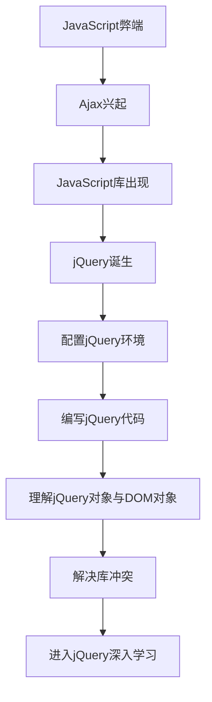

#### jQuery对象与DOM对象转换图
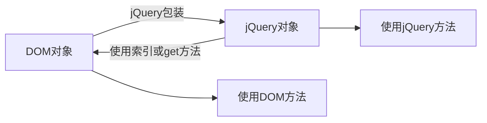

### 经典金句/数据
> “jQuery强调的理念是写得少，做得多(write less, do more)。”(p.5)

> “jQuery非常轻巧，采用Dean Edwards编写的Packer压缩后，大小不到30KB。如果使用Min版并且在服务器端启用Gzip压缩后，大小只有18KB。”(p.5)

> “jQuery只建立一个名为jQuery的对象，其所有的函数方法都在这个对象之下。其别名$也可以随时交出控制权，绝对不会污染其他的对象。”(p.5)

> “在jQuery库中，$就是jQuery的一个简写形式，例如$("#foo")和jQuery("#foo")是等价的。”(p.8)

---

## 第2章：jQuery选择器

### 核心论点
本章主要解决“如何快速、准确地获取页面中的DOM元素”的问题。作者认为：选择器是jQuery的根基，熟练掌握选择器不仅能简化代码，还能达到事半功倍的效果。

### 关键概念/事件
- **CSS选择器**：用于为特定HTML元素添加样式的表现规则，包括标签选择器、ID选择器、类选择器、群组选择器、后代选择器等。
- **jQuery选择器**：完全继承CSS风格，能快速找出特定DOM元素并为其添加行为，无需担心浏览器兼容性。
- **基本选择器**：通过元素id、class和标签名等查找DOM元素，包括#id、.class、element、*和群组选择器。
- **层次选择器**：通过DOM元素之间的层次关系获取元素，包括后代选择器、子选择器、相邻选择器、同辈选择器。
- **过滤选择器**：以“:”开头，对基本选择器获取的元素集合进行过滤，包括基本过滤、内容过滤、可见性过滤、属性过滤、子元素过滤等。
- **表单选择器**：专门用于操作表单元素，包括:input、:text、:password、:radio、:checkbox、:submit等。

### 逻辑推演/叙事脉络
本章首先通过三个传统JavaScript例子（给所有p元素添加click事件、改变不同id元素样式、输出选中多选框个数）展示传统方法的冗长，引出jQuery选择器的简洁性。然后介绍CSS选择器的基础知识，说明jQuery选择器与CSS选择器的相似性。接着详细分类讲解基本选择器、层次选择器、过滤选择器（基本过滤、内容过滤、可见性过滤、属性过滤、子元素过滤、表单对象属性过滤）和表单选择器，每类都配有示例代码和效果图。之后通过“某网站品牌列表效果”案例（品牌精简/全部显示切换、高亮推荐品牌）综合运用所学选择器。最后指出选择器使用的注意事项（特殊字符转义、空格影响等）。

### 流程图

#### jQuery选择器分类图
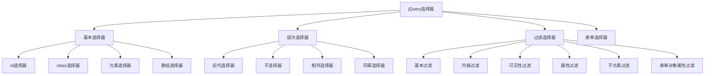

#### 品牌列表效果实现流程
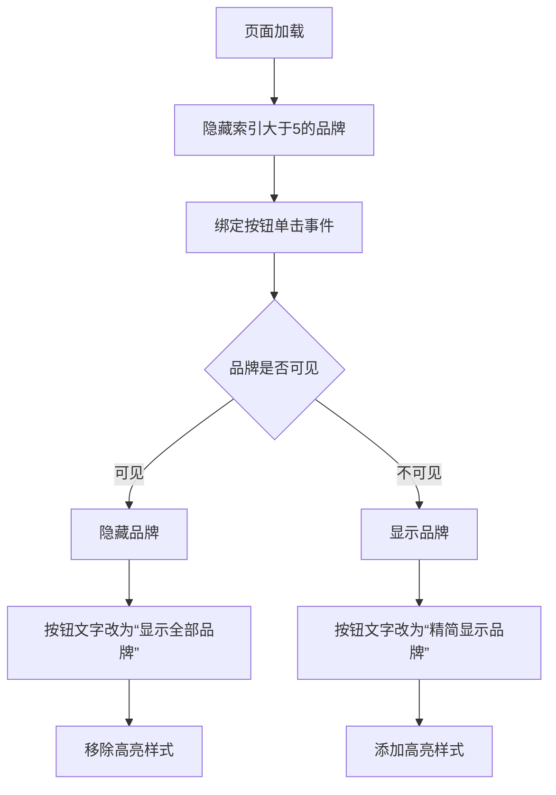

### 经典金句/数据
> “选择器是jQuery的根基，在jQuery中，对事件处理、遍历DOM和Ajax操作都依赖于选择器。”(p.26)

> “jQuery中的选择器完全继承了CSS的风格。利用jQuery选择器，可以非常便捷和快速地找出特定的DOM元素，然后为它们添加相应的行为，而无需担心浏览器是否支持这一选择器。”(p.28)

> “$("#tt")获取的永远是对象，即使网页上没有此元素。”(p.31)

> “选择器中的空格也是不容忽视的，多一个空格或少一个空格也许会得到截然不同的结果。”(p.53)

---

## 第3章：jQuery中的DOM操作

### 核心论点
本章主要解决“如何动态创建、修改、删除和替换页面中的DOM元素”的问题。作者认为：jQuery继承并发扬了JavaScript对DOM对象的操作特性，使开发人员能方便地操作DOM对象。

### 关键概念/事件
- **DOM Core**：DOM的核心规范，不专属于JavaScript，可用于处理任何标记语言文档，如getElementById()、getAttribute()、setAttribute()等。
- **HTML DOM**：专属于HTML的DOM规范，提供更简明的记号描述HTML元素属性，如document.forms、element.src等。
- **CSS DOM**：针对CSS的操作，主要作用是获取和设置style对象的各种属性。
- **节点操作**：包括查找节点、创建节点、插入节点、删除节点、复制节点、替换节点、包裹节点等。
- **属性操作**：使用attr()方法获取和设置元素属性，removeAttr()方法删除属性。
- **样式操作**：包括获取样式、设置样式、追加样式(addClass)、移除样式(removeClass)、切换样式(toggleClass)等。

### 逻辑推演/叙事脉络
本章首先介绍DOM操作的三大分类（DOM Core、HTML-DOM、CSS-DOM），然后构建一棵DOM树作为操作对象。接着详细讲解查找节点（元素节点、属性节点）、创建节点（元素、文本、属性）、插入节点（append、prepend、after、before等）、删除节点（remove、empty）、复制节点（clone）、替换节点（replaceWith/replaceAll）、包裹节点（wrap/wrapAll/wrapInner）。之后讲解属性操作、样式操作（获取、设置、追加、移除、切换、判断）、HTML/文本/值的设置与获取（html/text/val）。再讲解遍历节点方法（children、next、prev、siblings、closest等）和CSS-DOM操作（css、offset、position、scrollTop/Left）。最后通过“超链接和图片提示效果”案例综合运用DOM操作。

### 流程图

#### DOM操作分类图
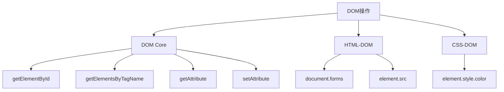

#### 节点操作方法分类
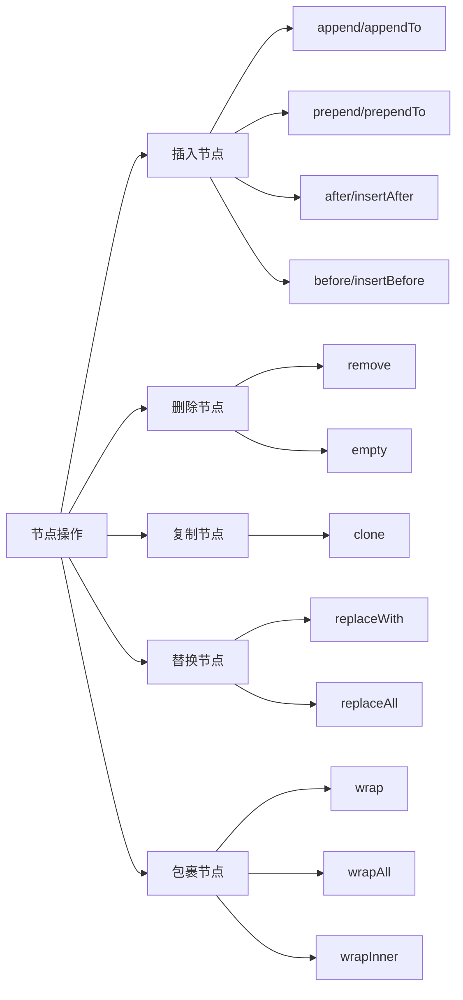

#### 图片提示效果实现流程
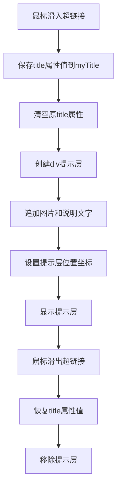

### 经典金句/数据
> “DOM是Document Object Model的缩写，意思是文档对象模型。DOM是一种与浏览器、平台、语言无关的接口。”(p.63)

> “jQuery作为JavaScript库，继承并发扬了JavaScript对DOM对象的操作的特性，使开发人员能方便地操作DOM对象。”(p.64)

> “在clone()方法中传递了一个参数true，它的含义是复制元素的同时复制元素中所绑定的事件。”(p.73-74)

> “html()方法类似于JavaScript中的innerHTML属性，text()方法类似于JavaScript中的innerText属性，val()方法类似于JavaScript中的value属性。”(p.81-83)

---

## 第4章：jQuery中的事件和动画

### 核心论点
本章主要解决“如何让网页对用户操作做出响应并产生动态视觉效果”的问题。作者认为：jQuery增加并扩展了基本的事件处理机制，提供了更加优雅的事件处理语法和强大的动画能力。

### 关键概念/事件
- **$(document).ready()**：在DOM载入就绪时就执行绑定的函数，与window.onload的区别在于执行时机更早，且可以多次使用。
- **bind()方法**：为匹配元素绑定特定事件，事件类型包括click、mouseover、mouseout、focus、blur等。
- **合成事件**：jQuery自定义的事件，包括hover()（模拟光标悬停）和toggle()（模拟连续单击）。
- **事件冒泡**：事件按照DOM层次结构从内到外依次触发，可以使用stopPropagation()停止冒泡。
- **动画方法**：包括show/hide（同时修改高度、宽度、不透明度）、fadeIn/fadeOut（只改不透明度）、slideUp/slideDown（只改高度）、animate（自定义动画）。
- **动画队列**：多个动画方法以链式写法应用时，动画按照顺序依次执行。

### 逻辑推演/叙事脉络
本章上半部分讲解jQuery事件机制。首先对比$(document).ready()与window.onload的区别（执行时机、多次使用、简写方式）。然后讲解事件绑定bind()方法的使用，包括基本效果、加强效果（显示/隐藏切换）、改变事件类型。接着介绍hover()和toggle()两个合成事件，并通过“标题内容切换”案例展示toggle()的妙用。之后深入讲解事件冒泡的概念、引发的问题及解决方法（stopPropagation、preventDefault、return false），并介绍事件对象的常用属性。最后讲解移除事件unbind()、模拟操作trigger()和bind()的其他用法。

下半部分讲解动画效果。从最基本的show/hide方法开始，引入速度参数让元素动起来。然后依次介绍fadeIn/fadeOut（淡入淡出）、slideUp/slideDown（上下滑动）等特效动画。重点讲解自定义动画animate()方法，包括简单动画、累加累减、多重动画（同时执行/按顺序执行）、综合动画。之后介绍动画回调函数解决非动画方法插队问题、stop()方法停止动画、is(“:animated”)判断动画状态。最后通过“视频展示效果”案例综合运用事件和动画。

### 流程图

#### 事件冒泡过程图
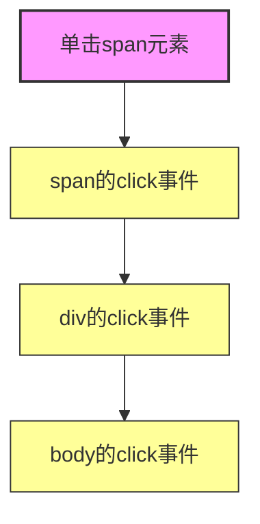

#### 动画方法分类图
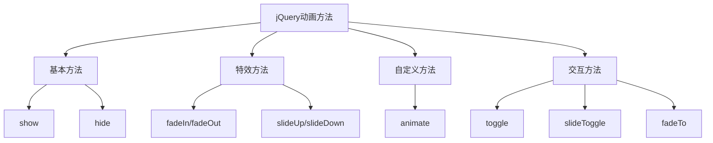

#### 视频展示效果实现流程
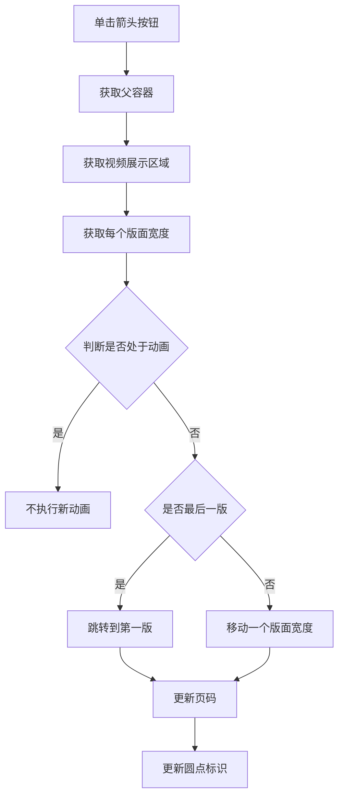

### 经典金句/数据
> “$(document).ready()方法是事件模块中最重要的一个函数，可以极大地提高Web应用程序的响应速度。”(p.100)

> “jQuery提供了stopPropagation()方法来停止事件冒泡。”(p.112)

> “jQuery提供了preventDefault()方法来阻止元素的默认行为。”(p.113)

> “jQuery强调的理念是‘write less, do more’（写得更少，做得更多）。”(p.121)

> “stop()方法会结束当前正在进行的动画，并立即执行队列中的下一个动画。”(p.130)

---

## 第5章：jQuery对表单、表格的操作及更多应用

### 核心论点
本章主要解决“如何用jQuery美化表单和表格交互体验”的问题。作者认为：通过jQuery可以极大提升表单和表格的用户体验，使表单验证更即时、表格操作更灵活。

### 关键概念/事件
- **表单验证**：在客户端对用户输入进行即时校验，提升操作体验，包括必填项校验、格式校验等。
- **复选框全选/反选**：通过控制checked属性实现复选框的全选、全不选、反选等操作，可与“全选”复选框联动。
- **表格隔行变色**：使用:odd和:even选择器为表格奇数行和偶数行分别添加样式，提升可读性。
- **表格行高亮**：单击表格行时高亮显示当前行，同时选中该行内的单选框/复选框。
- **网页选项卡**：通过隐藏和显示不同的内容区域，实现选项卡切换效果。
- **网页换肤**：通过动态切换样式表文件实现皮肤更换，并使用Cookie保存用户选择。

### 逻辑推演/叙事脉络
本章分三大部分讲解表单、表格和其他应用。表单部分：首先讲解单行文本框的焦点/失焦样式变化（弥补IE6不支持:focus伪类）；然后讲解多行文本框的高度变化和滚动条控制；接着讲解复选框的全选、全不选、反选操作以及与“全选”复选框的联动；再讲解下拉框的双向选择（选中添加、全部添加、双击添加）；最后完成一个完整的表单验证案例（必填标识、即时验证、阻止提交）。表格部分：讲解表格隔行变色、单选框/复选框控制表格行高亮、表格展开关闭（分类收缩）、表格内容筛选（根据输入文本实时筛选）。其他应用：讲解网页字体大小控制、网页选项卡制作、网页换肤（切换样式表+保存Cookie）。

### 流程图

#### 复选框全选联动流程
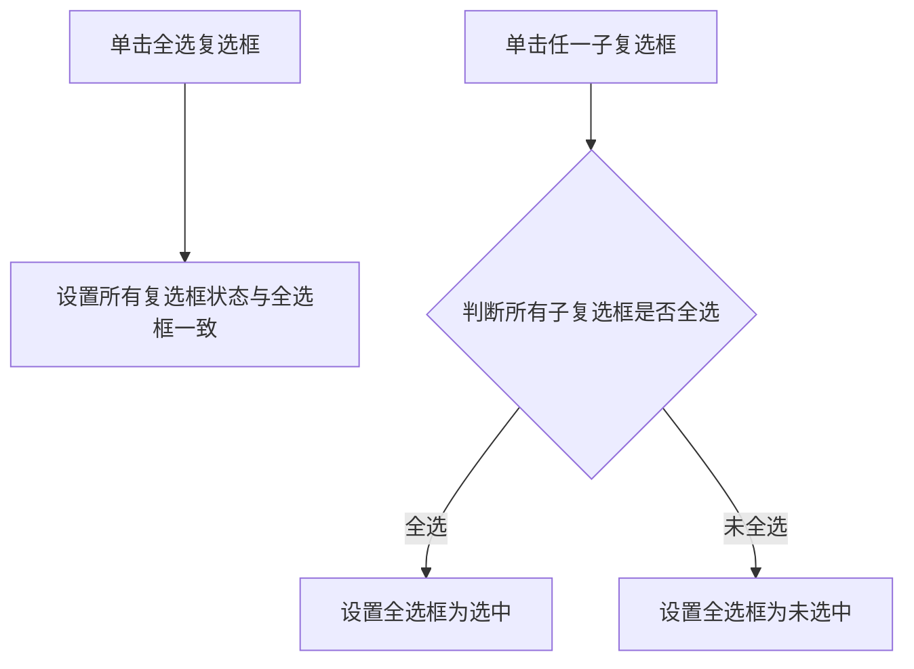

#### 表单验证实现流程
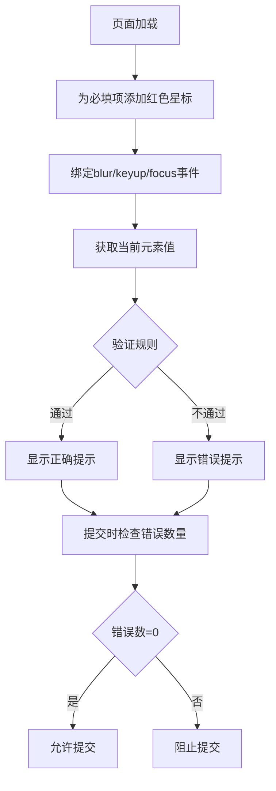

#### 网页换肤实现流程
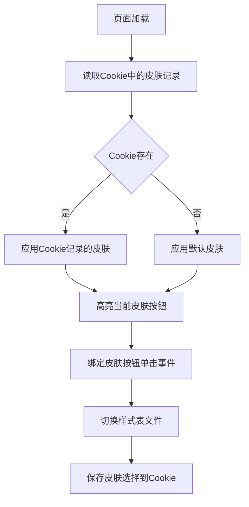

### 经典金句/数据
> “客户端验证仅用于提升用户操作体验，而服务器端仍需对用户输入的数据的合法性进行校验。”(p.157)

> “在CSS技术之前，网页的布局基本都是依靠表格制作，当有了CSS之后，表格就被很多设计师所抛弃。但在进行网页布局时不能盲目地抛弃表格，在该用表格的时候，还要用表格。”(p.157-158)

> “网页换肤的原理就是通过调用不同的样式表文件来实现不同皮肤的切换，并且需要将换好的皮肤记入Cookie中，这样用户下次访问时，就可以显示用户自定义的皮肤了。”(p.170)

---

## 第6章：jQuery与Ajax的应用

### 核心论点
本章主要解决“如何用jQuery简化Ajax异步数据交互”的问题。作者认为：jQuery将Ajax操作封装到简洁的API中，使开发者能专注业务逻辑而无需关心浏览器兼容性和XMLHttpRequest对象的复杂细节。

### 关键概念/事件
- **Ajax**：Asynchronous JavaScript and XML的缩写，有机利用一系列交互式网页应用相关技术，实现无刷新更新页面。
- **XMLHttpRequest对象**：Ajax的核心，负责发送异步请求、接收响应及执行回调。
- **load()方法**：最简的Ajax方法，载入远程HTML代码并插入DOM中，可筛选载入内容。
- **$.get()/$.post()方法**：分别使用GET和POST方式进行异步请求，支持HTML片段、XML文档、JSON文件等返回格式。
- **$.getScript()/$.getJSON()方法**：专门用于加载.js文件和.json文件。
- **$.ajax()方法**：jQuery最底层的Ajax实现，可配置请求类型、超时、回调函数（beforeSend、success、error、complete）等。
- **序列化方法**：serialize()将表单元素序列化为字符串，serializeArray()返回JSON格式，$.param()是核心序列化方法。
- **Ajax全局事件**：ajaxStart、ajaxStop、ajaxComplete、ajaxError等，用于统一处理Ajax请求过程中的提示和反馈。

### 逻辑推演/叙事脉络
本章首先介绍Ajax的优势（无需插件、优秀用户体验、提高性能、减轻服务器负担）和不足（浏览器支持度、破坏前进后退、搜索引擎支持不足、缺乏调试工具）。然后介绍XMLHttpRequest对象和Web环境AppServ的安装配置。接着用传统JavaScript实现第一个Ajax例子（取回“Hello Ajax!”字符串），展示XMLHttpRequest对象的繁琐操作，引出jQuery的简洁方案。之后详细讲解jQuery中的Ajax方法：load()方法载入HTML、筛选载入内容；$.get()/$.post()方法及三种返回格式对比（HTML片段、XML文档、JSON文件）；$.getScript()和$.getJSON()方法（含跨域JSONP调用Flickr API）。然后讲解$.ajax()底层方法的常用参数。最后讲解序列化方法（serialize、serializeArray、$.param）和Ajax全局事件（ajaxStart/ajaxStop显示“加载中”提示），并以“Ajax聊天室程序”作为综合案例。

### 流程图

#### Ajax与传统Web模式对比
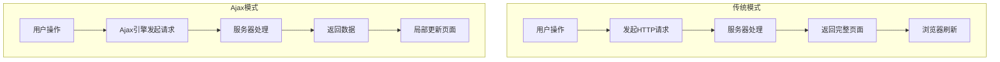

#### $.ajax()方法回调流程
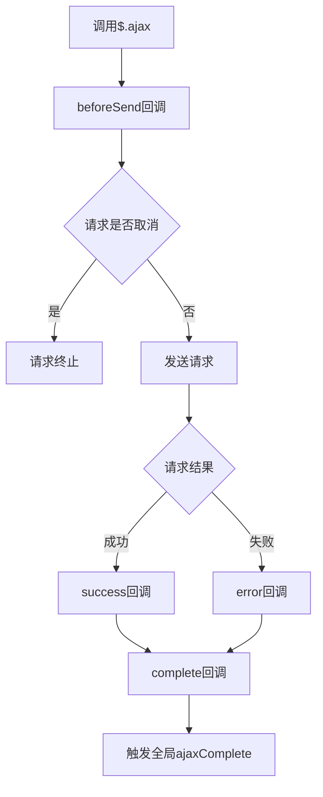

#### Ajax聊天室工作流程
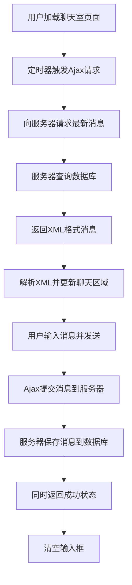

#### 三种返回数据格式对比
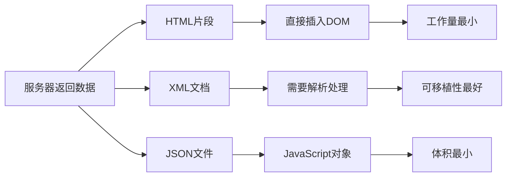

### 经典金句/数据
> “Ajax全称为‘Asynchronous JavaScript and XML’（异步JavaScript和XML），它并不是指一种单一的技术，而是有机地利用了一系列交互式网页应用相关的技术所形成的结合体。”(p.175)

> “jQuery将所有的Ajax操作封装到一个函数$.ajax()里，使得开发者处理Ajax的时候能够专心处理业务逻辑而无需关心复杂的浏览器兼容性和XMLHttpRequest对象的创建和使用的问题。”(p.5)

> “在不需要与其他应用程序共享数据的时候，使用HTML片段来提供返回数据一般来说是最简单的；如果数据需要重用，那么JSON文件是不错的选择；而当远程应用程序未知时，XML文档是明智的选择。”(p.187)

> “JSONP是一种可以绕过同源策略的方法，即通过使用JSON与<script>标记相结合的方法，从服务器端直接返回可执行的JavaScript函数调用或者JavaScript对象。”(p.192)

---

> **说明**：由于PDF文件仅包含前6章完整内容（第7章及后续章节、附录在提供的文件中不完整或缺失），以上总结基于可见的1-6章内容进行整理。