# 《零基础开发AI Agent——手把手教你用扣子做智能体》章节总结

## 书籍信息
- **书名**：零基础开发AI Agent——手把手教你用扣子做智能体
- **作者**：叶涛 管错 张心雨 著
- **PDF状态**：基于OCR识别文本，内容完整但存在少量扫描识别误差（如个别错字、乱码）。
- **OCR状态**：已基本恢复可读文本，部分图表需手动重建。

## 目录说明
- 目录识别情况：完整识别原书目录结构，分为“入门篇”“工具箱篇”“实战篇”三大部分，共11章。
- 章节对应依据：严格按原书页码顺序（第1-13页为封面、推荐序、前言、目录；第14页起为正文）。
- OCR修复说明：部分页面存在“无的编程”等排版错误，已基于上下文语义修正；个别流程图符号缺失，用Mermaid重建逻辑关系。

## 全书核心主题
本书系统介绍了AI Agent（智能体）的概念、发展、价值，以及零基础开发Agent的方法。作者强调：Agent是大模型落地的重要方向，其核心能力包括规划、记忆、使用工具和行动。通过扣子（Coze）等可视化开发平台，即使不懂编程也能快速搭建专业Agent。全书围绕5大应用场景（专业分析、角色扮演、知识问答、内容营销、效率办公）提供了11个完整案例，手把手教学。核心理念是：懂场景和业务比懂技术更重要；坚持小而美，将Agent作为助手而非完全托管的解决方案。

---

## 推荐序
### 核心论点
推荐人杨芳贤（53AI创始人）指出：AI Agent是推动企业高效运营与创新的引擎。本书为非技术出身的读者提供了简单、易用的开发方法，从原理到实操，以扣子平台为载体，覆盖插件配置、工作流设计、知识库管理等核心技术，并通过大量案例展现Agent在个人提效和企业降本增效中的巨大潜力。

### 经典金句
> “本书为非技术出身的读者开发与应用AI Agent提供了简单、易用的方法。” (p.4)
> “本书为AI技术服务行业从业者、技术爱好者及所有希望了解大模型应用的读者，搭建了一座从理论到实践的桥梁。” (p.5)

---

## 前言
### 核心论点
作者阐述写作背景：截至2024年10月，我国大模型注册用户超6亿，但如何将大模型应用到具体业务场景仍是难题。Agent应运而生，成为AI落地的重要方向。扣子等平台实现了零代码可视化开发，但功能丰富导致初学者有难度。本书旨在提供系统、快捷、实用的学习路径。

### 逻辑推演
从ChatGPT引发的AI热潮，到大模型的广泛注册，再到Agent作为“数字员工”的出现，作者认为当前处于AI技术发展早期。Agent开发平台已从代码模式演进为零代码模式，降低了门槛。本书正是为帮助广大开发者掌握这一技能而撰写。

### 经典金句
> “Agent开发平台最早于2022年在国外出现……随着Agent开发平台的进化，Agent开发朝着可视化、零代码的方向发展。” (p.6)
> “我们撰写了本书，旨在为广大Agent开发者和AI技术爱好者提供一条系统、快捷、实用的学习路径。” (p.7)

---

## 入门篇——人人都需要AI Agent

## 第1章：为什么要学习AI Agent

### 1. 核心论点
本章解决“什么是AI Agent、为什么值得学习”的问题。作者观点：Agent是基于大模型的、具有自主决策和行动能力的“数字员工”，能够完成复杂任务、提升个人效率、助力企业降本增效。Agent是大模型落地的重要方向，是下一代应用形态。

### 2. 关键概念/事件
- **Agent定义**：Agent = 大模型 + 记忆 + 主动规划 + 工具使用。具有自主性、智能性、灵活性和学习能力。
- **Agent的5个发展阶段**：符号Agent → 反应式Agent → 基于强化学习的Agent → 带有迁移学习和元学习的Agent → 基于大模型的Agent。
- **Agent与Prompt的区别**：Prompt只是提示词，难以完成复杂任务；Agent能自主规划、调用工具、执行行动。
- **Agent对个人的价值**：分析总结庞杂资料、快速生成专业报告、内容创作、生活助理、情感陪伴。
- **Agent对企业的价值**：营销智能化、专业服务交付批量化、人力资源管理精细化、各领域广泛应用（医疗、教育、交通、制造、农业等）。

### 3. 逻辑推演
作者先从Agent的概念与发展史入手，说明其经历了从符号到基于大模型的演进。接着对比Prompt的局限性（知识局限、复杂性高、复用率低、难完成复杂任务），引出Agent的高层次应用优势。然后通过“叫醒Agent”的生动案例，展示Agent的自主规划和行动能力。最后分别从个人和企业两个维度，列举大量实际场景（如快速阅读小说、生成PPT、虚拟情侣、智能客服、招聘筛选等），论证Agent的实用价值。结论：Agent是AI时代的主流应用形态，每个人都应学习开发Agent。

### 4. 经典金句/数据
> “Agent不仅会告诉你‘如何做’，还会‘帮你做’。” (p.3)
> “Agent=大模型+记忆+主动规划+工具使用” (p.3)
> “每个高效能人士的背后，都将离不开多个专业的Agent助手。” (p.14)
> “领先企业正在雇用大量Agent数字员工” (p.17)

---

## 第2章：开发Agent的知识储备

### 1. 核心论点
本章回答“开发Agent需要哪些基础知识”的问题。作者认为：理解Agent的工作原理（感知-规划-行动、四大能力）是基础；掌握业务流程知识比编程技术更重要；借助Agent开发平台，不会编程也可以开发Agent，但掌握编程有助于进阶。

### 2. 关键概念/事件
- **PPA模型**：感知（Perception）、规划（Planning）、行动（Action）。
- **Agent四大能力**：规划、记忆（短期/长期）、使用工具（调用API）、行动（执行与环境交互）。
- **相关术语**：SQL、函数调用、关系数据库、向量数据库、RAG（检索增强生成）、自然语言处理、提示词工程、思维链（CoT）、思维树（ToT）、ReAct、多模态。
- **业务流程知识**：业务流程的6要素（输入、活动、相互作用、输出、客户、价值）；业务流程优化的4个目标（质量、成本、效率、风险）和6个步骤；常用工具（乌龟图、简易流程图、10种优化方法）。
- **编程技术**：零代码平台（扣子等）可实现可视化开发；掌握编程可进行定制化开发、实现复杂功能、服务其他开发者。

### 3. 逻辑推演
作者首先详解Agent的决策流程和四大能力，为后续开发打下理论基础。接着介绍相关术语，帮助读者理解技术文档。然后强调业务流程知识的重要性，因为Agent本质上是业务流程的AI化。最后讨论编程技术：虽然零代码平台降低了门槛，但掌握编程能实现更多可能。整体逻辑是：理论→术语→业务→技术，层层递进。

### 4. 流程图（Mermaid）

#### Agent的PPA模型
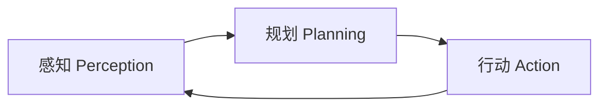

#### 业务流程优化6个步骤
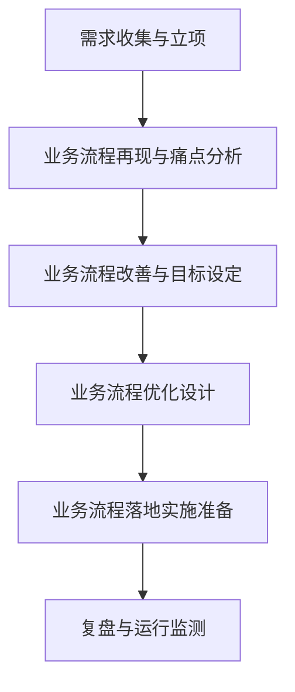

### 5. 经典金句/数据
> “Agent的基本决策流程可以概括为3个核心步骤：感知、规划和行动。” (p.18)
> “Agent开发模式从代码模式走向了零代码可视化模式。” (p.30)
> “开发Agent欠缺的通常不是技术能力，而是理解业务的能力。” (p.26)

---

## 工具箱篇——Agent开发很简单

## 第3章：认识Agent开发平台

### 1. 核心论点
本章解决“有哪些Agent开发平台、如何选择”的问题。作者认为：Agent开发平台经历了从代码框架到可视化零代码的演进，国内平台（扣子、文心智能体、智谱等）各具特色。扣子在易用性、插件丰富度、生态活跃度方面表现突出，是零基础开发者的最佳选择。

### 2. 关键概念/事件
- **Agent开发平台定义**：专门用于创建、配置、部署、训练和运行Agent的平台，具有技术集成性、操作易用性、功能扩展性、发布灵活性。
- **9大功能**：接入基础大模型、设计提示词、调用插件、编排工作流、存储记忆、设计对话体验、调试与校验、发布、运营管理。
- **国外平台演进**：LangChain（2022.10）→ LlamaIndex（2022.11）→ AutoGPT（2023）→ NexusGPT（2023.4）→ OpenAI GPTs（2023.11）→ Swarm（2024.10）。
- **国内平台速览**：Dify、FastGPT、文心智能体平台、千帆AppBuilder、智谱智能体中心、天工SkyAgents、扣子（Coze）、星火智能体平台、腾讯元器。
- **平台对比维度**：模型支持（单/多模型）、核心能力（知识库、插件、工作流等）、操作难易度（可视化、易理解、即插即用）、生态能力（开放性、迭代频率、用户活跃度等）。
- **扣子特点**：丰富的插件、多样化知识库、数据库记忆、灵活工作流、专门图像流、卡片交互、全链路调试。

### 3. 逻辑推演
作者首先定义Agent开发平台及其功能，然后按时间线梳理国外平台的进化（从代码到零代码）。接着详细介绍国内主流平台，并给出综合对比表。最后重点推荐扣子，列举其7大特点，并说明其功能布局（编排页面、工作空间、商店、模型广场、模板等）。结论：扣子是零基础开发者的首选。

### 4. 流程图（Mermaid）

#### Agent开发平台9大功能
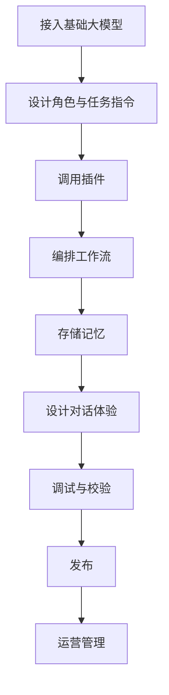

### 5. 经典金句/数据
> “扣子是一个非常易用、扩展能力强大、生态活跃的Agent开发平台，非常适合零编程基础的人员使用。” (p.52)
> “扣子的插件数量在国内Agent开发平台居首。” (p.52)

---

## 第4章：开发Agent的流程与策略

### 1. 核心论点
本章解决“如何系统化开发一个Agent”的问题。作者提出“3-10实施框架”：3个阶段（规划、设计、上线）共10个环节。核心策略包括：懂场景和业务比懂技术重要；使用工具拓展能力是关键；坚持小而美；把Agent当助手而非完全托管的解决方案。

### 2. 关键概念/事件
- **“3-10”实施框架**：
  - 规划阶段：定义应用场景、梳理业务流程和分析痛点、梳理功能定位和开发需求。
  - 设计阶段：绘制运行流程图、设置大模型及参数、设计提示词、配置技能、设计用户沟通页面。
  - 上线阶段：测试与调优、发布。
- **大模型参数**：生成多样性（精确/平衡/创意模式）、携带上下文轮数、最大回复长度、输出格式。
- **提示词设计**：单Agent模式下提示词复杂（角色、技能、知识、约束）；工作流模式下每个大模型节点单独设计提示词。
- **发布渠道**：智能体商店、豆包、飞书、抖音、微信、API等。

### 3. 逻辑推演
作者先提出“3-10”框架，然后逐一详解各环节。在规划阶段，强调定义场景和痛点分析；在设计阶段，强调绘制运行流程图的重要性，并给出大模型参数设置和提示词技巧；在上线阶段，重点介绍扣子的调试台功能（耗时、调用树、节点详情）。最后提出4条开发策略，核心是业务理解优先。

### 4. 流程图（Mermaid）

#### 开发Agent的“3-10”实施框架
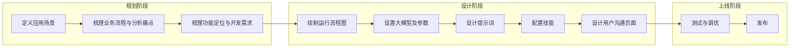

#### AI投标助手运行流程图（示例）
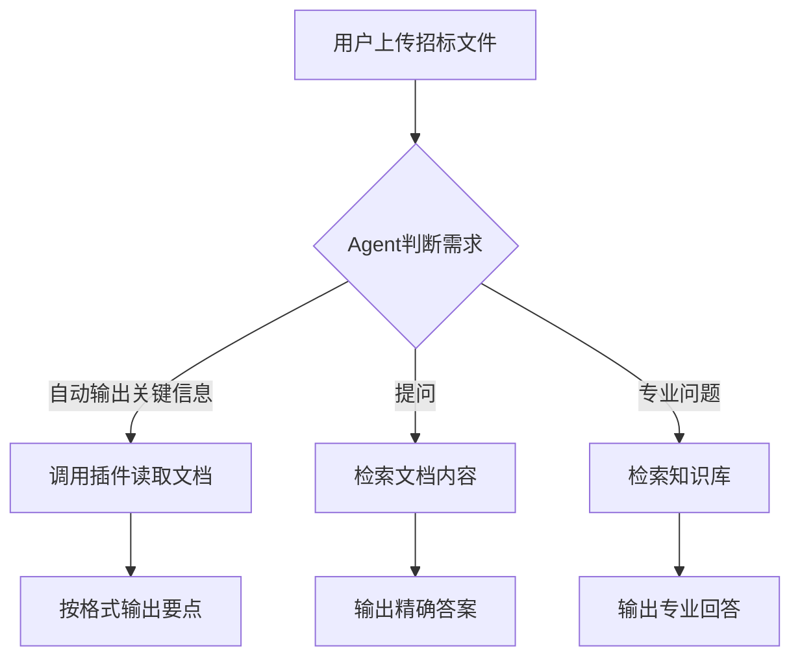

### 5. 经典金句/数据
> “懂场景和业务，比懂AI技术更重要。” (p.70)
> “使用工具拓展能力，是Agent具有价值的关键。” (p.70)
> “坚持小而美，聚焦特定的应用场景和功能。” (p.71)
> “把Agent当成助手，而不是一个完全托管的解决方案。” (p.71)

---

## 第5章：Agent开发的功能模块详解——插件、工作流、图像流

### 1. 核心论点
本章是技术实操核心，详细讲解插件、工作流、图像流三大模块的用法。作者认为：插件是拓展能力边界的工具集；工作流用于处理复杂、多步骤、高稳定性要求的任务；图像流专门处理图像生成与编辑。

### 2. 关键概念/事件
- **插件**：插件是工具集（工具箱），每个工具是API。包含输入参数和输出参数。扣子插件商店提供丰富插件，也支持通过API文档创建自定义插件。
- **工作流**：由节点（开始、结束、插件、大模型、代码、知识库、选择器、意图识别、文本处理、消息、问答、变量、数据库等）串联而成的处理链。支持可视化编排。
- **图像流**：专门处理图像的流程工具，包含智能生成（图像生成、图像参考）、风格模板（风格滤镜、宠物风格化）、智能编辑（换脸、背景替换、扩图、抠图等）、基础编辑（裁剪、调整、旋转、缩放）等工具。

### 3. 逻辑推演
作者按“插件→工作流→图像流”顺序，先介绍基本概念（工具、参数），然后演示如何在扣子中添加和测试插件，再详细列出工作流13种节点及其应用场景（如意图识别节点用于分类、文本处理节点用于拼接等），最后介绍图像流工具类别并给出“换脸”实战案例。每个模块都配有操作截图说明。

### 4. 流程图（Mermaid）

#### 工作流节点类型概览
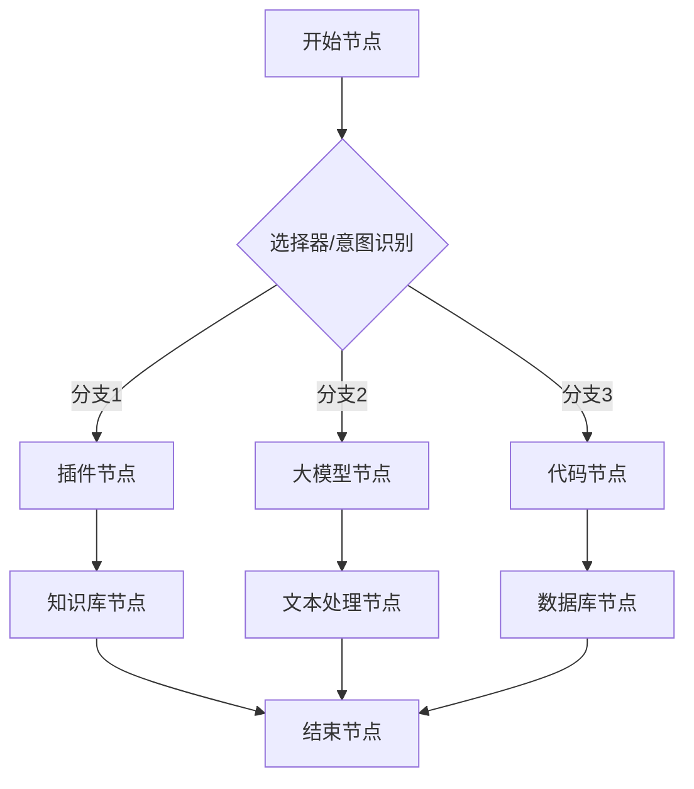

#### 图像流换脸案例流程
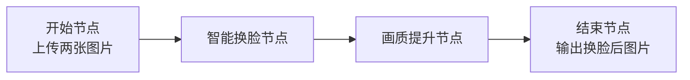

### 5. 经典金句/数据
> “插件是工具的集合，可以被理解为工具箱。” (p.73)
> “工作流是一组预定义、标准化的步骤，允许用户通过直观的图形页面，灵活地组合各工具节点。” (p.92)
> “图像流是专门用于处理图像的一个流程工具。” (p.114)

---

## 第6章：Agent开发的功能模块详解——知识库、变量、数据库、卡片与其他技能项

### 1. 核心论点
本章继续讲解Agent开发的其他核心模块：知识库用于存储私有知识、增强检索；变量用于存储中间结果和用户信息；数据库用于结构化数据持久化；卡片用于美化输出；长期记忆和文件盒子增强交互体验。

### 2. 关键概念/事件
- **知识库**：支持上传文本、表格、照片，通过文档解析→切块→词嵌入→向量数据库实现RAG。关键参数：分段策略（自动/手动）、检索策略（混合检索/语义检索/全文检索）、最大召回数量、最小匹配度。
- **变量**：存储用户偏好、中间结果，可在提示词中引用。支持跨平台数据同步。
- **数据库**：通过自然语言（NL2SQL）操作数据表，支持单用户/多用户模式。用于记录用户信息、面试打分等。
- **卡片**：扣子特色功能，支持模板化UI设计，提升信息可读性（如新闻卡片）。
- **其他技能**：长期记忆（自动记录对话）、文件盒子（存储用户上传的多模态文件）、对话体验（开场白、快捷指令、语音等）。

### 3. 逻辑推演
作者先解释知识库的运行逻辑（创建→使用），然后分别演示文本、表格、照片三种知识库的创建步骤，重点说明分段和检索参数设置。接着介绍变量和数据库的应用场景（如存储用户名、面试成绩）。卡片部分通过对比有无卡片的输出效果展示其价值。最后补充长期记忆和文件盒子的用法。

### 4. 流程图（Mermaid）

#### 知识库运行逻辑
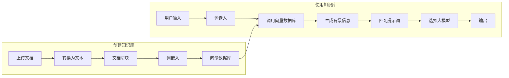

### 5. 经典金句/数据
> “Agent知识库可以解决大模型‘幻觉’、专业领域知识不足的问题。” (p.128)
> “合理的知识分段直接影响了回复的效果。” (p.141)
> “卡片是扣子推出的特色功能……让Agent回复的内容的可读性更强。” (p.150)

---

## 实战篇——5大场景、11个Agent开发案例

## 第7章：开发专业分析类Agent

### 1. 核心论点
本章解决“如何开发能深度理解长文档并生成专业报告的Agent”的问题。作者通过AI投标助手（入门）和调研诊断Agent（进阶）两个案例，展示如何配置知识库、设计工作流、撰写详细提示词，让Agent替代初级顾问的部分工作。

### 2. 关键概念/事件
- **专业分析类Agent**：掌握行业知识、给定分析方法和输出框架、具备长文本理解与输出能力。
- **AI投标助手**：功能为自动提取招标文件关键信息、回答用户问题。使用Kimi(128K)大模型、链接读取插件、招标文件关键词知识库。提示词采用“角色-技能-知识-约束”框架。
- **调研诊断Agent**：替代初级顾问，自动生成调研诊断报告。工作流包含：读取文档→分模块撰写（调研回顾、诊断分析、优化建议）→文本拼接→生成飞书文档。提示词长达3000余字，细化分析维度和输出格式。

### 3. 逻辑推演
作者首先定义专业分析类Agent的三大核心功能。然后以AI投标助手为例，从业务场景痛点（查找信息费时、信息传递易丢失）出发，规划功能定位，详细演示创建过程（选模型、写提示词、配置知识库）。再以调研诊断Agent为进阶，展示如何通过工作流拆解复杂任务（3个大模型节点分别写不同模块），并通过文本处理节点拼接。最后给出运行效果评估。

### 4. 流程图（Mermaid）

#### AI投标助手运行流程图
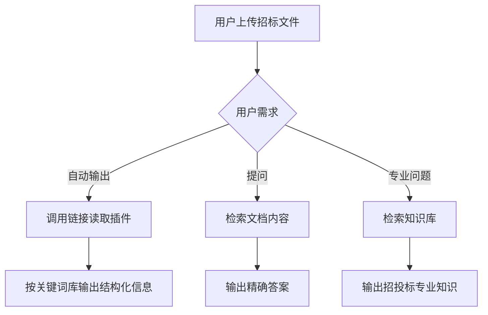

#### 调研诊断Agent工作流
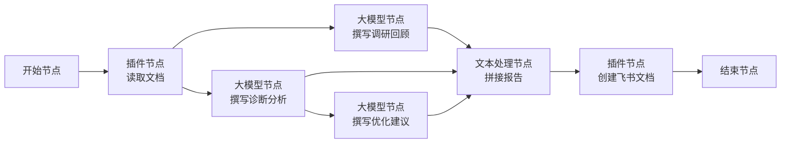

### 5. 经典金句/数据
> “专业分析类Agent在一定程度上可以替代初级员工的大部分工作。” (p.202)
> “提示词越详细，专业分析类Agent执行任务的效果越好。” (p.203)
> “运行一次消耗了22万多token。” (p.199)

---

## 第8章：开发角色扮演类Agent

### 1. 核心论点
本章解决“如何让Agent模拟特定人物或角色进行对话”的问题。作者通过小学生英语口语陪练Agent（入门）、模拟面试官Agent（进阶）、意大利旅行多专家Agent（进阶）三个案例，展示角色设定、知识库配置、变量/数据库使用以及多Agent协同编排。

### 2. 关键概念/事件
- **角色扮演类Agent**：具有鲜明人设、背景故事、性格特征。使用场景：情感陪伴、专业陪练、虚拟客服、模拟用户。
- **小学生英语口语陪练**：单Agent模式，提示词设定角色为耐心外教，技能包括引导对话、纠错、鼓励。配置数据库记录已学单词。
- **模拟面试官**：单Agent模式，功能为根据岗位说明和简历生成面试问题、进行追问、打分复盘、提供面试技巧。配置变量（行业、公司）和数据库（存储面试表现）。
- **多专家Agent（意大利旅行）**：多Agent模式，包含翻译Agent、记账Agent、攻略Agent、文案编辑Agent。通过“多Agents”编排页面，设置全局跳转条件，实现一个对话页面调用多个专业Agent。

### 3. 逻辑推演
作者先定义角色扮演类Agent的三大角色类型（IP、非IP、系统定制）。然后通过三个案例逐步深入：口语陪练重点在提示词和数据库；模拟面试官增加变量和复盘功能；多专家Agent则演示如何将多个单Agent协同编排，实现“专人做专事”。最后对比工作流（串联）和多Agent（并联）的区别。

### 4. 流程图（Mermaid）

#### 多Agent意大利旅行编排架构
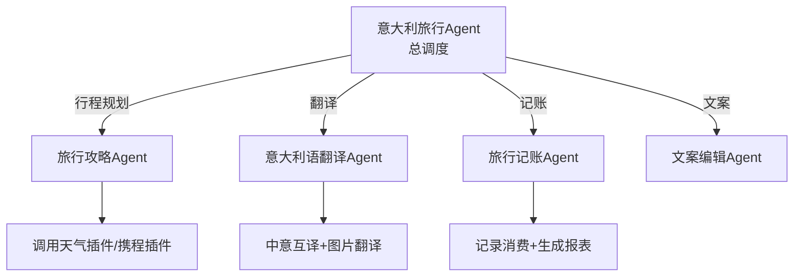

### 5. 经典金句/数据
> “角色扮演类Agent的专长是基于大模型强大的语言处理与生成能力，生成符合‘角色’特点的内容。” (p.230)
> “多Agent模式……让它们更专注、更专业。” (p.218)
> “工作流像串联电路，而‘多Agents’模式则像多开关的并联电路。” (p.230)

---

## 第9章：开发知识问答类Agent

### 1. 核心论点
本章解决“如何基于私有知识库构建专业问答Agent”的问题。作者通过公司首席知识官Agent（入门）和全能助理问问Agent（进阶）两个案例，重点讲解知识库的预处理、分段策略、检索参数设置，以及如何将多个插件、工作流、知识库集成到一个Agent中。

### 2. 关键概念/事件
- **知识问答类Agent**：运用RAG技术，通过检索增强生成，回答专业问题。优势：精准直达、消除幻觉；缺点：切片可能导致信息割裂。
- **公司首席知识官**：以企业制度文档为知识库。重点演示文本知识库的自定义分段（添加“###”标识符）和表格知识库的处理（避免合并单元格、设置语义匹配字段）。发布到飞书供员工使用。
- **全能助理问问**：集成多插件（生活顾问、联网问答）、工作流（含意图识别、图片生成、古诗词检索、书籍检索、汽车检索、私有知识库问答）。使用意图识别节点分流用户需求，未匹配的转回Agent调用联网插件。

### 3. 逻辑推演
作者首先解析RAG工作原理及优缺点。然后在公司首席知识官案例中，详述文档预处理（删除页眉、添加分段标识符）和表格知识库的表结构配置，强调分段和检索参数对输出质量的影响。在全能助理问问案例中，演示复杂工作流设计（意图识别节点分流5类需求，变量节点传递未匹配意图），最终实现“万能问答”。

### 4. 流程图（Mermaid）

#### RAG工作流程
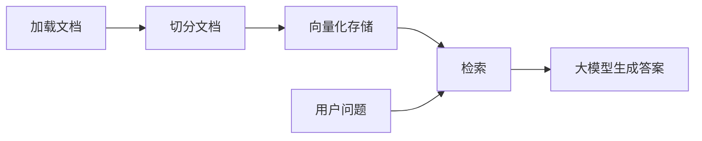

#### 全能助理问问Agent工作流
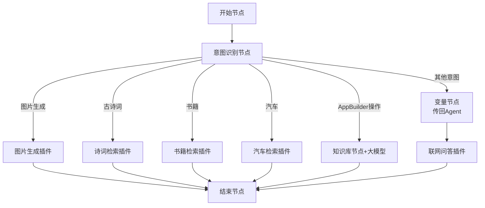

### 5. 经典金句/数据
> “知识库不是一传了之，上传前预处理知识……可以让Agent更准确地理解知识。” (p.263)
> “分段的原则是尽量让关联强的内容划分在一个片段。” (p.235)
> “提示词是指令中枢，十分重要。” (p.263)

---

## 第10章：开发内容营销和自媒体运营类Agent

### 1. 核心论点
本章解决“如何利用Agent生成营销内容和自动化自媒体运营”的问题。作者通过每日AI简报Agent（入门）和抖音热点视频转小红书图文笔记Agent（进阶）两个案例，展示如何利用搜索插件、工作流分解任务（标题、正文、配图）、触发器实现定时推送。

### 2. 关键概念/事件
- **内容营销类Agent**：核心能力是内容生成和数据分析，可辅助选题、编辑、渠道投放、客户关系管理。挑战：个性化、边际成本、工作流自动化。
- **每日AI简报**：单Agent模式，添加头条新闻插件，设置触发器实现每日定时推送AI新闻。提示词限定每次输出5条，格式固定。
- **抖音转小红书**：工作流模式，包含：搜索抖音热点视频→读取视频内容→大模型生成标题→大模型生成小红书正文→大模型生成图片提示词→图片生成插件→输出图文笔记。关键是将复杂任务拆解为多个子任务。

### 3. 逻辑推演
作者先指出大模型在内容生成中的三大挑战（个性化、边际成本、自动化），引出开发专门Agent的必要性。然后在每日AI简报案例中，演示如何通过触发器实现自动化定时任务。在抖音转小红书案例中，重点展示工作流如何将一篇小红书笔记拆解为标题、正文、配图三个子任务，分别由不同大模型节点处理，最后合并输出。

### 4. 流程图（Mermaid）

#### 抖音热点视频转小红书图文笔记工作流
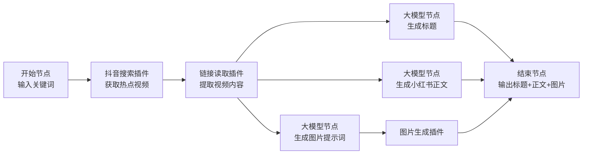

### 5. 经典金句/数据
> “在面对复杂的任务时，将其分解为多个子任务，并将这些子任务分配给不同的专业大模型进行处理，往往能够取得更佳的效果。” (p.275)
> “不要把复杂任务让单个Agent处理，而要将复杂任务拆解为小任务。” (p.287)

---

## 第11章：开发效率办公类Agent

### 1. 核心论点
本章解决“如何用Agent自动化日常办公任务”的问题。作者通过文本纠错助手Agent（入门）和会议纪要助手Agent（进阶）两个案例，展示如何利用知识库（专业术语、格式规范）和工作流（将长文档拆分为多个议题分别总结）提升办公效率。

### 2. 关键概念/事件
- **效率办公类Agent**：深度整合办公软件、自动化处理重复性任务、高效检索信息。使用场景：重复任务自动化、数据分析与决策支持、内容创作。
- **文本纠错助手**：单Agent模式，配置“链接读取”插件和两个知识库（专业术语、格式规范）。提示词定义检查错别字、专业词汇、格式一致性三个技能，输出格式为“原句-修改-改动”。
- **会议纪要助手**：工作流模式，核心思路是将长会议记录拆分为不超过5个议题，分别用大模型节点总结，最后汇总。包含21个节点（多个大模型节点、代码节点、消息节点），使用通义听悟先将录音转文字。

### 3. 逻辑推演
作者先指出效率办公Agent需了解企业工作习惯、抓住核心痛点。在文本纠错案例中，强调知识库对专业术语和格式规范的重要性。在会议纪要案例中，详细演示如何通过代码节点和大模型节点拆解长文本：先让大模型修改转写错误并输出大纲，再用代码节点提取各部分内容，然后分别总结，最后汇总。结论：任何重复性工作都值得用Agent重构。

### 4. 流程图（Mermaid）

#### 会议纪要助手Agent工作流（简化）
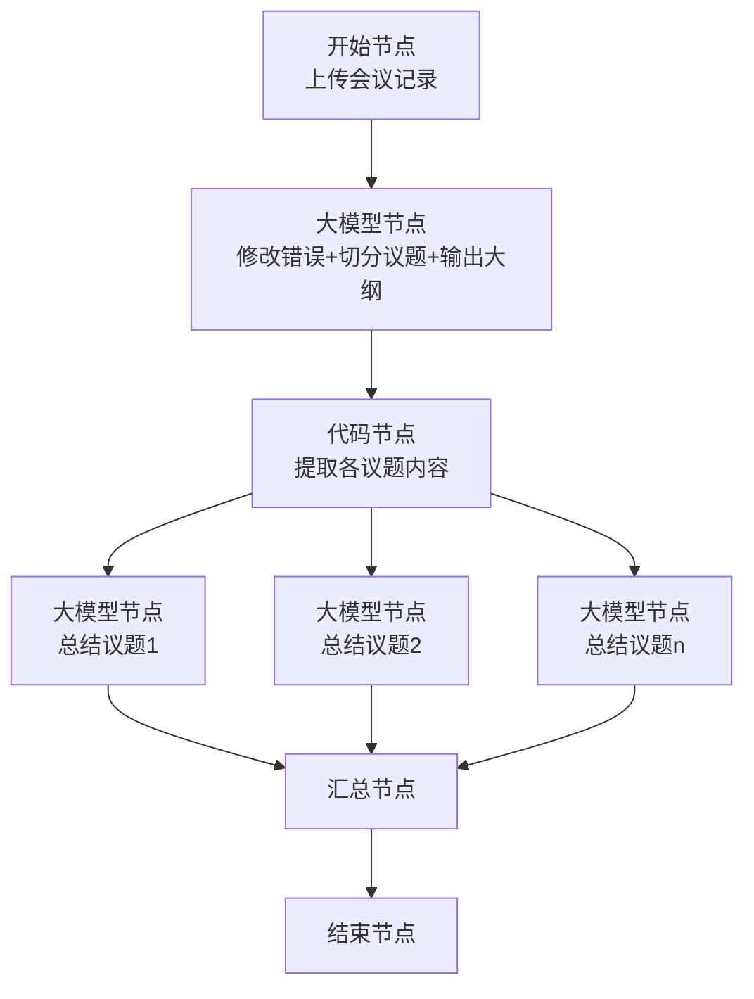

### 5. 经典金句/数据
> “任何重复性工作，都值得考虑使用Agent进行重构和优化。” (p.312)
> “选择模型参数是一个关键点。参数过多的大模型……响应速度会变慢。” (p.312)
> “让最熟悉业务流程的人参与设计Agent至关重要。” (p.312)

---

## 全书总结
本书从概念到实操，系统介绍了AI Agent的开发方法。核心观点是：Agent是AI落地的关键形态，零代码平台（如扣子）让非技术人员也能开发。通过11个案例覆盖专业分析、角色扮演、知识问答、内容营销、效率办公五大场景，每个案例都包含需求分析、流程图设计、提示词编写、插件/知识库配置、测试发布全流程。读者应学会“业务优先、小步快跑、工具扩展”的开发策略，将Agent作为助手而非替代品。未来，Agent将成为每个人和企业的数字员工，提升生产力。