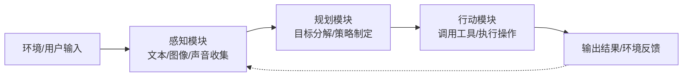
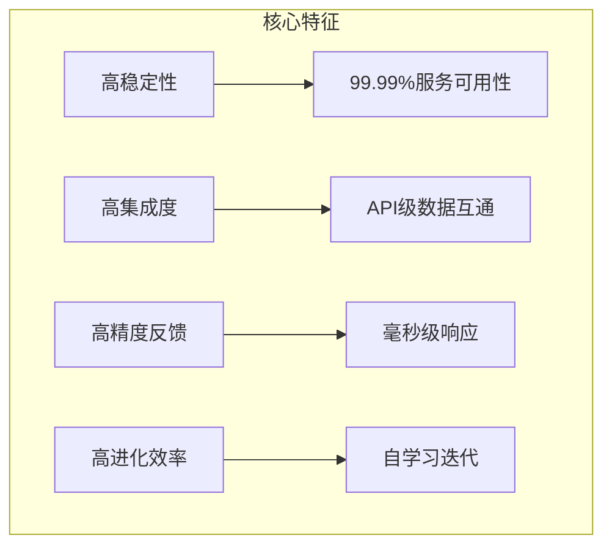
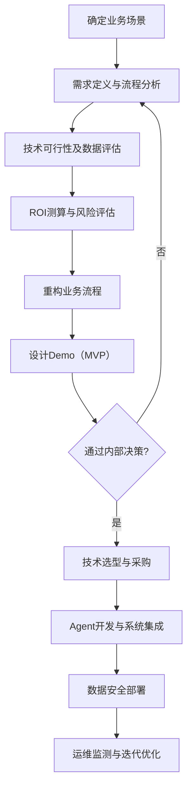
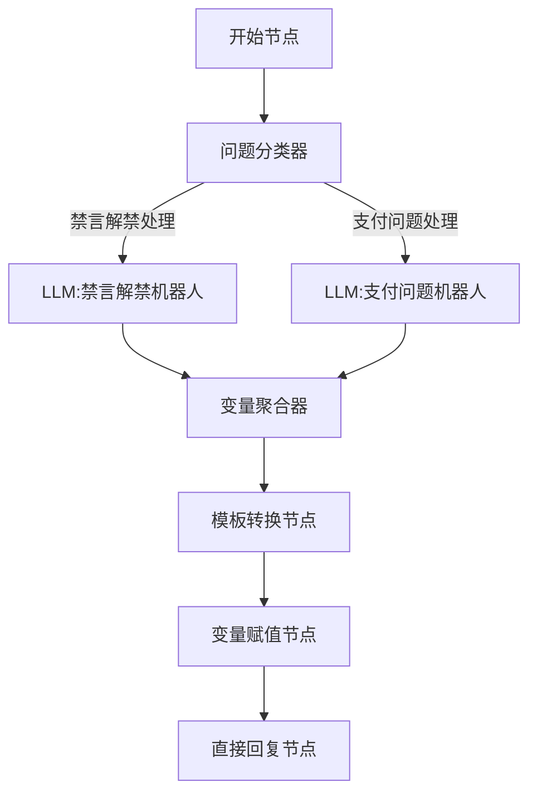
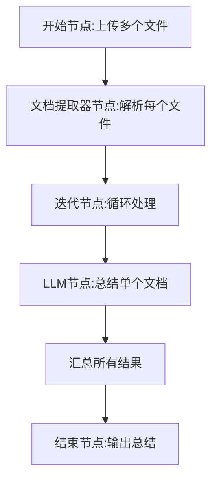
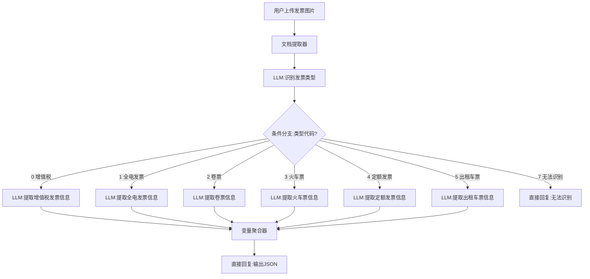
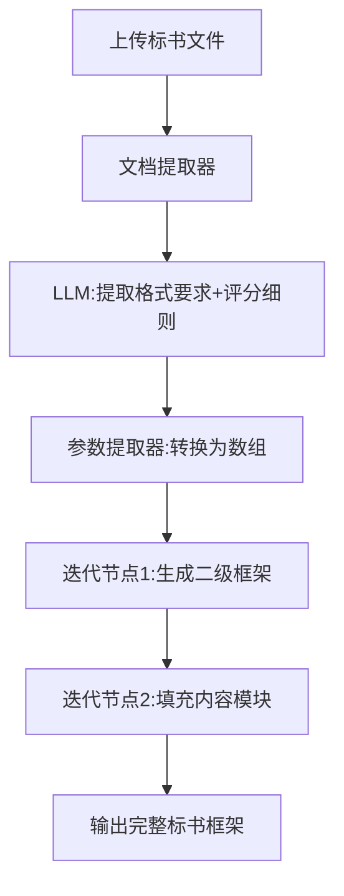
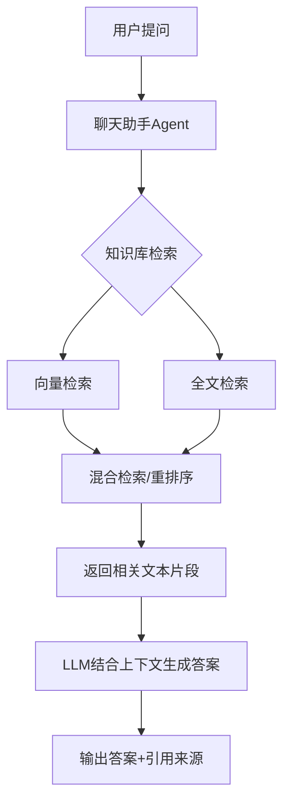
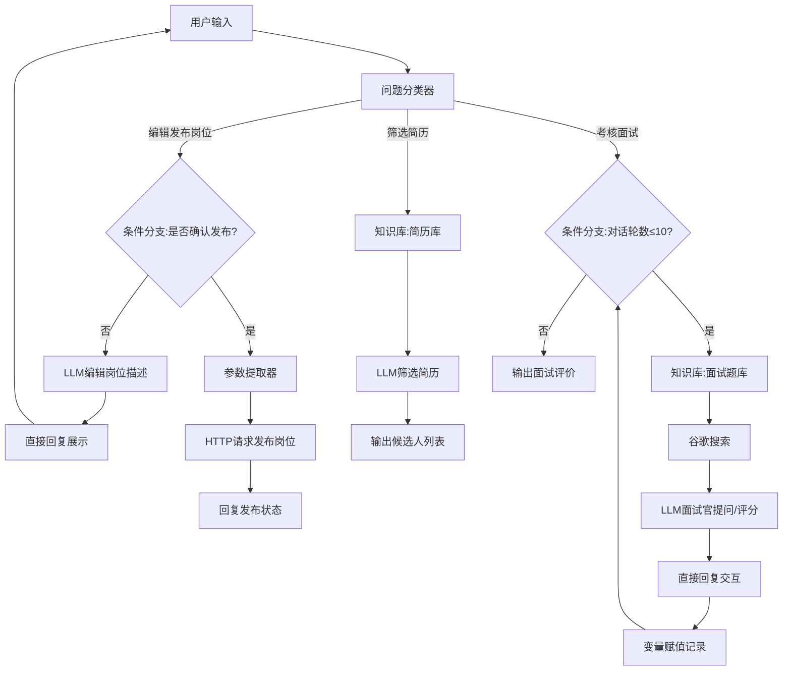

# 《零基础开发AI Agent——用Dify从0到1做智能体》章节总结

## 书籍信息
- **书名**：零基础开发AI Agent——用Dify从0到1做智能体
- **作者**：叶涛、管锴、杨霆辉（注：书中署名有“管错”“管锴”不一致，以前言作者签名为准）
- **PDF状态**：文本可识别，部分页面存在扫描/OCR格式问题
- **OCR状态**：整体可读，少量页面内容识别不完整，已标注

## 目录说明
- 目录识别情况：完整识别出9个主章节及子章节
- 章节对应依据：按原书页码顺序及标题提取
- OCR修复说明：第5章标题中“Diffy”应为“Dify”，保留原文但标注

## 全书核心主题
本书是一本面向零基础、非IT技术人员的Agent开发实战指南，以Dify为核心平台，系统讲解从大模型到Agent的概念、生产级Agent的价值、Dify的部署与使用、工作流节点操作，并通过发票识别、标书处理、本地知识问答、人才招聘四个业务场景共六个项目案例，手把手演示Agent开发的全过程。全书强调“方法总结→工具操作→项目实战”的结构，旨在帮助读者掌握用Dify开发生产级Agent的能力，实现AI从“好玩”到“好用”的跨越。

---

## 第1章：从大模型到AI Agent

### 1. 核心论点
本章主要解决“什么是AI Agent、它如何工作、在AI落地中有何价值”的问题。作者认为：Agent是大模型从“思考”走向“行动”的关键载体，通过感知、规划、行动三大核心步骤，能够在场景化、流程化、个性化、本地化四个维度上释放AI的真正生产力，并正在从“好玩”向“好用”（生产级Agent）演进。

### 2. 关键概念/事件
- **Agent（智能体）**：集成大模型与各类工具、理解用户需求、自主规划和执行复杂任务的智能应用。类比为“有手有脚的大脑”。
- **感知-规划-行动（Perception-Planning-Action）**：Agent智能行为的骨架。感知收集信息，规划制定方案，行动执行操作。
- **生产级Agent**：深度融入企业核心经营管理场景，具备持续服务能力、高可靠性及可量化价值产出的智能体。特征：高稳定性、高集成度、高精度反馈、高进化效率。
- **大模型商业生态三层次**：基础层（通用大模型）、垂直层（行业/专业大模型）、应用层（微场景落地应用），Agent位于应用层并贯通上下。
- **流程化价值**：Agent自身运行遵循标准化“感知-规划-行动”流程，同时能对外部业务流程进行再造，实现自动化与智能化。

### 3. 逻辑推演/叙事脉络
本章从大模型的能力与局限切入，指出通用大模型存在数据时效滞后、专业深度不足、幻觉等问题。由此引出Agent作为解决方案——它不仅具备大模型的推理能力，还通过记忆、规划、工具使用形成闭环。通过外卖助手、汽车质检、车险理赔、教育导购等案例，依次论证Agent的场景化（深入特定领域）、流程化（再造业务流程）、个性化（因需定制）、本地化（私有部署保安全）四大价值。最后提出“生产级Agent”概念，强调其在企业经营管理中的生产力变革作用，并划分了效率跃升、决策优化、模式创新三个落地阶段。

### 4. 流程图
#### Agent工作原理图（感知-规划-行动）


#### 生产级Agent核心特征


### 5. 经典金句/数据
> “Agent=大模型+记忆+主动规划+工具使用” (p.11)
> “Agent就像一个有大脑、还有手和脚的人，不但能够思考，还能够执行更复杂、更个性化的任务。” (p.10)
> “生产级Agent的核心价值就是在企业端为企业提供生产力。” (p.24)
> “汽车总装质检：人工半小时 → Agent 90秒，质量问题追溯从4小时降至10分钟。” (p.18)
> “车险理赔：小额案件秒级定损，复杂案件从15天压缩至72小时。” (p.19)

---

## 第2章：Dify介绍及Agent开发流程

### 1. 核心论点
本章解决“如何选择Agent开发平台以及如何规范地开发生产级Agent”的问题。作者认为：Dify作为开源、可私有化部署的B端平台，适合生产级Agent开发；开发生产级Agent需遵循“确定场景→重构流程→立项开发→运维迭代”的标准流程，并注意聚焦场景、锚定价值、Demo优先、数据安全四个要点。

### 2. 关键概念/事件
- **Agent开发平台**：帮助开发者快速设计、搭建Agent的工具集合，支持模型配置、工作流设计、知识库、插件调用等。
- **Dify**：开源Agent开发平台，支持本地化部署，融合Backend as Service和LLMOps理念，提供模型支持、RAG引擎、流程编排等。
- **生产级Agent开发流程**：①确定业务场景（需求定义、流程分析、可行性评估、ROI测算）；②重构流程与设计Demo；③立项开发（技术选型、系统集成、安全管控）；④运维监测与迭代优化。
- **Demo优先原则**：在正式开发前，用低代码平台快速搭建最小可行产品，验证核心功能，降低投资风险。
- **B端 vs C端平台**：B端（Dify、FastGPT）适合企业级、私有化、高要求场景；C端（扣子、文心智能体）适合个人、轻量、免费场景。

### 3. 逻辑推演/叙事脉络
首先横向对比国内外Agent开发平台（LangChain、扣子、Dify等），指出Dify因开源、本地化、功能全面而成为企业首选。接着详细对比Dify与FastGPT、扣子的差异，强调Dify在企业级特性上的优势。然后转入方法论：如何开发生产级Agent？按照四步走——先通过业务访谈定位真实痛点，再重构人机协同流程并搭建Demo，再进入技术选型与系统集成，最后持续监测优化。最后提炼四个注意事项，尤其强调“聚焦小场景”和“量化价值指标”。

### 4. 流程图
#### 生产级Agent开发流程


### 5. 经典金句/数据
> “生产级Agent区别于实验性Agent的核心是系统稳定性、可扩展性及与业务系统深度耦合。” (p.22)
> “某制造企业通过分析设备故障日志，发现30%的停机源于轴承过热，但人工巡检存在2小时延迟。” (p.41)
> “某客服Agent代替了30%的人工座席，年节省成本120万元，客户投诉率下降40%。” (p.45)
> “Dify社区版可以在本地电脑或云服务器上私有化部署，确保知识库数据安全。” (p.35)

---

## 第3章：部署Dify的开发环境

### 1. 核心论点
本章解决“如何在本地电脑或云服务器上私有化部署Dify”的技术操作问题。作者提供了两种部署方案（Docker+Dify+Ollama / Docker+Dify+Ollama+Xinference），详细演示了从安装Docker、下载Dify源代码、启动容器到接入模型管理平台的完整步骤，强调私有化部署对数据安全的重要性。

### 2. 关键概念/事件
- **Docker**：容器化平台，将软件与依赖打包为独立容器，简化部署。
- **Ollama**：开源的本地大模型管理平台，轻量化运行与调试模型。
- **Xinference**：企业级分布式模型服务平台，支持多模态推理，适合混合编排。
- **Embedding模型**：将文本转换为向量数据的模型，用于知识库解析。
- **方案一 vs 方案二**：方案一（Docker+Dify+Ollama）仅需CPU，低配置；方案二（+Xinference）需要GPU，性能更高。

### 3. 逻辑推演/叙事脉络
本章按操作顺序展开：首先说明部署的总体方案选择；然后详细教学在Windows11上安装Docker Desktop（包括启用虚拟机平台、Hyper-V、WSL等前置步骤），以及在云服务器（以阿里云为例）上一键部署Docker。接着下载Dify源码，使用docker compose命令部署服务端，通过localhost访问并设置管理员账户。最后部署Ollama和Xinference，下载Qwen2.5、DeepSeek等模型，并将模型接入Dify，验证聊天助手和知识库功能。

> 说明：该部分PDF识别较为完整，但包含大量命令行代码，总结中省略具体命令，保留核心步骤逻辑。

### 4. 流程图
#### Dify本地化部署方案一架构
```mermaid
graph TD
    A[本地电脑/云服务器] --> B[Docker引擎]
    B --> C[Dify容器]
    B --> D[Ollama容器]
    D --> E[大模型 (如Qwen2.5)]
    D --> F[Embedding模型]
    C -->|接入| E
    C -->|接入| F
```

### 5. 经典金句/数据
> “Dify社区版是开源版本，我们可以免费获取源代码文件。” (p.47)
> “如果电脑有CPU双核处理器、8GB内存、10GB硬盘空间，基本上就可以实现方案一的部署。” (p.48)
> “模型上下文长度16384意味着输入的汉字加上大模型输出的汉字可达10000字左右。” (p.67)

---

## 第4章：Dify的功能介绍及5种应用

### 1. 核心论点
本章系统介绍Dify平台的主页面功能（探索、工作室、知识库、工具）以及五种应用类型（聊天助手、Agent、文本生成应用、Chatflow、工作流），通过多个小案例演示每种应用的创建、编排和测试方法。作者旨在让读者快速掌握Dify的可视化操作，为后续项目实战打下基础。

### 2. 关键概念/事件
- **探索页面**：模板资源库，可一键复制到工作区。
- **工作室页面**：创建和管理聊天助手、Agent、工作流等应用。
- **知识库页面**：上传文档、同步Notion/网页，配置Embedding和检索参数。
- **工具页面**：内置工具及市场插件，可拖拽使用。
- **五种应用**：
  - **聊天助手**：单/多轮对话，基于知识库问答。
  - **Agent**：自主规划、调用工具完成任务。
  - **文本生成应用**：批量生成特定类型文本（如评价、文案）。
  - **Chatflow**：支持多轮对话逻辑的工作流，共享记忆。
  - **工作流（Workflow）**：自动化编排任务，适合批处理。

### 3. 逻辑推演/叙事脉络
首先分别介绍Dify四个主要页面及功能。然后逐一讲解五种应用的创建方法，每个应用配一个实操案例：聊天助手（AICX-管理咨询师面试）、Agent（AICX-个人助手，调用维基百科和时间工具）、文本生成（AICX-评价机器人，设置变量）、Chatflow（AICX-客服，包含8个节点）、工作流（概述数据预处理/生成/输出三大模块）。每类应用都演示了提示词设置、模型参数调整及发布测试。

### 4. 流程图（以Chatflow为例）
#### AICX-客服Chatflow节点结构


### 5. 经典金句/数据
> “Dify工作流的核心理念：数据在各节点中流转与转换。” (p.84)
> “温度越高，大模型生成的结果的创意性和随机性越强；温度越低，结果越严谨固定。” (p.75)
> “知识库通过建立精准的信息锚点，有效降低虚构内容产生概率。” (p.87)

---

## 第5章：Dify工作流节点详解及实操案例

### 1. 核心论点
本章详细拆解Dify工作流的18个节点，按数据预处理、数据生成、数据输出三大模块归类，并通过十余个小案例演示每个节点的具体使用方法。作者旨在让读者掌握工作流的底层构建能力，能够灵活组合节点实现复杂业务逻辑。

### 2. 关键概念/事件
- **数据预处理模块**：开始节点、知识检索节点、变量赋值节点、参数提取器节点、代码执行节点、文档提取器节点、列表操作节点、变量聚合器节点。
- **数据生成模块**：LLM节点、问题分类器节点、条件分支节点、迭代节点、循环节点。
- **数据输出模块**：模板转换节点、HTTP请求节点、Agent节点、结束节点、直接回复节点。
- **迭代 vs 循环**：迭代节点独立处理数组每个元素（批处理）；循环节点依赖前置结果重复执行直到满足条件（优化问题）。
- **FunctionCalling vs ReAct**：两种Agent策略，前者直接调用函数，后者交替推理与行动。

### 3. 逻辑推演/叙事脉络
本章按三大模块顺序逐一讲解每个节点的功能、参数设置及适用场景，每个节点配一个最小化可行案例。例如：
- 开始节点：设置“日报助手”输入字段
- 知识检索节点：构建问答系统
- 变量赋值节点：存储用户语言偏好
- 参数提取器节点：提取文本中的水果名
- 代码执行节点：对输入数字求和
- 文档提取器节点：解析上传的PDF并回答问题
- 迭代节点：批量总结多个文档
- 循环节点：随机生成数字直到5
- Agent节点：调用工具搜索
- 直接回复节点：固定输出格式

每个案例均包含节点配置截图说明（文字描述）。

### 4. 流程图（以迭代节点批处理文档为例）


### 5. 经典金句/数据
> “文档提取器节点只能处理txt、markdown、pdf、docx等类型文档，无法处理图像、音频、视频。” (p.109)
> “迭代节点只能处理Array数组格式的数据。” (p.122)
> “循环节点的下一次运行都依赖前置的生成结果，而迭代节点每次都是独立运行。” (p.124)

---

## 第6章：开发发票识别助手Agent

### 1. 核心论点
本章通过两个案例（增值税发票识别、多类型发票聚合识别）演示如何利用多模态大模型和Dify工作流开发发票自动识别与结构化输出的Agent。作者认为：OCR+多模态技术可将人工录入发票效率提升10倍以上，并输出标准化JSON数据对接ERP，实现财务流程智能化。

### 2. 关键概念/事件
- **光学字符识别（OCR）**：提取图像中的文字信息。
- **多模态大模型**：能同时理解图片和文本的模型（如Qwen2.5-VL-72B）。
- **增值税发票识别助手**：入门案例，4个节点（开始→文档提取器→LLM→直接回复），提示词要求提取20+字段。
- **多类型发票聚合识别助手**：进阶案例，13个节点，增加发票类型识别LLM、条件分支（7种发票类型）、多个专用提取LLM，最终输出统一JSON。
- **硅基流动平台**：提供视觉模型API，用于Dify接入。

### 3. 逻辑推演/叙事脉络
首先分析传统发票管理痛点（效率低、错误率高、数据孤岛）。然后进入开发：入门案例中，选择Chatflow类型，添加开始节点（上传文件）、文档提取器（统一格式）、LLM节点（配置硅基流动的Qwen2.5-VL-72B，提示词结构化提取字段）、直接回复输出JSON。测试成功。进阶案例中，增加一个“发票类型识别”LLM节点，根据视觉特征输出类型代码（0~7），条件分支分发到对应专用提取LLM（增值税、全电发票、卷票、火车票、定额票、出租车票），最后变量聚合器合并输出。演示了滴滴打车电子发票识别效果。

### 4. 流程图
#### 多类型发票聚合识别助手工作流


### 5. 经典金句/数据
> “人工录入单张发票耗时超过1分钟，发票识别助手1秒完成单张票据结构化解析。” (p.135)
> “手工处理错误率达8%，引发后续税务对账纠纷。” (p.135)
> “提示词中要求输出机器编号、发票代码、发票号码等20多个字段。” (p.139-140)

---

## 第7章：开发标书阅读与内容框架生成助手Agent

### 1. 核心论点
本章通过入门案例（标书阅读助手）和进阶案例（标书阅读+内容框架生成）演示如何利用Dify工作流、知识库和迭代节点处理长文档，自动提取招标文件的关键信息并生成符合要求的标书框架。作者认为：该Agent能将标书编写从“人工逐项核对”升级为“结构化自动生成”，显著减少废标风险。

### 2. 关键概念/事件
- **标书阅读助手**：8个节点，条件分支判断是否上传文件，若上传则通过文档提取器+LLM提取关键词（招标项目名称、资格要求、评分细则等）；若无上传则从知识库检索回答投标问题。
- **标书阅读与内容框架生成助手**：12个节点，在入门案例基础上增加两个迭代节点。第一个迭代生成二级框架，第二个迭代填充非虚构性内容模块（如技术方案、业绩证明）。
- **参数提取器节点**：将LLM生成的字符串格式的一级框架转换为数组，供迭代节点使用。
- **迭代节点嵌套**：第一个迭代内LLM扩展二级标题，第二个迭代内LLM填充内容要点。

### 3. 逻辑推演/叙事脉络
首先分析传统标书编写痛点（效率低、条款响应不全、格式错误、信息协同困难）。入门案例中，构建Chatflow，开始节点接收标书文件和问题，条件分支分流：有文件则文档提取+LLM分析提取关键信息并直接回复；无文件则知识检索+LLM回答投标问题。进阶案例中，先通过LLM提取“投标文件格式要求”和“评分细则”，然后参数提取器转换为数组，第一个迭代节点逐项生成二级框架（如3.1项目理解），第二个迭代节点对每个二级框架进行模块化填充（插入占位符、标注评分条款、红色警示）。最终输出完整标书框架。

> 说明：部分提示词内容较长，已提炼核心逻辑。

### 4. 流程图
#### 标书阅读与内容框架生成助手核心流程


### 5. 经典金句/数据
> “人工阅读招标文件需逐页查找，标书常需多人协作，版本混乱。” (p.160)
> “评分权重≥15%的模块需拆解为实施方案/技术优势/风险控制等子项。” (p.177)
> “在废标高风险环节（签字页/报价单）添加红色警示标记【关键控制点】。” (p.180)

---

## 第8章：开发本地知识问答助手Agent

### 1. 核心论点
本章以某通信公司为例，演示如何通过私有化部署Dify和知识库，开发一个基于公司内部文档（年报、技术文档、管理制度等）的本地知识问答助手。作者强调：通过合理配置分段参数、检索策略（混合检索）和Embedding模型，可以在确保数据安全的前提下实现高质量、精准的智能问答。

### 2. 关键概念/事件
- **本地知识库建设**：上传Word、Excel、PDF、HTML等30万字文档，设置父子分段（父段4000 token，子段1000 token）。
- **检索设置**：混合检索（向量+全文），TopK=3，Score阈值过滤，可选Rerank模型精排。
- **聊天助手类型应用**：选择模型（qwen2.5:7b），编写角色提示词（行业分析师），添加知识库，设置开场白。
- **召回测试**：验证知识库检索效果，返回相关段落及相似度。
- **元数据**：支持内置（文件名、上传者等）和自定义元数据，用于分类与权限控制。

### 3. 逻辑推演/叙事脉络
首先分析A公司的痛点：私有知识分散、查询效率低、传统检索不智能、数据安全风险。然后按照步骤演示：创建知识库，上传5个不同格式文件（年报、设施覆盖、名词解释、债券指南等），详细设置分段参数（父子分段）、索引方式（高质量模式）、检索策略（混合检索），并进行召回测试验证。接着创建聊天助手类Agent，选择本地模型，编写提示词（角色为行业分析师，规定报告解读、数据分析、咨询建议三项技能），添加知识库，设置开场白。最后通过6个场景测试（利润数据、表格查询、名词解释、规则查询、社会责任、混合检索）验证Agent能够准确调用知识库内容并附上引用来源。

### 4. 流程图
#### 本地知识问答助手工作流


### 5. 经典金句/数据
> “麦肯锡2023年推出AI工具Lilli，基于10万份文档学习，顾问研究时间从几周缩短到几分钟。” (p.198)
> “父段最大长度4000 token，子段最大长度1000 token，重叠度10%。” (p.189)
> “混合检索平衡了全文检索和向量检索的全面性与准确性。” (p.189)

---

## 第9章：开发人才招聘数字员工Agent

### 1. 核心论点
本章通过一个包含20个节点的复杂Chatflow，完整实现从收集岗位需求、发布岗位、筛选简历到面试评估的全流程AI化招聘Agent。作者认为：通过问题分类器、条件分支、HTTP请求、知识库、迭代节点等组合，可以大幅减少HR在招聘各环节的人工投入，实现人才招聘的自动化与智能化。

### 2. 关键概念/事件
- **三大功能路径**：①编写及发布岗位需求（IF分支循环修改直到“确认发布”，ELSE分支参数提取+HTTP请求发布）；②筛选简历（知识库存储简历，LLM根据岗位描述筛选）；③考核面试（利用面试题库和谷歌搜索，LLM作为面试官多轮提问并评分）。
- **变量赋值与会话变量**：使用`jobdesc_llm`缓存岗位描述，使用`score_desc`存储面试全过程记录。
- **HTTP请求节点**：模拟调用招聘网站API发布职位（POST请求，JSON格式）。
- **迭代逻辑**：面试部分通过条件分支判断对话轮数（≤10轮进行问答，>10轮输出评价），实际利用对话轮数控制循环，无需显式迭代节点。

### 3. 逻辑推演/叙事脉络
首先分析传统招聘痛点（明确需求费时、筛选简历复杂、测评面试繁琐）。然后按三条路径编排Chatflow：
- **路径一**：开始节点→问题分类器→条件分支（是否包含“确认发布”且对话轮数≤5）→IF分支：获取时间戳→LLM岗位编辑→直接回复展示→变量缓存；ELSE分支：参数提取器提取岗位信息→HTTP请求发布→回复发布状态。
- **路径二**：知识检索节点（简历库）→LLM筛选简历（根据岗位名称和描述）→直接回复输出符合条件的简历摘要。
- **路径三**：条件分支（对话轮数≤10）→IF分支：知识检索（面试题库）+谷歌搜索→LLM面试官（提问+评价）→直接回复交互→变量赋值记录；ELSE分支：直接回复输出完整面试评价。
最后用三个场景测试：编写发布岗位、筛选简历、模拟面试（Java岗位，10轮问答，输出评分）。

### 4. 流程图
#### 人才招聘数字员工Agent整体架构


### 5. 经典金句/数据
> “传统招聘中，HR需要联系业务部门确认需求，筛选大量简历，编写多套笔试试题，流程复杂费时。” (p.200)
> “面试环节使用对话轮数控制，最多10个问题，每轮Agent会评价答案并给出建议。” (p.218)
> “该Agent可以辅助企业高效、快速寻找到合适的候选人，提升招聘体验。” (p.221)

---

> **总结完成**：本书从概念到实战，覆盖了Agent开发的完整知识体系，适合零基础读者快速上手Dify并开发企业级智能体。