# 《非遗热点趋势及商业化路径洞察报告》章节总结

## 书籍信息
- 书名：非遗热点趋势及商业化路径洞察报告
- 作者：数说故事 X 复旦大学社会发展与公共政策学院项目组
- PDF 状态：完整
- OCR 状态：良好

## 目录说明
- 目录识别完整，包含：一、中国非遗发展现状；二、中国非遗商业化现状及问题；三、非遗社媒讨论概况；四、非遗社媒热搜情况；五、机会非遗识别模型与典型案例分析；结语。
- 本文依据原始目录顺序逐章总结。

## 全书核心主题
本报告系统解码中国非物质文化遗产从“文化资源”到“商业资产”的全链路逻辑。通过整合国家级/省级非遗名录、海内外社媒声量、消费行为数据，原创“机会非遗识别模型”，从文化价值、市场潜力、落地可行性三维评估高潜力IP。报告发现民俗、传统体育、传统技艺三大品类占据65%以上社媒流量，汉服、织锦、簪花、针灸四大标杆项目已跑出可复制商业化范式。最终提出品牌端、投资端、运营端的落地建议，旨在让非遗被更多人看见、更好传承、更高效商业化。

---

## 第一部分：前言、核心亮点与机会价值

### 核心论点
问题：海量非遗项目中，哪些具备高商业潜力？如何平衡文化本真与商业变现？
观点：非遗是活态文明基因与国潮商业新蓝海，需要数据驱动、可落地的判断体系与行动指南，将非遗从文化资源转化为商业资产。

### 关键概念
- 机会非遗识别模型：从文化价值、市场潜力、落地可行性三维量化评估非遗IP的模型。
- 四级名录保护体系：国家、省、市、县四级非遗代表性项目名录。
- 活态传承：非遗不是博物馆里的静态标本，而是扎根生活、连接古今的文化富矿。

### 逻辑推演
报告首先强调中国非遗资源体量庞大（国家级1557项、省级20924项，44项入选联合国教科文组织名录世界第一）。伴随文化自信崛起，Z世代成为消费主力，短视频破圈传播。但海量项目中需精准筛选高潜力IP，因此构建三维评估模型。后续章节依次分析现状、商业化问题、社媒热搜、典型项目案例，最终给出分层建议。

### 经典金句
> “非遗”早已不是博物馆里的静态标本，而是扎根生活、连接古今、走向世界的文化富矿。
> 每一项“非遗”都值得被看见、被传承、被新生；每一个有温度的文化IP，都能在新时代绽放商业与文化的双重光芒。

---

## 第一章：中国非遗发展现状

### 1. 核心论点
问题：中国非遗在数量、类型、区域分布和国际地位上有何特征？
观点：中国非遗呈现数量丰富、类型多样、分布广泛三大特征；国际地位上，44项入选UNESCO名录世界第一，海外传播呈“头部集中、长尾待挖”格局。

### 2. 关键概念
- 十大门类：民间文学、传统音乐、传统舞蹈、传统戏剧、曲艺、传统体育游艺与杂技、传统美术、传统技艺、传统医药、民俗。
- 金字塔式储备结构：国家级1557项，省级20924项，市县更多。
- 头部集中度：海外传播中Top10项目占总量64.14%，前五位占45.43%。

### 3. 逻辑推演
先定义非遗（UNESCO与中国法律定义），再分析特征：数量上传统技艺类最多（287项），浙江、山东、山西国家级非遗排名前三；类型上覆盖十大门类，传统技艺类断层领先；分布上全域覆盖，东部沿海和西南多民族聚居区形成两大文化高地。国际地位方面，44项世界第一，海外平台帖子量近390万条，YouTube占71.21%为核心平台。头部项目（妈祖信俗、太极拳、春节等）传播优势明显，中长尾项目仍有大量转化潜力。

### 4. 图表提炼

#### 中国非遗项目层级结构
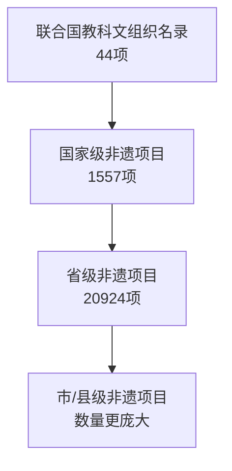

#### 海外平台传播分布
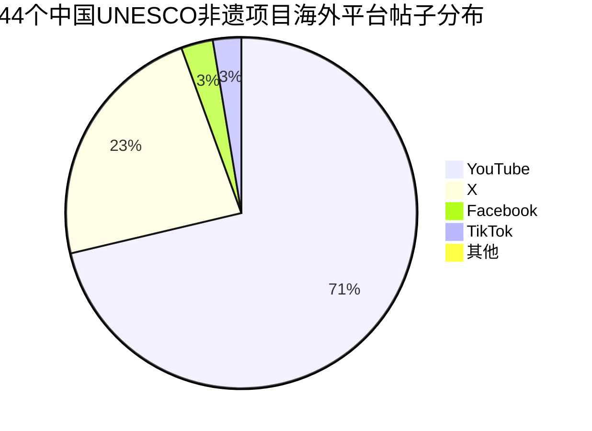

### 5. 经典金句/数据
> 国家级“非遗”项目达1557项、省级20924项，44项入选联合国教科文组织名录，总数世界第一。
> 在观测周期内，44个项目在六大国际主流平台共形成3,893,842条相关帖子。
> 太极拳、春节、端午节等头部项目在海外传播中已经形成高辨识度入口。

---

## 第二章：中国非遗商业化现状及问题

### 1. 核心论点
问题：非遗商业化当前处于什么阶段？存在哪些问题？未来趋势如何？
观点：商业化已进入政策、市场、平台三驾马车协同推进阶段，但存在文化内涵淡化、产品同质化、知识产权不完善等问题；未来趋势是品牌产业化、体验年轻化、跨界融合、数字化全链路运营。

### 2. 关键概念
- 生产性保护：在有效保护前提下，通过生产、流通、销售等方式将非遗转化为文化产品。
- 视觉基因与精神基因：非遗IP开发需同时挖掘外观美学与文化内涵。
- 一源多用：同一非遗IP通过多平台、多形态延长产业链。

### 3. 逻辑推演
先论述非遗商业价值（传承维系、内容转化、产业增值、认同建构）。再分析现状：政策上已建立1.1万家非遗工坊、99家国家级生产性保护示范基地；市场上2025年非遗市场规模预计达1000亿元，用户规模2.49亿，80/90后为主；平台上抖音2025年新增非遗相关视频超2亿条，商品年销量超65亿单。然后指出问题：文化内涵淡化（重符号拼贴）、创新不足同质化、知识产权确权困难、算法偏向短内容导致长叙事非遗传播难。最后总结四大趋势：品牌产业化规模化、消费体验年轻化（00后近4成搜索）、跨界创新与产业融合、数字化平台化全链路运营。

### 4. 经典金句/数据
> 2025年春节假期，全国国内出游5.01亿人次，“非遗”相关文旅活动带动出游，消费总额达6770亿元。
> 抖音2025年新增国家级“非遗”相关视频超2亿条，播放量7499亿次，日均直播6.5万场。
> “非遗”消费范式已从被动“观看展示”转向主动“参与体验”。近四成“非遗”相关搜索来自00后群体。

---

## 第三章：非遗社媒讨论概况

### 1. 核心论点
问题：非遗在社交媒体上的讨论热度、情感倾向、平台分布、区域分布如何？
观点：社媒讨论整体热度上升，体验分享为主，正面情绪占比超99%，UGC占92%；抖音和小红书成为核心增长平台；讨论焦点从商业流量回归文化本质；长三角、珠三角及中部文旅大省是声量主体。

### 2. 关键概念
- UGC vs PGC：用户生产内容占比92%，专业生产内容不足5%。
- 净情感度：负面情绪均在1%以下，传播生态健康。
- 资源-传播匹配：浙江、广东、四川等资源丰富地区传播效果好；山东、山西等资源富集但传播尚有提升空间。

### 3. 逻辑推演
对比2024与2025两年数据：声量在春节达到峰值，2025年各月互动量显著高于2024年同期。情感分布中性为主（73%），正面为辅，负面低于1%。声量类型UGC占92%稳定。平台层面：微博2025年声量大幅下降，抖音成为核心声量阵地，小红书爆发式增长。词云分析：2024年关键词含明星、品牌、晚会（商业化破圈）；2025年关键词含民俗文化、手艺、手工制作（文化本质回归）。区域分布：浙江跃居第一，福建、广东、四川、黑龙江进入TOP5。

### 4. 图表提炼

#### 社媒平台声量变化
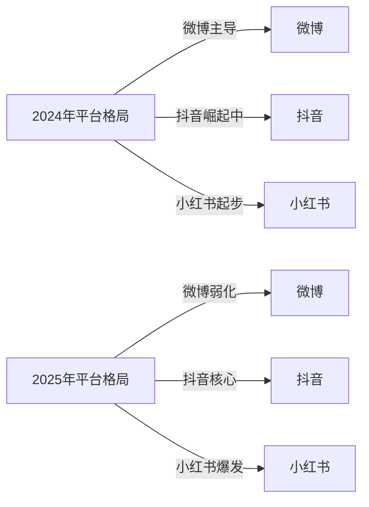

### 5. 经典金句/数据
> UGC占比在两年均达到92%，PGC均在5%以下，用户分享型内容生产为商业化提供了坚实基础。
> 2025年社媒讨论词云中，“民俗文化、手艺、手工制作”等文化属性关键词取代了前一年的明星品牌词。
> 声量TOP15省份集中于长三角、珠三角及中部文旅大省，江苏、广东、浙江、四川、福建位居前列。

---

## 第四章：非遗社媒热搜情况

### 1. 核心论点
问题：哪些具体非遗项目和类别在热搜中表现突出？其传播规律是什么？
观点：IP头部效应显著，清明节、传统武术、汉服服饰在评论数和热度值上断层领先；民俗、传统体育、传统技艺三大类别贡献超65%声量；视频平台（B站、抖音）是真实传播优势阵地。

### 2. 关键概念
- 评论数：反映互动参与度与情感共鸣度。
- 热搜时长：衡量话题延展性与商业长尾价值。
- 基数校正：排除平台总体数据规模影响，计算相对热度。

### 3. 逻辑推演
首先说明数据清洗流程：从52万条原始数据经泛词初筛、非遗名称匹配、项目匹配码表三步，最终得到13726条高质量热搜数据。项目维度：评论数前三为清明节（约16.9亿次）、传统武术、汉服服饰。热度值前三为汉服服饰（约32.5亿）、传统武术、清明节。热搜时长上汉服与传统武术远超其他项目。类别维度：民俗占声量30.8%，传统体育游艺与杂技19.4%，传统技艺15.6%，三大类合计超65%。平台分析：微博绝对量最大，但校正基数后B站和抖音的真实热度更高。

### 4. 图表提炼

#### 数据清洗流程
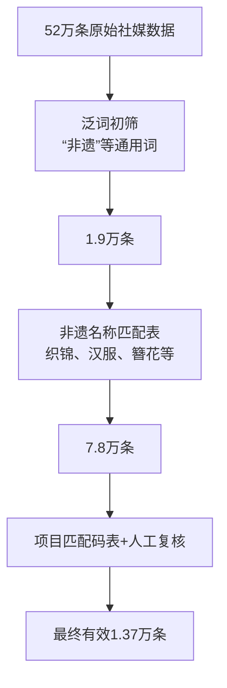

#### 非遗类别声量占比
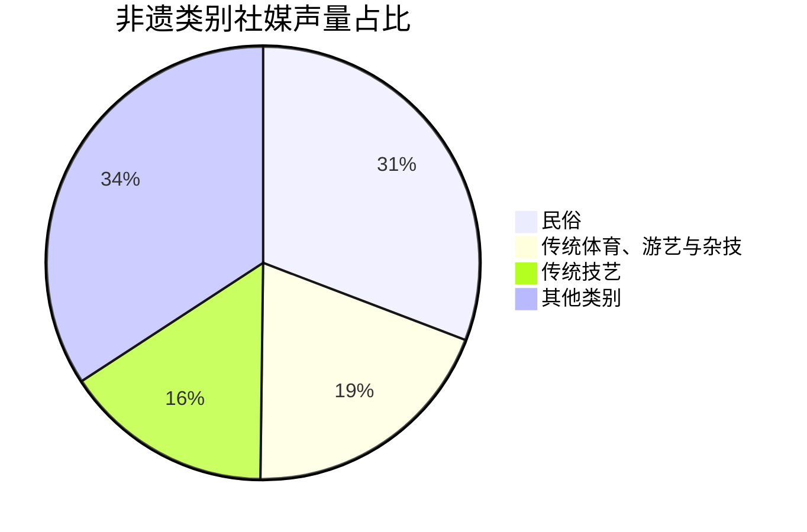

### 5. 经典金句/数据
> “清明节”凭借节庆民俗的强代入感，评论数断层式领先，达到约16.9亿次。
> “汉服服饰”以约32.5亿的热度值登顶第一梯队，热搜累计停留时长远超其他项目。
> 三大头部类别（民俗、传统体育、传统技艺）合计贡献超65%的声量份额。
> 哔哩哔哩的“非遗”相关内容占平台热词库的比例最高，抖音同样高于全平台平均水平。

---

## 第五章：机会非遗识别模型与典型案例分析

### 1. 核心论点
问题：如何从文化价值、市场潜力、落地可行性三维度评估非遗IP？织锦、簪花、汉服、针灸四个典型案例的商业化特征是什么？
观点：织锦与簪花三维度全优，是成熟商业IP；汉服市场繁荣但文化规范待整合；针灸文化底蕴深厚但受医疗合规壁垒限制。每个项目应基于自身特征选择差异化开发路径。

### 2. 关键概念
- 机会非遗识别模型：文化价值维度（非遗底蕴深厚/有待规范整合/非遗属性薄弱）、市场潜力维度（商业生态繁荣/泛年轻化受限/缺乏受众基础）、落地可行性维度（全产业链完备/跨界延展受限/医疗合规壁垒）。
- 分层开发：织锦的高端定制、工业化量产、轻量化文创三条路径。
- 簪花模式：文旅沉浸式体验+旅拍+文创，轻资产快速复制。

### 3. 逻辑推演
先构建三维评估模型，再对热点项目进行等级评定。织锦：非遗底蕴深厚（三大名锦国家级），商业生态繁荣（从高定到手机、美妆跨界），全产业链完备（高端手工+机织量产+文创），三维全高。簪花：同样三维全高，依托“簪花+旅拍+文创”模式在泉州蟳埔村快速复制。汉服：市场生态繁荣、产业链完备，但文化维度“有待规范整合”（本体未入国家级非遗，形制标准不统一）。针灸：文化底蕴深厚（UNESCO），市场潜力“泛年轻化受限”，落地可行性“医疗合规壁垒”。然后分别深度分析四个案例的社媒热点、区域分布、产业链现状、政策支持、商业化规模，最后给出针灸和汉服的未来商业开发路径。

### 4. 典型案例评估表

| 非遗项目 | 文化价值 | 市场潜力 | 落地可行性 |
|---------|---------|---------|-----------|
| 织锦 | 非遗底蕴深厚 | 商业生态繁荣 | 全产业链完备 |
| 簪花 | 非遗底蕴深厚 | 商业生态繁荣 | 全产业链完备 |
| 汉服 | 有待规范整合 | 商业生态繁荣 | 全产业链完备 |
| 针灸 | 非遗底蕴深厚 | 泛年轻化受限 | 医疗合规壁垒 |

### 5. 各案例流程图

#### 织锦商业化分层路径
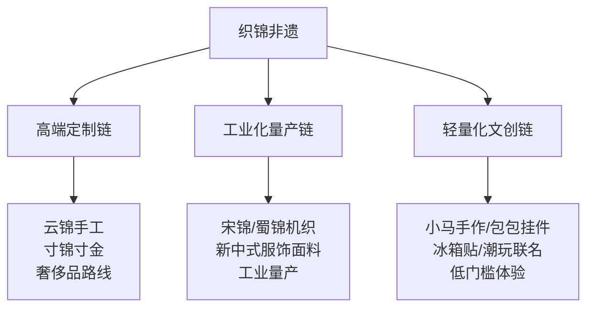

#### 簪花商业化模式
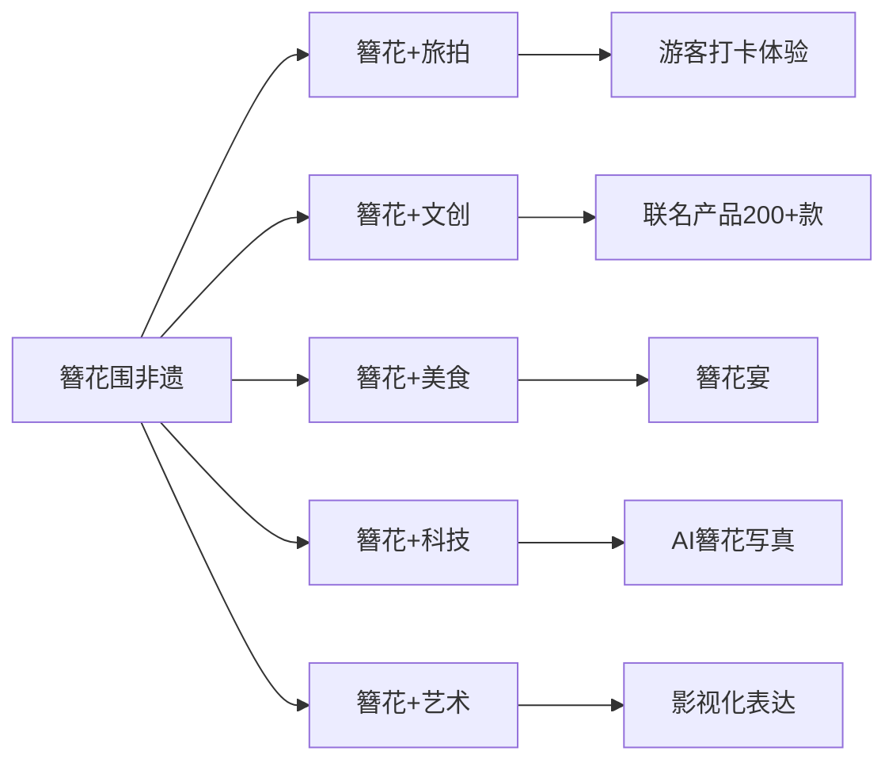

#### 针灸未来开发路径
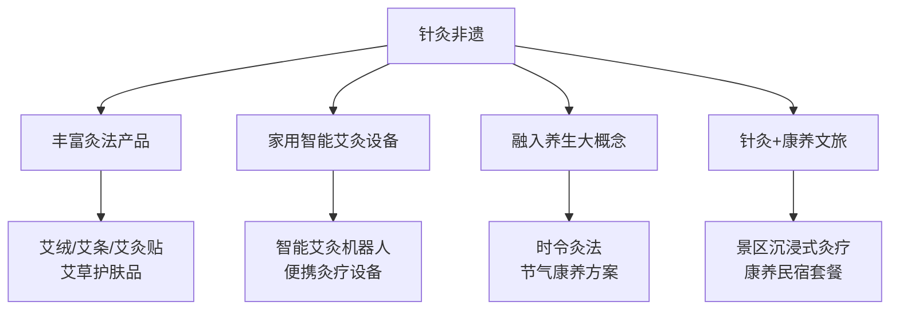

#### 汉服未来开发路径
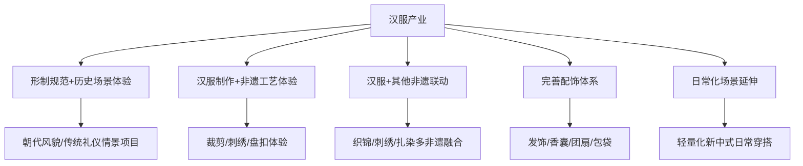

### 6. 经典金句/数据
> 织锦在观测周期内社媒声量1848721，互动量57713412，净情感度93.68%。
> 簪花带动蟳埔村2025年接待游客超930万人次，拉动旅游消费约70亿元。
> 汉服2025年市场规模预计达144.7亿元，同比增长23.4%，2027年有望达241.8亿元。
> 针灸全球市场2025年规模预计达416亿美元，中国中医器械2024年市场规模突破188.9亿元。

---

## 结语

### 核心论点
中国非遗已形成资源雄厚、类型完整、国际影响力持续提升的格局。商业化正在从符号借用转向内容化、场景化、品牌化、平台化协同发展。未来开发的关键在于依托数据识别与分层筛选机制，围绕高潜力项目实现精准资源匹配、传播转化与长期运营。

### 经典金句
> 未来“非遗”开发的关键在于依托数据识别与分层筛选机制，围绕高潜力项目实现更精准的资源匹配、传播转化与长期运营，最终推动文化传承、社会传播与商业应用之间形成更稳定的协同关系。

---

# 《问界M8用户画像及购车旅程调研报告》章节总结

## 书籍信息
- 书名：问界M8用户画像及购车旅程调研报告
- 作者：烹小鱼咨询（电动汽车用户联盟）
- PDF 状态：完整
- OCR 状态：良好

## 目录说明
- 报告包含：核心发现、人口学特征、购置类型与拥车情况、购车动机与用车场景、触媒与决策信息、关注因素与选择原因、对比车型及核心竞品战败原因、典型用户画像等。
- 本文依据报告实际章节顺序总结。

## 全书核心主题
本报告通过问卷调查与访谈（154份有效问卷，3人深访），深度刻画问界M8的用户画像。核心发现：用户为37.1岁男性为主（75.3%），高知高管高薪中产，已婚有孩家庭占77.3%。购车最关注辅助驾驶（66.9%）和安全性（50.7%），最终选择问界M8的首要原因是辅助驾驶（77.9%）。竞品主要为理想L9/L8和蔚来ES8，战败原因集中在辅助驾驶差距、品牌力不足、主动安全不够。74.7%的用户会再次选择问界M8。

---

## 核心发现（概述）

### 核心论点
问题：问界M8的用户是谁？他们为什么选择这款车？竞品对比中问界M8胜出的原因是什么？
观点：用户是一群清醒且购买力较强的中产群体，购车理性，既渴望尝鲜新技术（辅助驾驶），又要求安全、宽敞、舒适满足全家出行。辅助驾驶和安全性是无可替代的核心选择因素。

### 关键数据
- 男性占75.3%，平均年龄37.1岁，31-40岁占57.2%。
- 本科及以上学历占81.2%，老板/中高级管理人员占55.1%。
- 税后家庭年收入60万元以上占36.4%。
- 购车关注TOP5：辅助驾驶66.9%、安全性50.7%、智能座舱34.4%、品牌33.1%、空间33.1%。
- 选择问界M8 TOP5：辅助驾驶77.9%、安全性44.2%、品牌37.0%、智能座舱35.7%、空间22.7%。
- 20.1%用户未对比其他车型直接选定问界M8。
- 重新购车选择：74.7%仍选问界M8，7.8%升级问界M9。

### 竞品战败原因
- 放弃蔚来ES8：车机交互差、辅助驾驶不如问界、品牌认可度不高、安全性感觉不足。
- 放弃理想L9/L8/i8：辅助驾驶差距、品牌力未达预期、主动安全“不如问界靠谱”、理想i8外观难接受、L8增程器噪音明显。

---

## 人口学特征

### 核心论点
问界M8用户以31-40岁男性为主，高学历、高职位、高收入，已婚有孩家庭居多，购车决策多与配偶共同商定，日常用车以男性驾驶为主。

### 关键数据
- 平均年龄37.1岁，31-40岁占57.2%，本科及以上81.2%。
- 家庭常住人口3-5口占77.9%，已婚85.1%，已婚有孩77.3%。
- 私企/国企/外企/社会团体用户中，老板&中高级管理人员占55.1%。
- 平均工作年限12.9年，税后家庭平均年收入57.5万。
- 购车决策：69.5%综合考虑他人意见，共同决策人主要为配偶（86.9%）。
- 日常用车：72.1%基本由男性驾驶。

### 用户原声
> 最开始的时候我还没有坚定一定要买M8，但是试驾完智驾以后，我回家和老婆商量了一下，基本上就定下了。因为问界M8有零重力座椅，无论对于家里的老年人来说，还是对于我老婆来说都是很舒服的。

---

## 购置类型与拥车情况

### 核心论点
家庭增换购为主（81.8%），换购用户主要来自大众、宝马、马自达、日产等油车品牌，家庭多车用户大多保有BBA（奥迪、奔驰、宝马）主流车型。

### 关键数据
- 个人层面：首购26.0%，增购39.0%，换购35.0%。
- 家庭层面：首购18.2%，增购39.0%，换购42.8%。
- 换掉车型品牌TOP3：大众（18.2%）、宝马、马自达、日产。
- 家庭保有其他车型品牌：奥迪（11.7%）、奔驰（10.8%）、宝马（10.8%），代表车型奥迪Q5/A4L、奔驰GLC、宝马3系/5系。

---

## 购车动机与用车场景

### 核心论点
购车主要动机是周末假期出游（66.2%）、尝鲜新能源（48.1%）、原有车辆技术落后（44.2%）。核心用车场景为上下班通勤（83.8%）、短途自驾游（66.2%）、长途自驾游（62.3%）。

---

## 能源类型偏好

### 核心论点
纯电用户只考虑纯电（98.0%），原因：纯电续航长、保养简单、是未来趋势。增程用户多因续航补能焦虑选择增程（51.9%仅考虑增程），原因：长途无需规划充电、不怕高速/冬季续航衰减、偏远地区充电设施不足时从容应对。

### 用户原声
> 我觉得只要不是一直要用油开，都优先选纯电。日常回家充电都很方便，想长途的时候注意下电量就行。
> 节假日开纯电车上高速，排队充电都要等好久。

---

## 触媒与决策信息

### 核心论点
用户日常了解汽车渠道主要是抖音（80.5%）、4S店（46.8%）、小红书（44.8%）。首次认识问界M8的渠道：抖音（31.8%）、商超展厅（13.0%）、亲友推荐（12.3%）。最能影响购车决策的信息：辅助驾驶测评（64.9%）、车主口碑（38.3%）、新车试驾（32.5%）。

---

## 关注因素与选择原因

### 核心论点
用户购车最关注辅助驾驶和安全性，最终选择问界M8也是因为辅助驾驶领先、主被动安全可靠、品牌力强、智能座舱流畅、空间宽敞。

### 用户原声
> 辅助驾驶真的是最大卖点，试驾了一次就下定了。辅助驾驶和安全是我认为无可替代的两个非常重要的点。
> 品牌上我没有一丝纠结，直接就是问界。问界一直有着不错的销量，市场认可度也不错。
> 鸿蒙座舱一贯的稳定、丝滑。最满意的是多设备协同互联。

---

## 核心竞品及战败原因

### 核心论点
纯电用户主要对比蔚来ES8和理想i8，增程用户核心对比理想L9/L8。20.1%用户未对比直接选定问界M8，原因：亲友极力推荐、华为加持下的品牌信任、国货支持情怀。

### 战败原因总结
- 蔚来ES8：车机反应略迟钝、辅助驾驶不如问界流畅、品牌认可度不高、安全性感觉不及问界。
- 理想L9/L8/i8：辅助驾驶能力差距、品牌力未达预期、主动安全“不如问界靠谱”、理想i8外观难以接受且空间偏小、理想L8增程器噪音明显。

---

## 典型用户画像（三例）

### 用户1：奥迪A6L老车主增购
- 33岁男性，事业单位，已婚1孩，济宁。
- 购车关注：安全性（有过事故经历）、辅助驾驶（缓解长途疲劳）、大六座空间、内饰高级感。
- 对比车型：理想L9、腾势N9、蔚来ES8。
- 选择原因：试驾辅助驾驶后确定；央视新闻电池安全实验令人震撼；零重力座椅舒适；增程无续航焦虑。
- 惊喜体验：高速上AEB紧急减速避险成功。
- 推荐意愿：愿意推荐。

### 用户2：家有一油一电BBA的国企中层
- 37岁男性，建筑行业，重庆，已婚2孩。
- 保有奔驰EQS、宝马X5（家人用），增购问界M8。
- 关注因素：辅助驾驶、智能座舱、六座空间、外观稳重、静谧性。
- 对比车型：小鹏G9、腾势N9、蔚来ES8。
- 选择原因：外观稳重、辅助驾驶智能、三排空间宽敞、刹车调校接近油车、华为技术背书。
- 惊喜体验：往返2000公里近1900公里使用辅助驾驶，同行两个朋友都增购了问界。

### 用户3：追求智能化的红旗女车主换购
- 39岁女性，国企，北京，已婚无孩。
- 换购红旗HS5，预算50万以内。
- 关注因素：只考虑纯电、大空间（避免晕车）、方正方正外观、高速/城区辅助驾驶、泊车辅助（侧方停车焦虑）、车机流畅。
- 对比车型：蔚来ES8。
- 选择原因：泊车功能省心、星云大灯吸引、品牌口碑好、座椅舒适、空间宽敞。
- 惊喜体验：手机遥控车辆自己开出狭窄车位。
- 推荐意愿：愿意推荐。

---

## 结语（报告自带结语）

本报告通过真实车主调研，全面呈现问界M8用户的特征、购车决策路径和竞品对比。用户群体以高学历、高收入、已婚有孩的80后男性为主，购车核心驱动力为辅助驾驶和安全性。问界M8凭借华为技术背书、领先的智驾能力、可靠的主动安全和鸿蒙座舱体验，在竞争中脱颖而出，用户忠诚度和推荐意愿极高。

---

# 《2026年第一季度大中华区物业摘要》章节总结

## 书籍信息
- 书名：2026年第一季度大中华区物业摘要
- 作者：仲量联行（JLL）
- PDF 状态：完整
- OCR 状态：良好

## 目录说明
- 报告包含：市场动态（甲级办公楼市场、优质零售地产市场、物流地产市场）、专题文章（上天入地出海：深圳消费电子产业的空间新需求、上海长租公寓市场、香港零售业转向信号）、办公楼（北京、上海、广州、深圳、成都、南京、武汉、杭州、香港、台北）、零售地产（北京、上海、广州、深圳）、物流地产（北京、上海、广州）、酒店（北京、上海、广州、深圳、香港）。
- 本文按主要板块总结。

## 全书核心主题
本报告系统梳理2026年第一季度大中华区主要城市商业地产（办公楼、零售、物流、酒店）的市场表现。办公楼市场需求分化复苏，科技行业引领需求修复，租金仍下行但跌幅收窄。零售市场温和复苏，消费电子、潮玩杂货、运动户外、平价餐饮等业态活跃，服务消费领跑。物流地产需求稳定，“以价换量”推动需求温和复苏，租金持续调整。酒店市场入境旅游强劲复苏，业绩向好。专题文章聚焦深圳消费电子产业对办公楼、零售、物流的空间需求，上海长租公寓市场的韧性，以及香港零售业的结构性转型。

---

## 一、甲级办公楼市场（整体动态）

### 核心论点
问题：2026年Q1中国主要城市甲级办公楼市场表现如何？
观点：需求分化复苏，成本驱动型升级仍为主要需求来源；科技行业（AI、游戏、消费电子、机器人）带动需求修复；市场保持租户利好，部分城市租金跌幅收窄。

### 关键数据
- 一线城市净吸纳量46.1万平方米。
- 科技互联网、金融、专业服务业为主要需求来源。
- 出海浪潮下，跨境法务、国际物流、跨境支付等配套服务需求活跃度上升。
- 全国甲级办公楼租金仍处于调整阶段，部分城市跌幅收窄。

---

## 二、优质零售地产市场（整体动态）

### 核心论点
问题：2026年Q1中国零售地产市场有何特征？
观点：政策“短效刺激”与“长效筑基”并重，服务消费领跑；租赁需求持续分化，消费电子、潮玩杂货、运动户外、平价餐饮等业态活跃；整体租金依然下行，部分城市跌幅收窄。

### 关键数据
- 2026年Q1社会消费品零售总额12.77万亿元，同比增长2.4%。
- 服务零售额增长5.5%，餐饮收入增长4.2%。
- 一季度重点平台智能眼镜销售额增长4.6倍，户外运动装备销售额增长10.7%。
- 上海核心商圈空置率环比下降0.3个百分点至8.1%。
- 迪桑特在北京华贸中心落地1600平米全球最大旗舰店；On昂跑深圳万象天地开出802平米中国最大旗舰店。

---

## 三、物流地产市场（整体动态）

### 核心论点
问题：2026年Q1中国物流地产市场表现如何？
观点：租赁市场持续承压，“以价换量”推动需求端温和复苏；新增供应压力缓和但区域分化显著；租金持续深度调整，业主采取灵活定价。

### 关键数据
- 全国主要物流市场净吸纳量112万平方米，略高于新增供应109万平方米。
- 华东地区新增供应明显回落，空置率下行；华南、华北新增供应集中。
- 全国主要物流城市租金同比均负增长，北京、广州、东莞环比跌幅超5%，同比跌幅逾15%。

---

## 四、专题文章

### 1. 上天·入地·出海：深圳消费电子产业的空间新需求

#### 核心论点
在“上天”（数智化升级）、“入地”（渠道下沉与扩张）、“出海”（海外本地化运营）驱动下，深圳消费电子企业空间需求从单点扩张转向体系化升级，成为办公楼、零售、物流的重要需求引擎。

#### 关键数据
- 2025年消费电子相关企业在深圳租赁近8万平方米甲级办公空间，占当年净吸纳量约1/3。
- 2026年Q1多家头部企业合计签约近2.5万平方米。
- 9家总部/区域总部在深的消费电子品牌，在大湾区内地九市约1100家零售门店。
- 新兴技术品类门店集中于广深核心商圈（占63%）；成熟品类在广深以外城市门店占53%。

#### 流程图
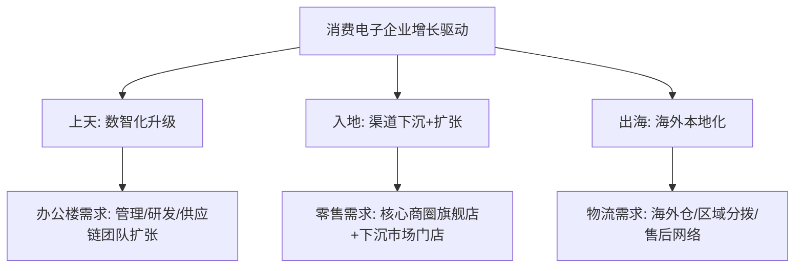

### 2. 上海长租公寓市场持续彰显韧性

#### 核心论点
上海长租公寓在租赁市场和投资市场均展现较强韧性。稳定期项目平均出租率接近90%，全年净吸纳量近5.5万套。政策支持和需求结构（人才落户、年轻家庭租住观念转变）为市场提供支撑。

#### 关键数据
- 2025年全年净吸纳量近5.5万套。
- 上海2021-2025年年均落户人才约7.4万组，远高于2016-2020年的2.1万组。
- 2025年上海共录得12宗长租公寓大宗交易，成交金额82.4亿元。

### 3. 香港零售业显现早期市场转向信号

#### 核心论点
香港零售市场正经历结构性转型：从奢侈品主导转向更均衡、以消费者为导向的格局。消费降级趋势明显，本地居民和游客购物偏好趋同，中端至大众化零售、服务类业态（证券、财富管理）和餐饮运营商逐步占据核心商圈。

#### 关键数据
- 2025年Q1本地居民商品消费仅为2018年水平的75.7%。
- 2025年上半年游客购物支出仅为2018年同期的50.7%。
- 2025年零售销售额录得1.0%的小幅增长。

---

## 五、主要城市办公楼市场摘要（精选）

### 北京
- 净吸纳量2.52万平方米，新增供应0，空置率14.9%，租金环比下降2.4%，租金同比-17.3%。
- 需求持续承压，企业成本优化为核心考量。

### 上海
- 净吸纳量20.1万平方米，新增供应22.1万平方米，空置率24.1%，租金环比-1.2%，同比-10.6%。
- 金融服务、科技互联网升级型需求活跃。

### 广州
- 净吸纳量9.15万平方米，新增供应7.49万平方米，空置率22.4%，租金环比-?，同比-9.1%。
- TMT行业引领升级需求，业主“以价换量”。

### 深圳
- 净吸纳量14.27万平方米，新增供应14.14万平方米，空置率25.9%，租金环比-2.3%，同比-11.0%。
- 消费电子等科技企业扩租活跃，第三方办公空间运营商表现活跃。

### 成都
- 净吸纳量?，新增供应0，空置率36.4%，租金环比-1.6%，同比-?。
- 金融、科技互联网、专业服务为三大支柱，游戏企业租赁活跃度增长显著。

### 香港
- 净吸纳量61.43万平方尺，新增供应0，空置率13.5%，租金环比+1.5%，同比+0.1%。
- 中环空置率降至9.6%，租金环比上涨3.8%，银行业租赁需求强劲。

### 台北
- 净吸纳量1.31万平方米，新增供应0，空置率6.4%，租金环比+0.4%，同比+0.3%。
- 科技业成为去化新供给主要动力，大面积交易占80%。

---

## 六、主要城市零售地产市场摘要（精选）

### 北京
- 净吸纳量1.85万平方米，新增供应0，空置率7.0%，租金同比-10.4%。
- 宇树科技入驻王府井银泰in88，科技品牌加速线下布局。

### 上海
- 核心商圈空置率8.1%，租金环比-0.3%至41.7元/平/天。
- 运动服饰、潮玩杂货、消费电子、平价餐饮租赁需求坚挺。

### 广州
- 市区空置率7.1%，市郊4.5%，租金同比-6.8%。
- 运动服饰、餐饮、休闲娱乐活跃。

### 深圳
- 市区空置率5.5%，租金环比-1.8%，同比-8.8%。
- 平价餐饮、服饰品牌为主要需求驱动，消费电子加快线下布局。

---

## 七、物流地产市场摘要（精选）

### 北京
- 净吸纳量12.24万平方米，新增供应35万平方米，空置率33.9%，租金环比-5.8%，同比-19.0%。
- 平台子市场集中放量，汽车、餐饮等成本敏感型租户加速外溢。

### 上海
- 净吸纳量28万平方米，新增供应0，空置率25.1%，租金环比-3.4%。
- 第三方物流主导需求，供应端明显放缓。

### 广州
- 净吸纳量8.86万平方米，新增供应26.91万平方米，空置率11.8%，租金环比-5.2%，同比-17.2%。
- 第三方物流和国内电商平台为需求主力，跨境电商向佛山整合。

---

## 八、酒店市场摘要（精选）

### 北京
- 入境游客同比增长61.3%，高端市场由入住率驱动转向平均房价拉动。
- 全年预计净增客房约1843间。

### 上海
- 入境国际游客约220万人次，同比增长28.0%。
- 五星级酒店入住率同比+2.4个百分点，ADR同比+8.2%，RevPAR同比+12.3%。

### 广州
- 高端及以上酒店ADR同比+2.5%，入住率+4.1%，RevPAR+6.7%，增幅位列全国第三。
- 广交会与五一假期重叠，预期乐观。

### 深圳
- 高端及以上酒店ADR同比+6.4%，入住率+7.7%，RevPAR+14.6%，增幅全国第二。
- APEC效应、春节“反向过年”、港人北上为主要驱动。

### 香港
- 访港旅客同比增长18.4%，内地客占比79.3%创历史新高。
- 所有酒店细分板块均录得正向RevPAR增长。

---

# 《2026年中国便利店发展报告》章节总结

## 书籍信息
- 书名：2026年中国便利店发展报告
- 作者：毕马威中国
- PDF 状态：完整
- OCR 状态：良好

## 目录说明
- 报告包含：宏观经济和消费趋势、便利店行业发展概况、便利店行业热点专题（自有品牌、下沉市场、多业态错位竞争、人工智能技术融合）、结语、联系我们。
- 本文按目录顺序总结。

## 全书核心主题
本报告基于中国连锁经营协会对73家便利店企业的调查，系统分析2025年中国便利店行业发展现状。核心发现：门店数量稳健增长，三四线城市及县域渗透率显著提升；单店日营收下降，但过半数企业通过精细化运营保持盈利；生鲜和咖啡销售占比提升；即时零售和折扣店对便利店形成冲击，企业需在商品力、价格力、便利性上错位竞争；AI技术（云值守、智能补货）正在融入日常运营；自有品牌建设和县域市场下沉成为两大战略方向。

---

## 第一章：宏观经济和消费趋势

### 核心论点
问题：2025-2026年中国宏观经济和消费市场态势如何？
观点：中国经济稳中向好，2025年GDP增长5.0%，2026年Q1增长5.0%。消费市场温和复苏，但居民收入与支出增速放缓，消费呈现K型分化（悦己消费与性价比消费并行）。服务消费和线上消费增长强劲，以旧换新政策效果放缓。

### 关键数据
- 2025年GDP达140万亿元，实际增长5.0%。
- 2025年社会消费品零售总额增长3.7%，2026年Q1增长2.4%。
- 2026年Q1居民人均消费支出实际增长2.6%，为2023年以来最低。
- 服务零售额增长5.5%，网上商品和服务零售额增长8.0%。
- 2026年Q1汽车零售额同比下滑9.1%，下拉限额以上商品零售增速2.8个百分点。
- 新能源车3月国内零售渗透率高达51.5%。

---

## 第二章：便利店行业发展概况

### 核心论点
问题：2025年中国便利店行业有哪些关键数据和趋势？
观点：头部品牌持续推进门店扩张，非加油站型便利店TOP10集中度提升；单店日营收下降至4453元；坪效小幅下降至55.1元/平/天；社区型门店扩张，商务办公区门店缩减；24小时门店数量增加；午间和深夜销售贡献崛起；生鲜和咖啡销售占比提升，鲜食和香烟占比略降；会员客单价持续攀升。

### 关键数据图表

#### 2025年中国便利店10大发现（数据摘要）
- 单店日营收：4453.0元（较上年下降）
- 平均坪效：55.1元/平/天（同比下降4.0%）
- 24小时门店数量：持续增加
- 社区型门店：持续扩张；商务办公区/商圈门店：缩减
- 即时零售开通比例：仍有六成企业谨慎观望
- 云值守技术应用比例：持续上升
- 人事费用率：持平；灵活用工比例下滑3.7个百分点
- 各时段收入贡献：早晚高峰轻微下滑，午间和深夜崛起
- 生鲜商品销售占比：提升1.1%；咖啡提升0.1%
- 会员销售占比：稳健；会员客单价持续攀升

#### 坪效分布
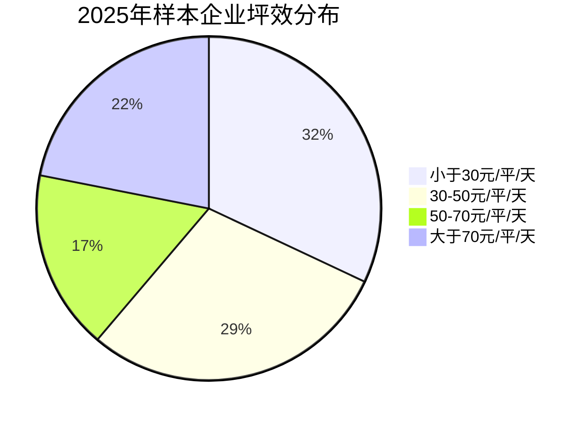

#### 利润水平
- 毛利率：同比上行0.3个百分点
- 净利率：同比上行0.2个百分点
- 主要费用构成：人工、租金、水电、营销等

---

## 第三章：便利店行业热点专题

### 热点专题1：自有品牌——从价格竞争到生态力竞争

#### 核心论点
便利店通过核心品类布局（高频、高毛利）与高效供应链管理，打造自有品牌护城河。自有品牌成为利润引擎和品牌护城河的战略升级方向。

### 热点专题2：抢占县域市场的下沉先机

#### 核心论点
政策红利（“十五五”县域经济）叠加人口基数，县域市场成为便利店新蓝海。品牌采取“低门槛整合存量资源（夫妻店整改）+供应链下沉”策略，将县域便利店从“杂货铺”升级为“社区生活服务枢纽”。

#### 县域拓展开店主要考量因素
- 城市经济水平
- 人口数量与密度
- 消费习惯
- 供应链可达性
- 竞争对手布局

### 热点专题3：便利店与多业态的错位竞争

#### 核心论点
即时零售和折扣店迅速崛起，在选址、客群、品类上与便利店高度重叠，给便利店带来挑战。便利店应发挥即时性、鲜食、自有品牌、社区服务等既有优势，在商品力、价格力、便利性上错位竞争。

#### 错位竞争策略图
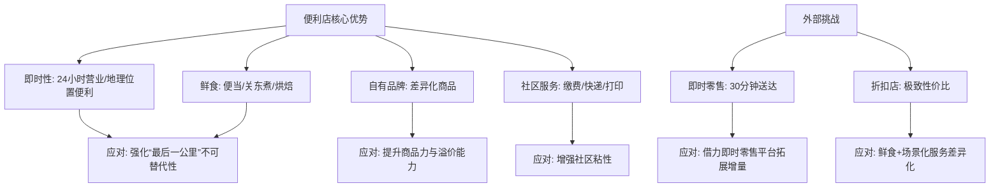

### 热点专题4：人工智能技术与便利店的深度融合

#### 核心论点
AI在便利店的应用不断扩大：智慧供应链（智能补货、库存预测）、智能门店（云值守、无人收银）、智慧运营（动态定价、个性化营销）、智能研发与生产。云值守技术将夜间时段从“成本包袱”重构为“纯利引擎”。

#### AI应用成熟度矩阵（简化）
| 应用领域 | 用例 | 成熟度 |
|---------|------|--------|
| 供应链 | 智能补货、库存预测 | 相对成熟 |
| 门店管理 | 云值守、无人收银 | 相对成熟 |
| 运营 | 动态定价、个性化推荐 | 加快步伐 |
| 研发生产 | 新品开发、质量控制 | 加快步伐 |

#### 云值守与传统人工值守对比（关键指标）
| 对比维度 | 传统人工值守 | 云值守模式 | 价值提升 |
|---------|-------------|-----------|---------|
| 月均人力成本 | 4500-5500元 | 1200-1800元 | 降低65%-70% |
| 营业时长 | 8小时（受限劳动法） | 24小时 | 增加200% |
| 人效 | 1人管1店 | 1名坐席监管3-5店 | 提升3-5倍 |
| 盗损率（夜间） | 0.8%-1.5% | <0.1% | 降低90%+ |
| 夜间销售贡献 | 无（闭店） | 15%-20%纯增量 | 新增营收 |

---

## 结语

### 核心论点
2025年GDP突破140万亿元，社零突破50万亿元，为便利店发展注入动力。消费者向“质价双优”、多样化需求转变，驱动便利店涌现新产品、新场景。未来便利店将从“商品销售渠道”转型为“社区综合服务枢纽”与“数字经济末梢神经”，AI技术将深度介入选品、定价、补货、营销全链路。

---

# 《2026全球AI眼镜行业战略洞察报告》章节总结

## 书籍信息
- 书名：2026全球AI眼镜行业战略洞察报告
- 作者：里斯战略定位咨询海外事业部 & EqualOcean
- PDF 状态：完整
- OCR 状态：良好

## 目录说明
- 报告包含：前言、第一部分（市场扫描、竞争扫描、心智扫描）、第二部分（五大核心洞察）、第三部分（挑战Meta前的战略四问）、结语。
- 本文按目录顺序总结。

## 全书核心主题
本报告聚焦全球AI眼镜行业，基于亚马逊四大站点超10000条消费者评论，从心智视角分析市场竞争格局。核心发现：全球AI眼镜出货量从2023年34万台激增至2025年870万台，Meta以85.2%市场份额暂时领先，中美二元格局形成。但报告认为Meta的成功是品牌的成功而非品类的成功，消费者心智中尚未形成清晰的品类认知。AI眼镜缺乏定义品类价值的“杀手级”场景，品类存在AI-first和AR-first两条分化路径。中国品牌需回答四大战略问题：品类定义、战略对手、差异化价值、原点人群，才有机会反超Meta。

---

## 第一部分：AI眼镜市场发展趋势解读

### 1. 市场扫描

#### 核心论点
2023年ChatGPT爆发是技术代际分水岭，AI从“新奇功能”变为“必需功能”，催生AI眼镜新品类。2026年有望成为爆发元年，2030年全球销量有望达9000万台。

#### 关键数据
- 全球AI眼镜出货量：2023年34万台 → 2025年870万台（增长超25倍）
- 2026年预计突破1000万台
- 2030年预测达9000万台
- 2025年中国AI眼镜市场规模达百万台，增速全球第一
- 2026年“国补”范围新增智能眼镜

### 2. 竞争扫描

#### 核心论点
中美二元格局形成，Meta暂时领先（85.2%市场份额），中国军团（小米、雷鸟、XREAL、Viture）紧随其后。

#### 关键数据
- Meta出货量740万台，同比增长322%，市场份额85.2%
- 全球智能眼镜前五中除Meta外其余四家来自中国

### 3. 心智扫描（10000+条评论分析）

#### 核心论点
消费者开始用“AI glasses”而非“smart glasses”描述品类，“AI”词背后购买意愿更强烈。六类消费者画像：科技爱好者（30%）、内容创作者（25%）、旅行者/商务人士（20%）、游戏玩家（15%）、价格敏感用户（15%）、视障/老年用户（5%）、尝鲜用户（5%）。购买动机前三：AI助手功能（35%+）、拍摄（30%+）、音频（25%+）。主要痛点：AI功能问题（翻译不准、响应延迟、依赖手机APP）。

#### 品牌认知扫描
- 高端阵营（>$300）：Ray-Ban Meta、XREAL、VITURE，核心竞争力为软件能力
- 中低端（$100-300）：RayNeo、Rokid，核心竞争力为硬件参数
- Ray-Ban Meta品牌词月搜索量达品类词“AI glasses”的4倍以上

#### 满意度差异
- 游戏玩家满意度最高（4.3/5），视障/老年用户（4.5/5）
- 尝鲜用户满意度最低（2.8/5），反映出品类尚未跨过“鸿沟”

---

## 第二部分：AI眼镜行业五大核心洞察

### 洞察一：品类发展初期要做大蛋糕，AI眼镜需树立行业外的战略对手

#### 核心论点
AI眼镜真正的竞争对手不是同行，而是智能手机、TWS耳机、智能手表等占据用户心智入口的“老品类”。当前消费者普遍认为AI眼镜是“手机的延伸”而非独立设备。品牌不应在品类内盲目内卷，而要抢夺老品类的心智份额。

#### 典型评论
> “功能手机都能做，眼镜能做什么手机做不到的？”（德国）
> “有了手机，为什么还需要眼镜？”（美国）

### 洞察二：品类在分化，路线有差异，中国品牌必须做出选择

#### 核心论点
AI眼镜正在分化为两条路径：AI-first（本质是AI助手，轻便、长续航、便宜）和AR-first（本质是AR显示，沉浸大屏、高性能、重体验）。两条路线对硬件、场景、价值定义完全不同。中国品牌不可同时覆盖两个方向，否则心智认知模糊。

#### 两路线对比
| 维度 | AI-first Glasses | AR-first Glasses |
|------|------------------|-------------------|
| 重量 | <100g | 80-150g |
| 价格 | $199-$799 | $299-$3299 |
| 续航 | 6-11小时 | 1.5-3小时 |
| 核心价值 | AI助手、语音交互 | AR显示、空间计算 |
| 主要场景 | 日常佩戴、通讯、信息获取 | 游戏、工业、专业工作 |
| 代表品牌 | Meta、小米 | XREAL、雷鸟、Rokid |

### 洞察三：AI眼镜缺少定义品类价值的“杀手级”场景，这是品类爆发的最大瓶颈

#### 核心论点
新品类的成功需要一个“杀手级”应用场景（如智能手机的App Store、大疆的航拍）。当前AI眼镜的场景（翻译、POV拍摄）要么不够高频，要么非刚需，要么可替代，尚未形成“非用不可”的理由。

#### 典型评论
> “出国旅游时用过几次，回来就吃灰了，日常用不上。”（美国）
> “拍照功能很酷，但视频只能录3分钟，太短了，还不如手机方便。”（美国）

### 洞察四：Meta的成功源于品牌的成功，而非品类的成功

#### 核心论点
Meta占据85.2%市场份额，但这是先发优势（领先1-2年）和社交媒体生态整合的结果，而非消费者心智中“AI眼镜=Meta”的认知。Meta作为社交媒体品牌，同时进行多条跨品类布局，存在品牌延伸风险，为其他品牌留下战略机会。

### 洞察五：品牌赢得用户的关键，不在产品领先，而在认知领先

#### 核心论点
当前行业内竞争集中在硬件参数，但用户真正缺的不是功能，而是“稳定使用理由”。AI眼镜的竞争本质是心智之争：谁能让用户理解这个产品是什么、在什么场景解决什么问题。能够率先定义品类价值的品牌将享受最大红利。

---

## 第三部分：挑战Meta前，给中国品牌的战略四问

### 问题一：你是什么？——清晰的品类定义
品类定义是所有战略的起点。AI眼镜行业目前缺乏清晰定义，品牌玩家战略失焦。需回答：你在卖“会思考的眼镜”还是“戴在眼睛上的显示器”？

### 问题二：你的生意来自哪里？——清晰的战略对手
AI眼镜真正的竞争对手是智能手机、TWS耳机、智能手表。需明确到底在抢谁的生意，这个对手是否足够明确，决定品类天花板高度。

### 问题三：你有何不同？——清晰的差异化价值
消费者最终会问：我为什么要每天戴着这副眼镜出门？当前“不想戴”的问题（外观、舒适度）已经先爆发。产品需自然融入日常生活。

### 问题四：你的顾客是谁？——清晰的原点人群
品类的终局人群可以靠想象，但原点人群必须精准。真正愿意购买的是已有明确场景、愿意为效率提升付费的人（如内容创作者、旅行者、游戏玩家），而非泛泛的尝鲜用户。

---

## 结语

### 核心论点
AI眼镜的“定义之争”尚未结束。消费者已经隐约感知到买它不是为了单一功能，而是为了一种尚未被清晰表达的体验。谁能率先找到那个词并占据这个词，谁就拿到了定义千亿赛道的钥匙。当苹果、谷歌、三星完成入场布局，当Meta找到正确的品类定义，当某个中国品牌率先完成心智占位——这场心智战争就将迎来终局。现在，它才刚刚开始。

---

# 《2025中国医务人员AI临床应用与循证决策趋势洞察报告》章节总结

## 书籍信息
- 书名：2025中国医务人员AI临床应用与循证决策趋势洞察报告
- 作者：梅斯医学（MedSci）
- PDF 状态：完整
- OCR 状态：良好

## 目录说明
- 报告包含：摘要、核心发现、第一章人群画像与采纳基线、第二章AI渗透现状与使用行为分析、第三章竞争格局、第四章核心痛点与需求图谱、第五章信任格局与国产AI评价、第六章组织变革与赋能诉求、第七章商业验证（DeepEvidence与付费生态）、第八章未来展望、第九章政策解读。
- 本文按目录顺序总结。

## 全书核心主题
本报告基于885份全国医务人员调研，揭示中国医疗AI的临床应用现状。核心发现：AI渗透率已达85.2%，市场教育基本完成；医务人员正从“通用大模型尝鲜”向“专业医学AI”加速转移；检索与总结是首要刚需，直击信息处理成本；付费意愿审慎，87.4%期望月费30元以下；医务人员对AI角色定位已形成共识——辅助而非替代；深层担忧集中于法律权责、数据安全和技术可靠性。报告提出，医疗AI的下一阶段不是继续教育用户，而是补齐临床信任链条，并围绕DeepEvidence产品验证了专业医学AI的商业路径。

---

## 摘要与核心发现

### 核心发现摘要
1. AI渗透率已达85.2%，从“尝鲜工具”跃迁为“生产力工具”。
2. 需求从“通用大模型尝鲜”向“专业医学AI”加速转移，98.1%医务人员需要专业医学AI。
3. 移动端为王，76.2%倾向使用手机端小程序。
4. “检索与总结”是首要刚需（33.8%），直击信息处理成本。
5. 付费审慎，87.4%期望免费或月费30元以下，但98.1%支持DTC模式。
6. 82.3%认为AI将替代重复性工作而非取代医生，但55.7%担心法律权责，55.0%担心数据安全。

---

## 第一章：人群画像与采纳基线

### 核心论点
当前中国医疗AI的早期主导者是来自高等级机构、高资历、高信息负荷科室的核心专业人群。这部分人群的采纳标志着医疗AI已跨过“玩具化阶段”。

### 关键数据
- 临床医生占77.3%
- 科室前五：肿瘤/血液科（10.2%）、妇产科/儿科（8.9%）、外科（8.6%）、神经内科（6.2%）、全科/老年医学科（6.0%）
- 56.0%来自公立三甲医院
- 85.1%执业超过10年
- 覆盖全国31个省市区

---

## 第二章：AI渗透现状与使用行为分析

### 核心论点
AI整体渗透率85.2%，但使用深度分层：6-10年资历群体高频使用率最高（34.1%），20年以上资历最审慎（17.6%极少使用）。公立三甲成为使用高地，基层瓶颈不是需求不足而是条件不足。制度与内网隔离是当前渗透的真正门槛（56.7%低频用户因此障碍）。

### 关键数据
- 整体渗透率85.2%（至少每周使用一次）
- 6-10年资历每日高频使用率34.1%
- 三甲医院低频/未使用率仅10.7%，基层达26.7%
- 低频/非用户中仅4.2%认为AI无用，56.7%因内网隔离

---

## 第三章：竞争格局：AI工具的生态分化

### 核心论点
通用大模型（DeepSeek断层领先，使用率48.6%）占据入口，专业医学AI（45.2%）紧随其后。通用模型吃到的是“院内空窗期红利”，专业医学AI需更低摩擦切入真实工作流。手机端/小程序占76.2%，关键词搜索仍是主流交互方式（47.0%）。

### 关键数据
- 通用大模型使用率55.9%，专业医学AI 45.2%，院内AI系统31.8%
- DeepSeek在通用模型中占91.3%（使用过通用模型的群体中）
- 专业医学AI格局：梅斯系列34.0%，丁香园AI 21.0%，医脉通AI 20.5%
- 60.6%受访者认为医院引入AI“太慢”

---

## 第四章：核心痛点与需求图谱

### 核心论点
医生面临的核心困境不是“知识不够”，而是“知识过载下的处理失速”。最希望AI辅助的临床环节是“治疗方案选择”（34.1%）和“鉴别诊断”（27.5%）。文献研读是共识最强、阻力最小的规模化落地场景（97.7%希望AI提升文献研读效率）。

### 关键数据
- 临床决策主要阻碍：检索与总结耗时33.8%，信息获取滞后26.8%
- 完美AI助手功能需求：临床决策支持85.6%（断层领先），辅助检查判决61.8%
- 74.4%受访者每周文献阅读不足3小时
- 97.7%希望借助AI提升文献研读效率

---

## 第五章：信任格局与国产AI评价

### 核心论点
国产临床AI满意度43.2%（满意及以上），54.5%认为“一般/勉强能用”。医生最期待提升的能力：契合国内医保报销政策（74.2%）、精准检索中文权威指南（73.3%）、结合国内药物实际供应（66.3%）。97.5%使用后会进行二次核实，越谨慎的用户付费意愿越高。深层担忧：法律权责（55.7%）、数据安全（55.0%）、技术可靠性（54.0%）。

### 关键数据
- 国产AI满意度：满意及以上43.2%，一般/勉强能用54.5%
- 最亟待提升能力：医保政策适配74.2%，中文指南检索73.3%，药物供应结合66.3%
- 二次核实习惯：97.5%会核实
- 担忧TOP3：法律权责55.7%，数据安全55.0%，技术可靠性54.0%

---

## 第六章：组织变革与赋能诉求

### 核心论点
60.6%认为医院引入AI太慢，90.2%表示在AI工具选择上缺乏话语权。97.6%认为工具选择自主权会提升职业满意度。94.1%呼吁医院提供AI工具津贴，98.1%支持DTC模式。组织响应滞后于一线需求。

### 关键数据
- 认为医院引入AI“太慢”：60.6%
- 缺乏工具选择话语权：90.2%
- 自主权提升职业满意度：97.6%（其中近六成认为“大幅提升”）
- 医院应提供AI津贴：94.1%
- 支持DTC专业医学AI：98.1%，近七成愿付费，但57.5%承受力在30元/月以下

---

## 第七章：商业验证：DeepEvidence与付费生态

### 核心论点
DeepEvidence在全体受访者中渗透率26.7%，使用人群中满意+非常满意占68.2%。未使用者中78.3%在明确价值主张后表示“非常愿意”尝试。付费基础已形成，但为“高意愿、低客单价”结构（57.3%接受30元/月以下）。使用频率与付费意愿正相关，每日高频用户中77.0%愿付费。89.2%可接受商业信息展示，底部资讯最受欢迎（52.1%）。

### 关键数据
- DeepEvidence渗透率26.7%，满意度68.2%
- 明确价值主张后尝试意愿78.3%
- 愿付费比例约70%，其中57.3%接受30元/月以下
- 每日高频用户付费意愿77.0%
- 可接受商业信息展示：89.2%，底部资讯52.1%最受接受

---

## 第八章：未来展望：协作共识与风险预期

### 核心论点
超过八成受访者认为AI将取代重复性工作而非取代医生，83.7%相信AI将帮助患者更健康。AI有望成为沟通增效器（患者教育53.8%、节省沟通51.4%），但也有93.7%担忧患者可能依据AI质疑医生判断。年轻医生更乐观（78.7%认为改善医患关系），中段资历感受更强张力。

### 关键数据
- AI将取代重复性工作而非医生：82.3%
- AI最终将帮助患者更健康：83.7%
- AI有望改善医患关系：60%+
- 担忧患者依据AI质疑医生判断：93.7%
- 年轻医生（5年以下）乐观比例：78.7%

---

## 第九章：政策解读：“十五五”定调“人工智能+”

### 核心论点
国家政策已明确将AI应用延伸到辅助诊疗等核心医疗场景；开始正面回应权责与数据问题；推动医院从“个人外挂”走向“机构底座”；政策奖励的是更深融合、更贴近本土场景的能力。医疗AI正在从探索期走向制度化落地期。

### 关键政策文件
- 国务院《关于深入实施“人工智能+”行动的意见》（国发〔2025〕11号）
- 国家卫健委等部门《关于促进和规范“人工智能+医疗卫生”应用发展的实施意见》（2025年11月）
- “十五五”规划纲要：有序推动数智技术在辅助诊疗、精准医疗、健康管理等场景的应用

---

## 结语

### 核心论点
2025年中国医疗AI已走过了“要不要用”的争论阶段，2026年正在进入“怎么用好、用得安全”的深水区。医务人员期待AI帮助减轻信息过载、缩短循证路径，同时坚守患者安全、责任边界和合规底线。能够在“效率、安全、合规”三角中找到精准着陆点的产品与机构，将率先赢得长久信赖。