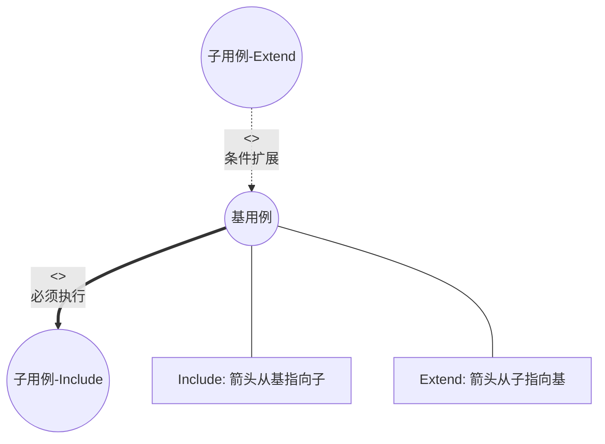
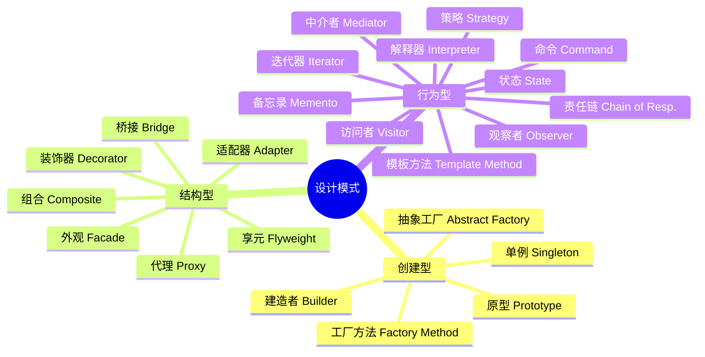
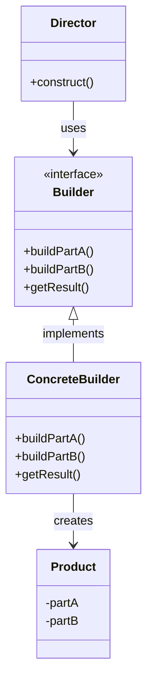

# 《面向对象技术》章节总结

## 书籍信息
- **书名**：面向对象技术（基于上传文件内容推断，可能为软考或计算机等级考试辅导资料章节）
- **作者**：未明确标注（文档内容为教学课件或辅导资料风格）
- **PDF 状态**：文本提取完整，结构清晰
- **OCR 状态**：良好，无明显错漏

## 目录说明
- **目录识别情况**：文档无传统图书目录，但具有清晰的逻辑层级，分为“面向对象的基本概念”、“统一建模语言(UML)”、“设计模式”三大核心板块，并穿插典型真题。
- **章节对应依据**：根据内容主题划分为三个主要部分进行结构化整理。
- **OCR 修复说明**：内容完整，无需特殊修复。

## 全书核心主题
本书/文档系统阐述了面向对象技术（Object-Oriented Technology）的核心理论与实践应用。首先定义了面向对象的基本要素：对象、类、继承、多态及封装，并详细解释了访问控制与静态/动态成员的区别。其次，深入介绍了统一建模语言（UML），涵盖静态模型（类图、对象图、构件图、部署图、包图）和动态模型（用例图、序列图、通信图、状态图、活动图），重点解析了各类图中的关系（如依赖、泛化、关联、聚合、组合、实现）。最后，系统总结了23种经典设计模式，将其分为创建型、结构型和行为型三类，并对每种模式的定义、适用场景及典型案例进行了简要说明。文档旨在帮助读者建立完整的面向对象知识体系，并通过真题强化对关键概念（如多态类型、类分类、UML图识别、设计模式选择）的理解。

---

## 第一部分：面向对象的基本概念

### 1. 核心论点
本章解决“什么是面向对象”以及“其核心机制如何运作”的问题。
作者观点：面向对象由对象、分类、继承和消息通信构成；封装实现了使用者与生产者的分离；继承建立了类的层次结构；多态通过动态绑定实现了同一操作在不同对象上的不同解释。

### 2. 关键概念/事件

- **对象 (Object)**：属性（数据）和操作（方法）的封装体。由对象名、属性、操作组成。内部实现对用户隐蔽。
- **类 (Class)**：具有相同属性和操作的对象的集合。由类名、属性、操作组成。抽象类不能实例化，需子类覆盖所有抽象方法后方可实例化。
- **继承 (Inheritance)**：表示“is-a”关系。单一继承（一个父类）与多重继承（多个父类）。子类可替换父类对象出现的地方。
- **多态 (Polymorphism)**：同一操作作用于不同对象产生不同结果。依赖于动态绑定。
    - **参数多态**：最纯的多态，同一函数用于不同类型。
    - **包含多态**：子类型化，运行时类型检查。
    - **过载多态 (Overloading)**：同名不同义，编译时消除模糊。
    - **强制多态**：类型隐式或显式转换以符合函数要求。
- **访问控制**：
    - `private`：仅类内成员函数可访问。
    - `public`：所有函数可访问。
    - `protected`：类及其子类成员函数可访问。
- **静态成员**：使用 `static` 修饰，属于类而非实例，所有实例共享。

### 3. 逻辑推演/叙事脉络
文章从面向对象的定义出发，依次拆解其四大支柱。首先定义**对象**为封装体，强调其隐蔽性；进而引出**类**作为对象的模板，区分了具体类与抽象类；接着阐述**继承**机制，说明了代码复用和层次结构的构建，并指出了C++中默认私有继承的特性；随后深入**多态**，区分了静态绑定与动态 binding，并细分了四种多态形式；最后补充了类的定义细节，包括访问权限修饰符和静态成员的特性，形成了从宏观概念到微观实现的完整逻辑链。

### 4. 经典金句/数据

> “面向对象=对象+分类+继承+通过消息的通信”

> “封装目的是使对象的使用者和生产者分离，使对象的定义和实现分开。”

> “在运行过程中，当一个对象发送消息请求服务时，要根据接收对象的具体情况将请求的操作与实现的方法连接，即动态绑定。”

---

## 第二部分：统一建模语言 (UML)

### 1. 核心论点
本章解决“如何可视化地描述软件系统结构与行为”的问题。
作者观点：UML通过静态模型（结构）和动态模型（行为）全方位支持软件开发各阶段。不同的图（如类图、序列图、用例图）服务于不同的建模目的，正确理解图中元素及其关系（如聚合vs组合）是准确建模的关键。

### 2. 关键概念/事件

- **UML事务**：结构事务（名词）、行为事务（动词）、分组事务（包）、注释事务。
- **用例图 (Use Case Diagram)**：需求分析阶段使用。由参与者、用例、边界及关系组成。
    - **Include**：基用例必须执行子用例，箭头从基指向子。
    - **Extend**：基用例可独立完整，子用例扩展基用例，箭头从子指向基。
- **类图 (Class Diagram)**：静态视图。展示对象、接口、协作及关系。
    - **类的分类**：实体类（数据持久化）、控制类（业务逻辑协调）、边界类（用户交互界面）。
    - **关系类型**：
        - **依赖 (Dependency)**：虚线箭头，偶然性、临时性使用。
        - **泛化 (Generalization)**：实线空心三角，继承关系。
        - **关联 (Association)**：实线，结构性拥有关系。
        - **聚合 (Aggregation)**：空心菱形，弱整体-部分，生命周期独立。
        - **组合 (Composition)**：实心菱形，强整体-部分，生命周期一致。
        - **实现 (Realization)**：虚线空心三角，类实现接口。
- **对象图 (Object Diagram)**：类图的实例快照，显示某一时刻的对象状态。
- **交互图**：
    - **序列图 (Sequence Diagram)**：强调消息的时间顺序。
    - **通信图 (Communication/Collaboration Diagram)**：强调对象间的结构组织。
- **状态图 (State Diagram)**：描述对象状态及事件引起的转移。
- **活动图 (Activity Diagram)**：描述控制流和数据流，本质是流程图。
- **构件图 (Component Diagram)**：体现复用思想，展示物理模块（dll, exe等）。
- **部署图 (Deployment Diagram)**：展示软硬件物理架构及节点分布。
- **包图 (Package Diagram)**：高层架构模块化，组织源码。

### 3. 逻辑推演/叙事脉络
本部分首先介绍UML的总体分类（静态/动态）。接着按重要性逐一解析各类图：
1. 从需求分析的**用例图**开始，区分包含与扩展关系。
2. 进入核心静态模型**类图**，详细辨析六种关键关系，特别是聚合与组合的生命周期区别，以及三类角色（实体、控制、边界）的定义。
3. 对比**对象图**与类图的差异。
4. 转入动态模型，对比**序列图**（时序）与**通信图**（结构），简述状态图、活动图、构件图、部署图和包图的用途。
5. 最后通过真题巩固对多态、类分类及UML图识别的理解。

### 4. 流程图/图表重建

#### UML类图关系示意

```mermaid
graph LR
    subgraph 继承与实现
    A[子类] -->|泛化 Generalization<br/>实线空心三角| B(父类)
    C[类] -->|实现 Realization<br/>虚线空心三角| D(接口)
    end

    subgraph 依赖与关联
    E[类A] -.->|依赖 Dependency<br/>虚线箭头| F[类B]
    G[类A] --->|关联 Association<br/>实线| H[类B]
    end

    subgraph 整体与部分
    I[整体] o--|聚合 Aggregation<br/>空心菱形| J[部分]
    K[整体] *--|组合 Composition<br/>实心菱形| L[部分]
    end
    
    style B fill:#f9f,stroke:#333,stroke-width:2px
    style D fill:#f9f,stroke:#333,stroke-width:2px
```

#### 用例关系示意



### 5. 经典金句/数据

> “类图是静态视图... 展现了一组对象、接口、协作和它们之间的关系。”

> “聚合... 整体与部分之间是可分离的... 组合... 整体与部分是不可分的，整体的生命周期结束也就意味着部分的生命周期结束。”

> “序列图强调消息时间顺序的交互... 通信图强调接收和发送信息的对象的结构组织的交互。”

---

## 第三部分：设计模式

### 1. 核心论点
本章解决“如何提高代码重用性、可理解性和可靠性”的问题。
作者观点：设计模式是经过分类的代码设计经验总结。通过23种标准模式，分别解决对象创建、结构组合和行为交互中的常见问题，使软件工程化。

### 2. 关键概念/事件

- **创建型模式 (5种)**：关注对象创建过程。
    - **单例 (Singleton)**：保证唯一实例，全局访问点。
    - **工厂方法 (Factory Method)**：子类决定实例化哪个类。
    - **抽象工厂 (Abstract Factory)**：创建一系列相关/依赖对象。
    - **建造者 (Builder)**：分离复杂对象构建与表示。
    - **原型 (Prototype)**：通过拷贝原型创建新对象。
- **结构型模式 (7种)**：关注类或对象的组合。
    - **适配器 (Adapter)**：转换接口以兼容。
    - **桥接 (Bridge)**：分离抽象与实现，使其独立变化。
    - **组合 (Composite)**：树形结构表示部分-整体，一致对待。
    - **装饰器 (Decorator)**：动态添加职责，比继承灵活。
    - **外观 (Facade)**：提供高层接口，简化子系统交互。
    - **享元 (Flyweight)**：共享技术支撑大量细粒度对象。
    - **代理 (Proxy)**：控制对对象的访问。
- **行为型模式 (11种)**：关注对象间交互与职责分配。
    - **策略 (Strategy)**：封装算法，可相互替换。
    - **模板方法 (Template Method)**：定义算法骨架，子类实现步骤。
    - **观察者 (Observer)**：一对多依赖，状态改变自动通知。
    - **迭代器 (Iterator)**：顺序访问聚合元素，不暴露内部。
    - **责任链 (Chain of Responsibility)**：请求沿链传递，直到被处理。
    - **命令 (Command)**：请求封装为对象，支持撤销/排队。
    - **备忘录 (Memento)**：捕获并恢复对象内部状态。
    - **状态 (State)**：对象内部状态改变时改变其行为。
    - **访问者 (Visitor)**：在不改变元素类的前提下定义新操作。
    - **中介者 (Mediator)**：封装对象交互，解耦同事对象。
    - **解释器 (Interpreter)**：定义语言文法并解释句子。

### 3. 逻辑推演/叙事脉络
本部分首先给出设计模式的定义与目的，并按创建型、结构型、行为型三大类列出所有模式及其口诀。随后，对每种模式进行详细解读：
1. **创建型**：从单例的唯一性到工厂的延迟实例化，再到建造者的步骤分离，重点在于“如何创建”。
2. **结构型**：从适配器的接口转换到桥接的解耦，再到组合的树形结构，重点在于“如何组合”。特别区分了代理、适配器和外观模式的异同。
3. **行为型**：从策略的算法替换到观察者的通知机制，再到命令的请求封装，重点在于“如何交互”。
4. 最后通过真题验证对命令模式、桥接模式等特定场景的应用能力。

### 4. 流程图/图表重建

#### 设计模式分类体系



#### 建造者模式结构



### 5. 经典金句/数据

> “设计模式是一套被反复使用、多数人知晓的、经过分类的、代码设计经验的总结。”

> “装饰器模式... 是在不改变原类文件和使用继承的情况下，动态地扩展一个对象的功能。”

> “命令模式... 将一个请求封装成一个对象，从而使得用不同的请求对客户进行参数化... 支持可撤销的操作。”

> “桥接模式... 将抽象部分与它的实现部分分离，使它们都可以独立地变化。”

---

## 附录：典型真题解析摘要

### 1. 多态类型辨析
- **题目**：操作名称相同，上下文不同含义不同，属于哪种多态？
- **答案**：**过载多态 (Overloading)**。
- **解析**：参数多态是通用形式；包含多态涉及子类型；强制多态涉及类型转换；过载多态指同名在不同上下文有不同语义。

### 2. 类分类应用
- **题目**：销售系统中，客户类和二维码类分别属于什么类？
- **答案**：客户类 -> **实体类 (Entity)**；二维码类 -> **边界类/接口类 (Boundary/Interface)**。
- **解析**：客户是现实实体，需持久化；二维码是用户与系统交互的媒介（类似条形码、窗口）。

### 3. UML图识别
- **题目**：展示对象间消息流及顺序，且强调结构组织的图？
- **答案**：**通信图 (Communication Diagram)**。
- **解析**：序列图强调时序；通信图强调对象间的链接结构和消息传递。获取位置消息通常标记为序号（如 2.1: getCarLocation()）。

### 4. 设计模式选择
- **题目**：Web应用框架，需支持不同应用（博客/商店）和不同主题（浅/深），解耦抽象与实现？
- **答案**：**桥接模式 (Bridge)**。
- **解析**：桥接模式核心意图是将抽象部分（Web应用）与实现部分（主题样式）分离，使二者可独立变化。主要接口是抽象部分的引用（WebApplication）。