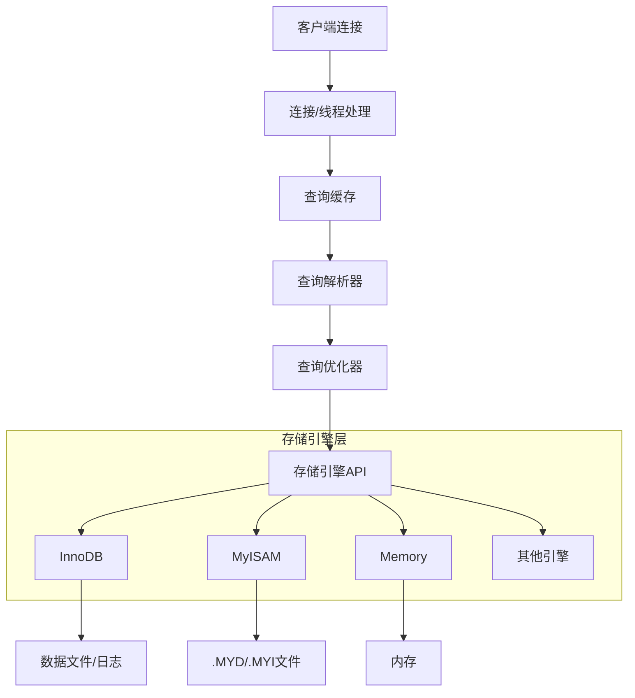
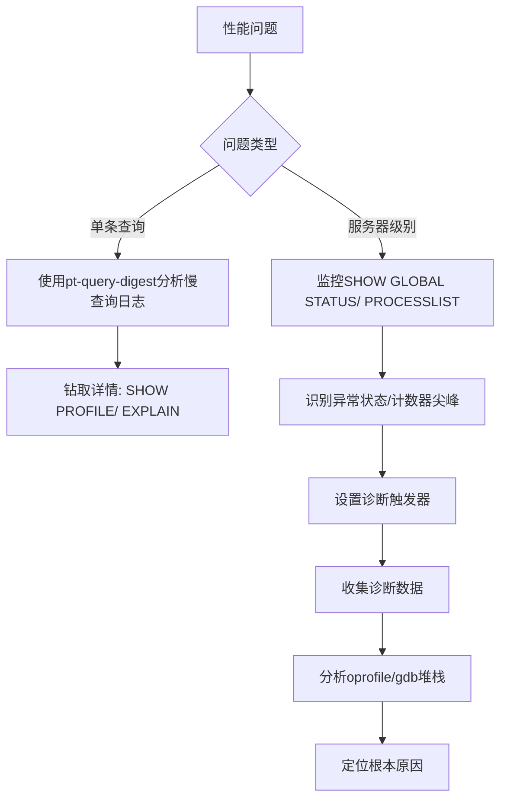
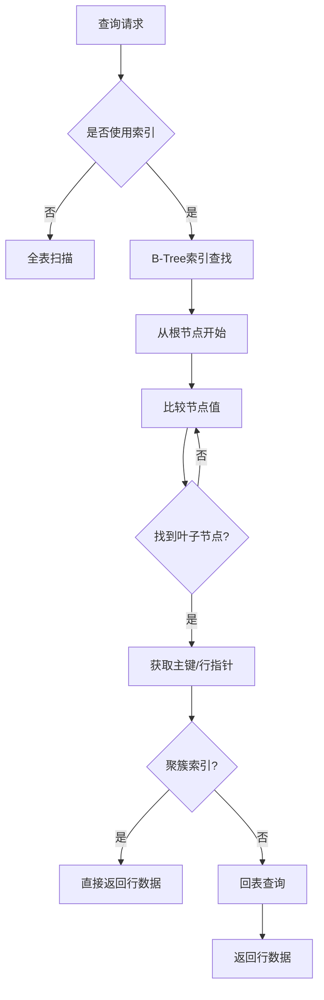
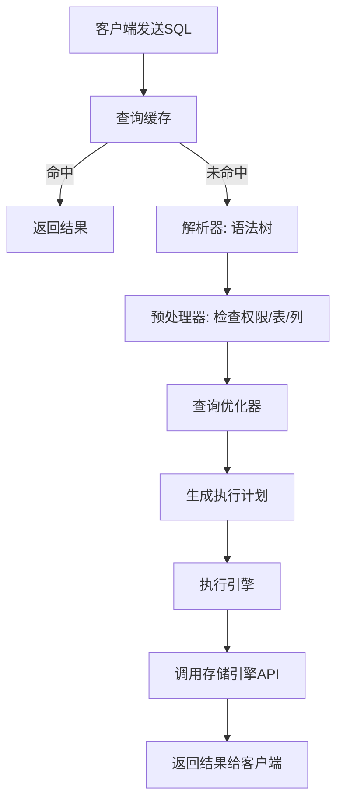
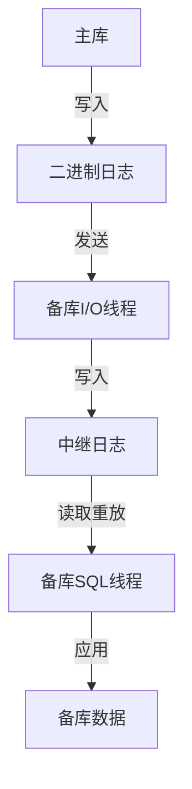
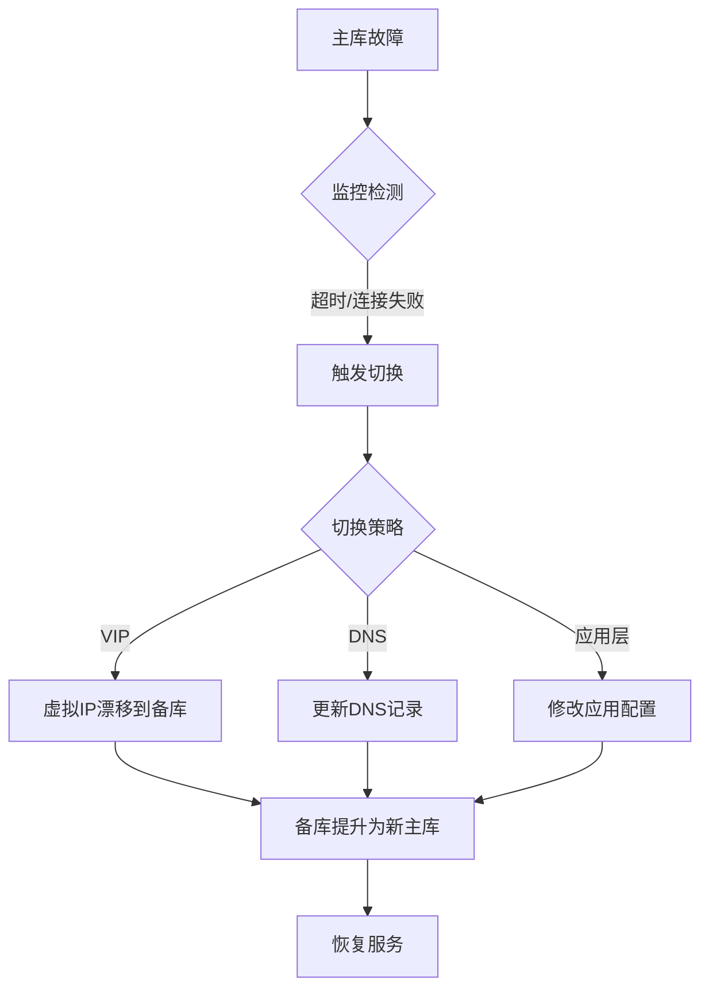
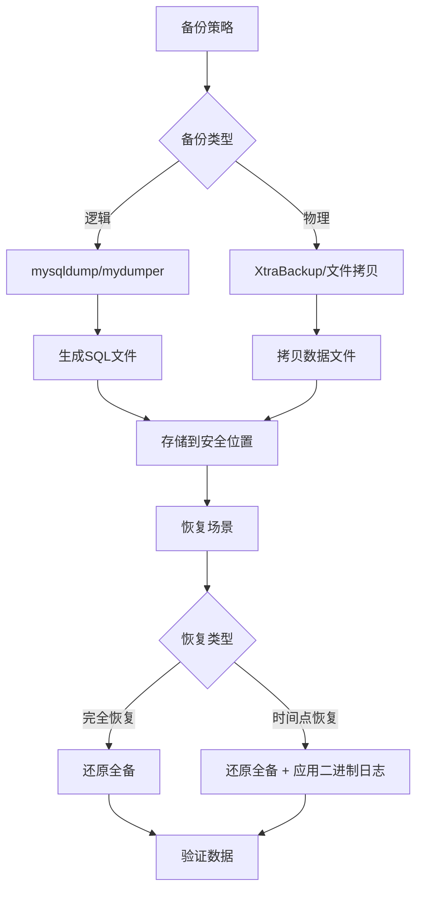

# 《高性能MySQL(第3版)》章节总结

## 书籍信息
- **书名**：高性能MySQL(第3版) (High Performance MySQL, Third Edition)
- **作者**：Baron Schwartz, Peter Zaitsev, Vadim Tkachenko
- **译者**：宁海元、周振兴、彭立勋、翟卫祥、刘辉
- **PDF状态**：完整，包含正文、目录、附录
- **OCR状态**：正常

## 目录说明
- 目录识别情况：完整识别
- 章节对应依据：原书目录

## 全书核心主题

本书是MySQL领域的经典著作，第3版全面更新，涵盖MySQL 5.5版本的新特性，以及固态盘、高可扩展性设计和云计算环境下的数据库相关内容。

全书围绕“高性能”这一核心目标展开，从MySQL架构与历史出发，逐步深入到：基准测试与性能剖析、Schema与数据类型优化、高性能索引构建、查询性能优化、高级特性（分区、视图、存储过程、字符集等）、服务器配置优化、操作系统与硬件优化、复制、可扩展性、高可用性、云端MySQL、应用层优化、备份与恢复，以及用户工具。

核心理念：性能即响应时间，优化必须基于测量，理解MySQL内部机制是高效使用的前提。

---

## 第1章：MySQL架构与历史

### 1. 核心论点
- **问题**：如何理解MySQL的独特架构以实现高性能？
- **观点**：MySQL最重要、最与众不同的特性是其存储引擎架构，它将查询处理与数据存储/提取相分离，提供了极大的灵活性。

### 2. 关键概念
- **逻辑架构**：MySQL分为三层——客户端/服务器连接层、核心服务层（查询解析、优化、缓存等）、存储引擎层。
- **并发控制**：通过读写锁实现。读锁是共享的，写锁是排他的。锁粒度包括表锁和行级锁。
- **事务**：ACID（原子性、一致性、隔离性、持久性）。MySQL默认隔离级别为REPEATABLE READ。
- **MVCC（多版本并发控制）**：通过保存数据在某个时间点的快照实现非阻塞读操作，只在REPEATABLE READ和READ COMMITTED级别下工作。
- **存储引擎**：InnoDB是默认的事务型引擎，支持行级锁、MVCC、热备份等；MyISAM不支持事务和行级锁，但支持全文索引和压缩。

### 3. 逻辑推演
1. **架构介绍**：首先展示MySQL逻辑架构的三层模型，明确各层职责。
2. **并发控制机制**：解释读写锁和锁粒度的权衡，引出事务的必要性。
3. **事务详解**：深入ACID属性、四种隔离级别、死锁处理、事务日志（预写式日志）。
4. **MVCC原理**：说明InnoDB如何通过隐藏列（创建版本、删除版本）实现非阻塞读。
5. **存储引擎对比**：详细介绍InnoDB与MyISAM的特点，以及Archive、Blackhole、CSV、Memory、Merge、NDB等内建引擎。
6. **引擎选择建议**：除非有特别需要，否则优先选择InnoDB。

### 4. 流程图

### 5. 经典金句
> “InnoDB对于95%以上的用户来说都是最佳选择，所以其他的存储引擎可能只是让事情变得复杂难搞。” (p.33)

> “除非需要用到某些InnoDB不具备的特性，并且没有其他办法可以替代，否则都应该优先选择InnoDB引擎。” (p.24)

---

## 第2章：MySQL基准测试

### 1. 核心论点
- **问题**：如何评估MySQL在不同负载下的表现？
- **观点**：基准测试是唯一方便有效的、可以学习系统在给定工作负载下会发生什么的方法。

### 2. 关键概念
- **吞吐量**：单位时间内的事务处理数（TPS/TPM）。
- **响应时间/延迟**：任务所需的整体时间，常用百分比响应时间（如95%）。
- **并发性**：同时工作中的操作数，而非连接数。
- **可扩展性**：增加资源时性能的提升能力。
- **集成式vs单组件式测试**：针对整个系统 vs 单独测试MySQL。

### 3. 逻辑推演
1. **基准测试目的**：验证假设、重现异常、测试当前运行情况、模拟更高负载、规划业务增长、测试不同配置。
2. **策略选择**：整体测试更真实，但难度大；单组件测试更简单，适合特定场景。
3. **关键指标**：吞吐量、响应时间、并发性、可扩展性。
4. **常见错误**：使用数据子集、错误分布、单用户测试、忽略预热、测试时间太短等。
5. **方法流程**：设计规划→确定测试时长→收集系统状态→确保准确性→运行并分析。
6. **工具推荐**：sysbench（最推荐）、http_load、MySQL Benchmark Suite、dbt2、Percona TPCC-MySQL。

### 4. 经典金句
> “基准测试的一个重要问题在于其不是真实压力的测试。” (p.36)

> “如果你还没有做过基准测试，那么建议至少要熟悉sysbench。” (p.66)

---

## 第3章：服务器性能剖析

### 1. 核心论点
- **问题**：如何诊断MySQL性能问题？
- **观点**：专注于测量服务器的时间花费在哪里，使用性能剖析技术，以响应时间为核心指标。

### 2. 关键概念
- **性能定义**：完成某件任务所需要的时间度量，即响应时间。
- **性能剖析**：测量和分析时间花费的主要方法，分两步：测量时间→统计排序。
- **执行时间 vs 等待时间**：任务时间分为执行和等待，需要不同工具诊断。
- **慢查询日志**：开销最低、精度最高的测量工具（MySQL 5.1后可设置long_query_time=0捕获所有查询）。
- **pt-query-digest**：分析MySQL查询日志最有力的工具。

### 3. 逻辑推演
1. **重新定义性能**：摒弃CPU利用率等误解，聚焦响应时间。
2. **测量原则**：无法测量就无法优化，90%的时间应用来测量。
3. **性能剖析方法**：基于执行时间或基于等待时间。
4. **工具应用**：
   - 应用程序层：New Relic、xhprof、Ifp
   - MySQL层：慢查询日志、SHOW PROFILE、SHOW STATUS、Performance Schema
   - 系统层：oprofile、strace、gdb
5. **间歇性问题诊断**：使用SHOW GLOBAL STATUS、SHOW PROCESSLIST、查询日志的波动识别问题。
6. **案例学习**：通过诊断数据（iostat、oprofile、堆栈跟踪）找到缓存失效导致的I/O风暴。

### 4. 流程图

### 5. 经典金句
> “如果无法测量就无法有效地优化，所以性能优化工作需要基于高质量、全方位及完整的响应时间测量。” (p.69)

> “有两种消耗时间的操作：工作或者等待。大多数剖析器只能测量因为工作而消耗的时间，所以等待分析有时候是很有用的补充。” (p.108)

---

## 第4章：Schema与数据类型优化

### 1. 核心论点
- **问题**：如何设计MySQL的Schema和选择数据类型以实现高性能？
- **观点**：良好的逻辑设计和物理设计是高性能的基石，应选择优化的数据类型、权衡范式与反范式。

### 2. 关键概念
- **数据类型选择原则**：更小通常更好、简单就好、尽量避免NULL。
- **整数类型**：TINYINT、SMALLINT、MEDIUMINT、INT、BIGINT，支持UNSIGNED。
- **实数类型**：FLOAT/DOUBLE（浮点近似计算）、DECIMAL（精确计算）。
- **字符串类型**：VARCHAR（可变长，节省空间）、CHAR（定长，适合短字符串）、BLOB/TEXT（大对象，有特殊处理）。
- **日期时间**：DATETIME（范围大，8字节）、TIMESTAMP（范围小，4字节，带时区）。
- **范式与反范式**：范式化减少冗余，但需关联；反范式化避免关联，但可能冗余。

### 3. 逻辑推演
1. **数据类型优化原则**：更小、更简单、尽量避免NULL。
2. **具体类型详解**：整数（类型选择、UNSIGNED）、实数（精度问题）、字符串（VARCHAR/CHAR/BLOB/TEXT的区别和适用场景）、日期时间（DATETIME vs TIMESTAMP）。
3. **特殊技巧**：使用ENUM代替字符串、用整数存储IP地址、用BIGINT存储精确货币。
4. **Schema设计陷阱**：太多列、太多关联（EAV）、滥用ENUM/SET、不当的NULL使用。
5. **范式化讨论**：范式化的优点（更新快、表小）与缺点（需要关联）；反范式化的优点（避免关联）与缺点（冗余）。
6. **混用策略**：复制/缓存特定列、使用汇总表/缓存表。
7. **ALTER TABLE优化**：修改.frm文件技巧、快速创建MyISAM索引。

### 4. 经典金句
> “更小的通常更好。一般情况下，应该尽量使用可以正确存储数据的最小数据类型。” (p.111)

> “范式是好的，但是反范式化有时也是必需的，并且能带来好处。” (p.140)

---

## 第5章：创建高性能的索引

### 1. 核心论点
- **问题**：如何创建高效的索引？
- **观点**：索引是查询性能优化最有效的手段，需要深入理解B-Tree索引的工作原理和策略。

### 2. 关键概念
- **B-Tree索引**：最常见的索引类型，按顺序存储值，适用于全键值、键值范围或键前缀查找。限制：最左前缀、不能跳过列、范围条件右侧列无法使用索引。
- **哈希索引**：基于哈希表，精确匹配才有效，只支持等值比较。Memory引擎支持。
- **索引选择性**：不重复的索引值与总记录数的比值，越高越好。
- **前缀索引**：索引列开始部分字符，节约空间但降低选择性。
- **聚簇索引**：数据行和索引键值紧凑存储在一起（InnoDB主键），优点：相关数据在一起、访问快；缺点：插入依赖顺序、页分裂。
- **覆盖索引**：索引包含查询所需的所有列，无需回表。
- **索引合并**：MySQL 5.0+可使用多个单列索引，但通常说明索引建得糟糕。

### 3. 逻辑推演
1. **索引基础**：类比书籍索引，解释B-Tree数据结构。
2. **索引类型**：B-Tree、哈希、空间索引、全文索引。
3. **索引优点**：减少扫描、避免排序和临时表、变随机I/O为顺序I/O。
4. **高性能策略**：
   - 独立列：索引列不能是表达式或函数的一部分。
   - 前缀索引：计算选择性，选择合适长度。
   - 多列索引：不要为每列建独立索引，考虑索引合并的弊端。
   - 列顺序：选择性最高的列放最前，但需考虑排序和分组。
   - 聚簇索引：理解InnoDB vs MyISAM数据分布，尽量使用自增主键，避免UUID。
   - 覆盖索引：查询只访问索引。
   - 索引排序：索引顺序需与ORDER BY一致。
5. **索引维护**：检查损坏、更新统计信息、减少碎片（OPTIMIZE TABLE）。

### 4. 流程图

### 5. 经典金句
> “索引能够轻易将查询性能提高几个数量级，‘最优’的索引有时比一个‘好的’索引性能要好两个数量级。” (p.141)

> “在InnoDB表中按主键顺序插入行，避免使用UUID作为聚簇索引。” (p.170)

---

## 第6章：查询性能优化

### 1. 核心论点
- **问题**：查询为什么慢，以及如何优化？
- **观点**：查询优化需要理解MySQL执行过程，重构查询方式，利用索引和优化器特性。

### 2. 关键概念
- **慢查询基础**：优化数据访问，确认是否请求了不需要的数据（多行、多列、重复查询），是否扫描了额外记录。
- **重构查询**：复杂查询拆分为多个简单查询、切分查询（分批）、分解关联查询。
- **查询执行过程**：客户端→查询缓存→解析器→优化器→执行引擎→返回结果。
- **关联查询**：MySQL对任何关联都执行嵌套循环关联。
- **优化器限制**：关联子查询性能差、UNION限制、索引合并、哈希关联不支持等。
- **查询优化器提示**：HIGH_PRIORITY、SQL_CACHE、SQL_NO_CACHE、FORCE INDEX等。

### 3. 逻辑推演
1. **问题根源**：查询慢是因为在操作大量数据，需确认是否请求了不需要的数据、扫描了额外记录。
2. **衡量指标**：响应时间、扫描行数、返回行数。
3. **重构方式**：
   - 一个复杂查询 vs 多个简单查询（MySQL更擅长简单查询）
   - 切分查询：分批删除/更新，减少锁影响
   - 分解关联查询：在应用层做关联，提高缓存效率
4. **执行过程详解**：协议、查询缓存、解析与预处理、优化器（统计、执行计划）、执行引擎、返回结果。
5. **优化器局限性及对策**：IN()性能、关联子查询改写为JOIN、UNION ALL、最大值/最小值优化等。
6. **特定类型查询优化**：
   - COUNT()：COUNT(*)≈COUNT(1)，避免COUNT(列)
   - 关联查询：确保ON/USING列有索引
   - GROUP BY：利用索引、使用派生表
   - LIMIT分页：延迟关联、书签记录
   - UNION：使用UNION ALL
   - 用户变量：巧用但需注意限制

### 4. 流程图

### 5. 经典金句
> “MySQL的关联查询，实际上是在执行嵌套循环操作。” (p.206)

> “在优化查询时，需要好的度量工具，理解MySQL如何执行查询，并知道如何改写查询以利用MySQL的特性。” (p.195)

---

## 第7章：MySQL高级特性

### 1. 核心论点
- **问题**：MySQL的高级特性（分区、视图、存储过程、字符集等）如何工作，如何影响性能？
- **观点**：理解这些特性的实现细节，才能正确使用并避免性能陷阱。

### 2. 关键概念
- **分区表**：将表分解为多个更小的片段，对应用透明。类型：RANGE、LIST、HASH、KEY。
- **视图**：命名的查询，不存储数据，可更新视图有限制。
- **外键约束**：InnoDB支持，保证数据完整性，但增加开销。
- **存储过程/函数/触发器/事件**：在MySQL内部存储代码，减少网络流量但增加数据库服务器负载。
- **游标**：在存储过程中逐行处理结果集，效率低。
- **绑定变量**：预解析SQL，提升安全性和性能。
- **字符集和校对**：字符集（encoding）和排序规则，影响存储和比较。
- **全文索引**：MyISAM支持，基于分词；5.6+ InnoDB也开始支持。
- **查询缓存**：缓存SELECT结果，但在高并发写入场景下效率低。

### 3. 逻辑推演
1. **分区表**：原理（分区独立）、类型、适用场景（表非常大、数据有生命周期）、问题（NULL、分区列冲突、打开文件数、锁）。
2. **视图**：算法（MERGE/TEMPTABLE/UNDEFINED）、性能影响（临时表）、限制（不能有子查询等）。
3. **存储代码**：存储过程（减少网络）、触发器（自动执行）、事件（定时任务），注意调试困难和逻辑分散问题。
4. **绑定变量**：优化（准备一次执行多次）、限制（临时表、SQL函数）。
5. **字符集**：MySQL如何选择使用字符集（服务器→数据库→表→列），校对规则如何影响查询（排序和比较）。
6. **全文索引**：自然语言搜索、布尔搜索、配置（ft_min_word_len、停用词表）。
7. **XA事务**：内部XA（二进制日志与InnoDB协调）、外部XA（跨多个资源的事务）。
8. **查询缓存**：判断命中（严格字符串匹配）、内存管理（变长块）、失效机制（写操作导致相关缓存失效）、配置（query_cache_size、query_cache_type）。

### 4. 经典金句
> “分区表的主要目的是将数据按照某个规则分布在不同的物理文件中，而不是为了提高查询性能。” (p.260)

> “查询缓存在高并发写入的场景下，可能成为性能瓶颈，甚至不如关闭。” (p.320)

---

## 第8章：优化服务器设置

### 1. 核心论点
- **问题**：如何配置MySQL服务器以达到最佳性能？
- **观点**：配置应基于工作负载、硬件和应用需求，通过基准测试迭代优化，避免随意修改。

### 2. 关键概念
- **配置语法**：变量作用域（全局/会话）、动态修改（SET GLOBAL/SESSION）。
- **内存配置**：InnoDB缓冲池（最重要，通常设置为物理内存的70-80%）、MyISAM键缓存、线程缓存、表缓存。
- **I/O配置**：InnoDB日志文件大小（innodb_log_file_size）、日志缓冲、刷新策略（innodb_flush_log_at_trx_commit）、双写缓冲、异步I/O。
- **并发配置**：innodb_thread_concurrency（限制并发线程数）、max_connections（最大连接数）。

### 3. 逻辑推演
1. **配置原理**：配置文件位置、变量作用域、动态修改、设置副作用（如修改缓冲池大小需重启）。
2. **避免错误配置**：不要根据“经验”盲目设置、不要设置过高的值、注意32/64位差异。
3. **创建配置文件**：从简单开始，逐步增加，使用SHOW STATUS监控。
4. **内存配置步骤**：
   - 确定MySQL可用内存
   - 为每个连接分配内存（sort_buffer、join_buffer、read_buffer等）
   - 为操作系统保留内存
   - 分配InnoDB缓冲池（innodb_buffer_pool_size）
   - 分配MyISAM键缓存（key_buffer_size）
5. **I/O配置**：
   - InnoDB：日志文件总大小（~1小时日志量）、刷新策略权衡（安全 vs 性能）
   - MyISAM：延迟更新键、并发插入
6. **并发配置**：InnoDB并发控制（Ticket机制）、MyISAM并发修复。

### 4. 经典金句
> “InnoDB缓冲池是InnoDB最重要的配置，通常将其设置为物理内存的70-80%。” (p.342)

> “不要相信‘一键优化脚本’，每个系统的配置都应该基于实际的基准测试。” (p.333)

---

## 第9章：操作系统和硬件优化

### 1. 核心论点
- **问题**：如何选择硬件和配置操作系统以发挥MySQL最大性能？
- **观点**：理解MySQL的性能瓶颈（CPU、内存、I/O），针对性地选择硬件和配置。

### 2. 关键概念
- **CPU**：更快的CPU vs 更多的CPU（取决于工作负载，OLTP需要单核快，分析型需要多核）。
- **内存**：尽可能大，让工作集（经常访问的数据）放入内存。
- **磁盘**：随机I/O vs 顺序I/O；HDD vs SSD（固态存储，极大提升随机I/O性能）。
- **RAID**：RAID 0（性能）、RAID 1（安全）、RAID 5/10（兼顾）。
- **SAN/NAS**：网络存储，性能受网络影响，需谨慎评估。
- **操作系统状态**：vmstat、iostat解读，识别CPU密集型、I/O密集型、内存交换机器。

### 3. 逻辑推演
1. **性能瓶颈分析**：MyISAM通常I/O密集，InnoDB在内存足够时CPU密集。
2. **CPU选择**：OLTP追求高频率，数据仓库追求多核心。
3. **内存与磁盘平衡**：工作集大小决定内存需求，内存不足导致I/O压力。
4. **固态存储**：
   - 闪存特性：写前擦除、读写不对称、损耗均衡
   - SSD/PCIe设备大幅提升随机I/O
   - 优化：对齐分区、使用noop调度器、禁用预读、减少日志刷新
5. **RAID**：硬件RAID vs 软件RAID，缓存策略（开启写缓存且带电池保护）。
6. **操作系统**：选择稳定版本（GNU/Linux），文件系统（XFS/EXT4），调度策略（DEADLINE/NOOP），禁用NUMA或配置interleave。

### 4. 经典金句
> “固态存储（SSD）是MySQL性能提升的革命性技术，它将随机I/O性能提升到接近顺序I/O的水平。” (p.389)

> “工作集（Working Set）是系统频繁访问的数据集合，如果工作集大于内存，将不可避免地产生磁盘I/O。” (p.385)

---

## 第10章：复制

### 1. 核心论点
- **问题**：MySQL复制如何工作，如何配置和维护？
- **观点**：复制是MySQL的杀手级特性，用于读扩展、备份、高可用性，但需理解其原理和限制。

### 2. 关键概念
- **复制解决的问题**：读扩展、数据备份、高可用性、数据分析。
- **复制原理**：主库记录二进制日志→备库I/O线程读取并写入中继日志→备库SQL线程重放。
- **复制格式**：基于语句（SBR）、基于行（RBR）、混合。RBR更安全，SBR更紧凑。
- **复制拓扑**：一主多备、主-主（主动/被动）、环形、分发主库、树形。
- **复制延迟**：备库延迟通常由于主库并发写入、备库单线程重放（5.6后支持并行复制）。
- **复制管理**：监控SHOW SLAVE STATUS、备库一致性校验（pt-table-checksum）、修复不一致（pt-table-sync）。

### 3. 逻辑推演
1. **复制概述**：解决的问题、基本工作流程（3线程）。
2. **配置步骤**：创建复制账号、配置主备（server-id、log_bin）、启动复制（CHANGE MASTER TO）。
3. **复制原理深入**：SBR vs RBR优劣（UUID、不确定函数、触发器需RBR）、二进制日志格式、过滤复制。
4. **拓扑设计**：
   - 一主多备：最简单的扩展读方式
   - 主-主：谨慎使用（冲突、自增不一致）
   - 树形：减轻主库压力
5. **容量规划**：备库何时延迟（主库写入峰值、单线程瓶颈）、冗余容量。
6. **问题与解决方案**：
   - 主库崩溃后数据损坏
   - 非事务表导致主备不一致
   - 临时表丢失
   - InnoDB锁争用
   - 复制延迟过大（写入分发主库、并行复制）
7. **其他复制技术**：Tungsten Replicator、Continuent。

### 4. 流程图

### 5. 经典金句
> “复制是MySQL成为互联网应用的数据库系统的关键特性。” (p.29)

> “备库延迟通常不是因为SQL线程执行慢，而是因为主库的并发写入在备库上被串行化了。” (p.466)

---

## 第11章：可扩展的MySQL

### 1. 核心论点
- **问题**：什么是可扩展性，如何扩展MySQL？
- **观点**：可扩展性是系统增加资源时性能的提升能力，MySQL扩展策略包括向上扩展和向外扩展。

### 2. 关键概念
- **可扩展性定义**：增加一倍资源，获得两倍吞吐量（线性扩展）；实际通常低于线性。
- **向上扩展**：升级硬件（更强CPU、更多内存、更快磁盘）。
- **向外扩展**：增加服务器数量（分片、复制）。
- **分片（Sharding）**：将数据水平拆分到多个节点，需要分片键和路由层。
- **负载均衡**：直接连接（LVS、HAProxy）、中间件（MySQL Proxy、Fabric）、DNS轮询。

### 3. 逻辑推演
1. **定义可扩展性**：区分性能与可扩展性，阿姆达尔定律（串行部分限制扩展）。
2. **扩展策略选择**：
   - 向上扩展：简单、无需修改应用，但有上限和成本拐点
   - 向外扩展：无限扩展，但复杂度高（分片、数据重分布）
   - 向内扩展：简化应用，减少请求（应用层缓存）
3. **分片实现**：
   - 分片键选择：避免跨分片查询
   - 全局ID生成：集中式、分布式、步长
   - 分片管理：静态映射、动态查找、一致性哈希
4. **多实例部署**：同一台机器运行多个MySQL实例，最大化利用资源。
5. **集群方案**：MySQL Cluster（NDB）、Galera Cluster（同步多主）、NDB。
6. **负载均衡**：直接连接（LVS）、代理（HAProxy）、MySQL Proxy、F5。

### 4. 经典金句
> “向外扩展（Sharding）是解决MySQL单机写入瓶颈的唯一方法。” (p.510)

> “可扩展性不是无限添加服务器，而是在性能和成本之间找到平衡。” (p.503)

---

## 第12章：高可用性

### 1. 核心论点
- **问题**：如何实现MySQL的高可用性？
- **观点**：高可用性通过提升平均失效时间（MTBF）和降低平均恢复时间（MTTR）实现，关键是避免单点失效。

### 2. 关键概念
- **可用性公式**：A = MTBF / (MTBF + MTTR)
- **宕机原因**：硬件故障、软件Bug、操作失误、数据中心问题。
- **提升MTBF**：冗余（硬件、数据、服务器）、规范操作。
- **降低MTTR**：自动化、监控、快速切换。
- **避免单点失效**：共享存储（DRBD、SAN）、同步复制、基于复制的冗余（主-主、MHA）。
- **故障转移**：提升备库、虚拟IP接管、中间件、应用层处理。

### 3. 逻辑推演
1. **定义**：高可用性是系统正常运行时间的百分比（99%、99.9%、99.99%）。
2. **原因分析**：识别宕机主要原因（硬件、软件、操作）。
3. **实现方法**：
   - 冗余：双电源、RAID、多网卡、多服务器
   - 健康检查：监控端口、进程、查询
   - 快速恢复：自动化切换脚本、预演
4. **解决方案**：
   - 共享存储：DRBD（网络RAID1）、SAN（单点风险）
   - 同步复制：MySQL 5.5半同步复制、Galera（同步多主）
   - 复制方案：主-主+VIP、MHA、MMM
5. **故障转移细节**：提升备库为新的主库（STOP SLAVE、RESET MASTER）、应用重定向（VIP、DNS、代理）。

### 4. 流程图

### 5. 经典金句
> “高可用性不是靠一个神奇的技术实现的，而是通过消除每一个可能导致故障的单点来积累的。” (p.548)

> “自动化是降低平均恢复时间的关键，手动的故障转移在高压力下几乎总会导致错误。” (p.547)

---

## 第13章：云端的MySQL

### 1. 核心论点
- **问题**：MySQL在云端运行有何优缺点？
- **观点**：云计算提供弹性、按需付费，但需注意性能抖动、网络延迟和数据安全。

### 2. 关键概念
- **云的优势**：弹性伸缩、按需付费、无需硬件投资。
- **云的风险**：性能不可预测、多租户干扰、IO抖动、网络延迟、数据安全。
- **四大基础资源**：CPU、内存、磁盘、网络。云端虚拟化导致资源超卖和争用。
- **DBaaS**：Database as a Service，如Amazon RDS，提供托管的MySQL服务。
- **云端基准测试**：需测试稳态性能、最大性能、性能抖动。

### 3. 逻辑推演
1. **优点与误解**：云不是万能的，需要理解“不可靠”的基础设施。
2. **经济价值**：适合负载波动大的业务，但稳定负载自建可能更便宜。
3. **可扩展性与高可用性**：云提供API支持自动扩展，但需设计高可用架构（多可用区）。
4. **性能问题**：
   - CPU：不同实例类型（通用、计算优化）
   - 内存：实例内存大小
   - 磁盘：EBS性能（IOPS、吞吐量、网络延迟）
   - 网络：带宽、延迟
5. **基准测试**：推荐使用sysbench测试不同实例类型，关注P99延迟。
6. **DBaaS**：
   - RDS：托管备份、升级、监控，但限制部分权限（SUPER权限）
   - 其他：Rackspace Cloud Databases、Google Cloud SQL

### 4. 经典金句
> “在云端运行MySQL，最大的挑战不是技术，而是不可预测的性能。” (p.569)

> “RDS等DBaaS服务简化了运维，但牺牲了部分控制权，不适合需要特定配置或插件的场景。” (p.573)

---

## 第14章：应用层优化

### 1. 核心论点
- **问题**：如何在应用层面优化MySQL性能？
- **观点**：全方位优化（Full-Stack Optimization）从用户体验到数据库，缓存是核心。

### 2. 关键概念
- **常见问题**：过多的HTTP请求、未被缓存的对象、序列化开销、低效算法。
- **Web服务器优化**：寻找最优并发度（ab、http_load测试）、启用gzip、合并静态资源。
- **缓存策略**：
  - 应用层以下：Opcode缓存（APC）、反向代理（Varnish、Squid）
  - 应用层缓存：memcached、Redis（键值对、独立部署、高速）
  - 缓存策略：过期时间、写穿透（Write-Through）、写回（Write-Behind）、缓存失效
- **缓存分层**：页面缓存、片段缓存、数据缓存。
- **HandlerSocket**：NoSQL接口，绕过SQL层直接访问InnoDB，极高QPS。
- **MySQL替代品**：在某些场景可考虑NoSQL（Cassandra、MongoDB）或NewSQL（NuoDB）。

### 3. 逻辑推演
1. **性能瓶颈定位**：从用户体验出发，使用浏览器开发者工具、New Relic等工具识别慢的页面和请求。
2. **Web服务器**：调整并发连接数（worker_processes、worker_connections）、启用keepalive、配置缓存。
3. **缓存体系**：
   - 浏览器缓存
   - CDN缓存
   - 反向代理缓存
   - Web应用本地缓存
   - 分布式缓存（memcached/Redis）
   - MySQL查询缓存
4. **memcached使用**：典型架构（应用→memcached→MySQL）、缓存对象（用户Session、计数、复杂查询结果）、过期策略。
5. **HandlerSocket**：性能优势（避免SQL解析、线程切换）、适用场景（简单主键查询）。
6. **NoSQL/NewSQL**：何时放弃MySQL（超高写入、灵活Schema、水平扩展需求）。

### 4. 经典金句
> “缓存是计算机科学中最有效且最容易被忽视的性能优化手段。” (p.582)

> “使用HandlerSocket可以让InnoDB的简单主键查询性能提升数倍，接近memcached。” (p.589)

---

## 第15章：备份与恢复

### 1. 核心论点
- **问题**：如何设计MySQL的备份与恢复方案？
- **观点**：备份不是目的，可恢复才是。需定义恢复需求（RPO、RTO），选择合适的备份方式。

### 2. 关键概念
- **恢复目标**：RPO（数据丢失容忍度）、RTO（恢复时间目标）。
- **在线vs离线**：在线备份不锁表（InnoDB热备），离线需停服务。
- **逻辑vs物理**：逻辑备份（mysqldump，可读，恢复慢），物理备份（文件拷贝，恢复快）。
- **二进制日志**：增量备份、时间点恢复。
- **备份工具**：mysqldump（逻辑）、Percona XtraBackup（物理、热备、InnoDB）、MySQL Enterprise Backup、mydumper（多线程逻辑备份）。
- **恢复策略**：完全恢复+增量恢复（二进制日志）、时间点恢复（--stop-datetime）。

### 3. 逻辑推演
1. **备份目的**：防止硬件故障、人为错误（DROP TABLE）、应用Bug、灾难（火灾、地震）。
2. **定义恢复需求**：RPO、RTO，例如“能容忍丢失1小时数据，必须在4小时内恢复”。
3. **方案设计**：
   - 在线备份 vs 离线备份
   - 逻辑备份 vs 物理备份（权衡：可读性、跨平台、恢复速度）
   - 备份什么：数据、表结构、二进制日志、配置文件
   - 存储引擎一致性：InnoDB使用事务或快照，MyISAM需要锁表
4. **二进制日志管理**：日志格式（STATEMENT/ROW/MIXED）、定期清理（expire_logs_days）。
5. **常用工具**：
   - mysqldump：单线程，适合中小数据
   - XtraBackup：热备、物理、增量，适合大数据
   - mydumper：多线程逻辑备份，快于mysqldump
6. **恢复演练**：定期测试恢复流程，验证备份有效性。

### 4. 流程图

### 5. 经典金句
> “备份不是目的，可恢复才是。没有经过恢复测试的备份等于没有备份。” (p.595)

> “Percona XtraBackup是InnoDB热备份的最佳选择，它可以在不锁表的情况下进行物理备份。” (p.628)

---

## 第16章：MySQL用户工具

### 1. 核心论点
- **问题**：有哪些MySQL管理、监控和诊断工具？
- **观点**：善用工具提升效率，包括命令行工具集、SQL实用集、监控系统和Innotop。

### 2. 关键概念
- **接口工具**：MySQL Workbench（官方GUI）、phpMyAdmin（Web）、Navicat（商业）。
- **命令行工具集**：MySQL自带（mysqladmin、mysqlcheck、mysqldump、mysqlbinlog、perror）、Percona Toolkit（pt-query-digest、pt-table-checksum、pt-online-schema-change、pt-stalk）。
- **SQL实用集**：common_schema（Shlomi Noach）、MySQL Foreman。
- **监控工具**：
  - 开源：Zabbix、Nagios、Cacti、PMM（Percona Monitoring and Management）
  - 商业：MySQL Enterprise Monitor、SolarWinds、New Relic
- **Innotop**：命令行监控工具，实时显示进程列表、事务、InnoDB状态、复制延迟等。

### 3. 逻辑推演
1. **工具分类**：按功能分为接口、命令行、SQL实用、监控。
2. **MySQL自带工具**：
   - mysqladmin：管理命令（ping、status、processlist）
   - mysqlcheck：表检查和修复
   - mysqlbinlog：解析二进制日志
   - perror：解释错误代码
3. **Percona Toolkit**：最重要的第三方工具集，解决具体问题：
   - pt-query-digest：慢查询分析
   - pt-table-checksum：主备一致性校验
   - pt-table-sync：修复不一致数据
   - pt-online-schema-change：在线DDL（无锁修改表结构）
   - pt-stalk：诊断间歇性问题
   - pt-ioprofile：I/O活动剖析
4. **监控系统**：
   - Zabbix：企业级分布式监控
   - Nagios：告警为核心
   - PMM：Percona专为MySQL设计的开源监控（Grafana+Prometheus）
5. **Innotop**：类top命令，专为MySQL设计，可查看查询、事务、锁、InnoDB状态。

### 4. 经典金句
> “Percona Toolkit是不可多得的MySQL管理工具，是每个DBA的必备武器。” (p.636)

> “Innotop是命令行下监控MySQL的最佳选择，尤其适合快速诊断正在发生的问题。” (p.642)

---

## 附录总结

### 附录A：MySQL分支与变种
- **MySQL官方**：Oracle维护，最主流。
- **Percona Server**：性能增强、诊断功能丰富，直接替换MySQL。
- **MariaDB**：MySQL创始人Monty发起，更多新存储引擎（Aria、TokuDB）。
- **Drizzle**：精简版，已不活跃。

### 附录B：MySQL服务器状态
- SHOW STATUS、SHOW VARIABLES、SHOW ENGINE INNODB STATUS详解。
- 重要计数器：Threads_running、Handler_read_*、Innodb_data_reads/writes。
- SHOW INNODB STATUS输出解析：事务、锁、I/O、内存、信号量。

### 附录C：大文件传输
- 使用nc（netcat）、rsync、分割压缩、并行传输工具。

### 附录D：EXPLAIN
- 执行计划分析：id、select_type、table、type（system/const/eq_ref/ref/range/index/ALL）、possible_keys、key、key_len、ref、rows、Extra。
- type从好到坏：system > const > eq_ref > ref > range > index > ALL。

### 附录E：锁的调试
- InnoDB锁信息查询（INFORMATION_SCHEMA）、死锁日志分析、锁等待图。

### 附录F：在MySQL上使用Sphinx
- Sphinx全文索引搜索引擎，比MySQL全文索引更高效、功能更丰富。
- SphinxSE存储引擎提供SQL接口。

> 说明：附录部分由于PDF识别不完整，部分内容基于可见文本和目录整理。