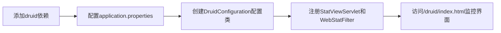
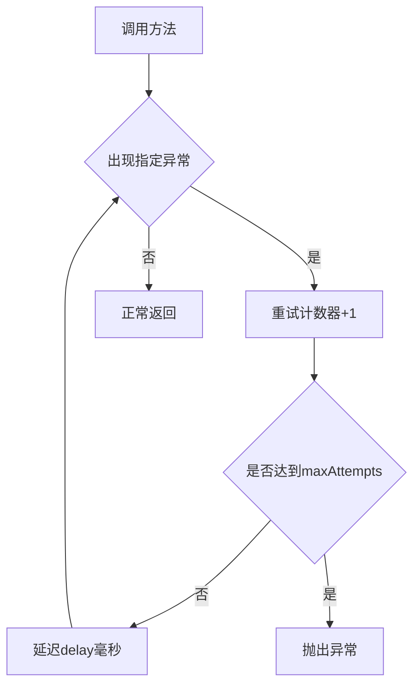
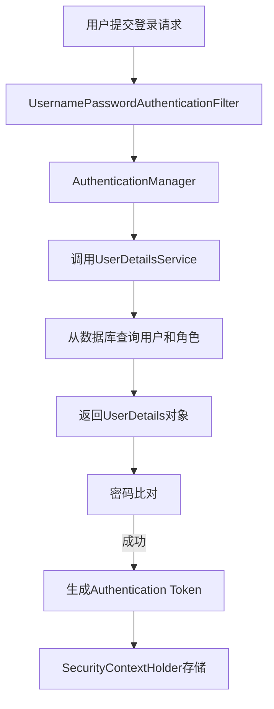
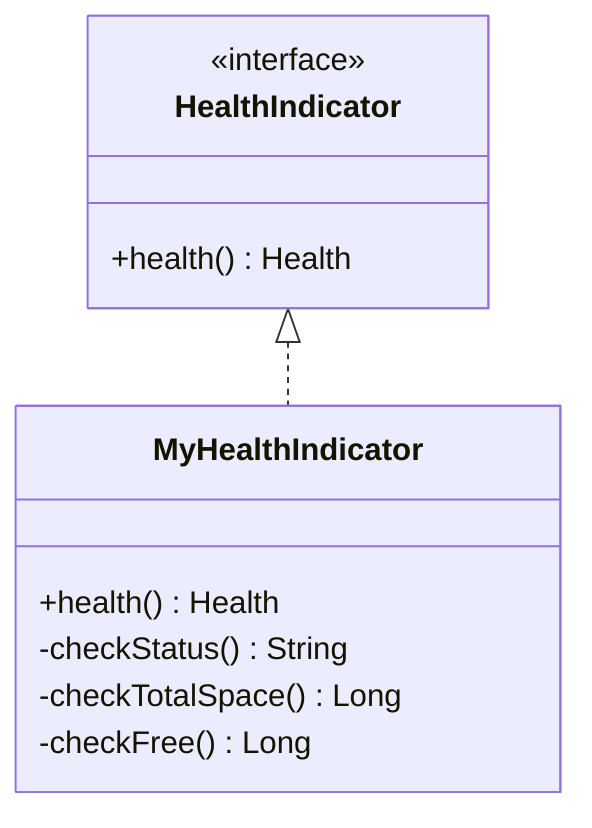
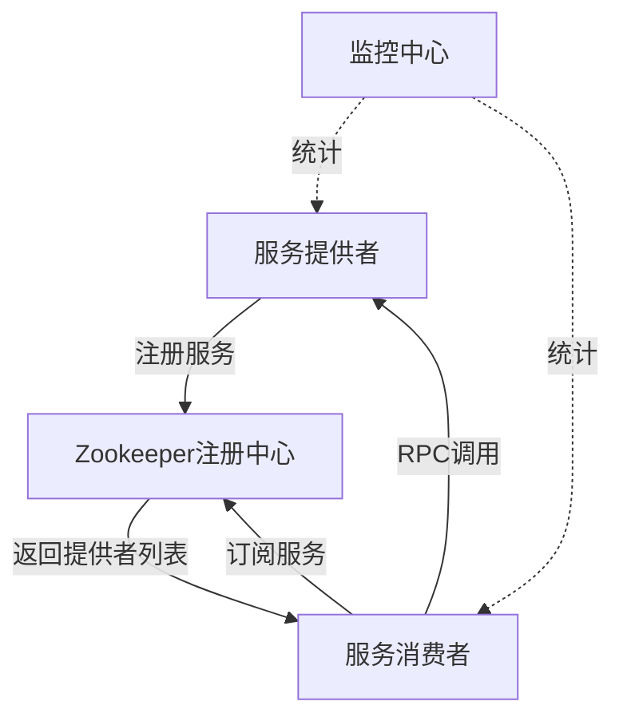
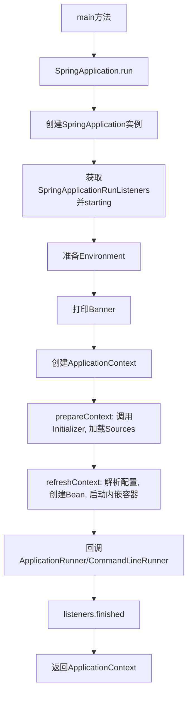

# 《一步一步学Spring Boot 2: 微服务项目实战》章节总结

## 书籍信息

- 书名：一步一步学Spring Boot 2：微服务项目实战
- 作者：黄文毅
- PDF 状态：扫描版/电子版，包含完整的目录、正文、附录
- OCR 状态：可识别文本，部分页码和图表存在识别不完整的情况，但整体结构清晰

## 目录说明

- 目录识别情况：从第10页至第17页完整识别出全书18章的标题及子节
- 章节对应依据：严格按照原书目录顺序（第1章～第18章）
- OCR 修复说明：部分页面（如第223页）存在轻微模糊，但正文内容可完整提取；流程图（如第18章）通过原文描述重建为Mermaid格式

## 全书核心主题

本书以项目实战为主线，带领读者从零开始搭建Spring Boot 2.0开发环境，并逐步集成MySQL、Druid、Spring Data JPA、Thymeleaf、事务、过滤器/监听器、Redis缓存、Log4j日志、Quartz定时器、邮件发送、MyBatis、ActiveMQ异步消息、全局异常处理、MongoDB、Spring Security、应用监控（Actuator）、Dubbo+Zookeeper微服务、多环境配置与部署等热门技术。最后深入解析Spring Boot的自动配置原理和启动流程。全书强调“约定优于配置”，通过完整案例帮助读者掌握微服务项目开发全栈技能。

---

## 第1章：第一个Spring Boot项目

### 核心论点

本章解决从零开始搭建Spring Boot开发环境的问题。作者观点：Spring Boot简化了Spring应用的初始化与开发过程，通过Spring Initializr可以一分钟快速创建项目，并自动生成目录结构、入口类和测试类。

### 关键概念/事件

- **Spring Boot**：目前流行的微服务框架，倡导“约定优先于配置”，提供自动化配置、starter简化Maven依赖、内嵌Servlet容器等功能。
- **@SpringBootApplication**：组合注解，包含@EnableAutoConfiguration、@ComponentScan、@SpringBootConfiguration，位于项目入口类。
- **spring-boot-starter-parent**：特殊starter，提供Maven默认依赖管理，省去版本标签。
- **Maven Helper插件**：用于查看Maven依赖树、分析依赖冲突、快速排除冲突包。

### 逻辑推演/叙事脉络

1. 环境准备：安装JDK 1.8+、IntelliJ IDEA、Apache Maven，并配置Maven本地仓库。
2. 使用Spring Initializr新建项目，选择Web依赖，生成项目名为my-spring-boot。
3. 运行入口类MySpringBootApplication的main方法，启动内嵌Tomcat（默认8080端口）。
4. 介绍工程目录结构：/src/main/java、/src/main/resources（static、templates、application.properties）、/src/test/java。
5. 安装并使用Maven Helper插件，以列表/树形方式查看依赖，高亮显示冲突。

### 经典金句/数据

> “Spring Boot倡导‘约定优先于配置’，其设计目的是用来简化新Spring应用的初始化搭建以及开发过程。”(p.18)

> Spring Boot默认端口为8080，启动日志中可见“Started MySpringBootApplication in 2.356 seconds”。

---

## 第2章：集成MySQL数据库

### 核心论点

本章解决Spring Boot如何连接和操作MySQL数据库的问题。作者观点：通过引入JDBC starter和MySQL驱动，配置application.properties，即可使用JdbcTemplate轻松访问数据库；同时集成阿里巴巴Druid连接池可以增强监控和性能。

### 关键概念/事件

- **JdbcTemplate**：Spring提供的JDBC工具类，简化数据库增删改查。
- **Druid**：阿里巴巴开源数据库连接池，具备监控、扩展性、高性能等特点。
- **Druid监控功能**：通过StatViewServlet和WebStatFilter开启监控页面，可查看数据源、SQL执行情况。
- **白名单/黑名单**：在Druid配置中设置允许访问监控页面的IP范围。

### 逻辑推演/叙事脉络

1. 在pom.xml中添加mysql-connector-java和spring-boot-starter-jdbc依赖。
2. 在application.properties中配置数据库URL、用户名、密码、驱动。
3. 创建表ay_user及实体类AyUser。
4. 编写单元测试，注入JdbcTemplate，执行查询并打印结果。
5. 集成Druid：添加druid依赖，配置数据源类型、连接池参数（initialSize、maxActive等），开启监控功能。
6. 通过http://localhost:8080/druid/index.html访问监控界面，输入预设账号密码登录。

### 流程图（如存在）

无复杂流程图，但可概括Druid监控配置流程：



### 经典金句/数据

> “Druid是一个JDBC组件，包括三部分：DruidDriver代理Driver、DruidDataSource高效数据库连接池、SQLParser。”(p.23)

> 配置示例：`spring.datasource.initialSize=5`，`spring.datasource.maxActive=20`。

---

## 第3章：集成Spring Data JPA

### 核心论点

本章解决如何通过Spring Data JPA简化数据访问层开发的问题。作者观点：Spring Data JPA基于JPA规范，只需定义继承JpaRepository的接口，即可自动实现增删改查、分页和自定义查询方法。

### 关键概念/事件

- **JPA**：Java持久化规范，Hibernate是其实现之一。
- **Repository接口体系**：顶层接口Repository，子接口CrudRepository、PagingAndSortingRepository，最终JpaRepository。
- **@Entity、@Id、@Table**：JPA注解，用于将POJO映射到数据库表。
- **自定义查询方法**：通过方法命名规范（如findByName、findByNameLike、findByIdIn）自动生成SQL。
- **Pageable和Page**：分页抽象，查询时传入PageRequest即可获得分页结果。

### 逻辑推演/叙事脉络

1. 添加spring-boot-starter-data-jpa依赖。
2. 定义AyUserRepository接口继承JpaRepository<AyUser, String>。
3. 在实体类上添加@Entity和@Id注解。
4. 创建AyUserService和AyUserServiceImpl，注入AyUserRepository，实现增删改查及分页方法。
5. 在Repository中自定义findByName、findByNameLike、findByIdIn等方法。
6. 编写单元测试，验证所有方法及分页功能。
7. 使用Assert断言确保数据正确性。

### 经典金句/数据

> “Spring Data JPA通过提供基于JPA的Repository极大地减少了JPA作为数据访问方案的代码量。”(p.29)

> 自定义查询示例：`List<AyUser> findByNameLike(String name);` 等价于 `select u from ay_user u where u.name like ?1`。

---

## 第4章：使用Thymeleaf模板引擎

### 核心论点

本章解决如何在Spring Boot中渲染动态Web页面的问题。作者观点：Thymeleaf是面向Java的HTML5模板引擎，与Spring Boot无缝集成，通过表达式和标签库可以快速构建前端页面。

### 关键概念/事件

- **Thymeleaf表达式**：`${...}`变量表达式、`*{...}`选择表达式、`#{...}`消息表达式、`@{...}`链接表达式。
- **常用标签**：th:each、th:if、th:href、th:text、th:value等。
- **Rest Client工具**：IntelliJ IDEA内置的测试RESTful Web服务的客户端，可模拟HTTP请求。

### 逻辑推演/叙事脉络

1. 添加spring-boot-starter-thymeleaf依赖。
2. 在application.properties中配置Thymeleaf模板模式、缓存关闭（开发阶段）。
3. 创建AyUserController，注入AyUserService，查询用户列表并存入Model，返回视图名“ayUser”。
4. 在/src/main/resources/templates下创建ayUser.html，使用th:each遍历用户列表。
5. 运行项目，访问/ayUser/test，查看渲染结果。
6. 使用Rest Client工具测试Controller接口，验证响应正确性。

### 流程图（如存在）

无复杂流程图。

### 经典金句/数据

> “Thymeleaf是一个优秀的、面向Java的XML/XHTML/HTML5页面模板，具有丰富的标签语言和函数。”(p.41)

> 配置示例：`spring.thymeleaf.cache=false` 用于避免修改模板后重启服务器。

---

## 第5章：Spring Boot事务支持

### 核心论点

本章解决如何在Spring Boot中声明式管理事务的问题。作者观点：通过@Transactional注解即可在类或方法级别开启事务，Spring Boot已自动配置事务管理器，无需额外@EnableTransactionManagement。

### 关键概念/事件

- **声明式事务**：通过AOP将事务管理代码从业务方法中分离，使用@Transactional注解。
- **事务传播行为**：PROPAGATION_REQUIRED、REQUIRES_NEW等7种，定义事务方法间调用策略。
- **隔离级别**：解决脏读、不可重复读、幻读，提供ISOLATION_DEFAULT等5种级别。
- **类级别vs方法级别**：类上@Transactional对所有public方法生效，方法上注解会覆盖类级别。

### 逻辑推演/叙事脉络

1. 在AyUserServiceImpl类上添加@Transactional，开启类级别事务。
2. 在save方法上添加@Transactional并故意抛出NullPointerException。
3. 编写单元测试，执行保存操作。
4. 观察数据库：由于异常发生，事务回滚，数据未插入。
5. 注释掉所有@Transactional，再次执行测试，数据成功插入。

### 经典金句/数据

> “事务管理是企业级应用程序开发中必不可少的技术，用来确保数据的完整性和一致性。”(p.48)

> Spring Boot中无需显式@EnableTransactionManagement，因为DataSourceTransactionManagerAutoConfiguration已默认开启。

---

## 第6章：使用过滤器和监听器

### 核心论点

本章解决如何在Spring Boot中注册和使用Servlet Filter及Listener的问题。作者观点：通过@WebFilter、@WebListener注解并结合@ServletComponentScan，可以自动注册过滤器与监听器，无需web.xml。

### 关键概念/事件

- **Filter**：拦截客户端与服务器资源之间的请求，可实现权限控制、敏感词过滤等功能。
- **FilterChain**：多个Filter形成过滤链，执行顺序遵循先进后出原则。
- **Listener**：Servlet监听器，监听ServletContext、HttpSession、ServletRequest对象的生命周期及属性变化。
- **@ServletComponentScan**：在入口类添加此注解，使@WebFilter、@WebListener等自动生效。

### 逻辑推演/叙事脉络

1. 创建AyUserFilter实现Filter接口，添加@WebFilter注解，指定urlPatterns为“/*”。
2. 在入口类添加@ServletComponentScan。
3. 启动项目，控制台打印init信息；访问任意URL，控制台打印doFilter信息。
4. 创建AyUserListener实现ServletContextListener，添加@WebListener注解，重写contextInitialized和contextDestroyed。
5. 启动项目，控制台打印上下文初始化信息。

### 经典金句/数据

> “Filter也称为过滤器，是处于客户端与服务器资源文件之间的一道过滤网。”(p.55)

> 监听器常用于统计在线人数、系统初始化加载数据、统计网站访问量。

---

## 第7章：集成Redis缓存

### 核心论点

本章解决如何将Redis作为Spring Boot缓存提升数据访问性能的问题。作者观点：通过spring-boot-starter-data-redis和RedisTemplate，可以轻松操作Redis的5种数据类型，并利用监听器在项目启动时加载用户数据到缓存，实现“查询优先读缓存，未命中读数据库并回写缓存”的策略。

### 关键概念/事件

- **Redis数据类型**：string、list、set、zset、hash。
- **RedisTemplate与StringRedisTemplate**：Spring Data Redis提供的模板类，前者默认使用JdkSerializationRedisSerializer，后者使用StringRedisSerializer。
- **缓存预热**：通过ServletContextListener的contextInitialized方法，将数据库所有用户数据存入Redis。
- **缓存更新策略**：在findById中先查Redis，若不存在则查数据库并将结果写入Redis。

### 逻辑推演/叙事脉络

1. 下载安装Redis Windows版，启动redis-server.exe，测试基本数据类型命令。
2. 添加spring-boot-starter-data-redis依赖，配置redis.host、port、database。
3. 编写单元测试，使用RedisTemplate的opsForValue等方法增删改查。
4. 修改AyUserListener，在contextInitialized中查询所有用户，使用opsForList().leftPushAll存入Redis。
5. 让AyUser实现Serializable接口。
6. 修改AyUserServiceImpl的findById方法：先从Redis的list中遍历查找，若不存在则查数据库并leftPush到Redis。
7. 测试：启动项目，数据库数据加载至缓存；新增数据库记录后再次查询，缓存更新。

### 流程图（如存在）

缓存查询流程：

```mermaid
graph TD
    A[findById(id)] --> B{查询Redis List ALL_USER}
    B -->|存在| C[遍历查找匹配id]
    C -->|找到| D[返回用户]
    B -->|不存在| E[查询数据库]
    E --> F[写入Redis List]
    F --> D
```

### 经典金句/数据

> “Redis是一个基于内存的单线程高性能key-value型数据库，读写性能优异。”(p.62)

> 在测试中，缓存命中时响应时间远低于数据库查询（34ms vs 371ms）。

---

## 第8章：集成Log4j日志

### 核心论点

本章解决如何在Spring Boot中使用Log4j2记录日志的问题。作者观点：引入spring-boot-starter-log4j2并排除默认Logback，配置log4j2.xml，即可将日志打印到控制台和文件，替代System.out.println。

### 关键概念/事件

- **Log4j组件**：Loggers（级别：all<debug<info<warn<error<fatal<off）、Appenders（输出目标）、Layouts（输出格式）。
- **日志级别**：只输出级别不低于设定级别的日志。
- **RollingFile**：滚动文件Appender，按时间或大小切割日志文件。
- **Filters**：ThresholdFilter设置最低输出级别。

### 逻辑推演/叙事脉络

1. 在pom.xml中排除spring-boot-starter-logging，添加spring-boot-starter-log4j2。
2. 在application.properties中配置`logging.config=classpath:log4j2.xml`。
3. 创建log4j2.xml，定义Console Appender和RollingFile Appender。
4. 在AyUserListener中使用Logger代替System.out.println记录info日志。
5. 在AyUserServiceImpl的delete方法中添加logger.info记录删除操作。
6. 测试：启动项目，控制台和D:/info.log文件均记录日志。

### 经典金句/数据

> “在应用程序中添加日志记录有三个目的：监视变量变化、跟踪代码运行时轨迹、担当调试器作用。”(p.80)

> 配置示例：`<PatternLayout pattern="[%d{HH:mm:ss:SSS}] [%p] - %l - %m%n"/>`

---

## 第9章：Quartz定时器和发送Email

### 核心论点

本章解决如何在Spring Boot中实现定时任务和邮件发送的问题。作者观点：可以使用XML配置或@Scheduled注解定义Quartz定时器；通过JavaMailSender接口轻松发送邮件，并可与定时器结合实现定时邮件推送。

### 关键概念/事件

- **Quartz核心组件**：Job（任务）、JobDetail（任务描述）、Trigger（触发器）、Scheduler（调度器）。
- **Cron表达式**：定义复杂时间规则，如“0/10 * * * * ?”表示每10秒执行一次。
- **@Scheduled**：注解方式声明定时任务，需配合@EnableScheduling。
- **JavaMailSender**：Spring提供的邮件发送接口，自动配置后可直接注入。

### 逻辑推演/叙事脉络

1. 添加quartz依赖，创建spring-mvc.xml和spring-quartz.xml配置文件，定义Job、JobDetail、Trigger、Scheduler。
2. 创建TestTask定时器类，定义run方法；在入口类添加@ImportResource导入配置文件。
3. 另一方式：创建SendMailQuartz类，添加@Component、@EnableScheduling、@Scheduled(cron="*/5 * * * * ?")。
4. 添加spring-boot-starter-mail依赖，配置邮箱主机、用户名、授权码。
5. 创建SendJunkMailService及其实现类，注入JavaMailSender，构建MimeMessage，设置主题、接收方、内容。
6. 在SendMailQuartz中调用邮件服务，定时给所有用户发送广告邮件。
7. 测试：定时器每5秒执行一次，目标邮箱收到邮件。

### 流程图（如存在）

Quartz执行流程：


### 经典金句/数据

> “CronTrigger可以通过Cron表达式定义出各种复杂时间规则的调度方案，如每早晨9:00执行。”(p.91)

> 邮箱配置示例：`spring.mail.host=smtp.163.com`，授权码为非邮箱登录密码。

---

## 第10章：集成MyBatis

### 核心论点

本章解决如何在Spring Boot中集成MyBatis持久层框架的问题。作者观点：通过mybatis-spring-boot-starter、配置mapper-locations和type-aliases-package，使用@Mapper注解和XML映射文件即可快速实现DAO层。

### 关键概念/事件

- **MyBatis**：优秀的持久层框架，支持定制化SQL、存储过程和高级映射。
- **@Mapper**：标记接口为MyBatis的Mapper，Spring会为其生成代理实现。
- **Mapper XML**：通过namespace绑定接口，使用<select>等标签编写SQL，resultMap映射结果集。
- **MyBatisCodeHelper插件**：可快速生成增删改查代码（书中提及但未深入）。

### 逻辑推演/叙事脉络

1. 添加mybatis-spring-boot-starter依赖。
2. 配置mybatis.mapper-locations=classpath:/mappers/*Mapper.xml，mybatis.type-aliases-package=com.example.demo.dao。
3. 创建AyUserDao接口，添加@Mapper，定义findByNameAndPassword方法。
4. 创建AyUserMapper.xml，编写<select>语句，使用#{name}引用参数。
5. 在AyUserService中添加同名方法，并在实现类中注入AyUserDao并调用。
6. 编写单元测试，验证查询结果。

### 经典金句/数据

> “MyBatis避免了几乎所有的JDBC代码和手动设置参数以及获取结果集。”(p.103)

> 配置示例：`mybatis.mapper-locations=classpath:/mappers/*Mapper.xml`

---

## 第11章：异步消息与异步调用

### 核心论点

本章解决如何利用ActiveMQ实现异步消息处理和Spring Boot异步调用提升系统并发能力的问题。作者观点：通过JMS（ActiveMQ）可以将耗时操作（如发表说说）异步化，减轻数据库压力；而@Async注解可以将同步方法变为异步执行，提高响应速度。

### 关键概念/事件

- **JMS模型**：P2P（点对点队列）和Pub/Sub（发布/订阅主题）。
- **ActiveMQ**：Apache开源消息系统，完全支持JMS规范。
- **@JmsListener**：注解消费者监听指定队列。
- **@Async**：将方法异步执行，需配合@EnableAsync。
- **Future**：异步结果返回，可判断任务是否完成。

### 逻辑推演/叙事脉络

1. 下载安装ActiveMQ，启动后访问admin界面。
2. 添加spring-boot-starter-activemq依赖，配置broker-url等。
3. 创建AyMood（说说实体）、AyMoodRepository、AyMoodService。
4. 创建生产者AyMoodProducer，注入JmsMessagingTemplate，发送消息。
5. 创建消费者AyMoodConsumer，使用@JmsListener监听队列“ay.queue”。
6. 测试发送简单字符串消息，控制台打印消费成功。
7. 改造：将asynSave方法通过生产者发送AyMood实体到队列“ay.queue.asyn.save”，消费者收到后调用save保存到数据库。
8. 测试异步发表说说，数据库成功插入数据。
9. 异步调用@Async：在入口类添加@EnableAsync，在方法上加@Async，比较同步和异步多次查询的耗时（异步节省约104毫秒）。

### 流程图（如存在）

异步发表说说流程：


### 经典金句/数据

> “ActiveMQ是Apache提供的一个开源消息系统，完全采用Java来实现。”(p.110)

> 异步调用测试结果：同步总耗时438毫秒，异步总耗时334毫秒，性能提升约24%。

---

## 第12章：全局异常处理与Retry重试

### 核心论点

本章解决如何统一处理Spring Boot应用中的异常和实现重试机制的问题。作者观点：通过@ControllerAdvice和@ExceptionHandler可以全局处理业务异常，返回统一错误格式；Spring Retry通过@Retryable注解实现方法重试，避免临时故障导致失败。

### 关键概念/事件

- **全局异常处理**：@ControllerAdvice定义全局异常类，@ExceptionHandler指定处理的异常类型。
- **自定义错误页面**：通过EmbeddedServletContainerCustomizer添加404等错误页。
- **BusinessException**：继承RuntimeException，用于封装业务异常。
- **@Retryable**：value指定触发异常，maxAttempts最大重试次数，backoff设置延迟和倍数。
- **@EnableRetry**：开启重试功能。

### 逻辑推演/叙事脉络

1. Spring Boot默认提供/error映射和Whitelabel错误页面。
2. 创建404.html放在static目录下，定义ErrorPageConfig，添加ErrorPage并指定路径，访问不存在URL时显示自定义页面。
3. 创建ErrorInfo类封装错误码、消息、URL。
4. 创建GlobalDefaultExceptionHandler，使用@ControllerAdvice扫描包，@ExceptionHandler捕获BusinessException，返回ErrorInfo。
5. 在Controller中抛出BusinessException，访问后返回JSON错误信息。
6. 添加spring-retry和aspectjweaver依赖，入口类添加@EnableRetry。
7. 在service方法上添加@Retryable(value=BusinessException.class, maxAttempts=5, backoff=@Backoff(delay=5000, multiplier=2))，方法内抛出异常。
8. 访问对应URL，控制台多次打印重试信息，达到最大次数后停止。

### 流程图（如存在）

重试机制流程：



### 经典金句/数据

> “重试的解决方案有很多，比如利用try-catch-redo简单重试模式。”(p.132)

> @Retryable配置：delay=5000, multiplier=2，表示第一次重试延迟5秒，第二次延迟10秒，第三次20秒。

---

## 第13章：集成MongoDB数据库

### 核心论点

本章解决如何在Spring Boot中集成MongoDB非关系型数据库的问题。作者观点：通过spring-boot-starter-data-mongodb，定义实体和继承MongoRepository的接口，即可快速实现增删改查。

### 关键概念/事件

- **MongoDB**：文档型NoSQL数据库，存储格式为BSON，支持动态查询、高伸缩性。
- **MongoRepository**：Spring Data MongoDB提供的Repository接口，继承自PagingAndSortingRepository。
- **NoSQL Manager for MongoDB**：图形化客户端工具。

### 逻辑推演/叙事脉络

1. 下载安装MongoDB，配置环境变量，创建数据目录，启动mongod服务。
2. 安装NoSQL Manager客户端，连接本地MongoDB，使用shell命令练习增删改查。
3. 添加spring-boot-starter-data-mongodb依赖，配置host、port、database。
4. 创建AyUserAttachmentRel实体，添加@Id。
5. 创建AyUserAttachmentRelRepository继承MongoRepository。
6. 创建Service及实现类，注入Repository，调用save方法。
7. 编写单元测试，保存实体，使用Mongo客户端查询验证。

### 经典金句/数据

> “MongoDB是一个高性能、开源、无模式的文档型数据库，是当前NoSQL数据库中比较热门的一种。”(p.136)

> 查询示例：`db.ayUserImageRel.find()` 返回 `{ "_id": "1", "userId": "1", "fileName": "个人简历.doc" }`

---

## 第14章：集成Spring Security

### 核心论点

本章解决如何在Spring Boot中集成Spring Security实现认证和授权的问题。作者观点：通过spring-boot-starter-security，配置WebSecurityConfigurerAdapter，可以快速实现表单登录、内存用户认证；结合数据库用户表、角色表，实现基于数据库的授权登录。

### 关键概念/事件

- **Spring Security**：安全框架，提供认证（你是谁）和授权（你能做什么）功能。
- **@EnableWebSecurity**：开启Web安全功能。
- **UserDetailsService**：自定义用户加载服务，实现loadUserByUsername方法从数据库查询用户和权限。
- **内存用户认证**：使用AuthenticationManagerBuilder的inMemoryAuthentication添加测试用户。
- **角色表设计**：ay_role（角色）、ay_user_role_rel（用户角色关联）。

### 逻辑推演/叙事脉络

1. 添加spring-boot-starter-security依赖。
2. 创建WebSecurityConfig继承WebSecurityConfigurerAdapter，配置formLogin、defaultSuccessUrl、failureUrl。
3. 在configureGlobal中配置两个内存用户（阿毅/ADMIN，阿兰/USER）。
4. 测试：访问需要认证的URL跳转登录页，输入正确账号成功跳转，错误账号跳转/login?error。
5. 创建角色表和关联表，插入数据，生成实体及Repository。
6. 创建CustomUserService实现UserDetailsService，注入AyUserService和角色关联Service，返回User对象（包含用户名、密码和权限列表）。
7. 修改WebSecurityConfig，将CustomUserService注册为Bean，移除内存用户配置，认证由数据库完成。
8. 测试数据库用户登录成功。

### 流程图（如存在）

Spring Security认证流程：



### 经典金句/数据

> “市场上有Apache Shiro和Spring Security等安全框架，Spring Security虽然‘重’，但非常优秀。”(p.145)

> 数据库表ay_user_role_rel结构示例：`('1','1')` 表示用户id=1拥有角色id=1(ADMIN)。

---

## 第15章：Spring Boot应用监控

### 核心论点

本章解决如何监控和管理Spring Boot应用的问题。作者观点：通过spring-boot-starter-actuator模块，可以暴露/health、/metrics、/beans等端点，并通过配置定制端点和保护端点安全。

### 关键概念/事件

- **Actuator端点**：/health（健康）、/beans（Bean列表）、/env（环境变量）、/metrics（指标）、/shutdown（关闭应用）等。
- **management.port**：指定监控端口，与业务端口分离。
- **endpoints.enabled**：可全局开关所有端点，再单独开启需要的端点。
- **自定义端点**：继承AbstractEndpoint，重写invoke方法，返回自定义监控数据。
- **自定义HealthIndicator**：实现HealthIndicator接口，提供更丰富的健康信息。

### 逻辑推演/叙事脉络

1. 添加spring-boot-starter-actuator依赖。
2. 配置management.port=8081（可省略），management.security.enabled=false简化测试。
3. 访问/health、/beans等端点，获取JSON数据。
4. 定制端点：修改endpoints.health.id=myhealth，关闭endpoints.beans.enabled=false等。
5. 创建自定义端点AyUserEndpoint，注入AyUserService，返回当前时间和用户总数。
6. 注册为Bean，访问/userEndPoints获取自定义信息。
7. 创建MyHealthIndicator实现HealthIndicator，返回自定义健康状态和磁盘信息，访问/health时看到自定义字段。
8. 保护端点：在WebSecurityConfig中配置antMatchers("/shutdown").access("hasRole('ADMIN')")，要求管理员权限。

### 流程图（如存在）

自定义HealthIndicator结构：



### 经典金句/数据

> “spring-boot-starter-actuator模块可以有效地减少监控系统在采集应用指标时的开发量。”(p.156)

> 默认/health返回`{"status":"UP"}`，自定义后可返回磁盘总空间、剩余空间等。

---

## 第16章：集成Dubbo和Zookeeper

### 核心论点

本章解决如何将Spring Boot应用拆分为微服务并通过Dubbo+Zookeeper实现服务注册与发现的问题。作者观点：服务提供者将接口注册到Zookeeper，消费者从Zookeeper获取服务地址进行调用，实现服务解耦和分布式治理。

### 关键概念/事件

- **Zookeeper**：分布式协调服务，提供命名服务、配置管理、集群管理、分布式锁。
- **Dubbo**：阿里巴巴开源的高性能RPC框架，支持服务自动注册与发现、软负载均衡。
- **服务拆分**：将原my-spring-boot项目拆分为ay-user-api（接口）、ay-user-service（服务实现）等独立模块。
- **@Service (Dubbo)**：在服务实现类上标记，暴露服务。
- **@Reference**：消费者侧注入远程服务。
- **版本管理**：通过version属性区分服务版本，不兼容升级时使用版本过渡。

### 逻辑推演/叙事脉络

1. 下载安装Zookeeper，复制zoo_sample.cfg为zoo.cfg，启动zkServer。
2. 在my-spring-boot父工程下创建Module：ay-user-api（接口模块）、ay-user-service（服务模块）、ay-mood-api等。
3. 在ay-user-api中定义AyUserDubboService接口和AyUser实体。
4. 将ay-user-api发布为正式版jar（version=0.0.1），使用maven install。
5. 在ay-user-service中添加ay-user-api依赖和spring-boot-starter-dubbo依赖。
6. 实现AyUserDubboServiceImpl，添加dubbo的@Service(version="1.0")，在方法中模拟查询用户。
7. 配置dubbo注册中心地址（zookeeper://127.0.0.1:2181）。
8. 启动ay-user-service，服务自动注册到Zookeeper。
9. 在my-spring-boot（作为客户端）中添加ay-user-api和dubbo依赖，使用@Reference(version="1.0")注入远程服务。
10. 测试客户端调用远程服务成功。

### 流程图（如存在）

Dubbo服务注册与调用流程：



### 经典金句/数据

> “Zookeeper的一个最常用的使用场景是担任服务生产者和服务消费者的注册中心。”(p.170)

> Dubbo版本号管理：`@Service(version="1.0")` 和 `@Reference(version="1.0")` 必须一致。

---

## 第17章：多环境配置与部署

### 核心论点

本章解决如何实现开发、测试、生产等多环境配置隔离以及将Spring Boot应用部署到外部Tomcat的问题。作者观点：通过application-{profile}.properties文件和多环境激活，可以轻松切换配置；将项目打包成war并部署到外部Tomcat，便于运维管理。

### 关键概念/事件

- **多环境配置文件**：application-dev.properties、application-test.properties、application-perform.properties。
- **spring.profiles.active**：激活指定环境，如dev、test。
- **打包方式**：将pom.xml中的jar改为war。
- **外置Tomcat部署**：通过IDEA配置Tomcat，将war包部署到Tomcat的webapps目录。

### 逻辑推演/叙事脉络

1. 复制application.properties为application-dev.properties、application-test.properties、application-perform.properties。
2. 修改每个文件的数据库连接（test、test2、test3）。
3. 在application.properties中配置`spring.profiles.active=dev`，激活开发环境。
4. 使用Navicat导出test数据库SQL，导入到test2和test3。
5. 切换active为test，重启应用，验证连接的是test2数据库。
6. 修改pom.xml中`<packaging>war</packaging>`。
7. 在IDEA中配置Tomcat Server，选择本地Tomcat路径，添加my-spring-boot:war exploded。
8. 执行maven clean package生成war包，启动Tomcat，访问应用成功。

### 经典金句/数据

> “不同的环境往往会连接不同的MySQL数据库、Redis缓存、MQ消息中间件等，环境之间相互独立与隔离才不会相互影响。”(p.183)

> 部署示例：war包置于Tomcat的webapps目录，访问路径为`http://localhost:8080/my-spring-boot-0.0.1-SNAPSHOT/`。

---

## 第18章：Spring Boot原理解析

### 核心论点

本章解决Spring Boot背后自动配置和启动流程的原理问题。作者观点：入口类上的@SpringBootApplication组合了@Configuration、@EnableAutoConfiguration、@ComponentScan；run方法通过创建SpringApplication实例，加载监听器、准备环境、创建上下文、刷新上下文等步骤完成启动。

### 关键概念/事件

- **@SpringBootApplication**：复合注解，包含@SpringBootConfiguration（@Configuration）、@EnableAutoConfiguration（借助@Import加载自动配置）、@ComponentScan。
- **SpringApplication.run**：启动入口，内部创建SpringApplication对象，调用其run方法。
- **SpringApplicationRunListener**：监听Spring Boot启动生命周期（starting、environmentPrepared、contextPrepared、contextLoaded、finished）。
- **ApplicationContextInitializer**：在refresh前对上下文进行初始化。
- **ApplicationRunner & CommandLineRunner**：容器启动后最后一步回调，可用于执行初始化逻辑。
- **spring-boot-starter原理**：起步依赖本质上是一个Maven POM，定义了对其他库的传递依赖，简化项目依赖管理。

### 逻辑推演/叙事脉络

1. 入口类MySpringBootApplication上有@SpringBootApplication等注解。
2. 分解@SpringBootApplication：@SpringBootConfiguration（等同@Configuration），@EnableAutoConfiguration（通过@Import(EnableAutoConfigurationImportSelector.class)加载所有自动配置类），@ComponentScan（扫描组件）。
3. main方法调用SpringApplication.run(MySpringBootApplication.class, args)。
4. run方法内部：
   - 创建Stopwatch并启动。
   - 获取SpringApplicationRunListeners并调用starting()。
   - 准备Environment环境。
   - 打印Banner。
   - 创建ApplicationContext（根据web环境创建AnnotationConfigServletWebServerApplicationContext）。
   - 准备上下文：applyInitializers调用ApplicationContextInitializer，然后调用contextPrepared等。
   - 刷新上下文（refreshContext），加载所有配置，启动内嵌容器。
   - 回调ApplicationRunner和CommandLineRunner。
   - 调用listeners.finished，返回context。
5. spring-boot-starter-xxx：如spring-boot-starter-web传递依赖spring-webmvc、jackson、tomcat等，无需手动管理版本。

### 流程图（如存在）

Spring Boot启动流程：



### 经典金句/数据

> “@SpringBootApplication是一个复合注解，包含@SpringBootConfiguration、@EnableAutoConfiguration、@ComponentScan三个注解。”(p.193)

> “Spring Boot启动流程中，最重要的是refreshContext步骤，它完成了IoC容器的初始化和内嵌Servlet容器的启动。”

---

# 附录：教学视频说明

- 本书附赠12堂教学视频，总播放时长120分钟。
- 视频内容涵盖：课程介绍、快速搭建项目、集成MySQL、集成MyBatis、整合Quartz定时器、整合Redis缓存、整合ActiveMQ消息、整合Swagger、整合过滤器Filter、整合监听器Listener、全局异常处理、常用标签使用。
- 下载地址：https://pan.baidu.com/s/1A5xjEcvE5A2T6I5bmAmkYQ
- 扫描二维码也可获取资源（见原书第9页）。