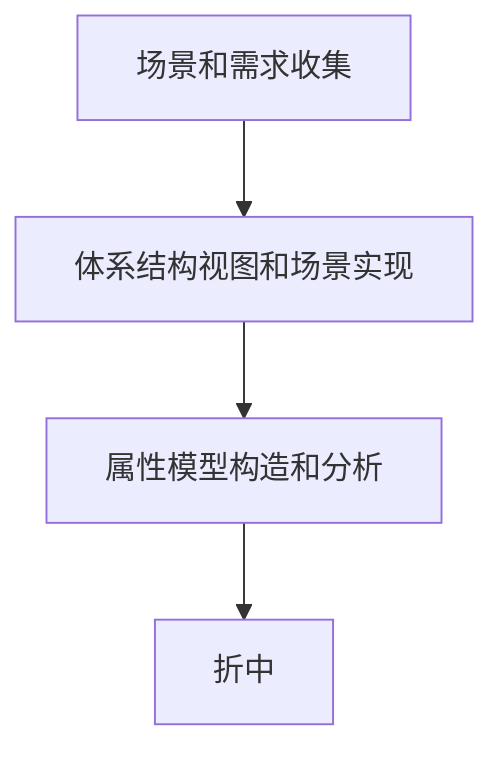
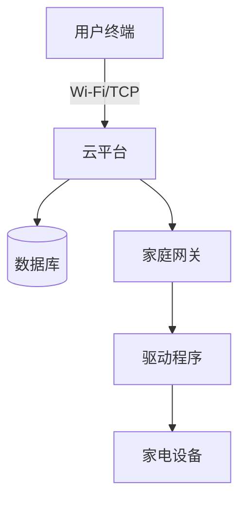

# 系统架构设计师与项目管理师真题解析知识档案

## 书籍信息
- **书名**：系统架构设计师/信息系统项目管理师 历年真题解析汇编（2016-2021）
- **作者/来源**：51CTO学堂（邹月平、薛大龙等讲师解析）
- **PDF 状态**：多份独立真题解析文档合并
- **OCR 状态**：良好，部分图表需逻辑重建

## 目录说明
本档案基于上传的5份PDF文件整理，涵盖2016、2018、2019、2021年系统架构设计师案例及选择题，以及2021年高项运筹学题目。由于原文件为真题解析而非传统章节书籍，以下按**年份及考试科目**进行结构化重组，提炼核心考点与解题逻辑。

- **2016年系统架构设计师案例分析**：软件架构风格选择、质量属性识别。
- **2018年系统架构设计师真题解析**：操作系统、数据库、嵌入式、架构评估、设计模式。
- **2019年系统架构设计师真题解析**：进程管理、存储管理、网络安全、数据库理论、架构风格、ABSD方法。
- **2021年系统架构设计师真题解析**：前趋图、页面置换、银行家算法、E-R图冲突、SoC、嵌入式、SDN、敏捷开发、RUP、架构评估、面向对象建模。
- **2021年高项运筹学专题**：动态规划、投资分配、动态投资回收期、相关性分析。

## 全书核心主题
本资料集核心围绕**软件系统架构设计**与**工程项目管理量化分析**两大领域。在架构方面，重点考察软件架构风格（如管道-过滤器、数据仓储、解释器、规则系统）的选择依据、质量属性（性能、可用性、安全性、可修改性）的场景识别与战术策略、以及特定领域架构（DSSA）和基于架构的软件设计（ABSD）方法。在工程与管理方面，涵盖操作系统原理（进程调度、存储管理）、数据库设计与优化（规范化、反规范化、缓存一致性）、网络安全机制、著作权法以及项目管理中的运筹学计算（最短路径、关键路径、动态投资回收）。旨在通过真题解析，建立从理论到实践的系统化知识体系，提升解决复杂工程问题的能力。

---

## 2016年系统架构设计师案例分析

### 核心论点
本章通过手机应用程序集成开发环境（IDE）的案例，重点讨论**数据仓储架构风格**与**管道-过滤器架构风格**的选择依据，以及软件质量属性的识别。作者认为，对于需要支持多种模型转换、数据集成且要求界面风格一致的IDE系统，数据仓储风格优于管道-过滤器风格，因为前者更利于共享数据和模块间解耦。

### 关键概念/事件
- **管道-过滤器风格**：数据流风格，构件独立，数据线性流动，适合批处理或编译过程，但难以支持复杂的数据交互和随机访问。
- **数据仓储风格**：以中央数据结构（数据库/黑板）为核心，独立构件通过访问中央数据源进行交互。适合IDE、CAD等需要共享大量状态数据的系统。
- **质量属性场景**：
    - **性能**：模型转换时间不超过5秒。
    - **可用性**：连续运行240小时，10秒内自动重启。
    - **可修改性**：用户配置界面风格无需重启。
    - **安全性**：云端存储数据的机密性和完整性。

### 逻辑推演/叙事脉络
案例首先列出IDE的8项需求（a-h）。架构师小张主张管道-过滤器，王工主张数据仓储。
1. **需求分析**：需求(a)指出模块产生模型格式差异大，需数据集成；需求(d)要求配置即时生效；需求(e)要求模型自动转换。
2. **风格对比**：
   - 管道-过滤器：数据流线性，构件间无状态共享，难以实现“数据集成”和“随机访问”，扩展需改变数据流结构。
   - 数据仓储：星型交互，数据集中管理，构件通过适配器与仓库交互，易于实现数据共享、版本控制和界面统一。
3. **决策**：最终采用王工方案（数据仓储），因为其更符合IDE对数据共享和模块独立性的要求。
4. **架构图填充**：识别出中央数据存储（模型/数据库）、编辑器、数据格式转换器、应用模拟器等组件。

### 经典金句/数据
> “管道-过滤器风格中，数据自由流动或近线性流动；而数据仓储风格中，构件通过中央共享数据源进行交互。”
> “IDE集成开发环境典型采用数据仓储（数据共享）风格。”

---

## 2018年系统架构设计师真题解析

### 核心论点
本章覆盖广泛的基础理论与架构设计考点，核心在于**嵌入式系统特性**、**磁盘调度算法**、**软件架构评估方法（ATAM/SAAM）**以及**设计模式的应用**。强调在特定约束下（如低功耗、实时性）选择合适的技术栈和架构策略。

### 关键概念/事件
- **磁盘调度**：最短移臂优先算法（SSTF），先移臂后旋转。
- **文件系统索引**：二级索引结构，最大文件长度计算（块大小/指针大小）^2。
- **DSP处理器**：采用哈佛结构，程序与数据存储空间分离，并行执行。
- **ATAM评估方法四个阶段**场景和需求收集、体系结构视图和场景实现、属性模型构造和分析、折中。
- **解释器架构风格**：适用于需要支持用户自定义规则或脚本的场景（如游戏地图编辑），牺牲性能换取灵活性。

### 逻辑推演/叙事脉络
1. **底层硬件与OS**：通过磁盘调度题考察磁头移动逻辑；通过文件系统题考察索引结构容量计算；通过DSP题考察哈佛结构与冯·诺依曼结构的区别（并行vs串行）。
2. **网络与安全**：CRC校验码计算（模2除法）；DNS反向解析（PTR记录）；DHCP冲突处理（Decline报文）。
3. **架构设计**：
   - 对比瘦客户端与胖客户端C/S架构，瘦客户端更利于维护升级和跨平台（满足需求a, b, g）。
   - 大型多人即时战略游戏需支持玩家自定义地图，故选**解释器风格**；并发响应要求属**性能**属性；二次开发时间属**可修改性**属性。
4. **设计模式**：抽象工厂（创建型）、桥接模式（结构型，分离抽象与实现）、命令模式（行为型，封装请求）。

### 流程图/图表处理

#### ATAM评估流程

### 经典金句/数据
> “解释器风格缺点是执行效率比较低，优点是灵活性高，支持自定义规则。”
> “哈佛结构将存储器空间划分成两个，分别存储程序和数据，允许同时访问。”

---

## 2019年系统架构设计师真题解析

### 核心论点
本章重点考察**进程同步与前趋图**、**存储管理页面置换**、**数据库函数依赖与分解**、**软件架构风格对比**以及**基于架构的软件设计（ABSD）**。强调理论计算与架构决策的结合，特别是在数据一致性和系统可靠性方面的权衡。

### 关键概念/事件
- **前趋图**：有向无环图，表示进程执行的先后顺序关系。
- **页面置换算法**：逻辑地址转物理地址（页号+页内偏移）；淘汰策略（访问位、修改位）。
- **函数依赖**：Armstrong公理，无损连接分解，保持函数依赖分解。
- **分布式数据库模式**：全局概念模式定义整体逻辑结构，如同没有分布。
- **ABSD方法六个子过程**：需求、设计、文档化、复审、实现、演化。

### 逻辑推演/叙事脉络
1. **操作系统计算**：
   - 前趋图：根据图示箭头方向确定边集合，注意起点和终点。
   - 地址变换：4K页面=12位页内地址，剩余高位为页号。查表得物理块号，拼接页内地址。
   - 页面淘汰：优先淘汰未被访问（访问位0）且未被修改（修改位0）的页面。
2. **数据库理论**：
   - 函数依赖推导：利用传递律判断隐含依赖。
   - 分解判断：检查交集是否能决定其中一个子集（无损连接），检查分解后的依赖集是否覆盖原依赖集（保持依赖）。
3. **架构风格对比**：
   - 管道-过滤器 vs 数据仓储：从交互方式（星型vs线性）、数据结构（共享vs流动）、控制结构（数据驱动vs调用返回）、扩展方法（适配vs重组）四个方面对比。
4. **ABSD方法**：文档化阶段输出规格说明书和质量设计说明书；复审阶段由外部人员参与，识别风险。

### 经典金句/数据
> “全局概念模式定义分布式数据库中数据的整体逻辑结构，使得数据使用方便，如同没有分布一样。”
> “ABSD方法是体系结构驱动，采用视角与视图描述架构，用例描述功能需求，质量场景描述质量需求。”

---

## 2021年系统架构设计师真题解析

### 核心论点
本章聚焦于**现代软件开发方法与架构评估**，包括敏捷思想、RUP过程、UML建模、微服务与云平台架构、以及机器学习平台的架构风格选择。强调在云原生和AI背景下，架构师需关注系统的可扩展性、灵活性和运维效率。

### 关键概念/事件
- **前趋图与银行家算法**：进程安全状态判断，资源分配策略。
- **E-R图冲突**：属性冲突（类型/取值范围不同）、结构冲突（同一对象在不同应用中抽象不同）、命名冲突。
- **SoC（系统级芯片）**：软硬件协同设计，面向特定用途定制。
- **SDN架构**：应用层、控制层、转发层（数据平面），不包含逻辑层。
- **机器学习平台架构**：拖拽式流程定义，适合**解释器风格**（灵活定义规则/流程）或**管道-过滤器**（数据流处理），但考虑到灵活定义和扩展，解释器更优。
- **Redis数据类型与应用**：ZSet用于排名；缓存穿透/雪崩解决方案（空值缓存、热点数据永不过期、集群预热）。

### 逻辑推演/叙事脉络
1. **基础理论**：
   - 银行家算法：计算剩余资源，尝试分配给尚需资源最小的进程，判断是否存在安全序列。
   - E-R图合并：解决属性冲突通常保留各自属性或统一标准；结构冲突需统一抽象层次。
2. **Web与云架构**：
   - 智能家居系统：对比家庭网关（本地处理、低延迟但管理分散）与云平台（集中管理、大数据挖掘、容灾性强）。选择云平台因其在数据处理和远程管理上的优势。
   - 通信协议：TCP可靠、面向连接，适合控制指令；UDP不可靠、无连接，适合实时视频流（若容忍丢包）。本题强调双向可靠通信，选TCP。
3. **架构评估**：
   - 效用树构建：将具体需求映射到性能、可用性、安全性、可修改性等质量属性。
   - 机器学习平台：用户拖拽组件定义流程，本质是执行自定义的逻辑脚本，故**解释器风格**最合适，因其支持动态规则重组和高可扩展性。

### 流程图/图表处理

#### 智能家居云平台架构

### 经典金句/数据
> “解释器风格可以通过灵活的自定义规则实现规则的重组，适合机器学习流程定义的灵活性需求。”
> “云平台可以将分散的智能家居网关数据集中起来，实现对智能家居网关的远程高效管理。”

---

## 2021年高项66-70题（通用知识点-运筹学）

### 核心论点
本章专门针对信息系统项目管理师考试中的**定量分析**部分，涵盖设备更新策略、投资分配优化、动态投资回收期计算及相关性分析。核心在于掌握动态规划和净现值（NPV）计算方法，以支持项目决策。

### 关键概念/事件
- **设备更新问题**：动态规划，比较不同年份更换设备的总成本（购置费+维护费），寻找最小值。
- **投资分配**：边际效益分析或动态规划，计算各方向投入产出比，优先投入高回报率方向。
- **动态投资回收期**：考虑资金时间价值，计算累计净现值为正所需的年份。
- **相关性系数**：负相关表示一个变量增加另一个减少，系数为负值。

### 逻辑推演/叙事脉络
1. **设备更新**：
   - 第1年换新：成本9万。
   - 第2年换新：9万(新) + 0(第1年维护) = 9万？不，需计算5年总成本。
   - 策略：列举所有可能的更换时间点组合，计算5年总支出。例如，一直不换：9 + 0+6+7+8+8 = 38万。第2年初换：9(旧第1年维护0) + 9(新) + 0+6+7 = 31? 需仔细核对题目表格数据。
   - 题目解析指出最优为37万元，通常涉及在第3年或第4年更换的策略组合。
2. **投资分配**：
   - 计算各方向每增加100万的边际利润。
   - 方向B投100万时产出比最高（500/100=5），优先投B。
   - 方向C次之，方向A再次。
   - 根据总额500万，按边际效益递减原则分配，得出A投300万，B投100万等组合。
3. **动态投资回收期**：
   - 计算每年净现金流量。
   - 乘以折现系数（1/(1+i)^n）得到净现值。
   - 计算累计净现值。
   - 插值法计算具体年份：T = (累计净现值出现正值的年数 - 1) + (上年累计净现值绝对值 / 当年净现值)。

### 经典金句/数据
> “动态投资回收期考虑了资金的时间价值，比静态投资回收期更准确反映项目经济效益。”
> “相关性系数为负值（如-0.83）表示两个变量呈强负相关。”