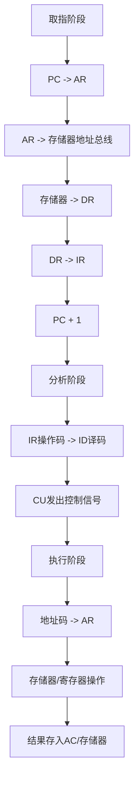
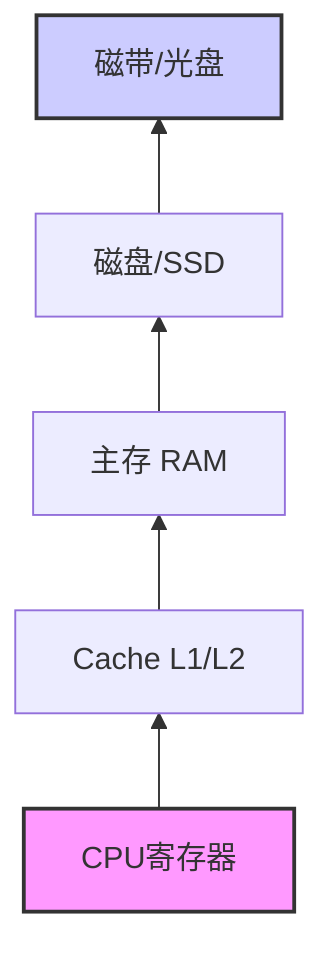
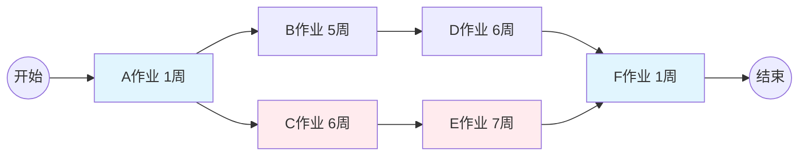
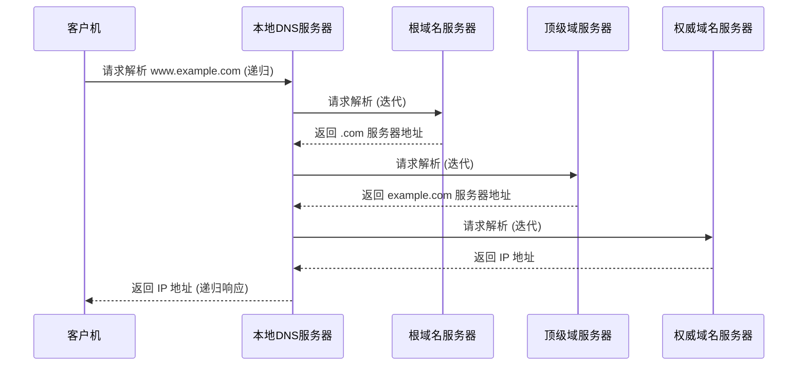
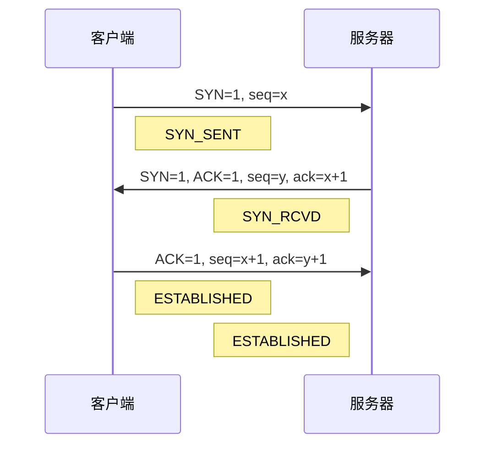
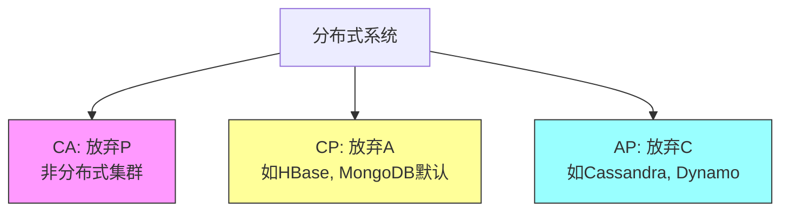
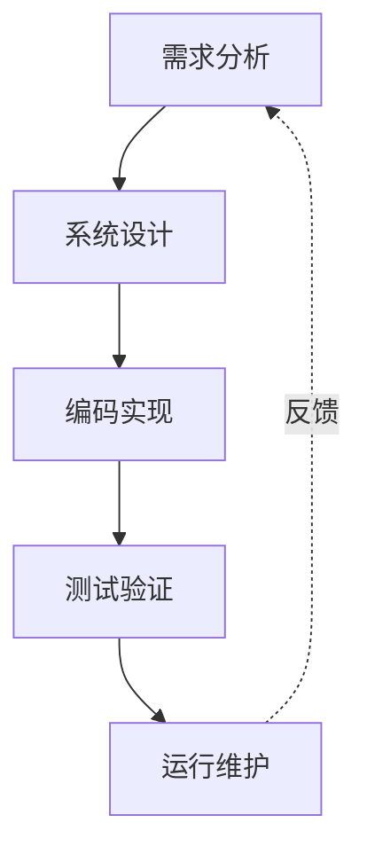
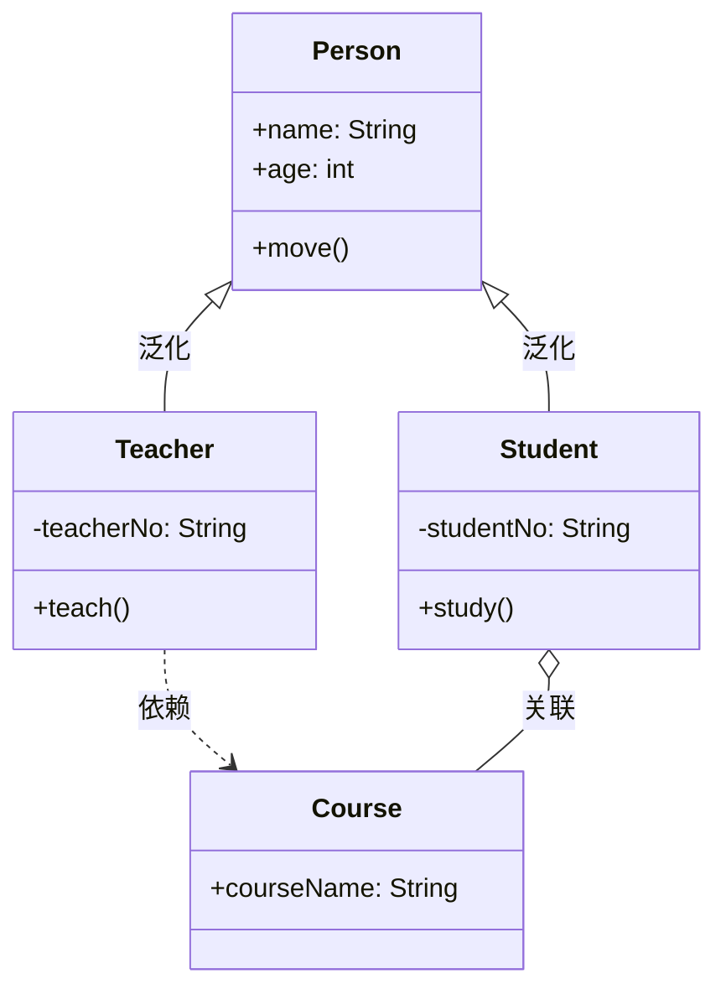
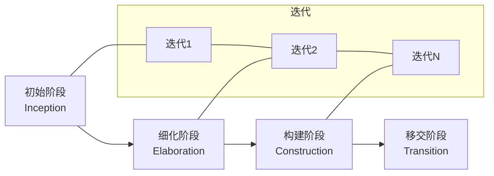

# 计算机技术与软件工程核心知识体系章节总结

## 书籍信息

- **书名**：计算机基础、运筹学、计算机网络基础、NoSQL数据库、软件工程基础（架构）综合讲义
- **作者/讲师**：邹月平（51CTO学院）
- **PDF 状态**：多份独立课件合并，内容涵盖计算机组成原理、运筹学、网络、数据库及软件工程。
- **OCR 状态**：文本识别基本完整，部分图表需通过文字描述还原逻辑。

## 目录说明

本总结基于上传的五份PDF文件内容整合而成，按照技术领域划分为五个主要模块，每个模块内部遵循原课件的逻辑顺序进行结构化梳理。

1. **模块一：计算机基础**（对应 `技术类-计算机基础.pdf`）
2. **模块二：运筹学优化方法**（对应 `技术类--运筹学.pdf`）
3. **模块三：计算机网络基础**（对应 `技术类--计算机网络基础.pdf`）
4. **模块四：NoSQL数据库技术**（对应 `技术类-Nosql数据库.pdf`）
5. **模块五：软件工程与系统架构**（对应 `技术类-软件工程基础（架构）V3.0.pdf`）

## 全书核心主题

本系列资料旨在构建计算机科学与技术工程的完整知识底座。从底层的冯·诺依曼体系结构、指令执行流程、存储层次结构出发，深入探讨数据校验与纠错机制；进而引入运筹学方法，解决项目管理中的进度规划、资源分配及成本优化问题；在网络层面，解析OSI七层模型、TCP/IP协议栈、IP地址规划及网络存储技术；在数据存储领域，对比关系型数据库与NoSQL数据库的适用场景，重点阐述CAP理论与BASE理论；最后，从软件工程视角出发，涵盖结构化与面向对象开发方法、UML建模、软件生命周期管理、CMM/CMMI成熟度模型以及主流软件架构视图。整体内容强调理论与实践结合，旨在培养具备系统思维、工程化能力及架构设计能力的专业技术人才。

---

## 模块一：计算机基础

### 1. 核心论点

本章主要解决计算机硬件工作原理及数据表示的基础问题。作者核心观点是：理解冯·诺依曼体系结构、CPU指令执行周期、存储器层次结构及数据校验机制，是掌握计算机系统运行本质的关键。

### 2. 关键概念/事件

- **冯·诺依曼体系**：计算机由运算器、控制器、存储器、输入设备、输出部件组成；指令和数据以同等地位存于存储器；指令由操作码和地址码组成。
- **CPU组成**：
    - **运算器**：ALU（算术逻辑单元）、AC（累加寄存器）、DR（数据缓冲寄存器）、PSW（状态条件寄存器）。
    - **控制器**：PC（程序计数器）、IR（指令寄存器）、ID（指令译码器）、AR（地址寄存器）。
- **存储器编址与扩展**：内存按字节编址，通过地址线数量确定寻址范围，通过芯片组合实现容量扩展（位扩展与字扩展）。
- **校验码**：
    - **奇偶校验**：仅能检测奇数个位出错。
    - **海明码**：利用多重奇偶校验实现检错和纠错，满足 $2^k \ge n + k + 1$。
    - **CRC循环冗余校验**：基于模2除法（异或运算），用于检测数据传输错误。
- **指令流水线**：将指令执行分为取指、分析、执行等阶段并行处理，提高吞吐率。流水线周期取决于最长的一段执行时间。
- **Cache高速缓存**：利用局部性原理（时间、空间）解决CPU与主存速度差异。映射方式包括直接映像、全相联映像、组相联映像。替换算法包括LRU、FIFO等。
- **磁盘存储**：存取时间 = 寻道时间 + 等待时间 + 读写时间。RAID技术通过冗余和并行提高性能与可靠性（RAID 0, 1, 5, 10等）。

### 3. 逻辑推演/叙事脉络

本章首先介绍冯·诺依曼计算机的基本组成和工作原理，明确指令与数据的存储方式。接着深入CPU内部，详细拆解运算器和控制器的各个寄存器功能，并通过真题分析指令执行过程中各寄存器的作用。随后，转向存储器系统，讲解内存编址计算、芯片扩展方法，以及为了保证数据可靠性而采用的各种校验码技术（奇偶、海明、CRC）。在此基础上，引入提升性能的机制——指令流水线和高速缓存（Cache），分析其工作原理、命中率计算及替换策略。最后，讨论外存系统，特别是磁盘的物理结构、存取时间计算以及RAID磁盘阵列的不同级别及其优缺点，形成从内到外、从原理到应用的完整硬件知识链。

### 4. 经典金句/数据

> “指令和数据以同等地位存于存储器，可按地址寻访。”
> “流水线周期：执行时间最长的一段。”
> “Cache的平均访问时间 $t_a = H_c t_c + (1-H_c) t_m$。”
> “RAID 5用户空间为N-1块盘容量；RAID 10结合RAID 0的高效率和RAID 1的高可靠性。”

### 5. 流程图/图表重建

#### CPU指令执行周期

#### 存储器层次结构

---

## 模块二：运筹学优化方法

### 1. 核心论点

本章主要解决项目管理与资源分配中的最优化问题。作者核心观点是：通过建立数学模型（如线性规划、网络图、指派问题），可以科学地确定项目关键路径、最大利润方案及最小成本策略，从而实现决策的科学化。

### 2. 关键概念/事件

- **进度网络图与关键路径**：识别项目中耗时最长的路径（关键路径），决定项目总工期。非关键路径上的活动拥有时差。
- **线性规划**：在约束条件下（资源限制），求目标函数（如利润最大化、成本最小化）的最优解。常用图解法或单纯形法思想。
- **工序排序问题**：在多道工序、多个产品的生产安排中，通过优化顺序减少总等待时间，通常遵循“首个设计时间短的优先，末个检验时间短的靠后”原则。
- **指派问题**：将n项任务分配给n个人，每人一项，使总成本最小或总效率最高。常用匈牙利算法求解。
- **运输问题**：在多个供应点和多个需求点之间分配物资，使总运输成本最低。常用最小元素法或伏格尔法求解初始解。

### 3. 逻辑推演/叙事脉络

本章从项目管理的进度控制入手，通过网络图找出关键路径，分析工期延误对项目的影响。接着进入资源优化领域，通过线性规划案例展示如何在有限资源下实现利润最大化。随后，针对生产调度问题，探讨如何通过合理安排工序顺序来缩短总工期。进一步深入到具体的任务分配场景，利用指派问题的矩阵变换方法寻找最优人员-任务匹配。最后，以物流运输为例，讲解如何在多源多汇的情况下计算最低运输成本。整个章节体现了从时间管理到资源管理，再到具体操作优化的层层递进逻辑。

### 4. 经典金句/数据

> “关键路径决定了项目的最短工期。”
> “线性规划中，最优解通常出现在可行域的顶点上。”
> “指派问题中，任一行或列各元素加减常数不影响最优解的位置。”

### 5. 流程图/图表重建

#### 关键路径法示例逻辑

*注：若A->C->E->F耗时 1+6+7+1=15周，A->B->D->F耗时 1+5+6+1=13周，则ACEF为关键路径。*

---

## 模块三：计算机网络基础

### 1. 核心论点

本章主要解决网络通信的标准、协议及基础设施设计问题。作者核心观点是：理解OSI七层模型与TCP/IP四层模型的对应关系，掌握IP地址规划、子网划分、路由选择及网络存储技术，是构建高效、安全企业网络的基础。

### 2. 关键概念/事件

- **OSI参考模型**：物理层、数据链路层、网络层、传输层、会话层、表示层、应用层。口诀：“物数网传会表应”。
- **TCP/IP协议族**：
    - **应用层**：HTTP, FTP, SMTP, DNS, DHCP。
    - **传输层**：TCP（可靠、面向连接、三次握手）、UDP（不可靠、无连接、高效）。
    - **网络层**：IP（寻址、路由）、ICMP（ping）、ARP（IP转MAC）。
- **IP地址与子网掩码**：IPv4分类（A/B/C/D/E），子网划分（VLSM/CIDR），通过掩码计算网络号、广播号及可用主机数。
- **IPv6**：128位地址，解决IPv4耗尽问题，支持自动配置、更高安全性。过渡技术：双栈、隧道、NAT-PT。
- **DNS域名系统**：递归查询（客户机到本地服务器）、迭代查询（服务器之间）。记录类型：A, MX, CNAME等。
- **网络设计三层模型**：
    - **核心层**：高速转发，避免策略控制。
    - **汇聚层**：路由汇总、策略控制、协议转换。
    - **接入层**：用户接入、MAC认证、VLAN划分。
- **网络存储**：DAS（直连）、NAS（文件级、网络接入）、SAN（块级、专用光纤/以太网）。

### 3. 逻辑推演/叙事脉络

本章首先确立网络通信的理论框架，对比OSI七层模型与TCP/IP四层模型，明确各层功能及代表协议。随后深入网络层核心，详细讲解IPv4地址结构、子网划分计算方法及IPv6的演进优势。接着探讨应用层关键服务DNS的工作原理及查询过程。在传输层，对比TCP与UDP的特性及适用场景。之后，从工程角度介绍企业网络的三层架构设计原则，明确各层设备的功能定位。最后，补充综合布线系统标准及主流网络存储技术（DAS/NAS/SAN）的区别，形成从协议原理到工程实施的完整知识闭环。

### 4. 经典金句/数据

> “TCP提供可靠的、面向连接的字节流服务；UDP提供不可靠的、无连接的数据报服务。”
> “核心层应尽量避免使用数据包过滤和策略路由，以保证高速转发。”
> “NAS基于文件共享，SAN基于块存储。”

### 5. 流程图/图表重建

#### DNS查询过程（递归+迭代）

#### TCP三次握手

---

## 模块四：NoSQL数据库技术

### 1. 核心论点

本章主要解决大规模数据高并发读写、海量数据存储及高扩展性问题。作者核心观点是：传统关系型数据库在应对Web 2.0大数据场景时存在瓶颈，NoSQL通过放弃强一致性（ACID）或部分事务特性，换取高性能、高可用性和易扩展性（BASE理论）。

### 2. 关键概念/事件

- **关系型数据库瓶颈**：高并发I/O瓶颈、海量数据查询效率低、横向扩展困难。
- **CAP理论**：分布式系统无法同时满足一致性（C）、可用性（A）、分区容错性（P）。通常保证CP或AP。
- **BASE理论**：基本可用（Basically Available）、软状态（Soft state）、最终一致性（Eventually consistent）。
- **NoSQL四大类型**：
    - **键值数据库**（Redis）：高性能缓存，简单数据模型。
    - **列族数据库**（HBase, Cassandra）：适合海量数据分布式存储，列式存储。
    - **文档数据库**（MongoDB）：半结构化数据，JSON格式，灵活模式。
    - **图形数据库**（Neo4j）：处理高度关联数据，社交网络推荐。
- **ACID vs BASE**：ACID强调强一致性，适用于金融等场景；BASE强调可用性，适用于互联网大规模应用。

### 3. 逻辑推演/叙事脉络

本章首先剖析传统关系型数据库在互联网高并发、海量数据场景下的局限性，引出NoSQL产生的背景。接着引入分布式系统的核心理论CAP，解释为何需要在一致性与可用性之间做出权衡，并由此导出BASE理论。随后，详细分类介绍四种主流NoSQL数据库（键值、列族、文档、图形）的数据模型、典型应用场景及优缺点。最后，通过对比SQL与NoSQL在数据类型、一致性、事务、扩展性等方面的差异，帮助读者根据具体业务需求选择合适的数据库技术。

### 4. 经典金句/数据

> “鱼与熊掌不可兼得：一个分布式系统不可能同时满足一致性、可用性、分区容忍性这三个需求。”
> “NoSQL = Not Only SQL，意即‘不仅仅是SQL’。”
> “键值数据库无法通过值来查询，也不支持复杂的事务。”

### 5. 流程图/图表重建

#### CAP理论权衡

---

## 模块五：软件工程与系统架构

### 1. 核心论点

本章主要解决软件开发的工程化、规范化及架构设计问题。作者核心观点是：软件开发应从手工作坊走向工程化，通过标准化的生命周期管理、合适的开发模型（瀑布、敏捷、RUP等）及科学的架构设计（4+1视图），提高软件质量、降低维护成本并应对复杂性。

### 2. 关键概念/事件

- **软件危机与软件工程**：从程序设计时代到软件工程时代的演变，强调方法、过程、工具的结合。
- **软件开发方法**：
    - **结构化方法**：自顶向下，逐层分解，面向数据流（DFD），适用于数据处理系统。
    - **面向对象方法**：以对象为中心，封装、继承、多态，使用UML建模（用例图、类图、时序图等）。
    - **构件化开发**：基于复用构件组装，提高开发效率。
    - **面向服务（SOA）**：松散耦合，服务总线ESB。
- **开发模型**：
    - **瀑布模型**：严格阶段化，文档驱动，难以适应变化。
    - **原型模型**：快速构建原型，明确需求。
    - **螺旋模型**：引入风险分析，迭代开发。
    - **敏捷开发**：以人为本，迭代增量，Scrum/XP。
    - **RUP统一过程**：用例驱动、以架构为中心、迭代增量，四个阶段（初始、细化、构建、移交）。
- **UML建模**：
    - **静态图**：类图、对象图、组件图、部署图。
    - **动态图**：用例图、序列图、协作图、状态图、活动图。
    - **关系**：依赖、关联、聚合、组合、泛化、实现。
- **软件架构**：
    - **4+1视图**：逻辑视图、进程视图、物理视图、开发视图、场景（用例）视图。
- **质量管理**：CMM/CMMI能力成熟度模型，从初始级到优化级的五个等级。

### 3. 逻辑推演/叙事脉络

本章首先回顾软件危机的历史，确立软件工程化的必要性。接着对比几种主流的开发范式：结构化方法的严谨性与面向对象方法的灵活性，并简述构件化与服务化的演进。随后，详细梳理各类软件开发模型，从传统的瀑布模型到现代的敏捷开发与RUP，分析其适用场景。重点展开UML统一建模语言，介绍如何通过多种视图描述系统的静态结构与动态行为。进而深入软件架构设计，引入Kruchten的4+1视图模型，展示如何全方位描述复杂系统。最后，介绍软件过程改进的标准CMM/CMMI，强调过程管理对质量的保障作用。

### 4. 经典金句/数据

> “软件工程三要素：方法、过程、工具。”
> “面向对象的核心：封装、继承、多态。”
> “4+1视图中，场景（用例）视图驱动其他四个视图的设计。”
> “CMMI 3级已定义级：过程已标准化，并可从组织标准中剪裁。”

### 5. 流程图/图表重建

#### 软件生命周期（瀑布模型简化版）

#### UML类图关系示例

#### RUP统一过程阶段

